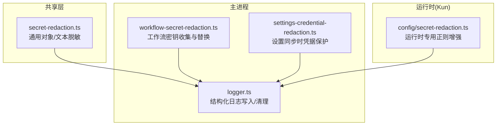
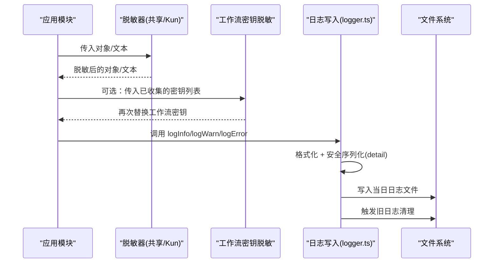
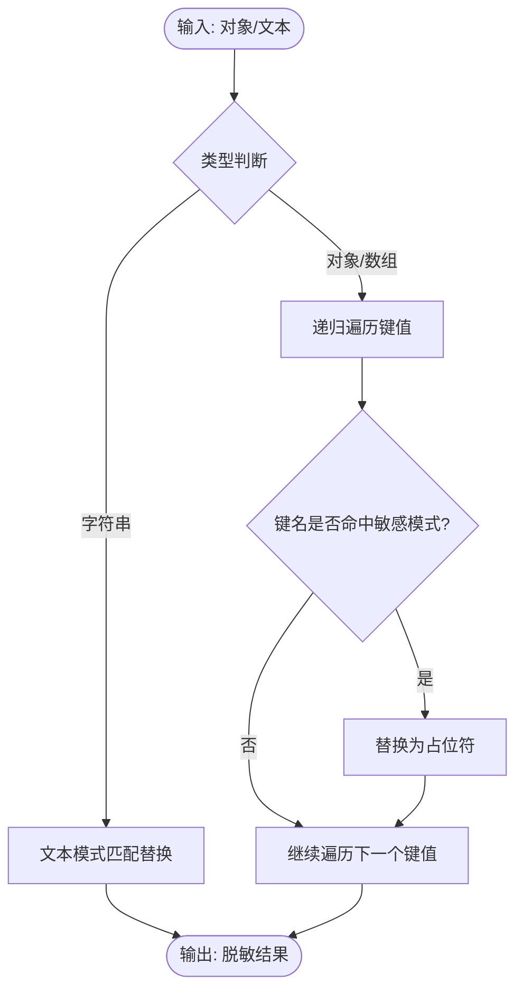
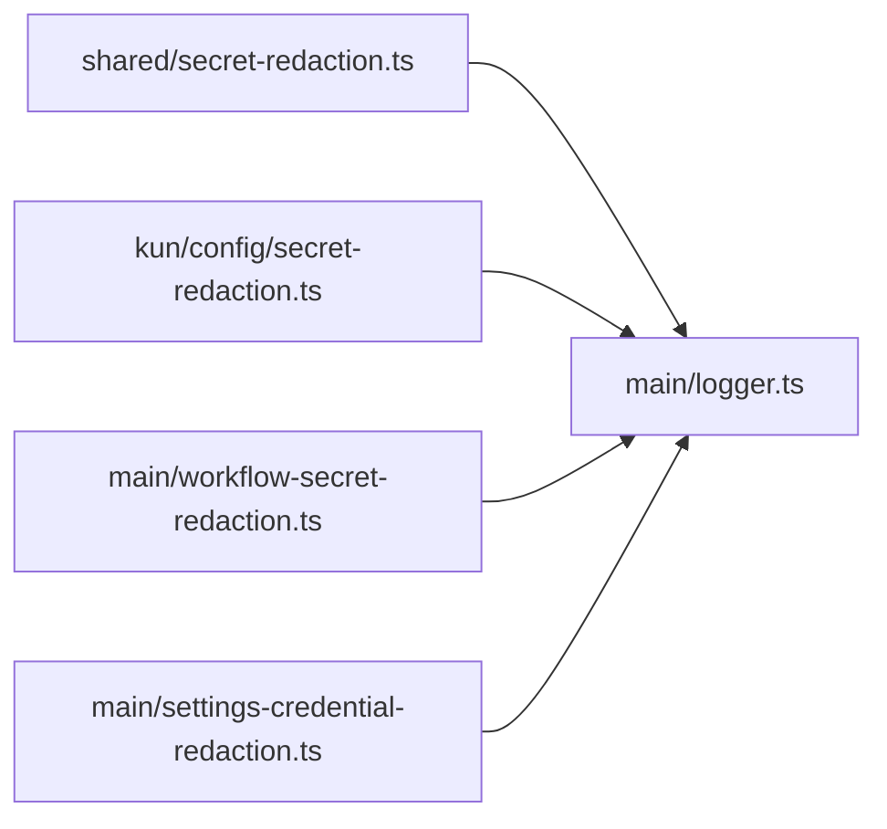

# 日志脱敏机制

<cite>
**本文引用的文件**
- [src/shared/secret-redaction.ts](file://src/shared/secret-redaction.ts)
- [kun/src/config/secret-redaction.ts](file://kun/src/config/secret-redaction.ts)
- [src/main/workflow-secret-redaction.ts](file://src/main/workflow-secret-redaction.ts)
- [src/shared/secret-redaction.test.ts](file://src/shared/secret-redaction.test.ts)
- [src/main/logger.ts](file://src/main/logger.ts)
- [src/main/settings-credential-redaction.ts](file://src/main/settings-credential-redaction.ts)
</cite>

## 目录
1. [简介](#简介)
2. [项目结构](#项目结构)
3. [核心组件](#核心组件)
4. [架构总览](#架构总览)
5. [详细组件分析](#详细组件分析)
6. [依赖关系分析](#依赖关系分析)
7. [性能考量](#性能考量)
8. [故障排除指南](#故障排除指南)
9. [结论](#结论)
10. [附录：配置示例与最佳实践](#附录：配置示例与最佳实践)

## 简介
本文件系统性说明 DeepSeek-GUI 的日志脱敏机制，覆盖敏感字段自动识别、动态替换策略、日志输出安全、自定义规则配置以及调试与监控。目标是在不牺牲可观测性的前提下，确保任何包含密钥、令牌、密码等敏感信息的日志都不会被持久化或外泄。

## 项目结构
日志脱敏相关能力分布在共享层、主进程与运行时（Kun）中：
- 共享层提供通用的对象与文本脱敏工具，供多端复用
- 主进程负责结构化日志写入与旧日志清理
- 工作流（Workflow）场景下对配置的密钥值进行二次脱敏
- 设置同步时对“空字符串”的保留逻辑避免误删凭据

图表来源
- [src/shared/secret-redaction.ts:1-37](file://src/shared/secret-redaction.ts#L1-L37)
- [src/main/logger.ts:1-120](file://src/main/logger.ts#L1-L120)
- [src/main/settings-credential-redaction.ts:1-90](file://src/main/settings-credential-redaction.ts#L1-L90)
- [src/main/workflow-secret-redaction.ts:1-17](file://src/main/workflow-secret-redaction.ts#L1-L17)
- [kun/src/config/secret-redaction.ts:1-37](file://kun/src/config/secret-redaction.ts#L1-L37)

章节来源
- [src/shared/secret-redaction.ts:1-37](file://src/shared/secret-redaction.ts#L1-L37)
- [src/main/logger.ts:1-120](file://src/main/logger.ts#L1-L120)
- [src/main/settings-credential-redaction.ts:1-90](file://src/main/settings-credential-redaction.ts#L1-L90)
- [src/main/workflow-secret-redaction.ts:1-17](file://src/main/workflow-secret-redaction.ts#L1-L17)
- [kun/src/config/secret-redaction.ts:1-37](file://kun/src/config/secret-redaction.ts#L1-L37)

## 核心组件
- 通用脱敏器（共享层）
  - 基于键名模式匹配递归脱敏对象中的敏感字段
  - 基于文本模式匹配替换内联的授权头、Bearer 令牌、键值对形式的 token/password 等
- 运行时脱敏器（Kun）
  - 在共享层基础上增强正则，支持更严格的引号与边界处理，避免误伤
- 工作流密钥脱敏
  - 从用户配置中收集所有类型为 secret 的环境变量值，并在日志文本中进行批量替换
- 结构化日志写入
  - 统一格式化时间戳、级别、分类与消息；对 detail 字段做安全序列化并截断长度
  - 按天分文件落盘，启动时及每次写入后执行旧日志清理
- 设置同步保护
  - 当渲染层因脱敏将凭据置为空串时，主进程在设置合并阶段恢复原值，防止误删 OAuth/API 绑定

章节来源
- [src/shared/secret-redaction.ts:1-37](file://src/shared/secret-redaction.ts#L1-L37)
- [kun/src/config/secret-redaction.ts:1-37](file://kun/src/config/secret-redaction.ts#L1-L37)
- [src/main/workflow-secret-redaction.ts:1-17](file://src/main/workflow-secret-redaction.ts#L1-L17)
- [src/main/logger.ts:1-120](file://src/main/logger.ts#L1-L120)
- [src/main/settings-credential-redaction.ts:1-90](file://src/main/settings-credential-redaction.ts#L1-L90)

## 架构总览
日志脱敏贯穿“数据准备—脱敏—写入—归档”全链路：

图表来源
- [src/shared/secret-redaction.ts:1-37](file://src/shared/secret-redaction.ts#L1-L37)
- [kun/src/config/secret-redaction.ts:1-37](file://kun/src/config/secret-redaction.ts#L1-L37)
- [src/main/workflow-secret-redaction.ts:1-17](file://src/main/workflow-secret-redaction.ts#L1-L17)
- [src/main/logger.ts:1-120](file://src/main/logger.ts#L1-L120)

## 详细组件分析

### 敏感字段自动识别算法
- 键名模式匹配
  - 使用大小写不敏感的关键词集合（如 api-key、authorization、bearer、client-secret、password、secret、token 等）匹配对象键名，命中即替换为固定占位符
  - 递归遍历对象与数组，保证深层嵌套也能被识别
- 文本模式匹配
  - 针对常见内联格式进行替换：键=值形式、Authorization: Bearer ...、Bearer <token> 等
  - 保持前缀（如 Bearer）可见，仅替换实际令牌部分
- 运行时增强
  - 在 Kun 侧提供更严格的正则，考虑引号与边界字符，减少误替换风险

图表来源
- [src/shared/secret-redaction.ts:1-37](file://src/shared/secret-redaction.ts#L1-L37)
- [kun/src/config/secret-redaction.ts:1-37](file://kun/src/config/secret-redaction.ts#L1-L37)

章节来源
- [src/shared/secret-redaction.ts:1-37](file://src/shared/secret-redaction.ts#L1-L37)
- [kun/src/config/secret-redaction.ts:1-37](file://kun/src/config/secret-redaction.ts#L1-L37)

### 动态替换策略（实时、批量与性能优化）
- 实时脱敏
  - 在日志构造阶段对对象与文本立即脱敏，避免后续环节泄露
- 批量处理
  - 工作流场景下先收集所有 secret 类型的 env 值，再对整段日志文本进行批量替换，降低重复扫描开销
- 性能优化要点
  - 对象递归仅在必要时进行；字符串替换使用预编译的正则链顺序执行
  - 日志 detail 字段序列化后进行长度截断，避免超大 payload 影响 IO
  - 日志文件按日切分，配合启动与写入时的旧日志清理，控制磁盘占用

章节来源
- [src/main/workflow-secret-redaction.ts:1-17](file://src/main/workflow-secret-redaction.ts#L1-L17)
- [src/main/logger.ts:1-120](file://src/main/logger.ts#L1-L120)

### 日志输出安全（结构化、过滤与审计）
- 结构化日志格式
  - 统一包含 ISO 时间戳、级别、分类与消息体，便于检索与分析
- 敏感信息过滤
  - 通过共享/运行时的脱敏器对对象与文本双重过滤
  - 工作流密钥在写入前进行二次替换，确保配置中的真实密钥不出现在日志中
- 审计日志记录
  - 日志写入失败不会导致应用崩溃，保障可用性
  - 启动时执行一次旧日志清理，并记录清理动作到日志，便于审计追踪

章节来源
- [src/main/logger.ts:1-120](file://src/main/logger.ts#L1-L120)
- [src/main/workflow-secret-redaction.ts:1-17](file://src/main/workflow-secret-redaction.ts#L1-L17)

### 自定义脱敏规则配置（用户定义模式、优先级与验证）
- 用户定义模式
  - 当前实现以内置键名与文本模式为主；如需扩展，可在共享层与 Kun 层的正则集中新增模式
- 优先级管理
  - 文本替换按正则顺序执行，建议将更具体、更安全的模式置于前面，避免宽泛模式误伤
- 规则验证
  - 通过单元测试覆盖典型用例，确保新规则不会引入误替换或遗漏

章节来源
- [src/shared/secret-redaction.ts:1-37](file://src/shared/secret-redaction.ts#L1-L37)
- [kun/src/config/secret-redaction.ts:1-37](file://kun/src/config/secret-redaction.ts#L1-L37)
- [src/shared/secret-redaction.test.ts:1-23](file://src/shared/secret-redaction.test.ts#L1-L23)

### 调试与监控（效果验证、指标与错误处理）
- 脱敏效果验证
  - 使用现有测试用例验证对象键名与内联文本的脱敏行为是否符合预期
- 性能指标收集
  - 建议在关键路径埋点统计：对象递归次数、字符串替换次数、detail 截断次数、日志 IO 耗时
- 错误处理
  - 日志写入异常被捕获且不影响主流程；旧日志清理失败也静默忽略，确保健壮性

章节来源
- [src/shared/secret-redaction.test.ts:1-23](file://src/shared/secret-redaction.test.ts#L1-L23)
- [src/main/logger.ts:1-120](file://src/main/logger.ts#L1-L120)

## 依赖关系分析
- 共享层脱敏器被主进程与运行时共同引用
- 工作流密钥脱敏在主进程侧聚合配置并作用于日志文本
- 设置同步保护避免渲染层脱敏导致的凭据丢失

图表来源
- [src/shared/secret-redaction.ts:1-37](file://src/shared/secret-redaction.ts#L1-L37)
- [kun/src/config/secret-redaction.ts:1-37](file://kun/src/config/secret-redaction.ts#L1-L37)
- [src/main/workflow-secret-redaction.ts:1-17](file://src/main/workflow-secret-redaction.ts#L1-L17)
- [src/main/logger.ts:1-120](file://src/main/logger.ts#L1-L120)
- [src/main/settings-credential-redaction.ts:1-90](file://src/main/settings-credential-redaction.ts#L1-L90)

章节来源
- [src/shared/secret-redaction.ts:1-37](file://src/shared/secret-redaction.ts#L1-L37)
- [kun/src/config/secret-redaction.ts:1-37](file://kun/src/config/secret-redaction.ts#L1-L37)
- [src/main/workflow-secret-redaction.ts:1-17](file://src/main/workflow-secret-redaction.ts#L1-L17)
- [src/main/logger.ts:1-120](file://src/main/logger.ts#L1-L120)
- [src/main/settings-credential-redaction.ts:1-90](file://src/main/settings-credential-redaction.ts#L1-L90)

## 性能考量
- 对象递归深度与广度受数据结构影响，建议在高吞吐路径避免传递过深的敏感对象
- 文本替换采用正则链，注意模式顺序与复杂度，避免回溯爆炸
- 日志 detail 序列化后截断，避免大对象造成 IO 压力
- 日志按日切分与定期清理，控制磁盘增长

[本节为通用指导，无需特定文件来源]

## 故障排除指南
- 现象：日志中仍出现密钥
  - 检查是否在写入前调用了共享/运行时的脱敏函数
  - 检查工作流密钥是否已通过 collectWorkflowSecretValues 收集并用于 redactWorkflowSecrets
- 现象：设置保存后凭据丢失
  - 确认使用了 preserveRedactedProviderCredentials 进行设置合并，避免将渲染层脱敏的空串当作用户清空操作
- 现象：日志文件过多或过大
  - 检查 retentionDays 配置是否正确
  - 确认 pruneOnStartup 与每次写入后的清理逻辑生效

章节来源
- [src/main/workflow-secret-redaction.ts:1-17](file://src/main/workflow-secret-redaction.ts#L1-L17)
- [src/main/settings-credential-redaction.ts:1-90](file://src/main/settings-credential-redaction.ts#L1-L90)
- [src/main/logger.ts:1-120](file://src/main/logger.ts#L1-L120)

## 结论
DeepSeek-GUI 的日志脱敏机制通过“键名+文本”的双重识别、工作流密钥的二次替换、结构化日志的安全序列化与落盘、以及设置同步的凭据保护，形成了端到端的敏感信息防护闭环。结合单元测试与日志清理策略，既保证了安全性，又兼顾了可维护性与性能。

[本节为总结性内容，无需特定文件来源]

## 附录：配置示例与最佳实践
- 在调用日志接口前，对对象使用通用脱敏器进行预处理
- 对可能包含内联令牌的文本，使用文本脱敏函数进行处理
- 在工作流场景中，先收集 secret 类型的 env 值，再对最终日志文本进行批量替换
- 在设置同步路径，始终使用凭据保护函数合并补丁，避免误删
- 定期审查与更新脱敏正则，确保覆盖新的密钥命名约定与传输格式

[本节为实践建议，无需特定文件来源]