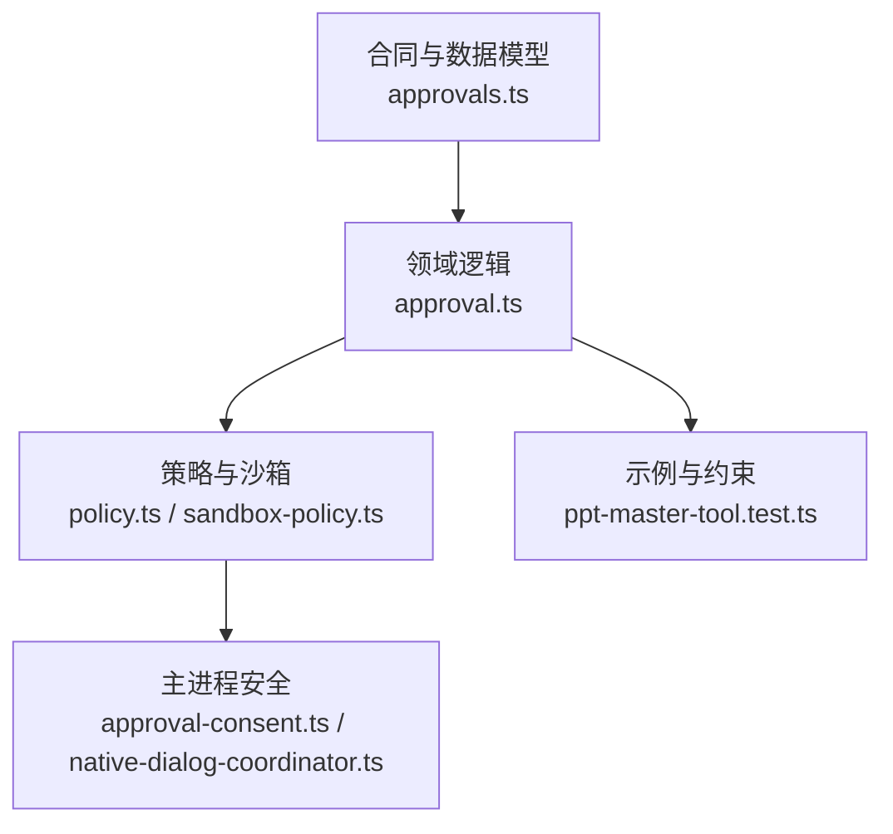
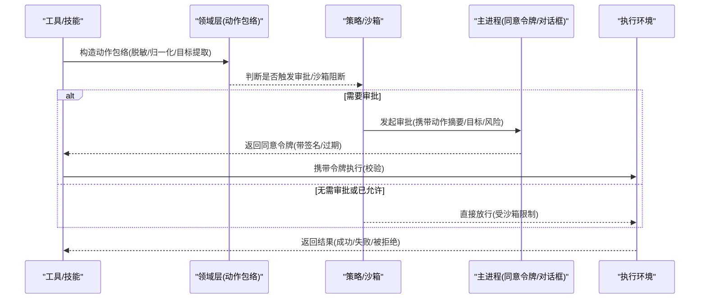
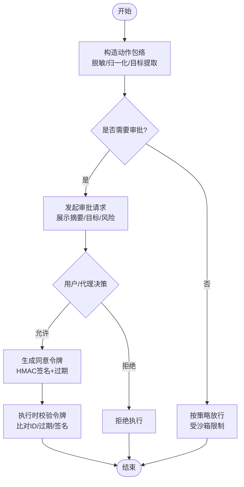
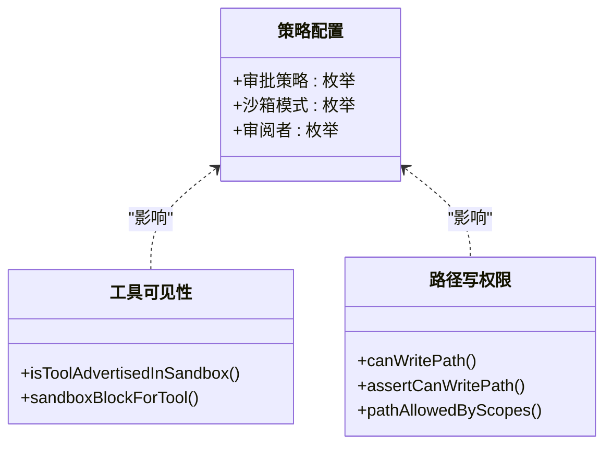
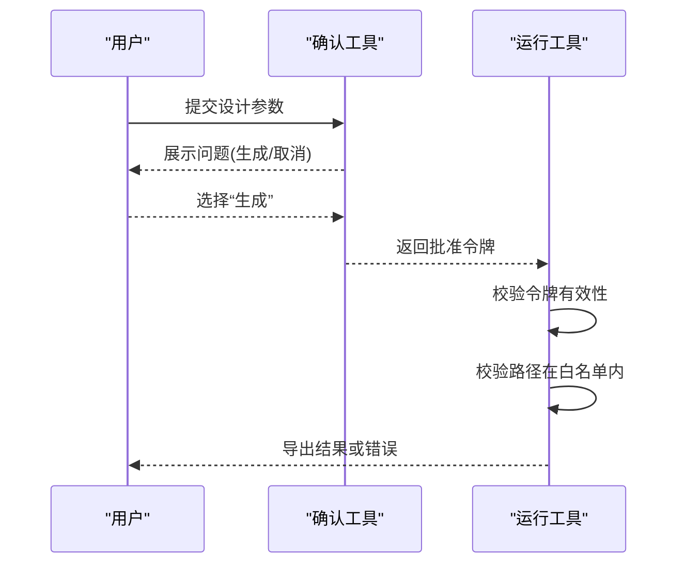
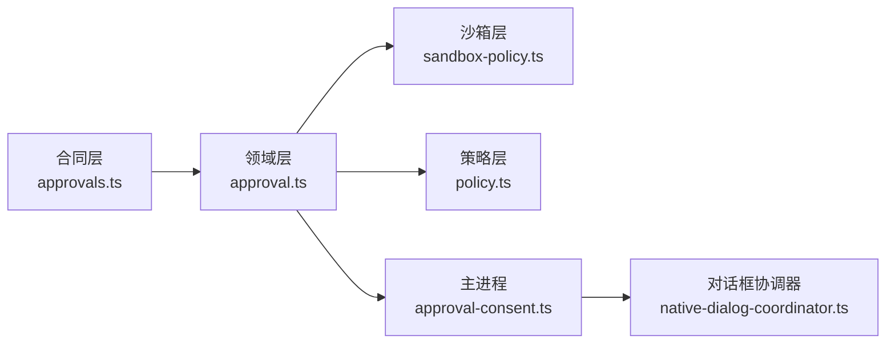

# 敏感操作保护

<cite>
**本文引用的文件**
- [approvals.ts](file://kun/src/contracts/approvals.ts)
- [approval.ts](file://kun/src/domain/approval.ts)
- [policy.ts](file://kun/src/contracts/policy.ts)
- [sandbox-policy.ts](file://kun/src/adapters/tool/sandbox-policy.ts)
- [approval-consent.ts](file://src/main/approval-consent.ts)
- [native-dialog-coordinator.ts](file://src/main/native-dialog-coordinator.ts)
- [ppt-master-tool.test.ts](file://kun/src/adapters/tool/ppt-master-tool.test.ts)
</cite>

## 目录
1. [简介](#简介)
2. [项目结构](#项目结构)
3. [核心组件](#核心组件)
4. [架构总览](#架构总览)
5. [详细组件分析](#详细组件分析)
6. [依赖关系分析](#依赖关系分析)
7. [性能考虑](#性能考虑)
8. [故障排除指南](#故障排除指南)
9. [结论](#结论)
10. [附录](#附录)

## 简介
本文件系统性说明 DeepSeek-GUI 的“敏感操作保护”机制，覆盖以下方面：
- 敏感操作的识别标准与分类（文件系统写入、网络请求、设备访问、系统命令执行等）
- 危险操作警告机制（用户提示、风险说明、操作预览）
- 二次确认流程（确认对话框、意图验证、防误操作）
- 用户授权记录（操作日志、审计追踪、合规报告）
- 安全策略配置（默认级别、自定义规则、例外处理）
- 测试方法与故障排除

该机制通过“动作包络 + 审批流 + 沙箱策略 + 同意令牌”的组合，确保高风险操作在可观测、可审计、可限制的前提下执行。

## 项目结构
与敏感操作保护相关的代码主要分布在以下模块：
- 合同与数据模型：定义审批动作、目标、决策、状态等统一数据结构
- 领域逻辑：构建安全的“动作包络”，进行参数归一化、敏感信息脱敏、目标提取
- 策略与沙箱：定义权限模式、沙箱模式、工具可见性与路径写权限判定
- 主进程安全：生成带签名的审批同意令牌，协调原生对话框串行执行
- 示例与约束：以 PPT Master 工具为例，展示“设计确认 + 令牌校验 + 路径白名单”的落地方式

**图表来源**
- [approvals.ts:1-87](file://kun/src/contracts/approvals.ts#L1-L87)
- [approval.ts:1-604](file://kun/src/domain/approval.ts#L1-L604)
- [policy.ts:1-129](file://kun/src/contracts/policy.ts#L1-L129)
- [sandbox-policy.ts:1-301](file://kun/src/adapters/tool/sandbox-policy.ts#L1-L301)
- [approval-consent.ts:1-29](file://src/main/approval-consent.ts#L1-L29)
- [ppt-master-tool.test.ts:1-329](file://kun/src/adapters/tool/ppt-master-tool.test.ts#L1-L329)

**章节来源**
- [approvals.ts:1-87](file://kun/src/contracts/approvals.ts#L1-L87)
- [policy.ts:1-129](file://kun/src/contracts/policy.ts#L1-L129)

## 核心组件
- 审批动作包络（ApprovalActionEnvelope）：对工具调用进行有界化、脱敏、目标抽取，形成可持久化、可自动审查的安全视图
- 审批请求与决议（ApprovalRequest/Decision）：承载待决事项、时间戳、结果与原因
- 策略与沙箱（Policy/Sandbox）：定义默认策略、权限模式、沙箱模式及工具可见性、路径写权限判定
- 同意令牌（Approval Consent Token）：主进程生成的带签名、过期时间的审批同意凭证
- 原生对话框协调器（NativeDialogCoordinator）：保证同一 WebContents 的原生对话框串行执行，避免竞态

**章节来源**
- [approval.ts:1-604](file://kun/src/domain/approval.ts#L1-L604)
- [policy.ts:1-129](file://kun/src/contracts/policy.ts#L1-L129)
- [sandbox-policy.ts:1-301](file://kun/src/adapters/tool/sandbox-policy.ts#L1-L301)
- [approval-consent.ts:1-29](file://src/main/approval-consent.ts#L1-L29)
- [native-dialog-coordinator.ts:1-54](file://src/main/native-dialog-coordinator.ts#L1-L54)

## 架构总览
下图展示了从“工具调用”到“审批与执行”的关键链路，以及策略与沙箱的介入点。

**图表来源**
- [approval.ts:144-227](file://kun/src/domain/approval.ts#L144-L227)
- [policy.ts:1-129](file://kun/src/contracts/policy.ts#L1-L129)
- [sandbox-policy.ts:128-236](file://kun/src/adapters/tool/sandbox-policy.ts#L128-L236)
- [approval-consent.ts:6-28](file://src/main/approval-consent.ts#L6-L28)

## 详细组件分析

### 敏感操作识别标准与分类
- 动作类型（kind）：command、file、network、mcp、external-effect、unknown
- 目标类型（target.kind）：command、file、url、mcp、recipient、resource
- 效果标记（effects）：network、externalWrite、processExecution、guiAutomation
- 推断规则：
  - 命令执行或 processExecution → command
  - 文件变更或 exactFileTargets → file
  - MCP 提供者 → mcp
  - 网络或 web 提供者 → network
  - GUI 自动化或 extension 提供者 → external-effect
  - 否则 unknown

这些规则将“工具调用”映射为统一的“敏感操作分类”，便于后续审批、审计与策略匹配。

**章节来源**
- [approvals.ts:3-16](file://kun/src/contracts/approvals.ts#L3-L16)
- [approval.ts:214-227](file://kun/src/domain/approval.ts#L214-L227)

### 危险操作警告机制
- 动作包络会：
  - 对参数进行有界化与深度限制，防止超大负载
  - 对敏感键名与常见密钥模式进行脱敏，避免泄露凭据
  - 提取并标准化关键目标（命令、文件、URL、收件人、资源），用于展示与审查
- 摘要生成：基于工具名与目标生成简短摘要，便于用户快速理解风险
- 浏览器场景：对 URL 与预期目标进行专门脱敏与规范化，避免凭据泄露

这些能力共同构成“风险说明 + 操作预览”的基础，使审批界面能呈现最小必要且安全的上下文。

**章节来源**
- [approval.ts:69-100](file://kun/src/domain/approval.ts#L69-L100)
- [approval.ts:144-212](file://kun/src/domain/approval.ts#L144-L212)
- [approval.ts:375-478](file://kun/src/domain/approval.ts#L375-L478)
- [approval.ts:544-556](file://kun/src/domain/approval.ts#L544-L556)

### 二次确认流程
- 审批请求：包含线程、轮次、工具名、摘要、动作包络、创建时间等
- 决议：允许/拒绝，附带原因、审阅者（用户/代理）、风险等级、终态
- 同意令牌：主进程使用运行时令牌对审批 ID、决定、过期时间、随机数进行 HMAC 签名，作为跨进程执行的强信任凭证
- 防重放/防篡改：令牌含版本、过期时间与随机数，服务端校验签名与有效期

**图表来源**
- [approval.ts:17-46](file://kun/src/domain/approval.ts#L17-L46)
- [approval.ts:578-603](file://kun/src/domain/approval.ts#L578-L603)
- [approval-consent.ts:6-28](file://src/main/approval-consent.ts#L6-L28)

**章节来源**
- [approval.ts:17-46](file://kun/src/domain/approval.ts#L17-L46)
- [approval.ts:578-603](file://kun/src/domain/approval.ts#L578-L603)
- [approval-consent.ts:1-29](file://src/main/approval-consent.ts#L1-L29)

### 用户授权记录（日志、审计、合规）
- 动作包络仅包含“宿主编写的安全数据”，不包含凭据或无界转录文本，适合持久化与自动审阅
- 审批请求记录包含线程、轮次、工具名、摘要、动作、状态、时间戳与原因，可用于回放与审计
- 终端状态涵盖批准、拒绝、超时、失败关闭、中止等，便于合规报表统计

**章节来源**
- [approvals.ts:19-55](file://kun/src/contracts/approvals.ts#L19-L55)
- [approval.ts:17-46](file://kun/src/domain/approval.ts#L17-L46)

### 安全策略配置选项
- 审批策略（approvalPolicy）：always、on-request、untrusted、never、auto、suggest；默认 on-request
- 沙箱模式（sandboxMode）：read-only、workspace-write、danger-full-access、external-sandbox；默认 workspace-write
- 审阅者（approvalReviewer）：user、agent；默认 user
- 产品级权限模式映射：ask-for-approval、approve-for-me、full-access，分别对应不同策略组合
- 工具可见性：根据工具种类与沙箱模式决定是否暴露给当前上下文
- 路径写权限：严格限制在工作区根或已批准的额外目标，支持作用域白名单

**图表来源**
- [policy.ts:1-129](file://kun/src/contracts/policy.ts#L1-L129)
- [sandbox-policy.ts:120-236](file://kun/src/adapters/tool/sandbox-policy.ts#L120-L236)

**章节来源**
- [policy.ts:1-129](file://kun/src/contracts/policy.ts#L1-L129)
- [sandbox-policy.ts:120-236](file://kun/src/adapters/tool/sandbox-policy.ts#L120-L236)

### 示例：PPT Master 的“设计确认 + 令牌校验 + 路径白名单”
- 设计确认：通过结构化输入向用户提问，提供“生成/取消”选项，并在同意后返回一次性令牌
- 令牌校验：后续运行步骤必须携带该令牌，未获设计确认则拒绝
- 路径白名单：项目根与输出路径必须在受控目录内，越界即报错
- 读取限制：仅允许读取技能包内的有限文档，并对超长内容截断

**图表来源**
- [ppt-master-tool.test.ts:31-47](file://kun/src/adapters/tool/ppt-master-tool.test.ts#L31-L47)
- [ppt-master-tool.test.ts:156-200](file://kun/src/adapters/tool/ppt-master-tool.test.ts#L156-L200)
- [ppt-master-tool.test.ts:202-218](file://kun/src/adapters/tool/ppt-master-tool.test.ts#L202-L218)
- [ppt-master-tool.test.ts:262-302](file://kun/src/adapters/tool/ppt-master-tool.test.ts#L262-L302)

**章节来源**
- [ppt-master-tool.test.ts:31-47](file://kun/src/adapters/tool/ppt-master-tool.test.ts#L31-L47)
- [ppt-master-tool.test.ts:156-200](file://kun/src/adapters/tool/ppt-master-tool.test.ts#L156-L200)
- [ppt-master-tool.test.ts:202-218](file://kun/src/adapters/tool/ppt-master-tool.test.ts#L202-L218)
- [ppt-master-tool.test.ts:262-302](file://kun/src/adapters/tool/ppt-master-tool.test.ts#L262-L302)

## 依赖关系分析
- 合同层（approvals.ts）定义了所有参与方共享的数据契约，确保 UI、服务、主进程之间一致
- 领域层（approval.ts）负责将原始调用转换为安全、可审计的动作包络，并维护审批请求生命周期
- 策略层（policy.ts）提供默认值与产品模式映射，驱动上层行为
- 沙箱层（sandbox-policy.ts）实现工具可见性与路径写权限判定，是“最小权限”的关键防线
- 主进程（approval-consent.ts、native-dialog-coordinator.ts）提供强信任的同意令牌与对话框串行化，保障跨进程安全

**图表来源**
- [approvals.ts:1-87](file://kun/src/contracts/approvals.ts#L1-L87)
- [approval.ts:1-604](file://kun/src/domain/approval.ts#L1-L604)
- [policy.ts:1-129](file://kun/src/contracts/policy.ts#L1-L129)
- [sandbox-policy.ts:1-301](file://kun/src/adapters/tool/sandbox-policy.ts#L1-L301)
- [approval-consent.ts:1-29](file://src/main/approval-consent.ts#L1-L29)
- [native-dialog-coordinator.ts:1-54](file://src/main/native-dialog-coordinator.ts#L1-L54)

**章节来源**
- [approvals.ts:1-87](file://kun/src/contracts/approvals.ts#L1-L87)
- [approval.ts:1-604](file://kun/src/domain/approval.ts#L1-L604)
- [policy.ts:1-129](file://kun/src/contracts/policy.ts#L1-L129)
- [sandbox-policy.ts:1-301](file://kun/src/adapters/tool/sandbox-policy.ts#L1-L301)
- [approval-consent.ts:1-29](file://src/main/approval-consent.ts#L1-L29)
- [native-dialog-coordinator.ts:1-54](file://src/main/native-dialog-coordinator.ts#L1-L54)

## 性能考虑
- 动作包络构建会对参数进行有界化与脱敏，存在固定上限（字节数、深度、数组项数、键数量），避免大对象导致的性能问题
- 目标收集与 URL 规范化仅在必要时执行，且对浏览器场景做了专门优化
- 沙箱路径判定采用工作区根解析与白名单检查，复杂度与路径数量线性相关
- 同意令牌生成使用轻量 HMAC，开销极低

[本节为通用指导，不直接分析具体文件]

## 故障排除指南
- 审批被拒绝
  - 检查动作包络中的目标与摘要是否正确显示
  - 确认策略与沙箱模式是否过严（如 read-only 或外部沙箱）
  - 查看审批请求的终态（approved/denied/timed-out/failed-closed/aborted）
- 令牌无效或过期
  - 核对同意令牌的版本、过期时间、签名与审批 ID
  - 确保执行端与服务端使用相同的运行时令牌进行校验
- 路径写入被阻止
  - 确认当前沙箱模式与 allowedWritePaths 作用域
  - 若需写入工作区外文件，先通过外部写入目标审批流程获取白名单
- 对话框冲突或阻塞
  - 使用原生对话框协调器串行化窗口级对话框，避免并发竞争
  - 等待队列空闲后再执行破坏性操作

**章节来源**
- [approvals.ts:64-71](file://kun/src/contracts/approvals.ts#L64-L71)
- [approval-consent.ts:6-28](file://src/main/approval-consent.ts#L6-L28)
- [sandbox-policy.ts:128-236](file://kun/src/adapters/tool/sandbox-policy.ts#L128-L236)
- [native-dialog-coordinator.ts:14-54](file://src/main/native-dialog-coordinator.ts#L14-L54)

## 结论
DeepSeek-GUI 的敏感操作保护通过“统一动作包络 + 审批流 + 沙箱策略 + 同意令牌”的体系，实现了：
- 明确的风险分类与最小可见性
- 可解释的用户提示与操作预览
- 严格的二次确认与防误操作
- 完整的审计追踪与合规报告基础
- 灵活的策略配置与例外处理

建议在新增工具或扩展时，优先通过策略与沙箱进行限制，并在必要时引入审批与令牌校验，以确保安全性与可运维性。

## 附录
- 建议的测试要点
  - 审批流：覆盖 allow/deny/超时/失败关闭/中止等终态
  - 令牌：校验签名、过期、重放防护
  - 沙箱：read-only/workspace-write/danger-full-access/external-sandbox 的行为差异
  - 路径：工作区内/外写入、作用域白名单、符号链接与硬链接边界
  - 脱敏：敏感键与常见密钥模式是否被正确隐藏
  - 对话框：并发场景下的串行化与空闲等待

[本节为通用指导，不直接分析具体文件]