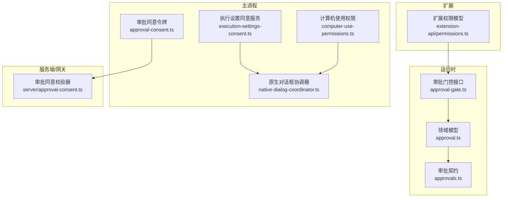
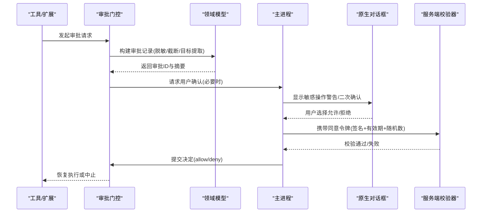
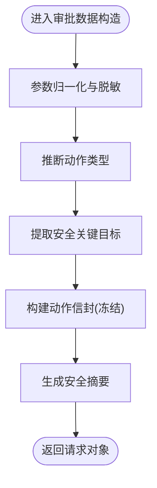
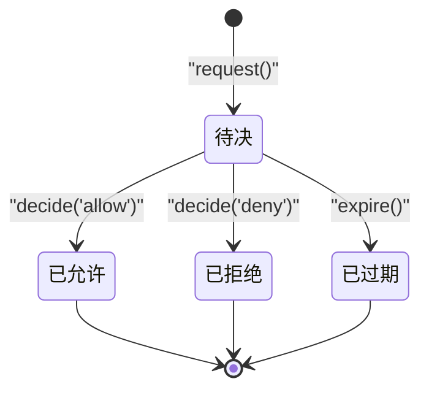
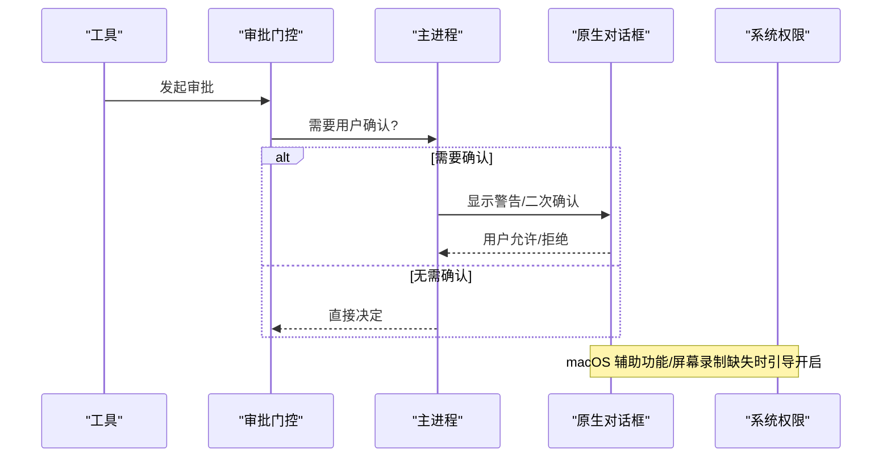
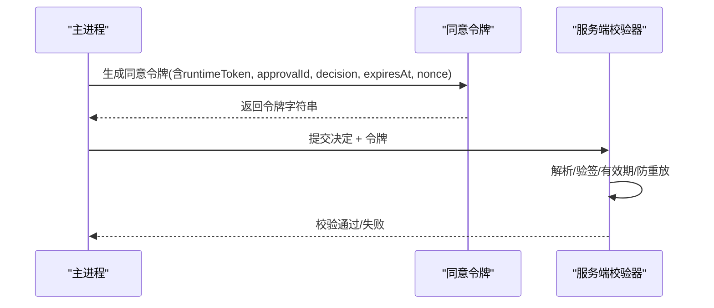
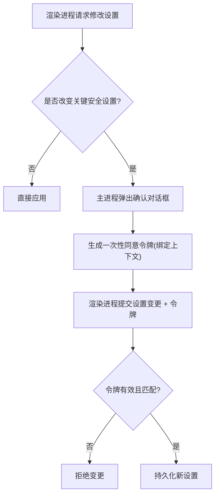
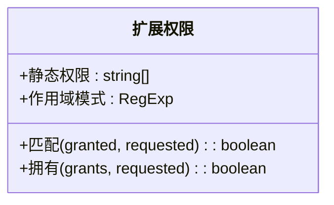
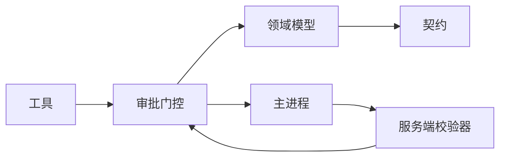

# 权限授予流程

<cite>
**本文引用的文件**
- [src/main/approval-consent.ts](file://src/main/approval-consent.ts)
- [kun/src/server/approval-consent.ts](file://kun/src/server/approval-consent.ts)
- [kun/src/contracts/approvals.ts](file://kun/src/contracts/approvals.ts)
- [kun/src/domain/approval.ts](file://kun/src/domain/approval.ts)
- [kun/src/ports/approval-gate.ts](file://kun/src/ports/approval-gate.ts)
- [src/main/execution-settings-consent.ts](file://src/main/execution-settings-consent.ts)
- [src/main/native-dialog-coordinator.ts](file://src/main/native-dialog-coordinator.ts)
- [src/main/services/computer-use-permissions.ts](file://src/main/services/computer-use-permissions.ts)
- [packages/extension-api/src/permissions.ts](file://packages/extension-api/src/permissions.ts)
</cite>

## 目录
1. [简介](#简介)
2. [项目结构](#项目结构)
3. [核心组件](#核心组件)
4. [架构总览](#架构总览)
5. [详细组件分析](#详细组件分析)
6. [依赖关系分析](#依赖关系分析)
7. [性能与安全性考量](#性能与安全性考量)
8. [故障排查指南](#故障排查指南)
9. [结论](#结论)

## 简介
本文件系统性说明 DeepSeek-GUI 的权限授予流程，覆盖从“权限申请”到“授权或拒绝”的完整生命周期；解释用户确认对话框触发机制（敏感操作警告、二次确认、用户授权界面）；阐述权限持久化机制（状态存储、版本迁移、跨会话保持）；详述权限撤销（手动撤销、自动过期、批量管理）；说明主进程、渲染进程与扩展之间的权限状态同步；并提供调试方法与常见问题解决方案。

## 项目结构
DeepSeek-GUI 的权限体系由多模块协作完成：
- 运行时审批数据模型与边界约束：定义请求、动作信封、决策与终止状态等契约。
- 本地审批门控：在工具执行前挂起并等待用户或自动审查结果。
- 主进程同意令牌：用于保护关键设置变更和审批回调，防止渲染侧伪造授权。
- 原生对话框协调器：序列化 Electron 原生弹窗，避免竞争。
- 平台能力权限：macOS 辅助功能与屏幕录制等系统级权限检测与引导。
- 扩展权限模型：声明式静态权限与带作用域的动态权限匹配。

**图表来源**
- [kun/src/contracts/approvals.ts:1-87](file://kun/src/contracts/approvals.ts#L1-L87)
- [kun/src/domain/approval.ts:1-604](file://kun/src/domain/approval.ts#L1-L604)
- [kun/src/ports/approval-gate.ts:1-23](file://kun/src/ports/approval-gate.ts#L1-L23)
- [src/main/approval-consent.ts:1-29](file://src/main/approval-consent.ts#L1-L29)
- [kun/src/server/approval-consent.ts:1-93](file://kun/src/server/approval-consent.ts#L1-L93)
- [src/main/execution-settings-consent.ts:1-131](file://src/main/execution-settings-consent.ts#L1-L131)
- [src/main/native-dialog-coordinator.ts:1-54](file://src/main/native-dialog-coordinator.ts#L1-L54)
- [src/main/services/computer-use-permissions.ts:1-161](file://src/main/services/computer-use-permissions.ts#L1-L161)
- [packages/extension-api/src/permissions.ts:1-54](file://packages/extension-api/src/permissions.ts#L1-L54)

**章节来源**
- [kun/src/contracts/approvals.ts:1-87](file://kun/src/contracts/approvals.ts#L1-L87)
- [kun/src/domain/approval.ts:1-604](file://kun/src/domain/approval.ts#L1-L604)
- [kun/src/ports/approval-gate.ts:1-23](file://kun/src/ports/approval-gate.ts#L1-L23)
- [src/main/approval-consent.ts:1-29](file://src/main/approval-consent.ts#L1-L29)
- [kun/src/server/approval-consent.ts:1-93](file://kun/src/server/approval-consent.ts#L1-L93)
- [src/main/execution-settings-consent.ts:1-131](file://src/main/execution-settings-consent.ts#L1-L131)
- [src/main/native-dialog-coordinator.ts:1-54](file://src/main/native-dialog-coordinator.ts#L1-L54)
- [src/main/services/computer-use-permissions.ts:1-161](file://src/main/services/computer-use-permissions.ts#L1-L161)
- [packages/extension-api/src/permissions.ts:1-54](file://packages/extension-api/src/permissions.ts#L1-L54)

## 核心组件
- 审批契约与领域模型
  - 定义审批动作类型、目标、影响面、参数边界与审计摘要，确保可安全持久化与展示。
  - 提供创建、归一化、脱敏、截断、目标提取与摘要生成能力。
- 审批门控
  - 工具执行前的统一入口，支持请求、决定、预留/提交/回滚决定、过期与查询。
- 主进程同意令牌
  - 为审批回调与关键设置变更生成带签名、有效期、随机数的令牌，服务端进行严格校验与防重放。
- 执行设置同意服务
  - 拦截渲染进程对审批策略、沙箱模式、审批者等关键设置的修改，通过一次性令牌绑定发送方上下文后落盘。
- 原生对话框协调器
  - 按 WebContents 串行化原生弹窗队列，避免竞态并提供空闲等待能力。
- 计算机使用权限
  - macOS 下检测/引导辅助功能与屏幕录制权限，区分“已授权但需重启生效”的状态。
- 扩展权限模型
  - 声明式静态权限与作用域匹配（如 network:*），提供匹配与判定工具。

**章节来源**
- [kun/src/contracts/approvals.ts:1-87](file://kun/src/contracts/approvals.ts#L1-L87)
- [kun/src/domain/approval.ts:1-604](file://kun/src/domain/approval.ts#L1-L604)
- [kun/src/ports/approval-gate.ts:1-23](file://kun/src/ports/approval-gate.ts#L1-L23)
- [src/main/approval-consent.ts:1-29](file://src/main/approval-consent.ts#L1-L29)
- [kun/src/server/approval-consent.ts:1-93](file://kun/src/server/approval-consent.ts#L1-L93)
- [src/main/execution-settings-consent.ts:1-131](file://src/main/execution-settings-consent.ts#L1-L131)
- [src/main/native-dialog-coordinator.ts:1-54](file://src/main/native-dialog-coordinator.ts#L1-L54)
- [src/main/services/computer-use-permissions.ts:1-161](file://src/main/services/computer-use-permissions.ts#L1-L161)
- [packages/extension-api/src/permissions.ts:1-54](file://packages/extension-api/src/permissions.ts#L1-L54)

## 架构总览
下图展示一次典型权限请求的生命周期：工具调用触发审批，主进程弹出确认对话框，用户确认后生成同意令牌，服务端校验并写入审计，最终放行或拒绝。

**图表来源**
- [kun/src/ports/approval-gate.ts:1-23](file://kun/src/ports/approval-gate.ts#L1-L23)
- [kun/src/domain/approval.ts:1-604](file://kun/src/domain/approval.ts#L1-L604)
- [src/main/approval-consent.ts:1-29](file://src/main/approval-consent.ts#L1-L29)
- [kun/src/server/approval-consent.ts:1-93](file://kun/src/server/approval-consent.ts#L1-L93)
- [src/main/native-dialog-coordinator.ts:1-54](file://src/main/native-dialog-coordinator.ts#L1-L54)

## 详细组件分析

### 审批请求与审计数据构造
- 作用：将任意工具调用转换为安全的“动作信封”，包含类型、影响面、工作区、目标、原因等，并对敏感字段脱敏、对超长内容截断，保证可持久化与可审计。
- 关键点：
  - 自动推断动作类型（命令、文件、网络、MCP、外部效果等）。
  - 精确收集安全关键目标（命令、文件、URL、收件人、资源）。
  - 浏览器相关动作特殊处理，剥离凭据与查询参数中的敏感信息。
  - 提供安全摘要用于展示与日志。

**图表来源**
- [kun/src/domain/approval.ts:144-212](file://kun/src/domain/approval.ts#L144-L212)
- [kun/src/domain/approval.ts:214-351](file://kun/src/domain/approval.ts#L214-L351)
- [kun/src/domain/approval.ts:375-450](file://kun/src/domain/approval.ts#L375-L450)
- [kun/src/domain/approval.ts:452-576](file://kun/src/domain/approval.ts#L452-L576)

**章节来源**
- [kun/src/domain/approval.ts:144-212](file://kun/src/domain/approval.ts#L144-L212)
- [kun/src/domain/approval.ts:214-351](file://kun/src/domain/approval.ts#L214-L351)
- [kun/src/domain/approval.ts:375-450](file://kun/src/domain/approval.ts#L375-L450)
- [kun/src/domain/approval.ts:452-576](file://kun/src/domain/approval.ts#L452-L576)

### 审批门控与状态机
- 作用：工具执行前统一挂起点，维护待决审批列表，支持预留/提交/回滚决定与过期清理。
- 状态流转：pending → allowed/denied/expired。
- 并发与一致性：预留决定后可延迟提交，失败时回滚，保证审计事件与执行一致。

**图表来源**
- [kun/src/ports/approval-gate.ts:1-23](file://kun/src/ports/approval-gate.ts#L1-L23)
- [kun/src/domain/approval.ts:578-604](file://kun/src/domain/approval.ts#L578-L604)

**章节来源**
- [kun/src/ports/approval-gate.ts:1-23](file://kun/src/ports/approval-gate.ts#L1-L23)
- [kun/src/domain/approval.ts:578-604](file://kun/src/domain/approval.ts#L578-L604)

### 用户确认对话框与二次确认
- 触发条件：当工具调用具有网络、外部写、进程执行、GUI自动化等影响，或涉及敏感目标（命令、文件、URL、收件人）时，需要用户确认。
- 交互保障：通过原生对话框协调器串行化弹窗，避免多窗口竞争；必要时提供二次确认。
- 平台能力：macOS 下辅助功能与屏幕录制权限缺失时，引导用户开启。

**图表来源**
- [src/main/native-dialog-coordinator.ts:1-54](file://src/main/native-dialog-coordinator.ts#L1-L54)
- [src/main/services/computer-use-permissions.ts:70-161](file://src/main/services/computer-use-permissions.ts#L70-L161)

**章节来源**
- [src/main/native-dialog-coordinator.ts:1-54](file://src/main/native-dialog-coordinator.ts#L1-L54)
- [src/main/services/computer-use-permissions.ts:70-161](file://src/main/services/computer-use-permissions.ts#L70-L161)

### 同意令牌与跨进程安全
- 主进程生成带签名、有效期、随机数的同意令牌，用于审批回调与关键设置变更。
- 服务端校验器验证签名、有效期、防重放（使用哈希去重表），确保只有合法来源能提交决定。

**图表来源**
- [src/main/approval-consent.ts:1-29](file://src/main/approval-consent.ts#L1-L29)
- [kun/src/server/approval-consent.ts:1-93](file://kun/src/server/approval-consent.ts#L1-L93)

**章节来源**
- [src/main/approval-consent.ts:1-29](file://src/main/approval-consent.ts#L1-L29)
- [kun/src/server/approval-consent.ts:1-93](file://kun/src/server/approval-consent.ts#L1-L93)

### 执行设置变更的受保护流程
- 目的：防止渲染进程直接修改审批策略、沙箱模式、审批者等关键安全设置。
- 机制：检测变更差异，弹出原生确认，生成一次性令牌（绑定当前值、新值与发送方上下文），仅当令牌被消费时才持久化。

**图表来源**
- [src/main/execution-settings-consent.ts:35-131](file://src/main/execution-settings-consent.ts#L35-L131)

**章节来源**
- [src/main/execution-settings-consent.ts:35-131](file://src/main/execution-settings-consent.ts#L35-L131)

### 扩展权限模型与匹配
- 静态权限：预定义的扩展能力集合（如 agent.run、workspace.write、media.* 等）。
- 作用域权限：如 network:* 与 accounts.*:server 的模式匹配，支持通配符匹配。
- 用途：控制扩展可访问的能力范围，配合主进程与运行时的权限门控共同生效。

**图表来源**
- [packages/extension-api/src/permissions.ts:1-54](file://packages/extension-api/src/permissions.ts#L1-L54)

**章节来源**
- [packages/extension-api/src/permissions.ts:1-54](file://packages/extension-api/src/permissions.ts#L1-L54)

## 依赖关系分析
- 低耦合高内聚：
  - 领域模型与契约独立于实现，便于替换后端存储或审查服务。
  - 审批门控作为抽象接口，可在本地内存或远程服务中实现。
- 主要依赖链：
  - 工具调用 → 审批门控 → 领域模型（构造/脱敏/目标提取）→ 主进程（对话框/令牌）→ 服务端（校验）→ 门控（提交决定）→ 工具恢复执行。
- 潜在循环依赖：
  - 通过接口隔离避免循环；领域模型不依赖主进程与服务端。

**图表来源**
- [kun/src/ports/approval-gate.ts:1-23](file://kun/src/ports/approval-gate.ts#L1-L23)
- [kun/src/domain/approval.ts:1-604](file://kun/src/domain/approval.ts#L1-L604)
- [kun/src/contracts/approvals.ts:1-87](file://kun/src/contracts/approvals.ts#L1-L87)
- [src/main/approval-consent.ts:1-29](file://src/main/approval-consent.ts#L1-L29)
- [kun/src/server/approval-consent.ts:1-93](file://kun/src/server/approval-consent.ts#L1-L93)

**章节来源**
- [kun/src/ports/approval-gate.ts:1-23](file://kun/src/ports/approval-gate.ts#L1-L23)
- [kun/src/domain/approval.ts:1-604](file://kun/src/domain/approval.ts#L1-L604)
- [kun/src/contracts/approvals.ts:1-87](file://kun/src/contracts/approvals.ts#L1-L87)
- [src/main/approval-consent.ts:1-29](file://src/main/approval-consent.ts#L1-L29)
- [kun/src/server/approval-consent.ts:1-93](file://kun/src/server/approval-consent.ts#L1-L93)

## 性能与安全性考量
- 性能
  - 参数归一化与脱敏采用字节预算与深度限制，避免大对象阻塞。
  - 服务端防重放表有上限，超限时保守关闭，避免内存膨胀。
  - 原生对话框串行化减少 UI 抖动与竞态。
- 安全性
  - 所有持久化与展示的审批数据均经过脱敏与截断。
  - 同意令牌采用 HMAC 签名、有效期与随机数，服务端严格校验。
  - 执行设置变更必须经主进程一次性令牌绑定上下文后才持久化。
  - macOS 系统权限读取为只读，引导开启但不越权。

[本节为通用指导，不直接分析具体文件]

## 故障排查指南
- 常见现象与定位
  - 审批一直 pending：检查门控是否收到 decide；查看审计事件是否成功提交；确认未发生回滚。
  - 同意令牌无效：核对 runtimeToken、expiresAt、nonce 格式与长度；检查服务端是否达到防重放上限。
  - 设置变更未生效：确认是否弹出确认框；检查一次性令牌是否被消费；比对 actionKey 是否匹配。
  - macOS 权限提示不出现：确认是否为只读检测；如需引导，调用对应权限请求方法。
- 建议步骤
  - 启用更详细的审计日志，关注动作信封的目标与摘要。
  - 在主进程与服务端分别打印令牌解析与校验结果。
  - 使用原生对话框协调器的空闲等待，避免在弹窗期间执行破坏性操作。
  - 对扩展权限问题，检查静态权限与作用域匹配是否正确。

**章节来源**
- [kun/src/server/approval-consent.ts:22-65](file://kun/src/server/approval-consent.ts#L22-L65)
- [src/main/execution-settings-consent.ts:76-131](file://src/main/execution-settings-consent.ts#L76-L131)
- [src/main/native-dialog-coordinator.ts:1-54](file://src/main/native-dialog-coordinator.ts#L1-L54)
- [src/main/services/computer-use-permissions.ts:70-161](file://src/main/services/computer-use-permissions.ts#L70-L161)

## 结论
DeepSeek-GUI 的权限授予流程以“最小暴露、最大可控”为原则：通过领域模型对数据进行安全归一化与脱敏，借助审批门控统一管理生命周期，利用主进程同意令牌与严格的服务器校验保障跨进程安全，结合原生对话框协调器与平台权限引导提升用户体验与可靠性。该设计既满足复杂场景下的细粒度授权需求，又保证了审计可追溯与系统稳定性。