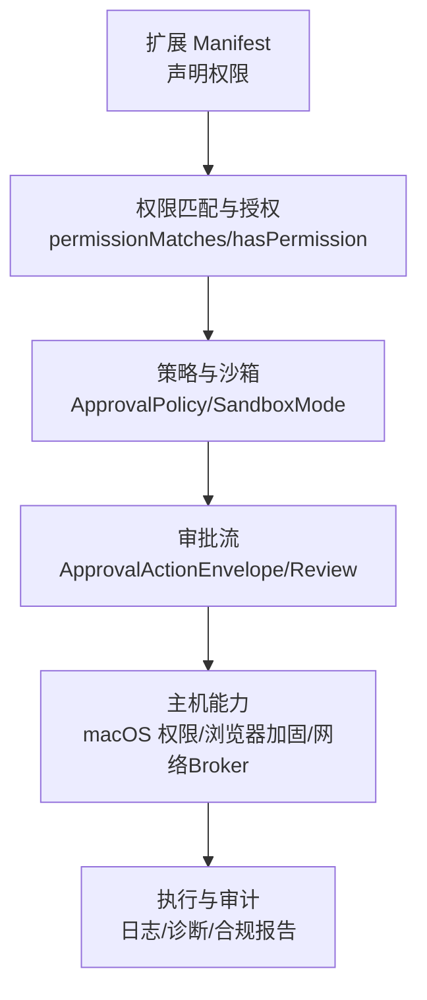
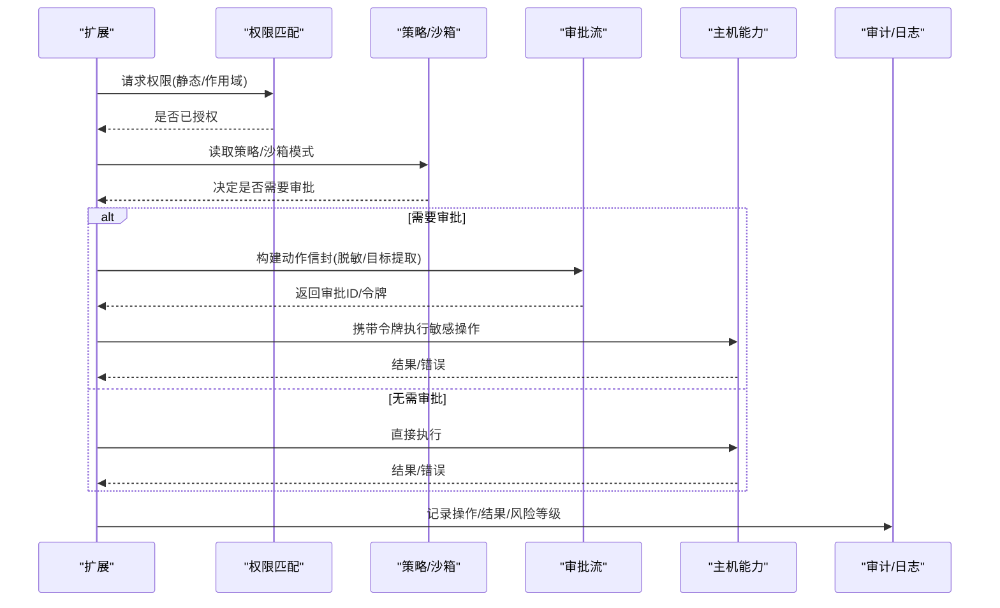
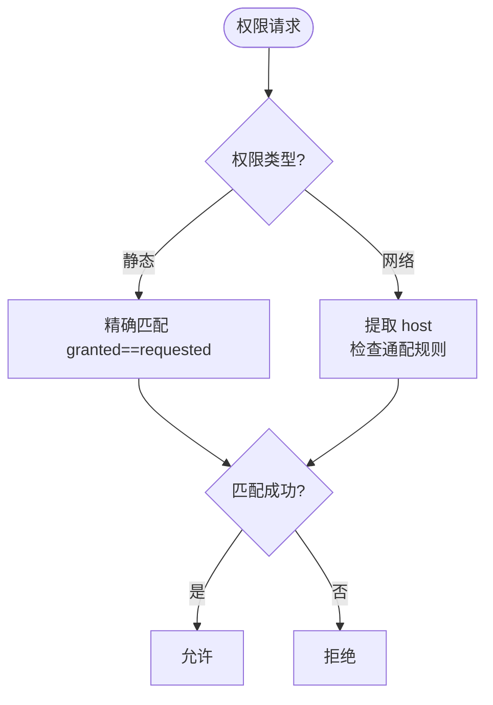
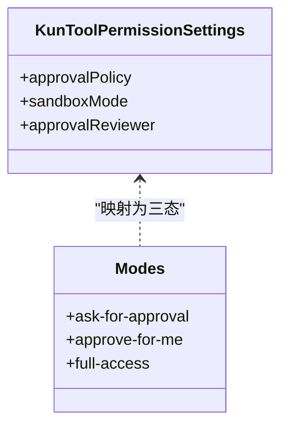
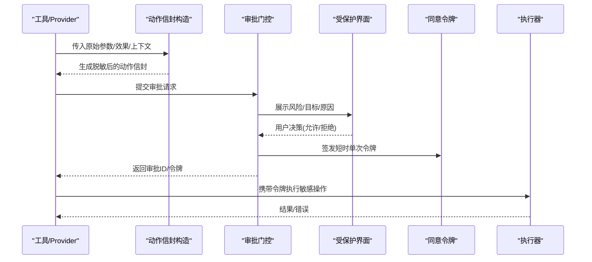
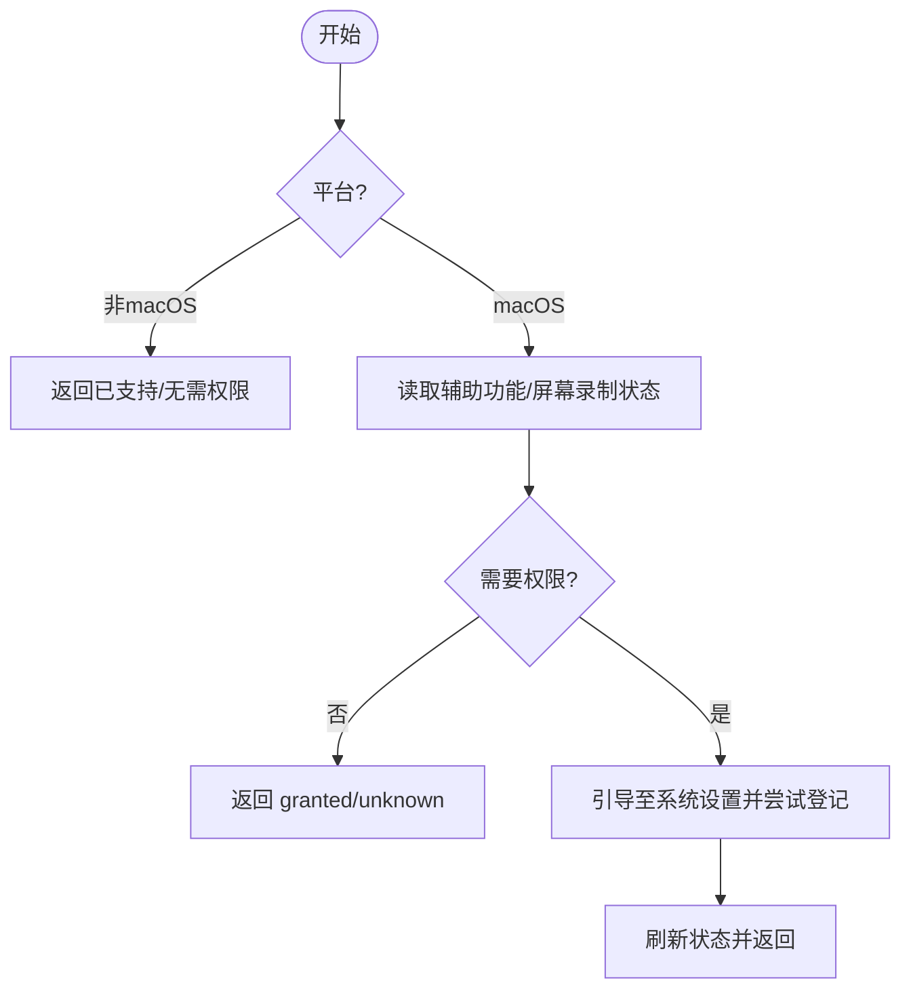
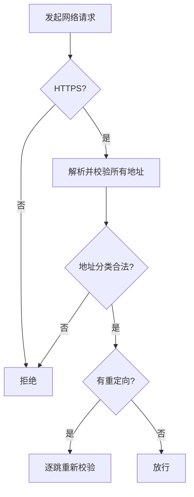
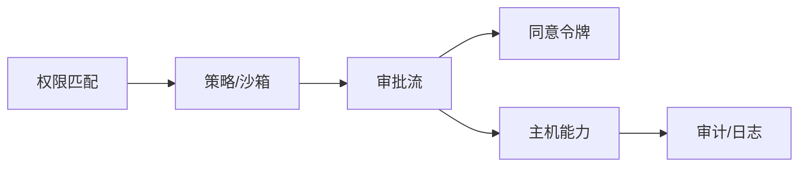

# 权限控制系统

<cite>
**本文引用的文件**
- [permissions.ts](file://packages/extension-api/src/permissions.ts)
- [policy.ts](file://kun/src/contracts/policy.ts)
- [approvals.ts](file://kun/src/contracts/approvals.ts)
- [approval.ts](file://kun/src/domain/approval.ts)
- [computer-use-permissions.ts](file://src/main/services/computer-use-permissions.ts)
- [graph-security-policy.ts](file://kun/src/graph/graph-security-policy.ts)
- [security-and-resources.md](file://docs/extensions/security-and-resources.md)
- [approval-consent.ts](file://src/main/approval-consent.ts)
</cite>

## 目录
1. [简介](#简介)
2. [项目结构](#项目结构)
3. [核心组件](#核心组件)
4. [架构总览](#架构总览)
5. [详细组件分析](#详细组件分析)
6. [依赖关系分析](#依赖关系分析)
7. [性能与资源限制](#性能与资源限制)
8. [故障排查指南](#故障排查指南)
9. [结论](#结论)
10. [附录：配置与自定义策略](#附录：配置与自定义策略)

## 简介
本文件面向 DeepSeek-GUI 的权限控制系统，系统性说明用户权限模型、权限声明机制、运行时检查、授予与撤销流程、敏感操作保护以及审计能力。内容覆盖文件访问、网络请求、设备（计算机）访问等关键权限类型，并结合扩展 manifest、主机服务、审批流与策略引擎给出可操作的实现与排错指引。

## 项目结构
DeepSeek-GUI 的权限控制由“声明 + 策略 + 审批 + 主机能力”四层构成：
- 声明层：扩展通过 manifest 声明所需权限（静态权限、作用域化网络/账号权限）。
- 策略层：统一策略定义批准策略、沙箱模式、工具权限模式等。
- 审批层：对危险动作进行结构化描述、脱敏、目标提取与人工/自动审批。
- 主机能力层：操作系统级权限（如 macOS 辅助功能/屏幕录制）、浏览器安全加固、工作区与网络 Broker 校验。

图表来源
- [permissions.ts:1-54](file://packages/extension-api/src/permissions.ts#L1-L54)
- [policy.ts:1-129](file://kun/src/contracts/policy.ts#L1-L129)
- [approvals.ts:1-87](file://kun/src/contracts/approvals.ts#L1-L87)
- [security-and-resources.md:1-210](file://docs/extensions/security-and-resources.md#L1-L210)

章节来源
- [permissions.ts:1-54](file://packages/extension-api/src/permissions.ts#L1-L54)
- [policy.ts:1-129](file://kun/src/contracts/policy.ts#L1-L129)
- [security-and-resources.md:1-210](file://docs/extensions/security-and-resources.md#L1-L210)

## 核心组件
- 权限声明与匹配
  - 静态权限集合：命令注册、UI、Webview、Agent、存储、工作区、媒体、任务管理等。
  - 作用域化权限：账号使用/管理/密钥读取、网络域名匹配（含通配符子域）。
  - 匹配函数：支持精确匹配与 network:* 通配规则。
- 策略与沙箱
  - 批准策略：always/on-request/untrusted/never/auto/suggest。
  - 沙箱模式：read-only/workspace-write/danger-full-access/external-sandbox。
  - 工具权限模式：ask-for-approve/approve-for-me/full-access 三态映射到策略组合。
- 审批与审计
  - 动作信封：限定字段、效果标记（网络/外部写入/进程执行/GUI自动化）、目标提取、脱敏与大小限制。
  - 决策与状态：allow/deny、风险等级、终端状态（approved/denied/timed-out/failed-closed/aborted）。
  - 同意令牌：受保护的短时单次 token，绑定运行环境、操作摘要、过期时间。
- 主机能力
  - macOS 辅助功能与屏幕录制权限检测与引导。
  - 网络 Broker：HTTPS、DNS 解析校验、重定向处理、地址分类白名单。
  - 工作区访问：路径规范化、遍历与符号链接防护、写入触发审批。

章节来源
- [permissions.ts:1-54](file://packages/extension-api/src/permissions.ts#L1-L54)
- [policy.ts:1-129](file://kun/src/contracts/policy.ts#L1-L129)
- [approvals.ts:1-87](file://kun/src/contracts/approvals.ts#L1-L87)
- [approval.ts:1-604](file://kun/src/domain/approval.ts#L1-L604)
- [computer-use-permissions.ts:1-161](file://src/main/services/computer-use-permissions.ts#L1-L161)
- [security-and-resources.md:1-210](file://docs/extensions/security-and-resources.md#L1-L210)

## 架构总览
下图展示从扩展声明到执行与审计的完整链路，包括策略判定、审批拦截、主机能力调用与审计记录。

图表来源
- [permissions.ts:1-54](file://packages/extension-api/src/permissions.ts#L1-L54)
- [policy.ts:1-129](file://kun/src/contracts/policy.ts#L1-L129)
- [approvals.ts:1-87](file://kun/src/contracts/approvals.ts#L1-L87)
- [approval.ts:1-604](file://kun/src/domain/approval.ts#L1-L604)
- [security-and-resources.md:1-210](file://docs/extensions/security-and-resources.md#L1-L210)

## 详细组件分析

### 权限模型与声明机制
- 静态权限：涵盖 UI、Agent、存储、工作区、媒体、任务管理等，用于宿主能力的最小化暴露。
- 作用域化权限：
  - 账号类：accounts.use/manage/secrets.read:<providerId>，按 provider 隔离。
  - 网络类：network:<hostname>，支持 *.example.com 通配子域匹配。
- 匹配规则：精确匹配优先；network 通配仅匹配子域，不自动匹配根域。

图表来源
- [permissions.ts:1-54](file://packages/extension-api/src/permissions.ts#L1-L54)

章节来源
- [permissions.ts:1-54](file://packages/extension-api/src/permissions.ts#L1-L54)

### 策略与沙箱
- 批准策略：
  - on-request：每次请求需审批。
  - auto：自动批准（通常配合宽松沙箱）。
  - untrusted/never/suggest/always：不同场景下的默认行为。
- 沙箱模式：
  - workspace-write：默认受限写，适合大多数工具。
  - danger-full-access：全量访问，需严格审批或管理员策略。
- 工具权限模式：
  - ask-for-approval → on-request + workspace-write + 用户审批。
  - approve-for-me → on-request + workspace-write + Agent 审批。
  - full-access → auto + danger-full-access + 用户审批。

图表来源
- [policy.ts:1-129](file://kun/src/contracts/policy.ts#L1-L129)

章节来源
- [policy.ts:1-129](file://kun/src/contracts/policy.ts#L1-L129)

### 审批流与敏感操作保护
- 动作信封：
  - 固定字段：版本、动作种类、工具名、提供者信息、效果标记、参数、工作区、当前目录、目标列表、原因。
  - 目标提取：命令/文件/URL/收件人/MCP/资源，去重、脱敏、长度限制。
  - 参数归一化：深度/数组/键数量/字节上限限制，敏感键替换为占位符。
- 审批决策：
  - 允许/拒绝、风险等级、理由、终端状态。
  - 同意令牌：带签名与过期时间的短时单次凭证，防止重放与伪造。
- 敏感操作保护：
  - 危险操作警告：基于 effects 标记（网络/外部写入/进程执行/GUI自动化）。
  - 二次确认：在受保护界面完成用户确认，不可被扩展自行绕过。
  - 授权记录：持久化审批 ID、决策、时间与上下文摘要。

图表来源
- [approvals.ts:1-87](file://kun/src/contracts/approvals.ts#L1-L87)
- [approval.ts:1-604](file://kun/src/domain/approval.ts#L1-L604)
- [approval-consent.ts:1-29](file://src/main/approval-consent.ts#L1-L29)

章节来源
- [approvals.ts:1-87](file://kun/src/contracts/approvals.ts#L1-L87)
- [approval.ts:1-604](file://kun/src/domain/approval.ts#L1-L604)
- [approval-consent.ts:1-29](file://src/main/approval-consent.ts#L1-L29)

### 设备访问权限（计算机使用）
- 平台差异：
  - macOS：需要辅助功能（输入注入）与屏幕录制（截图/捕获）权限。
  - Windows/Linux：无额外系统权限门控。
- 能力检测：
  - 读取当前进程信任状态与系统设置中的授权状态。
  - 区分“未授权”和“已授权但需重启生效”。
- 主动引导：
  - 打开系统偏好设置并提示用户开启相应权限。
  - 失败时降级为最佳努力，仍返回最新状态。

图表来源
- [computer-use-permissions.ts:1-161](file://src/main/services/computer-use-permissions.ts#L1-L161)

章节来源
- [computer-use-permissions.ts:1-161](file://src/main/services/computer-use-permissions.ts#L1-L161)

### 网络与工作区访问
- 网络 Broker：
  - 强制 HTTPS、校验 DNS 解析结果与实际 socket 目标、重定向逐跳验证。
  - 生产默认仅接受公网单播地址；出现私有/环回等特殊地址则整体失败。
  - 精确 hostname 授权不支持子域；通配只匹配子域，不自动匹配根域。
- 工作区访问：
  - 路径规范化与防穿越/符号链接逃逸。
  - 写入可能继续触发沙箱/审批；权限不等于免确认。

图表来源
- [security-and-resources.md:1-210](file://docs/extensions/security-and-resources.md#L1-L210)
- [graph-security-policy.ts:1-62](file://kun/src/graph/graph-security-policy.ts#L1-L62)

章节来源
- [security-and-resources.md:1-210](file://docs/extensions/security-and-resources.md#L1-L210)
- [graph-security-policy.ts:1-62](file://kun/src/graph/graph-security-policy.ts#L1-L62)

### 权限授予流程与撤销
- 授予流程：
  - 安装或新增权限时在受保护表面显示并接受。
  - Grant 绑定扩展 ID、版本权限快照与工作区策略。
  - 每次操作按当前 grant 重新检查，不允许扩大请求范围。
- 撤销机制：
  - 立即阻止新调用；在途调用按能力规则取消或失败。
  - 高风险权限（如 accounts.secrets.read、hostDom）变更需重新确认。

章节来源
- [security-and-resources.md:1-210](file://docs/extensions/security-and-resources.md#L1-L210)

### 权限审计与合规
- 审计数据：
  - 记录扩展、版本、工作区、非秘密资源引用、操作与结果。
  - 输出默认可附于缺陷报告，但仍需人工检查业务数据后再公开。
- 诊断与报告：
  - 提供扩展医生命令，显示版本、来源、签名、启用状态、权限快照、策略、限额失败与最近错误等。
  - 日志按扩展 ID、版本与进程实例归因并轮转，避免记录敏感信息。

章节来源
- [security-and-resources.md:1-210](file://docs/extensions/security-and-resources.md#L1-L210)

## 依赖关系分析
- 模块耦合：
  - 权限匹配依赖声明与匹配函数；策略层将策略与沙箱映射为工具权限模式。
  - 审批流依赖动作信封构造、目标提取与脱敏；同意令牌保障跨进程安全传递。
  - 主机能力依赖平台 API（Electron/macOS），在网络与工作区层面提供强约束。
- 外部依赖：
  - Electron 主进程能力（系统偏好设置、桌面捕获）。
  - 扩展 SDK 提供的权限 Schema 与匹配工具。

图表来源
- [permissions.ts:1-54](file://packages/extension-api/src/permissions.ts#L1-L54)
- [policy.ts:1-129](file://kun/src/contracts/policy.ts#L1-L129)
- [approvals.ts:1-87](file://kun/src/contracts/approvals.ts#L1-L87)
- [approval.ts:1-604](file://kun/src/domain/approval.ts#L1-L604)
- [computer-use-permissions.ts:1-161](file://src/main/services/computer-use-permissions.ts#L1-L161)
- [security-and-resources.md:1-210](file://docs/extensions/security-and-resources.md#L1-L210)

章节来源
- [permissions.ts:1-54](file://packages/extension-api/src/permissions.ts#L1-L54)
- [policy.ts:1-129](file://kun/src/contracts/policy.ts#L1-L129)
- [approvals.ts:1-87](file://kun/src/contracts/approvals.ts#L1-L87)
- [approval.ts:1-604](file://kun/src/domain/approval.ts#L1-L604)
- [computer-use-permissions.ts:1-161](file://src/main/services/computer-use-permissions.ts#L1-L161)
- [security-and-resources.md:1-210](file://docs/extensions/security-and-resources.md#L1-L210)

## 性能与资源限制
- 默认运行时限额（基线值，可被策略收紧）：
  - IPC 消息、激活/操作截止时间、取消宽限、关闭截止时间。
  - 并发操作、流窗口、事件速率、内存上限、崩溃开路阈值。
  - 日志轮转、状态文档大小、迁移截止时间、网络/认证请求体大小。
- 背压与释放：
  - 生产者等待 ack，队列有 item/bytes 双上限。
  - 取消/终止后释放缓冲、定时器、监听器与关联上下文。
  - 扩展禁用/卸载先 fence 新调用，再取消/停用。

章节来源
- [security-and-resources.md:1-210](file://docs/extensions/security-and-resources.md#L1-L210)

## 故障排查指南
- 常见权限问题定位：
  - 网络请求被拒：检查是否使用 HTTPS、DNS 解析是否包含私有/环回地址、重定向是否逐跳校验。
  - 工作区写入失败：确认路径规范化、是否触发沙箱/审批、权限是否被撤销。
  - macOS 设备权限：查看辅助功能/屏幕录制状态，必要时引导用户开启并重启应用。
- 审批相关问题：
  - 动作信封过大或包含敏感键：检查参数归一化与脱敏逻辑，确保不超过字节/深度/数组/键数限制。
  - 同意令牌失效：确认令牌版本、过期时间、绑定参数与运行环境一致。
- 审计与诊断：
  - 使用扩展医生命令查看权限快照、策略、限额失败与最近错误。
  - 检查日志轮转与脱敏，避免泄露敏感信息。

章节来源
- [security-and-resources.md:1-210](file://docs/extensions/security-and-resources.md#L1-L210)
- [approval.ts:1-604](file://kun/src/domain/approval.ts#L1-L604)
- [computer-use-permissions.ts:1-161](file://src/main/services/computer-use-permissions.ts#L1-L161)

## 结论
DeepSeek-GUI 的权限控制系统以“最小权限 + 强策略 + 严格审批 + 主机能力”为核心，覆盖文件、网络、设备等多维度访问，并通过受保护界面、短时令牌与审计机制保障安全与可追溯性。扩展应遵循最小声明原则，结合策略与沙箱模式实现细粒度控制；运维侧可通过诊断与审计持续优化合规与稳定性。

## 附录：配置与自定义策略
- 配置要点：
  - 选择合适的工作区沙箱模式与批准策略，避免默认宽松导致越权。
  - 网络权限尽量精确到具体主机名，仅在必要时使用通配子域。
  - 工作区写入需配合审批，避免误改关键文件。
- 自定义策略建议：
  - 将高风险权限（如 accounts.secrets.read、hostDom）纳入重新确认流程。
  - 对 agent 自动审批场景，限制其可访问的网络与工作区范围。
  - 结合审计日志与诊断输出，定期审查权限使用统计与异常检测。

章节来源
- [policy.ts:1-129](file://kun/src/contracts/policy.ts#L1-L129)
- [security-and-resources.md:1-210](file://docs/extensions/security-and-resources.md#L1-L210)