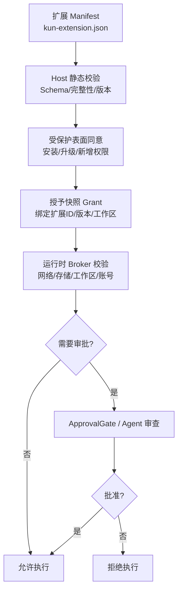
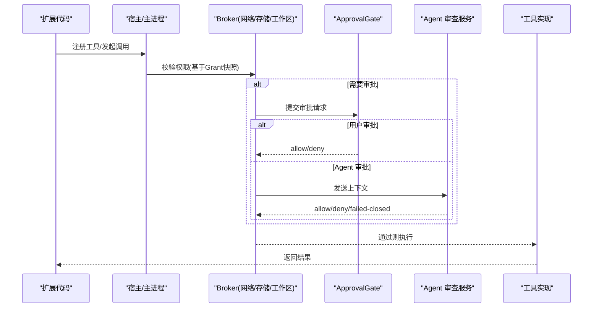
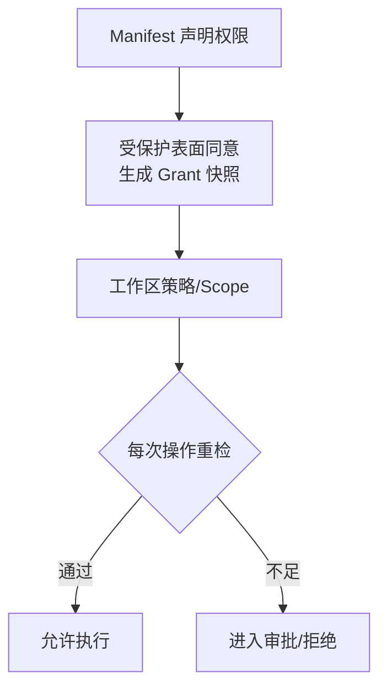
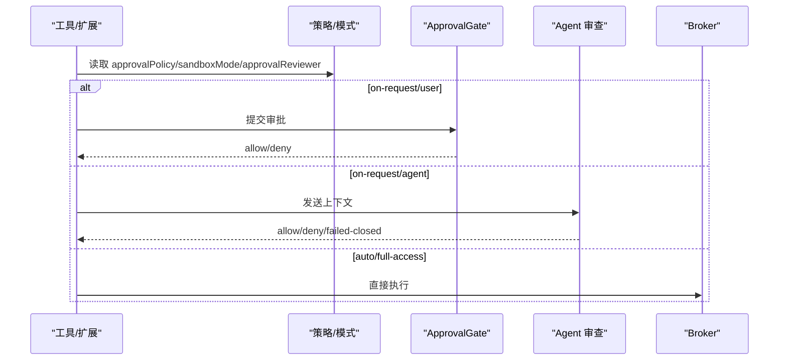
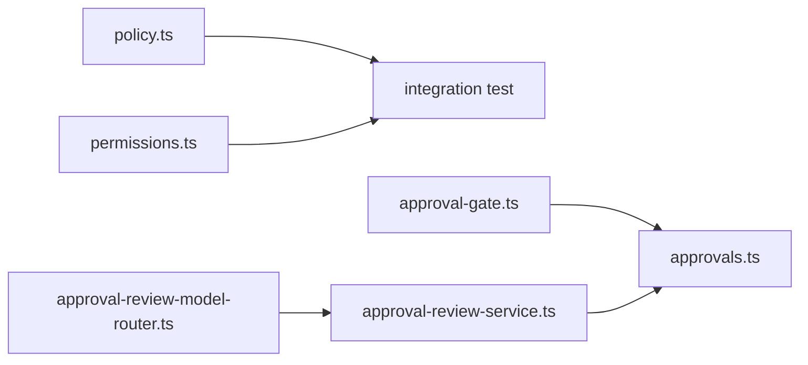

# 用户权限模型

<cite>
**本文引用的文件**
- [security-and-resources.md](file://docs/extensions/security-and-resources.md)
- [manifest.md](file://docs/extensions/manifest.md)
- [permissions.ts](file://packages/extension-api/src/permissions.ts)
- [policy.ts](file://kun/src/contracts/policy.ts)
- [permission-modes-integration.test.ts](file://kun/tests/permission-modes-integration.test.ts)
- [approvals.ts](file://kun/src/server/routes/approvals.ts)
- [approval-consent.ts](file://src/main/approval-consent.ts)
- [approval-gate.ts](file://kun/src/ports/approval-gate.ts)
- [approval-review-service.ts](file://kun/src/services/approval-review-service.ts)
- [approval-review-model-router.ts](file://kun/src/services/approval-review-model-router.ts)
- [tool-host.ts](file://kun/src/ports/tool-host.ts)
- [ppt-master-tool.test.ts](file://kun/src/adapters/tool/ppt-master-tool.test.ts)
</cite>

## 目录
1. [简介](#简介)
2. [项目结构](#项目结构)
3. [核心组件](#核心组件)
4. [架构总览](#架构总览)
5. [详细组件分析](#详细组件分析)
6. [依赖关系分析](#依赖关系分析)
7. [性能与资源限制](#性能与资源限制)
8. [故障排查指南](#故障排查指南)
9. [结论](#结论)
10. [附录：权限清单与最佳实践](#附录：权限清单与最佳实践)

## 简介
本文件面向 DeepSeek-GUI 的用户权限模型，聚焦扩展（Extension）在宿主环境中的能力边界、声明式权限、运行时审批与沙箱策略。文档覆盖以下方面：
- 权限类型：文件访问、网络请求、设备/媒体访问、系统 API 调用等
- 权限层次与继承：Manifest 声明、授予快照、工作区范围、每次操作重检
- 角色差异：普通用户与管理员视角下的默认策略与收紧方式
- 权限声明机制：扩展 manifest 的权限定义格式与语法
- 权限检查流程：静态校验、运行时 Broker 校验、ApprovalGate 与 Agent 自动审查
- 最佳实践与常见场景：最小权限原则、精确域名授权、受保护窗口确认、撤销即时生效

## 项目结构
DeepSeek-GUI 的权限体系由“声明 + 校验 + 执行”三层构成：
- 声明层：扩展通过 kun-extension.json 声明所需权限；Host 在加载前进行 Schema/完整性校验
- 校验层：安装/升级时进入受保护表面（Protected Surface）获取用户同意；运行时按 grant 快照与 workspace policy 逐次校验
- 执行层：所有敏感能力走 Broker（网络、存储、工作区、账号、工具），并受 ApprovalGate 或 Agent 自动审查约束

图表来源
- [manifest.md:282-309](file://docs/extensions/manifest.md#L282-L309)
- [security-and-resources.md:34-59](file://docs/extensions/security-and-resources.md#L34-L59)
- [permissions.ts:43-53](file://packages/extension-api/src/permissions.ts#L43-L53)

章节来源
- [manifest.md:282-309](file://docs/extensions/manifest.md#L282-L309)
- [security-and-resources.md:34-59](file://docs/extensions/security-and-resources.md#L34-L59)

## 核心组件
- 权限模型与模式
  - 审批策略 ApprovalPolicy：always/on-request/untrusted/never/auto/suggest
  - 沙箱模式 SandboxMode：read-only/workspace-write/danger-full-access/external-sandbox
  - 审批者 ApprovalReviewer：user/agent
  - 产品级快捷模式：ask-for-approval / approve-for-me / full-access
- 权限声明与匹配
  - 静态权限列表与受限作用域权限（accounts.*、network:*）
  - 通配符子域匹配与 hasPermission 判定
- 运行时审批与审查
  - ApprovalGate 拦截与决策端点
  - Agent 自动审查服务与模型路由
- 安全边界
  - 受保护表面（Protected Surfaces）用于高敏交互
  - Network Broker 对 DNS/重定向/地址分类的严格校验
  - Workspace 读写路径规范化与越界拒绝

章节来源
- [policy.ts:3-129](file://kun/src/contracts/policy.ts#L3-L129)
- [permissions.ts:1-54](file://packages/extension-api/src/permissions.ts#L1-L54)
- [security-and-resources.md:96-132](file://docs/extensions/security-and-resources.md#L96-L132)

## 架构总览
下图展示一次需要权限的工具调用从触发到最终执行的完整链路，包括静态声明、授予快照、Broker 校验、审批与执行。

图表来源
- [permission-modes-integration.test.ts:33-106](file://kun/tests/permission-modes-integration.test.ts#L33-L106)
- [permission-modes-integration.test.ts:108-238](file://kun/tests/permission-modes-integration.test.ts#L108-L238)
- [approvals.ts](file://kun/src/server/routes/approvals.ts)
- [approval-review-service.ts](file://kun/src/services/approval-review-service.ts)

## 详细组件分析

### 权限类型与能力边界
- 文件与工作区访问
  - workspace.read/workspace.write：仅对已授予 root 的路径生效；路径需规范化，防止穿越与符号链接逃逸；写入仍可能触发审批/沙箱限制
- 网络请求
  - network:<hostname> 或 network:*.example.com：精确主机名或显式子域通配；生产直连要求 public-unicast 地址，禁止私有/环回/多播等；重定向需手动处理并在下一跳重新校验
- 设备与媒体访问
  - media.read/media.process/media.export：媒体读取、处理与导出能力，需显式声明
- 系统 API 调用
  - Node main 以当前 OS 用户权限运行；Broker 无法阻止 Node 直接调用 fs/net/child_process 等，因此不能将任意 Node main 视为安全沙箱
- 账号与凭据
  - accounts.read/use/manage/secrets.read：<providerId> 限定作用域；secrets.read 为高风险，需单独确认

章节来源
- [security-and-resources.md:96-132](file://docs/extensions/security-and-resources.md#L96-L132)
- [manifest.md:282-309](file://docs/extensions/manifest.md#L282-L309)
- [permissions.ts:1-54](file://packages/extension-api/src/permissions.ts#L1-L54)

### 权限层次与继承关系
- 包级权限：kun-extension.json 中 permissions 数组
- 授予快照：安装/新版本新增权限时在受保护表面获得用户同意，生成绑定扩展 ID、版本、workspace policy 的 grant
- 工作区级：每次操作按当前 grant 重新检查，不只在激活/注册时检查
- 请求收窄：请求只能缩小 grant，不能扩大；撤销立即阻止新调用，在途调用按能力规则取消/失败

图表来源
- [security-and-resources.md:34-59](file://docs/extensions/security-and-resources.md#L34-L59)
- [manifest.md:282-309](file://docs/extensions/manifest.md#L282-L309)

章节来源
- [security-and-resources.md:34-59](file://docs/extensions/security-and-resources.md#L34-L59)
- [manifest.md:282-309](file://docs/extensions/manifest.md#L282-L309)

### 用户角色与默认策略
- 普通用户
  - 默认采用更严格的策略组合：如 ask-for-approval（on-request + workspace-write + user 审批）
- 管理员
  - 可配置为 full-access（auto + danger-full-access + user 审批）或 approve-for-me（on-request + workspace-write + agent 审批）
- 平台/企业策略可进一步收紧默认值；扩展必须从诊断/能力接口读取有效值，不得硬编码

章节来源
- [policy.ts:39-129](file://kun/src/contracts/policy.ts#L39-L129)
- [security-and-resources.md:134-157](file://docs/extensions/security-and-resources.md#L134-L157)

### 权限声明机制（Manifest 权限）
- 权限为精确字符串数组，包含 UI、Webview、Agent、工具、Provider、账号、网络、存储、工作区等
- 贡献点隐含最小权限：例如 views.* 需要 ui.views 与 webview；tools.register 需要 tools.register 等
- 通配符网络权限只匹配显式声明的子域，不自动匹配根域；需分别声明
- 高风险权限（webview.external、hostDom、accounts.secrets.read）需单独确认

章节来源
- [manifest.md:189-208](file://docs/extensions/manifest.md#L189-L208)
- [manifest.md:282-309](file://docs/extensions/manifest.md#L282-L309)
- [permissions.ts:29-54](file://packages/extension-api/src/permissions.ts#L29-L54)

### 权限检查流程（静态 + 运行时）
- 静态校验：Manifest 字段、入口、贡献、权限、资源引用在加载前验证；未知字段/无效引用按同版本 Schema 处理
- 运行时校验：
  - Network Broker：HTTPS scheme、目标 hostname、DNS 解析结果、重定向链、scope、method/header/body schema、超时/并发/rate、取消与审计
  - Workspace 读写：路径规范化、防穿越、仍受政策/审批限制
  - 账号/凭据：仅传 account reference，注入认证并移除敏感头/cookie
- 审批流程：
  - 用户审批：通过 ApprovalGate 暴露的端点接收 allow/deny
  - Agent 审批：使用 review model 输出结构化决策，支持 low/medium/high/critical 风险等级
  - Full access：跳过审批路径直接执行

图表来源
- [permission-modes-integration.test.ts:33-106](file://kun/tests/permission-modes-integration.test.ts#L33-L106)
- [permission-modes-integration.test.ts:108-238](file://kun/tests/permission-modes-integration.test.ts#L108-L238)
- [approvals.ts](file://kun/src/server/routes/approvals.ts)
- [approval-review-service.ts](file://kun/src/services/approval-review-service.ts)

章节来源
- [security-and-resources.md:96-132](file://docs/extensions/security-and-resources.md#L96-L132)
- [permission-modes-integration.test.ts:33-238](file://kun/tests/permission-modes-integration.test.ts#L33-L238)

### 典型场景与示例
- 文件访问：仅在工作区白名单内读写；路径穿越将被拒绝；即使有 workspace.write，仍可能触发审批
- 网络请求：精确域名授权优先；子域通配需显式声明；重定向后每跳重新校验；生产默认仅接受公网单播地址
- 设备/媒体：media.* 权限需显式声明；导出/处理遵循配额与限额
- 系统 API：Node main 拥有 OS 权限；Broker 不替代 OS 沙箱；应尽量避免不必要的 Node 能力

章节来源
- [security-and-resources.md:96-132](file://docs/extensions/security-and-resources.md#L96-L132)
- [manifest.md:282-309](file://docs/extensions/manifest.md#L282-L309)

## 依赖关系分析
- 策略与模式
  - policy.ts 提供 ApprovalPolicy/SandboxMode/ApprovalReviewer 及产品级快捷模式映射
- 权限声明与匹配
  - permissions.ts 定义静态权限集合、作用域权限正则、通配符匹配与 hasPermission 判定
- 审批与审查
  - approval-gate.ts 暴露审批拦截点
  - approvals.ts 提供审批端点逻辑
  - approval-review-service.ts 封装 Agent 审查服务
  - approval-review-model-router.ts 负责审查模型路由
- 集成测试
  - permission-modes-integration.test.ts 覆盖用户审批、Agent 审批、Full access 三种路径

图表来源
- [policy.ts:39-129](file://kun/src/contracts/policy.ts#L39-L129)
- [permissions.ts:1-54](file://packages/extension-api/src/permissions.ts#L1-L54)
- [permission-modes-integration.test.ts:33-238](file://kun/tests/permission-modes-integration.test.ts#L33-L238)

章节来源
- [policy.ts:39-129](file://kun/src/contracts/policy.ts#L39-L129)
- [permissions.ts:1-54](file://packages/extension-api/src/permissions.ts#L1-L54)
- [permission-modes-integration.test.ts:33-238](file://kun/tests/permission-modes-integration.test.ts#L33-L238)

## 性能与资源限制
- 默认运行时限额（v1 Host 基线）：IPC 消息大小、激活/操作截止时间、取消宽限、关闭截止时间、并发上限、流窗口、事件速率、内存上限、日志轮转、状态文档大小、迁移截止时间、网络/认证请求体大小等
- 背压与释放：生产者等待 ack、队列双上限、延迟订阅用 cursor 重连、terminal 后释放资源、禁用/卸载先 fence 再 cancel/deactivate
- 超限行为：稳定结构化错误，不得用无限重试规避

章节来源
- [security-and-resources.md:134-167](file://docs/extensions/security-and-resources.md#L134-L167)

## 故障排查指南
- 常见问题定位
  - 权限不足：检查 Manifest 是否声明必要权限；确认 grant 快照是否包含对应 scope
  - 网络被拒：核对 network: 精确域名或通配符；检查重定向链与 DNS 解析结果是否符合生产直连策略
  - 审批阻塞：查看 ApprovalGate 事件与 reason；若启用 Agent 审查，检查 review 模型响应与超时
  - 工作区路径异常：确认路径规范化与是否在授予 root 内；避免穿越与符号链接逃逸
- 调试建议
  - 使用 doctor 与日志命令查看扩展版本、签名、权限快照、能力协商、限制失败与最后结构化错误
  - 关注审计事件：extension/version/workspace/resource/reference/operation/outcome

章节来源
- [security-and-resources.md:168-195](file://docs/extensions/security-and-resources.md#L168-L195)
- [permission-modes-integration.test.ts:33-238](file://kun/tests/permission-modes-integration.test.ts#L33-L238)

## 结论
DeepSeek-GUI 的权限模型以“最小权限 + 精确声明 + 受保护确认 + 运行时 Broker 校验 + 审批/审查”为核心，确保扩展在宿主环境中具备可控且可审计的能力边界。通过 Manifest 声明、授予快照与工作区策略，结合 ApprovalGate 与 Agent 自动审查，系统能够在保证安全的前提下提供灵活的权限控制。建议在开发中坚持最小权限原则、显式声明网络与账号权限、使用受保护窗口完成高敏确认，并通过诊断与审计持续验证权限行为。

## 附录：权限清单与最佳实践
- 权限清单（节选）
  - 命令与 UI：commands.register、ui.views、ui.actions、ui.notifications
  - Webview：webview、webview.external（高风险）
  - DOM：hostDom（高风险）
  - Agent 与工具：agent.run、agent.threads.readOwn、tools.register
  - Provider：providers.register
  - 账号：accounts.read、accounts.use:<providerId>、accounts.manage:<providerId>、accounts.secrets.read:<providerId>（高风险）
  - 网络：network:<hostname>、network:*.example.com
  - 存储与工作区：storage.global、storage.workspace、workspace.read、workspace.write
  - 媒体与任务：media.read、media.process、media.export、jobs.manage
- 最佳实践
  - 仅声明最小权限；新增权限需重新确认
  - 优先精确域名授权，必要时才使用子域通配
  - 不在 state/settings/logs/messages 中存放秘密
  - 所有流/队列/缓存设置 bytes/items/time 上限
  - 外部副作用准确声明，不自动重试未知结果
  - 发布前使用 doctor、测试 harness 与发布清单验证 redaction、denial 与崩溃路径

章节来源
- [manifest.md:282-309](file://docs/extensions/manifest.md#L282-L309)
- [security-and-resources.md:197-210](file://docs/extensions/security-and-resources.md#L197-L210)