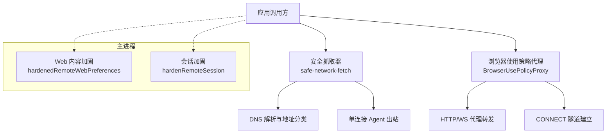
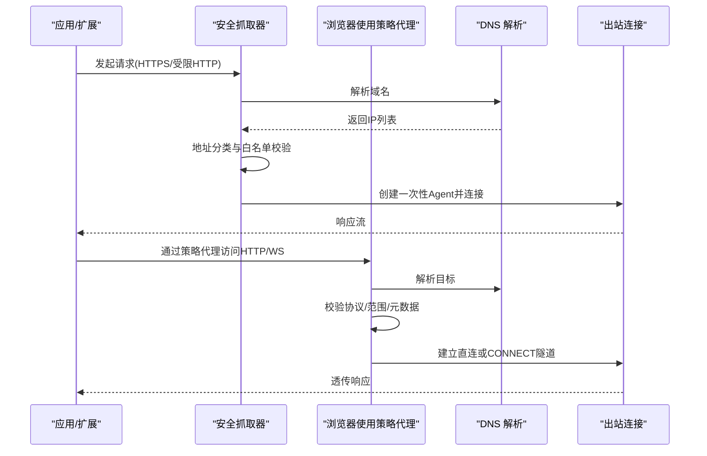
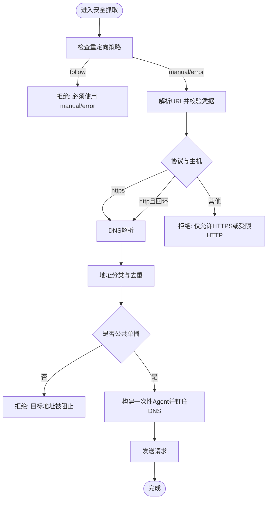
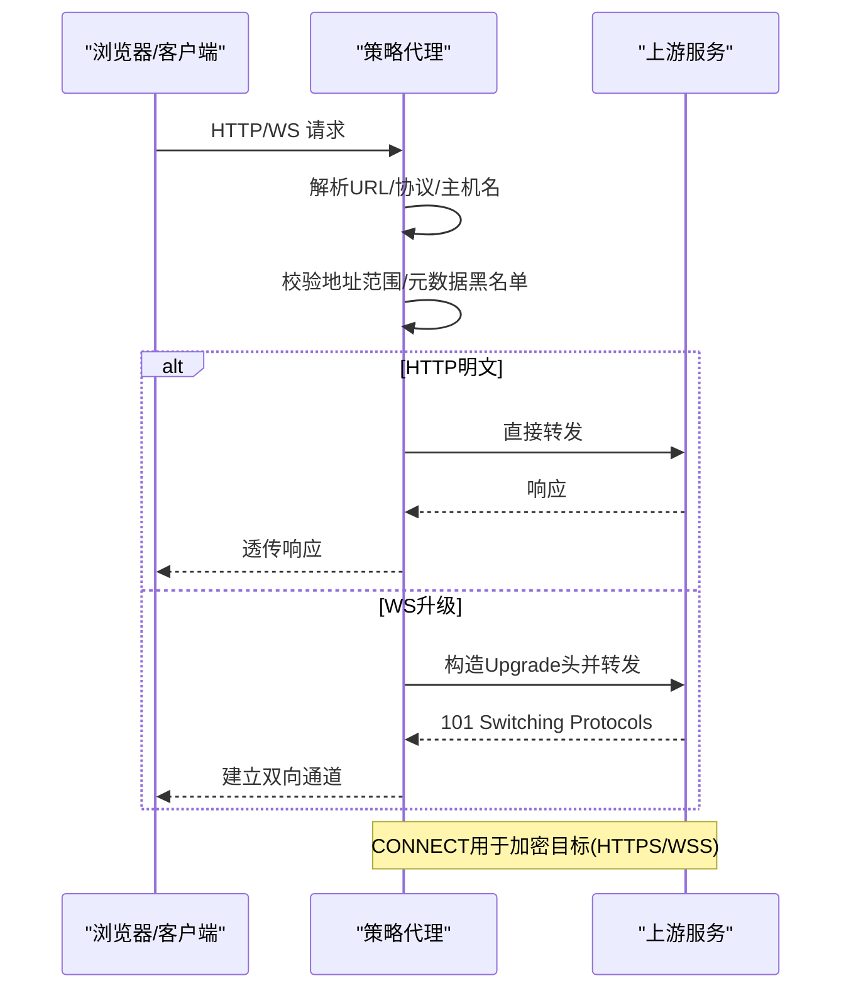
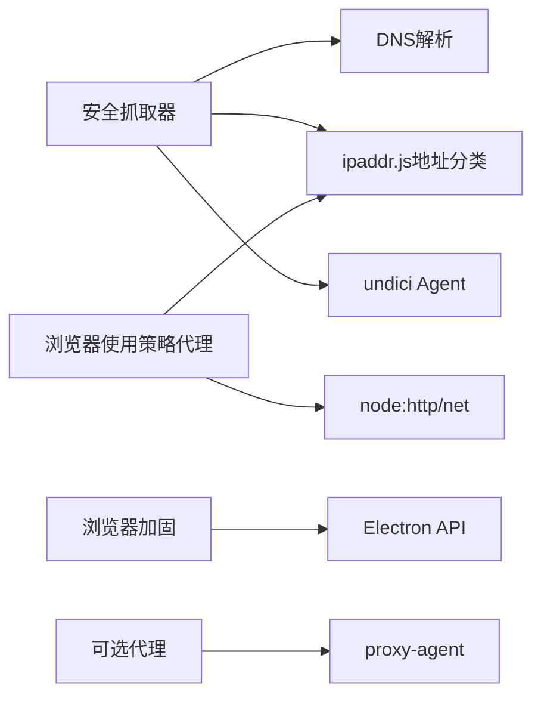

# 网络安全策略

<cite>
**本文引用的文件**
- [src/main/proxy-fetch.ts](file://src/main/proxy-fetch.ts)
- [kun/src/adapters/model/proxy-fetch.ts](file://kun/src/adapters/model/proxy-fetch.ts)
- [src/main/browser-security/web-contents-hardening.ts](file://src/main/browser-security/web-contents-hardening.ts)
- [kun/src/extensions/safe-network-fetch.ts](file://kun/src/extensions/safe-network-fetch.ts)
- [src/main/browser-use/network-policy.ts](file://src/main/browser-use/network-policy.ts)
</cite>

## 目录
1. [简介](#简介)
2. [项目结构](#项目结构)
3. [核心组件](#核心组件)
4. [架构总览](#架构总览)
5. [详细组件分析](#详细组件分析)
6. [依赖关系分析](#依赖关系分析)
7. [性能考量](#性能考量)
8. [故障排查指南](#故障排查指南)
9. [结论](#结论)
10. [附录](#附录)

## 简介
本文件为 DeepSeek-GUI 的网络安全策略提供系统化文档，覆盖网络请求过滤、代理配置与认证、SSL/TLS 安全配置、跨域资源共享（CORS）策略、网络监控与异常检测，以及最佳实践与常见攻击防护。内容基于仓库中实际实现的网络与安全模块进行梳理，帮助读者理解并正确配置各层安全控制点。

## 项目结构
DeepSeek-GUI 在网络与安全方面采用分层设计：
- 主进程浏览器安全加固：限制 Web 内容与会话权限，降低渲染进程风险面。
- 扩展/模型适配器安全抓取：对 DNS 解析、目标地址分类、传输头白名单、连接复用等进行严格约束。
- 浏览器使用模式网络策略：在受控代理内转发 HTTP/WS 流量，强制白名单与地址校验，屏蔽云元数据等敏感目标。
- 可选代理支持：通过代理库将请求经 HTTP/HTTPS 代理转发，同时限制协议与请求体类型。

图表来源
- [src/main/browser-security/web-contents-hardening.ts:1-33](file://src/main/browser-security/web-contents-hardening.ts#L1-L33)
- [kun/src/extensions/safe-network-fetch.ts:1-252](file://kun/src/extensions/safe-network-fetch.ts#L1-L252)
- [src/main/browser-use/network-policy.ts:1-576](file://src/main/browser-use/network-policy.ts#L1-L576)

章节来源
- [src/main/browser-security/web-contents-hardening.ts:1-33](file://src/main/browser-security/web-contents-hardening.ts#L1-L33)
- [kun/src/extensions/safe-network-fetch.ts:1-252](file://kun/src/extensions/safe-network-fetch.ts#L1-L252)
- [src/main/browser-use/network-policy.ts:1-576](file://src/main/browser-use/network-policy.ts#L1-L576)

## 核心组件
- 安全抓取器（Extension/Model 场景）
  - 强制 HTTPS 或受限的本地回环 HTTP；禁止嵌入凭据；拒绝自动重定向；仅允许公共单播地址；禁用传输层危险头；使用一次性 Agent 防止连接复用与全局代理污染；DNS 结果被钉住，避免中间人劫持。
- 浏览器使用网络策略（Browser Use 场景）
  - 提供本地回环策略代理，统一拦截 HTTP/WS/WSS 流量；对域名与 IP 进行白名单与范围校验；屏蔽云元数据主机与特定公网元数据 IP；支持 CONNECT 隧道用于加密流量；可配置并发上限与超时。
- 主进程浏览器加固
  - 默认关闭 Node 集成、webview、不安全内容加载；启用沙箱与 webSecurity；禁用下载与设备权限；限制弹窗与自动播放。
- 可选代理支持
  - 当配置了代理时，通过代理库将请求经 HTTP/HTTPS 代理转发；仅允许 http/https 协议；自动补齐 Content-Length；支持 AbortSignal 取消。

章节来源
- [kun/src/extensions/safe-network-fetch.ts:1-252](file://kun/src/extensions/safe-network-fetch.ts#L1-L252)
- [src/main/browser-use/network-policy.ts:1-576](file://src/main/browser-use/network-policy.ts#L1-L576)
- [src/main/browser-security/web-contents-hardening.ts:1-33](file://src/main/browser-security/web-contents-hardening.ts#L1-L33)
- [src/main/proxy-fetch.ts:1-96](file://src/main/proxy-fetch.ts#L1-L96)
- [kun/src/adapters/model/proxy-fetch.ts:1-108](file://kun/src/adapters/model/proxy-fetch.ts#L1-L108)

## 架构总览
下图展示从应用到网络的完整路径，包括策略检查、DNS 解析、代理转发与出站连接。

图表来源
- [kun/src/extensions/safe-network-fetch.ts:53-97](file://kun/src/extensions/safe-network-fetch.ts#L53-L97)
- [src/main/browser-use/network-policy.ts:259-504](file://src/main/browser-use/network-policy.ts#L259-L504)

## 详细组件分析

### 组件A：安全抓取器（Extension/Model 场景）
- URL 白名单与协议限制
  - 仅允许 https:；http: 仅限本地回环主机（localhost/127.0.0.1/::1）。
  - 禁止 URL 中包含用户名/密码。
  - 禁止自动重定向（redirect=follow），需手动处理。
- DNS 与地址校验
  - 解析后按 IPv4/IPv6 规范化，仅允许公共单播地址；屏蔽作用域 IPv6 与无效地址。
  - 使用“钉住”的 lookup 回调，确保连接阶段使用的地址与策略校验一致。
- 传输头与连接隔离
  - 禁止设置 connection/host/proxy-connection/te/trailer/transfer-encoding/upgrade 等传输头。
  - 使用 connections=1、pipelining=0 的 Agent，避免连接复用与全局代理污染。
- 错误与异常
  - 非法协议、凭据、重定向、DNS 为空、地址不在白名单等均抛出明确错误。

图表来源
- [kun/src/extensions/safe-network-fetch.ts:53-97](file://kun/src/extensions/safe-network-fetch.ts#L53-L97)
- [kun/src/extensions/safe-network-fetch.ts:99-148](file://kun/src/extensions/safe-network-fetch.ts#L99-L148)
- [kun/src/extensions/safe-network-fetch.ts:176-205](file://kun/src/extensions/safe-network-fetch.ts#L176-L205)

章节来源
- [kun/src/extensions/safe-network-fetch.ts:1-252](file://kun/src/extensions/safe-network-fetch.ts#L1-L252)

### 组件B：浏览器使用网络策略（Browser Use 场景）
- 策略代理
  - 启动本地回环 HTTP 代理，监听 HTTP/WS/WSS 请求与 CONNECT 隧道。
  - 对每个请求执行 URL 规范化、协议白名单（http/ws/wss）、主机名黑名单（云元数据）、IP 范围校验（仅公共单播）。
  - 对加密目标强制使用 CONNECT；对 WS 升级进行协议匹配。
  - 可配置最大并发连接数与连接超时；事件回调上报允许/拒绝结果。
- 地址与主机名校验
  - 本地开发模式限定精确 origin；公开模式禁止回环与 .local 后缀。
  - 屏蔽 metadata.google.internal、metadata.goog、metadata.azure.internal 及特定公网元数据 IP。
- 头部与连接管理
  - 出站头过滤跳频头；Host 头重写为目标 host；连接生命周期由代理统一管理。

图表来源
- [src/main/browser-use/network-policy.ts:259-504](file://src/main/browser-use/network-policy.ts#L259-L504)
- [src/main/browser-use/network-policy.ts:506-522](file://src/main/browser-use/network-policy.ts#L506-L522)

章节来源
- [src/main/browser-use/network-policy.ts:1-576](file://src/main/browser-use/network-policy.ts#L1-L576)

### 组件C：主进程浏览器加固
- Web 内容偏好
  - 关闭 Node 集成、Worker/SubFrame 集成；开启上下文隔离与沙箱；启用 webSecurity；禁止不安全内容；禁用 webview；限制导航拖放；启用安全对话框；禁用自动播放；关闭拼写检查；启用后台节流。
- 会话加固
  - 默认拒绝所有权限请求与设备权限；阻止下载；避免共享分区与所有权记录。

章节来源
- [src/main/browser-security/web-contents-hardening.ts:1-33](file://src/main/browser-security/web-contents-hardening.ts#L1-L33)

### 组件D：可选代理支持（HTTP/HTTPS 代理）
- 功能要点
  - 当提供代理 URL 时，通过代理库将请求经代理转发；仅允许 http/https 协议；自动补齐 Content-Length；支持 AbortSignal 取消；将 Node 响应转换为标准 Response。
- 适用场景
  - 需要企业代理或透明代理环境下的出站访问；不适用于需要严格地址白名单的场景（应优先使用安全抓取器或策略代理）。

章节来源
- [src/main/proxy-fetch.ts:1-96](file://src/main/proxy-fetch.ts#L1-L96)
- [kun/src/adapters/model/proxy-fetch.ts:1-108](file://kun/src/adapters/model/proxy-fetch.ts#L1-L108)

## 依赖关系分析
- 安全抓取器依赖 DNS 解析与 ipaddr.js 进行地址分类；使用 undici 的 Agent 做出站连接。
- 浏览器使用策略代理依赖 node:http/net 实现代理与 CONNECT 隧道；同样使用 ipaddr.js 进行地址判定。
- 主进程浏览器加固依赖 Electron Session/WebPreferences 能力。
- 可选代理支持依赖 proxy-agent 与 Node http/https 模块。

图表来源
- [kun/src/extensions/safe-network-fetch.ts:1-252](file://kun/src/extensions/safe-network-fetch.ts#L1-L252)
- [src/main/browser-use/network-policy.ts:1-576](file://src/main/browser-use/network-policy.ts#L1-L576)
- [src/main/browser-security/web-contents-hardening.ts:1-33](file://src/main/browser-security/web-contents-hardening.ts#L1-L33)
- [src/main/proxy-fetch.ts:1-96](file://src/main/proxy-fetch.ts#L1-L96)

章节来源
- [kun/src/extensions/safe-network-fetch.ts:1-252](file://kun/src/extensions/safe-network-fetch.ts#L1-L252)
- [src/main/browser-use/network-policy.ts:1-576](file://src/main/browser-use/network-policy.ts#L1-L576)
- [src/main/browser-security/web-contents-hardening.ts:1-33](file://src/main/browser-security/web-contents-hardening.ts#L1-L33)
- [src/main/proxy-fetch.ts:1-96](file://src/main/proxy-fetch.ts#L1-L96)

## 性能考量
- 安全抓取器使用一次性 Agent（connections=1, pipelining=0），避免连接复用带来的安全风险，可能增加握手开销；适合短生命周期、高安全要求的场景。
- 策略代理支持并发上限与超时控制，防止资源耗尽；建议根据业务负载合理设置 maxConcurrentConnections 与 connectTimeoutMs。
- 可选代理模式下，代理库会进行协议转换与流式处理，注意代理链路与带宽对延迟的影响。

[本节为通用指导，不直接分析具体文件]

## 故障排查指南
- 常见错误与定位
  - “不支持的协议/方案”：检查 URL 是否为 https 或受限 http；确认未使用 ws/wss 在非策略代理路径。
  - “目标地址被阻止”：检查 DNS 解析结果是否包含私有/回环/链路本地/云元数据 IP；确认策略模式（本地开发 vs 公开）。
  - “无法设置传输头”：移除 connection/host/proxy-connection/te/trailer/transfer-encoding/upgrade 等头。
  - “自动重定向被拒绝”：将 redirect 设置为 manual 或 error，并在代码中显式处理跳转。
  - “代理连接失败/超时”：检查代理配置是否正确；确认策略代理已启动并绑定回环地址；核对并发上限与超时设置。
- 日志与观测
  - 策略代理可通过 onPolicyEvent 回调获取 allowed/blocked 事件，便于审计与告警。
  - 浏览器使用模式可使用 sanitizeBrowserUseUrl 输出脱敏 URL 用于日志。

章节来源
- [src/main/browser-use/network-policy.ts:493-504](file://src/main/browser-use/network-policy.ts#L493-L504)
- [src/main/browser-use/network-policy.ts:82-89](file://src/main/browser-use/network-policy.ts#L82-L89)
- [kun/src/extensions/safe-network-fetch.ts:53-97](file://kun/src/extensions/safe-network-fetch.ts#L53-L97)

## 结论
DeepSeek-GUI 在网络层面提供了多层安全控制：主进程渲染加固、扩展/模型的安全抓取、浏览器使用模式的策略代理与可选代理支持。通过严格的协议白名单、DNS 与地址校验、传输头限制、连接隔离与并发控制，有效防范 SSRF、云元数据泄露、中间人攻击与代理滥用等风险。建议在生产环境中优先采用安全抓取器与策略代理，并结合监控与审计机制持续优化。

[本节为总结性内容，不直接分析具体文件]

## 附录

### 网络安全配置最佳实践
- 始终使用 HTTPS；仅在必要时允许受限的本地回环 HTTP。
- 禁止在 URL 中嵌入凭据；使用独立认证通道管理密钥。
- 禁用自动重定向；如需跳转，必须在应用层显式处理并重新校验目标。
- 固定 DNS 解析结果，避免连接阶段的地址漂移。
- 使用一次性连接 Agent，避免连接复用与全局代理污染。
- 在策略代理中屏蔽云元数据主机与特定公网元数据 IP。
- 限制并发连接与超时，防止资源耗尽与慢速攻击。
- 在主进程中启用沙箱、webSecurity，关闭不必要的功能（Node 集成、webview、下载等）。

[本节为通用指导，不直接分析具体文件]

### 常见攻击防护方法
- SSRF 防护：仅允许公共单播地址；屏蔽回环、链路本地、私有段与云元数据；策略代理强制白名单。
- 中间人攻击防护：钉住 DNS；禁用传输层危险头；使用一次性 Agent。
- 凭据泄露防护：禁止 URL 含凭据；最小化日志中的敏感信息。
- 代理滥用防护：策略代理仅暴露于回环；配置并发上限与超时；审计 allowed/blocked 事件。
- 渲染进程风险面：启用沙箱与 webSecurity；关闭 Node 集成与 webview；限制权限与下载。

[本节为通用指导，不直接分析具体文件]