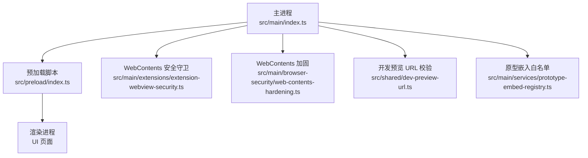
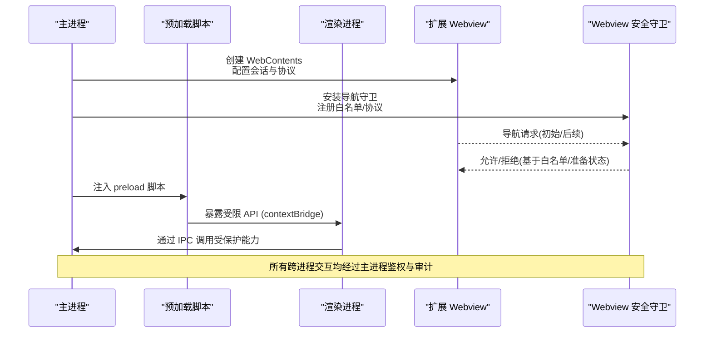
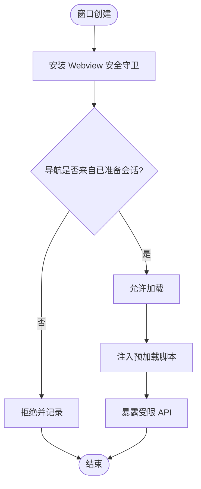
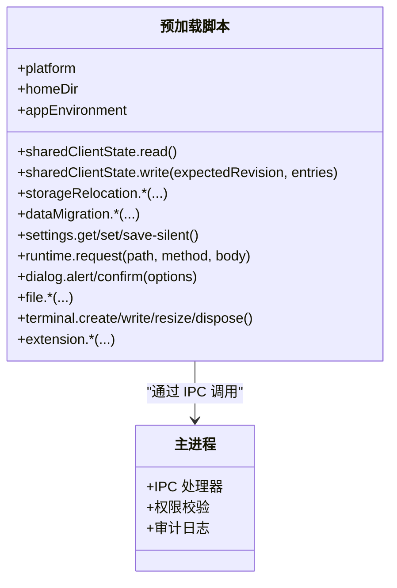
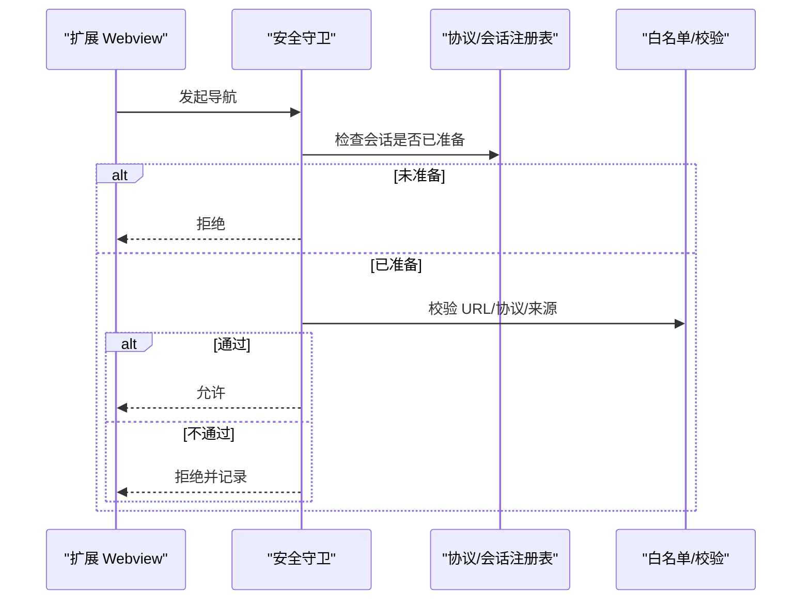
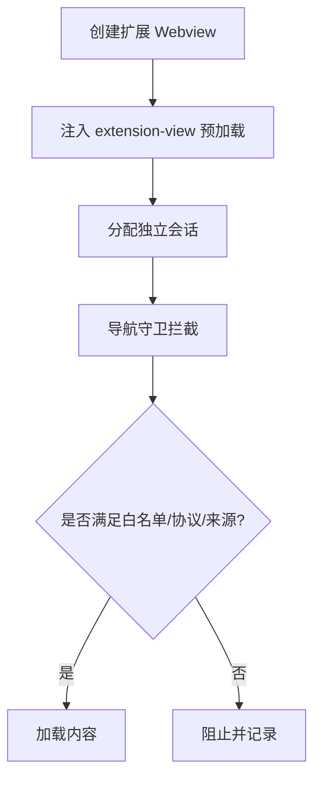
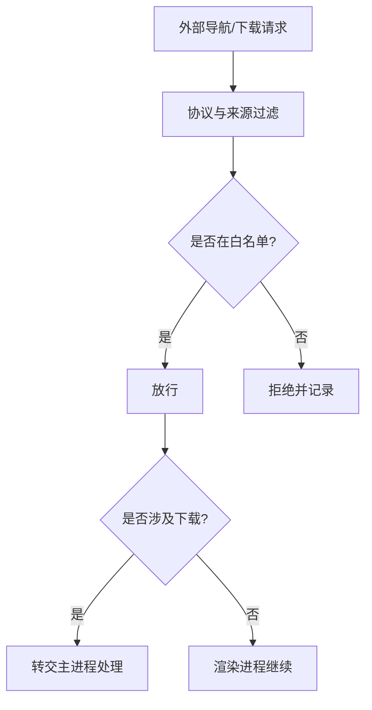
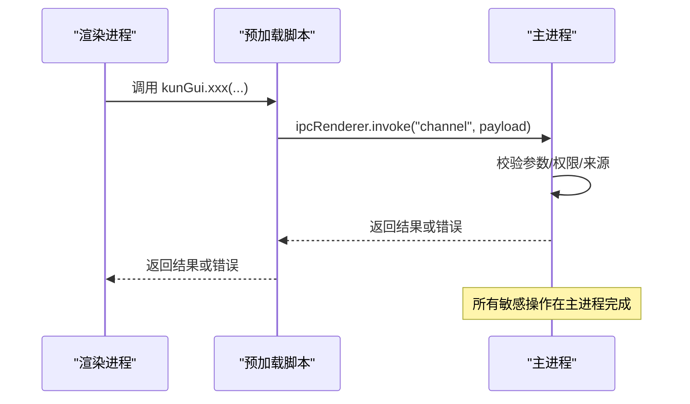
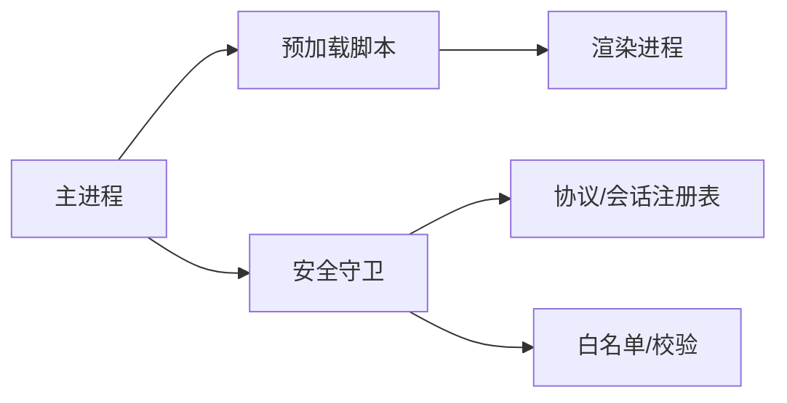

# 进程隔离与沙箱

<cite>
**本文引用的文件**
- [src/main/index.ts](file://src/main/index.ts)
- [src/preload/index.ts](file://src/preload/index.ts)
- [electron.vite.config.ts](file://electron.vite.config.ts)
- [src/main/extensions/extension-webview-security.ts](file://src/main/extensions/extension-webview-security.ts)
- [src/main/browser-security/web-contents-hardening.ts](file://src/main/browser-security/web-contents-hardening.ts)
- [src/shared/dev-preview-url.ts](file://src/shared/dev-preview-url.ts)
- [src/main/services/prototype-embed-registry.ts](file://src/main/services/prototype-embed-registry.ts)
</cite>

## 目录
1. [简介](#简介)
2. [项目结构](#项目结构)
3. [核心组件](#核心组件)
4. [架构总览](#架构总览)
5. [详细组件分析](#详细组件分析)
6. [依赖关系分析](#依赖关系分析)
7. [性能与安全权衡](#性能与安全权衡)
8. [故障排查指南](#故障排查指南)
9. [结论](#结论)

## 简介
本文件聚焦 DeepSeek-GUI 的进程隔离与沙箱机制，系统性说明 Electron 主进程、渲染进程与预加载脚本之间的安全边界；解释 WebContents 的沙箱配置（contextIsolation、sandbox、nodeIntegration）及其在应用中的落地方式；阐述 WebContents 生命周期管理与权限控制；给出扩展 Webview 的安全加固措施（preload 注入、会话隔离、资源访问限制）；并总结外部 Webview 的安全策略（URL 白名单、协议过滤、下载控制）以及进程间通信的安全最佳实践与常见漏洞防护。

## 项目结构
DeepSeek-GUI 采用典型的 Electron 三进程模型：
- 主进程：负责应用生命周期、窗口管理、协议注册、安全守卫安装、IPC 路由等。
- 预加载脚本：运行在渲染进程上下文但具备有限 Node 能力，作为受信任桥接层暴露最小 API。
- 渲染进程：承载 UI，默认启用沙箱，禁止直接访问 Node 与系统 API。

**图示来源**
- [src/main/index.ts:684-703](file://src/main/index.ts#L684-L703)
- [src/preload/index.ts:1-685](file://src/preload/index.ts#L1-L685)
- [src/main/extensions/extension-webview-security.ts](file://src/main/extensions/extension-webview-security.ts)
- [src/main/browser-security/web-contents-hardening.ts](file://src/main/browser-security/web-contents-hardening.ts)
- [src/shared/dev-preview-url.ts](file://src/shared/dev-preview-url.ts)
- [src/main/services/prototype-embed-registry.ts](file://src/main/services/prototype-embed-registry.ts)

**章节来源**
- [src/main/index.ts:684-703](file://src/main/index.ts#L684-L703)
- [src/preload/index.ts:1-685](file://src/preload/index.ts#L1-L685)
- [electron.vite.config.ts:17-32](file://electron.vite.config.ts#L17-L32)

## 核心组件
- 主进程入口与窗口初始化：集中注册协议、安装 Webview 安全守卫、绑定可信工作区 URL、处理单实例锁、启动各类运行时。
- 预加载脚本：以最小化 API 暴露给渲染进程，所有敏感操作通过 IPC 调用主进程完成。
- WebContents 安全守卫：为扩展 Webview 提供统一的导航拦截、协议白名单、初始导航准备检查、可信工作区判定与拒绝回调。
- WebContents 加固：对浏览器窗口进行更严格的安全选项设置与行为约束。
- 开发预览与原型嵌入：通过白名单与协议注册限制可加载的资源范围。

**章节来源**
- [src/main/index.ts:684-703](file://src/main/index.ts#L684-L703)
- [src/preload/index.ts:1-685](file://src/preload/index.ts#L1-L685)
- [src/main/extensions/extension-webview-security.ts](file://src/main/extensions/extension-webview-security.ts)
- [src/main/browser-security/web-contents-hardening.ts](file://src/main/browser-security/web-contents-hardening.ts)
- [src/shared/dev-preview-url.ts](file://src/shared/dev-preview-url.ts)
- [src/main/services/prototype-embed-registry.ts](file://src/main/services/prototype-embed-registry.ts)

## 架构总览
下图展示从主进程到渲染进程的受控通道，以及扩展 Webview 的生命周期与安全检查点。

**图示来源**
- [src/main/index.ts:684-703](file://src/main/index.ts#L684-L703)
- [src/preload/index.ts:1-685](file://src/preload/index.ts#L1-L685)
- [src/main/extensions/extension-webview-security.ts](file://src/main/extensions/extension-webview-security.ts)

## 详细组件分析

### 主进程安全边界与窗口管理
- 统一安装扩展 Webview 安全守卫，传入会话注册表、预加载路径、可信工作区判定函数、开发预览 URL 校验与原型嵌入白名单校验，并在被拒绝时记录日志。
- 使用“可信工作区 URL”比对逻辑，仅比较协议、用户信息、主机与规范化路径，避免查询串或哈希带来的误判。
- 将平台协议标记为特权协议，配合扩展媒体协议注册，确保扩展资源仅在受控范围内加载。

**图示来源**
- [src/main/index.ts:684-703](file://src/main/index.ts#L684-L703)
- [src/main/index.ts:280-297](file://src/main/index.ts#L280-L297)

**章节来源**
- [src/main/index.ts:684-703](file://src/main/index.ts#L684-L703)
- [src/main/index.ts:280-297](file://src/main/index.ts#L280-L297)

### 预加载脚本：最小暴露面与 IPC 桥接
- 预加载脚本运行于沙箱环境，无法直接 require Node 内置模块；通过 additionalArguments 传递必要信息（如 home 目录与应用环境）。
- 通过 contextBridge.exposeInMainWorld 暴露极小且明确的 API 集合，所有敏感操作（文件、设置、运行时、终端、扩展管理等）均通过 ipcRenderer.invoke/on 转发至主进程处理。
- 事件订阅采用包装监听器模式，返回取消函数，避免内存泄漏与非法监听。

**图示来源**
- [src/preload/index.ts:1-685](file://src/preload/index.ts#L1-L685)

**章节来源**
- [src/preload/index.ts:1-685](file://src/preload/index.ts#L1-L685)

### WebContents 生命周期与权限控制
- 扩展 Webview 的导航由安全守卫统一拦截，依据“已准备会话”和“初始导航协议白名单”决定是否允许。
- 可信工作区判定仅比较不可变部分（协议、用户名、密码、主机、规范化路径），防止通过 query/hash 绕过。
- 开发预览 URL 与原型嵌入资源需分别通过专用校验函数与注册表，确保仅受信任来源可加载。

**图示来源**
- [src/main/index.ts:684-703](file://src/main/index.ts#L684-L703)
- [src/shared/dev-preview-url.ts](file://src/shared/dev-preview-url.ts)
- [src/main/services/prototype-embed-registry.ts](file://src/main/services/prototype-embed-registry.ts)

**章节来源**
- [src/main/index.ts:684-703](file://src/main/index.ts#L684-L703)
- [src/shared/dev-preview-url.ts](file://src/shared/dev-preview-url.ts)
- [src/main/services/prototype-embed-registry.ts](file://src/main/services/prototype-embed-registry.ts)

### 扩展 Webview 的安全加固
- 预加载脚本注入：为每个扩展 Webview 注入专用的 extension-view 预加载，实现与宿主隔离的受控能力。
- 会话隔离：通过 ExtensionViewSessionRegistry 维护独立会话，确保不同扩展视图之间数据与 Cookie 隔离。
- 资源访问限制：结合协议注册与白名单校验，仅允许受控协议与来源加载资源；拒绝未知或危险协议。

**图示来源**
- [src/main/index.ts:684-703](file://src/main/index.ts#L684-L703)
- [electron.vite.config.ts:17-32](file://electron.vite.config.ts#L17-L32)

**章节来源**
- [src/main/index.ts:684-703](file://src/main/index.ts#L684-L703)
- [electron.vite.config.ts:17-32](file://electron.vite.config.ts#L17-L32)

### 外部 Webview 的安全策略
- URL 白名单：仅允许受信任域名与协议，开发预览与原型嵌入需额外校验。
- 协议过滤：将平台协议标记为特权协议，限制任意协议加载。
- 下载控制：通过主进程集中处理下载相关 IPC，渲染进程不得直接触发不受控下载。

**图示来源**
- [src/main/index.ts:684-703](file://src/main/index.ts#L684-L703)
- [src/shared/dev-preview-url.ts](file://src/shared/dev-preview-url.ts)
- [src/main/services/prototype-embed-registry.ts](file://src/main/services/prototype-embed-registry.ts)

**章节来源**
- [src/main/index.ts:684-703](file://src/main/index.ts#L684-L703)
- [src/shared/dev-preview-url.ts](file://src/shared/dev-preview-url.ts)
- [src/main/services/prototype-embed-registry.ts](file://src/main/services/prototype-embed-registry.ts)

### 进程间通信的安全最佳实践
- 最小暴露面：预加载仅暴露必要 API，避免直接暴露 Node 或系统能力。
- 参数校验：主进程对所有 IPC 输入进行类型、长度、格式与权限校验。
- 审计与日志：关键操作记录原因、来源与结果，便于追踪与回溯。
- 事件订阅管理：提供取消函数，避免监听器泄漏与越权事件消费。

**图示来源**
- [src/preload/index.ts:1-685](file://src/preload/index.ts#L1-L685)

**章节来源**
- [src/preload/index.ts:1-685](file://src/preload/index.ts#L1-L685)

## 依赖关系分析
- 主进程依赖预加载脚本构建受控 API 表面，并通过安全守卫约束扩展 Webview 的导航与资源加载。
- 预加载脚本依赖主进程提供的 IPC 通道，所有能力调用均回退到主进程执行。
- 安全守卫依赖白名单与协议注册表，确保仅受信任来源可加载。

**图示来源**
- [src/main/index.ts:684-703](file://src/main/index.ts#L684-L703)
- [src/preload/index.ts:1-685](file://src/preload/index.ts#L1-L685)

**章节来源**
- [src/main/index.ts:684-703](file://src/main/index.ts#L684-L703)
- [src/preload/index.ts:1-685](file://src/preload/index.ts#L1-L685)

## 性能与安全权衡
- 沙箱渲染提升安全性但增加 IPC 开销；建议批量操作与事件合并以减少频繁调用。
- 预加载脚本保持精简，避免引入重型依赖，降低启动与内存占用。
- 安全守卫与白名单校验应在主进程侧缓存热点规则，减少重复计算。

[本节为通用指导，无需具体文件引用]

## 故障排查指南
- 扩展 Webview 导航被拒绝：检查会话是否已准备、URL 是否在白名单、协议是否为特权协议。
- 预加载 API 调用失败：确认主进程 IPC 处理器是否存在、参数是否通过校验、权限是否足够。
- 开发预览或原型嵌入无法加载：核对 dev-preview URL 与原型嵌入注册表是否包含目标来源。
- 下载异常：确认下载流程经主进程处理，避免渲染进程直接触发不受控下载。

**章节来源**
- [src/main/index.ts:684-703](file://src/main/index.ts#L684-L703)
- [src/preload/index.ts:1-685](file://src/preload/index.ts#L1-L685)
- [src/shared/dev-preview-url.ts](file://src/shared/dev-preview-url.ts)
- [src/main/services/prototype-embed-registry.ts](file://src/main/services/prototype-embed-registry.ts)

## 结论
DeepSeek-GUI 通过主进程集中管控、预加载最小暴露面、WebContents 安全守卫与白名单机制，构建了清晰的进程隔离与沙箱边界。扩展 Webview 在会话隔离与资源访问限制下运行，外部导航与下载均受控于主进程。遵循本文的最佳实践可有效降低 XSS、协议滥用、越权访问等风险，同时兼顾性能与可维护性。