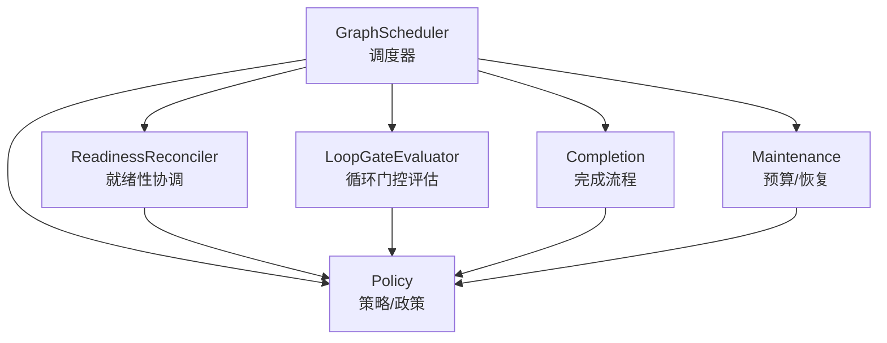
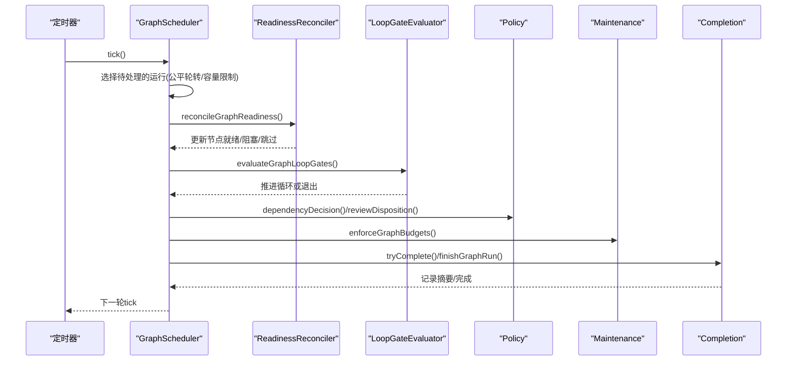
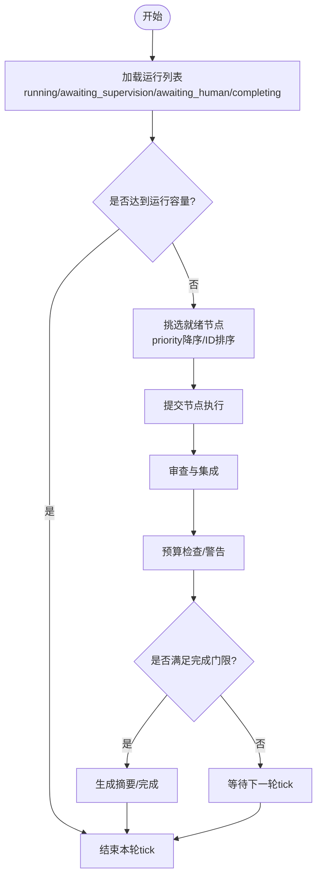
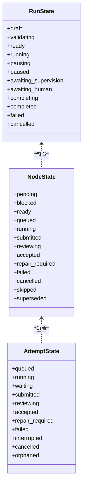
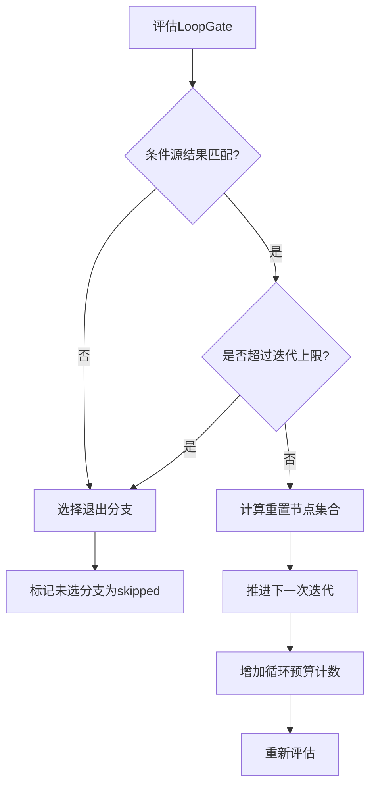
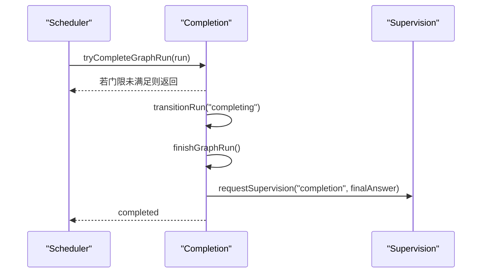
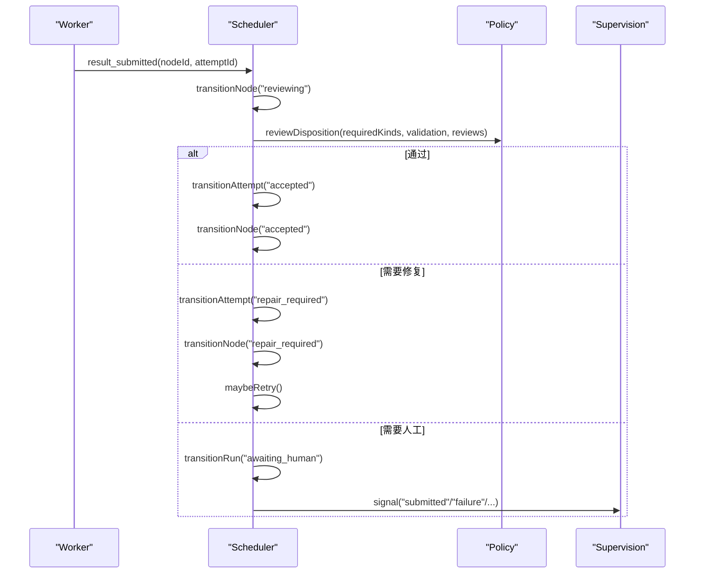
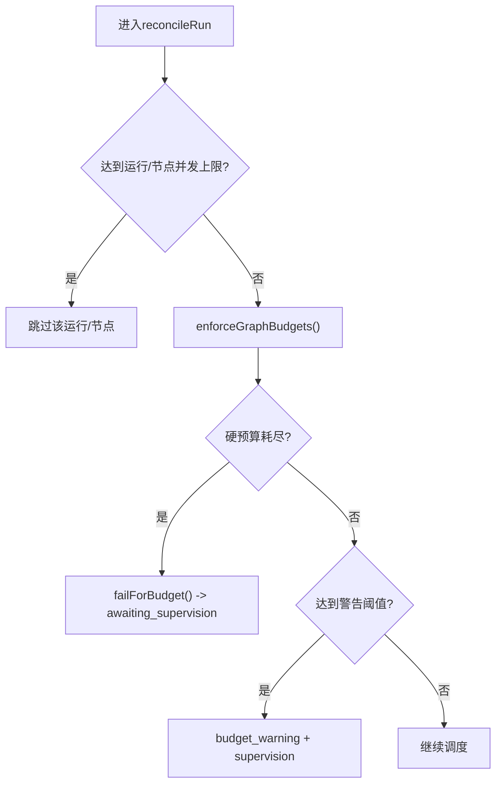
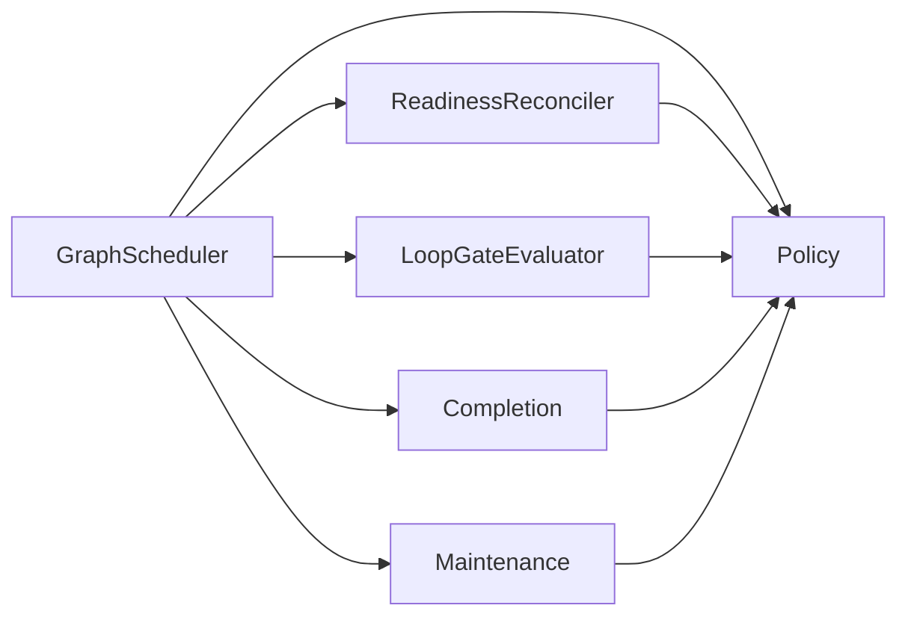

# Agent Graph架构

<cite>
**本文引用的文件**
- [graph-scheduler.ts](file://kun/src/graph/graph-scheduler.ts)
- [graph-scheduler-types.ts](file://kun/src/graph/graph-scheduler-types.ts)
- [graph-reducer.ts](file://kun/src/graph/graph-reducer.ts)
- [graph-loop-gate-evaluator.ts](file://kun/src/graph/graph-loop-gate-evaluator.ts)
- [graph-run-completion.ts](file://kun/src/graph/graph-run-completion.ts)
- [graph-scheduler-policy.ts](file://kun/src/graph/graph-scheduler-policy.ts)
- [graph-loop-policy.ts](file://kun/src/graph/graph-loop-policy.ts)
- [graph-readiness-reconciler.ts](file://kun/src/graph/graph-readiness-reconciler.ts)
- [graph-scheduler-maintenance.ts](file://kun/src/graph/graph-scheduler-maintenance.ts)
</cite>

## 目录
1. [简介](#简介)
2. [项目结构](#项目结构)
3. [核心组件](#核心组件)
4. [架构总览](#架构总览)
5. [详细组件分析](#详细组件分析)
6. [依赖关系分析](#依赖关系分析)
7. [性能考量](#性能考量)
8. [故障排查指南](#故障排查指南)
9. [结论](#结论)
10. [附录](#附录)

## 简介
本文件面向DeepSeek-GUI的Agent Graph调度系统，聚焦Graph调度器的核心机制与运行生命周期。内容涵盖：
- 节点状态管理与依赖解析
- 执行优先级控制与并发限制
- 节点类型系统（普通节点、循环门控节点、完成节点）
- 事件驱动的状态转换（提交、审查、接受、失败）
- 资源预算与最大并发控制
- Graph定义最佳实践、示例与调试方法

## 项目结构
Graph子系统位于 kun/src/graph 目录，围绕“事件溯源 + 状态机”的模式组织：
- 调度器：周期性tick驱动，负责从存储中拉取运行实例，计算就绪节点并调度执行
- 状态归约：将事件流还原为一致的运行时快照，严格校验状态迁移
- 循环门控：评估LoopGate条件，推进或退出循环，重置相关节点
- 完成流程：在满足所有完成门限后生成摘要并收尾
- 策略与政策：依赖判定、审查决策、预算与警告、终止条件等
- 维护与诊断：预算强制、冲突重试、错误恢复、监督信号

图表来源
- [graph-scheduler.ts:106-162](file://kun/src/graph/graph-scheduler.ts#L106-L162)
- [graph-readiness-reconciler.ts:11-66](file://kun/src/graph/graph-readiness-reconciler.ts#L11-L66)
- [graph-loop-gate-evaluator.ts:5-39](file://kun/src/graph/graph-loop-gate-evaluator.ts#L5-L39)
- [graph-run-completion.ts:19-59](file://kun/src/graph/graph-run-completion.ts#L19-L59)
- [graph-scheduler-policy.ts:39-61](file://kun/src/graph/graph-scheduler-policy.ts#L39-L61)
- [graph-scheduler-maintenance.ts:36-63](file://kun/src/graph/graph-scheduler-maintenance.ts#L36-L63)

章节来源
- [graph-scheduler.ts:1-699](file://kun/src/graph/graph-scheduler.ts#L1-L699)
- [graph-reducer.ts:15-58](file://kun/src/graph/graph-reducer.ts#L15-L58)

## 核心组件
- GraphScheduler：周期tick驱动，按运行容量、节点并发、每运行并发限制挑选就绪节点并调度；处理提交→审查→接受/修复/失败的完整流转；管理预算、监督信号与完成收尾。
- GraphReducer：基于事件流的不可变状态机，严格校验Run/Node/Attempt三层的合法迁移，支持重放与一致性保障。
- LoopGateEvaluator：根据LoopGate条件源节点结果决定继续循环或退出，必要时重置目标节点集合并推进迭代。
- Completion：检查完成门限（必需节点、完成节点、无阻塞），生成最终摘要并通知监督。
- Policy：依赖判定、审查决议、预算比率、终止条件、结果规范化等。
- Maintenance：预算强制、警告阈值、冲突重试、调度错误恢复。

章节来源
- [graph-scheduler.ts:40-162](file://kun/src/graph/graph-scheduler.ts#L40-L162)
- [graph-reducer.ts:15-58](file://kun/src/graph/graph-reducer.ts#L15-L58)
- [graph-loop-gate-evaluator.ts:5-39](file://kun/src/graph/graph-loop-gate-evaluator.ts#L5-L39)
- [graph-run-completion.ts:19-59](file://kun/src/graph/graph-run-completion.ts#L19-L59)
- [graph-scheduler-policy.ts:39-61](file://kun/src/graph/graph-scheduler-policy.ts#L39-L61)
- [graph-scheduler-maintenance.ts:36-63](file://kun/src/graph/graph-scheduler-maintenance.ts#L36-L63)

## 架构总览
Graph以“事件溯源+状态机”为核心，调度器通过周期性tick读取持久化运行，协调就绪性、循环门控、预算与完成流程，并通过监督端口上报异常与需要人工介入的场景。

图表来源
- [graph-scheduler.ts:106-162](file://kun/src/graph/graph-scheduler.ts#L106-L162)
- [graph-readiness-reconciler.ts:11-66](file://kun/src/graph/graph-readiness-reconciler.ts#L11-L66)
- [graph-loop-gate-evaluator.ts:5-39](file://kun/src/graph/graph-loop-gate-evaluator.ts#L5-L39)
- [graph-scheduler-policy.ts:39-61](file://kun/src/graph/graph-scheduler-policy.ts#L39-L61)
- [graph-scheduler-maintenance.ts:36-63](file://kun/src/graph/graph-scheduler-maintenance.ts#L36-L63)
- [graph-run-completion.ts:19-59](file://kun/src/graph/graph-run-completion.ts#L19-L59)

## 详细组件分析

### Graph调度器：生命周期与事件驱动
- 启动与停止：start()启动定时tick；stop()中止活跃尝试、清理任务、等待当前tick完成。
- 周期调度：tickOnce()按运行容量与节点并发限制挑选就绪节点，调用scheduleNode进行提交；对submitted/reviewing状态的节点进行审查集成与状态推进。
- 事件驱动转换：transitionRun/transitionNode/transitionAttempt通过append追加事件，确保幂等与顺序一致。
- 监督与恢复：当出现审查缺失、写入冲突、预算耗尽或调度错误时，请求supervision.signal进入awaiting_supervision/awaiting_human状态。

图表来源
- [graph-scheduler.ts:61-117](file://kun/src/graph/graph-scheduler.ts#L61-L117)
- [graph-scheduler.ts:118-162](file://kun/src/graph/graph-scheduler.ts#L118-L162)
- [graph-scheduler.ts:288-389](file://kun/src/graph/graph-scheduler.ts#L288-L389)
- [graph-scheduler.ts:478-518](file://kun/src/graph/graph-scheduler.ts#L478-L518)
- [graph-run-completion.ts:19-59](file://kun/src/graph/graph-run-completion.ts#L19-L59)

章节来源
- [graph-scheduler.ts:61-117](file://kun/src/graph/graph-scheduler.ts#L61-L117)
- [graph-scheduler.ts:118-162](file://kun/src/graph/graph-scheduler.ts#L118-L162)
- [graph-scheduler.ts:288-389](file://kun/src/graph/graph-scheduler.ts#L288-L389)
- [graph-scheduler.ts:478-518](file://kun/src/graph/graph-scheduler.ts#L478-L518)
- [graph-scheduler-types.ts:37-77](file://kun/src/graph/graph-scheduler-types.ts#L37-L77)

### 节点状态机与依赖解析
- 三层状态机：Run/Node/Attempt各自有严格的迁移表，任何非法迁移都会抛出归约错误。
- 依赖判定：dependencyDecision依据边类型（control/message）与源节点终态判断子节点ready/blocked/unsatisfiable。
- 就绪性协调：reconcileGraphReadiness统一处理LoopGate分支目标与依赖满足情况，避免提前执行。

图表来源
- [graph-reducer.ts:15-58](file://kun/src/graph/graph-reducer.ts#L15-L58)
- [graph-scheduler-policy.ts:135-152](file://kun/src/graph/graph-scheduler-policy.ts#L135-L152)

章节来源
- [graph-reducer.ts:15-58](file://kun/src/graph/graph-reducer.ts#L15-L58)
- [graph-scheduler-policy.ts:39-61](file://kun/src/graph/graph-scheduler-policy.ts#L39-L61)
- [graph-readiness-reconciler.ts:11-66](file://kun/src/graph/graph-readiness-reconciler.ts#L11-L66)

### 循环门控节点：行为与推进
- 条件源：LoopGate读取condition.sourceNodeId的结果，若匹配outcomeIn则继续循环。
- 迭代上限：受maxIterations与run.budget.limits.maxLoopIterations双重限制。
- 重置集合：loopResetNodeIds计算需重置的节点集合，包括continueTargetNodeId、conditionSourceNodeId、gate本身及可能的exit/exhaustion目标。
- 分支选择：未选中的分支标记为skipped，已选择的分支推进到下一轮。

图表来源
- [graph-loop-gate-evaluator.ts:5-39](file://kun/src/graph/graph-loop-gate-evaluator.ts#L5-L39)
- [graph-loop-policy.ts:110-135](file://kun/src/graph/graph-loop-policy.ts#L110-L135)
- [graph-loop-policy.ts:26-54](file://kun/src/graph/graph-loop-policy.ts#L26-L54)

章节来源
- [graph-loop-gate-evaluator.ts:5-39](file://kun/src/graph/graph-loop-gate-evaluator.ts#L5-L39)
- [graph-loop-policy.ts:26-54](file://kun/src/graph/graph-loop-policy.ts#L26-L54)
- [graph-loop-policy.ts:110-135](file://kun/src/graph/graph-loop-policy.ts#L110-L135)

### 完成节点与完成流程
- 完成门限：必需节点全部接受或被LoopGate豁免；计划声明的completionNodeIds全部接受或被豁免；不存在仍在运行的工作项。
- 完成阶段：进入completing后生成最终摘要（可自定义synthesize或确定性汇总），记录清理信息，转入completed并通知监督。

图表来源
- [graph-run-completion.ts:19-59](file://kun/src/graph/graph-run-completion.ts#L19-L59)
- [graph-scheduler.ts:535-553](file://kun/src/graph/graph-scheduler.ts#L535-L553)

章节来源
- [graph-run-completion.ts:19-59](file://kun/src/graph/graph-run-completion.ts#L19-L59)
- [graph-scheduler.ts:535-553](file://kun/src/graph/graph-scheduler.ts#L535-L553)

### 事件驱动的状态转换：提交、审查、接受、失败
- 提交：节点执行完成后提交结果，进入reviewing。
- 审查：deterministicReview自动判定结构化结果与检查；peer/lead/human审查由监督模块提供。
- 接受：审查通过后节点转为accepted，尝试完成图运行。
- 失败/修复：审查不通过或验证失败时进入repair_required或failed，可能触发重试或监督。

图表来源
- [graph-scheduler.ts:288-389](file://kun/src/graph/graph-scheduler.ts#L288-L389)
- [graph-scheduler-policy.ts:175-208](file://kun/src/graph/graph-scheduler-policy.ts#L175-L208)
- [graph-scheduler-policy.ts:520-576](file://kun/src/graph/graph-scheduler-policy.ts#L520-L576)

章节来源
- [graph-scheduler.ts:288-389](file://kun/src/graph/graph-scheduler.ts#L288-L389)
- [graph-scheduler-policy.ts:175-208](file://kun/src/graph/graph-scheduler-policy.ts#L175-L208)
- [graph-scheduler-policy.ts:520-576](file://kun/src/graph/graph-scheduler-policy.ts#L520-L576)

### 并发执行控制与资源预算
- 运行容量：maxConcurrentRuns限制同时处理的运行数。
- 节点并发：maxConcurrentNodes限制全局活跃节点数；per-run并发= min(run.budget.limits.maxConcurrentNodes, maxConcurrentNodesPerRun)。
- 预算指标：elapsedMs、totalTokens、artifactBytes、messages、revisions、loopIterations、attempts；超硬阈值直接失败并请求监督。
- 预算警告：达到warningRatio时记录警告并通知监督。

图表来源
- [graph-scheduler.ts:118-162](file://kun/src/graph/graph-scheduler.ts#L118-L162)
- [graph-scheduler-maintenance.ts:36-63](file://kun/src/graph/graph-scheduler-maintenance.ts#L36-L63)
- [graph-scheduler-policy.ts:587-611](file://kun/src/graph/graph-scheduler-policy.ts#L587-L611)

章节来源
- [graph-scheduler.ts:118-162](file://kun/src/graph/graph-scheduler.ts#L118-L162)
- [graph-scheduler-maintenance.ts:36-63](file://kun/src/graph/graph-scheduler-maintenance.ts#L36-L63)
- [graph-scheduler-policy.ts:587-611](file://kun/src/graph/graph-scheduler-policy.ts#L587-L611)

### 节点类型系统与行为差异
- 普通节点：依赖满足后进入ready，执行后提交结果，经审查接受或修复。
- 循环门控节点：不参与常规执行，仅评估条件源结果，决定是否推进循环或退出，并重置相关节点。
- 完成节点：作为图的语义终点，其接受与否影响整体完成门限。

章节来源
- [graph-loop-gate-evaluator.ts:5-39](file://kun/src/graph/graph-loop-gate-evaluator.ts#L5-L39)
- [graph-run-completion.ts:27-39](file://kun/src/graph/graph-run-completion.ts#L27-L39)
- [graph-scheduler-policy.ts:63-80](file://kun/src/graph/graph-scheduler-policy.ts#L63-L80)

## 依赖关系分析
- 调度器依赖就绪性协调、循环门控评估、完成流程、策略与维护模块。
- 就绪性协调依赖策略中的依赖判定与循环策略。
- 循环评估依赖循环策略中的分支选择与重置集合计算。
- 完成流程依赖策略中的确定性摘要与循环豁免逻辑。
- 维护模块依赖策略中的预算比率与警告种类。

图表来源
- [graph-scheduler.ts:106-162](file://kun/src/graph/graph-scheduler.ts#L106-L162)
- [graph-readiness-reconciler.ts:11-66](file://kun/src/graph/graph-readiness-reconciler.ts#L11-L66)
- [graph-loop-gate-evaluator.ts:5-39](file://kun/src/graph/graph-loop-gate-evaluator.ts#L5-L39)
- [graph-run-completion.ts:19-59](file://kun/src/graph/graph-run-completion.ts#L19-L59)
- [graph-scheduler-maintenance.ts:36-63](file://kun/src/graph/graph-scheduler-maintenance.ts#L36-L63)

章节来源
- [graph-scheduler.ts:106-162](file://kun/src/graph/graph-scheduler.ts#L106-L162)
- [graph-readiness-reconciler.ts:11-66](file://kun/src/graph/graph-readiness-reconciler.ts#L11-L66)
- [graph-loop-gate-evaluator.ts:5-39](file://kun/src/graph/graph-loop-gate-evaluator.ts#L5-L39)
- [graph-run-completion.ts:19-59](file://kun/src/graph/graph-run-completion.ts#L19-L59)
- [graph-scheduler-maintenance.ts:36-63](file://kun/src/graph/graph-scheduler-maintenance.ts#L36-L63)

## 性能考量
- 公平轮转：使用fairCursor对运行列表进行旋转，避免饥饿。
- 批量挑选：按优先级与ID排序后切片，减少不必要的调度开销。
- 幂等追加：所有状态变更通过append追加事件，配合idempotencyKey避免重复处理。
- 预算预警：提前记录警告，便于监控与干预，避免突发失败。
- 最小化锁竞争：withRunQueue保证单运行串行化操作，降低冲突概率。

[本节为通用指导，不直接分析具体文件]

## 故障排查指南
- 调度错误恢复：reconcile失败时将运行置入awaiting_supervision并请求监督，附带错误摘要。
- 预算耗尽：硬预算超限会中止活跃尝试并进入awaiting_supervision，需人工调整或扩容。
- 审查卡住：若缺少必要审查或外部证据，运行停留在awaiting_supervision/awaiting_human，需补充审查或证据。
- 循环死锁：检查LoopGate条件源与重置集合，确认continueTargetNodeId与resetNodeIds正确。
- 完成卡住：确认必需节点与completionNodeIds均已接受或被LoopGate豁免，且无阻塞的邮件/消息。

章节来源
- [graph-scheduler-maintenance.ts:5-34](file://kun/src/graph/graph-scheduler-maintenance.ts#L5-L34)
- [graph-scheduler.ts:469-518](file://kun/src/graph/graph-scheduler.ts#L469-L518)
- [graph-run-completion.ts:61-103](file://kun/src/graph/graph-run-completion.ts#L61-L103)

## 结论
Graph调度器通过事件溯源与严格状态机，实现了高可靠、可观测、可扩展的Agent工作流执行。借助循环门控、审查机制与预算控制，能够在复杂场景中保持可控的执行路径与资源消耗。结合监督接口与完成流程，系统可在自动化与人工干预之间灵活切换，确保任务最终达成或安全终止。

[本节为总结性内容，不直接分析具体文件]

## 附录
- Graph定义最佳实践
  - 节点设计模式
    - 明确required与completionNodeIds，避免遗漏关键产出
    - 合理设置maxAttempts与writeScopes，限制副作用范围
    - 使用LoopGate表达可重复的工作段，并配置合理的maxIterations
  - 错误处理策略
    - 利用review.kinds与deterministicChecks约束结果质量
    - 对高风险节点启用human审查，避免自动化误判
    - 通过budget.warningRatio提前感知资源压力
  - 性能优化技巧
    - 控制maxConcurrentNodes与maxConcurrentRuns，避免过载
    - 精简changedFiles与artifactRefs，减少持久化体积
    - 合理使用message边解耦数据传递，降低强依赖
- 实际Graph示例（概念性）
  - 代码生成流水线：需求分析→设计→实现→测试→发布，其中测试与发布使用LoopGate进行多轮修复
  - 数据清洗管道：抽取→清洗→校验→入库，校验失败回退至清洗阶段
- 调试方法
  - 观察reducer事件序列，定位非法迁移或序列间隙
  - 查看scheduler.diagnostics获取活跃尝试与公平游标
  - 通过supervision.signal的reason与digest快速定位问题根因

[本节为概念性指导，不直接分析具体文件]