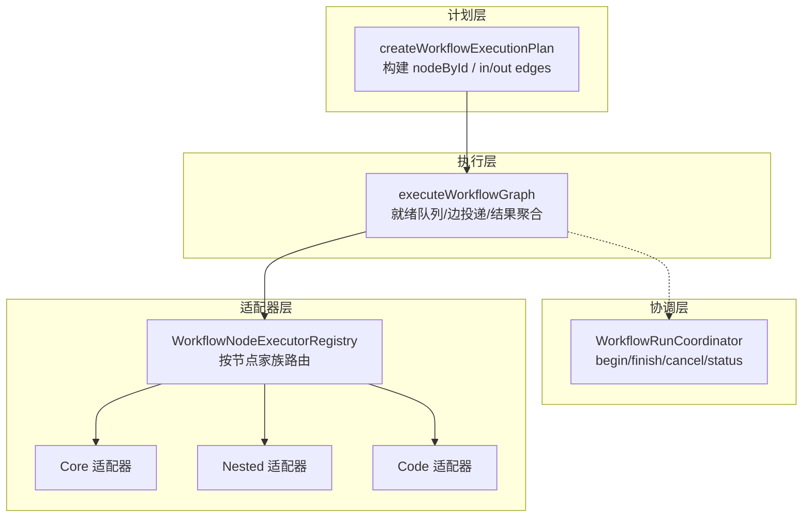
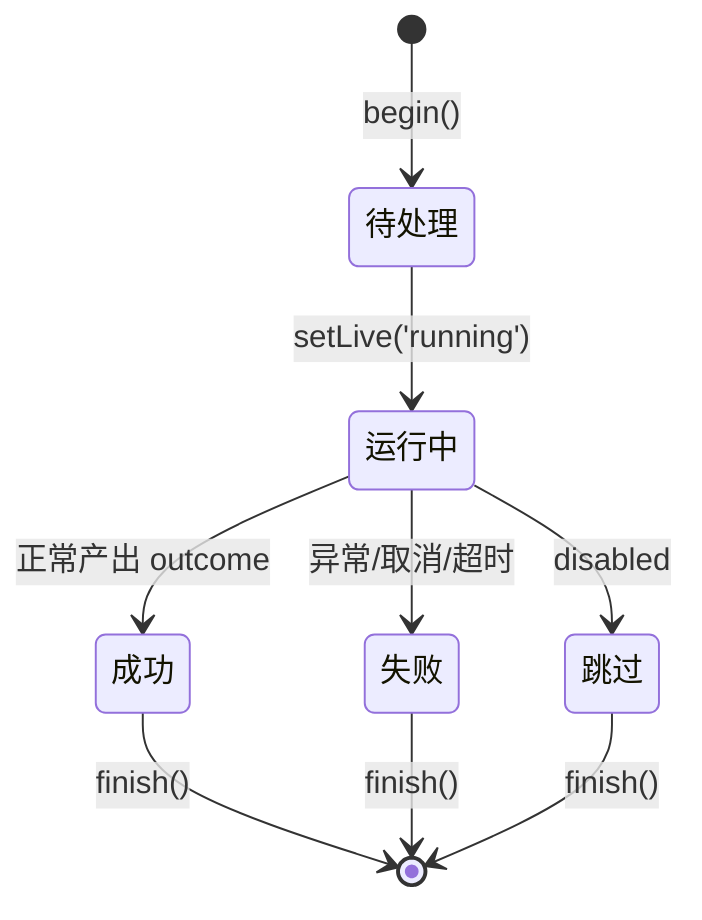
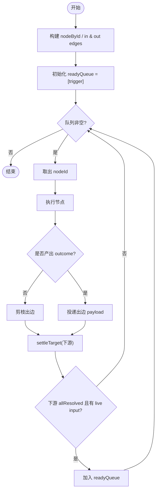
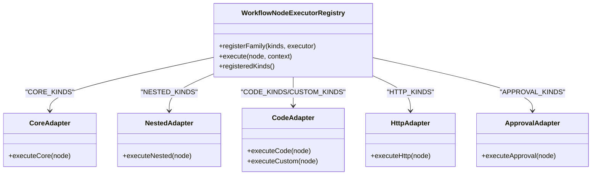

# 节点系统

<cite>
**本文引用的文件**
- [workflow-graph-executor.ts](file://src/main/workflow-graph-executor.ts)
- [workflow-graph-planner.ts](file://src/main/workflow-graph-planner.ts)
- [workflow-node-executor-registry.ts](file://src/main/workflow-node-executor-registry.ts)
- [workflow-core-node-adapter.ts](file://src/main/workflow-core-node-adapter.ts)
- [workflow-nested-node-adapter.ts](file://src/main/workflow-nested-node-adapter.ts)
- [workflow-code-node-adapter.ts](file://src/main/workflow-code-node-adapter.ts)
- [workflow-run-coordinator.ts](file://src/main/workflow-run-coordinator.ts)
- [app-settings-workflow.ts](file://src/shared/app-settings-workflow.ts)
- [app-settings-types.ts](file://src/shared/app-settings-types.ts)
</cite>

## 目录
1. [简介](#简介)
2. [项目结构](#项目结构)
3. [核心组件](#核心组件)
4. [架构总览](#架构总览)
5. [详细组件分析](#详细组件分析)
6. [依赖关系分析](#依赖关系分析)
7. [性能考虑](#性能考虑)
8. [故障排查指南](#故障排查指南)
9. [结论](#结论)
10. [附录](#附录)

## 简介
本文件为 DeepSeek-GUI 的 Agent Graph 节点系统的权威文档，聚焦于节点类型定义、状态机与调度、依赖解析、生命周期管理、配置选项、错误处理与调试方法。内容基于源码实现进行系统化梳理，帮助读者从“概念—实现—使用”全链路理解工作流引擎中的节点如何被创建、执行、流转与销毁。

## 项目结构
工作流节点系统由“计划—执行—协调—适配器”四层构成：
- 计划层：将工作流图（节点与边）解析为可执行的拓扑结构，并校验连接合法性。
- 执行层：按依赖就绪顺序调度节点执行，维护运行上下文、输入输出绑定、重试与错误处理。
- 协调层：统一管理运行生命周期、取消信号、审批等待与实时状态投影。
- 适配器层：按节点家族（核心/AI/图像/代码/嵌套/HTTP/审批/自定义）分发到具体执行逻辑。



图表来源
- [workflow-graph-planner.ts:22-47](file://src/main/workflow-graph-planner.ts#L22-L47)
- [workflow-graph-executor.ts:63-305](file://src/main/workflow-graph-executor.ts#L63-L305)
- [workflow-node-executor-registry.ts:19-77](file://src/main/workflow-node-executor-registry.ts#L19-L77)
- [workflow-run-coordinator.ts:14-145](file://src/main/workflow-run-coordinator.ts#L14-L145)

章节来源
- [workflow-graph-planner.ts:1-48](file://src/main/workflow-graph-planner.ts#L1-L48)
- [workflow-graph-executor.ts:1-374](file://src/main/workflow-graph-executor.ts#L1-L374)
- [workflow-node-executor-registry.ts:1-78](file://src/main/workflow-node-executor-registry.ts#L1-L78)
- [workflow-run-coordinator.ts:1-145](file://src/main/workflow-run-coordinator.ts#L1-L145)

## 核心组件
- 执行器注册表：按节点家族统一注册与分发执行函数，避免 if/else 散点式分支。
- 工作流执行器：负责拓扑遍历、依赖解析、输入输出绑定、重试与错误处理、超时与最大节点数保护。
- 协调器：单写者模式管理运行实例的生命周期、取消、审批与实时状态投影。
- 适配器族：
  - 核心适配器：触发器、条件、分支、合并、字段设置、过滤、排序、限制、聚合、模板、JSON、输出、延迟等。
  - 嵌套适配器：子工作流与循环（foreach/condition），支持并发控制与继续错误策略。
  - 代码适配器：JavaScript VM 沙箱与 Python/Bash 子进程执行，含语法检查与超时控制。

章节来源
- [workflow-node-executor-registry.ts:19-77](file://src/main/workflow-node-executor-registry.ts#L19-L77)
- [workflow-graph-executor.ts:63-305](file://src/main/workflow-graph-executor.ts#L63-L305)
- [workflow-core-node-adapter.ts:19-149](file://src/main/workflow-core-node-adapter.ts#L19-L149)
- [workflow-nested-node-adapter.ts:16-238](file://src/main/workflow-nested-node-adapter.ts#L16-L238)
- [workflow-code-node-adapter.ts:37-164](file://src/main/workflow-code-node-adapter.ts#L37-L164)

## 架构总览
下图展示了从触发到完成的一次典型执行序列，包括依赖解析、输入绑定、节点执行、边投递与下游节点就绪判定。

```mermaid
sequenceDiagram
participant U as "调用方"
participant X as "执行器 executeWorkflowGraph"
participant G as "规划器 createWorkflowExecutionPlan"
participant R as "注册表 Registry"
participant N as "具体适配器"
participant C as "协调器 Coordinator"
U->>X : 传入 workflow, triggerNodeId, initialPayload
X->>G : 构建 nodeById/in/out edges
G-->>X : 返回执行计划
loop 直到队列为空或终止
X->>C : setLive(nodeId, 'running')
X->>R : execute(node, context)
R->>N : 按节点家族分派执行
N-->>R : 返回 {payload, message, branch?}
R-->>X : 返回结果
alt 成功
X->>C : setLiveResult(result)
X->>X : 投递边 payloadByEdge[edge]
X->>X : settleTarget(下游节点)
else 失败/取消/超时
X->>C : setLive(nodeId, 'error'|'skipped')
break
end
end
X-->>U : 返回 {status, errorMessage, nodeResults, output}
```

图表来源
- [workflow-graph-executor.ts:63-305](file://src/main/workflow-graph-executor.ts#L63-L305)
- [workflow-graph-planner.ts:22-47](file://src/main/workflow-graph-planner.ts#L22-L47)
- [workflow-node-executor-registry.ts:33-44](file://src/main/workflow-node-executor-registry.ts#L33-L44)
- [workflow-run-coordinator.ts:94-105](file://src/main/workflow-run-coordinator.ts#L94-L105)

## 详细组件分析

### 节点类型与职责
- 普通节点（核心家族）：包含触发器（手动/定时/Webhook）、条件判断、分支选择、数据变换（字段设置/过滤/排序/限制/聚合/模板/JSON）、输出与延迟等。其职责是纯数据处理与控制流。
- 循环门控节点（嵌套家族）：
  - 子工作流：复用另一个工作流作为节点，传递上下文与深度限制。
  - 循环：支持 foreach（数组迭代，顺序/并行）与 condition（直到条件满足），具备 continueOnError、maxIterations、concurrency 等配置。
- 完成节点（输出节点）：用于将最终结果以文本或 JSON 形式输出，支持路径提取与模板渲染。

章节来源
- [workflow-core-node-adapter.ts:19-149](file://src/main/workflow-core-node-adapter.ts#L19-L149)
- [workflow-nested-node-adapter.ts:16-238](file://src/main/workflow-nested-node-adapter.ts#L16-L238)
- [workflow-node-executor-registry.ts:47-77](file://src/main/workflow-node-executor-registry.ts#L47-L77)

### 节点状态机与转换规则
节点运行状态在协调器中维护，并在执行过程中通过回调更新。常见状态包括 pending、running、success、error、skipped。



图表来源
- [workflow-run-coordinator.ts:28-52](file://src/main/workflow-run-coordinator.ts#L28-L52)
- [workflow-graph-executor.ts:170-284](file://src/main/workflow-graph-executor.ts#L170-L284)

状态转换要点：
- 进入运行：setLive(nodeId, 'running')
- 成功：记录 result 并 setLive(nodeId, 'success')
- 失败：记录 error 并 setLive(nodeId, 'error')
- 跳过：当节点 disabled 时直接标记 skipped
- 结束：finish(workflowId, runId, lingerMs) 清理资源

章节来源
- [workflow-run-coordinator.ts:28-52](file://src/main/workflow-run-coordinator.ts#L28-L52)
- [workflow-graph-executor.ts:170-284](file://src/main/workflow-graph-executor.ts#L170-L284)

### 依赖关系解析机制
- 输入输出绑定：
  - 节点可通过 inputs 声明命名输入键与类型，运行时根据 source 表达式解析上游输出，并进行类型强制转换。
  - 若未声明 inputs，则默认使用主输入 payload；多入边时取第一个有效入边。
- 依赖图构建：
  - 规划阶段构建 nodeById、incomingByNodeId、outgoingByNodeId，并校验边引用是否指向存在的节点。
  - 执行阶段维护 delivered 边集合与 prunedEdges，只有当所有入边已交付且至少一个入边有值时才将目标节点加入 readyQueue。
- 分支与裁剪：
  - 节点可返回 branch/sourceHandle，仅匹配到的出边才会投递 payload，否则该边被剪枝，下游节点不会就绪。



图表来源
- [workflow-graph-planner.ts:22-47](file://src/main/workflow-graph-planner.ts#L22-L47)
- [workflow-graph-executor.ts:113-134](file://src/main/workflow-graph-executor.ts#L113-L134)
- [workflow-graph-executor.ts:139-298](file://src/main/workflow-graph-executor.ts#L139-L298)

章节来源
- [workflow-graph-planner.ts:1-48](file://src/main/workflow-graph-planner.ts#L1-L48)
- [workflow-graph-executor.ts:109-134](file://src/main/workflow-graph-executor.ts#L109-L134)
- [workflow-graph-executor.ts:163-167](file://src/main/workflow-graph-executor.ts#L163-L167)
- [workflow-graph-executor.ts:287-298](file://src/main/workflow-graph-executor.ts#L287-L298)

### 优先级调度策略与执行顺序控制
- 调度策略：基于依赖就绪的广度优先式队列调度。没有显式优先级权重，执行顺序由拓扑决定。
- 控制手段：
  - 最大运行时长与最大节点执行次数保护，防止无限循环或资源耗尽。
  - 取消信号 AbortSignal 与 isCanceled 钩子，可在任意时刻中断执行。
  - 循环并发度控制（foreach 的 execution=parallel/concurrency）。
  - 子工作流深度限制，防止过深嵌套。

章节来源
- [workflow-graph-executor.ts:26-28](file://src/main/workflow-graph-executor.ts#L26-L28)
- [workflow-graph-executor.ts:139-155](file://src/main/workflow-graph-executor.ts#L139-L155)
- [workflow-nested-node-adapter.ts:33-52](file://src/main/workflow-nested-node-adapter.ts#L33-L52)
- [workflow-nested-node-adapter.ts:142-144](file://src/main/workflow-nested-node-adapter.ts#L142-L144)

### 生命周期管理
- 启动：begin(workflowId, nodeIds) 初始化运行集、AbortController 与实时状态映射。
- 运行：executeWorkflowGraph 驱动节点执行，实时更新节点状态与结果。
- 结束：finish(workflowId, runId, lingerMs) 清理运行集、审批等待与定时器，延迟删除实时状态以便 UI 展示。
- 取消：requestCancel 触发 abort 并拒绝所有待审批项；cancelAll 批量取消。
- 审批：awaitApproval 提供带超时的审批等待，resolveApproval 完成审批。

章节来源
- [workflow-run-coordinator.ts:14-145](file://src/main/workflow-run-coordinator.ts#L14-L145)

### 节点配置选项
- 通用错误处理：onError（continue/fallback）、retries、retryDelayMs、fallbackJson。
- 输入绑定：inputs 列表，key/type/source，source 支持表达式与插值。
- 环境变量：env 列表，支持 string/number/boolean/secret。
- 工作区：触发器可指定 workspaceRoot，运行时解析默认工作区。
- 循环：mode（foreach/condition）、arraySource、execution（sequential/parallel）、concurrency、continueOnError、maxIterations、停止条件 leftExpr/operator/rightValue/caseSensitive。
- HTTP：method/url/headers/body/timeoutMs/parseJson。
- 代码：language（javascript/python/bash）、code。
- 审批：title/instruction/timeoutMs/onTimeout。
- 自定义模块：moduleId/values，字段类型与默认值。

章节来源
- [app-settings-workflow.ts:174-189](file://src/shared/app-settings-workflow.ts#L174-L189)
- [app-settings-workflow.ts:191-205](file://src/shared/app-settings-workflow.ts#L191-L205)
- [app-settings-workflow.ts:268-282](file://src/shared/app-settings-workflow.ts#L268-L282)
- [app-settings-workflow.ts:418-543](file://src/shared/app-settings-workflow.ts#L418-L543)
- [workflow-graph-executor.ts:345-373](file://src/main/workflow-graph-executor.ts#L345-L373)

### 错误处理机制
- 节点级：
  - 重试：attempt < retries 时按 retryDelayMs 重试。
  - 容错：onError=continue 忽略错误继续；onError=fallback 使用 fallbackJson 作为输出。
  - 取消与超时：AbortSignal 与 MAX_RUN_DURATION_MS/MAX_NODE_EXECUTIONS 保护。
- 流程级：
  - 任一节点失败且未容错时，整体状态置为 error 并终止。
  - 日志记录：logError 上报工作流失败信息。
- 代码执行：
  - JS 沙箱超时 CODE_TIMEOUT_MS；Python/Bash 子进程超时 COMMAND_TIMEOUT_MS。
  - 脚本退出码非零或 ENOENT 等错误会转换为错误消息。

章节来源
- [workflow-graph-executor.ts:189-244](file://src/main/workflow-graph-executor.ts#L189-L244)
- [workflow-graph-executor.ts:299-303](file://src/main/workflow-graph-executor.ts#L299-L303)
- [workflow-code-node-adapter.ts:19-22](file://src/main/workflow-code-node-adapter.ts#L19-L22)
- [workflow-code-node-adapter.ts:121-143](file://src/main/workflow-code-node-adapter.ts#L121-L143)

### 调试方法
- 实时状态与结果：
  - 通过协调器的 status() 获取运行中工作流的节点状态与结果快照。
  - 执行期间通过 setLive/setLiveResult 推送节点运行态与结果。
- 日志与脱敏：
  - 使用 redact 对敏感信息进行脱敏后再记录或输出。
- 代码检查：
  - checkWorkflowCode 在不执行的情况下进行语法检查，便于开发期验证。
- 断点与追踪：
  - 关注 readyQueue、delivered、prunedEdges、nodeOutputs 等关键数据结构的变化。

章节来源
- [workflow-run-coordinator.ts:131-143](file://src/main/workflow-run-coordinator.ts#L131-L143)
- [workflow-graph-executor.ts:21-24](file://src/main/workflow-graph-executor.ts#L21-L24)
- [workflow-code-node-adapter.ts:181-248](file://src/main/workflow-code-node-adapter.ts#L181-L248)

### 实际节点定义示例与最佳实践
- 示例（描述性）：
  - 手动触发 + 条件分支 + 代码处理 + 输出：
    - 手动触发节点接收初始负载。
    - 条件节点根据表达式选择 true/false 分支。
    - 代码节点执行 JavaScript/Python/Bash 处理数据。
    - 输出节点以文本或 JSON 形式输出最终结果。
- 最佳实践：
  - 明确声明 inputs 并使用表达式绑定上游输出，提高可读性与可维护性。
  - 合理设置 onError/retries/retryDelayMs，避免瞬时失败导致流程中断。
  - 对循环设置 maxIterations 与 continueOnError，防止无限循环与级联失败。
  - 使用 env 注入环境变量，避免硬编码敏感信息。
  - 利用分支 sourceHandle 精确控制数据流向，减少冗余边。

章节来源
- [workflow-core-node-adapter.ts:42-149](file://src/main/workflow-core-node-adapter.ts#L42-L149)
- [workflow-nested-node-adapter.ts:76-91](file://src/main/workflow-nested-node-adapter.ts#L76-L91)
- [workflow-graph-executor.ts:327-343](file://src/main/workflow-graph-executor.ts#L327-L343)

## 依赖关系分析
节点执行器注册表将节点类型映射到具体执行函数，形成清晰的家族化依赖关系。



图表来源
- [workflow-node-executor-registry.ts:47-77](file://src/main/workflow-node-executor-registry.ts#L47-L77)

章节来源
- [workflow-node-executor-registry.ts:1-78](file://src/main/workflow-node-executor-registry.ts#L1-L78)

## 性能考虑
- 运行保护：MAX_RUN_DURATION_MS 与 MAX_NODE_EXECUTIONS 防止长时间运行与过多节点执行。
- 并发控制：循环 foreach 支持 parallel 模式与 concurrency 限制，避免资源争用。
- 子工作流深度限制：MAX_SUBWORKFLOW_DEPTH 防止递归过深。
- I/O 超时：HTTP 请求、代码执行均设置超时，避免阻塞。
- 内存与对象大小：连接数、头部数量、字段数量等均有上限约束。

章节来源
- [workflow-graph-executor.ts:26-28](file://src/main/workflow-graph-executor.ts#L26-L28)
- [workflow-nested-node-adapter.ts:33-52](file://src/main/workflow-nested-node-adapter.ts#L33-L52)
- [workflow-code-node-adapter.ts:19-22](file://src/main/workflow-code-node-adapter.ts#L19-L22)
- [app-settings-workflow.ts:51-55](file://src/shared/app-settings-workflow.ts#L51-L55)

## 故障排查指南
- 常见问题定位：
  - 节点未执行：检查 incoming 边是否全部 delivered 且至少一个入边有值；确认分支 sourceHandle 是否匹配。
  - 循环不终止：检查 stop 条件表达式与 maxIterations；确认 continueOnError 是否掩盖了错误。
  - 代码执行失败：查看 JS 沙箱或 Python/Bash 子进程的 stderr/stdout；确认二进制可用与环境变量。
  - 审批卡住：检查 awaitApproval 超时与 resolveApproval 调用；确认 cancel 是否影响审批。
- 调试步骤：
  - 使用协调器 status() 获取当前运行快照。
  - 检查节点结果中的 error 与 retries。
  - 对代码节点使用 checkWorkflowCode 进行语法检查。
  - 启用日志与脱敏后的输出，定位敏感信息与错误堆栈。

章节来源
- [workflow-run-coordinator.ts:107-129](file://src/main/workflow-run-coordinator.ts#L107-L129)
- [workflow-graph-executor.ts:246-284](file://src/main/workflow-graph-executor.ts#L246-L284)
- [workflow-code-node-adapter.ts:181-248](file://src/main/workflow-code-node-adapter.ts#L181-L248)

## 结论
DeepSeek-GUI 的节点系统通过“计划—执行—协调—适配器”的分层设计，实现了高内聚、低耦合的工作流执行能力。节点类型覆盖广泛，状态机清晰，依赖解析严谨，调度策略稳健，生命周期管理完善。配合完善的错误处理与调试工具，能够满足复杂业务场景下的自动化编排需求。

## 附录
- 类型与常量参考：
  - 节点运行状态与工作流状态枚举定义位于类型文件中。
  - 工作流设置默认值与归一化逻辑确保配置健壮性。

章节来源
- [app-settings-types.ts:1-300](file://src/shared/app-settings-types.ts#L1-L300)
- [app-settings-workflow.ts:625-633](file://src/shared/app-settings-workflow.ts#L625-L633)
- [app-settings-workflow.ts:694-709](file://src/shared/app-settings-workflow.ts#L694-L709)