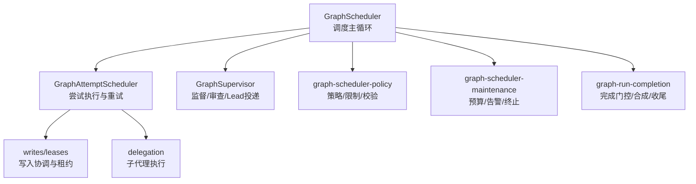
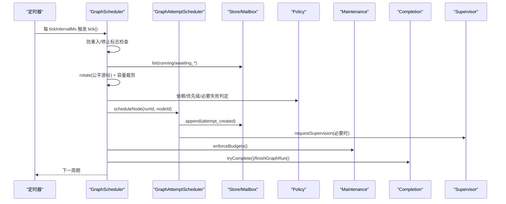
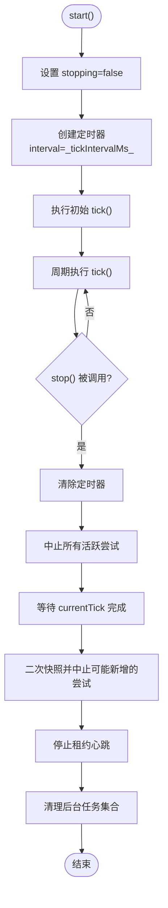
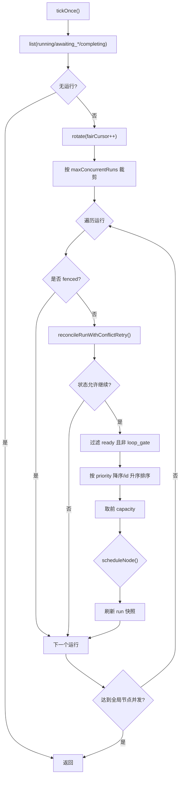
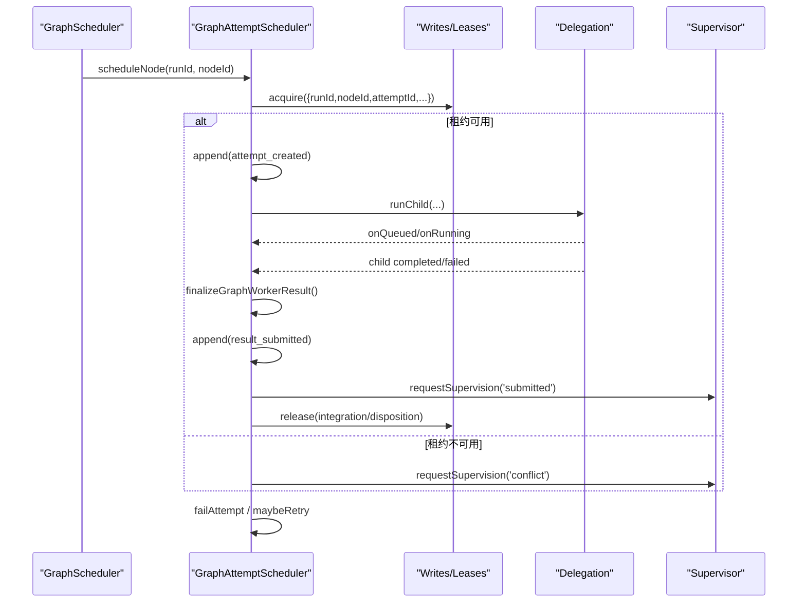
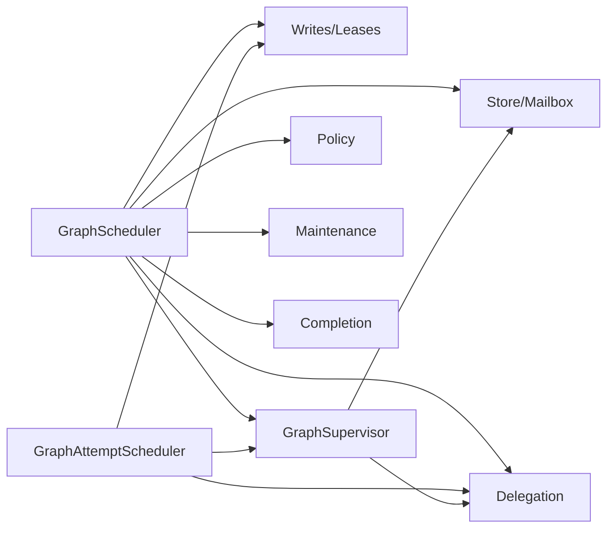

# 调度器核心

<cite>
**本文引用的文件**
- [graph-scheduler.ts](file://kun/src/graph/graph-scheduler.ts)
- [graph-attempt-scheduler.ts](file://kun/src/graph/graph-attempt-scheduler.ts)
- [graph-scheduler-types.ts](file://kun/src/graph/graph-scheduler-types.ts)
- [graph-scheduler-policy.ts](file://kun/src/graph/graph-scheduler-policy.ts)
- [graph-scheduler-maintenance.ts](file://kun/src/graph/graph-scheduler-maintenance.ts)
- [graph-run-completion.ts](file://kun/src/graph/graph-run-completion.ts)
- [graph-supervisor.ts](file://kun/src/graph/graph-supervisor.ts)
</cite>

## 目录
1. [简介](#简介)
2. [项目结构](#项目结构)
3. [核心组件](#核心组件)
4. [架构总览](#架构总览)
5. [详细组件分析](#详细组件分析)
6. [依赖关系分析](#依赖关系分析)
7. [性能考量](#性能考量)
8. [故障排查指南](#故障排查指南)
9. [结论](#结论)
10. [附录](#附录)

## 简介
本文件面向 DeepSeek-GUI 的 Graph 调度器核心，系统性阐述其启动/停止、定时器与资源清理、tick 执行流程（节点发现、优先级排序、并发控制）、运行队列与公平调度、提交与执行协调（含尝试 Attempt 管理与重试策略）、监控与诊断（活动节点跟踪、指标收集），以及配置项、故障恢复与性能优化技巧，并提供使用示例与调试方法。

## 项目结构
Graph 调度器由“调度主循环”和“子任务/协作模块”组成：
- 调度主循环：GraphScheduler 负责 tick 周期驱动、并发配额、公平轮转、状态收敛与完成判定。
- 尝试执行：GraphAttemptScheduler 抽象出节点尝试的准入、执行、结果集成、失败处理与重试。
- 监督与审查：GraphSupervisor 聚合信号、合并窗口、义务管理、源 Lead 投递与重试。
- 策略与合规：graph-scheduler-policy 提供依赖判定、预算/限制计算、结果校验与规范化等通用逻辑。
- 维护与预算：graph-scheduler-maintenance 负责预算检查、告警与强制终止。
- 完成流程：graph-run-completion 定义完成门控、最终合成与收尾。
- 类型与选项：graph-scheduler-types 定义调度器选项、监督端口与诊断信息。

**图表来源**
- [graph-scheduler.ts:40-117](file://kun/src/graph/graph-scheduler.ts#L40-L117)
- [graph-attempt-scheduler.ts:91-257](file://kun/src/graph/graph-attempt-scheduler.ts#L91-L257)
- [graph-supervisor.ts:162-340](file://kun/src/graph/graph-supervisor.ts#L162-L340)
- [graph-scheduler-policy.ts:39-151](file://kun/src/graph/graph-scheduler-policy.ts#L39-L151)
- [graph-scheduler-maintenance.ts:36-63](file://kun/src/graph/graph-scheduler-maintenance.ts#L36-L63)
- [graph-run-completion.ts:19-59](file://kun/src/graph/graph-run-completion.ts#L19-L59)

**章节来源**
- [graph-scheduler.ts:40-117](file://kun/src/graph/graph-scheduler.ts#L40-L117)
- [graph-attempt-scheduler.ts:91-257](file://kun/src/graph/graph-attempt-scheduler.ts#L91-L257)
- [graph-supervisor.ts:162-340](file://kun/src/graph/graph-supervisor.ts#L162-L340)
- [graph-scheduler-policy.ts:39-151](file://kun/src/graph/graph-scheduler-policy.ts#L39-L151)
- [graph-scheduler-maintenance.ts:36-63](file://kun/src/graph/graph-scheduler-maintenance.ts#L36-L63)
- [graph-run-completion.ts:19-59](file://kun/src/graph/graph-run-completion.ts#L19-L59)

## 核心组件
- GraphScheduler：实现 tick 周期、公平轮转、并发配额、节点就绪筛选与调度、状态收敛、完成判定、预算与告警、监督信号派发。
- GraphAttemptScheduler：封装节点尝试的准入、写租约、子代理执行、结果集成、失败分类与重试、心跳与超时控制。
- GraphSupervisor：接收并合并监督信号，按义务模型持久化与投递，支持延迟重投、停滞扫描、人工介入与汇总合成。
- graph-scheduler-policy：提供依赖判定、最大尝试次数、预算比率、结果校验与规范化、必要失败检测等。
- graph-scheduler-maintenance：统一预算检查、警告标记与硬限制触发。
- graph-run-completion：完成门控判断、最终摘要生成与收尾。
- graph-scheduler-types：调度器选项、监督接口、诊断输出。

**章节来源**
- [graph-scheduler.ts:40-117](file://kun/src/graph/graph-scheduler.ts#L40-L117)
- [graph-attempt-scheduler.ts:42-90](file://kun/src/graph/graph-attempt-scheduler.ts#L42-L90)
- [graph-supervisor.ts:55-105](file://kun/src/graph/graph-supervisor.ts#L55-L105)
- [graph-scheduler-policy.ts:39-151](file://kun/src/graph/graph-scheduler-policy.ts#L39-L151)
- [graph-scheduler-maintenance.ts:36-63](file://kun/src/graph/graph-scheduler-maintenance.ts#L36-L63)
- [graph-run-completion.ts:19-59](file://kun/src/graph/graph-run-completion.ts#L19-L59)
- [graph-scheduler-types.ts:20-78](file://kun/src/graph/graph-scheduler-types.ts#L20-L78)

## 架构总览
下图展示调度主循环与关键子系统交互：

**图表来源**
- [graph-scheduler.ts:61-117](file://kun/src/graph/graph-scheduler.ts#L61-L117)
- [graph-scheduler.ts:118-162](file://kun/src/graph/graph-scheduler.ts#L118-L162)
- [graph-attempt-scheduler.ts:91-257](file://kun/src/graph/graph-attempt-scheduler.ts#L91-L257)
- [graph-scheduler-policy.ts:39-151](file://kun/src/graph/graph-scheduler-policy.ts#L39-L151)
- [graph-scheduler-maintenance.ts:36-63](file://kun/src/graph/graph-scheduler-maintenance.ts#L36-L63)
- [graph-run-completion.ts:19-59](file://kun/src/graph/graph-run-completion.ts#L19-L59)

## 详细组件分析

### 启动与停止机制（定时器与资源清理）
- 启动 start()：
  - 设置 stopping=false，创建 setInterval 周期性调用 tick()，并立即执行一次初始 tick。
  - 定时器通过 unref 避免阻塞进程退出。
- 停止 stop()：
  - 置 stopping=true，清除定时器，中止所有活跃尝试（发送特定错误），中止所有对等审查。
  - 等待当前 tick 完成，再次快照中止可能新加入的尝试，等待所有活跃尝试与对等审查完成。
  - 停止租约心跳，清理后台任务集合。
- 唤醒 resumeRun(runId)：
  - 激活 runId（解除围栏/取消标记），等待当前 tick 完成后立即再触发一次 tick，确保快速响应外部输入。

**图表来源**
- [graph-scheduler.ts:61-94](file://kun/src/graph/graph-scheduler.ts#L61-L94)

**章节来源**
- [graph-scheduler.ts:61-105](file://kun/src/graph/graph-scheduler.ts#L61-L105)

### Tick 执行流程（节点发现、优先级排序、并发控制）
- 防重入与开关：若正在 tick、已停止或配置禁用，直接返回。
- 读取运行实例：从存储列出处于 running/awaiting_supervision/awaiting_human/completing 的运行。
- 公平轮转：使用 fairCursor 对运行列表进行旋转，保证多运行间的公平性。
- 并发配额：
  - 运行级并发：maxConcurrentRuns 限制同时处理的运行数。
  - 节点级并发：maxConcurrentNodes 全局上限；每个运行还有 per-run 上限 maxConcurrentNodesPerRun 与 budget.limits.maxConcurrentNodes。
- 节点发现与排序：
  - 仅选择 status=ready 且非 loop_gate 的节点。
  - 按 node.priority 降序、node.id 字典序升序排序，取前 capacity 个。
- 提交与调度：
  - 对每个候选节点调用 scheduleNode()，成功后刷新 run 快照继续。
  - 若达到全局节点并发上限则提前退出本轮。

**图表来源**
- [graph-scheduler.ts:118-162](file://kun/src/graph/graph-scheduler.ts#L118-L162)
- [graph-scheduler-policy.ts:663-666](file://kun/src/graph/graph-scheduler-policy.ts#L663-L666)

**章节来源**
- [graph-scheduler.ts:118-162](file://kun/src/graph/graph-scheduler.ts#L118-L162)

### 运行队列与公平调度算法
- 运行级队列：withRunQueue(runId, op) 保证同一 runId 的操作串行化，避免并发冲突。
- 公平轮转：rotate(values, offset) 基于 fairCursor 对运行列表做环形偏移，避免长尾饥饿。
- 并发控制：
  - 全局节点并发上限：maxConcurrentNodes。
  - 单运行并发上限：min(budget.limits.maxConcurrentNodes, config.scheduler.maxConcurrentNodesPerRun)。
  - 运行级并发上限：config.scheduler.maxConcurrentRuns。

**章节来源**
- [graph-scheduler.ts:118-162](file://kun/src/graph/graph-scheduler.ts#L118-L162)
- [graph-scheduler-policy.ts:663-666](file://kun/src/graph/graph-scheduler-policy.ts#L663-L666)

### 节点提交与执行协调（Attempt 管理与重试）
- 准入与分配：
  - 检查节点状态为 ready，计算有效最大尝试次数与运行总尝试限制。
  - 解析 assignment（工作区、模型、工具策略等），申请写租约（write lease）。
  - 若写租约不可用，请求监督并放弃本次提交。
- 尝试创建与执行：
  - 追加 attempt_created 事件，记录 attempt 元数据（revision、iteration、命令ID、幂等键等）。
  - 启动租约心跳，设置 wall-time 超时，调用 delegation.runChild 执行子代理。
  - 绑定 worker session，监听 onQueued/onRunning 更新状态。
- 结果集成：
  - 子代理完成后，finalizeGraphWorkerResult 验证结果，追加 result_submitted 与状态转换。
  - 更新预算（tokens、elapsedMs、artifactBytes），处理 steering。
  - 请求监督（submitted 原因），释放写租约。
- 失败与重试：
  - 区分超时、中断、失败三类错误，转换为对应 attempt/node 状态。
  - maybeRetry 根据迭代内尝试次数与最大尝试次数决定回退到 ready 并指数退避。
  - 若达到必要节点失败阈值，进入 awaiting_supervision 并请求监督。

**图表来源**
- [graph-attempt-scheduler.ts:91-257](file://kun/src/graph/graph-attempt-scheduler.ts#L91-L257)
- [graph-attempt-scheduler.ts:292-402](file://kun/src/graph/graph-attempt-scheduler.ts#L292-L402)
- [graph-attempt-scheduler.ts:404-520](file://kun/src/graph/graph-attempt-scheduler.ts#L404-L520)
- [graph-attempt-scheduler.ts:522-583](file://kun/src/graph/graph-attempt-scheduler.ts#L522-L583)

**章节来源**
- [graph-attempt-scheduler.ts:91-257](file://kun/src/graph/graph-attempt-scheduler.ts#L91-L257)
- [graph-attempt-scheduler.ts:292-402](file://kun/src/graph/graph-attempt-scheduler.ts#L292-L402)
- [graph-attempt-scheduler.ts:404-520](file://kun/src/graph/graph-attempt-scheduler.ts#L404-L520)
- [graph-attempt-scheduler.ts:522-583](file://kun/src/graph/graph-attempt-scheduler.ts#L522-L583)

### 监督与审查（Review/Lead/人类介入）
- 提交后审查：
  - 对 submitted/reviewing 的节点，确保必要的 review kinds（deterministic/peer/lead/human）。
  - 若需要 lead 或 human，将运行转入 awaiting_supervision/awaiting_human 并请求监督。
- 监督信号合并：
  - GraphSupervisor 以 coalesceWindowMs 合并多个信号，减少抖动。
  - 通过 obligations 模型持久化与追踪，支持重试、过期续租、人工关注。
- 源 Lead 投递：
  - 按 runId 串行化投递，支持 delivered/deferred/orphaned/terminal 四种结果。
  - 若 deferred，安排重试；若 orphaned，标记 needs_attention。
- 停滞扫描：
  - 定期扫描 stuck 的提交/审查/监督义务，必要时重新投递或升级至人工。

**章节来源**
- [graph-scheduler.ts:288-389](file://kun/src/graph/graph-scheduler.ts#L288-L389)
- [graph-supervisor.ts:162-340](file://kun/src/graph/graph-supervisor.ts#L162-L340)
- [graph-supervisor.ts:510-628](file://kun/src/graph/graph-supervisor.ts#L510-L628)

### 完成流程与收尾
- 完成门控：
  - 所有 required 节点与 completion 节点均 accepted/superseded 或被 loop gate 豁免。
  - 无 pending/blocked/ready/queued/running/submitted/reviewing 节点。
- 最终合成：
  - 若 summary 缺失，调用 supervision.synthesize 或 deterministicSummary。
  - 记录 run_summary_recorded，转为 completed，请求监督 completion。
- 终端清理：
  - 停止租约心跳，记录终端清理事件，触发 onTerminal 回调。

**章节来源**
- [graph-run-completion.ts:19-59](file://kun/src/graph/graph-run-completion.ts#L19-L59)
- [graph-scheduler.ts:535-563](file://kun/src/graph/graph-scheduler.ts#L535-L563)

## 依赖关系分析
- GraphScheduler 依赖：
  - Store/Mailbox：读取运行、追加事件、过期消息。
  - Delegation：执行子代理。
  - Writes：写租约与结果集成。
  - Supervisor：监督信号与审查。
  - Policy/Maintenance/Completion：策略、预算、完成门控。
- GraphAttemptScheduler 依赖：
  - Writes/Leases：写入协调与租约管理。
  - Delegation：子代理执行。
  - Supervisor：监督信号。
- GraphSupervisor 依赖：
  - Store：读取/写入运行与义务。
  - Delegation：可选用于审查子任务。
  - Config：监督行为参数（合并窗口、停滞超时等）。

**图表来源**
- [graph-scheduler.ts:40-117](file://kun/src/graph/graph-scheduler.ts#L40-L117)
- [graph-attempt-scheduler.ts:91-257](file://kun/src/graph/graph-attempt-scheduler.ts#L91-L257)
- [graph-supervisor.ts:55-105](file://kun/src/graph/graph-supervisor.ts#L55-L105)

**章节来源**
- [graph-scheduler.ts:40-117](file://kun/src/graph/graph-scheduler.ts#L40-L117)
- [graph-attempt-scheduler.ts:91-257](file://kun/src/graph/graph-attempt-scheduler.ts#L91-L257)
- [graph-supervisor.ts:55-105](file://kun/src/graph/graph-supervisor.ts#L55-L105)

## 性能考量
- 并发与吞吐
  - 合理设置 maxConcurrentRuns、maxConcurrentNodes、maxConcurrentNodesPerRun，避免过载导致上下文切换与争用。
  - 使用公平轮转避免长尾饥饿，提高整体吞吐稳定性。
- 预算与限制
  - 利用 budget.limits 控制时间、尝试次数、消息数、循环次数与产物大小，防止资源耗尽。
  - 开启 warningRatio 阈值，提前预警接近硬限制的情况。
- 网络与 I/O
  - 写租约与结果集成采用幂等键与冲突重试，降低重复开销。
  - 监督信号合并窗口（coalesceWindowMs）减少频繁投递带来的系统压力。
- 超时与心跳
  - 节点墙时预算（maxWallTimeMs）与租约心跳保障异常快速回收，避免僵尸任务。
- 建议
  - 在高负载场景下，优先调大 maxConcurrentNodesPerRun 而非全局 maxConcurrentNodes，提升隔离性。
  - 对高延迟外部依赖，适当增大 coalesceWindowMs 与 stallTimeoutMs，降低抖动。

[本节为通用指导，不直接分析具体文件]

## 故障排查指南
- 常见问题定位
  - 节点无法调度：检查依赖是否满足、是否被 loop gate 豁免、是否达到并发上限。
  - 提交失败：查看写租约冲突、assignment 解析错误、权限不足。
  - 结果未接受：检查结构化结果校验、确定性检查、变更文件范围与数量限制。
  - 监督卡住：确认监督服务是否启用、义务是否可行动、是否到达 nextWakeAt。
- 诊断接口
  - diagnostics()：返回 active 尝试列表与 fairCursor，便于观察当前活动与公平进度。
  - 日志与警告：scheduler reconcile failure、budget warning、supervision dispatch failed 等。
- 恢复手段
  - resumeRun(runId)：在外部干预后主动唤醒调度。
  - cancelRun(runId, 'pause'|'cancel')：暂停或取消运行，选择性停止租约心跳。
  - 监督重投：redeliver/redeliverNow 强制重投监督信号。
  - 人工介入：当出现 needs_attention 或 awaiting_human，需人工决策后继续。

**章节来源**
- [graph-scheduler.ts:173-182](file://kun/src/graph/graph-scheduler.ts#L173-L182)
- [graph-scheduler.ts:61-105](file://kun/src/graph/graph-scheduler.ts#L61-L105)
- [graph-attempt-scheduler.ts:65-89](file://kun/src/graph/graph-attempt-scheduler.ts#L65-L89)
- [graph-supervisor.ts:183-210](file://kun/src/graph/graph-supervisor.ts#L183-L210)
- [graph-supervisor.ts:420-477](file://kun/src/graph/graph-supervisor.ts#L420-L477)

## 结论
Graph 调度器通过 tick 周期驱动、公平轮转与多层并发配额，实现了稳定可控的图执行。结合监督与审查机制，确保结果质量与安全性；通过预算与告警、完成门控与收尾，保障资源与一致性。建议在部署中合理配置并发与预算参数，配合监督合并窗口与停滞扫描，以获得最佳性能与可靠性。

[本节为总结，不直接分析具体文件]

## 附录

### 调度器配置选项（来自 GraphSchedulerOptions 与运行时配置）
- store：运行存储接口。
- config：运行时配置访问器（包含 scheduler、supervision、budget 等）。
- delegation：子代理运行时访问器。
- registry：项目代理注册表。
- assignments：节点分配解析器。
- mailbox：消息邮箱。
- writes：文件写入协调器。
- workerSessions：工作会话注册表。
- authorityForRun：运行权限获取。
- artifactStore：制品存储（可选）。
- verifyChecks：完成检查验证（可选）。
- supervision：监督端口（signal/review/synthesize）。
- nowIso/nextId：时间与 ID 生成器。
- tickIntervalMs：tick 间隔（默认 5000ms）。
- onTerminal：终端回调。

**章节来源**
- [graph-scheduler-types.ts:55-78](file://kun/src/graph/graph-scheduler-types.ts#L55-L78)

### 使用示例与调试方法
- 启动与停止
  - 构造 GraphScheduler(options)，调用 start() 启动定时器与初始 tick。
  - 业务结束时调用 stop() 清理定时器、中止尝试与后台任务。
- 手动唤醒
  - 外部事件发生后调用 resumeRun(runId) 触发一次额外 tick。
- 调试
  - 使用 diagnostics() 获取活动尝试与公平游标。
  - 观察日志中的 reconcile failure、budget warning、supervision dispatch failed。
  - 通过 cancelRun/runId 围栏与监督义务状态定位卡点。

**章节来源**
- [graph-scheduler.ts:61-105](file://kun/src/graph/graph-scheduler.ts#L61-L105)
- [graph-scheduler.ts:173-182](file://kun/src/graph/graph-scheduler.ts#L173-L182)