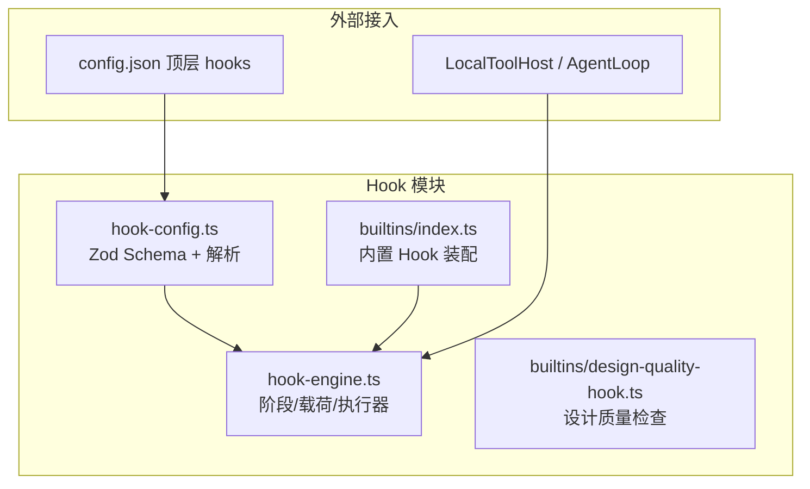
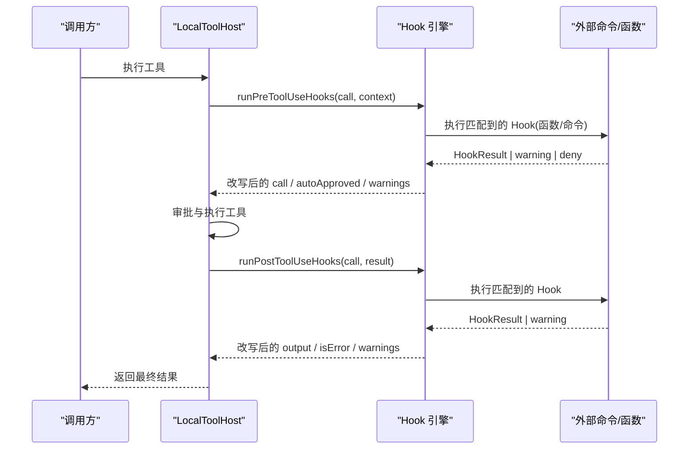
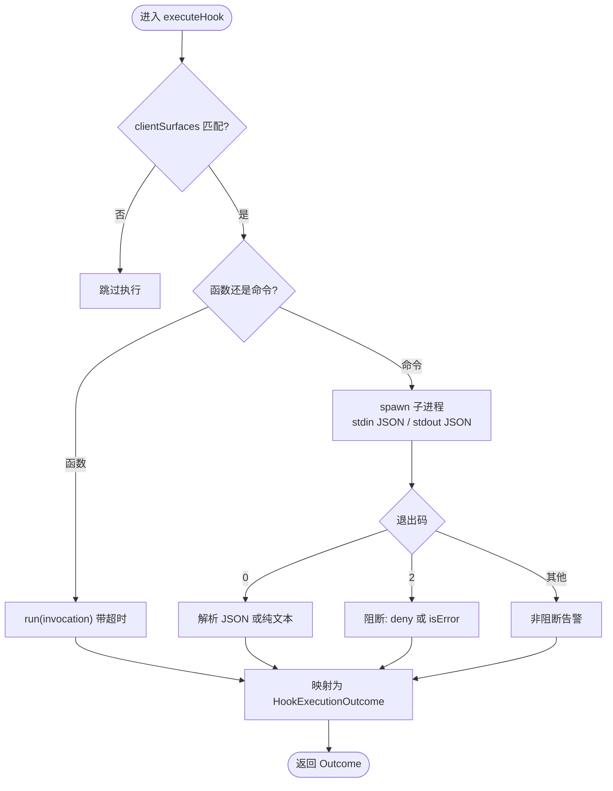
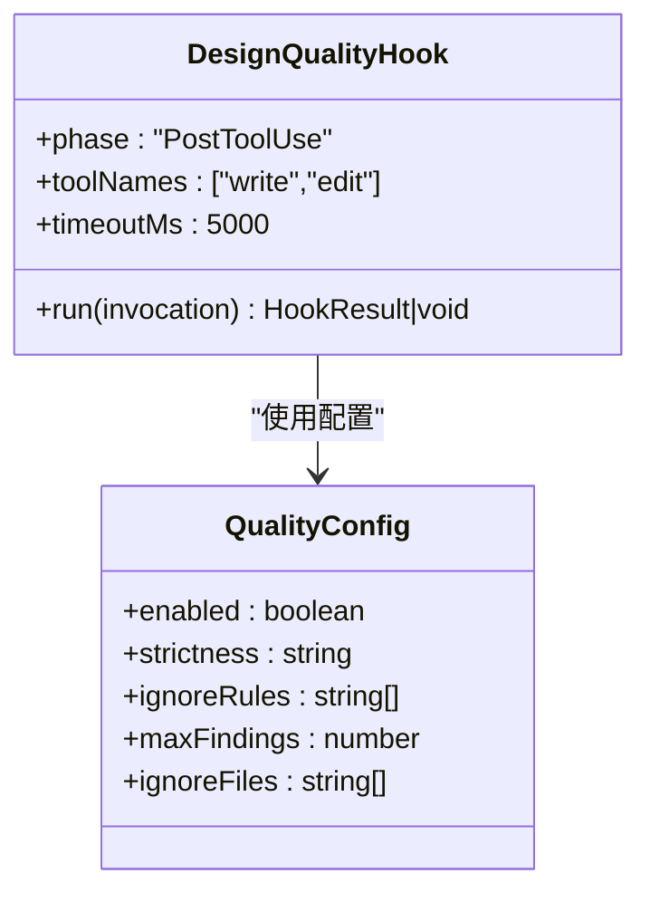
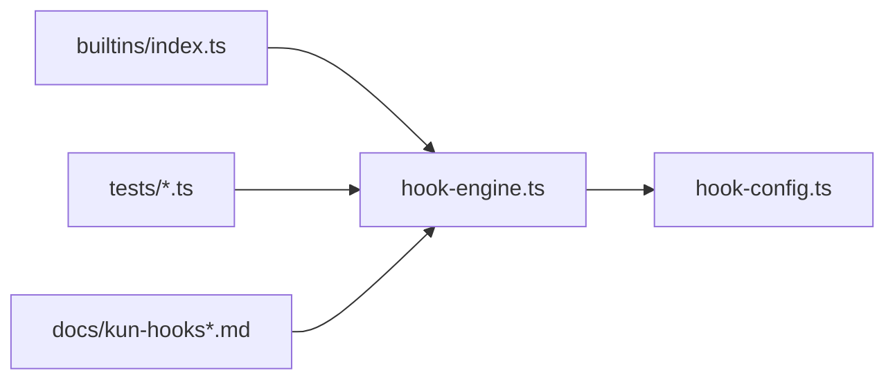

# Hook系统

<cite>
**本文引用的文件**
- [kun/src/hooks/hook-engine.ts](file://kun/src/hooks/hook-engine.ts)
- [kun/src/hooks/hook-config.ts](file://kun/src/hooks/hook-config.ts)
- [kun/src/hooks/index.ts](file://kun/src/hooks/index.ts)
- [kun/src/hooks/builtins/design-quality-hook.ts](file://kun/src/hooks/builtins/design-quality-hook.ts)
- [kun/src/hooks/builtins/index.ts](file://kun/src/hooks/builtins/index.ts)
- [docs/kun-hooks.md](file://docs/kun-hooks.md)
- [docs/kun-hooks.en.md](file://docs/kun-hooks.en.md)
- [kun/tests/hooks.test.ts](file://kun/tests/hooks.test.ts)
- [kun/tests/hooks-lifecycle.test.ts](file://kun/tests/hooks-lifecycle.test.ts)
</cite>

## 目录
1. [简介](#简介)
2. [项目结构](#项目结构)
3. [核心组件](#核心组件)
4. [架构总览](#架构总览)
5. [详细组件分析](#详细组件分析)
6. [依赖关系分析](#依赖关系分析)
7. [性能考量](#性能考量)
8. [故障排查指南](#故障排查指南)
9. [结论](#结论)
10. [附录](#附录)

## 简介
本文件为 DeepSeek-GUI（Kun）Hook 系统的权威文档，覆盖钩子引擎的工作原理、阶段与载荷、匹配器与链式语义、配置机制、内置 Hook、自定义 Hook 开发、组合模式、性能优化与最佳实践。读者读完后可在不阅读源码的情况下编写并部署可用的 Hook。

## 项目结构
Hook 系统由“引擎 + 配置解析 + 内置 Hook + 测试/文档”构成：
- 引擎：定义阶段、载荷、结果类型、匹配器、执行器与超时控制
- 配置：基于 Zod 的 schema 校验 config.json 中的 hooks 数组，并将配置项解析为可运行 Hook
- 内置 Hook：以代码方式装配，优先于用户配置执行
- 测试与文档：覆盖匹配、链式、退出码协议、超时、生命周期集成等

图表来源
- [kun/src/hooks/hook-engine.ts:12-19](file://kun/src/hooks/hook-engine.ts#L12-L19)
- [kun/src/hooks/hook-config.ts:10-50](file://kun/src/hooks/hook-config.ts#L10-L50)
- [kun/src/hooks/builtins/index.ts:17-25](file://kun/src/hooks/builtins/index.ts#L17-L25)

章节来源
- [docs/kun-hooks.md:23-44](file://docs/kun-hooks.md#L23-L44)
- [docs/kun-hooks.en.md:29-50](file://docs/kun-hooks.en.md#L29-L50)

## 核心组件
- 阶段与载荷
  - 六个阶段：PreToolUse、PostToolUse、UserPromptSubmit、TurnStart、TurnEnd、PreCompact
  - 每个阶段有明确的输入载荷与输出能力（允许/拒绝/改写参数或结果/注入上下文/只读观察）
- 匹配器
  - 工具名匹配：支持 glob 与精确名单；仅工具阶段生效
  - 客户端表面过滤：clientSurfaces 可选
- 执行器
  - 函数 Hook：进程内 run(invocation)
  - 命令 Hook：stdin JSON 调用外部进程，stdout JSON 或纯文本，退出码语义明确
  - 超时控制：默认 60s，可 per-hook 覆盖
- 链式语义
  - 同阶段按声明顺序串行执行
  - PreToolUse：deny 立即终止链；arguments 被后续 hook 可见
  - PostToolUse：output/isError 被后续 hook 叠加
  - UserPromptSubmit：deny 终止链；additionalContext 累积
- 配置机制
  - config.json 顶层 hooks 数组，支持命令型与工作流型 Hook
  - 通过 zod schema 严格校验，未知字段拒绝
  - 解析为 ResolvedHook，混用函数与命令 Hook

章节来源
- [kun/src/hooks/hook-engine.ts:12-126](file://kun/src/hooks/hook-engine.ts#L12-L126)
- [kun/src/hooks/hook-config.ts:10-50](file://kun/src/hooks/hook-config.ts#L10-L50)
- [docs/kun-hooks.md:46-165](file://docs/kun-hooks.md#L46-L165)

## 架构总览
Hook 在两个层面接入运行时：
- 工具宿主层：LocalToolHost 在每次工具调用前后执行 PreToolUse/PostToolUse
- 循环层：AgentLoop 在回合生命周期中执行 TurnStart/TurnEnd/UserPromptSubmit/PreCompact

图表来源
- [kun/src/hooks/hook-engine.ts:161-216](file://kun/src/hooks/hook-engine.ts#L161-L216)
- [docs/kun-hooks.md:48-103](file://docs/kun-hooks.md#L48-L103)

章节来源
- [docs/kun-hooks.md:23-44](file://docs/kun-hooks.md#L23-L44)

## 详细组件分析

### 钩子引擎（hook-engine.ts）
- 阶段常量与类型
  - HOOK_PHASES 枚举所有阶段
  - HookInvocation 联合类型承载各阶段载荷
  - HookResult 统一结果模型（decision/message/arguments/output/isError/additionalContext）
- 执行流程
  - runPreToolUseHooks：按序执行，支持 deny 短路、auto-approve、arguments 链式替换
  - runPostToolUseHooks：按序执行，支持 output/isError 链式替换
  - runUserPromptSubmitHooks：收集 additionalContext，deny 失败整个回合，崩溃降级为警告
  - runObserverHooks：TurnStart/TurnEnd/PreCompact 只读，异常转警告
- 匹配器
  - hookMatchesTool：支持 matcher（glob 编译为正则）与 toolNames 精确名单
  - compileMatcher：缓存已编译的正则，限制最大条目数，避免内存增长
- 命令 Hook 协议
  - stdin 写入 JSON，stdout 解析 JSON 或纯文本
  - 退出码 0：成功；2：阻断；其他非零：非阻断告警
  - 超时：默认 60s，超时会终止进程树并抛出错误
- 客户端表面过滤
  - clientSurfaces 可选，未命中则跳过该 Hook

图表来源
- [kun/src/hooks/hook-engine.ts:342-428](file://kun/src/hooks/hook-engine.ts#L342-L428)
- [kun/src/hooks/hook-engine.ts:313-334](file://kun/src/hooks/hook-engine.ts#L313-L334)

章节来源
- [kun/src/hooks/hook-engine.ts:12-149](file://kun/src/hooks/hook-engine.ts#L12-L149)
- [kun/src/hooks/hook-engine.ts:161-279](file://kun/src/hooks/hook-engine.ts#L161-L279)
- [kun/src/hooks/hook-engine.ts:285-334](file://kun/src/hooks/hook-engine.ts#L285-L334)
- [kun/src/hooks/hook-engine.ts:342-454](file://kun/src/hooks/hook-engine.ts#L342-L454)

### 配置解析（hook-config.ts）
- Zod Schema
  - HookCommandConfigSchema：phase/matcher/toolNames/clientSurfaces/command/cwd/timeoutMs
  - HookWorkflowConfigSchema：phase/matcher/toolNames/clientSurfaces/workflow/baseUrl/secret/mode/timeoutMs
  - HooksConfigSchema：两者联合数组
- 解析与装配
  - resolveConfiguredHooks：将配置转换为 ResolvedHook
  - 工作流 Hook：POST 到本地 WorkflowRuntime HTTP 端点，根据 mode（observe/block/rewrite）映射为 HookResult
- 安全与容错
  - 传输错误降级为 message，不阻断 agent
  - 工作流 block 模式：失败或特定输出视为 deny；rewrite 模式折叠输出

章节来源
- [kun/src/hooks/hook-config.ts:10-50](file://kun/src/hooks/hook-config.ts#L10-L50)
- [kun/src/hooks/hook-config.ts:60-122](file://kun/src/hooks/hook-config.ts#L60-L122)
- [kun/src/hooks/hook-config.ts:124-148](file://kun/src/hooks/hook-config.ts#L124-L148)

### 内置 Hook（design-quality-hook.ts）
- 作用：在写/改前端文件后扫描设计质量问题，将 review 块折叠进工具输出，供模型下一轮自纠
- 触发：PostToolUse，toolNames 限定 write/edit
- 逻辑要点
  - 读取源内容（优先 arguments.content，否则读磁盘），限制文件大小
  - 忽略规则与路径匹配（简单 glob）
  - 检测并汇总发现，注入 design_quality_review
- 装配：buildBuiltinHooks 根据 QualityConfig 启用/禁用

图表来源
- [kun/src/hooks/builtins/design-quality-hook.ts:76-120](file://kun/src/hooks/builtins/design-quality-hook.ts#L76-L120)
- [kun/src/hooks/builtins/index.ts:17-25](file://kun/src/hooks/builtins/index.ts#L17-L25)

章节来源
- [kun/src/hooks/builtins/design-quality-hook.ts:1-121](file://kun/src/hooks/builtins/design-quality-hook.ts#L1-L121)
- [kun/src/hooks/builtins/index.ts:1-28](file://kun/src/hooks/builtins/index.ts#L1-L28)

### 生命周期与集成（测试验证）
- 单元测试覆盖
  - 匹配器、链式语义、退出码协议、超时、auto-approve
  - LocalToolHost 集成：allow 跳过审批
- 生命周期集成测试
  - TurnStart/TurnEnd 载荷正确
  - UserPromptSubmit deny 导致回合失败并落盘
  - additionalContext 持久化为 <hook-context> 用户消息
  - PreCompact 触发时机
  - 观察者 Hook 崩溃不阻断回合，记录 hook_warning

章节来源
- [kun/tests/hooks.test.ts:29-154](file://kun/tests/hooks.test.ts#L29-L154)
- [kun/tests/hooks.test.ts:156-249](file://kun/tests/hooks.test.ts#L156-L249)
- [kun/tests/hooks.test.ts:251-392](file://kun/tests/hooks.test.ts#L251-L392)
- [kun/tests/hooks-lifecycle.test.ts:15-111](file://kun/tests/hooks-lifecycle.test.ts#L15-L111)

## 依赖关系分析
- 模块耦合
  - hook-engine 提供阶段执行与匹配器，被 LocalToolHost 与 AgentLoop 调用
  - hook-config 负责将 config.json 转为 ResolvedHook，与 engine 解耦
  - builtins 通过 buildBuiltinHooks 生成 ResolvedHook，插入到用户配置之前
- 外部依赖
  - child_process.spawn 用于命令 Hook
  - fetch 用于工作流 Hook 的 HTTP 调用
  - zod 用于配置校验
- 潜在循环
  - 无直接循环依赖；engine/config/builtins 单向依赖

图表来源
- [kun/src/hooks/hook-engine.ts:1-5](file://kun/src/hooks/hook-engine.ts#L1-L5)
- [kun/src/hooks/hook-config.ts:1-3](file://kun/src/hooks/hook-config.ts#L1-L3)
- [kun/src/hooks/builtins/index.ts:9-11](file://kun/src/hooks/builtins/index.ts#L9-L11)

章节来源
- [kun/src/hooks/index.ts:1-28](file://kun/src/hooks/index.ts#L1-L28)

## 性能考量
- 匹配器缓存
  - 编译后的正则缓存，限制最大条目数，避免内存无限增长
- 超时控制
  - 函数 Hook 与命令 Hook 均支持超时，防止阻塞主循环
- 资源清理
  - 命令 Hook 超时后终止进程树，避免僵尸进程
- 异步处理
  - 所有 Hook 执行均为异步，避免同步阻塞
- 建议
  - 合理设置 timeoutMs，避免长耗时 Hook
  - 使用 matcher/toolNames 缩小范围，减少不必要执行
  - 观察者 Hook 保持轻量，避免 I/O 密集操作

章节来源
- [kun/src/hooks/hook-engine.ts:305-334](file://kun/src/hooks/hook-engine.ts#L305-L334)
- [kun/src/hooks/hook-engine.ts:441-454](file://kun/src/hooks/hook-engine.ts#L441-L454)

## 故障排查指南
- 常见现象与定位
  - 工具调用被拒绝：检查 PreToolUse 是否返回 decision: deny 或命令退出码 2
  - 回合失败：检查 UserPromptSubmit 是否 deny，查看错误项 code 为 hook_denied
  - 输出被改写：检查 PostToolUse 是否修改 output 或标记 isError
  - 观察者失效：TurnStart/TurnEnd/PreCompact 崩溃仅产生 hook_warning，不影响回合
- 日志与事件
  - hook_denied：拒绝事件与错误项
  - hook_failed：工具阶段 Hook 崩溃或超时
  - hook_warning：非阻断告警（观察者崩溃、命令非零退出等）
- 调试技巧
  - 使用最小命令 Hook 打印 invocation 到 stderr/stdout
  - 逐步缩小 matcher/toolNames 范围定位问题
  - 增加 timeoutMs 排除超时导致的误判

章节来源
- [docs/kun-hooks.md:230-241](file://docs/kun-hooks.md#L230-L241)
- [docs/kun-hooks.en.md:250-265](file://docs/kun-hooks.en.md#L250-L265)
- [kun/tests/hooks-lifecycle.test.ts:91-111](file://kun/tests/hooks-lifecycle.test.ts#L91-L111)

## 结论
Hook 系统为 Kun 提供了强大且安全的扩展能力，通过六阶段、匹配器、链式语义与严格的配置校验，实现了从工具调用到回合生命周期的全链路可观测与可干预。内置 Hook 与自定义 Hook 可无缝组合，配合超时、缓存与资源清理策略，确保高性能与稳定性。遵循最佳实践与故障排查指南，可快速构建可靠的业务逻辑模块化方案。

## 附录

### 阶段与能力速查
- PreToolUse：可 deny/allow/改写 arguments
- PostToolUse：可改写 output/标记 isError
- UserPromptSubmit：可 deny/注入 additionalContext
- TurnStart/TurnEnd/PreCompact：只读观察，异常降级为警告

章节来源
- [docs/kun-hooks.md:46-129](file://docs/kun-hooks.md#L46-L129)
- [docs/kun-hooks.en.md:52-142](file://docs/kun-hooks.en.md#L52-L142)

### 配置示例与说明
- 顶层 hooks 数组，每项包含 phase、matcher/toolNames、command/workflow、timeoutMs 等
- 命令 Hook：stdin JSON，stdout JSON/纯文本，退出码语义明确
- 工作流 Hook：POST 到本地 WorkflowRuntime，mode 决定 observe/block/rewrite

章节来源
- [docs/kun-hooks.md:167-204](file://docs/kun-hooks.md#L167-L204)
- [docs/kun-hooks.en.md:185-221](file://docs/kun-hooks.en.md#L185-L221)
- [kun/src/hooks/hook-config.ts:32-50](file://kun/src/hooks/hook-config.ts#L32-L50)

### 自定义 Hook 开发指南
- 接口规范
  - 函数 Hook：实现 run(invocation) => HookResult|void
  - 命令 Hook：读取 stdin JSON，输出 stdout JSON/纯文本，使用退出码表达意图
- 测试方法
  - 使用单元测试模拟 invocation 与期望结果
  - 覆盖匹配器、链式、超时、退出码等场景
- 部署流程
  - 在 config.json 顶层 hooks 数组添加配置
  - 或通过 embedder API 注入函数 Hook
  - 内置 Hook 由运行时装配，优先于用户配置执行

章节来源
- [docs/kun-hooks.md:205-234](file://docs/kun-hooks.md#L205-L234)
- [docs/kun-hooks.en.md:223-255](file://docs/kun-hooks.en.md#L223-L255)
- [kun/src/hooks/builtins/index.ts:17-25](file://kun/src/hooks/builtins/index.ts#L17-L25)

### 最佳实践
- 错误处理
  - 工具阶段：fail closed（崩溃/超时阻断）
  - 提示门阶段：fail open（崩溃降级为警告）
  - 观察者：崩溃仅记录警告
- 日志记录
  - 使用 stderr 输出诊断信息
  - 关注 hook_warning/hook_failed/hook_denied 事件
- 调试技巧
  - 最小化 Hook 复现问题
  - 利用 matcher/toolNames 精准定位
  - 结合测试用例验证行为

章节来源
- [docs/kun-hooks.md:18-22](file://docs/kun-hooks.md#L18-L22)
- [docs/kun-hooks.en.md:16-27](file://docs/kun-hooks.en.md#L16-L27)
- [kun/tests/hooks.test.ts:251-347](file://kun/tests/hooks.test.ts#L251-L347)