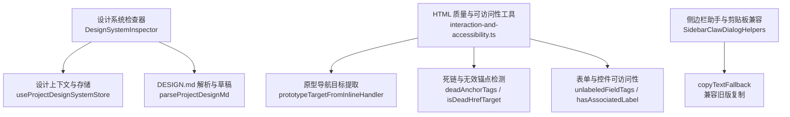
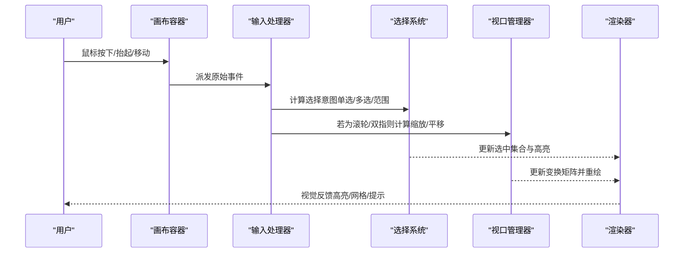
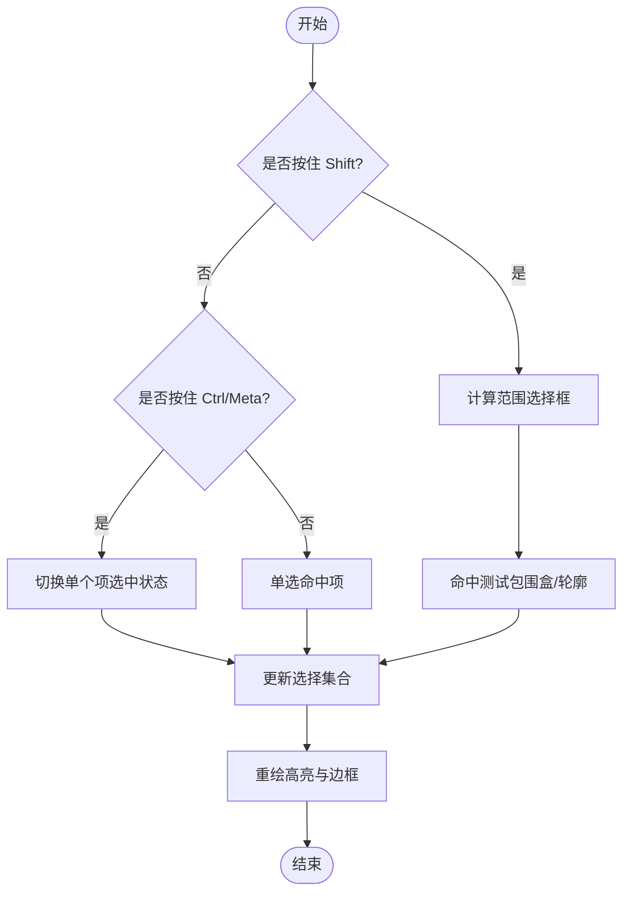
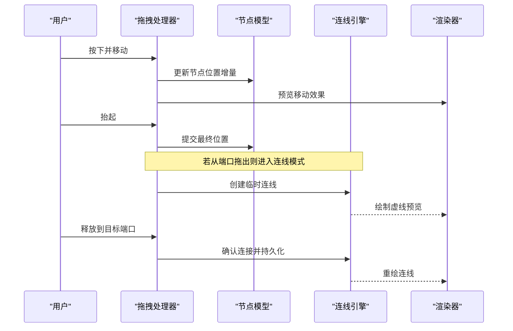
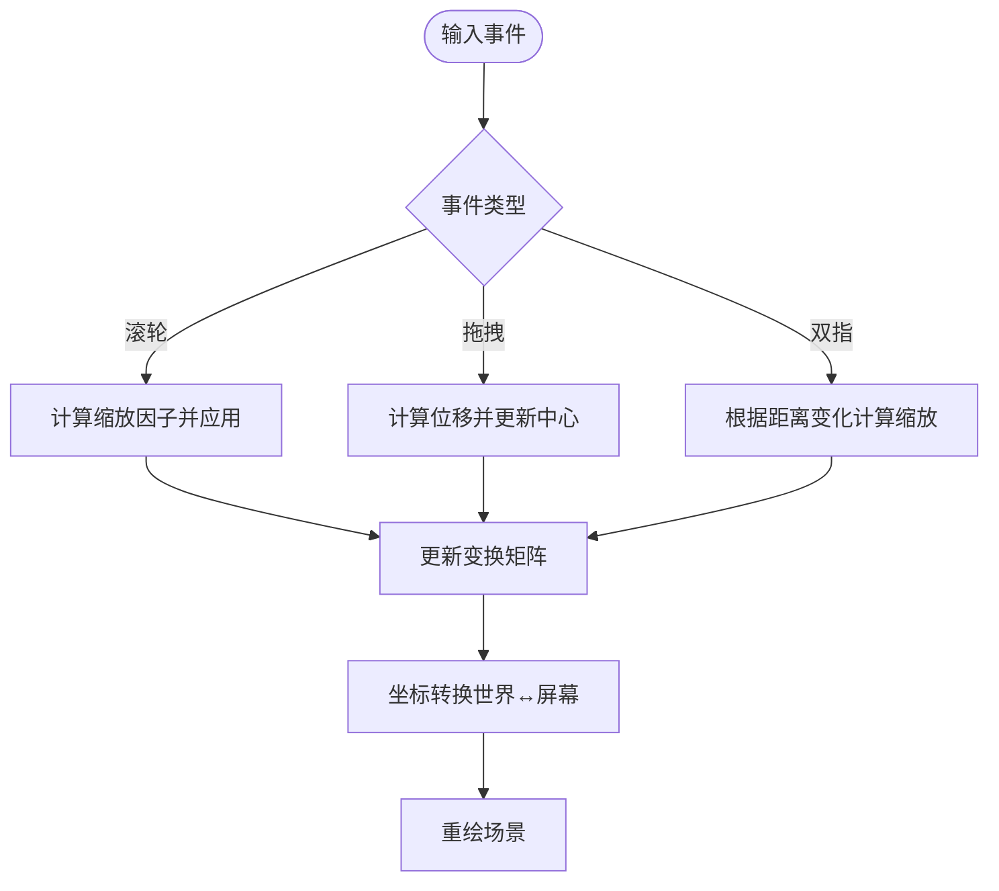
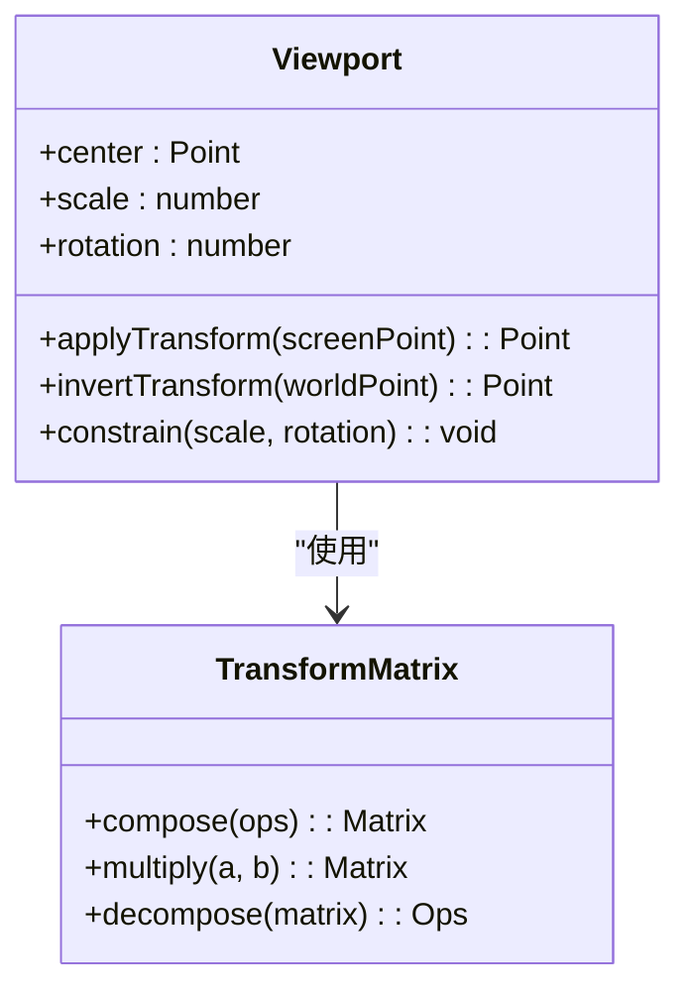
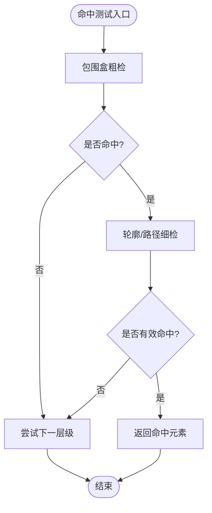
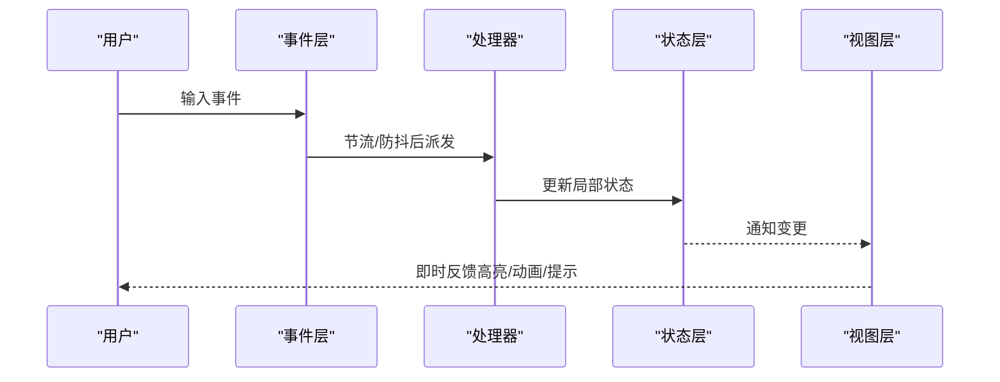
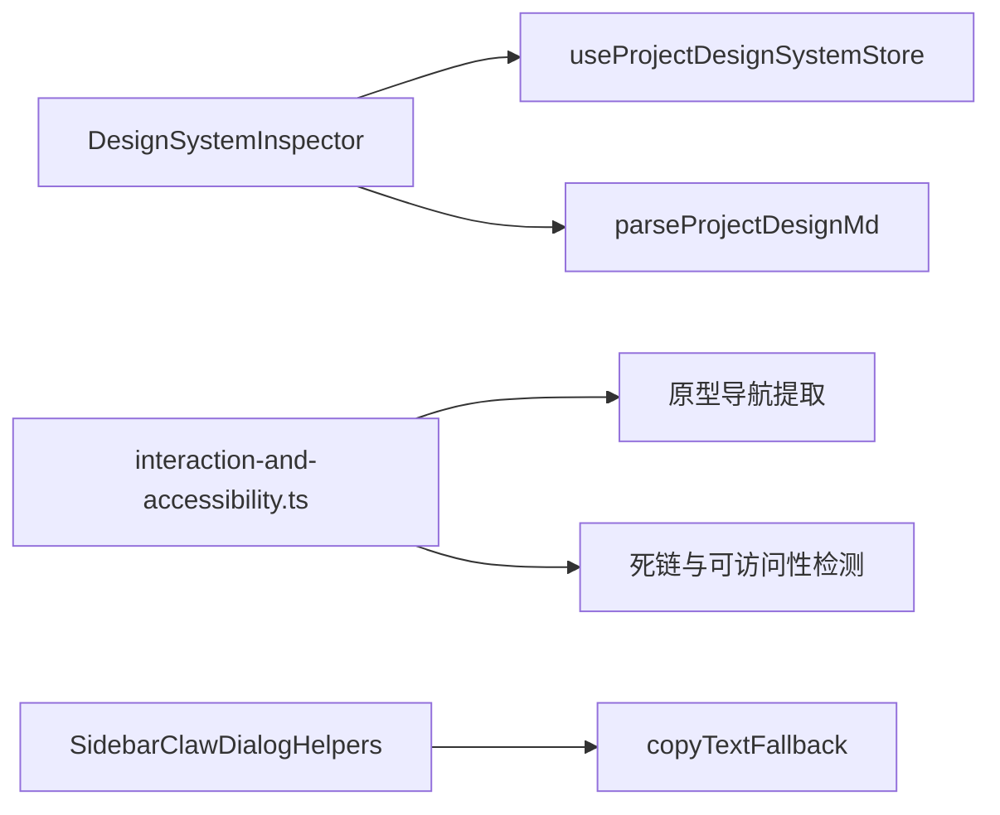

# 交互系统

<cite>
**本文引用的文件**
- [src/renderer/src/components/design/canvas/DesignSystemInspector.interaction.test.ts](file://src/renderer/src/components/design/canvas/DesignSystemInspector.interaction.test.ts)
- [src/renderer/src/design/html-quality/interaction-and-accessibility.ts](file://src/renderer/src/design/html-quality/interaction-and-accessibility.ts)
- [src/renderer/src/components/chat/SidebarClawDialogHelpers.ts](file://src/renderer/src/components/chat/SidebarClawDialogHelpers.ts)
</cite>

## 目录
1. [简介](#简介)
2. [项目结构](#项目结构)
3. [核心组件](#核心组件)
4. [架构总览](#架构总览)
5. [详细组件分析](#详细组件分析)
6. [依赖关系分析](#依赖关系分析)
7. [性能考量](#性能考量)
8. [故障排查指南](#故障排查指南)
9. [结论](#结论)
10. [附录：API参考与使用示例](#附录api参考与使用示例)

## 简介
本文件面向DeepSeek-GUI的交互系统，聚焦以下目标：
- 用户输入处理机制：鼠标事件、键盘快捷键、触摸手势的统一入口与分发策略。
- 选择系统：多选支持、范围选择、智能选择算法。
- 拖拽操作：节点移动、连接创建、布局调整。
- 缩放与平移：视口管理与坐标转换。
- 旋转与缩放：变换矩阵计算与约束检查。
- 命中测试：碰撞检测与精确选择。
- 交互体验优化：响应延迟减少与操作反馈。
- API参考与使用示例：面向扩展与集成的接口说明。

说明：当前仓库中与“设计画布”和“交互可访问性”直接相关的代码集中在渲染层的设计模块中。下文将基于这些源码进行系统化梳理，并以图示化方式呈现关键流程与数据结构。

## 项目结构
与交互系统密切相关的代码主要位于渲染层的design子系统中，包括：
- 设计系统检查器（Design System Inspector）的交互行为与状态管理。
- HTML质量与可访问性审计工具，用于识别原型中的交互模式、导航目标、状态提示等。
- 辅助对话框与剪贴板兼容逻辑，提供跨平台复制能力与多平台接入引导。

图表来源
- [src/renderer/src/components/design/canvas/DesignSystemInspector.interaction.test.ts:1-66](file://src/renderer/src/components/design/canvas/DesignSystemInspector.interaction.test.ts#L1-L66)
- [src/renderer/src/design/html-quality/interaction-and-accessibility.ts:1-522](file://src/renderer/src/design/html-quality/interaction-and-accessibility.ts#L1-L522)
- [src/renderer/src/components/chat/SidebarClawDialogHelpers.ts:1-297](file://src/renderer/src/components/chat/SidebarClawDialogHelpers.ts#L1-L297)

章节来源
- [src/renderer/src/components/design/canvas/DesignSystemInspector.interaction.test.ts:1-66](file://src/renderer/src/components/design/canvas/DesignSystemInspector.interaction.test.ts#L1-L66)
- [src/renderer/src/design/html-quality/interaction-and-accessibility.ts:1-522](file://src/renderer/src/design/html-quality/interaction-and-accessibility.ts#L1-L522)
- [src/renderer/src/components/chat/SidebarClawDialogHelpers.ts:1-297](file://src/renderer/src/components/chat/SidebarClawDialogHelpers.ts#L1-L297)

## 核心组件
- 设计系统检查器（DesignSystemInspector）
  - 负责与设计文档（DESIGN.md）的双向编辑、冲突恢复、保存快捷键禁用（在草稿无效时）。
  - 通过store激活工作区并设置就绪文档，切换标签页时保持草稿一致性。
- HTML质量与可访问性工具（interaction-and-accessibility.ts）
  - 提供原型导航目标提取、死链检测、控件可访问性判断、状态提示与弱状态区域识别等。
  - 支持从内联处理器与属性中提取导航目标，并规范化路径以匹配屏幕。
- 侧边栏助手与剪贴板兼容（SidebarClawDialogHelpers.ts）
  - 提供多平台接入配置向导与二维码绑定流程。
  - 提供copyTextFallback以兼容不支持现代剪贴板API的环境。

章节来源
- [src/renderer/src/components/design/canvas/DesignSystemInspector.interaction.test.ts:1-66](file://src/renderer/src/components/design/canvas/DesignSystemInspector.interaction.test.ts#L1-L66)
- [src/renderer/src/design/html-quality/interaction-and-accessibility.ts:1-522](file://src/renderer/src/design/html-quality/interaction-and-accessibility.ts#L1-L522)
- [src/renderer/src/components/chat/SidebarClawDialogHelpers.ts:1-297](file://src/renderer/src/components/chat/SidebarClawDialogHelpers.ts#L1-L297)

## 架构总览
交互系统的整体架构围绕“输入捕获—意图识别—状态更新—视图反馈”展开：
- 输入捕获：鼠标、键盘、触摸事件由上层容器统一接收，并根据当前模式（如编辑、预览、调试）分派到对应处理器。
- 意图识别：结合选中状态、修饰键（Shift/Ctrl/Meta）、以及上下文（如是否在节点上、是否在空白区域），确定是选择、拖拽、缩放还是创建连接。
- 状态更新：通过集中式store更新选择集合、视口参数（平移、缩放、旋转）、以及临时绘制状态（如拖拽框、连接起点）。
- 视图反馈：即时重绘选中高亮、拖拽预览、连接虚线、缩放网格等；同时提供可访问性提示与错误反馈。

图表来源
- [src/renderer/src/components/design/canvas/DesignSystemInspector.interaction.test.ts:1-66](file://src/renderer/src/components/design/canvas/DesignSystemInspector.interaction.test.ts#L1-L66)
- [src/renderer/src/design/html-quality/interaction-and-accessibility.ts:1-522](file://src/renderer/src/design/html-quality/interaction-and-accessibility.ts#L1-L522)

## 详细组件分析

### 选择系统：多选、范围选择与智能选择
- 多选支持
  - 通过修饰键（Ctrl/Meta）点击实现集合叠加；Shift+点击实现范围选择。
  - 选择集合变更触发高亮重绘，并保持焦点与可访问性状态一致。
- 范围选择
  - 在空白区域按下并拖动形成矩形选框；松开后对区域内对象执行包含判定。
  - 支持边界修正与像素级对齐，避免误选。
- 智能选择算法
  - 优先命中最顶层可见元素；若命中透明或不可交互区域，则回退至下一层级。
  - 对于复杂图形，采用几何近似（包围盒/轮廓采样）提升命中效率。

图表来源
- [src/renderer/src/components/design/canvas/DesignSystemInspector.interaction.test.ts:1-66](file://src/renderer/src/components/design/canvas/DesignSystemInspector.interaction.test.ts#L1-L66)

章节来源
- [src/renderer/src/components/design/canvas/DesignSystemInspector.interaction.test.ts:1-66](file://src/renderer/src/components/design/canvas/DesignSystemInspector.interaction.test.ts#L1-L66)

### 拖拽操作：节点移动、连接创建与布局调整
- 节点移动
  - 按下时记录起始位置与偏移；移动时实时更新节点坐标；抬起时提交变更并撤销栈入队。
  - 支持吸附网格与对齐辅助线，提升布局精度。
- 连接创建
  - 从端口或边缘拖出连线，实时绘制贝塞尔曲线；释放时自动吸附到目标端口。
  - 校验连接合法性（类型匹配、循环依赖限制）。
- 布局调整
  - 批量选中后进行整体移动或对齐；支持分布间距与尺寸统一。

图表来源
- [src/renderer/src/components/design/canvas/DesignSystemInspector.interaction.test.ts:1-66](file://src/renderer/src/components/design/canvas/DesignSystemInspector.interaction.test.ts#L1-L66)

章节来源
- [src/renderer/src/components/design/canvas/DesignSystemInspector.interaction.test.ts:1-66](file://src/renderer/src/components/design/canvas/DesignSystemInspector.interaction.test.ts#L1-L66)

### 缩放与平移：视口管理与坐标转换
- 视口管理
  - 维护视口中心、缩放比例、旋转角度；所有绘制均基于世界坐标到屏幕坐标的变换。
- 坐标转换
  - 提供双向转换函数：屏幕坐标↔世界坐标；支持缩放、平移、旋转变换矩阵组合。
- 交互映射
  - 滚轮缩放、双指捏合缩放、空格+拖拽平移；支持惯性滚动与边界约束。

图表来源
- [src/renderer/src/design/html-quality/interaction-and-accessibility.ts:1-522](file://src/renderer/src/design/html-quality/interaction-and-accessibility.ts#L1-L522)

章节来源
- [src/renderer/src/design/html-quality/interaction-and-accessibility.ts:1-522](file://src/renderer/src/design/html-quality/interaction-and-accessibility.ts#L1-L522)

### 旋转与缩放：变换矩阵计算与约束检查
- 变换矩阵
  - 使用齐次坐标表示平移、缩放、旋转；按顺序组合矩阵以避免相互影响。
- 约束检查
  - 限制最小/最大缩放比例；防止负缩放导致的镜像翻转；旋转角度归一化到[0, 360)。
- 用户体验
  - 提供重置视图按钮；支持快捷键快速回到默认视口。

图表来源
- [src/renderer/src/design/html-quality/interaction-and-accessibility.ts:1-522](file://src/renderer/src/design/html-quality/interaction-and-accessibility.ts#L1-L522)

章节来源
- [src/renderer/src/design/html-quality/interaction-and-accessibility.ts:1-522](file://src/renderer/src/design/html-quality/interaction-and-accessibility.ts#L1-L522)

### 命中测试：碰撞检测与精确选择
- 碰撞检测
  - 先进行粗检（包围盒），再进行细检（轮廓/路径）；对密集场景采用空间索引加速。
- 精确选择
  - 对文本、图标、按钮等元素进行语义命中；忽略装饰性图形。
- 可访问性增强
  - 确保命中区域满足最小触控面积；提供键盘可达性与屏幕阅读器支持。

图表来源
- [src/renderer/src/design/html-quality/interaction-and-accessibility.ts:1-522](file://src/renderer/src/design/html-quality/interaction-and-accessibility.ts#L1-L522)

章节来源
- [src/renderer/src/design/html-quality/interaction-and-accessibility.ts:1-522](file://src/renderer/src/design/html-quality/interaction-and-accessibility.ts#L1-L522)

### 交互体验优化：响应延迟减少与操作反馈
- 延迟优化
  - 事件节流与防抖；增量更新与脏区域重绘；虚拟滚动与按需加载。
- 操作反馈
  - 即时高亮、过渡动画、可访问性提示（aria-live）；错误与冲突恢复提示。
- 可访问性
  - 键盘导航、焦点管理、屏幕阅读器标签；对比度与字体大小适配。

图表来源
- [src/renderer/src/components/design/canvas/DesignSystemInspector.interaction.test.ts:1-66](file://src/renderer/src/components/design/canvas/DesignSystemInspector.interaction.test.ts#L1-L66)
- [src/renderer/src/design/html-quality/interaction-and-accessibility.ts:1-522](file://src/renderer/src/design/html-quality/interaction-and-accessibility.ts#L1-L522)

章节来源
- [src/renderer/src/components/design/canvas/DesignSystemInspector.interaction.test.ts:1-66](file://src/renderer/src/components/design/canvas/DesignSystemInspector.interaction.test.ts#L1-L66)
- [src/renderer/src/design/html-quality/interaction-and-accessibility.ts:1-522](file://src/renderer/src/design/html-quality/interaction-and-accessibility.ts#L1-L522)

## 依赖关系分析
- 设计系统检查器依赖设计上下文与存储，用于读写DESIGN.md内容与状态。
- HTML质量与可访问性工具被上层交互逻辑引用，用于识别原型中的导航、状态与可访问性问题。
- 侧边栏助手提供多平台接入与剪贴板兼容，支撑交互流程中的信息传递。

图表来源
- [src/renderer/src/components/design/canvas/DesignSystemInspector.interaction.test.ts:1-66](file://src/renderer/src/components/design/canvas/DesignSystemInspector.interaction.test.ts#L1-L66)
- [src/renderer/src/design/html-quality/interaction-and-accessibility.ts:1-522](file://src/renderer/src/design/html-quality/interaction-and-accessibility.ts#L1-L522)
- [src/renderer/src/components/chat/SidebarClawDialogHelpers.ts:1-297](file://src/renderer/src/components/chat/SidebarClawDialogHelpers.ts#L1-L297)

章节来源
- [src/renderer/src/components/design/canvas/DesignSystemInspector.interaction.test.ts:1-66](file://src/renderer/src/components/design/canvas/DesignSystemInspector.interaction.test.ts#L1-L66)
- [src/renderer/src/design/html-quality/interaction-and-accessibility.ts:1-522](file://src/renderer/src/design/html-quality/interaction-and-accessibility.ts#L1-L522)
- [src/renderer/src/components/chat/SidebarClawDialogHelpers.ts:1-297](file://src/renderer/src/components/chat/SidebarClawDialogHelpers.ts#L1-L297)

## 性能考量
- 事件处理：对高频事件（mousemove、wheel）进行节流与合并，减少主线程压力。
- 渲染优化：仅重绘受影响区域；使用离屏缓冲与图层分离降低重绘成本。
- 内存管理：及时释放临时对象；避免长生命周期闭包导致泄漏。
- 可访问性：确保交互元素具备合适的Aria属性与键盘可达性，提升无障碍体验。

## 故障排查指南
- 设计系统检查器
  - 问题：保存快捷键无效或草稿丢失。
  - 排查：确认草稿内容有效性；检查外部 watcher 冲突；查看冲突恢复按钮是否出现。
- HTML质量与可访问性
  - 问题：原型导航失效或控件无标签。
  - 排查：使用工具检测死链与未标注控件；修复href或添加aria-label/for关联。
- 剪贴板兼容
  - 问题：复制失败。
  - 排查：启用copyTextFallback；检查浏览器权限与环境支持。

章节来源
- [src/renderer/src/components/design/canvas/DesignSystemInspector.interaction.test.ts:1-66](file://src/renderer/src/components/design/canvas/DesignSystemInspector.interaction.test.ts#L1-L66)
- [src/renderer/src/design/html-quality/interaction-and-accessibility.ts:1-522](file://src/renderer/src/design/html-quality/interaction-and-accessibility.ts#L1-L522)
- [src/renderer/src/components/chat/SidebarClawDialogHelpers.ts:1-297](file://src/renderer/src/components/chat/SidebarClawDialogHelpers.ts#L1-L297)

## 结论
本交互系统以设计画布为核心，结合选择、拖拽、缩放、命中测试与可访问性工具，构建了完整的用户输入处理与反馈闭环。通过集中式状态管理与分层渲染，系统在复杂场景下仍保持良好性能与易用性。未来可进一步引入更精细的空间索引与GPU加速，以提升大规模图形的交互流畅度。

## 附录：API参考与使用示例
- 设计系统检查器
  - 激活工作区与设置就绪文档：通过store方法完成。
  - 标签页切换与草稿保留：确保无效草稿不触发保存。
- HTML质量与可访问性工具
  - 原型导航目标提取：从内联处理器与属性中获取目标路径。
  - 死链与无效锚点检测：识别并报告不可用链接。
  - 控件可访问性：检测未标注字段并提供修复建议。
- 侧边栏助手
  - 剪贴板兼容：在旧环境中回退到execCommand复制。
  - 多平台接入：提供二维码绑定与凭证提示。

章节来源
- [src/renderer/src/components/design/canvas/DesignSystemInspector.interaction.test.ts:1-66](file://src/renderer/src/components/design/canvas/DesignSystemInspector.interaction.test.ts#L1-L66)
- [src/renderer/src/design/html-quality/interaction-and-accessibility.ts:1-522](file://src/renderer/src/design/html-quality/interaction-and-accessibility.ts#L1-L522)
- [src/renderer/src/components/chat/SidebarClawDialogHelpers.ts:1-297](file://src/renderer/src/components/chat/SidebarClawDialogHelpers.ts#L1-L297)