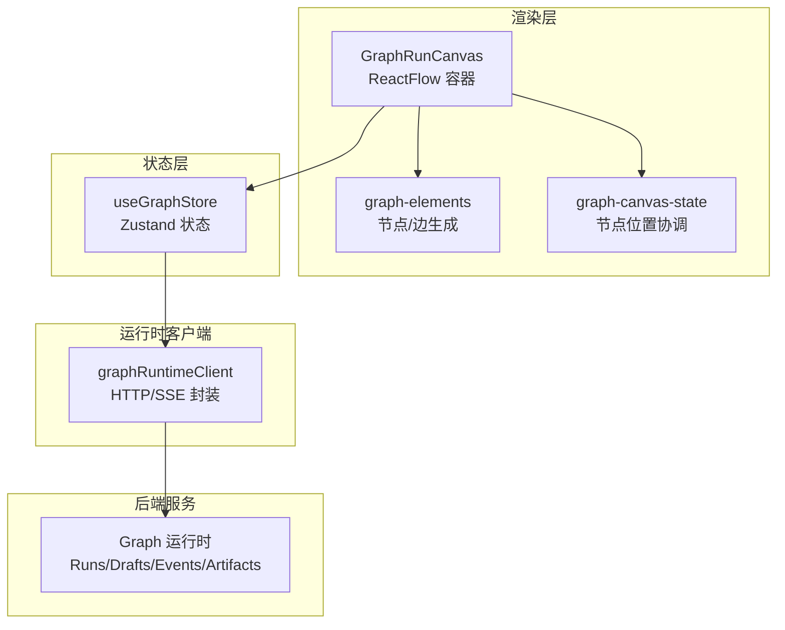
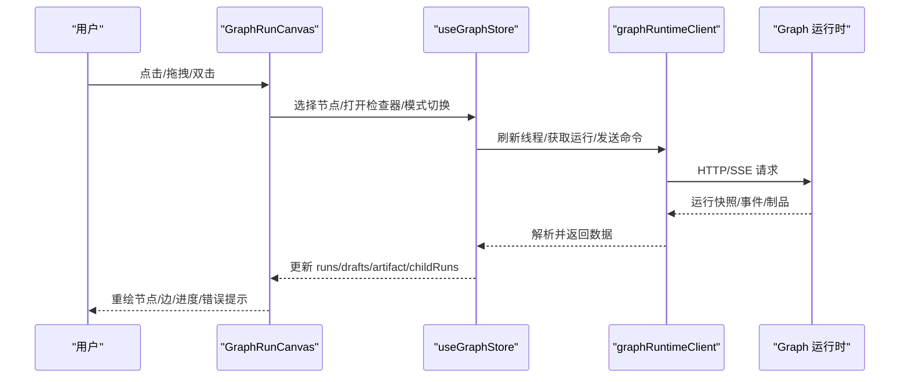
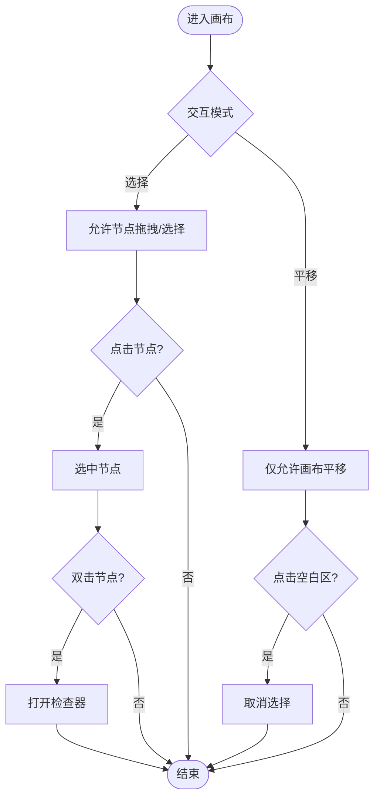
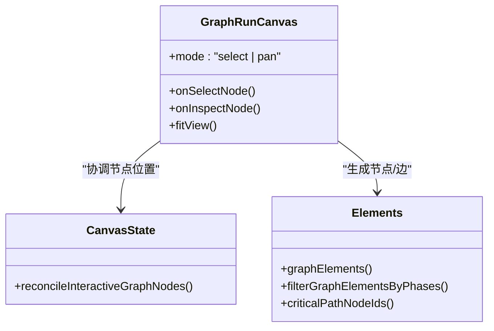
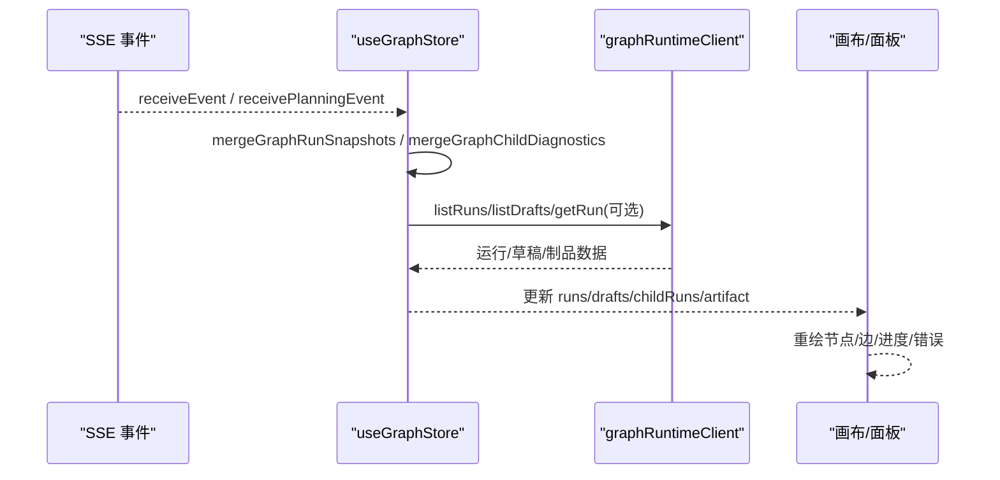
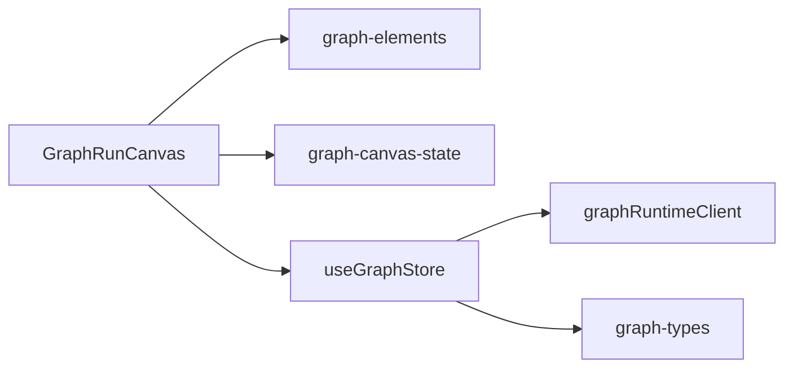

# 可视化编辑器

<cite>
**本文引用的文件**
- [graph-store.ts](file://src/renderer/src/graph/graph-store.ts)
- [graph-types.ts](file://src/renderer/src/graph/graph-types.ts)
- [graph-runtime-client.ts](file://src/renderer/src/graph/graph-runtime-client.ts)
- [GraphRunCanvas.tsx](file://src/renderer/src/components/graph/GraphRunCanvas.tsx)
- [graph-elements.tsx](file://src/renderer/src/components/graph/graph-elements.tsx)
- [graph-canvas-state.ts](file://src/renderer/src/components/graph/graph-canvas-state.ts)
</cite>

## 目录
1. [简介](#简介)
2. [项目结构](#项目结构)
3. [核心组件](#核心组件)
4. [架构总览](#架构总览)
5. [详细组件分析](#详细组件分析)
6. [依赖关系分析](#依赖关系分析)
7. [性能考量](#性能考量)
8. [故障排查指南](#故障排查指南)
9. [结论](#结论)
10. [附录：API参考与最佳实践](#附录api参考与最佳实践)

## 简介
本文件面向 DeepSeek-GUI 的可视化工作流编辑器，聚焦画布渲染引擎、节点绘制、连线算法、交互响应机制、拖拽操作、实时预览（执行模拟、状态显示、错误提示）、扩展机制（自定义节点类型与工具栏组件）、协作编辑（多人实时编辑、冲突解决、版本控制）以及调试工具（断点设置、变量查看、执行跟踪）。文档同时提供编辑器 API 参考（事件系统、数据绑定、样式定制）和使用教程与最佳实践。

## 项目结构
可视化工作流编辑器位于渲染层，核心由“状态管理 + 运行时客户端 + 画布 UI”构成：
- 状态管理：基于 zustand 的图运行视图状态，负责线程绑定、快照刷新、选择态、子进程诊断等。
- 运行时客户端：封装对后端 Graph 服务的 HTTP/SSE 请求，包括运行列表、草稿、事件、制品读取、命令、补丁、监督唤醒等。
- 画布 UI：基于 @xyflow/react 的 ReactFlow 实现节点与边渲染、缩放平移、选择与双击打开检查器、小地图等；并提供节点元素生成、关键路径计算、阶段折叠过滤等逻辑。

图表来源
- [GraphRunCanvas.tsx:1-206](file://src/renderer/src/components/graph/GraphRunCanvas.tsx#L1-L206)
- [graph-elements.tsx:1-304](file://src/renderer/src/components/graph/graph-elements.tsx#L1-L304)
- [graph-canvas-state.ts:1-18](file://src/renderer/src/components/graph/graph-canvas-state.ts#L1-L18)
- [graph-store.ts:1-746](file://src/renderer/src/graph/graph-store.ts#L1-L746)
- [graph-runtime-client.ts:1-379](file://src/renderer/src/graph/graph-runtime-client.ts#L1-L379)

章节来源
- [GraphRunCanvas.tsx:1-206](file://src/renderer/src/components/graph/GraphRunCanvas.tsx#L1-L206)
- [graph-elements.tsx:1-304](file://src/renderer/src/components/graph/graph-elements.tsx#L1-L304)
- [graph-canvas-state.ts:1-18](file://src/renderer/src/components/graph/graph-canvas-state.ts#L1-L18)
- [graph-store.ts:1-746](file://src/renderer/src/graph/graph-store.ts#L1-L746)
- [graph-runtime-client.ts:1-379](file://src/renderer/src/graph/graph-runtime-client.ts#L1-L379)

## 核心组件
- 画布容器 GraphRunCanvas：封装 ReactFlow，提供选择/平移模式切换、节点点击选中、双击打开检查器、工具栏（选择、平移、适应视图、打开检查器）、小地图、背景网格。
- 节点与边生成 graph-elements：根据当前运行的计划（phases/nodes/edges）生成节点与边，计算关键路径、处理循环边、消息/数据/控制边样式、进度条、活动指示等。
- 节点状态协调 graph-canvas-state：在外部节点集合变化时，保留用户拖拽后的节点位置并同步选中态。
- 状态管理 useGraphStore：线程绑定、刷新合并、选择运行/节点、子进程诊断合并、事件接收、命令/取消/重试/审查/补丁/引导、制品分页加载、项目代理配置导入导出等。
- 运行时客户端 graphRuntimeClient：统一封装 Graph 运行时接口，包含运行、草稿、事件、制品、监督、学习治理等能力。

章节来源
- [GraphRunCanvas.tsx:1-206](file://src/renderer/src/components/graph/GraphRunCanvas.tsx#L1-L206)
- [graph-elements.tsx:1-304](file://src/renderer/src/components/graph/graph-elements.tsx#L1-L304)
- [graph-canvas-state.ts:1-18](file://src/renderer/src/components/graph/graph-canvas-state.ts#L1-L18)
- [graph-store.ts:1-746](file://src/renderer/src/graph/graph-store.ts#L1-L746)
- [graph-runtime-client.ts:1-379](file://src/renderer/src/graph/graph-runtime-client.ts#L1-L379)

## 架构总览
下图展示从用户交互到后端数据的端到端流程：用户在画布上选择/拖拽节点，触发状态更新；状态层通过运行时客户端调用后端获取最新运行快照或发送指令；后端返回事件或结果后，状态层合并并驱动 UI 重绘。

图表来源
- [GraphRunCanvas.tsx:1-206](file://src/renderer/src/components/graph/GraphRunCanvas.tsx#L1-L206)
- [graph-store.ts:1-746](file://src/renderer/src/graph/graph-store.ts#L1-L746)
- [graph-runtime-client.ts:1-379](file://src/renderer/src/graph/graph-runtime-client.ts#L1-L379)

## 详细组件分析

### 画布渲染引擎（节点绘制、连线算法、交互响应）
- 节点绘制
  - 节点布局：按阶段顺序与行号计算初始坐标，确保同一阶段的节点在同一列，不同阶段纵向排列。
  - 节点内容：标题、目标描述、状态徽标、分配信息、活动指示、进度条、子代理头像与时长等。
  - 关键路径高亮：计算到达完成节点的最长路径，并对关键路径上的节点与边进行视觉强调。
- 连线算法
  - 边类型：控制/数据/消息，分别以不同颜色与线型呈现；循环边使用虚线与特定颜色标识。
  - 动画与粗细：当目标节点处于处理中时，边加粗并启用动画；关键路径与循环边加粗。
  - 交互宽度：为细边增加交互命中区域，提升易用性。
- 交互响应
  - 选择/平移模式：切换 nodesDraggable、panOnDrag、selectionOnDrag 等行为。
  - 点击与双击：点击节点选中，双击打开检查器；空白处点击取消选择。
  - 自适应视图：支持 fitView 与手动缩放、滚轮缩放、捏合缩放。
  - 小地图与背景：提供导航辅助与网格背景。

图表来源
- [GraphRunCanvas.tsx:1-206](file://src/renderer/src/components/graph/GraphRunCanvas.tsx#L1-L206)
- [graph-elements.tsx:1-304](file://src/renderer/src/components/graph/graph-elements.tsx#L1-L304)

章节来源
- [GraphRunCanvas.tsx:1-206](file://src/renderer/src/components/graph/GraphRunCanvas.tsx#L1-L206)
- [graph-elements.tsx:1-304](file://src/renderer/src/components/graph/graph-elements.tsx#L1-L304)

### 拖拽操作实现（节点移动、连接创建、布局调整）
- 节点移动
  - 通过 ReactFlow 的 onNodesChange 与 useNodesState 维护节点位置；graph-canvas-state 在外部节点集变化时合并用户已拖拽的位置，避免覆盖。
  - 选择态与位置持久化：selectedNodeId 用于高亮选中节点；layoutNodesRef 缓存上次布局，保证切换运行或刷新时不丢失用户布局。
- 连接创建
  - 当前画布禁用自动连接（nodesConnectable=false），连接由后端计划定义，前端只读渲染。
- 布局调整
  - 阶段折叠：根据 collapsedPhaseIds 过滤节点与边，隐藏指定阶段的内容。
  - 关键路径：动态计算并高亮，帮助用户理解瓶颈与依赖链。

图表来源
- [GraphRunCanvas.tsx:1-206](file://src/renderer/src/components/graph/GraphRunCanvas.tsx#L1-L206)
- [graph-canvas-state.ts:1-18](file://src/renderer/src/components/graph/graph-canvas-state.ts#L1-L18)
- [graph-elements.tsx:1-304](file://src/renderer/src/components/graph/graph-elements.tsx#L1-L304)

章节来源
- [GraphRunCanvas.tsx:1-206](file://src/renderer/src/components/graph/GraphRunCanvas.tsx#L1-L206)
- [graph-canvas-state.ts:1-18](file://src/renderer/src/components/graph/graph-canvas-state.ts#L1-L18)
- [graph-elements.tsx:1-304](file://src/renderer/src/components/graph/graph-elements.tsx#L1-L304)

### 实时预览（执行模拟、状态显示、错误提示）
- 执行模拟与状态显示
  - 通过 useGraphStore 的 receiveEvent/receivePlanningEvent 接收运行事件与规划事件，触发 silent 刷新合并最新快照。
  - 节点状态映射：pending/blocked/ready/running/reviewing/failed/cancelled/skipped/superseded 等，结合 liveness 计算活动标签与进度。
  - 子进程诊断：mergeGraphChildDiagnostics 将子运行状态合并到 childRuns，便于在节点卡片中查看。
- 错误提示
  - 刷新失败时设置 error 字段，UI 可据此显示错误消息；silent 刷新仅在必要时清除 loading。
- 制品预览
  - 分页加载 artifact 内容，支持 offset/startLine 游标翻页，并在加载过程中显示 loading 与错误。

图表来源
- [graph-store.ts:1-746](file://src/renderer/src/graph/graph-store.ts#L1-L746)
- [graph-runtime-client.ts:1-379](file://src/renderer/src/graph/graph-runtime-client.ts#L1-L379)

章节来源
- [graph-store.ts:1-746](file://src/renderer/src/graph/graph-store.ts#L1-L746)
- [graph-runtime-client.ts:1-379](file://src/renderer/src/graph/graph-runtime-client.ts#L1-L379)

### 编辑器扩展机制（自定义节点类型与工具栏组件）
- 自定义节点类型
  - 通过扩展 graph-elements 的节点生成逻辑，依据 plan.nodes 的 kind 字段渲染不同节点外观与行为。
  - 利用 status 与 liveness 计算结果，为节点附加状态徽标、进度条与活动指示。
- 工具栏组件
  - 在 GraphRunCanvas 中内置选择/平移/适应视图/打开检查器等工具按钮，可通过 props 注入回调以扩展功能。
  - 借助 MiniMap 与 Background 增强导航体验。

章节来源
- [graph-elements.tsx:1-304](file://src/renderer/src/components/graph/graph-elements.tsx#L1-L304)
- [GraphRunCanvas.tsx:1-206](file://src/renderer/src/components/graph/GraphRunCanvas.tsx#L1-L206)

### 协作编辑（多人实时编辑、冲突解决、版本控制）
- 多人实时编辑
  - 通过 SSE 事件流与 silent 刷新合并，多个用户的操作最终收敛到统一的运行快照。
- 冲突解决
  - 使用 expectedSeq/expectedRevision 进行乐观锁式更新（如 review/patch），避免并发写入冲突。
- 版本控制
  - 规划草稿（drafts）具备 revision 与状态机，支持 resume/cancel/committed，提交后生成 run 并进入执行生命周期。

章节来源
- [graph-store.ts:1-746](file://src/renderer/src/graph/graph-store.ts#L1-L746)
- [graph-runtime-client.ts:1-379](file://src/renderer/src/graph/graph-runtime-client.ts#L1-L379)
- [graph-types.ts:1-652](file://src/renderer/src/graph/graph-types.ts#L1-L652)

### 调试工具（断点设置、变量查看、执行跟踪）
- 断点设置
  - 通过 patch 操作中的 rebind_node/add_node/replace_node/add_edge/remove_edge/update_budget/update_review 等，可在运行时动态调整节点与预算，实现“软断点”。
- 变量查看
  - 通过 readArtifact 分页读取制品内容，查看节点输出与中间产物。
- 执行跟踪
  - 通过 listEvents 与 receiveEvent 追踪运行事件序列；结合 supervision 投影观察监督项与唤醒策略。

章节来源
- [graph-runtime-client.ts:1-379](file://src/renderer/src/graph/graph-runtime-client.ts#L1-L379)
- [graph-store.ts:1-746](file://src/renderer/src/graph/graph-store.ts#L1-L746)
- [graph-types.ts:1-652](file://src/renderer/src/graph/graph-types.ts#L1-L652)

## 依赖关系分析
- 组件耦合
  - GraphRunCanvas 依赖 graph-elements 生成节点/边，依赖 graph-canvas-state 协调节点位置，依赖 useGraphStore 管理状态。
  - useGraphStore 依赖 graphRuntimeClient 访问后端，依赖 graph-supervision-store 与 graph-child-runtime 合并诊断与子运行。
- 外部依赖
  - @xyflow/react 提供画布能力；lucide-react 提供图标；zustand 提供状态管理。
- 潜在循环依赖
  - 当前模块边界清晰，未见直接循环依赖；事件入口函数（receiveGraphRuntimeEvent 等）作为单向入口。

图表来源
- [GraphRunCanvas.tsx:1-206](file://src/renderer/src/components/graph/GraphRunCanvas.tsx#L1-L206)
- [graph-elements.tsx:1-304](file://src/renderer/src/components/graph/graph-elements.tsx#L1-L304)
- [graph-canvas-state.ts:1-18](file://src/renderer/src/components/graph/graph-canvas-state.ts#L1-L18)
- [graph-store.ts:1-746](file://src/renderer/src/graph/graph-store.ts#L1-L746)
- [graph-runtime-client.ts:1-379](file://src/renderer/src/graph/graph-runtime-client.ts#L1-L379)
- [graph-types.ts:1-652](file://src/renderer/src/graph/graph-types.ts#L1-L652)

章节来源
- [GraphRunCanvas.tsx:1-206](file://src/renderer/src/components/graph/GraphRunCanvas.tsx#L1-L206)
- [graph-store.ts:1-746](file://src/renderer/src/graph/graph-store.ts#L1-L746)
- [graph-runtime-client.ts:1-379](file://src/renderer/src/graph/graph-runtime-client.ts#L1-L379)

## 性能考量
- 增量合并与去抖
  - refreshThread 使用 gate 机制合并多次刷新请求，减少重复网络开销；silent 刷新避免不必要的 loading/error 闪烁。
- 只渲染可见元素
  - ReactFlow 启用 onlyRenderVisibleElements，降低大图的渲染压力。
- 关键路径与阶段折叠
  - criticalPathNodeIds 与 filterGraphElementsByPhases 帮助聚焦重要信息，减少视觉噪声。
- 制品分页
  - readArtifact 支持 offset/startLine 分页，避免一次性加载超大文本。

[本节为通用性能建议，无需具体文件引用]

## 故障排查指南
- 刷新失败
  - 检查 refreshThread 的错误分支是否设置了 error；确认 threadId 与 workspace 正确。
- 事件未更新
  - 确认 receiveGraphRuntimeEvent/receivePlanningEvent 被正确调用；检查 graphSeq/revision 是否递增。
- 制品加载失败
  - 检查 readArtifact 的游标参数与 truncated 标志；确认 selectedRunId 未变更导致竞态。
- 子进程状态缺失
  - 检查 delegationDiagnostics 是否可用；确认 childRuns 合并逻辑未被跳过。

章节来源
- [graph-store.ts:1-746](file://src/renderer/src/graph/graph-store.ts#L1-L746)
- [graph-runtime-client.ts:1-379](file://src/renderer/src/graph/graph-runtime-client.ts#L1-L379)

## 结论
DeepSeek-GUI 的可视化工作流编辑器以 Zustand 状态为核心，结合 ReactFlow 画布与后端 Graph 运行时，实现了节点绘制、连线算法、交互响应、实时预览、扩展机制、协作编辑与调试工具。通过事件驱动的增量合并与乐观锁更新，系统在多用户场景下具备良好的稳定性与一致性。建议在大规模图中优先启用阶段折叠与关键路径高亮，并结合制品分页优化性能。

[本节为总结性内容，无需具体文件引用]

## 附录：API参考与最佳实践

### 事件系统
- 运行事件
  - 入口：receiveGraphRuntimeEvent，内部转发至 useGraphStore.receiveEvent，触发 silent 刷新。
- 规划事件
  - 入口：receiveGraphPlanningRuntimeEvent，内部转发至 useGraphStore.receivePlanningEvent，更新草稿状态与任务。
- 子进程事件
  - 入口：receiveGraphChildRuntimeEvent，内部转发至 useGraphStore.receiveChildRuntimeEvent，合并子运行诊断。

章节来源
- [graph-store.ts:1-746](file://src/renderer/src/graph/graph-store.ts#L1-L746)

### 数据绑定
- 线程绑定
  - bindGraphThread：切换线程时清空旧状态并设置 loading/syncStatus。
- 运行选择
  - selectRun/selectNode：重置 artifact 相关状态，聚焦所选运行/节点。
- 制品加载
  - loadArtifact/loadNextArtifactPage/clearArtifact：分页读取与清理。

章节来源
- [graph-store.ts:1-746](file://src/renderer/src/graph/graph-store.ts#L1-L746)

### 样式定制
- 节点样式
  - 根据 status 与 selected 动态设置边框、阴影与背景；关键路径节点与边高亮。
- 边样式
  - 控制/数据/消息边使用不同颜色与线型；循环边虚线；处理中边加粗并动画。
- 画布主题
  - 通过 CSS 变量（如 --ds-accent、--ds-border-muted）统一风格；MiniMap 与 Background 可定制。

章节来源
- [graph-elements.tsx:1-304](file://src/renderer/src/components/graph/graph-elements.tsx#L1-L304)
- [GraphRunCanvas.tsx:1-206](file://src/renderer/src/components/graph/GraphRunCanvas.tsx#L1-L206)

### 使用教程与最佳实践
- 快速上手
  - 选择运行后，使用选择模式点击节点查看详情；双击打开检查器；使用工具栏切换平移模式浏览大图。
- 高效浏览
  - 启用阶段折叠隐藏无关阶段；关注关键路径定位瓶颈；利用小地图快速跳转。
- 实时协作
  - 保持 SSE 连接稳定；遇到并发修改时使用 review/patch 的乐观锁字段避免冲突。
- 调试技巧
  - 通过制品分页查看输出；利用 supervision 投影观察监督项；必要时使用 patch 进行“软断点”调整。

[本节为通用指导，无需具体文件引用]