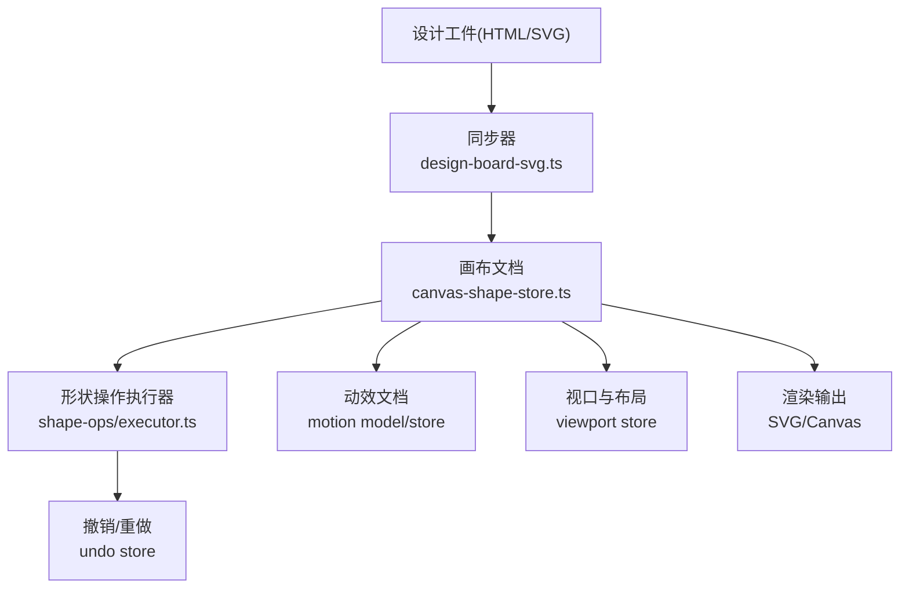
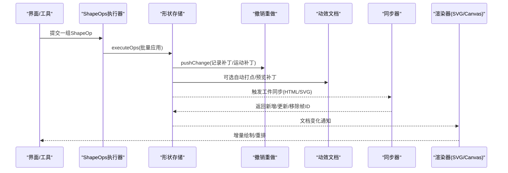
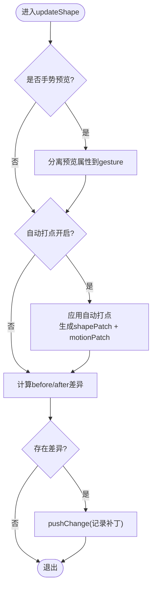
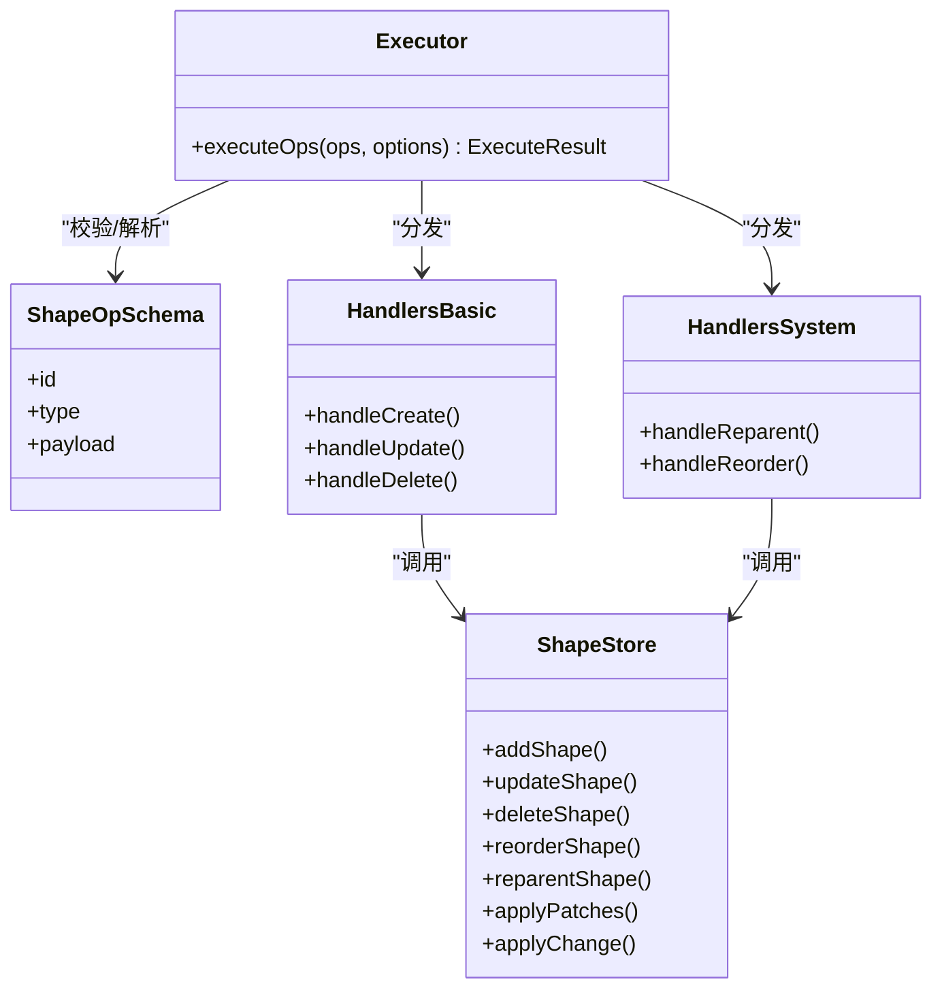
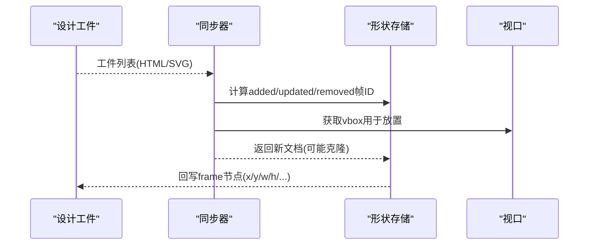
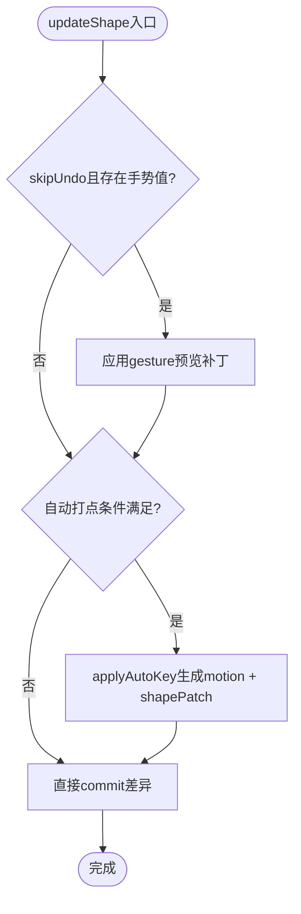
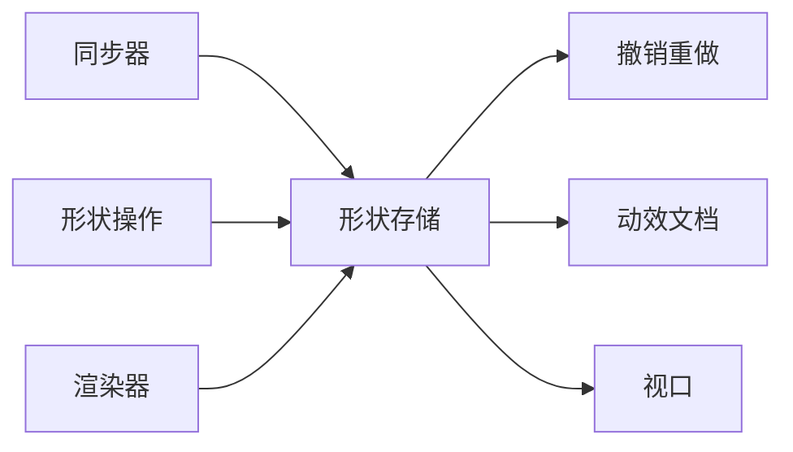

# 画布渲染引擎

<cite>
**本文引用的文件**
- [canvas-shape-store.ts](file://src/renderer/src/design/canvas/canvas-shape-store.ts)
- [design-board-svg.ts](file://src/renderer/src/design/design-board-svg.ts)
- [shape-ops.ts](file://src/renderer/src/design/canvas/shape-ops.ts)
- [executor.ts](file://src/renderer/src/design/canvas/shape-ops/executor.ts)
- [schema.ts](file://src/renderer/src/design/canvas/shape-ops/schema.ts)
- [handlers-basic.ts](file://src/renderer/src/design/canvas/shape-ops/handlers-basic.ts)
- [handlers-system.ts](file://src/renderer/src/design/canvas/shape-ops/handlers-system.ts)
- [apply-shape-ops.ts](file://src/renderer/src/design/canvas/apply-shape-ops.ts)
- [svg-artifact-lifecycle.ts](file://src/renderer/src/design/canvas/svg-artifact-lifecycle.ts)
- [svg-animation-preview-store.ts](file://src/renderer/src/design/svg/svg-animation-preview-store.ts)
- [canvas-types.ts](file://src/renderer/src/design/canvas/canvas-types.ts)
- [canvas-viewport-store.ts](file://src/renderer/src/design/canvas/canvas-viewport-store.ts)
- [canvas-motion-store.ts](file://src/renderer/src/design/motion/canvas-motion-store.ts)
- [canvas-motion-mutations.ts](file://src/renderer/src/design/motion/canvas-motion-mutations.ts)
- [model.ts](file://src/renderer/src/design/motion/model.ts)
</cite>

## 目录
1. [简介](#简介)
2. [项目结构](#项目结构)
3. [核心组件](#核心组件)
4. [架构总览](#架构总览)
5. [详细组件分析](#详细组件分析)
6. [依赖关系分析](#依赖关系分析)
7. [性能考量](#性能考量)
8. [故障排查指南](#故障排查指南)
9. [结论](#结论)
10. [附录](#附录)

## 简介
本文件面向DeepSeek-GUI的画布渲染引擎，系统性阐述图形渲染架构与实现细节。内容覆盖：
- 形状存储管理、图层树结构与绘制优化机制
- 节点绘制流程（SVG渲染、Canvas绘制、性能优化）
- 形状操作系统（变换操作、批量处理、撤销重做）
- 渲染管线设计（脏区域检测、增量更新、GPU加速）
- 自定义形状扩展机制（注册、属性绑定、事件处理）
- 渲染性能调优（内存管理、渲染频率控制、资源优化）
并提供可追溯的代码片段路径与最佳实践建议。

## 项目结构
画布渲染相关代码主要位于渲染端的设计模块中，围绕“文档-形状-动作-同步”的主线组织：
- 文档与形状：以不可变文档对象承载形状树，提供增删改查与层级重排能力
- 动作系统：通过结构化形状操作（ShapeOps）统一表达变更，支持批量执行与撤销重做
- 同步层：将外部设计工件（HTML/SVG）与画布文档进行双向同步
- 动效与预览：运动文档与关键帧管理，支持自动打点与预览
- 视口与布局：视口状态与放置策略，避免重叠并维持稳定布局

图表来源
- [design-board-svg.ts:154-285](file://src/renderer/src/design/design-board-svg.ts#L154-L285)
- [canvas-shape-store.ts:175-603](file://src/renderer/src/design/canvas/canvas-shape-store.ts#L175-L603)
- [shape-ops.ts:1-8](file://src/renderer/src/design/canvas/shape-ops.ts#L1-L8)
- [executor.ts](file://src/renderer/src/design/canvas/shape-ops/executor.ts)
- [canvas-viewport-store.ts](file://src/renderer/src/design/canvas/canvas-viewport-store.ts)
- [canvas-motion-store.ts](file://src/renderer/src/design/motion/canvas-motion-store.ts)

章节来源
- [design-board-svg.ts:1-330](file://src/renderer/src/design/design-board-svg.ts#L1-L330)
- [canvas-shape-store.ts:1-604](file://src/renderer/src/design/canvas/canvas-shape-store.ts#L1-L604)
- [shape-ops.ts:1-8](file://src/renderer/src/design/canvas/shape-ops.ts#L1-L8)

## 核心组件
- 形状存储（Canvas Shape Store）
  - 职责：维护不可变CanvasDocument，提供add/update/delete/reorder/duplicate等原子操作；集成撤销重做、运动文档同步、DOM源绑定同步
  - 关键点：补丁（Patch）驱动的状态变更；父子关系与根节点特殊处理；嵌入型框架（HTML/SVG）与普通形状的z序隔离
- 形状操作（ShapeOps）
  - 职责：定义统一的JSON操作模式，提供executeOps批量执行，封装为一次撤销单元
  - 关键点：schema约束、处理器分发（基础/系统/高级）、错误收集与结果聚合
- 同步器（Design Board SVG Sync）
  - 职责：将设计工件（HTML/SVG）与画布文档保持一对一或一对多映射；计算新增/更新/移除的帧ID集合
  - 关键点：去重、占位、避免重复同步、保留portal层顺序
- 动效与预览
  - 职责：运动文档规范化、修剪、自动打点、手势预览补丁
  - 关键点：不变性比较、引用稳定性、时间轴与活动帧联动
- 视口与布局
  - 职责：视口矩形、放置避让、尺寸归一化
  - 关键点：避免重叠、最小尺寸约束、portal层与常规层的分离

章节来源
- [canvas-shape-store.ts:175-603](file://src/renderer/src/design/canvas/canvas-shape-store.ts#L175-L603)
- [shape-ops.ts:1-8](file://src/renderer/src/design/canvas/shape-ops.ts#L1-L8)
- [design-board-svg.ts:154-285](file://src/renderer/src/design/design-board-svg.ts#L154-L285)
- [canvas-motion-store.ts](file://src/renderer/src/design/motion/canvas-motion-store.ts)
- [canvas-motion-mutations.ts](file://src/renderer/src/design/motion/canvas-motion-mutations.ts)
- [model.ts](file://src/renderer/src/design/motion/model.ts)

## 架构总览
画布渲染采用“数据驱动+不可变更新”的架构：
- 数据层：CanvasDocument（对象字典+根ID）+ CanvasMotionDocument（关键帧/轨道）
- 变更层：ShapeOps（结构化操作）→ Executor（批处理）→ UndoStore（撤销重做）
- 同步层：Artifacts ↔ Document（HTML/SVG）
- 渲染层：根据文档生成SVG/Canvas，portal层独立于主场景以保证DOM层级正确性

图表来源
- [shape-ops.ts:1-8](file://src/renderer/src/design/canvas/shape-ops.ts#L1-L8)
- [executor.ts](file://src/renderer/src/design/canvas/shape-ops/executor.ts)
- [canvas-shape-store.ts:212-340](file://src/renderer/src/design/canvas/canvas-shape-store.ts#L212-L340)
- [design-board-svg.ts:154-285](file://src/renderer/src/design/design-board-svg.ts#L154-L285)

## 详细组件分析

### 形状存储与图层树
- 数据结构
  - CanvasDocument：包含objects字典、rootId、motion引用
  - CanvasShape：类型化节点，支持frame/artifact frame/普通形状
  - 父子关系：children数组维护层级；根节点下区分常规层与portal层（HTML/SVG嵌入）
- 核心操作
  - addShape：名称唯一化、父级校验、portal层插入位置处理、记录补丁
  - updateShape：手势预览补丁分离、自动打点、差异补丁生成
  - deleteShape：递归删除子树、清理父级children、修剪运动文档
  - reorderShape：根节点下portal层与普通层分离排序，保证z序一致性
  - reparentShape：跨父移动、artifact frame限制、运动文档修剪
  - duplicateShape：深拷贝子树、重置artifact关联、追加到父级
- 撤销重做
  - 基于ShapePatch与MotionPatch的不可变快照；撤销时逆序应用补丁
  - 选择状态在撤销/重做前后恢复

图表来源
- [canvas-shape-store.ts:257-340](file://src/renderer/src/design/canvas/canvas-shape-store.ts#L257-L340)
- [canvas-motion-mutations.ts](file://src/renderer/src/design/motion/canvas-motion-mutations.ts)
- [model.ts](file://src/renderer/src/design/motion/model.ts)

章节来源
- [canvas-shape-store.ts:175-603](file://src/renderer/src/design/canvas/canvas-shape-store.ts#L175-L603)

### 形状操作系统（批量与撤销重做）
- 操作模式
  - 通过schema定义ShapeOp，确保AI Rail或工具链生成的变更具备一致性与可执行性
  - executor负责解析、分发至具体处理器（基础/系统/高级），聚合错误与结果
- 批处理与事务
  - 单次executeOps包裹多个ShapeOp，作为一次撤销单元
  - 内部调用store的add/update/delete/reorder等方法，累积patches
- 撤销重做
  - undo/redo通过applyPatches/applyChange对document进行反向/正向应用
  - 支持selectionBefore/After恢复选择状态

图表来源
- [shape-ops.ts:1-8](file://src/renderer/src/design/canvas/shape-ops.ts#L1-L8)
- [schema.ts](file://src/renderer/src/design/canvas/shape-ops/schema.ts)
- [executor.ts](file://src/renderer/src/design/canvas/shape-ops/executor.ts)
- [handlers-basic.ts](file://src/renderer/src/design/canvas/shape-ops/handlers-basic.ts)
- [handlers-system.ts](file://src/renderer/src/design/canvas/shape-ops/handlers-system.ts)
- [canvas-shape-store.ts:212-603](file://src/renderer/src/design/canvas/canvas-shape-store.ts#L212-L603)

章节来源
- [shape-ops.ts:1-8](file://src/renderer/src/design/canvas/shape-ops.ts#L1-L8)
- [executor.ts](file://src/renderer/src/design/canvas/shape-ops/executor.ts)
- [handlers-basic.ts](file://src/renderer/src/design/canvas/shape-ops/handlers-basic.ts)
- [handlers-system.ts](file://src/renderer/src/design/canvas/shape-ops/handlers-system.ts)
- [canvas-shape-store.ts:212-603](file://src/renderer/src/design/canvas/canvas-shape-store.ts#L212-L603)

### 同步器（HTML/SVG与画布文档）
- HTML同步
  - 将HTML工件与画布中的frame进行映射，处理新增/更新/移除
  - 维护portal层顺序，确保DOM渲染层级正确
- SVG同步
  - 将SVG工件与画布中的frame进行一对一映射
  - 当工件消失时，移除对应frame及其子树；当工件出现时，创建默认尺寸frame并放置到视口空闲区域
- 双向同步
  - 从画布回写frame节点信息到工件node（x/y/width/height/sizeMode/boardHidden）
  - 避免无意义写入（近似矩形比较、状态相同则跳过）

图表来源
- [design-board-svg.ts:154-285](file://src/renderer/src/design/design-board-svg.ts#L154-L285)
- [design-board-svg.ts:291-329](file://src/renderer/src/design/design-board-svg.ts#L291-L329)
- [canvas-viewport-store.ts](file://src/renderer/src/design/canvas/canvas-viewport-store.ts)

章节来源
- [design-board-svg.ts:1-330](file://src/renderer/src/design/design-board-svg.ts#L1-L330)

### 动效与预览（自动打点与手势预览）
- 自动打点
  - 在自动打点开启且当前处于活动帧时，updateShape会调用applyAutoKey生成关键帧与形状补丁
  - 运动文档经normalize/prune后保持规范与精简
- 手势预览
  - 拖拽/缩放过程中，将x/y/rotation/opacity等属性分离为gesture预览补丁，不立即落盘
  - 使用preserveMotionReferenceWhenUnchanged保持引用稳定，减少无效重绘
- 预览播放
  - 通过动画预览store驱动时间轴与帧切换，结合文档状态渲染

图表来源
- [canvas-shape-store.ts:257-340](file://src/renderer/src/design/canvas/canvas-shape-store.ts#L257-L340)
- [canvas-motion-mutations.ts](file://src/renderer/src/design/motion/canvas-motion-mutations.ts)
- [model.ts](file://src/renderer/src/design/motion/model.ts)
- [svg-animation-preview-store.ts](file://src/renderer/src/design/svg/svg-animation-preview-store.ts)

章节来源
- [canvas-shape-store.ts:257-340](file://src/renderer/src/design/canvas/canvas-shape-store.ts#L257-L340)
- [svg-animation-preview-store.ts](file://src/renderer/src/design/svg/svg-animation-preview-store.ts)

### 渲染管线（脏区域、增量更新、GPU加速）
- 脏区域检测
  - 通过补丁粒度识别受影响形状与父级，仅标记相关区域为脏
  - portal层与普通层分离，避免不必要的重排
- 增量更新
  - 基于document.objects的不可变更新，配合React/Virtual DOM或Canvas diff策略，只重绘变化节点
  - 同步器返回的added/updated/removed帧ID用于精确刷新
- GPU加速
  - 对于大量形状，优先使用transform/opacity等合成属性，减少重排重绘
  - 将静态背景与动态前景分层，降低每帧开销

[本节为概念性说明，不直接分析具体文件]

## 依赖关系分析
- 内聚与耦合
  - 形状存储与撤销重做高内聚，通过补丁接口解耦上层操作
  - 同步器与工件模块松耦合，通过ID与版本标识进行匹配
  - 动效模块与形状存储通过运动文档接口交互，避免直接依赖
- 循环依赖
  - 通过类型与接口拆分（如schema、types）避免循环导入
- 外部依赖
  - 视口、选择、动效等store通过共享状态协作，需保证状态一致性

图表来源
- [canvas-shape-store.ts:175-603](file://src/renderer/src/design/canvas/canvas-shape-store.ts#L175-L603)
- [design-board-svg.ts:154-285](file://src/renderer/src/design/design-board-svg.ts#L154-L285)
- [shape-ops.ts:1-8](file://src/renderer/src/design/canvas/shape-ops.ts#L1-L8)

章节来源
- [canvas-shape-store.ts:175-603](file://src/renderer/src/design/canvas/canvas-shape-store.ts#L175-L603)
- [design-board-svg.ts:154-285](file://src/renderer/src/design/design-board-svg.ts#L154-L285)
- [shape-ops.ts:1-8](file://src/renderer/src/design/canvas/shape-ops.ts#L1-L8)

## 性能考量
- 内存管理
  - 使用不可变数据结构，避免深层复制；仅在必要时cloneDocument
  - 及时修剪运动文档（prune），移除无用关键帧与轨道
  - portal层与普通层分离，减少DOM层级复杂度
- 渲染频率控制
  - 手势预览阶段不写入持久状态，减少撤销栈膨胀
  - 自动打点仅在活动帧与有效条件下触发，避免多余关键帧
  - 增量更新基于补丁与帧ID集合，避免全量重绘
- 资源优化
  - 工件同步时跳过无变更写入（近似矩形比较）
  - 合理设置最小尺寸与占位，避免过小元素导致频繁重排
  - 利用transform/opacity等合成属性提升GPU利用率

[本节提供通用指导，不直接分析具体文件]

## 故障排查指南
- 常见问题
  - 形状未显示：检查是否为artifact frame且portal层顺序是否正确
  - 同步异常：确认工件ID与版本标识匹配，避免历史版本冲突
  - 撤销失效：确认补丁生成逻辑与撤销栈顺序一致
  - 动效卡顿：检查自动打点条件与预览补丁是否过多
- 定位步骤
  - 查看同步器返回的added/updated/removed帧ID，确认变更范围
  - 检查undo store中的patches与motionPatch，确认撤销/重做路径
  - 验证视口vbox与放置算法，避免重叠导致的布局抖动

章节来源
- [design-board-svg.ts:154-285](file://src/renderer/src/design/design-board-svg.ts#L154-L285)
- [canvas-shape-store.ts:550-603](file://src/renderer/src/design/canvas/canvas-shape-store.ts#L550-L603)

## 结论
本渲染引擎以不可变文档与补丁驱动的变更模型为核心，结合形状操作系统的批处理与撤销重做能力，实现了高效、可扩展的画布渲染。通过同步器将设计工件与画布文档保持一致，动效模块提供灵活的动画与预览体验。遵循本文的性能与最佳实践建议，可在大规模场景下保持稳定流畅的交互。

## 附录
- 代码片段路径参考
  - 形状存储核心方法：[canvas-shape-store.ts:212-603](file://src/renderer/src/design/canvas/canvas-shape-store.ts#L212-L603)
  - 形状操作接口与执行：[shape-ops.ts:1-8](file://src/renderer/src/design/canvas/shape-ops.ts#L1-L8)、[executor.ts](file://src/renderer/src/design/canvas/shape-ops/executor.ts)
  - 同步器逻辑：[design-board-svg.ts:154-285](file://src/renderer/src/design/design-board-svg.ts#L154-L285)、[design-board-svg.ts:291-329](file://src/renderer/src/design/design-board-svg.ts#L291-L329)
  - 动效与预览：[canvas-motion-mutations.ts](file://src/renderer/src/design/motion/canvas-motion-mutations.ts)、[svg-animation-preview-store.ts](file://src/renderer/src/design/svg/svg-animation-preview-store.ts)
- 最佳实践
  - 使用ShapeOps统一表达变更，便于审计与回放
  - 谨慎使用deep clone，优先局部补丁更新
  - 利用portal层隔离DOM渲染，避免z序问题
  - 在高频交互中使用手势预览，减少状态抖动
  - 定期修剪运动文档，保持关键帧精简