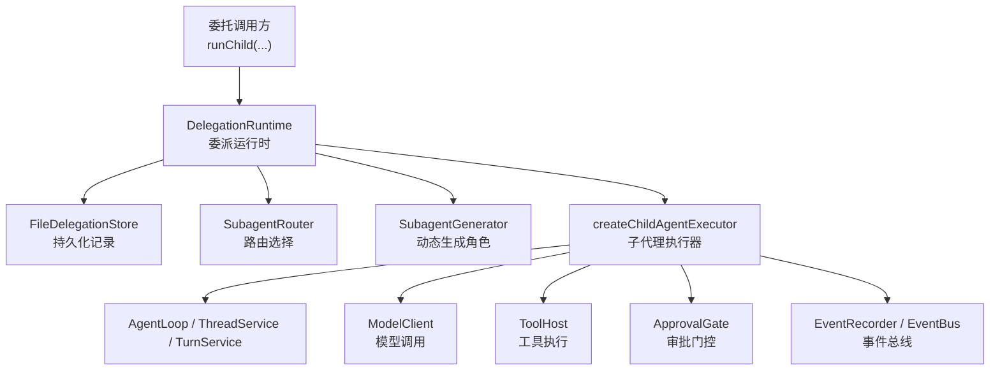
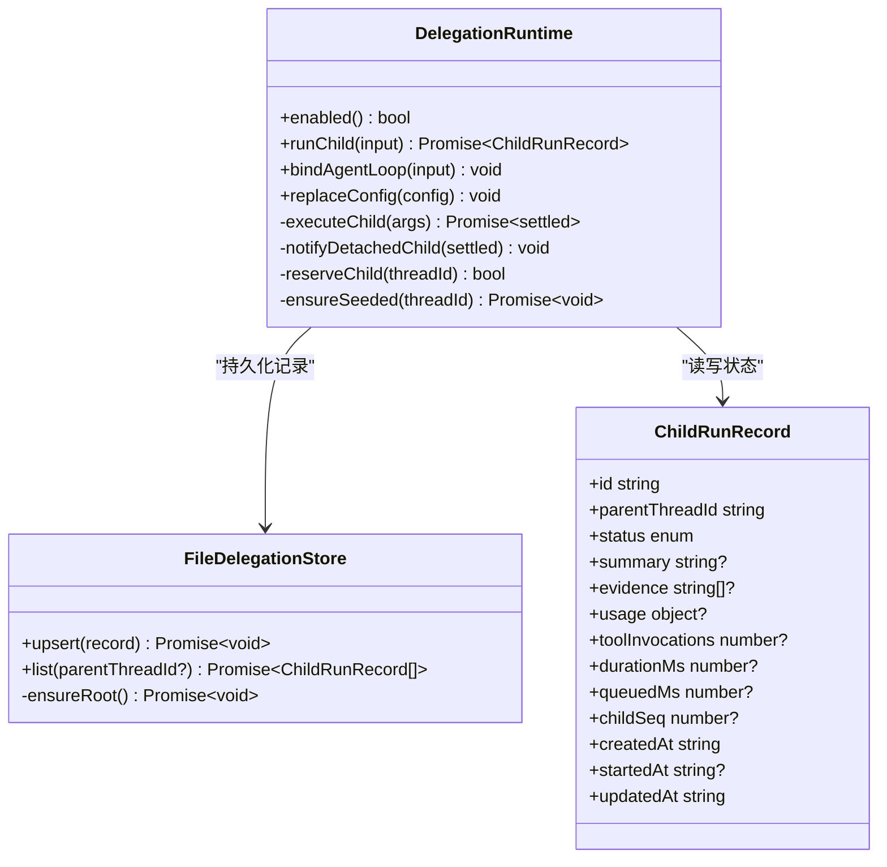
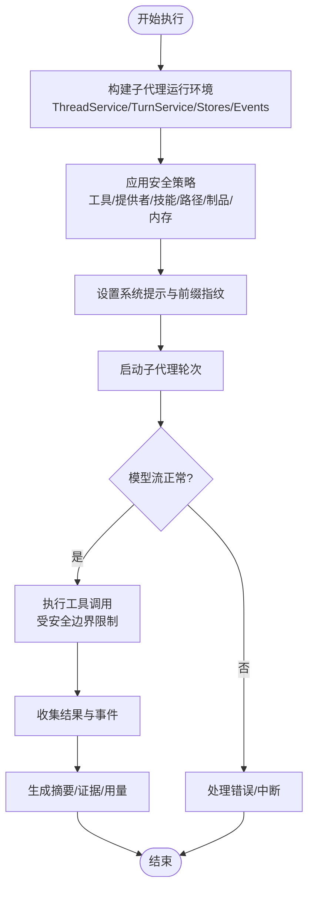
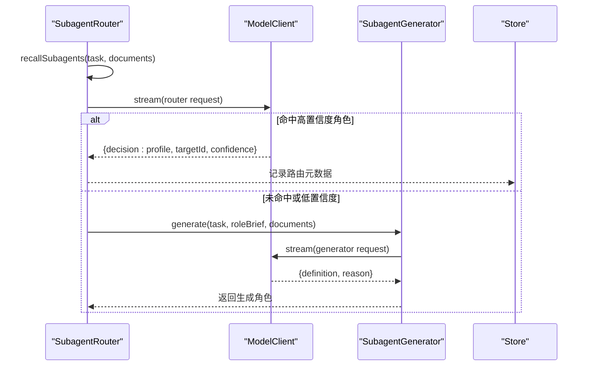
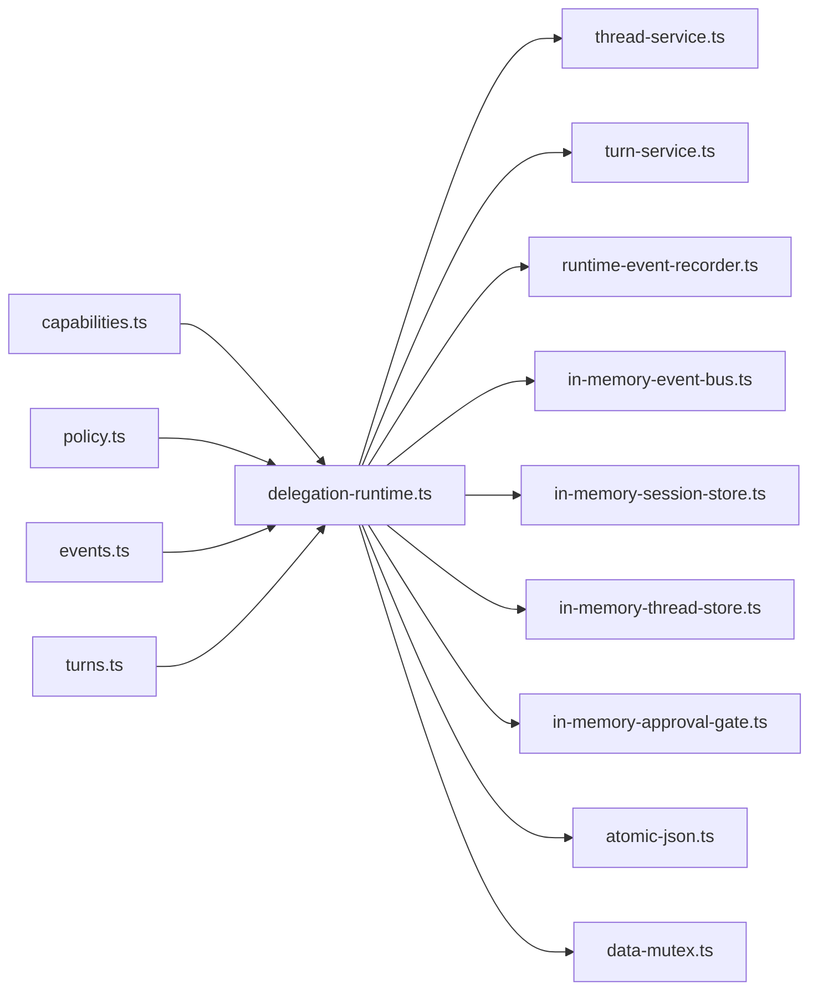

# 子代理委派

<cite>
**本文引用的文件**
- [delegation-runtime.ts](file://kun/src/delegation/delegation-runtime.ts)
- [child-agent-executor.ts](file://kun/src/delegation/child-agent-executor.ts)
- [subagent-router.ts](file://kun/src/delegation/subagent-router.ts)
- [subagent-generator.ts](file://kun/src/delegation/subagent-generator.ts)
- [builtin-profiles.ts](file://kun/src/delegation/builtin-profiles.ts)
- [builtin-agent-catalog.ts](file://kun/src/delegation/builtin-agent-catalog.ts)
- [capabilities.ts](file://kun/src/contracts/capabilities.ts)
- [policy.ts](file://kun/src/contracts/policy.ts)
- [events.ts](file://kun/src/contracts/events.ts)
- [turns.ts](file://kun/src/contracts/turns.ts)
- [model-client.ts](file://kun/src/ports/model-client.ts)
- [thread-service.ts](file://kun/src/services/thread-service.ts)
- [turn-service.ts](file://kun/src/services/turn-service.ts)
- [runtime-event-recorder.ts](file://kun/src/services/runtime-event-recorder.ts)
- [in-memory-event-bus.ts](file://kun/src/adapters/in-memory-event-bus.ts)
- [in-memory-session-store.ts](file://kun/src/adapters/in-memory-session-store.ts)
- [in-memory-thread-store.ts](file://kun/src/adapters/in-memory-thread-store.ts)
- [in-memory-approval-gate.ts](file://kun/src/adapters/in-memory-approval-gate.ts)
- [atomic-json.ts](file://kun/src/extensions/atomic-json.ts)
- [data-mutex.ts](file://kun/src/manager/data-mutex.ts)
- [child-agent-executor.test.ts](file://kun/src/delegation/child-agent-executor.test.ts)
- [delegation-runtime.test.ts](file://kun/src/delegation/delegation-runtime.test.ts)
</cite>

## 目录
1. [简介](#简介)
2. [项目结构](#项目结构)
3. [核心组件](#核心组件)
4. [架构总览](#架构总览)
5. [详细组件分析](#详细组件分析)
6. [依赖关系分析](#依赖关系分析)
7. [性能与并发特性](#性能与并发特性)
8. [故障排查指南](#故障排查指南)
9. [结论](#结论)
10. [附录：开发指南与最佳实践](#附录：开发指南与最佳实践)

## 简介
本文件系统性阐述 DeepSeek-GUI（Kun）中“子代理委派”机制，覆盖子代理生命周期、任务拆分与路由、权限与安全隔离、结果聚合、通信协议、以及开发与优化建议。该机制允许主代理将复杂任务拆分为可并行执行的子代理，并在受限环境中安全执行，最终汇总结果返回给调用方。

## 项目结构
子代理委派相关代码集中在 `kun/src/delegation` 目录，围绕以下职责划分：
- 委派运行时：负责子代理的创建、调度、持久化、生命周期回调与并发控制。
- 子代理执行器：封装一个子代理的完整运行环境，包括线程、会话、审批、模型调用、工具访问等。
- 路由与生成：根据任务描述自动选择或生成合适的子代理角色，并决定能力边界。
- 内置角色与目录：提供开箱即用的子代理角色定义与元数据。
- 契约与端口：统一的能力、策略、事件、模型调用接口。



**图表来源**
- [delegation-runtime.ts:333-780](file://kun/src/delegation/delegation-runtime.ts#L333-L780)
- [child-agent-executor.ts:111-407](file://kun/src/delegation/child-agent-executor.ts#L111-L407)
- [subagent-router.ts:140-200](file://kun/src/delegation/subagent-router.ts#L140-L200)
- [subagent-generator.ts:42-129](file://kun/src/delegation/subagent-generator.ts#L42-L129)

**章节来源**
- [delegation-runtime.ts:333-780](file://kun/src/delegation/delegation-runtime.ts#L333-L780)
- [child-agent-executor.ts:111-407](file://kun/src/delegation/child-agent-executor.ts#L111-L407)
- [subagent-router.ts:140-200](file://kun/src/delegation/subagent-router.ts#L140-L200)
- [subagent-generator.ts:42-129](file://kun/src/delegation/subagent-generator.ts#L42-L129)

## 核心组件
- DelegationRuntime：委派运行时，负责子代理的编排、状态持久化、并发限制、前台/后台执行模式、生命周期回调、取消传播。
- ChildRunExecutor：子代理执行器工厂，构造独立的 AgentLoop、ThreadService、TurnService、事件与存储，注入安全边界与能力裁剪。
- SubagentRouter：基于 BM25 召回与 LLM 决策的子代理路由，支持“选择已有角色”或“生成临时角色”。
- SubagentGenerator：在路由失败或需要时，通过 LLM 生成一次性子代理角色定义，并强制安全约束。
- 内置角色与目录：提供通用、探索、设计审查、代码审查、测试工程师等角色，以及产品级分类与检索词。

**章节来源**
- [delegation-runtime.ts:333-780](file://kun/src/delegation/delegation-runtime.ts#L333-L780)
- [child-agent-executor.ts:111-407](file://kun/src/delegation/child-agent-executor.ts#L111-L407)
- [subagent-router.ts:140-200](file://kun/src/delegation/subagent-router.ts#L140-L200)
- [subagent-generator.ts:42-129](file://kun/src/delegation/subagent-generator.ts#L42-L129)
- [builtin-profiles.ts:24-186](file://kun/src/delegation/builtin-profiles.ts#L24-L186)
- [builtin-agent-catalog.ts:34-343](file://kun/src/delegation/builtin-agent-catalog.ts#L34-L343)

## 架构总览
子代理委派的核心流程如下：
1. 委托入口：调用 `DelegationRuntime.runChild(...)`，传入父线程/轮次、提示词、工作空间、模型/提供者、安全快照、是否分离执行等。
2. 配置与角色解析：合并内置/用户/工作区角色，校验表面可用性，计算工具策略、系统提示、推理深度与服务等级。
3. 路由与生成：优先尝试匹配已有角色；若置信度不足或无合适角色，则调用生成器产出一次性角色。
4. 资源预留与持久化：为每线程保留并发槽位，写入 `queued` 状态的运行记录，触发 `onQueued` 回调。
5. 执行：前台模式等待完成；后台模式独立信号继续执行，支持 GUI 取消。
6. 监控与事件：通过事件记录器与事件总线，将子代理会话流式输出到 UI，并持久化。
7. 结果聚合：完成后汇总摘要、证据、用量、工具调用次数、前缀复用情况等。

```mermaid
sequenceDiagram
participant Caller as "调用方"
participant Runtime as "DelegationRuntime"
participant Router as "SubagentRouter"
participant Gen as "SubagentGenerator"
participant Exec as "ChildAgentExecutor"
participant Loop as "AgentLoop"
participant Model as "ModelClient"
participant Tools as "ToolHost"
participant Store as "FileDelegationStore"
Caller->>Runtime : runChild({prompt, security, detach, ...})
Runtime->>Store : upsert(queued record)
Runtime->>Router : route(task, documents, surface)
alt 命中已有角色
Router-->>Runtime : {profileId, confidence}
else 未命中或低置信度
Runtime->>Gen : generate(task, roleBrief, documents)
Gen-->>Runtime : {definition, reason}
end
Runtime->>Exec : createChildAgentExecutor(options)
Exec->>Loop : startTurn + runTurn
Loop->>Model : stream(request)
Loop->>Tools : tool calls (受安全边界限制)
Loop-->>Exec : outcome
Exec-->>Runtime : summary/evidence/usage
Runtime-->>Caller : record or settled result
```

**图表来源**
- [delegation-runtime.ts:390-780](file://kun/src/delegation/delegation-runtime.ts#L390-L780)
- [subagent-router.ts:153-200](file://kun/src/delegation/subagent-router.ts#L153-L200)
- [subagent-generator.ts:55-129](file://kun/src/delegation/subagent-generator.ts#L55-L129)
- [child-agent-executor.ts:111-407](file://kun/src/delegation/child-agent-executor.ts#L111-L407)

## 详细组件分析

### 委派运行时 DelegationRuntime
- 职责：
  - 解析并合并角色配置（内置/用户/工作区），校验表面可用性。
  - 计算工具策略、系统提示、推理深度、服务等级，并应用父级安全快照。
  - 维护每线程并发计数与队列，保证不超过上限。
  - 管理前台与后台（detach）两种执行模式，支持独立取消。
  - 持久化子代理运行记录，暴露生命周期回调（onStart/onQueued/onRunning）。
  - 提供取消与清理方法（abortChild、abortDetachedChildrenForThread）。
- 关键数据结构：
  - ChildRunRecord：包含模型、提供者、账户、推理深度、服务等级、角色快照、安全快照、工具策略、审批策略、沙箱模式、状态、摘要、证据、用量、时长、序列号等。
  - ChildSecuritySnapshot：限定模型/提供者/工具/技能/路径/制品等白名单与黑名单。
  - ChildRoutingMetadata：记录路由方法、候选、置信度、原因、自定义角色片段等。
- 并发与隔离：
  - 使用内存计数器与文件原子写入保障并发安全。
  - 前台子代理与父信号联动；后台子代理拥有独立 AbortController，不受父信号影响。
  - 每线程子代理数量限制，避免资源耗尽。



**图表来源**
- [delegation-runtime.ts:271-307](file://kun/src/delegation/delegation-runtime.ts#L271-L307)
- [delegation-runtime.ts:126-192](file://kun/src/delegation/delegation-runtime.ts#L126-L192)
- [delegation-runtime.ts:333-780](file://kun/src/delegation/delegation-runtime.ts#L333-L780)

**章节来源**
- [delegation-runtime.ts:126-192](file://kun/src/delegation/delegation-runtime.ts#L126-L192)
- [delegation-runtime.ts:271-307](file://kun/src/delegation/delegation-runtime.ts#L271-L307)
- [delegation-runtime.ts:333-780](file://kun/src/delegation/delegation-runtime.ts#L333-L780)

### 子代理执行器 ChildAgentExecutor
- 职责：
  - 构建子代理运行环境：ThreadService、TurnService、SessionStore、ThreadStore、事件记录器、上下文压缩器、令牌经济等。
  - 注入安全边界：只读工具集、禁止的工具/提供者/技能、读写路径限制、制品 ID 限制、内存开关。
  - 设置系统提示与前缀缓存指纹，确保缓存命中与跨代理隔离。
  - 启动子代理轮次，绑定父级取消信号，处理中断与异常。
  - 汇总结果：摘要、证据、用量、工具调用次数、前缀复用情况。
- 错误处理：
  - 非致命工具错误以 warning 级别记录，不标记子代理失败。
  - 致命错误从事件中提取并抛出。
  - 支持审批门控：当子代理请求工具调用需审批时，挂起直至决策。
- 隔离与持久化：
  - 可选共享主运行时的事件总线与存储，使子代理会话可查询并可流式展示。
  - 测试场景下回退到内存存储，保持完全隔离。



**图表来源**
- [child-agent-executor.ts:111-407](file://kun/src/delegation/child-agent-executor.ts#L111-L407)

**章节来源**
- [child-agent-executor.ts:111-407](file://kun/src/delegation/child-agent-executor.ts#L111-L407)

### 路由与生成 SubagentRouter & SubagentGenerator
- 路由：
  - 使用 BM25 召回候选角色，结合 LLM 决策选择“已有角色”或“生成新角色”。
  - 支持置信度阈值与降级策略，超时或不可用时回退到确定性方案。
  - 记录路由元数据与方法，便于诊断与复现。
- 生成：
  - 通过系统提示约束生成一次性角色，强制禁止递归委派与危险操作。
  - 严格校验 JSON 结构，失败时回退到安全默认角色。
  - 支持参考示例选择与截断，控制输入长度与成本。



**图表来源**
- [subagent-router.ts:140-200](file://kun/src/delegation/subagent-router.ts#L140-L200)
- [subagent-generator.ts:55-129](file://kun/src/delegation/subagent-generator.ts#L55-L129)

**章节来源**
- [subagent-router.ts:140-200](file://kun/src/delegation/subagent-router.ts#L140-L200)
- [subagent-generator.ts:55-129](file://kun/src/delegation/subagent-generator.ts#L55-L129)

### 内置角色与目录
- 内置角色：通用代理、探索代理、组件交互设计、设计审查、过度设计审查等。
- 目录：按类别（开发、审查、质量、规划、运维、研究）与家族（base/skill/write/design）组织，提供检索词与推荐表面。
- 作用：为路由与生成提供参考，确保一致的产品体验与能力边界。

**章节来源**
- [builtin-profiles.ts:24-186](file://kun/src/delegation/builtin-profiles.ts#L24-L186)
- [builtin-agent-catalog.ts:34-343](file://kun/src/delegation/builtin-agent-catalog.ts#L34-L343)

## 依赖关系分析
- 能力契约：
  - capabilities.ts 定义了模型能力、MCP 服务器、浏览器使用、图像/语音/视频生成等能力状态。
  - policy.ts 定义了审批策略与沙箱模式。
  - events.ts 定义了子代理活动事件类型。
  - turns.ts 定义了客户端表面与轮次上下文。
- 运行时服务：
  - thread-service.ts 与 turn-service.ts 提供线程与轮次管理。
  - runtime-event-recorder.ts 与 in-memory-event-bus.ts 提供事件录制与总线。
  - in-memory-session-store.ts 与 in-memory-thread-store.ts 提供内存存储。
  - in-memory-approval-gate.ts 提供审批门控。
- 持久化：
  - atomic-json.ts 与 data-mutex.ts 提供原子写入与互斥锁，确保并发安全。



**图表来源**
- [capabilities.ts:800-997](file://kun/src/contracts/capabilities.ts#L800-L997)
- [delegation-runtime.ts:333-780](file://kun/src/delegation/delegation-runtime.ts#L333-L780)

**章节来源**
- [capabilities.ts:800-997](file://kun/src/contracts/capabilities.ts#L800-L997)
- [delegation-runtime.ts:333-780](file://kun/src/delegation/delegation-runtime.ts#L333-L780)

## 性能与并发特性
- 并发控制：
  - 每线程子代理数量限制，防止资源耗尽。
  - 前台与后台模式分离，后台子代理独立信号，不影响父进程。
- 缓存与复用：
  - 前缀指纹用于提示缓存命中，减少重复计算。
  - 上下文压缩器与令牌经济降低长对话成本。
- 流式与异步：
  - 模型调用采用流式接口，支持中断与超时。
  - 事件总线支持实时 UI 更新与持久化。
- 优化建议：
  - 合理设置路由超时与置信度阈值，避免过长决策时间。
  - 使用只读角色进行分析与审查，减少写操作开销。
  - 利用服务等级（priority/flex）与推理深度平衡速度与质量。
  - 批量任务拆分时，尽量并行且相互独立，提高吞吐。

[本节为通用指导，无需具体文件引用]

## 故障排查指南
- 常见问题：
  - 子代理被意外中止：检查父信号与取消桥接逻辑，确认前台/后台模式是否正确。
  - 审批卡住：查看审批门控状态，确认是否有待决请求与超时。
  - 路由失败：检查候选角色与检索词，必要时启用生成器。
  - 权限拒绝：核对安全快照中的白名单/黑名单，确保子代理仅具备必要能力。
- 调试手段：
  - 使用事件记录器与事件总线观察子代理会话流。
  - 检查 FileDelegationStore 中的运行记录，定位状态与错误信息。
  - 通过测试用例验证行为，如中止、审批、分离执行等。

**章节来源**
- [child-agent-executor.test.ts:64-188](file://kun/src/delegation/child-agent-executor.test.ts#L64-L188)
- [delegation-runtime.test.ts:51-184](file://kun/src/delegation/delegation-runtime.test.ts#L51-L184)

## 结论
DeepSeek-GUI 的子代理委派机制提供了强大的任务拆分与并行执行能力，同时通过严格的权限与安全隔离确保子代理在受限环境中安全运行。路由与生成机制使得系统能够自适应不同任务需求，而事件与持久化支持完整的可观测性与可追溯性。通过合理的并发控制与性能优化，系统能够在复杂工作流中保持稳定与高效。

[本节为总结，无需具体文件引用]

## 附录：开发指南与最佳实践
- 接口规范：
  - 使用 `DelegationRuntime.runChild` 发起委派，明确传入安全快照、工具策略、推理深度与服务等级。
  - 实现 `ChildRunExecutor` 以定制子代理执行逻辑，遵循安全边界与事件规范。
- 错误处理：
  - 区分致命与非致命错误，记录事件而非直接失败。
  - 处理审批超时与中断，确保资源释放。
- 资源管理：
  - 合理使用内存与磁盘存储，避免泄漏。
  - 使用原子写入与互斥锁保护共享数据。
- 实际委派场景：
  - 代码审查：使用只读角色，限制工具与路径，快速反馈问题。
  - 多步骤实现：使用通用代理，继承工具权限，并行执行独立子任务。
  - 设计与原型：使用组件交互设计角色，限定文件写入范围。
- 性能优化建议：
  - 选择合适的路由策略与生成器超时。
  - 利用前缀缓存与上下文压缩减少成本。
  - 合理设置并发限制与服务等级，平衡速度与质量。

[本节为通用指导，无需具体文件引用]