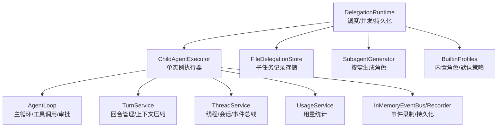
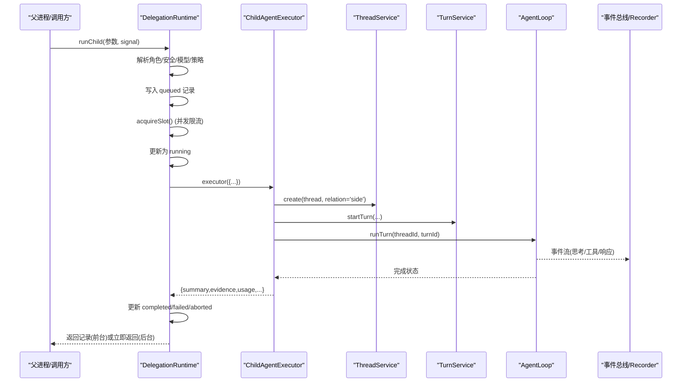
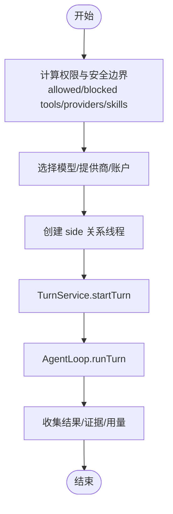
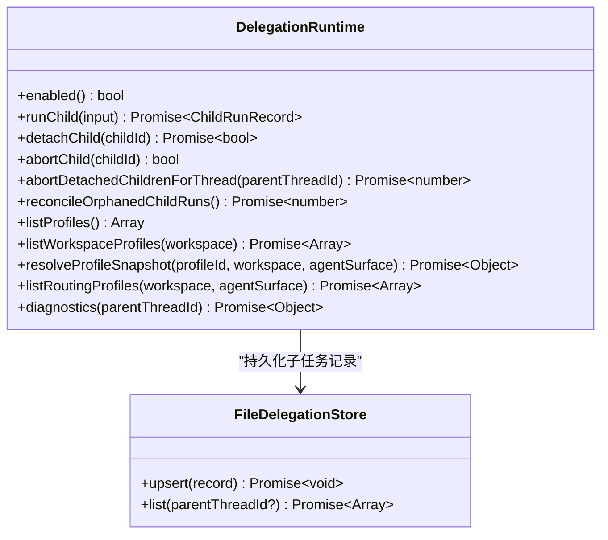
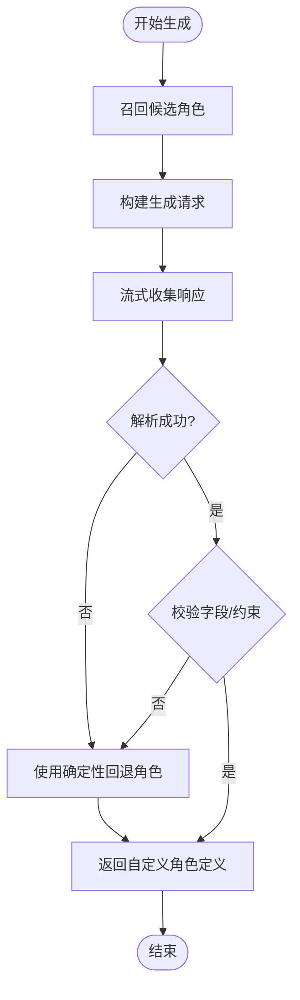
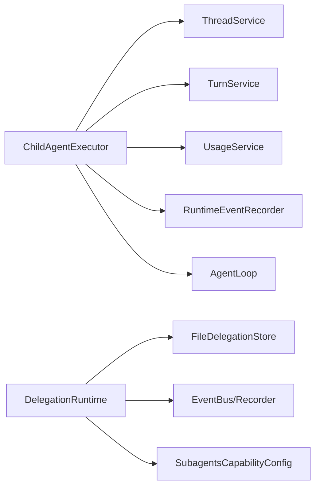

# 子代理执行器

<cite>
**本文引用的文件**
- [child-agent-executor.ts](file://kun/src/delegation/child-agent-executor.ts)
- [delegation-runtime.ts](file://kun/src/delegation/delegation-runtime.ts)
- [subagent-generator.ts](file://kun/src/delegation/subagent-generator.ts)
- [builtin-profiles.ts](file://kun/src/delegation/builtin-profiles.ts)
</cite>

## 目录
1. [简介](#简介)
2. [项目结构](#项目结构)
3. [核心组件](#核心组件)
4. [架构总览](#架构总览)
5. [详细组件分析](#详细组件分析)
6. [依赖关系分析](#依赖关系分析)
7. [性能与资源限制](#性能与资源限制)
8. [故障排查指南](#故障排查指南)
9. [结论](#结论)
10. [附录：配置选项与使用示例](#附录配置选项与使用示例)

## 简介
本文件面向 DeepSeek-GUI 的子代理执行器，聚焦 ChildAgentExecutor 的职责、初始化流程、线程与会话隔离、监控与错误处理、结果聚合策略，以及安全策略、性能调优与资源限制等实践。文档以代码级为依据，提供可视化图示与可追溯的“章节来源”，帮助读者从高层到细节逐步理解子代理的执行全生命周期。

## 项目结构
子代理执行相关代码集中在 delegation 模块，核心由以下文件组成：
- child-agent-executor.ts：创建并运行单个子代理实例，封装 AgentLoop、TurnService、ThreadService、事件记录、权限与安全边界、工具访问控制、模型选择、会话持久化等。
- delegation-runtime.ts：调度与编排多个子代理（并发限流、队列、前台/后台模式、状态持久化、活动状态投影、回收孤儿任务、统计聚合）。
- subagent-generator.ts：在需要时生成一次性自定义角色（含超时、回退策略、用法统计）。
- builtin-profiles.ts：内置子代理角色定义（只读审查、通用代理、探索代理、组件设计器等），供路由与默认选择使用。

图表来源
- [delegation-runtime.ts:333-373](file://kun/src/delegation/delegation-runtime.ts#L333-L373)
- [child-agent-executor.ts:111-274](file://kun/src/delegation/child-agent-executor.ts#L111-L274)
- [delegation-runtime.ts:271-307](file://kun/src/delegation/delegation-runtime.ts#L271-L307)
- [subagent-generator.ts:42-129](file://kun/src/delegation/subagent-generator.ts#L42-L129)
- [builtin-profiles.ts:136-185](file://kun/src/delegation/builtin-profiles.ts#L136-L185)

章节来源
- [child-agent-executor.ts:1-109](file://kun/src/delegation/child-agent-executor.ts#L1-L109)
- [delegation-runtime.ts:333-373](file://kun/src/delegation/delegation-runtime.ts#L333-L373)

## 核心组件
- ChildAgentExecutor：负责创建子代理实例、装配权限与安全边界、选择模型与提供商、建立会话与线程、启动 AgentLoop 执行回合、监听父进程中断信号、汇总结果与证据、上报用量。
- DelegationRuntime：负责子代理的排队与并发控制、前台/后台模式切换、状态持久化、活动状态投影、孤儿任务恢复、统计聚合、生命周期回调。
- SubagentGenerator：根据任务描述与参考角色，生成一次性自定义角色；具备超时与回退机制，并记录用量。
- BuiltinProfiles：提供内置角色（general、explore、design-reviewer 等）及合并策略，作为默认或路由目标。

章节来源
- [child-agent-executor.ts:111-407](file://kun/src/delegation/child-agent-executor.ts#L111-L407)
- [delegation-runtime.ts:333-1344](file://kun/src/delegation/delegation-runtime.ts#L333-L1344)
- [subagent-generator.ts:42-129](file://kun/src/delegation/subagent-generator.ts#L42-L129)
- [builtin-profiles.ts:136-185](file://kun/src/delegation/builtin-profiles.ts#L136-L185)

## 架构总览
子代理执行的整体流程如下：
- 上层通过 DelegationRuntime.runChild 发起子代理请求，解析角色、安全边界、模型与提供商、审批策略等，并写入持久化记录（queued）。
- 进入 executeChild 后，按并发限制获取执行槽位，更新状态为 running，订阅事件总线以投影活动状态。
- 调用 ChildAgentExecutor 创建子代理实例，构造 Thread/Turn/Session/Events/Usage 等运行时环境，注入权限与安全白名单/黑名单，构建系统提示词与模型选择。
- 通过 TurnService.startTurn 启动回合，随后调用 AgentLoop.runTurn 执行。期间支持父信号中断、超时控制、审批与用户输入门控。
- 执行完成后，收集结果、证据、用量、工具调用次数、前缀复用情况，更新持久化记录（completed/failed/aborted），并通过事件总线通知 UI。

图表来源
- [delegation-runtime.ts:390-780](file://kun/src/delegation/delegation-runtime.ts#L390-L780)
- [delegation-runtime.ts:789-912](file://kun/src/delegation/delegation-runtime.ts#L789-L912)
- [child-agent-executor.ts:111-407](file://kun/src/delegation/child-agent-executor.ts#L111-L407)

## 详细组件分析

### ChildAgentExecutor：职责与初始化
- 职责
  - 创建子代理实例：组装 ThreadService、TurnService、SessionStore、ThreadStore、RuntimeEventRecorder、UsageService、InflightTracker、SteeringQueue、ContextCompactor 等。
  - 权限与安全：计算 forcedAllowedToolNames（readOnly 模式强制只读工具集）、合并 blockedTools/MCP 服务器/Skills，限制 provider/skill/artifact 访问范围。
  - 模型与提供商：选择 model/providerId/accountId，必要时校验 serviceTier 能力。
  - 会话与线程：创建 side 关系的子线程，隐藏于默认列表但可单独打开；设置 parentThreadId 与 title。
  - 执行与监控：启动 TurnService.startTurn，绑定父 AbortSignal 的中断桥接，禁用 AgentLoop 的墙钟超时，启用 toolStorm/toolArgumentRepair 等运行时优化。
  - 结果聚合：读取 session 事件与 items，提取 summary/evidence/usage/toolInvocations/prefixReused/inheritedHistoryItems。

- 初始化关键点
  - 权限策略：toolPolicy 为 readOnly 时强制只读工具集合；allowedTools/security.allowedToolNames 取交集；blockedTools/security.blockedToolNames 合并去重。
  - 工具访问控制：blockedMcpServers 映射为 mcp:serverId；blockedSkills 阻止技能发现/加载。
  - 模型提供商选择：优先 profile 指定，否则继承父会话选择；providerId 为空时使用运行时默认。
  - 会话隔离：当未提供外部 SessionStore/ThreadStore/Events 时，使用 InMemory* 实现，保证测试与隔离场景下的完全隔离。
  - 事件与持久化：可选共享 RuntimeEventRecorder，按 threadId 分配序列号，避免父子事件串扰。

图表来源
- [child-agent-executor.ts:111-274](file://kun/src/delegation/child-agent-executor.ts#L111-L274)
- [child-agent-executor.ts:276-407](file://kun/src/delegation/child-agent-executor.ts#L276-L407)

章节来源
- [child-agent-executor.ts:111-407](file://kun/src/delegation/child-agent-executor.ts#L111-L407)

### DelegationRuntime：调度、并发与持久化
- 并发与队列
  - parallelLimit：最大并行子代理数，至少为 1，防止死锁。
  - acquireSlot/releaseSlot：FIFO 队列等待，支持 abort 取消。
  - reserveChild：每线程子代理数量上限 maxChildRuns，启动前预留配额。
- 前台/后台模式
  - detach：将子代理转为后台独立执行，拥有独立 AbortController，可通过 abortChild(id) 取消。
  - 前台：与父信号联动，支持 Ctrl+B 动态脱离。
- 状态持久化与活动投影
  - commitChildState：串行化对同一子代理的状态变更，确保并发安全。
  - projectChildActivity：订阅事件总线，将子代理当前活动（thinking/responding/tool/waiting/retrying/compacting/approval）投影到记录中。
- 孤儿任务恢复
  - reconcileOrphanedChildRuns：启动时将遗留的 queued/running 记录标记为 failed，避免 GUI 卡住。
- 统计与聚合
  - aggregateChildRuns：按 label/model 分组统计 runs/completed/failed/aborted、token 用量、成本、平均值等。

图表来源
- [delegation-runtime.ts:271-307](file://kun/src/delegation/delegation-runtime.ts#L271-L307)
- [delegation-runtime.ts:333-1344](file://kun/src/delegation/delegation-runtime.ts#L333-L1344)

章节来源
- [delegation-runtime.ts:333-1344](file://kun/src/delegation/delegation-runtime.ts#L333-L1344)

### SubagentGenerator：角色生成与回退
- 功能
  - 基于任务描述与参考角色，生成一次性自定义角色（name/description/systemPrompt/toolPolicy/blockedTools/reason）。
  - 超时控制：默认 8 秒，支持传入 timeoutMs。
  - 回退策略：当 LLM 不可用、超时或返回无效 JSON 时，使用确定性回退角色（只读、禁止递归委派、严格边界）。
  - 用量记录：收集 usage 并上报（失败不影响生成成功）。
- 关键约束
  - 禁止在 systemPrompt 中引用 SKILL.md/load_skill/skill_id。
  - blockedTools 必须包含 delegate_task/generate_subagent/load_skill。

图表来源
- [subagent-generator.ts:42-129](file://kun/src/delegation/subagent-generator.ts#L42-L129)
- [subagent-generator.ts:242-281](file://kun/src/delegation/subagent-generator.ts#L242-L281)

章节来源
- [subagent-generator.ts:42-129](file://kun/src/delegation/subagent-generator.ts#L42-L129)
- [subagent-generator.ts:242-281](file://kun/src/delegation/subagent-generator.ts#L242-L281)

### BuiltinProfiles：内置角色与默认策略
- 内置角色
  - general：通用代理，继承父工具权限，适合多步骤任务。
  - explore：只读探索代理，快速检索与问答。
  - design-reviewer：只读设计审查。
  - over-engineering-reviewer：只读复杂度审查。
  - component-designer：组件交互设计代理，限定工具集。
- 合并策略
  - 用户覆盖优先级高于内置；defaultProfile 默认为 general；surfaces 规范化为 shared 或具体表面。

章节来源
- [builtin-profiles.ts:136-185](file://kun/src/delegation/builtin-profiles.ts#L136-L185)

## 依赖关系分析
- ChildAgentExecutor 依赖
  - 服务层：ThreadService、TurnService、UsageService、RuntimeEventRecorder。
  - 适配器：InMemoryApprovalGate、InMemoryUserInputGate、InMemorySessionStore、InMemoryThreadStore、InMemoryEventBus（测试/隔离场景）。
  - 循环与上下文：AgentLoop、ContextCompactor、InflightTracker、SteeringQueue。
  - 端口与契约：ModelClient、ToolHost、ApprovalGate、ApprovalReviewPort、SkillRuntime、InstructionRuntime、MemoryStore、ArtifactStore。
- DelegationRuntime 依赖
  - 存储：FileDelegationStore（原子写入、权限控制）。
  - 事件：RuntimeEventRecorder、EventBus（可选）。
  - 线程与会话：ThreadStore、TurnService（用于后台通知）。
  - 配置：SubagentsCapabilityConfig（profiles、maxParallel、maxChildRuns、defaultProfile、defaultToolPolicy 等）。

图表来源
- [child-agent-executor.ts:1-43](file://kun/src/delegation/child-agent-executor.ts#L1-L43)
- [delegation-runtime.ts:333-373](file://kun/src/delegation/delegation-runtime.ts#L333-L373)

章节来源
- [child-agent-executor.ts:1-43](file://kun/src/delegation/child-agent-executor.ts#L1-L43)
- [delegation-runtime.ts:333-373](file://kun/src/delegation/delegation-runtime.ts#L333-L373)

## 性能与资源限制
- 并发与队列
  - parallelLimit：控制同时运行的子代理数量，避免资源争用。
  - maxChildRuns：每个父线程的子代理总数上限，防止无限派生。
- 超时与中断
  - 子代理禁用 AgentLoop 的墙钟超时，改用父 AbortSignal 进行中断；生成器有独立超时。
  - 队列等待支持 abort，避免长时间阻塞。
- 上下文压缩与工具风暴
  - ContextCompactor 根据模型与配置压缩上下文，减少 token 消耗。
  - toolStorm/toolArgumentRepair 可在运行时启用，提升稳定性与容错。
- 缓存与前缀复用
  - 若子代理未引入 role system prompt，可复用主代理的稳定 prefix，提高缓存命中。
- 资源隔离
  - 未提供外部存储时，使用 InMemory* 实现，保证测试与隔离场景下的内存隔离。

章节来源
- [delegation-runtime.ts:1048-1110](file://kun/src/delegation/delegation-runtime.ts#L1048-L1110)
- [child-agent-executor.ts:228-274](file://kun/src/delegation/child-agent-executor.ts#L228-L274)
- [child-agent-executor.ts:397-407](file://kun/src/delegation/child-agent-executor.ts#L397-L407)

## 故障排查指南
- 常见错误与定位
  - 非 Graph 子代理回合挂起：检查是否出现 suspended/suspended_pending_supervision，应视为异常。
  - 合同违规（evidence 模式无证据）：returnFormat=evidence 时必须返回有效证据，否则标记为 failed。
  - 孤儿任务：重启后遗留 queued/running 记录会被标记为 failed，需检查 store 与事件。
  - 并发耗尽：当达到 maxChildRuns 或 parallelLimit 时，新请求会排队或被拒绝，需调整配置或优化任务粒度。
- 调试建议
  - 查看子代理事件流（turn_started/assistant_text_delta/tool_call_* 等），确认卡在哪个阶段。
  - 检查权限与安全边界（allowed/blocked tools/providers/skills）是否过严导致工具被拒。
  - 核对模型/提供商选择与 serviceTier 能力，避免 fast 请求不被支持。
  - 对于后台任务，使用 abortChild(id) 主动取消，并观察 detachedAborts 与 parent 信号桥接。

章节来源
- [child-agent-executor.ts:354-396](file://kun/src/delegation/child-agent-executor.ts#L354-L396)
- [delegation-runtime.ts:881-912](file://kun/src/delegation/delegation-runtime.ts#L881-L912)
- [delegation-runtime.ts:1016-1046](file://kun/src/delegation/delegation-runtime.ts#L1016-L1046)

## 结论
ChildAgentExecutor 作为子代理执行的核心，提供了完整的实例创建、权限与安全边界、模型与提供商选择、会话与线程隔离、执行监控与错误处理、结果聚合与证据收集能力。DelegationRuntime 在其之上实现了并发调度、前台/后台模式、持久化与统计聚合，确保大规模子代理任务的稳定与可观测性。配合 SubagentGenerator 与 BuiltinProfiles，系统既能灵活生成一次性角色，又能提供稳定的内置角色与默认策略。通过合理的配置与调优，可以在安全性、性能与资源利用之间取得平衡。

## 附录：配置选项与使用示例
- 执行器配置（ChildAgentExecutorOptions）
  - 模型与提供商：model、defaultModel、models、modelCapabilities、profilesForProvider。
  - 权限与安全：approvalPolicy、sandboxMode、approvalReviewer、toolPolicy、allowedTools、security.allowedToolNames/ProviderIds/SkillIds/ReadPaths/WritePaths/ArtifactIds、blockedTools/blockedMcpServers/blockedSkills。
  - 运行时优化：contextCompaction、tokenEconomy、runtime.toolStorm/runtime.toolArgumentRepair。
  - 集成点：skillRuntime、instructionRuntime、memoryStore、artifactStore、approvalGate、approvalReview、createDelegatedRuntime。
  - 持久化：sessionStore、threadStore、events（可选共享事件总线）。
- 调度配置（DelegationRuntime）
  - maxParallel：最大并行子代理数。
  - maxChildRuns：每线程子代理总数上限。
  - defaultProfile：默认角色（一般为 general）。
  - defaultToolPolicy：默认工具策略（readOnly/inherit）。
  - profiles：角色定义与覆盖。
- 使用示例（概念性说明）
  - 前台执行：调用 runChild 并等待完成，适用于同步任务。
  - 后台执行：设置 detach=true，立即返回记录，后续通过 abortChild(id) 取消。
  - 安全策略：设置 toolPolicy=readOnly 并限制 allowedTools，仅允许只读工具；通过 security.* 进一步限制 provider/skill/path/artifact。
  - 性能调优：启用 contextCompaction 与 tokenEconomy；合理设置 maxParallel/maxChildRuns；使用 serviceTier=priority 时需确保模型能力支持。
  - 资源限制：结合 sandboxMode 与工作区边界，限制子代理的文件与命令访问范围。

章节来源
- [child-agent-executor.ts:67-109](file://kun/src/delegation/child-agent-executor.ts#L67-L109)
- [delegation-runtime.ts:362-373](file://kun/src/delegation/delegation-runtime.ts#L362-L373)
- [delegation-runtime.ts:1112-1132](file://kun/src/delegation/delegation-runtime.ts#L1112-L1132)