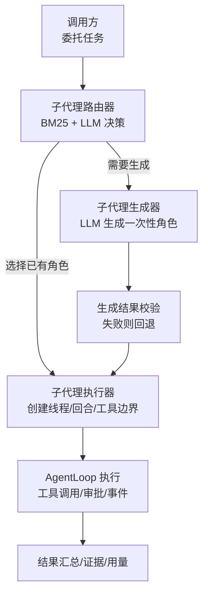
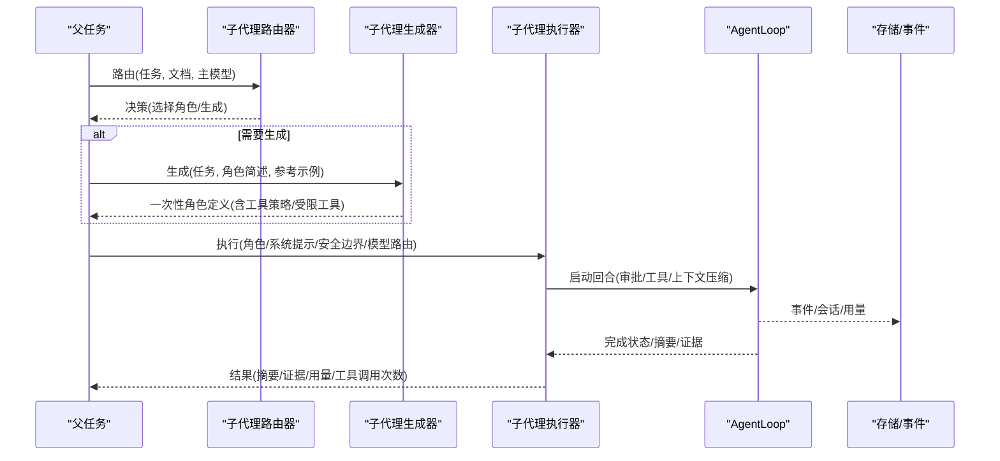
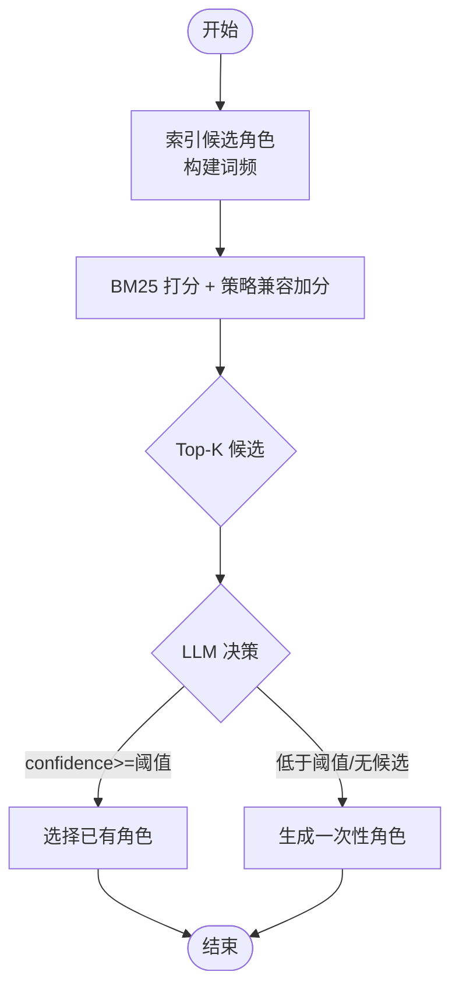
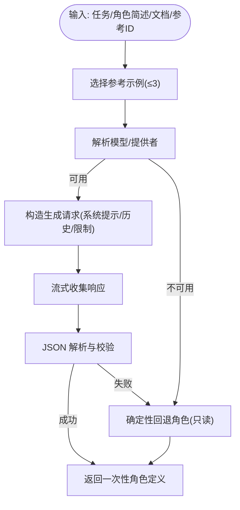
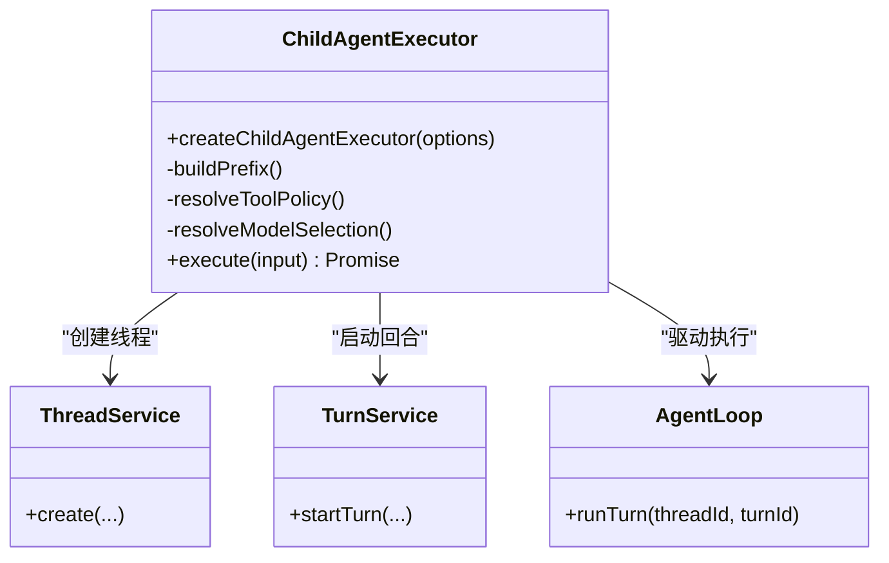
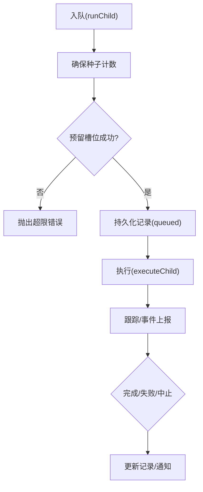
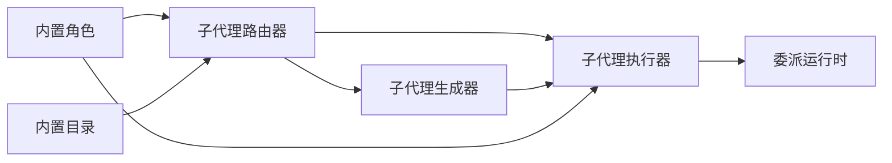

# 子代理生成器

<cite>
**本文引用的文件**
- [subagent-generator.ts](file://kun/src/delegation/subagent-generator.ts)
- [subagent-router.ts](file://kun/src/delegation/subagent-router.ts)
- [delegation-runtime.ts](file://kun/src/delegation/delegation-runtime.ts)
- [child-agent-executor.ts](file://kun/src/delegation/child-agent-executor.ts)
- [builtin-profiles.ts](file://kun/src/delegation/builtin-profiles.ts)
- [builtin-agent-catalog.ts](file://kun/src/delegation/builtin-agent-catalog.ts)
- [index.ts](file://kun/src/delegation/index.ts)
</cite>

## 目录
1. [简介](#简介)
2. [项目结构](#项目结构)
3. [核心组件](#核心组件)
4. [架构总览](#架构总览)
5. [详细组件分析](#详细组件分析)
6. [依赖关系分析](#依赖关系分析)
7. [性能与并发控制](#性能与并发控制)
8. [故障排查指南](#故障排查指南)
9. [结论](#结论)
10. [附录：配置与优化建议](#附录配置与优化建议)

## 简介
本文件面向 DeepSeek-GUI 的“子代理生成器”，系统性说明其任务分解算法、生成策略、子代理配置生成过程、并行度控制与负载均衡机制，以及扩展点与优化建议。目标是帮助读者理解如何将复杂任务智能拆分为可并行的子任务，并在安全、可控的前提下高效执行。

## 项目结构
子代理生成器位于 delegation 模块中，围绕“路由—生成—执行”三段式流水线组织：
- 路由层：根据任务文本与候选角色进行 BM25 召回与 LLM 决策，决定复用内置角色还是生成一次性角色。
- 生成层：在需要时调用模型生成一次性角色定义（名称、描述、系统提示、工具策略、受限工具等），并提供确定性回退。
- 执行层：将生成的或选定的角色装配为子代理运行环境，完成权限继承、工具集选择、模型路由、超时与取消、持久化与事件上报。

图示来源
- [subagent-router.ts:140-232](file://kun/src/delegation/subagent-router.ts#L140-L232)
- [subagent-generator.ts:42-129](file://kun/src/delegation/subagent-generator.ts#L42-L129)
- [child-agent-executor.ts:111-407](file://kun/src/delegation/child-agent-executor.ts#L111-L407)
- [delegation-runtime.ts:390-780](file://kun/src/delegation/delegation-runtime.ts#L390-L780)

章节来源
- [index.ts:1-4](file://kun/src/delegation/index.ts#L1-L4)

## 核心组件
- 子代理路由器：负责基于 BM25 召回与 LLM 判断，输出“选择已有角色”或“生成一次性角色”的决策，并附带置信度、原因与候选列表。
- 子代理生成器：在路由决策为“生成”时，构造请求、流式收集响应、解析并校验 JSON，最终产出一次性角色定义；若失败或超时，返回确定性回退角色。
- 子代理执行器：将角色（内置/工作区/生成）装配为隔离的子代理运行环境，设置工具策略、允许/禁止的工具与提供者、沙箱路径、审批策略、模型路由等，并驱动 AgentLoop 执行。
- 委派运行时：负责任务排队、并发槽位管理、父子生命周期桥接、持久化记录、后台/前台模式切换、统计与事件上报。

章节来源
- [subagent-router.ts:140-232](file://kun/src/delegation/subagent-router.ts#L140-L232)
- [subagent-generator.ts:42-129](file://kun/src/delegation/subagent-generator.ts#L42-L129)
- [child-agent-executor.ts:111-407](file://kun/src/delegation/child-agent-executor.ts#L111-L407)
- [delegation-runtime.ts:333-780](file://kun/src/delegation/delegation-runtime.ts#L333-L780)

## 架构总览
下图展示从任务输入到子代理执行的端到端流程，包括路由、生成、执行与结果聚合的关键环节。

图示来源
- [subagent-router.ts:153-232](file://kun/src/delegation/subagent-router.ts#L153-L232)
- [subagent-generator.ts:55-129](file://kun/src/delegation/subagent-generator.ts#L55-L129)
- [child-agent-executor.ts:228-407](file://kun/src/delegation/child-agent-executor.ts#L228-L407)
- [delegation-runtime.ts:583-780](file://kun/src/delegation/delegation-runtime.ts#L583-L780)

## 详细组件分析

### 子代理路由器：任务分解与依赖分析
- 召回阶段：对任务文本进行分词与别名扩展，构建查询词频；对候选角色（内置/配置/工作区）建立索引，计算 BM25 分数，并结合“工具策略兼容性”加分（只读 vs 可写）。
- 决策阶段：将候选与任务一起交给 LLM，要求返回结构化 JSON（decision/targetId/confidence/reason/roleBrief/permissionHint），低于阈值则视为不匹配。
- 回退策略：当路由不可用或返回无效时，优先选择最高 BM25 的候选；否则进入“生成一次性角色”的路径。

图示来源
- [subagent-router.ts:234-289](file://kun/src/delegation/subagent-router.ts#L234-L289)
- [subagent-router.ts:312-363](file://kun/src/delegation/subagent-router.ts#L312-L363)
- [subagent-router.ts:421-442](file://kun/src/delegation/subagent-router.ts#L421-L442)

章节来源
- [subagent-router.ts:140-232](file://kun/src/delegation/subagent-router.ts#L140-L232)
- [subagent-router.ts:234-289](file://kun/src/delegation/subagent-router.ts#L234-L289)
- [subagent-router.ts:421-442](file://kun/src/delegation/subagent-router.ts#L421-L442)

### 子代理生成器：生成策略与资源需求评估
- 输入准备：提取任务与角色简述，截断至合理长度；从路由候选中选择最多三个可信内置示例作为参考，避免注入工作区敏感内容。
- 模型路由：通过角色配置与默认模型解析出具体模型与提供者；若无可用模型则直接回退。
- 流式收集与解析：以流式方式收集助手文本与推理片段，合并后按严格 Schema 校验 JSON；若校验失败或包含不安全字段（如技能加载），则回退。
- 工具策略与安全：强制阻断危险工具（委托、生成子代理、加载技能）；当未显式指定策略时，自动回退为只读，确保最小权限。
- 资源使用：记录用量快照，便于追踪成本与缓存命中情况。

图示来源
- [subagent-generator.ts:55-129](file://kun/src/delegation/subagent-generator.ts#L55-L129)
- [subagent-generator.ts:191-240](file://kun/src/delegation/subagent-generator.ts#L191-L240)
- [subagent-generator.ts:242-270](file://kun/src/delegation/subagent-generator.ts#L242-L270)

章节来源
- [subagent-generator.ts:42-129](file://kun/src/delegation/subagent-generator.ts#L42-L129)
- [subagent-generator.ts:191-240](file://kun/src/delegation/subagent-generator.ts#L191-L240)
- [subagent-generator.ts:242-270](file://kun/src/delegation/subagent-generator.ts#L242-L270)

### 子代理执行器：权限继承、工具集选择与模型路由
- 权限继承：读取父级安全快照（沙箱根、允许/禁止的工具、提供者、技能、读写路径、制品 ID），并与角色配置交集，确保子代理能力不超越父级。
- 工具集选择：根据 toolPolicy（只读/继承）与 allow/deny 列表确定可用工具；对于只读模式，强制应用只读工具白名单。
- 模型路由：支持显式模型/提供者覆盖，或继承父会话的选择；一次性角色遵循“继承会话选择”的策略，避免静默改变执行行为。
- 审批与沙箱：继承或覆盖审批策略与审查者；可选沙箱模式；禁用用户交互输入，保证自动化执行。
- 执行与结果：启动 AgentLoop 执行回合，收集摘要、证据、用量、工具调用次数与前缀重用信息；非致命错误不会导致整体失败。

图示来源
- [child-agent-executor.ts:111-407](file://kun/src/delegation/child-agent-executor.ts#L111-L407)

章节来源
- [child-agent-executor.ts:111-407](file://kun/src/delegation/child-agent-executor.ts#L111-L407)

### 委派运行时：并行度控制与负载均衡
- 并发槽位：维护等待队列与每线程计数，确保同一父线程下的子任务数量受控，避免过载。
- 生命周期桥接：前台子任务与父信号联动，支持动态后台化；后台子任务拥有独立 AbortController，可由 GUI 单独取消。
- 持久化与事件：每个子任务记录完整元数据（模型、提供者、账户、策略、路由、指纹、安全快照、用时、队列时长、序列号等），并通过事件总线上报。
- 稳定性：失败被记录而非抛出；非致命工具拒绝仅记警告；保证整体流程健壮性。

图示来源
- [delegation-runtime.ts:583-780](file://kun/src/delegation/delegation-runtime.ts#L583-L780)
- [delegation-runtime.ts:1066-1105](file://kun/src/delegation/delegation-runtime.ts#L1066-L1105)

章节来源
- [delegation-runtime.ts:333-780](file://kun/src/delegation/delegation-runtime.ts#L333-L780)

### 内置角色与目录：角色库与检索增强
- 内置角色：提供通用、探索、设计审查、过度设计审查、组件设计师等角色，明确工具策略与受限工具，确保只读或继承的安全边界。
- 目录元数据：为每个内置角色提供分类、家族、表面（shared/code/write/design）、推荐表面与检索术语，用于路由时的语义匹配与过滤。

章节来源
- [builtin-profiles.ts:24-186](file://kun/src/delegation/builtin-profiles.ts#L24-L186)
- [builtin-agent-catalog.ts:34-343](file://kun/src/delegation/builtin-agent-catalog.ts#L34-L343)

## 依赖关系分析
- 路由器依赖生成器：当路由决策为“生成”时，调用生成器产出一次性角色；两者均依赖模型客户端与角色配置。
- 执行器依赖运行时：执行器由运行时调度，共享线程/回合服务、事件记录与存储；执行器内部组合 AgentLoop 完成实际执行。
- 角色库与目录：为路由与执行提供基础角色与元数据，支持工作区覆盖与用户配置优先级。

图示来源
- [subagent-router.ts:140-232](file://kun/src/delegation/subagent-router.ts#L140-L232)
- [subagent-generator.ts:42-129](file://kun/src/delegation/subagent-generator.ts#L42-L129)
- [child-agent-executor.ts:111-407](file://kun/src/delegation/child-agent-executor.ts#L111-L407)
- [delegation-runtime.ts:390-780](file://kun/src/delegation/delegation-runtime.ts#L390-L780)
- [builtin-profiles.ts:147-186](file://kun/src/delegation/builtin-profiles.ts#L147-L186)
- [builtin-agent-catalog.ts:333-343](file://kun/src/delegation/builtin-agent-catalog.ts#L333-L343)

章节来源
- [subagent-router.ts:140-232](file://kun/src/delegation/subagent-router.ts#L140-L232)
- [subagent-generator.ts:42-129](file://kun/src/delegation/subagent-generator.ts#L42-L129)
- [child-agent-executor.ts:111-407](file://kun/src/delegation/child-agent-executor.ts#L111-L407)
- [delegation-runtime.ts:390-780](file://kun/src/delegation/delegation-runtime.ts#L390-L780)
- [builtin-profiles.ts:147-186](file://kun/src/delegation/builtin-profiles.ts#L147-L186)
- [builtin-agent-catalog.ts:333-343](file://kun/src/delegation/builtin-agent-catalog.ts#L333-L343)

## 性能与并发控制
- 并发限制：通过 per-thread 子任务计数与槽位队列控制并发，防止单线程下子任务爆炸；超限时立即报错，避免排队堆积。
- 超时与取消：路由与生成均支持超时与父级取消信号；生成器在流式收集中监听 abort，及时中断并释放资源。
- 负载平衡：FIFO 队列与槽位分配保证公平调度；后台任务独立信号，避免阻塞前台；事件与记录提供可观测性。
- 上下文压缩与令牌经济：执行器支持上下文压缩与令牌经济配置，减少长对话开销；必要时关闭墙钟时限以避免误杀。
- 模型路由优化：一次性角色继承会话选择，避免频繁切换模型；可配置 serviceTier（fast/priority）以提升关键任务优先级。

章节来源
- [delegation-runtime.ts:583-780](file://kun/src/delegation/delegation-runtime.ts#L583-L780)
- [subagent-router.ts:153-232](file://kun/src/delegation/subagent-router.ts#L153-L232)
- [subagent-generator.ts:81-129](file://kun/src/delegation/subagent-generator.ts#L81-L129)
- [child-agent-executor.ts:228-407](file://kun/src/delegation/child-agent-executor.ts#L228-L407)

## 故障排查指南
- 路由失败：检查模型可用性、超时设置与候选文档质量；查看 fallback 是否选择了最高 BM25 候选或进入生成路径。
- 生成失败：确认 JSON 解析与 Schema 校验；检查是否包含不安全字段（技能加载、递归委托）；必要时调整 roleBrief 与参考示例。
- 执行失败：查看子任务记录中的 error、status、toolInvocations 与 evidence；区分致命错误与非致命工具拒绝；关注审批与沙箱边界。
- 并发问题：检查 per-thread 计数与槽位占用；确认是否有长时间运行的后台任务未释放；观察 queuedMs 与 durationMs 指标。
- 模型路由异常：核对 providerId/accountId 是否与父级一致；确认 security 允许的模型/提供者未被拒绝。

章节来源
- [subagent-router.ts:421-442](file://kun/src/delegation/subagent-router.ts#L421-L442)
- [subagent-generator.ts:100-129](file://kun/src/delegation/subagent-generator.ts#L100-L129)
- [child-agent-executor.ts:354-407](file://kun/src/delegation/child-agent-executor.ts#L354-L407)
- [delegation-runtime.ts:583-780](file://kun/src/delegation/delegation-runtime.ts#L583-L780)

## 结论
子代理生成器通过“路由—生成—执行”的三段式架构，实现了复杂任务的智能拆分与高效执行。BM25 召回与 LLM 决策结合，既保证了高命中率的角色复用，又能在缺失专长时快速生成一次性角色；执行器严格继承父级权限并精细化控制工具与模型路由；运行时提供并发控制、超时取消与持久化观测，确保系统在大规模并行场景下的稳定与可运维。

## 附录：配置与优化建议
- 并发限制：根据硬件与模型配额调整 per-thread 子任务上限；监控 queuedMs 与 durationMs，避免排队过长。
- 超时设置：路由与生成分别设置合理超时；对关键任务启用 serviceTier=priority（需模型能力支持）。
- 重试策略：对网络或模型瞬时失败可在上层实现重试；生成器已具备确定性回退，无需重复重试。
- 角色与目录：完善内置角色的 routingTerms 与 surfaces，提升召回准确率；工作区覆盖用于本地化定制。
- 安全边界：始终保留 blockedTools（委托、生成子代理、加载技能）；按需收紧 allowedTools/Providers/Skills。
- 观测与诊断：利用 childSeq、activity、evidence 与 usage 指标定位瓶颈；结合事件回放复现问题。