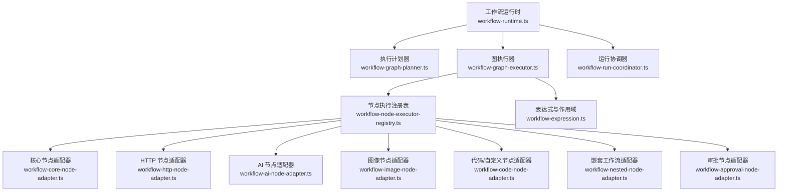
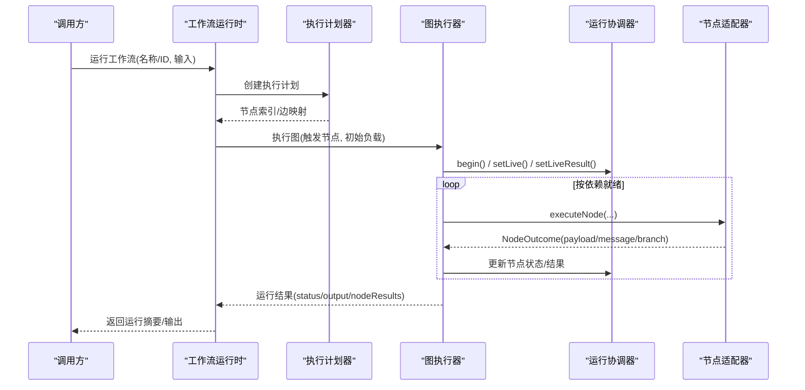
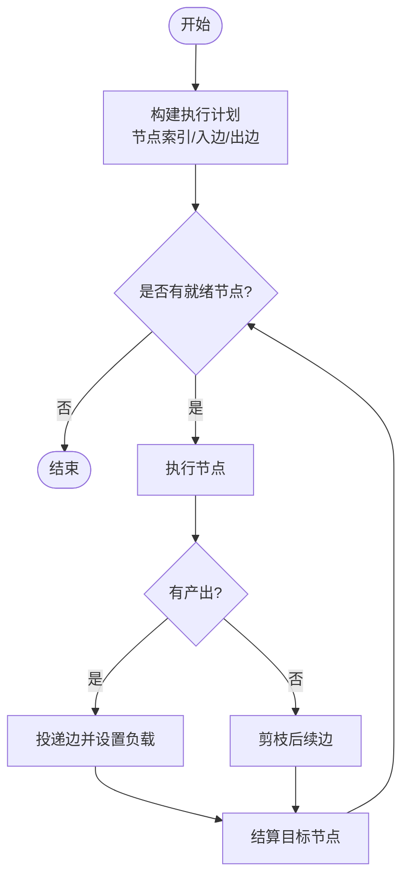
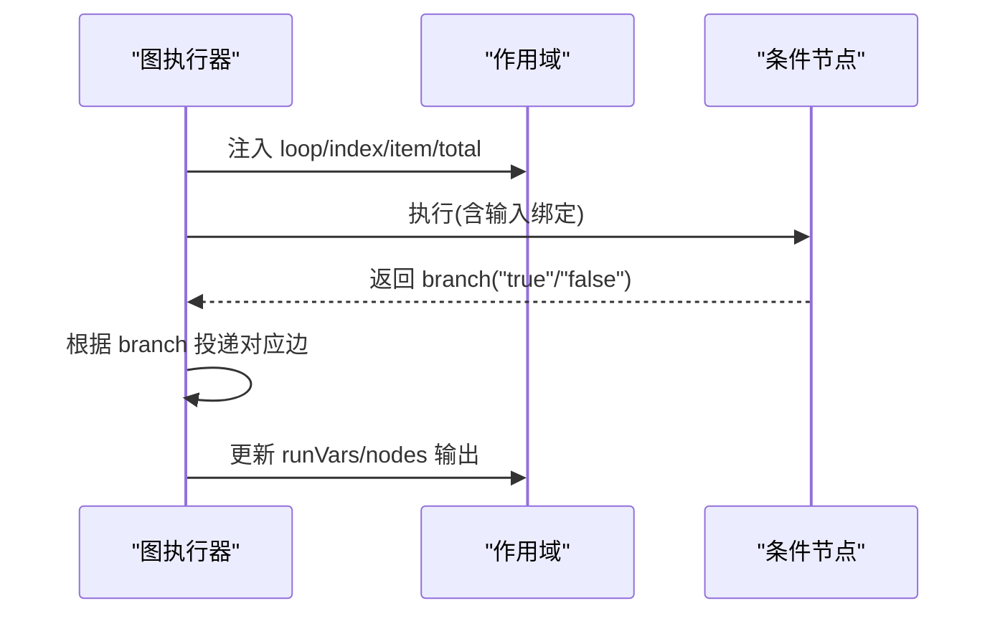
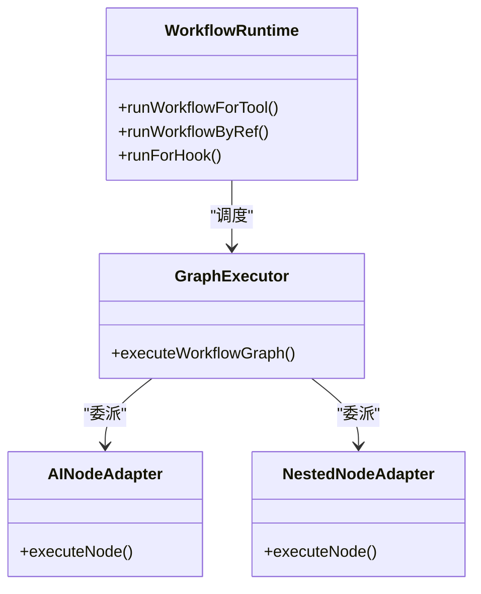
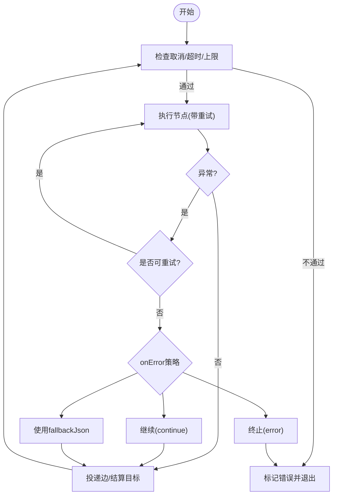
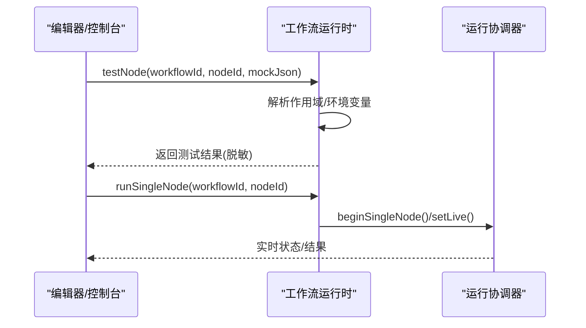
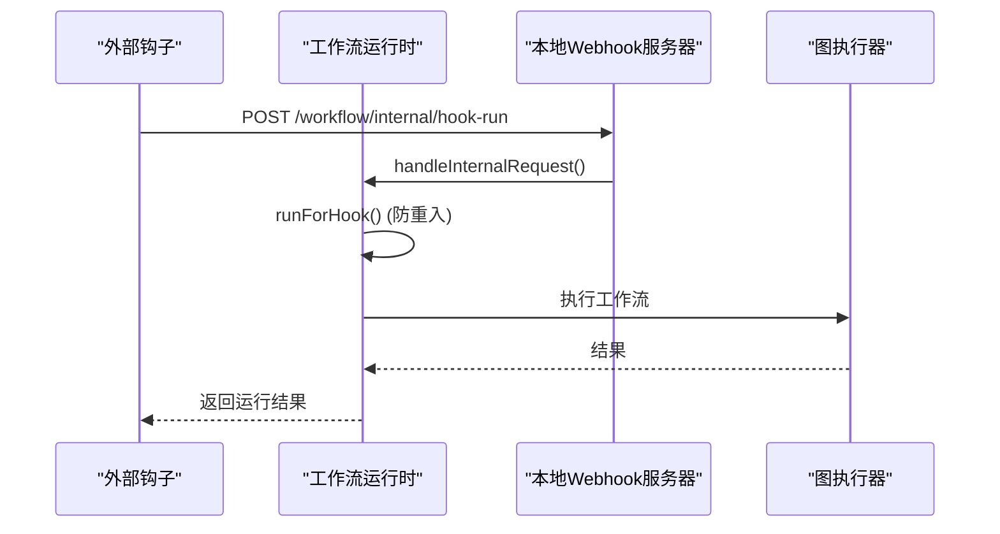
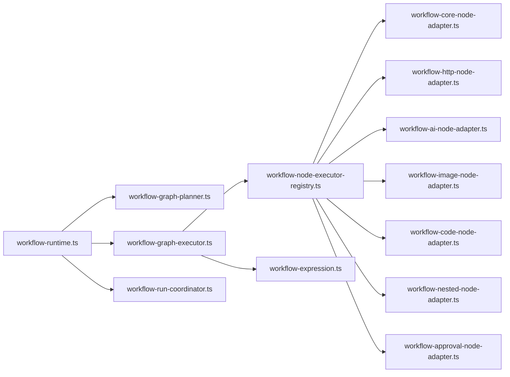

# 工作流引擎

<cite>
**本文引用的文件**
- [workflow-graph-executor.ts](file://src/main/workflow-graph-executor.ts)
- [workflow-graph-planner.ts](file://src/main/workflow-graph-planner.ts)
- [workflow-run-coordinator.ts](file://src/main/workflow-run-coordinator.ts)
- [workflow-runtime.ts](file://src/main/workflow-runtime.ts)
- [workflow-node-executor-registry.ts](file://src/main/workflow-node-executor-registry.ts)
- [workflow-core-node-adapter.ts](file://src/main/workflow-core-node-adapter.ts)
- [workflow-http-node-adapter.ts](file://src/main/workflow-http-node-adapter.ts)
- [workflow-ai-node-adapter.ts](file://src/main/workflow-ai-node-adapter.ts)
- [workflow-image-node-adapter.ts](file://src/main/workflow-image-node-adapter.ts)
- [workflow-code-node-adapter.ts](file://src/main/workflow-code-node-adapter.ts)
- [workflow-nested-node-adapter.ts](file://src/main/workflow-nested-node-adapter.ts)
- [workflow-approval-node-adapter.ts](file://src/main/workflow-approval-node-adapter.ts)
- [workflow-expression.ts](file://src/main/workflow-expression.ts)
- [app-settings-workflow.ts](file://src/shared/app-settings-workflow.ts)
- [schedule-runtime-helpers.ts](file://src/main/schedule-runtime-helpers.ts)
</cite>

## 目录
1. [简介](#简介)
2. [项目结构](#项目结构)
3. [核心组件](#核心组件)
4. [架构总览](#架构总览)
5. [详细组件分析](#详细组件分析)
6. [依赖关系分析](#依赖关系分析)
7. [性能与可靠性](#性能与可靠性)
8. [故障排查指南](#故障排查指南)
9. [结论](#结论)
10. [附录：示例工作流与最佳实践](#附录示例工作流与最佳实践)

## 简介
本文件为 DeepSeek-GUI 的工作流引擎提供系统化文档，覆盖 Agent Graph 架构、节点定义与执行调度、循环模式、子代理委派、编排器（并行/错误处理/回滚）、可视化编辑器能力、Hook 系统以及设计最佳实践。内容基于源码实现进行提炼，帮助读者从高层到代码级理解工作流如何被规划、执行、监控与扩展。

## 项目结构
工作流引擎位于主进程模块中，围绕“运行时—计划器—执行器—协调器”分层组织：
- 运行时：负责生命周期管理、定时触发、Webhook 接入、状态持久化、权限与安全等。
- 计划器：将工作流图转换为可执行的拓扑结构（入边/出边映射）。
- 执行器：按 DAG 顺序调度节点执行，支持分支、重试、超时、取消。
- 协调器：维护运行期状态、并发控制、审批流与实时投影。
- 节点适配器：AI、HTTP、代码、图像、嵌套工作流、审批、核心工具等具体节点类型。
- 表达式与变量：提供输入绑定、环境变量、循环上下文与作用域解析。

**图表来源**
- [workflow-runtime.ts:271-324](file://src/main/workflow-runtime.ts#L271-L324)
- [workflow-graph-planner.ts:22-47](file://src/main/workflow-graph-planner.ts#L22-L47)
- [workflow-graph-executor.ts:63-138](file://src/main/workflow-graph-executor.ts#L63-L138)
- [workflow-node-executor-registry.ts](file://src/main/workflow-node-executor-registry.ts)

**章节来源**
- [workflow-runtime.ts:271-324](file://src/main/workflow-runtime.ts#L271-L324)
- [workflow-graph-planner.ts:22-47](file://src/main/workflow-graph-planner.ts#L22-L47)
- [workflow-graph-executor.ts:63-138](file://src/main/workflow-graph-executor.ts#L63-L138)

## 核心组件
- 工作流运行时（WorkflowRuntime）
  - 启动/停止、定时任务调度、Webhook 服务、幂等保护、钩子防重入、电源策略、运行计数限制。
- 执行计划器（createWorkflowExecutionPlan）
  - 构建节点索引、入边/出边映射，校验连接有效性。
- 图执行器（executeWorkflowGraph）
  - 基于就绪队列的 DAG 调度；支持分支选择、重试、错误处理策略、最大执行次数/时长保护、取消信号。
- 运行协调器（WorkflowRunCoordinator）
  - 单写者模型，维护运行集合、取消请求、待审批、节点实时状态与结果、AbortController 集合。
- 节点执行注册表与适配器
  - 统一抽象 NodeOutcome（payload/message/branch/threadId），按节点类型分派到具体适配器。
- 表达式与作用域
  - 支持 {{json.*}}、插值、类型强制转换、环境变量、循环上下文、运行变量。

**章节来源**
- [workflow-runtime.ts:271-324](file://src/main/workflow-runtime.ts#L271-L324)
- [workflow-graph-planner.ts:22-47](file://src/main/workflow-graph-planner.ts#L22-L47)
- [workflow-graph-executor.ts:63-138](file://src/main/workflow-graph-executor.ts#L63-L138)
- [workflow-run-coordinator.ts:14-145](file://src/main/workflow-run-coordinator.ts#L14-L145)
- [workflow-node-executor-registry.ts](file://src/main/workflow-node-executor-registry.ts)
- [workflow-expression.ts](file://src/main/workflow-expression.ts)

## 架构总览
工作流以“触发器→DAG→节点适配器”的方式运行。运行时根据配置创建计划，执行器按依赖就绪推进，协调器暴露实时状态与审批接口。

**图表来源**
- [workflow-runtime.ts:542-571](file://src/main/workflow-runtime.ts#L542-L571)
- [workflow-graph-planner.ts:22-47](file://src/main/workflow-graph-planner.ts#L22-L47)
- [workflow-graph-executor.ts:138-298](file://src/main/workflow-graph-executor.ts#L138-L298)
- [workflow-run-coordinator.ts:24-105](file://src/main/workflow-run-coordinator.ts#L24-L105)

## 详细组件分析

### Agent Graph 架构：节点定义、依赖与调度
- 节点定义
  - 节点类型包括手动触发、定时触发、Webhook 触发、AI 代理、HTTP、代码/自定义、图像、嵌套工作流、审批、输出等。
  - 每个节点可配置输入绑定、重试、错误处理策略（fail/continue/fallback）、分支出口（sourceHandle）。
- 依赖关系
  - 通过 connections 描述边，计划器构建 incomingByNodeId/outgoingByNodeId，执行器据此判断节点是否就绪。
- 执行调度
  - 使用 readyQueue 推进；当所有入边已交付或可剪枝时，目标节点进入就绪；支持分支选择决定哪条边传递负载。

**图表来源**
- [workflow-graph-planner.ts:22-47](file://src/main/workflow-graph-planner.ts#L22-L47)
- [workflow-graph-executor.ts:117-134](file://src/main/workflow-graph-executor.ts#L117-L134)
- [workflow-graph-executor.ts:138-298](file://src/main/workflow-graph-executor.ts#L138-L298)

**章节来源**
- [workflow-graph-planner.ts:22-47](file://src/main/workflow-graph-planner.ts#L22-L47)
- [workflow-graph-executor.ts:117-134](file://src/main/workflow-graph-executor.ts#L117-L134)
- [workflow-graph-executor.ts:138-298](file://src/main/workflow-graph-executor.ts#L138-L298)

### 循环模式：迭代控制、条件判断与状态管理
- 迭代控制
  - 执行上下文包含 loop: { index, item, total }，用于在表达式与作用域中访问当前迭代信息。
- 条件判断
  - 节点可通过 outcome.branch 指定走哪个出口（如 true/false），执行器据此投递对应边。
- 状态管理
  - 作用域 scope 包含 nodes/env/run/loop/input，供表达式解析与输入绑定使用；runVars 跨节点共享运行变量。

**图表来源**
- [workflow-graph-executor.ts:36-61](file://src/main/workflow-graph-executor.ts#L36-L61)
- [workflow-graph-executor.ts:135-137](file://src/main/workflow-graph-executor.ts#L135-L137)
- [workflow-graph-executor.ts:327-343](file://src/main/workflow-graph-executor.ts#L327-L343)

**章节来源**
- [workflow-graph-executor.ts:36-61](file://src/main/workflow-graph-executor.ts#L36-L61)
- [workflow-graph-executor.ts:135-137](file://src/main/workflow-graph-executor.ts#L135-L137)
- [workflow-graph-executor.ts:327-343](file://src/main/workflow-graph-executor.ts#L327-L343)

### 子代理委派机制：任务拆分、权限控制与结果聚合
- 任务拆分
  - AI 节点通过适配器与上游模型交互，可创建 Kun thread；嵌套工作流节点可将复杂流程拆分为子工作流执行。
- 权限控制
  - 运行时在 Webhook 与内部接口层进行鉴权（Bearer/Secret），工作流级别启用开关与 callableByAgent 控制可调用范围。
- 结果聚合
  - 图执行器收集各节点输出至 nodeOutputs，并通过边传递；最终输出由 output 节点或最后一个成功节点决定。

**图表来源**
- [workflow-runtime.ts:475-540](file://src/main/workflow-runtime.ts#L475-L540)
- [workflow-graph-executor.ts:193-212](file://src/main/workflow-graph-executor.ts#L193-L212)
- [workflow-ai-node-adapter.ts](file://src/main/workflow-ai-node-adapter.ts)
- [workflow-nested-node-adapter.ts](file://src/main/workflow-nested-node-adapter.ts)

**章节来源**
- [workflow-runtime.ts:475-540](file://src/main/workflow-runtime.ts#L475-L540)
- [workflow-graph-executor.ts:193-212](file://src/main/workflow-graph-executor.ts#L193-L212)

### 工作流编排器：并行执行、错误处理与回滚机制
- 并行执行
  - 基于 DAG 的就绪队列推进，具备入边全部满足即可并发的特性；协调器维护多运行实例与 AbortController。
- 错误处理
  - 节点支持 retries/retryDelayMs；onError 支持 continue/fallback；失败会记录节点结果并终止运行。
- 回滚机制
  - 未实现全局事务回滚；建议通过“补偿节点”或“回滚工作流”在业务层实现一致性。

**图表来源**
- [workflow-graph-executor.ts:139-155](file://src/main/workflow-graph-executor.ts#L139-L155)
- [workflow-graph-executor.ts:189-244](file://src/main/workflow-graph-executor.ts#L189-L244)
- [workflow-run-coordinator.ts:69-92](file://src/main/workflow-run-coordinator.ts#L69-L92)

**章节来源**
- [workflow-graph-executor.ts:139-155](file://src/main/workflow-graph-executor.ts#L139-L155)
- [workflow-graph-executor.ts:189-244](file://src/main/workflow-graph-executor.ts#L189-L244)
- [workflow-run-coordinator.ts:69-92](file://src/main/workflow-run-coordinator.ts#L69-L92)

### 可视化工作流编辑器：拖拽界面、实时预览与调试
- 拖拽界面
  - 通过节点类型与连接定义工作流；触发器节点决定入口。
- 实时预览
  - 协调器维护 liveNodeStatus/liveNodeResults，运行时推送节点状态与结果，便于 UI 渲染进度。
- 调试功能
  - 提供 testNode 对单个节点进行隔离测试；支持 mock 输入与结果脱敏；支持单步运行 runSingleNode。

**图表来源**
- [workflow-runtime.ts:616-648](file://src/main/workflow-runtime.ts#L616-L648)
- [workflow-runtime.ts:650-726](file://src/main/workflow-runtime.ts#L650-L726)
- [workflow-run-coordinator.ts:54-67](file://src/main/workflow-run-coordinator.ts#L54-L67)

**章节来源**
- [workflow-runtime.ts:616-648](file://src/main/workflow-runtime.ts#L616-L648)
- [workflow-runtime.ts:650-726](file://src/main/workflow-runtime.ts#L650-L726)
- [workflow-run-coordinator.ts:54-67](file://src/main/workflow-run-coordinator.ts#L54-L67)

### Hook 系统：生命周期钩子、事件监听与自定义逻辑注入
- 生命周期钩子
  - 运行时提供 runForHook 方法，受 hookRunActive 保护避免递归触发；内部接口 /workflow/internal/hook-run 接收钩子载荷。
- 事件监听
  - 通过 Webhook 与内部接口暴露运行能力；运行时监听端口并在匹配路径时触发工作流。
- 自定义逻辑注入
  - 借助代码/自定义节点与 AI 节点，可在工作流中注入任意逻辑；通过表达式与作用域组合数据。

**图表来源**
- [workflow-runtime.ts:326-432](file://src/main/workflow-runtime.ts#L326-L432)
- [workflow-runtime.ts:434-473](file://src/main/workflow-runtime.ts#L434-L473)
- [workflow-runtime.ts:497-517](file://src/main/workflow-runtime.ts#L497-L517)

**章节来源**
- [workflow-runtime.ts:326-432](file://src/main/workflow-runtime.ts#L326-L432)
- [workflow-runtime.ts:434-473](file://src/main/workflow-runtime.ts#L434-L473)
- [workflow-runtime.ts:497-517](file://src/main/workflow-runtime.ts#L497-L517)

## 依赖关系分析
- 运行时依赖计划器生成拓扑，依赖执行器推进 DAG，依赖协调器管理并发与状态。
- 执行器依赖节点注册表与各类适配器完成具体任务。
- 表达式与作用域贯穿输入绑定、环境变量、循环上下文与运行变量。

**图表来源**
- [workflow-runtime.ts:271-324](file://src/main/workflow-runtime.ts#L271-L324)
- [workflow-graph-executor.ts:63-138](file://src/main/workflow-graph-executor.ts#L63-L138)
- [workflow-node-executor-registry.ts](file://src/main/workflow-node-executor-registry.ts)

**章节来源**
- [workflow-runtime.ts:271-324](file://src/main/workflow-runtime.ts#L271-L324)
- [workflow-graph-executor.ts:63-138](file://src/main/workflow-graph-executor.ts#L63-L138)

## 性能与可靠性
- 并发与限流
  - 最大节点执行次数与最大运行时长保护，防止无限循环与资源耗尽。
  - 协调器维护多个运行实例，支持取消与清理。
- 错误恢复
  - 节点级重试与延迟；错误处理策略支持继续或回退；失败记录节点结果便于定位。
- 安全与审计
  - 敏感信息脱敏；Webhook 鉴权；工作流启用与可调用性控制。
- 调度与持久化
  - 定时任务轮询计算下次触发时间；中断恢复标记；运行状态与结果持久化。

[本节为通用指导，不直接分析具体文件]

## 故障排查指南
- 常见问题
  - 工作流未找到/无触发器：检查工作流启用与是否存在触发节点。
  - 缺少必填输入：检查手动触发器的输入模式与必填字段。
  - 节点执行失败：查看节点结果中的 error 与 message；确认 onRetry/onError 配置。
  - 取消/超时：检查 isCanceled/signal 与最大运行时长/节点数限制。
  - Webhook 未触发：检查路径与方法匹配、鉴权密钥与工作流启用。
- 诊断手段
  - 使用 testNode 对节点进行隔离测试；使用 runSingleNode 单步验证。
  - 通过 status() 获取运行中工作流的节点状态与结果。

**章节来源**
- [workflow-runtime.ts:542-571](file://src/main/workflow-runtime.ts#L542-L571)
- [workflow-runtime.ts:616-726](file://src/main/workflow-runtime.ts#L616-L726)
- [workflow-graph-executor.ts:139-155](file://src/main/workflow-graph-executor.ts#L139-L155)
- [workflow-graph-executor.ts:189-244](file://src/main/workflow-graph-executor.ts#L189-L244)

## 结论
DeepSeek-GUI 的工作流引擎以 DAG 为核心，结合计划器、执行器与协调器实现了高内聚、可扩展的执行框架。其支持循环与分支、子代理委派、Webhook 与定时触发、完善的错误处理与调试能力，适合构建复杂的自动化流程。建议在业务层通过补偿节点实现回滚，并结合表达式与作用域提升灵活性。

[本节为总结，不直接分析具体文件]

## 附录：示例工作流与最佳实践

### 示例工作流
- 数据采集与清洗
  - 触发器：Webhook/定时
  - 节点：HTTP 拉取 → 代码清洗 → AI 分类 → 输出
- 内容生成与审核
  - 触发器：手动
  - 节点：AI 生成 → 审批 → 图像/代码处理 → 输出
- 多步骤编排
  - 触发器：定时
  - 节点：嵌套工作流（子流程）→ 条件分支 → 汇总输出

[本节为概念性示例，不直接分析具体文件]

### 最佳实践
- 性能优化
  - 合理拆分节点，减少单次执行复杂度；利用缓存与批量操作；避免过深嵌套。
  - 设置合理的重试次数与延迟；使用分支提前剪枝无效路径。
- 错误处理
  - 明确 onError 策略；记录关键中间结果；对关键步骤增加审批节点。
  - 使用脱敏与最小权限原则；对外部调用增加超时与熔断。
- 可维护性
  - 命名规范与注释；将通用逻辑封装为子工作流或自定义节点；保持输入输出契约稳定。
  - 使用表达式与作用域复用变量；通过环境变量管理配置。

[本节为通用指导，不直接分析具体文件]