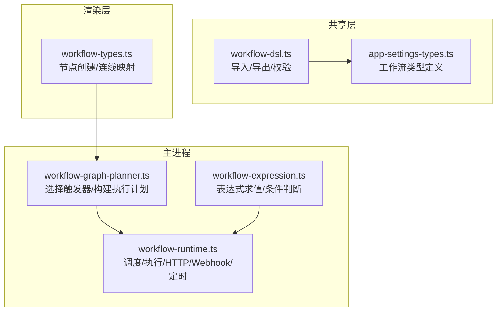
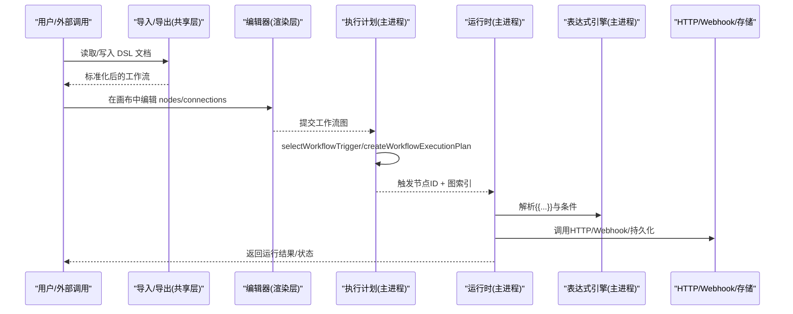
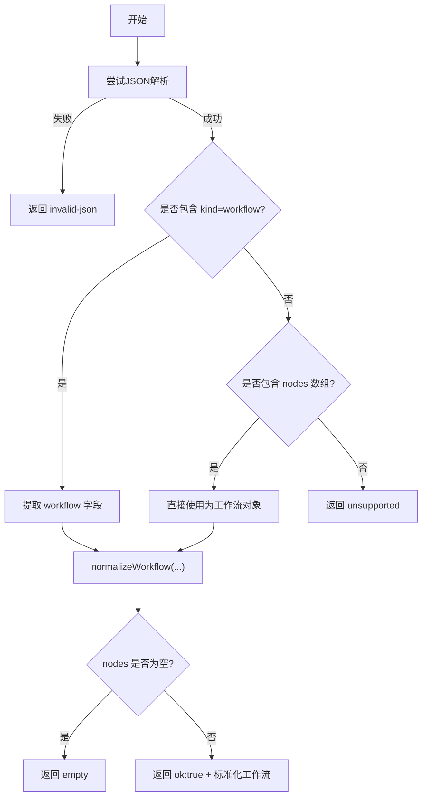
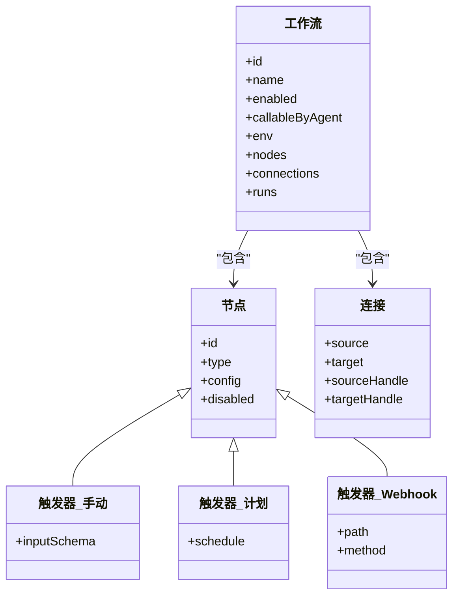
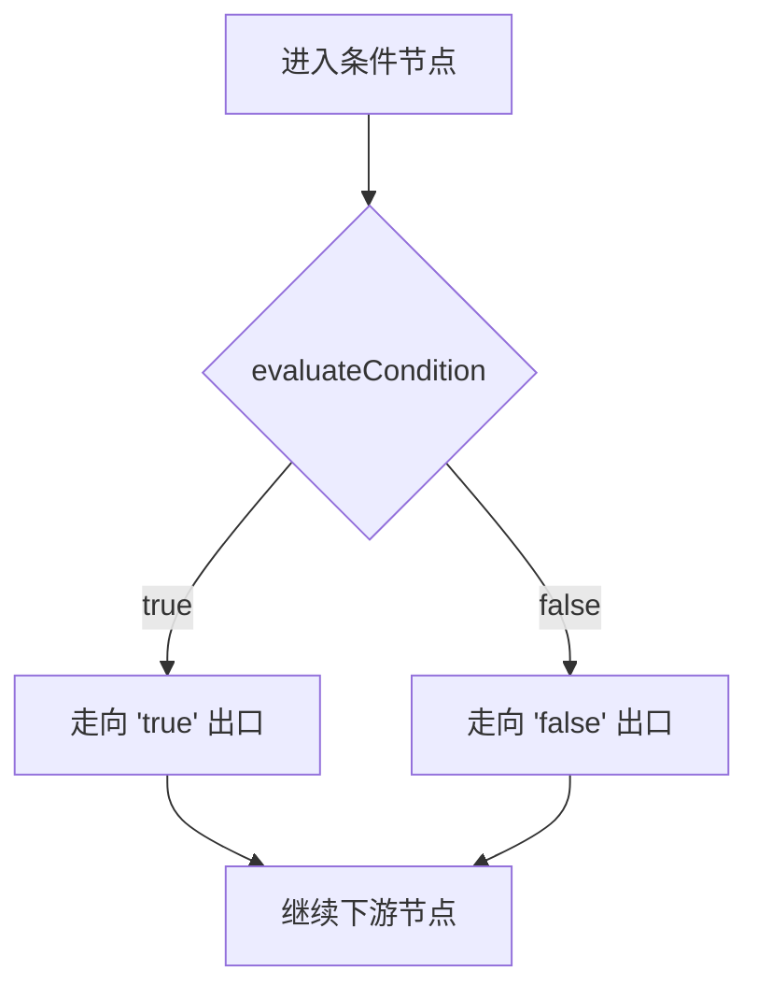
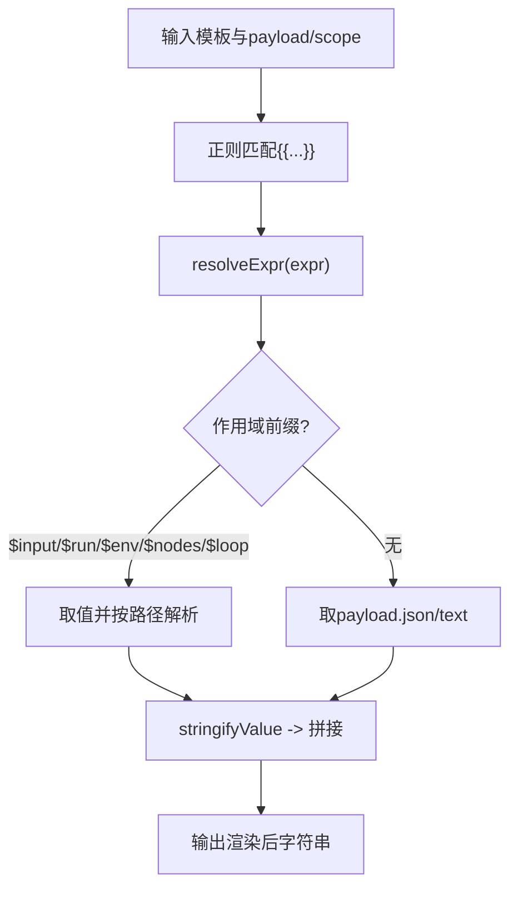
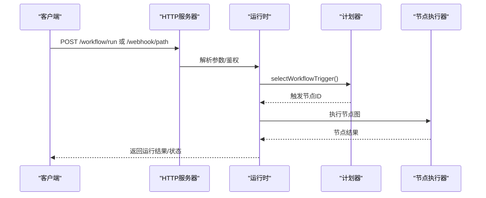
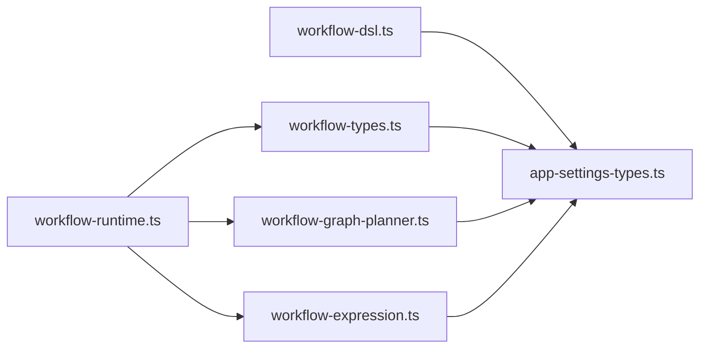

# 工作流DSL语法

<cite>
**本文引用的文件**   
- [workflow-dsl.ts](file://src/shared/workflow-dsl.ts)
- [app-settings-types.ts](file://src/shared/app-settings-types.ts)
- [workflow-types.ts](file://src/renderer/src/components/workflow/workflow-types.ts)
- [workflow-graph-planner.ts](file://src/main/workflow-graph-planner.ts)
- [workflow-expression.ts](file://src/main/workflow-expression.ts)
- [workflow-runtime.ts](file://src/main/workflow-runtime.ts)
</cite>

## 目录
1. [简介](#简介)
2. [项目结构](#项目结构)
3. [核心组件](#核心组件)
4. [架构总览](#架构总览)
5. [详细组件分析](#详细组件分析)
6. [依赖关系分析](#依赖关系分析)
7. [性能考量](#性能考量)
8. [故障排查指南](#故障排查指南)
9. [结论](#结论)
10. [附录](#附录)

## 简介
本文件为 DeepSeek-GUI 的工作流 DSL 提供完整、可操作的语法与实现说明。内容覆盖：
- 工作流定义文件的 JSON 结构（workflow、nodes、connections 等）
- 节点类型系统（手动触发器、计划触发器、Webhook 触发器及各类处理节点）
- 连接关系定义（边连接、条件分支、并行执行模式）
- 变量插值语法（{{expression}}、作用域解析与内置函数）
- 环境变量配置、输入输出绑定与数据转换机制
- 常见场景的 DSL 示例与语法验证规则、错误提示

## 项目结构
工作流 DSL 由“共享层类型 + 渲染层编辑器 + 主进程运行时”三部分协作完成：
- 共享层：定义工作流数据结构、导入导出与校验入口
- 渲染层：提供节点创建、连线映射与可视化编辑能力
- 主进程：负责调度、执行图、表达式求值、HTTP Webhook、定时任务等

图表来源
- [workflow-dsl.ts:1-90](file://src/shared/workflow-dsl.ts#L1-L90)
- [workflow-types.ts:71-200](file://src/renderer/src/components/workflow/workflow-types.ts#L71-L200)
- [workflow-graph-planner.ts:14-47](file://src/main/workflow-graph-planner.ts#L14-L47)
- [workflow-expression.ts:33-105](file://src/main/workflow-expression.ts#L33-L105)
- [workflow-runtime.ts:271-350](file://src/main/workflow-runtime.ts#L271-L350)

章节来源
- [workflow-dsl.ts:1-90](file://src/shared/workflow-dsl.ts#L1-L90)
- [workflow-types.ts:71-200](file://src/renderer/src/components/workflow/workflow-types.ts#L71-L200)
- [workflow-graph-planner.ts:14-47](file://src/main/workflow-graph-planner.ts#L14-L47)
- [workflow-expression.ts:33-105](file://src/main/workflow-expression.ts#L33-L105)
- [workflow-runtime.ts:271-350](file://src/main/workflow-runtime.ts#L271-L350)

## 核心组件
- 工作流文档与导入导出
  - 支持两种格式：包裹式 DSL 文档或裸工作流对象；导入时自动规范化并清空敏感字段，禁用默认启用状态
- 节点类型系统
  - 触发器：manual-trigger、schedule-trigger、webhook-trigger
  - 处理节点：ai-agent、generate-image、condition、switch、filter、set-fields、code、sort、limit、aggregate、http-request、merge、subworkflow、loop、delay、template、json、output、parameter-extractor、question-classifier、human-approval、custom
- 连接与执行计划
  - 通过 connections 描述边；planner 构建入/出边索引并校验引用完整性
- 表达式与作用域
  - {{...}} 模板插值；$input、$run、$env、$nodes、$loop.* 等变量；内置条件运算符
- 运行时与调度
  - 本地 HTTP 服务器处理 /workflow/run 与 webhook 路径；定时任务轮询 nextRunAt；运行协调器管理并发与取消

章节来源
- [workflow-dsl.ts:25-89](file://src/shared/workflow-dsl.ts#L25-L89)
- [workflow-types.ts:13-54](file://src/renderer/src/components/workflow/workflow-types.ts#L13-L54)
- [workflow-graph-planner.ts:22-47](file://src/main/workflow-graph-planner.ts#L22-L47)
- [workflow-expression.ts:33-105](file://src/main/workflow-expression.ts#L33-L105)
- [workflow-runtime.ts:326-432](file://src/main/workflow-runtime.ts#L326-L432)

## 架构总览
下图展示从 DSL 到执行的端到端流程：导入/导出 → 编辑器生成 → 规划执行计划 → 运行时调度与节点执行 → 结果输出。

图表来源
- [workflow-dsl.ts:25-89](file://src/shared/workflow-dsl.ts#L25-L89)
- [workflow-types.ts:289-330](file://src/renderer/src/components/workflow/workflow-types.ts#L289-L330)
- [workflow-graph-planner.ts:14-47](file://src/main/workflow-graph-planner.ts#L14-L47)
- [workflow-runtime.ts:542-571](file://src/main/workflow-runtime.ts#L542-L571)
- [workflow-expression.ts:62-79](file://src/main/workflow-expression.ts#L62-L79)

## 详细组件分析

### 工作流定义文件 JSON 结构
- 顶层 DSL 文档
  - dsv: 版本号（当前为 1）
  - kind: 固定为 workflow
  - app: 应用标识
  - exportedAt: 导出时间戳
  - workflow: 实际工作流对象
- 裸工作流对象
  - 可直接作为 nodes/connections 数组的根对象被接受
- 导入行为
  - 自动剥离 secret 类型的环境变量值
  - 强制 disabled 与 callableByAgent 为 false
  - 清空 lastRunAt/nextRunAt/lastStatus/lastMessage/runs
  - 至少包含一个节点，否则视为空工作流

图表来源
- [workflow-dsl.ts:57-89](file://src/shared/workflow-dsl.ts#L57-L89)

章节来源
- [workflow-dsl.ts:5-47](file://src/shared/workflow-dsl.ts#L5-L47)
- [workflow-dsl.ts:57-89](file://src/shared/workflow-dsl.ts#L57-L89)

### 节点类型系统与配置选项
- 触发器
  - manual-trigger：支持 inputSchema（键/类型/必填/默认值），用于手动触发时的输入校验与类型转换
  - schedule-trigger：支持 interval/daily/at/cron 四种调度方式；运行时计算 nextRunAt
  - webhook-trigger：支持 path/method/workspaceRoot；运行时监听本地端口，按路径与方法路由到工作流
- 数据处理与逻辑
  - condition/switch/filter：基于 leftExpr/rightValue/operator/caseSensitive 进行字符串/数值比较与空值判断
  - set-fields/template/json/code：对数据进行字段设置、模板渲染、JSON 解析/序列化、自定义脚本执行
  - sort/limit/aggregate：集合操作
  - http-request：发起 HTTP 请求，支持超时与响应解析
  - merge/subworkflow/loop/delay/output：组合与编排
  - ai-agent/generate-image/parameter-extractor/question-classifier/human-approval/custom：扩展能力节点
- 节点创建与默认配置
  - 渲染层提供 createWorkflowNode(kind, position)，为每种节点初始化默认 config

图表来源
- [workflow-types.ts:71-200](file://src/renderer/src/components/workflow/workflow-types.ts#L71-L200)
- [workflow-types.ts:289-330](file://src/renderer/src/components/workflow/workflow-types.ts#L289-L330)

章节来源
- [workflow-types.ts:71-200](file://src/renderer/src/components/workflow/workflow-types.ts#L71-L200)
- [workflow-types.ts:289-330](file://src/renderer/src/components/workflow/workflow-types.ts#L289-L330)

### 连接关系定义：边、条件分支与并行
- 边连接
  - connections 数组中的每条边指定 source/target 以及可选的 sourceHandle/targetHandle
  - planner 构建 incoming/outgoing 索引，校验所有边引用的节点存在
- 条件分支
  - condition/switch 节点根据 evaluateCondition 的结果决定后续路径（true/false 或按规则匹配）
- 并行执行
  - loop 节点支持 execution 模式与 concurrency 控制；结合子工作流可实现并行迭代

图表来源
- [workflow-expression.ts:81-105](file://src/main/workflow-expression.ts#L81-L105)
- [workflow-graph-planner.ts:22-47](file://src/main/workflow-graph-planner.ts#L22-L47)

章节来源
- [workflow-graph-planner.ts:22-47](file://src/main/workflow-graph-planner.ts#L22-L47)
- [workflow-expression.ts:81-105](file://src/main/workflow-expression.ts#L81-L105)

### 变量插值语法与作用域
- 模板语法
  - 使用 {{expression}} 进行插值；未解析的占位符会原样保留
- 作用域变量
  - $input.*：工作流初始输入
  - $run.*：运行期变量
  - $env.*：环境变量
  - $nodes.<nodeId>[.json|.text|.path]：上游节点输出
  - $loop.index/$loop.total/$loop.item[.path]：循环上下文
  - 直接引用 payload.json/payload.text
- 内置函数与工具
  - resolveExpr：表达式求值
  - interpolate：模板替换
  - buildAiPrompt：AI 提示词构建（自动附加上下文）
  - evaluateCondition：条件判断（contains/notContains/equals/notEquals/startsWith/endsWith/isEmpty/isNotEmpty/gt/gte/lt/lte）

图表来源
- [workflow-expression.ts:33-79](file://src/main/workflow-expression.ts#L33-L79)

章节来源
- [workflow-expression.ts:33-79](file://src/main/workflow-expression.ts#L33-L79)

### 环境变量配置、输入输出绑定与数据转换
- 环境变量
  - env 数组项支持普通与 secret 类型；secret 在导出时被清空，运行时注入到 $env.*
- 输入绑定
  - manual-trigger 的 inputSchema 定义输入字段类型与默认值；运行时 coerceInputToPayload 将输入转换为统一 payload
- 输出绑定
  - output 节点可作为工作流的最终输出；运行时 pickRunOutput 优先选取最后一个成功的 output 节点结果
- 数据转换
  - 各处理节点对数据进行格式化、过滤、聚合、HTTP 调用等；code/custom 节点允许自定义脚本

章节来源
- [workflow-runtime.ts:196-238](file://src/main/workflow-runtime.ts#L196-L238)
- [workflow-runtime.ts:573-582](file://src/main/workflow-runtime.ts#L573-L582)
- [workflow-dsl.ts:14-19](file://src/shared/workflow-dsl.ts#L14-L19)

### 运行时与调度：Webhook、定时与API
- Webhook
  - 本地 HTTP 服务器监听 127.0.0.1:port；支持 /workflow/internal/* 与 /workflow/run；按 path/method 匹配 webhook-trigger 节点
  - 可选 x-kun-secret 或 Authorization: Bearer 鉴权
- 定时任务
  - 周期性 tick 检查 nextRunAt；支持 daily/interval/at/cron；cronNextRun 计算下次触发时间
- API
  - runWorkflowByRef/runWorkflowForTool/runForHook 提供不同入口的运行能力；支持按 id/name 查找工作流

图表来源
- [workflow-runtime.ts:326-432](file://src/main/workflow-runtime.ts#L326-L432)
- [workflow-runtime.ts:519-571](file://src/main/workflow-runtime.ts#L519-L571)
- [workflow-graph-planner.ts:14-47](file://src/main/workflow-graph-planner.ts#L14-L47)

章节来源
- [workflow-runtime.ts:326-432](file://src/main/workflow-runtime.ts#L326-L432)
- [workflow-runtime.ts:519-571](file://src/main/workflow-runtime.ts#L519-L571)

## 依赖关系分析
- 模块耦合
  - workflow-dsl.ts 依赖 app-settings-types.ts 的类型定义
  - workflow-types.ts 依赖共享类型，提供编辑器侧节点创建与连线映射
  - workflow-graph-planner.ts 依赖共享类型，负责选择触发器与构建执行计划
  - workflow-expression.ts 提供表达式与条件评估，被多个节点适配器与运行时使用
  - workflow-runtime.ts 整合以上模块，承担调度、HTTP、定时与执行编排
- 外部依赖
  - 本地 HTTP 服务器（Node.js net/http）
  - 文件系统与存储（通过 deps.store）
  - 模型/工具调用（通过适配器）

图表来源
- [workflow-dsl.ts:1-3](file://src/shared/workflow-dsl.ts#L1-L3)
- [workflow-types.ts:1-11](file://src/renderer/src/components/workflow/workflow-types.ts#L1-L11)
- [workflow-graph-planner.ts:1-2](file://src/main/workflow-graph-planner.ts#L1-L2)
- [workflow-expression.ts:1-1](file://src/main/workflow-expression.ts#L1-L1)
- [workflow-runtime.ts:1-56](file://src/main/workflow-runtime.ts#L1-L56)

章节来源
- [workflow-dsl.ts:1-3](file://src/shared/workflow-dsl.ts#L1-L3)
- [workflow-types.ts:1-11](file://src/renderer/src/components/workflow/workflow-types.ts#L1-L11)
- [workflow-graph-planner.ts:1-2](file://src/main/workflow-graph-planner.ts#L1-L2)
- [workflow-expression.ts:1-1](file://src/main/workflow-expression.ts#L1-L1)
- [workflow-runtime.ts:1-56](file://src/main/workflow-runtime.ts#L1-L56)

## 性能考量
- 表达式求值与模板渲染为轻量操作，适合高频使用
- 条件判断与字符串/数值比较开销低，注意避免过深的嵌套表达式
- 循环与并发：loop.execution 与 concurrency 需根据资源限制合理设置，避免过载
- Webhook 与定时任务：建议最小化请求体大小，合理设置超时与重试策略
- 运行时并发：运行协调器保证同一工作流不重复运行，避免资源竞争

## 故障排查指南
- 导入失败
  - invalid-json：JSON 解析失败
  - unsupported：既不是包裹式 DSL 也不是裸工作流对象
  - empty：工作流不包含任何节点
- 运行失败
  - 缺少触发器：工作流没有 manual/schedule/webhook 触发节点
  - 缺少必填输入：manual-trigger 的 inputSchema 中有 required 字段未提供且无默认值
  - Webhook 未匹配：路径或方法不匹配，或未启用工作流
  - 鉴权失败：设置了 webhookSecret 但请求头未携带正确密钥
- 调试技巧
  - 使用 testNode 对单个节点进行隔离测试，查看输入/输出与错误信息
  - 通过 /workflow/internal/list 查看可被 Agent 调用的工作流及其输入 schema
  - 关注 nextRunAt 与 lastStatus/lastMessage 以定位定时任务问题

章节来源
- [workflow-dsl.ts:49-89](file://src/shared/workflow-dsl.ts#L49-L89)
- [workflow-runtime.ts:542-571](file://src/main/workflow-runtime.ts#L542-L571)
- [workflow-runtime.ts:360-432](file://src/main/workflow-runtime.ts#L360-L432)
- [workflow-runtime.ts:650-726](file://src/main/workflow-runtime.ts#L650-L726)

## 结论
DeepSeek-GUI 的工作流 DSL 提供了清晰的 JSON 结构、丰富的节点类型、灵活的连接与条件分支、强大的表达式与变量体系，以及健壮的运行时与调度能力。通过标准化的导入/导出、严格的校验与完善的错误提示，用户可以高效地构建、调试和部署自动化工作流。

## 附录
- 常见 DSL 示例要点
  - 手动触发 + AI 处理 + 输出：manual-trigger → ai-agent → output
  - 定时任务 + HTTP 请求 + 条件分支：schedule-trigger → http-request → condition → 分支处理
  - Webhook 触发 + 数据清洗 + 子工作流：webhook-trigger → code → subworkflow
  - 循环与并行：loop 配置 execution 与 concurrency，内部串联多个处理节点
- 语法验证规则速查
  - 必须包含至少一个节点
  - connections 的 source/target 必须存在于 nodes
  - manual-trigger 的 required 输入必须提供或具备默认值
  - webhook 路径与方法需与工作流配置一致
  - 表达式需遵循 $input/$run/$env/$nodes/$loop 作用域规范