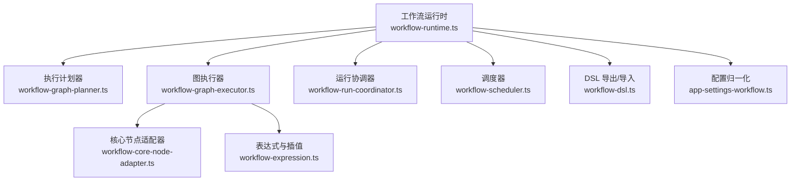
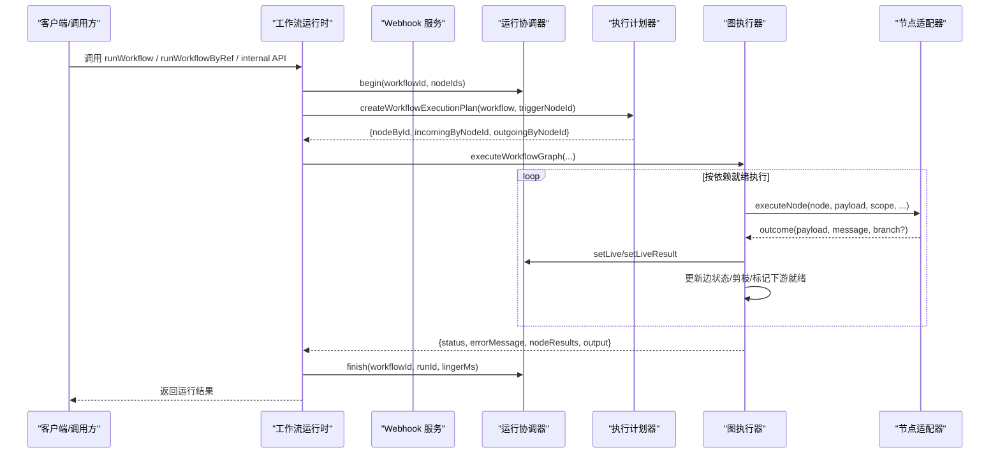
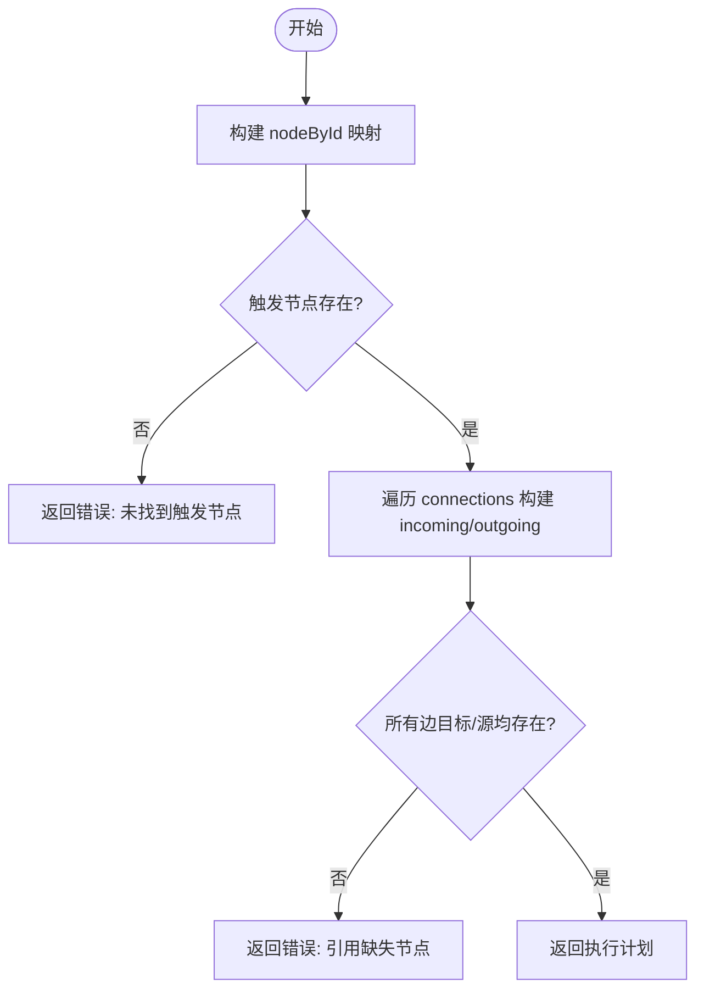
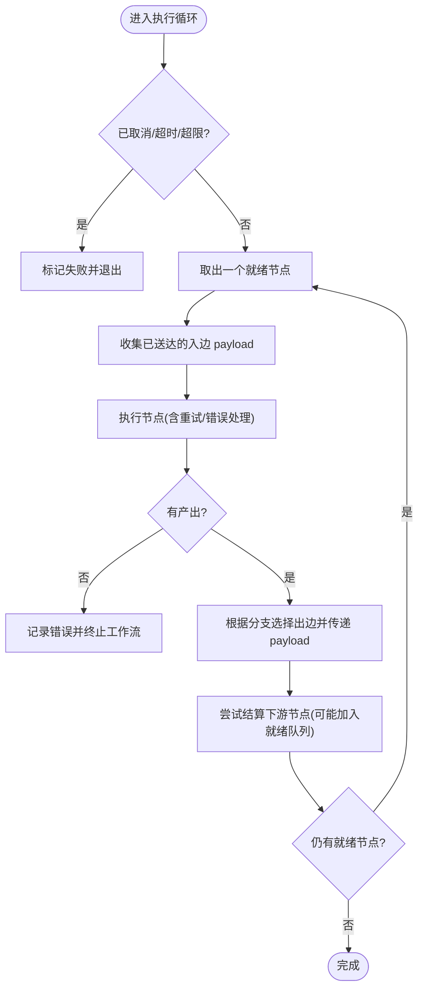
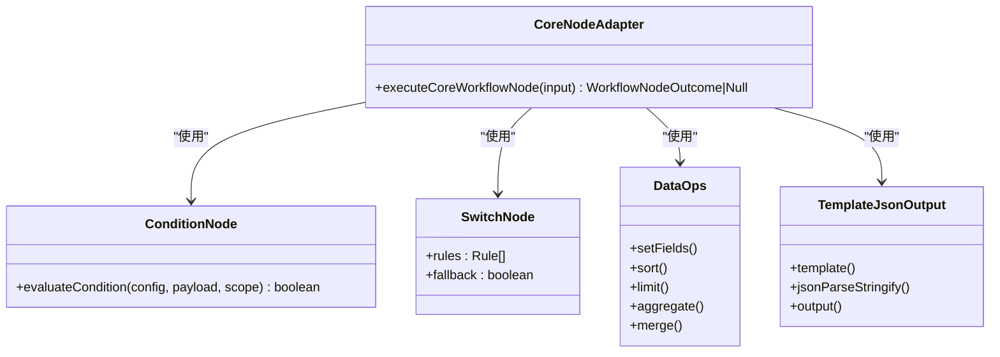
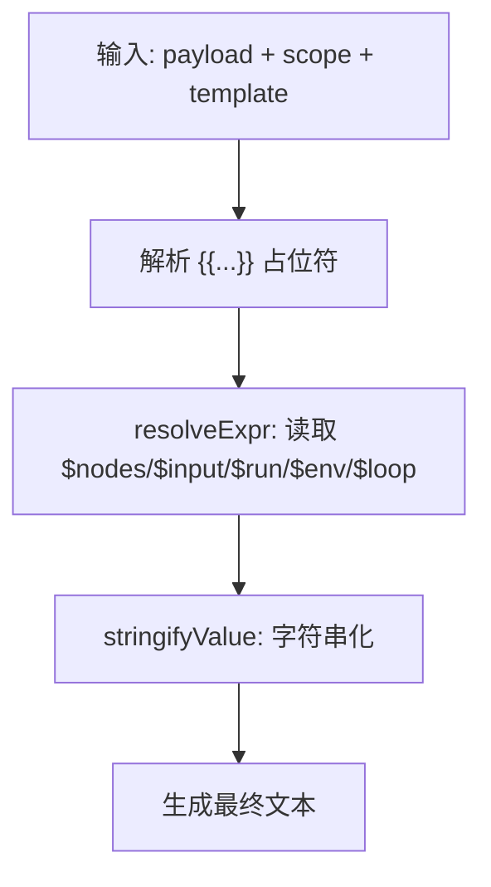
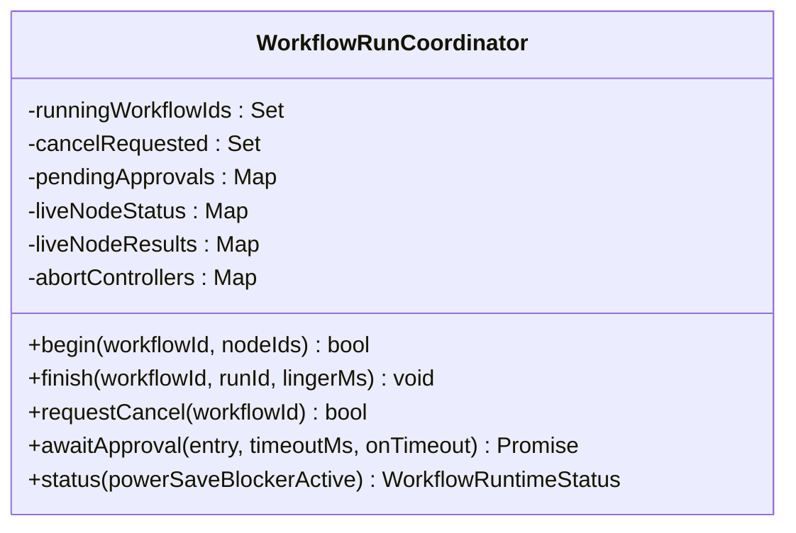
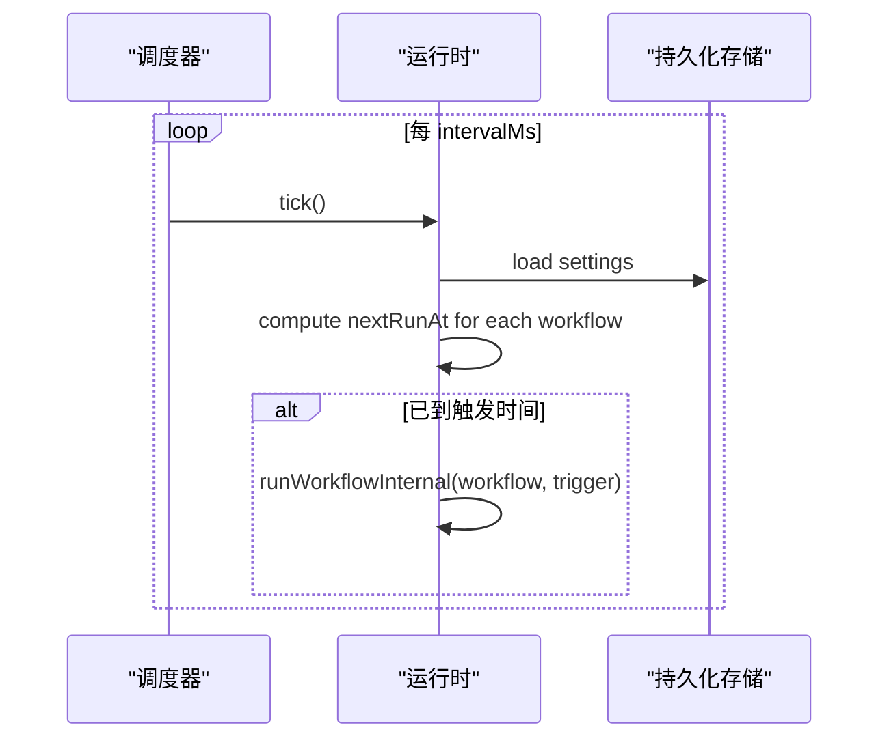
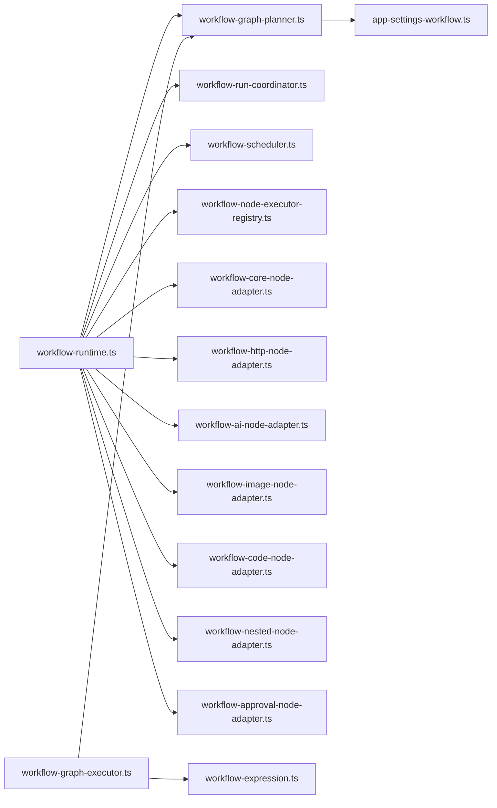
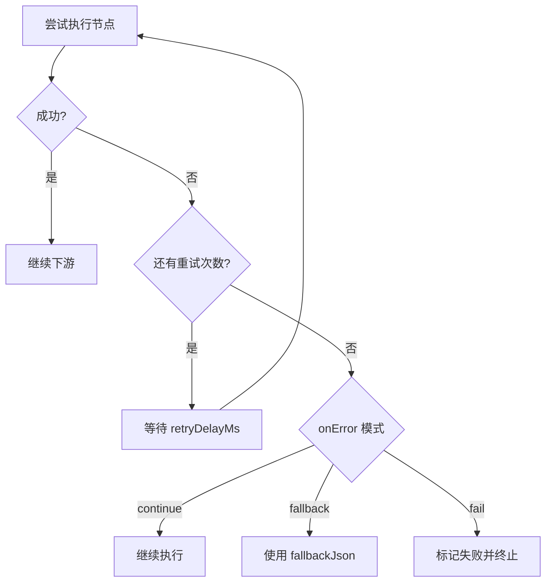

# 工作流编排器

<cite>
**本文引用的文件**
- [workflow-graph-executor.ts](file://src/main/workflow-graph-executor.ts)
- [workflow-graph-planner.ts](file://src/main/workflow-graph-planner.ts)
- [workflow-run-coordinator.ts](file://src/main/workflow-run-coordinator.ts)
- [workflow-scheduler.ts](file://src/main/workflow-scheduler.ts)
- [workflow-core-node-adapter.ts](file://src/main/workflow-core-node-adapter.ts)
- [workflow-expression.ts](file://src/main/workflow-expression.ts)
- [workflow-runtime.ts](file://src/main/workflow-runtime.ts)
- [app-settings-workflow.ts](file://src/shared/app-settings-workflow.ts)
- [workflow-dsl.ts](file://src/shared/workflow-dsl.ts)
</cite>

## 目录
1. [简介](#简介)
2. [项目结构](#项目结构)
3. [核心组件](#核心组件)
4. [架构总览](#架构总览)
5. [详细组件分析](#详细组件分析)
6. [依赖关系分析](#依赖关系分析)
7. [性能与资源管理](#性能与资源管理)
8. [错误处理与可靠性](#错误处理与可靠性)
9. [监控、日志与调试](#监控日志与调试)
10. [版本管理与兼容性](#版本管理与兼容性)
11. [工作流设计模式与实战示例](#工作流设计模式与实战示例)
12. [故障排查指南](#故障排查指南)
13. [结论](#结论)

## 简介
本文件为 DeepSeek-GUI 的工作流编排器提供全面文档，覆盖 DSL 语法与定义格式、执行引擎机制（节点调度、依赖解析、并行控制）、错误处理策略（重试、回退、取消）、资源管理（内存/CPU/网络访问限制）、监控与日志系统、版本管理与兼容性，以及常见设计模式与实战案例。目标是帮助读者从零理解并高效使用工作流编排能力。

## 项目结构
工作流编排器由“运行时入口 + 计划器 + 执行器 + 节点适配器 + 表达式与DSL + 协调器 + 调度器”等模块组成：
- 运行时入口：负责加载配置、启动 Webhook 服务、调度定时任务、对外暴露运行接口。
- 计划器：将工作流图转换为可执行的邻接表结构，校验触发点与连接合法性。
- 执行器：按依赖顺序调度节点，维护边状态、剪枝不可达分支、控制超时与最大执行次数。
- 节点适配器：内置核心节点（条件、过滤、排序、聚合、模板、JSON、输出等）与扩展节点（HTTP、AI、图片、代码、子工作流、审批）。
- 表达式与DSL：支持变量插值、路径取值、环境/循环上下文注入；提供导出/导入的便携文档格式。
- 协调器：统一管理运行生命周期、取消信号、待审批项与实时状态投影。
- 调度器：基于间隔定时器驱动 tick，检查并触发到期的定时工作流。

**图表来源**
- [workflow-runtime.ts:271-324](file://src/main/workflow-runtime.ts#L271-L324)
- [workflow-graph-planner.ts:22-47](file://src/main/workflow-graph-planner.ts#L22-L47)
- [workflow-graph-executor.ts:63-108](file://src/main/workflow-graph-executor.ts#L63-L108)
- [workflow-run-coordinator.ts:14-36](file://src/main/workflow-run-coordinator.ts#L14-L36)
- [workflow-scheduler.ts:7-28](file://src/main/workflow-scheduler.ts#L7-L28)
- [workflow-core-node-adapter.ts:19-30](file://src/main/workflow-core-node-adapter.ts#L19-L30)
- [workflow-expression.ts:3-11](file://src/main/workflow-expression.ts#L3-L11)
- [workflow-dsl.ts:25-47](file://src/shared/workflow-dsl.ts#L25-L47)
- [app-settings-workflow.ts:664-692](file://src/shared/app-settings-workflow.ts#L664-L692)

**章节来源**
- [workflow-runtime.ts:271-324](file://src/main/workflow-runtime.ts#L271-L324)
- [workflow-graph-planner.ts:22-47](file://src/main/workflow-graph-planner.ts#L22-L47)
- [workflow-graph-executor.ts:63-108](file://src/main/workflow-graph-executor.ts#L63-L108)
- [workflow-run-coordinator.ts:14-36](file://src/main/workflow-run-coordinator.ts#L14-L36)
- [workflow-scheduler.ts:7-28](file://src/main/workflow-scheduler.ts#L7-L28)
- [workflow-core-node-adapter.ts:19-30](file://src/main/workflow-core-node-adapter.ts#L19-L30)
- [workflow-expression.ts:3-11](file://src/main/workflow-expression.ts#L3-L11)
- [workflow-dsl.ts:25-47](file://src/shared/workflow-dsl.ts#L25-L47)
- [app-settings-workflow.ts:664-692](file://src/shared/app-settings-workflow.ts#L664-L692)

## 核心组件
- 工作流运行时：统一入口，负责加载设置、启动 Webhook、调度轮询、运行工作流、单节点测试、状态查询与停止。
- 执行计划器：选择触发节点，构建节点映射与入/出边索引，校验连接有效性。
- 图执行器：维护就绪队列、已结算节点、边传递与剪枝、重试与错误处理、超时与最大执行次数保护。
- 节点适配器：实现核心节点逻辑（条件/分支/过滤/排序/聚合/模板/JSON/输出/延迟/合并等），并桥接 HTTP/AI/图片/代码/子工作流/审批等扩展节点。
- 表达式系统：提供 $nodes、$input、$run、$env、$loop.* 等上下文解析与模板插值，支持条件求值。
- 运行协调器：跟踪运行中工作流、取消请求、待审批、实时节点状态与结果投影，提供清理与状态快照。
- 调度器：以固定间隔触发 tick，计算下次运行时间并触发到期任务。
- DSL：导出/导入工作流快照，剥离敏感信息，兼容裸工作流对象或包装文档。

**章节来源**
- [workflow-runtime.ts:271-324](file://src/main/workflow-runtime.ts#L271-L324)
- [workflow-graph-planner.ts:22-47](file://src/main/workflow-graph-planner.ts#L22-L47)
- [workflow-graph-executor.ts:63-108](file://src/main/workflow-graph-executor.ts#L63-L108)
- [workflow-core-node-adapter.ts:32-149](file://src/main/workflow-core-node-adapter.ts#L32-L149)
- [workflow-expression.ts:33-64](file://src/main/workflow-expression.ts#L33-L64)
- [workflow-run-coordinator.ts:14-36](file://src/main/workflow-run-coordinator.ts#L14-L36)
- [workflow-scheduler.ts:7-28](file://src/main/workflow-scheduler.ts#L7-L28)
- [workflow-dsl.ts:25-47](file://src/shared/workflow-dsl.ts#L25-L47)

## 架构总览
下图展示了从外部触发到节点执行、再到结果输出的整体流程，包括 Webhook、内部 API、调度器与图执行器的协作。

**图表来源**
- [workflow-runtime.ts:475-571](file://src/main/workflow-runtime.ts#L475-L571)
- [workflow-graph-planner.ts:22-47](file://src/main/workflow-graph-planner.ts#L22-L47)
- [workflow-graph-executor.ts:63-108](file://src/main/workflow-graph-executor.ts#L63-L108)
- [workflow-run-coordinator.ts:28-52](file://src/main/workflow-run-coordinator.ts#L28-L52)

## 详细组件分析

### 执行计划器：节点与连接建模
- 功能：选择触发节点（优先启用），构建节点 ID 到节点的映射，以及每个节点的入/出边集合。
- 校验：若触发节点不存在或连接引用了不存在的节点，返回错误。
- 复杂度：O(N+E)，N 为节点数，E 为连接数。

**图表来源**
- [workflow-graph-planner.ts:22-47](file://src/main/workflow-graph-planner.ts#L22-L47)

**章节来源**
- [workflow-graph-planner.ts:22-47](file://src/main/workflow-graph-planner.ts#L22-L47)

### 图执行器：依赖解析、并行控制与错误处理
- 依赖解析：通过入边集合判断节点是否全部输入已送达，满足则加入就绪队列。
- 并行控制：当前实现为单线程队列式推进；通过“边剪枝”避免无效分支执行。
- 安全边界：最大运行时长、最大节点执行次数、取消信号。
- 重试与回退：支持 per-node 重试次数与延迟；onError 支持 continue/fallback，fallback 可指定默认 JSON。
- 输出传播：根据 outcome.branch/sourceHandle 决定走哪条出边，并将 payload 沿边传递。

**图表来源**
- [workflow-graph-executor.ts:139-298](file://src/main/workflow-graph-executor.ts#L139-L298)

**章节来源**
- [workflow-graph-executor.ts:63-108](file://src/main/workflow-graph-executor.ts#L63-L108)
- [workflow-graph-executor.ts:139-298](file://src/main/workflow-graph-executor.ts#L139-L298)

### 核心节点适配器：内置节点能力
- 触发器：manual/schedule/webhook 透传 payload。
- 条件/开关/过滤：基于表达式与比较操作符进行分支或过滤。
- 数据变换：set-fields、sort、limit、aggregate、merge、template、json、output、delay。
- 输出：text/json/auto 三种模式，支持 jsonPath 提取。

**图表来源**
- [workflow-core-node-adapter.ts:32-149](file://src/main/workflow-core-node-adapter.ts#L32-L149)
- [workflow-expression.ts:81-105](file://src/main/workflow-expression.ts#L81-L105)

**章节来源**
- [workflow-core-node-adapter.ts:32-149](file://src/main/workflow-core-node-adapter.ts#L32-L149)
- [workflow-expression.ts:81-105](file://src/main/workflow-expression.ts#L81-L105)

### 表达式系统与 DSL
- 表达式：支持 $nodes.<id>.json/text/path、$input.*、$run.*、$env.*、$loop.index/item/total。
- 插值：{{ expr }} 模板替换，自动序列化未知类型。
- DSL 导出/导入：导出时剥离 secret、禁用运行态字段；导入支持包装文档或裸工作流对象，并进行归一化。

**图表来源**
- [workflow-expression.ts:33-64](file://src/main/workflow-expression.ts#L33-L64)
- [workflow-dsl.ts:25-47](file://src/shared/workflow-dsl.ts#L25-L47)

**章节来源**
- [workflow-expression.ts:33-64](file://src/main/workflow-expression.ts#L33-L64)
- [workflow-dsl.ts:25-47](file://src/shared/workflow-dsl.ts#L25-L47)

### 运行协调器：生命周期与实时状态
- 运行开始/结束：维护 running 集合、AbortController、live 状态与结果 Map，并在结束后延迟清理。
- 取消：集中取消所有运行中的工作流，拒绝待审批项。
- 审批：支持等待审批并超时处理。
- 状态快照：提供运行中工作流 ID、节点状态与结果的视图。

**图表来源**
- [workflow-run-coordinator.ts:14-145](file://src/main/workflow-run-coordinator.ts#L14-L145)

**章节来源**
- [workflow-run-coordinator.ts:14-145](file://src/main/workflow-run-coordinator.ts#L14-L145)

### 调度器与定时任务
- 调度器：以固定间隔触发 tick，立即执行一次并周期性执行。
- 运行时：扫描启用的工作流，计算 nextRunAt（支持 interval/daily/at/cron），到期后触发运行。
- Cron 解析：仅支持分钟级精度的简单 cron 字段（* , - /）。

**图表来源**
- [workflow-scheduler.ts:7-28](file://src/main/workflow-scheduler.ts#L7-L28)
- [workflow-runtime.ts:728-747](file://src/main/workflow-runtime.ts#L728-L747)
- [workflow-runtime.ts:161-194](file://src/main/workflow-runtime.ts#L161-L194)

**章节来源**
- [workflow-scheduler.ts:7-28](file://src/main/workflow-scheduler.ts#L7-L28)
- [workflow-runtime.ts:728-747](file://src/main/workflow-runtime.ts#L728-L747)
- [workflow-runtime.ts:161-194](file://src/main/workflow-runtime.ts#L161-L194)

## 依赖关系分析
- 运行时依赖计划器、协调器、调度器、节点注册表与各类节点适配器。
- 图执行器依赖计划器与表达式系统，并通过回调执行具体节点。
- 配置归一化在共享层完成，确保工作流结构与字段合法。
- DSL 层对运行时无侵入，仅用于导入导出。

**图表来源**
- [workflow-runtime.ts:271-324](file://src/main/workflow-runtime.ts#L271-L324)
- [workflow-graph-executor.ts:63-108](file://src/main/workflow-graph-executor.ts#L63-L108)
- [workflow-graph-planner.ts:22-47](file://src/main/workflow-graph-planner.ts#L22-L47)
- [app-settings-workflow.ts:664-692](file://src/shared/app-settings-workflow.ts#L664-L692)

**章节来源**
- [workflow-runtime.ts:271-324](file://src/main/workflow-runtime.ts#L271-L324)
- [workflow-graph-executor.ts:63-108](file://src/main/workflow-graph-executor.ts#L63-L108)
- [workflow-graph-planner.ts:22-47](file://src/main/workflow-graph-planner.ts#L22-L47)
- [app-settings-workflow.ts:664-692](file://src/shared/app-settings-workflow.ts#L664-L692)

## 性能与资源管理
- 执行上限：
  - 单次运行最大节点执行次数：防止无限循环或爆炸性图。
  - 单次运行最大时长：防止长时间占用资源。
- 并发与并行：
  - 当前图执行器为单队列推进；可通过“loop.execution=parallel”与“concurrency”在子工作流层面控制并行度。
- 内存与 CPU：
  - 节点内代码执行建议使用沙箱或限制执行时长；大对象建议通过文件/外部服务处理。
  - 聚合/排序/合并等操作会创建中间数组/对象，注意数据规模。
- 网络访问控制：
  - Webhook 服务绑定本地回环地址，避免外网暴露；支持可选密钥校验。
  - HTTP 节点支持超时与头部限制，避免慢/恶意响应。
- 配额与限流：
  - 连接数、HTTP 头数量、预设/模块数量均有上限，防止配置膨胀。

**章节来源**
- [workflow-graph-executor.ts:26-28](file://src/main/workflow-graph-executor.ts#L26-L28)
- [workflow-graph-executor.ts:139-155](file://src/main/workflow-graph-executor.ts#L139-L155)
- [app-settings-workflow.ts:51-55](file://src/shared/app-settings-workflow.ts#L51-L55)
- [app-settings-workflow.ts:601-623](file://src/shared/app-settings-workflow.ts#L601-L623)
- [workflow-runtime.ts:326-350](file://src/main/workflow-runtime.ts#L326-L350)
- [workflow-runtime.ts:360-432](file://src/main/workflow-runtime.ts#L360-L432)

## 错误处理与可靠性
- 重试机制：节点级别 retries 与 retryDelayMs，支持指数退避（由上层策略或节点实现决定）。
- 错误处理模式：
  - continue：继续后续节点，忽略错误。
  - fallback：使用 fallbackJson 作为替代输出。
- 取消与中断：
  - 支持 AbortSignal 与 isCanceled 检查，可在节点执行期间中断。
- 超时与保护：
  - 工作流最大运行时长与最大节点执行次数保护。
- 审批与阻塞：
  - human-approval 节点可暂停执行，等待外部决策或超时处理。

**图表来源**
- [workflow-graph-executor.ts:189-244](file://src/main/workflow-graph-executor.ts#L189-L244)
- [workflow-graph-executor.ts:213-227](file://src/main/workflow-graph-executor.ts#L213-L227)

**章节来源**
- [workflow-graph-executor.ts:189-244](file://src/main/workflow-graph-executor.ts#L189-L244)
- [workflow-graph-executor.ts:213-227](file://src/main/workflow-graph-executor.ts#L213-L227)

## 监控、日志与调试
- 实时状态：协调器维护每个运行中工作流的节点状态与结果，供 UI 订阅。
- 日志与错误：运行时在 Webhook 与关键路径上记录错误；执行器在失败时记录工作流 ID 与消息。
- 调试工具：
  - 单节点测试：testNode 方法可对任意非触发节点进行隔离测试，返回结果与错误。
  - 表达式与插值：通过 $nodes/$input/$run/$env/$loop 快速验证数据流。
- 审计与历史：工作流 runs 与节点结果持久化，便于回溯。

**章节来源**
- [workflow-run-coordinator.ts:94-145](file://src/main/workflow-run-coordinator.ts#L94-L145)
- [workflow-runtime.ts:616-726](file://src/main/workflow-runtime.ts#L616-L726)
- [workflow-graph-executor.ts:299-304](file://src/main/workflow-graph-executor.ts#L299-L304)

## 版本管理与兼容性
- DSL 版本：dsv=1，kind=workflow，包含 app 与 exportedAt 元数据。
- 导出：剥离 secret 与运行态字段，默认禁用，便于分享与复用。
- 导入：支持包装文档或裸工作流对象，并进行严格归一化；空节点集视为无效。
- 配置迁移：settings 合并与归一化保证向后兼容，新增字段具备默认值。

**章节来源**
- [workflow-dsl.ts:25-47](file://src/shared/workflow-dsl.ts#L25-L47)
- [workflow-dsl.ts:57-89](file://src/shared/workflow-dsl.ts#L57-L89)
- [app-settings-workflow.ts:726-772](file://src/shared/app-settings-workflow.ts#L726-L772)

## 工作流设计模式与实战示例

### 条件分支与开关
- 使用 condition 节点进行二分支（true/false），或通过 switch 节点多路分支。
- 结合 filter 节点过滤数据流，配合 sort/limit/aggregate 做数据预处理。

**章节来源**
- [workflow-core-node-adapter.ts:46-54](file://src/main/workflow-core-node-adapter.ts#L46-L54)
- [workflow-core-node-adapter.ts:79-82](file://src/main/workflow-core-node-adapter.ts#L79-L82)

### 并行处理
- 使用 loop 节点，设置 execution=parallel 与 concurrency 控制并行度。
- 利用 merge 节点收集多个并行结果（object/array）。

**章节来源**
- [app-settings-workflow.ts:439-456](file://src/shared/app-settings-workflow.ts#L439-L456)
- [workflow-core-node-adapter.ts:55-67](file://src/main/workflow-core-node-adapter.ts#L55-L67)

### 错误处理与补偿
- 节点 onError=fallback 提供默认输出，确保下游稳定。
- 使用 delay 节点实现退避或人工审核前的缓冲。
- 使用 human-approval 节点进行关键步骤的人工确认。

**章节来源**
- [workflow-graph-executor.ts:228-244](file://src/main/workflow-graph-executor.ts#L228-L244)
- [workflow-core-node-adapter.ts:115-117](file://src/main/workflow-core-node-adapter.ts#L115-L117)
- [app-settings-workflow.ts:527-537](file://src/shared/app-settings-workflow.ts#L527-L537)

### 模板与输出
- 使用 template 节点渲染文本或 JSON，output 节点统一输出 text/json/auto。
- 通过 jsonPath 精确提取 JSON 结果。

**章节来源**
- [workflow-core-node-adapter.ts:118-145](file://src/main/workflow-core-node-adapter.ts#L118-L145)

### 实战示例（描述性）
- 数据清洗流水线：webhook-trigger -> set-fields -> sort -> limit -> aggregate -> output。
- 条件路由：schedule-trigger -> condition -> 多条分支分别调用 http-request/ai-agent -> merge -> output。
- 带重试与审批：http-request -> human-approval -> code 节点执行补偿 -> output。

[本节为概念性说明，不直接分析具体文件]

## 故障排查指南
- 工作流无触发：检查是否存在 manual/schedule/webhook 触发节点且未被禁用。
- 连接无效：确保 connections 的 source/target 均存在于 nodes。
- 表达式为空：检查 $nodes/$input/$run/$env/$loop 是否正确引用。
- 超时/超限：检查工作流是否过长或存在死循环；适当拆分或增加并行。
- Webhook 无法访问：确认端口与密钥配置，且服务绑定本地回环。
- 审批卡住：检查 pending approvals 是否已决议或超时。

**章节来源**
- [workflow-graph-planner.ts:22-47](file://src/main/workflow-graph-planner.ts#L22-L47)
- [workflow-graph-executor.ts:139-155](file://src/main/workflow-graph-executor.ts#L139-L155)
- [workflow-runtime.ts:360-432](file://src/main/workflow-runtime.ts#L360-L432)
- [workflow-run-coordinator.ts:107-129](file://src/main/workflow-run-coordinator.ts#L107-L129)

## 结论
DeepSeek-GUI 的工作流编排器提供了完整的 DSL、健壮的执行引擎、灵活的节点适配与完善的运行时管理能力。通过条件分支、并行处理、错误处理与审批机制，能够支撑复杂业务场景。建议在设计与实现中关注资源上限、表达式正确性与错误恢复策略，以获得高可靠与高性能的工作流体验。