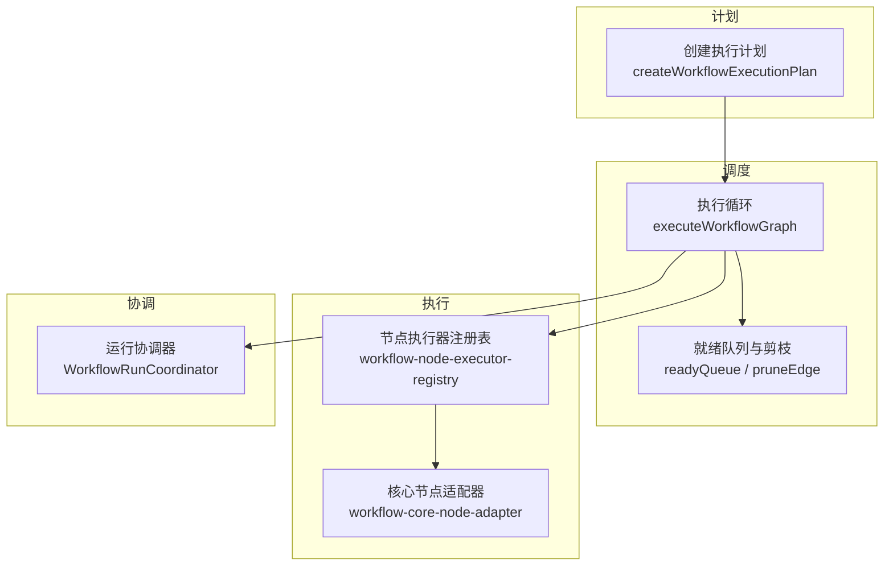
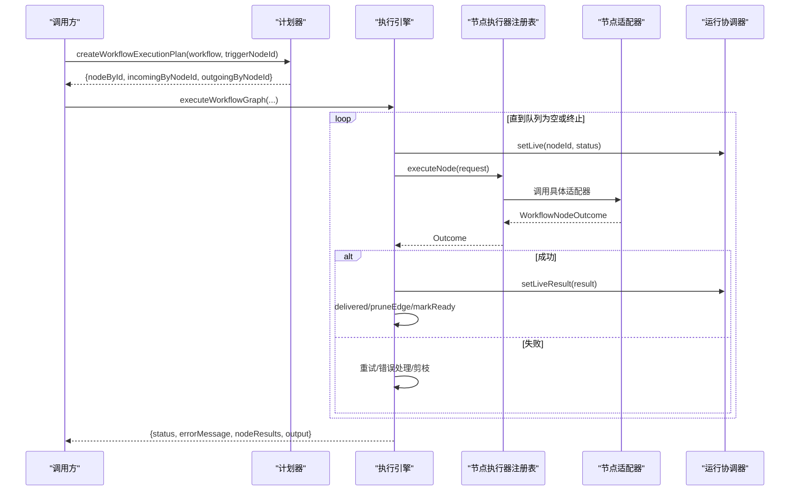
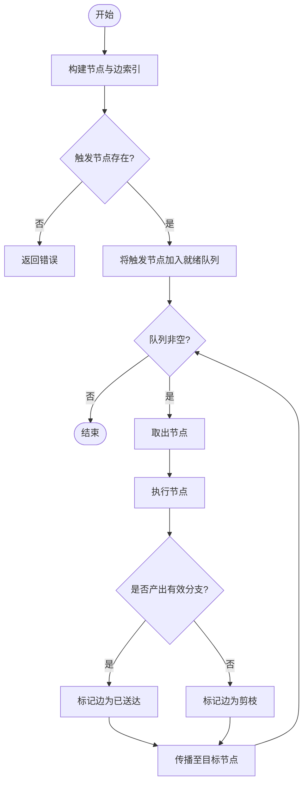
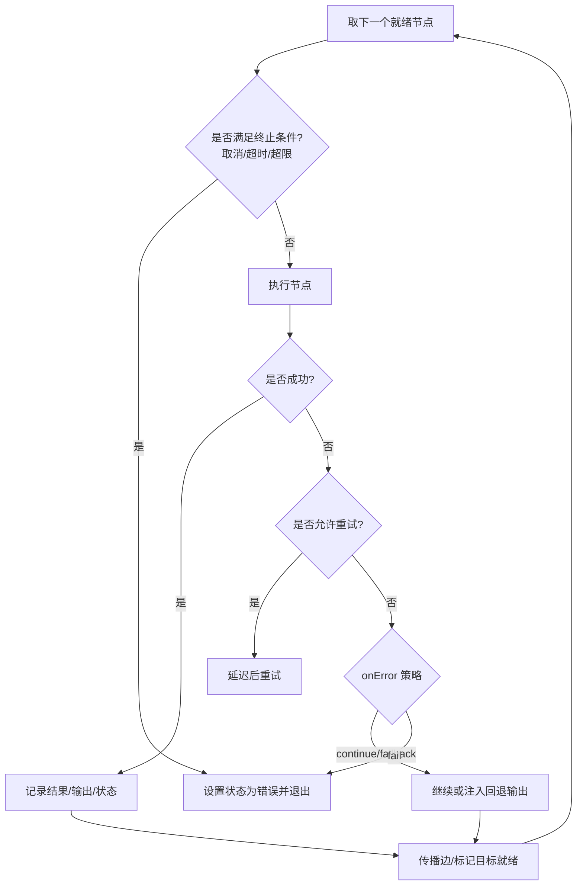
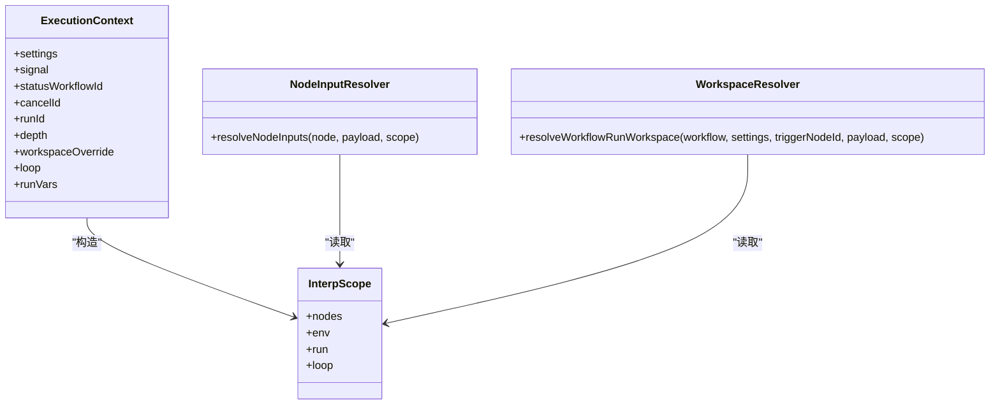
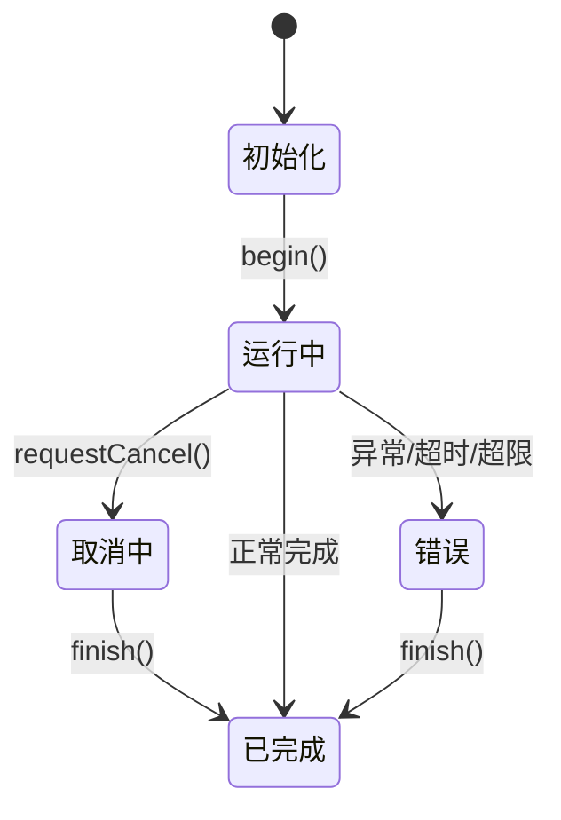
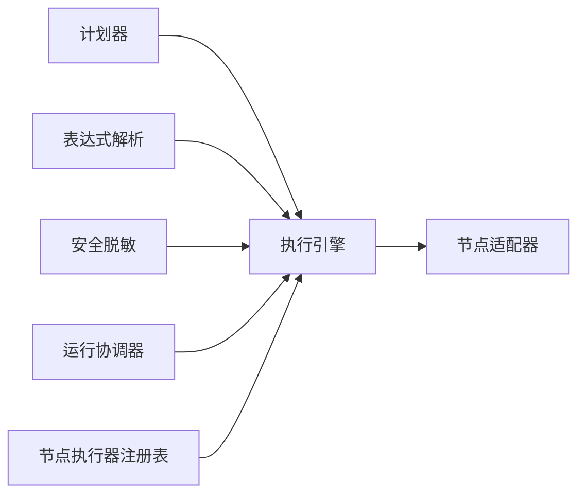

# 执行引擎

<cite>
**本文引用的文件**
- [workflow-graph-executor.ts](file://src/main/workflow-graph-executor.ts)
- [workflow-graph-planner.ts](file://src/main/workflow-graph-planner.ts)
- [workflow-run-coordinator.ts](file://src/main/workflow-run-coordinator.ts)
- [workflow-scheduler.ts](file://src/main/workflow-scheduler.ts)
- [workflow-node-executor-registry.ts](file://src/main/workflow-node-executor-registry.ts)
- [workflow-core-node-adapter.ts](file://src/main/workflow-core-node-adapter.ts)
- [workflow-expression.ts](file://src/main/workflow-expression.ts)
- [workflow-secret-redaction.ts](file://src/main/workflow-secret-redaction.ts)
</cite>

## 目录
1. [简介](#简介)
2. [项目结构](#项目结构)
3. [核心组件](#核心组件)
4. [架构总览](#架构总览)
5. [详细组件分析](#详细组件分析)
6. [依赖关系分析](#依赖关系分析)
7. [性能考虑](#性能考虑)
8. [故障排查指南](#故障排查指南)
9. [结论](#结论)
10. [附录](#附录)

## 简介
本文件面向 DeepSeek-GUI 的工作流执行引擎，系统性说明执行计划生成、节点调度、执行上下文管理、生命周期控制、性能优化与监控调试等关键能力。重点覆盖：
- 执行计划生成：依赖解析、拓扑排序与执行路径优化
- 节点调度算法：就绪队列管理、并行执行控制与资源竞争处理
- 执行上下文：变量作用域、状态传递与内存管理
- 执行生命周期：从触发到完成的全过程控制
- 性能优化：节点缓存、批量处理与超时控制
- 监控与调试：实时状态跟踪与性能指标收集

## 项目结构
工作流执行相关代码主要位于 src/main 目录下，围绕“计划-调度-执行-协调”的层次组织：
- 计划层：将工作流图转换为可执行的邻接表与入/出边索引
- 调度层：基于就绪队列驱动节点执行，支持分支、重试、取消与超时
- 执行层：通过节点执行器注册表分发到具体节点适配器
- 协调层：统一维护运行期状态、取消信号、审批与实时结果

图表来源
- [workflow-graph-planner.ts:22-47](file://src/main/workflow-graph-planner.ts#L22-L47)
- [workflow-graph-executor.ts:63-305](file://src/main/workflow-graph-executor.ts#L63-L305)
- [workflow-node-executor-registry.ts](file://src/main/workflow-node-executor-registry.ts)
- [workflow-core-node-adapter.ts](file://src/main/workflow-core-node-adapter.ts)
- [workflow-run-coordinator.ts:14-145](file://src/main/workflow-run-coordinator.ts#L14-L145)

章节来源
- [workflow-graph-planner.ts:22-47](file://src/main/workflow-graph-planner.ts#L22-L47)
- [workflow-graph-executor.ts:63-305](file://src/main/workflow-graph-executor.ts#L63-L305)
- [workflow-run-coordinator.ts:14-145](file://src/main/workflow-run-coordinator.ts#L14-L145)

## 核心组件
- 执行计划器：负责构建节点映射、入/出边索引，并校验连接有效性
- 执行引擎：实现基于就绪队列的拓扑驱动执行，支持分支选择、重试、错误处理、剪枝与终止条件
- 节点执行器注册表：按节点类型路由到具体适配器（如 HTTP、代码、图片、嵌套等）
- 运行协调器：集中管理运行实例、取消、审批、实时状态与结果投影
- 表达式与环境：提供变量插值、作用域隔离、环境变量与工作区解析
- 安全脱敏：对日志与输出中的敏感信息进行遮蔽

章节来源
- [workflow-graph-planner.ts:22-47](file://src/main/workflow-graph-planner.ts#L22-L47)
- [workflow-graph-executor.ts:63-305](file://src/main/workflow-graph-executor.ts#L63-L305)
- [workflow-node-executor-registry.ts](file://src/main/workflow-node-executor-registry.ts)
- [workflow-run-coordinator.ts:14-145](file://src/main/workflow-run-coordinator.ts#L14-L145)
- [workflow-expression.ts](file://src/main/workflow-expression.ts)
- [workflow-secret-redaction.ts](file://src/main/workflow-secret-redaction.ts)

## 架构总览
执行引擎采用“计划-调度-执行-协调”的分层架构，强调无锁单写者模式与事件化状态更新：
- 计划阶段：将工作流图转为邻接表，建立入/出边索引，便于快速判定就绪与传播
- 调度阶段：使用 FIFO 就绪队列驱动执行，结合“已送达边集合”和“剪枝边集合”避免重复计算
- 执行阶段：通过注册表分派到具体节点适配器；每个节点执行封装为带重试与错误处理的单元
- 协调阶段：统一管理运行实例的生命周期、取消信号、审批等待与实时状态投影

图表来源
- [workflow-graph-planner.ts:22-47](file://src/main/workflow-graph-planner.ts#L22-L47)
- [workflow-graph-executor.ts:63-305](file://src/main/workflow-graph-executor.ts#L63-L305)
- [workflow-node-executor-registry.ts](file://src/main/workflow-node-executor-registry.ts)
- [workflow-core-node-adapter.ts](file://src/main/workflow-core-node-adapter.ts)
- [workflow-run-coordinator.ts:94-105](file://src/main/workflow-run-coordinator.ts#L94-L105)

## 详细组件分析

### 执行计划生成：依赖解析、拓扑排序与执行路径优化
- 依赖解析：遍历 connections，构建 nodeById、incomingByNodeId、outgoingByNodeId 三个索引，用于 O(1) 查询节点的入/出边
- 拓扑排序：不显式生成全序序列，而是以“所有入边均已送达”作为就绪条件，动态推进
- 执行路径优化：
  - 分支选择：根据节点返回的 branch/sourceHandle 决定哪些出边被送达，其余边进入剪枝集合
  - 剪枝传播：当某条边被剪枝时，递归标记其目标节点为不可达，避免无效执行
  - 去重与短路：使用 delivered 与 prunedEdges 集合避免重复计算与死循环

图表来源
- [workflow-graph-planner.ts:22-47](file://src/main/workflow-graph-planner.ts#L22-L47)
- [workflow-graph-executor.ts:117-134](file://src/main/workflow-graph-executor.ts#L117-L134)
- [workflow-graph-executor.ts:287-298](file://src/main/workflow-graph-executor.ts#L287-L298)

章节来源
- [workflow-graph-planner.ts:22-47](file://src/main/workflow-graph-planner.ts#L22-L47)
- [workflow-graph-executor.ts:117-134](file://src/main/workflow-graph-executor.ts#L117-L134)
- [workflow-graph-executor.ts:287-298](file://src/main/workflow-graph-executor.ts#L287-L298)

### 节点调度算法：就绪队列管理、并行执行控制与资源竞争处理
- 就绪队列管理：FIFO 队列 + settledNodes 去重，确保每个节点仅执行一次
- 并行执行控制：当前实现为串行调度；可通过并发策略扩展（例如限制最大并发度、按资源分组）
- 资源竞争处理：
  - 取消信号：AbortSignal 与 isCanceled 检查在每轮循环与节点执行前后进行
  - 超时保护：全局最大运行时长与最大节点执行次数限制
  - 重试与退避：节点级 retries 与 retryDelayMs 控制
  - 错误处理：onError 支持 fail/continue/fallback，fallback 可注入默认输出

图表来源
- [workflow-graph-executor.ts:139-156](file://src/main/workflow-graph-executor.ts#L139-L156)
- [workflow-graph-executor.ts:193-245](file://src/main/workflow-graph-executor.ts#L193-L245)
- [workflow-graph-executor.ts:287-298](file://src/main/workflow-graph-executor.ts#L287-L298)

章节来源
- [workflow-graph-executor.ts:139-156](file://src/main/workflow-graph-executor.ts#L139-L156)
- [workflow-graph-executor.ts:193-245](file://src/main/workflow-graph-executor.ts#L193-L245)
- [workflow-graph-executor.ts:287-298](file://src/main/workflow-graph-executor.ts#L287-L298)

### 执行上下文管理：变量作用域、状态传递与内存管理
- 变量作用域：
  - 环境作用域：resolveWorkflowEnv 将工作流 env 解析为键值对
  - 运行作用域：runVars 跨节点共享，loop 提供循环上下文
  - 节点输入作用域：resolveNodeInputs 将上游输出绑定到节点输入键，支持类型强制转换
- 状态传递：
  - 节点输出通过 payload 沿边传递，同时维护 nodeOutputs 供后续表达式引用
  - 工作区解析：resolveWorkflowRunWorkspace 根据触发器配置与工作区设置确定运行工作区
- 内存管理：
  - 使用 Map/Set 存储中间状态，避免重复计算
  - 结果与状态通过协调器集中管理，并在完成后延迟清理

图表来源
- [workflow-graph-executor.ts:36-61](file://src/main/workflow-graph-executor.ts#L36-L61)
- [workflow-graph-executor.ts:327-343](file://src/main/workflow-graph-executor.ts#L327-L343)
- [workflow-graph-executor.ts:345-373](file://src/main/workflow-graph-executor.ts#L345-L373)
- [workflow-expression.ts](file://src/main/workflow-expression.ts)

章节来源
- [workflow-graph-executor.ts:36-61](file://src/main/workflow-graph-executor.ts#L36-L61)
- [workflow-graph-executor.ts:327-343](file://src/main/workflow-graph-executor.ts#L327-L343)
- [workflow-graph-executor.ts:345-373](file://src/main/workflow-graph-executor.ts#L345-L373)
- [workflow-expression.ts](file://src/main/workflow-expression.ts)

### 执行生命周期：从触发到完成的全过程控制
- 启动：begin 初始化运行集、取消集合、AbortController 与实时状态容器
- 运行：executeWorkflowGraph 驱动执行循环，持续更新节点状态与结果
- 取消：requestCancel 设置取消标志并触发 AbortController，中断待处理审批
- 完成：finish 延迟清理运行时数据，释放资源
- 审批：awaitApproval 支持超时与外部决议，resolveApproval 完成审批流程

图表来源
- [workflow-run-coordinator.ts:24-52](file://src/main/workflow-run-coordinator.ts#L24-L52)
- [workflow-run-coordinator.ts:69-92](file://src/main/workflow-run-coordinator.ts#L69-L92)
- [workflow-run-coordinator.ts:107-129](file://src/main/workflow-run-coordinator.ts#L107-L129)

章节来源
- [workflow-run-coordinator.ts:24-52](file://src/main/workflow-run-coordinator.ts#L24-L52)
- [workflow-run-coordinator.ts:69-92](file://src/main/workflow-run-coordinator.ts#L69-L92)
- [workflow-run-coordinator.ts:107-129](file://src/main/workflow-run-coordinator.ts#L107-L129)

### 节点适配器与执行器注册表
- 注册表职责：按节点类型查找并调用对应适配器，屏蔽具体实现差异
- 常见适配器：HTTP、代码、图片、嵌套、审批、核心等
- 执行契约：统一接收请求参数，返回标准化 Outcome（payload、message、threadId 等）

章节来源
- [workflow-node-executor-registry.ts](file://src/main/workflow-node-executor-registry.ts)
- [workflow-core-node-adapter.ts](file://src/main/workflow-core-node-adapter.ts)

### 定时调度器
- 用途：周期性触发 tick，常用于定时触发器或后台巡检
- 特性：start/stop/isStarted 管理定时器生命周期，unref 避免阻塞进程退出

章节来源
- [workflow-scheduler.ts:1-29](file://src/main/workflow-scheduler.ts#L1-L29)

## 依赖关系分析
- 计划器依赖工作流定义，输出执行计划
- 执行引擎依赖计划器、表达式解析、安全脱敏、协调器与节点执行器注册表
- 协调器独立于执行细节，仅提供运行期状态与取消能力
- 节点适配器由注册表按需加载，降低耦合

图表来源
- [workflow-graph-planner.ts:22-47](file://src/main/workflow-graph-planner.ts#L22-L47)
- [workflow-graph-executor.ts:63-305](file://src/main/workflow-graph-executor.ts#L63-L305)
- [workflow-run-coordinator.ts:14-145](file://src/main/workflow-run-coordinator.ts#L14-L145)
- [workflow-node-executor-registry.ts](file://src/main/workflow-node-executor-registry.ts)

章节来源
- [workflow-graph-planner.ts:22-47](file://src/main/workflow-graph-planner.ts#L22-L47)
- [workflow-graph-executor.ts:63-305](file://src/main/workflow-graph-executor.ts#L63-L305)
- [workflow-run-coordinator.ts:14-145](file://src/main/workflow-run-coordinator.ts#L14-L145)
- [workflow-node-executor-registry.ts](file://src/main/workflow-node-executor-registry.ts)

## 性能考虑
- 节点缓存：通过 nodeOutputs 与 delivered/prunedEdges 避免重复计算与无效执行
- 批量处理：可在上层对多个工作流或批任务进行聚合调度（当前引擎聚焦单工作流）
- 超时控制：
  - 全局最大运行时长：MAX_RUN_DURATION_MS
  - 最大节点执行次数：MAX_NODE_EXECUTIONS
  - 节点级重试与退避：retries 与 retryDelayMs
- 内存管理：Map/Set 结构高效存取；完成后延迟清理，减少频繁 GC 压力
- 安全与日志：对敏感信息脱敏，降低日志体积与泄露风险

[本节为通用指导，不直接分析具体文件]

## 故障排查指南
- 常见问题定位
  - 触发节点不存在：检查 plan 构建阶段的触发节点校验
  - 连接引用缺失节点：检查 connections 的 source/target 是否均在 nodes 中
  - 无限循环或卡死：检查分支逻辑与剪枝是否正确，确认 delivered/prunedEdges 更新
  - 超时或超限：调整 MAX_RUN_DURATION_MS 与 MAX_NODE_EXECUTIONS，或优化节点耗时
  - 取消未生效：确认 isCanceled 与 AbortSignal 在关键路径被检查
- 监控与调试
  - 实时状态：通过协调器的 liveNodeStatus/liveNodeResults 获取节点状态与结果
  - 审批流程：使用 awaitApproval/resolveApproval 追踪审批令牌与超时
  - 日志脱敏：利用 secret redaction 查看脱敏后的输入输出，辅助定位问题

章节来源
- [workflow-graph-planner.ts:22-47](file://src/main/workflow-graph-planner.ts#L22-L47)
- [workflow-graph-executor.ts:139-156](file://src/main/workflow-graph-executor.ts#L139-L156)
- [workflow-graph-executor.ts:193-245](file://src/main/workflow-graph-executor.ts#L193-L245)
- [workflow-run-coordinator.ts:94-105](file://src/main/workflow-run-coordinator.ts#L94-L105)
- [workflow-run-coordinator.ts:107-129](file://src/main/workflow-run-coordinator.ts#L107-L129)

## 结论
DeepSeek-GUI 的工作流执行引擎以“计划-调度-执行-协调”为核心架构，实现了高内聚、低耦合的执行模型。通过依赖解析与动态就绪推进，避免了复杂的静态拓扑排序；借助剪枝与分支选择，显著减少了无效执行。配合统一的运行协调器，提供了可靠的取消、审批与实时状态能力。在性能方面，通过缓存、超时与重试机制保障稳定性与效率。未来可扩展并行执行、资源配额与更细粒度的监控指标。

[本节为总结性内容，不直接分析具体文件]

## 附录
- 关键函数与路径参考
  - 创建执行计划：[workflow-graph-planner.ts:22-47](file://src/main/workflow-graph-planner.ts#L22-L47)
  - 执行主循环：[workflow-graph-executor.ts:63-305](file://src/main/workflow-graph-executor.ts#L63-L305)
  - 节点输入解析与作用域：[workflow-graph-executor.ts:327-343](file://src/main/workflow-graph-executor.ts#L327-L343)
  - 工作区解析：[workflow-graph-executor.ts:358-373](file://src/main/workflow-graph-executor.ts#L358-L373)
  - 运行协调器：[workflow-run-coordinator.ts:14-145](file://src/main/workflow-run-coordinator.ts#L14-L145)
  - 定时调度器：[workflow-scheduler.ts:1-29](file://src/main/workflow-scheduler.ts#L1-L29)

[本节为索引性内容，不直接分析具体文件]