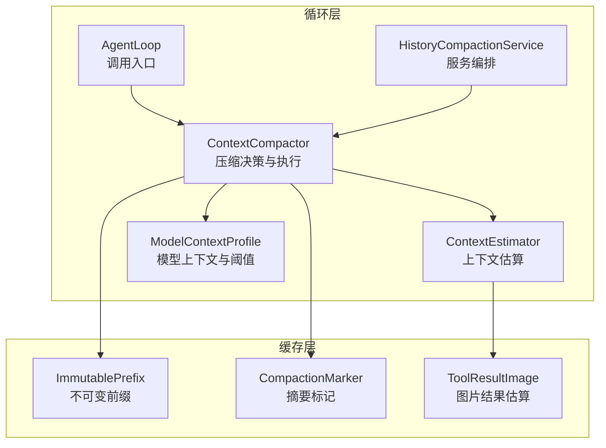
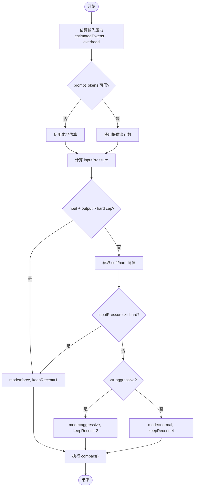
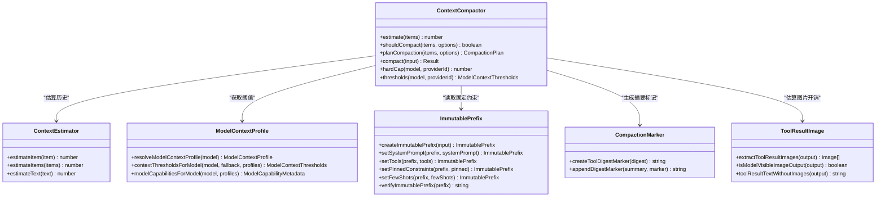

# 上下文压缩与管理

<cite>
**本文引用的文件**
- [context-compactor.ts](file://kun/src/loop/context-compactor.ts)
- [context-estimator.ts](file://kun/src/loop/context-estimator.ts)
- [model-context-profile.ts](file://kun/src/loop/model-context-profile.ts)
- [immutable-prefix.ts](file://kun/src/cache/immutable-prefix.ts)
- [compaction-marker.ts](file://kun/src/loop/compaction-marker.ts)
- [tool-result-image.ts](file://kun/src/loop/tool-result-image.ts)
- [item.ts](file://kun/src/domain/item.ts)
- [composer-context.ts](file://kun/src/contracts/composer-context.ts)
- [agent-loop.ts](file://kun/src/loop/agent-loop.ts)
- [history-compaction-service.ts](file://kun/src/loop/history-compaction-service.ts)
- [README.md](file://kun/README.md)
</cite>

## 目录
1. [简介](#简介)
2. [项目结构](#项目结构)
3. [核心组件](#核心组件)
4. [架构总览](#架构总览)
5. [详细组件分析](#详细组件分析)
6. [依赖关系分析](#依赖关系分析)
7. [性能考量](#性能考量)
8. [故障排查指南](#故障排查指南)
9. [结论](#结论)
10. [附录：配置与使用示例](#附录配置与使用示例)

## 简介
本文件系统性说明 DeepSeek-GUI 的上下文压缩与管理机制，重点覆盖以下方面：
- ContextCompactor 的实现原理：历史消息压缩算法、上下文窗口优化策略、内存使用控制。
- 上下文配置文件的作用：不同模型的最佳上下文设置、压缩阈值配置、性能调优参数。
- 不可变前缀机制：缓存优化、数据一致性保证、版本管理策略。
- 上下文压缩生命周期：触发条件、压缩过程、结果验证。
- 上下文恢复机制：检查点保存、状态重建、错误恢复。
- 最佳实践：性能优化建议与常见问题解决方案。
- 实际使用示例与配置指南。

## 项目结构
围绕上下文压缩的关键代码集中在 kun/src/loop 与 kun/src/cache 两个目录：
- loop：包含上下文估算、压缩决策、压缩执行、模型能力与阈值配置等。
- cache：提供不可变前缀（ImmutablePrefix）用于系统提示、工具定义、少量示例和固定约束的稳定指纹与变更追踪。



图表来源
- [agent-loop.ts:250-270](file://kun/src/loop/agent-loop.ts#L250-L270)
- [context-compactor.ts:81-115](file://kun/src/loop/context-compactor.ts#L81-L115)
- [context-estimator.ts:21-41](file://kun/src/loop/context-estimator.ts#L21-L41)
- [model-context-profile.ts:100-196](file://kun/src/loop/model-context-profile.ts#L100-L196)
- [immutable-prefix.ts:101-119](file://kun/src/cache/immutable-prefix.ts#L101-L119)

章节来源
- [agent-loop.ts:250-270](file://kun/src/loop/agent-loop.ts#L250-L270)
- [context-compactor.ts:81-115](file://kun/src/loop/context-compactor.ts#L81-L115)
- [context-estimator.ts:21-41](file://kun/src/loop/context-estimator.ts#L21-L41)
- [model-context-profile.ts:100-196](file://kun/src/loop/model-context-profile.ts#L100-L196)
- [immutable-prefix.ts:101-119](file://kun/src/cache/immutable-prefix.ts#L101-L119)

## 核心组件
- ContextCompactor：负责判断是否需要压缩、选择压缩模式（normal/aggressive/force）、执行压缩并生成摘要项，同时保留不可变前缀中的固定约束。
- ContextEstimator：对历史消息进行 token 估算，考虑 CJK 字符、ASCII 打包比例以及工具结果中的图片开销。
- ModelContextProfile：维护各模型的上下文窗口、软/硬阈值、能力元数据；提供按模型解析阈值的统一接口。
- ImmutablePrefix：封装系统提示、工具定义、固定约束、few-shot 示例，并提供稳定指纹与版本号，支持只读变更与漂移检测。
- CompactionMarker：为压缩摘要附加源摘要标记，便于后续校验与去重。
- ToolResultImage：识别工具结果中的图片并估算其 token 成本，避免 base64 膨胀导致的误判。

章节来源
- [context-compactor.ts:81-115](file://kun/src/loop/context-compactor.ts#L81-L115)
- [context-estimator.ts:21-41](file://kun/src/loop/context-estimator.ts#L21-L41)
- [model-context-profile.ts:100-196](file://kun/src/loop/model-context-profile.ts#L100-L196)
- [immutable-prefix.ts:101-119](file://kun/src/cache/immutable-prefix.ts#L101-L119)
- [compaction-marker.ts:1-50](file://kun/src/loop/compaction-marker.ts#L1-L50)
- [tool-result-image.ts:1-50](file://kun/src/loop/tool-result-image.ts#L1-L50)

## 架构总览
上下文压缩在 Agent 循环中被调度：当历史增长或请求预算逼近限制时，由 HistoryCompactionService 协调 ContextCompactor 进行压缩；压缩过程中通过 ContextEstimator 估算 token，结合 ModelContextProfile 提供的阈值做出决策；压缩结果以“压缩摘要项”插入历史，同时保留最近若干条消息与不可变前缀中的固定约束。

```mermaid
sequenceDiagram
participant Loop as "AgentLoop"
participant Service as "HistoryCompactionService"
participant Compactor as "ContextCompactor"
participant Estimator as "ContextEstimator"
participant Profile as "ModelContextProfile"
participant Prefix as "ImmutablePrefix"
Loop->>Service : "评估是否触发压缩"
Service->>Compactor : "planCompaction(items, options)"
Compactor->>Estimator : "estimateItems(history)"
Compactor->>Profile : "thresholds(model, providerId)"
Profile-->>Compactor : "{softThreshold, hardThreshold}"
Compactor-->>Service : "计划(mode, keepRecent, reason)"
Service->>Compactor : "compact(threadId, turnId, history, prefix, ...)"
Compactor->>Prefix : "读取pinnedConstraints/fewShots"
Compactor-->>Service : "{next, summaryItem, replacedTokens}"
Service-->>Loop : "更新历史并继续执行"
```

图表来源
- [agent-loop.ts:250-270](file://kun/src/loop/agent-loop.ts#L250-L270)
- [history-compaction-service.ts:40-60](file://kun/src/loop/history-compaction-service.ts#L40-L60)
- [context-compactor.ts:121-186](file://kun/src/loop/context-compactor.ts#L121-L186)
- [context-estimator.ts:28-41](file://kun/src/loop/context-estimator.ts#L28-L41)
- [model-context-profile.ts:175-196](file://kun/src/loop/model-context-profile.ts#L175-L196)
- [immutable-prefix.ts:101-119](file://kun/src/cache/immutable-prefix.ts#L101-L119)

## 详细组件分析

### ContextCompactor：压缩决策与执行
- 触发条件
  - 输入压力估算：基于历史消息估算 + 可选的系统提示/工具 schema 等 overhead。
  - 提供者 prompt_tokens 可信度：若提供者报告值超过本地估算的倍数阈值则忽略，防止缓存累计导致误报。
  - 预算驱动强制压缩：当 input + outputBudget 超过 requestHardCap 时立即触发 force 模式。
- 压缩模式
  - normal：保留最近约 4 条消息。
  - aggressive：保留最近约 2 条消息。
  - force：仅保留最近 1 条消息，确保请求可发送。
- 压缩过程
  - 分离 goal_context（目标上下文）不参与摘要，保持唯一存在。
  - 裁剪尾部工具调用，避免悬挂 tool_result。
  - 构建摘要内容：包含固定约束、技能钉选、持久化大纲、对话与工作摘要，并附加源摘要标记。
  - 返回新历史列表，其中旧历史被替换为单个 compaction 项。
- 内存控制
  - 通过 keepRecent 限制尾部保留量，减少重复发送。
  - 摘要长度受 budget 约束，避免摘要本身过大。
  - 对提供者过度报告的 prompt_tokens 进行抑制，避免无意义频繁压缩。



图表来源
- [context-compactor.ts:121-186](file://kun/src/loop/context-compactor.ts#L121-L186)
- [context-compactor.ts:194-320](file://kun/src/loop/context-compactor.ts#L194-L320)

章节来源
- [context-compactor.ts:121-186](file://kun/src/loop/context-compactor.ts#L121-L186)
- [context-compactor.ts:194-320](file://kun/src/loop/context-compactor.ts#L194-L320)

### ContextEstimator：token 估算
- 文本估算策略：ASCII 按 charsPerToken 打包，CJK 等非 ASCII 字符近似 1 token 每个，忽略零宽组合标记。
- 工具结果处理：跳过图片 base64 正文，单独估算图片 token 开销。
- 复杂度：线性扫描文本，时间复杂度 O(n)，空间复杂度 O(1)。

章节来源
- [context-estimator.ts:21-41](file://kun/src/loop/context-estimator.ts#L21-L41)
- [context-estimator.ts:48-68](file://kun/src/loop/context-estimator.ts#L48-L68)
- [context-estimator.ts:70-93](file://kun/src/loop/context-estimator.ts#L70-L93)

### ModelContextProfile：模型上下文与阈值
- 内置模型配置：包括 DeepSeek V4、GLM、Codex 等模型的上下文窗口、软/硬阈值、能力元数据。
- 阈值安全上限：软/硬阈值不会超过上下文窗口的 75%/85%，避免过晚压缩导致溢出。
- 配置合并：支持从 models.profiles 与 contextCompaction 中合并覆盖，兼容旧字段。

章节来源
- [model-context-profile.ts:100-196](file://kun/src/loop/model-context-profile.ts#L100-L196)
- [model-context-profile.ts:379-520](file://kun/src/loop/model-context-profile.ts#L379-L520)

### ImmutablePrefix：不可变前缀
- 作用：封装系统提示、工具定义、固定约束、few-shot 示例，提供稳定指纹与版本号。
- 变更管理：每次显式变更都会递增 revision 并重新计算 fingerprint。
- 一致性保障：提供 verify 与 drift 描述工具，确保缓存键与内容一致。

章节来源
- [immutable-prefix.ts:101-119](file://kun/src/cache/immutable-prefix.ts#L101-L119)
- [immutable-prefix.ts:121-161](file://kun/src/cache/immutable-prefix.ts#L121-L161)
- [immutable-prefix.ts:163-191](file://kun/src/cache/immutable-prefix.ts#L163-L191)

### 压缩摘要与标记
- 摘要内容：包含原因、模式、预算、固定约束、技能钉选、持久化大纲、对话与工作摘要。
- 源摘要标记：为摘要附加短哈希标记，便于后续校验与去重。

章节来源
- [context-compactor.ts:472-535](file://kun/src/loop/context-compactor.ts#L472-L535)
- [compaction-marker.ts:1-50](file://kun/src/loop/compaction-marker.ts#L1-L50)

## 依赖关系分析
- ContextCompactor 依赖：
  - ContextEstimator：估算历史 token。
  - ModelContextProfile：获取模型阈值与能力。
  - ImmutablePrefix：读取固定约束与 few-shot。
  - CompactionMarker：生成摘要标记。
  - ToolResultImage：估算图片 token。
- 调用链：
  - AgentLoop 触发压缩评估。
  - HistoryCompactionService 协调压缩流程。
  - ComposerContext 可能作为上下文装配器参与上下文组装。



图表来源
- [context-compactor.ts:81-115](file://kun/src/loop/context-compactor.ts#L81-L115)
- [context-estimator.ts:21-41](file://kun/src/loop/context-estimator.ts#L21-L41)
- [model-context-profile.ts:164-216](file://kun/src/loop/model-context-profile.ts#L164-L216)
- [immutable-prefix.ts:101-161](file://kun/src/cache/immutable-prefix.ts#L101-L161)
- [compaction-marker.ts:1-50](file://kun/src/loop/compaction-marker.ts#L1-L50)
- [tool-result-image.ts:1-50](file://kun/src/loop/tool-result-image.ts#L1-L50)

章节来源
- [context-compactor.ts:81-115](file://kun/src/loop/context-compactor.ts#L81-L115)
- [context-estimator.ts:21-41](file://kun/src/loop/context-estimator.ts#L21-L41)
- [model-context-profile.ts:164-216](file://kun/src/loop/model-context-profile.ts#L164-L216)
- [immutable-prefix.ts:101-161](file://kun/src/cache/immutable-prefix.ts#L101-L161)

## 性能考量
- 估算精度：CJK 文本按 1 token/字符估算，ASCII 按 charsPerToken 打包，避免低估中文场景下的 token 数。
- 提供者计数信任因子：对异常高的 prompt_tokens 进行抑制，防止缓存累计导致的误触发。
- 阈值安全上限：软/硬阈值不超过上下文窗口的 75%/85%，留出余量应对单次大消息。
- 尾部裁剪：避免悬挂 tool_result，减少无效压缩与修复成本。
- 摘要预算：根据 budget 限制摘要长度，避免摘要本身成为瓶颈。

[本节为通用性能指导，不直接分析具体文件]

## 故障排查指南
- 压缩未触发
  - 检查 inputPressure 是否低于 softThreshold。
  - 确认 providers 的 prompt_tokens 未被高估而误导决策。
  - 验证 requestInputTokens/outputBudgetTokens/requestHardCapTokens 是否正确传入。
- 压缩后效果不佳
  - 检查 keepRecent 是否过小导致关键信息丢失。
  - 查看摘要是否包含足够的持久化大纲与固定约束。
  - 确认尾部裁剪未破坏工具调用完整性。
- 提供者计数异常
  - 关注控制台警告，确认是否因缓存累计导致 prompt_tokens 膨胀。
  - 必要时调整 PROMPT_TOKEN_TRUST_FACTOR 或提供商配置。

章节来源
- [context-compactor.ts:121-186](file://kun/src/loop/context-compactor.ts#L121-L186)
- [context-compactor.ts:420-458](file://kun/src/loop/context-compactor.ts#L420-L458)

## 结论
DeepSeek-GUI 的上下文压缩与管理通过 ContextCompactor、ContextEstimator、ModelContextProfile 与 ImmutablePrefix 的协同工作，实现了高效、安全的上下文窗口优化。其设计兼顾了准确性（精确估算与提供者计数信任因子）、鲁棒性（安全阈值与尾部裁剪）与可维护性（不可变前缀与摘要标记）。在实际使用中，应结合模型配置与运行环境调优阈值与预算，以获得最佳性能与稳定性。

[本节为总结性内容，不直接分析具体文件]

## 附录：配置与使用示例

### 上下文配置文件要点
- 默认阈值：DEFAULT_CONTEXT_THRESHOLDS 提供全局软/硬阈值。
- 模型特定配置：通过 models.profiles 为不同模型设定上下文窗口与阈值，自动应用 75%/85% 安全上限。
- 压缩行为：contextCompaction.summaryMode、summaryTimeoutMs、summaryMaxTokens、summaryInputMaxBytes、summaryModel、summaryProviderId 控制摘要生成行为。

章节来源
- [model-context-profile.ts:100-196](file://kun/src/loop/model-context-profile.ts#L100-L196)
- [model-context-profile.ts:379-520](file://kun/src/loop/model-context-profile.ts#L379-L520)
- [README.md:313-327](file://kun/README.md#L313-L327)

### 使用示例
- 创建压缩器实例：
  - 传入 estimator、softThreshold、hardThreshold、contextCompaction、models、profilesForProvider。
- 评估压缩：
  - shouldCompact(items, options) 快速判断是否需要压缩。
  - planCompaction(items, options) 获取详细计划（模式、保留条数、原因）。
- 执行压缩：
  - compact({ threadId, turnId, history, prefix, budgetTokens, keepRecent, mode, reason, summaryOverride, summaryItemId, frozenMessageCount, auto }) 返回新历史、摘要项与被替换 token 数。
- 集成到循环：
  - AgentLoop 在每轮结束后评估压缩，HistoryCompactionService 协调执行。

章节来源
- [context-compactor.ts:81-115](file://kun/src/loop/context-compactor.ts#L81-L115)
- [context-compactor.ts:121-186](file://kun/src/loop/context-compactor.ts#L121-L186)
- [context-compactor.ts:194-320](file://kun/src/loop/context-compactor.ts#L194-L320)
- [agent-loop.ts:250-270](file://kun/src/loop/agent-loop.ts#L250-L270)
- [history-compaction-service.ts:40-60](file://kun/src/loop/history-compaction-service.ts#L40-L60)

### 不可变前缀使用
- 创建前缀：createImmutablePrefix({ systemPrompt, tools, pinnedConstraints, fewShots })。
- 变更前缀：setSystemPrompt、setTools、setPinnedConstraints、setFewShots。
- 验证一致性：verifyImmutablePrefix(prefix) 与 describeFingerprintDrift(before, after)。

章节来源
- [immutable-prefix.ts:101-161](file://kun/src/cache/immutable-prefix.ts#L101-L161)
- [immutable-prefix.ts:163-191](file://kun/src/cache/immutable-prefix.ts#L163-L191)

### 上下文恢复机制
- 检查点保存：压缩后的 next 历史可作为检查点，包含摘要项与保留尾部。
- 状态重建：加载历史时，解析摘要项与固定约束，重建上下文。
- 错误恢复：若历史损坏（如悬挂 tool_result），压缩逻辑会回退以避免进一步损坏。

章节来源
- [context-compactor.ts:194-320](file://kun/src/loop/context-compactor.ts#L194-L320)
- [context-compactor.ts:338-413](file://kun/src/loop/context-compactor.ts#L338-L413)