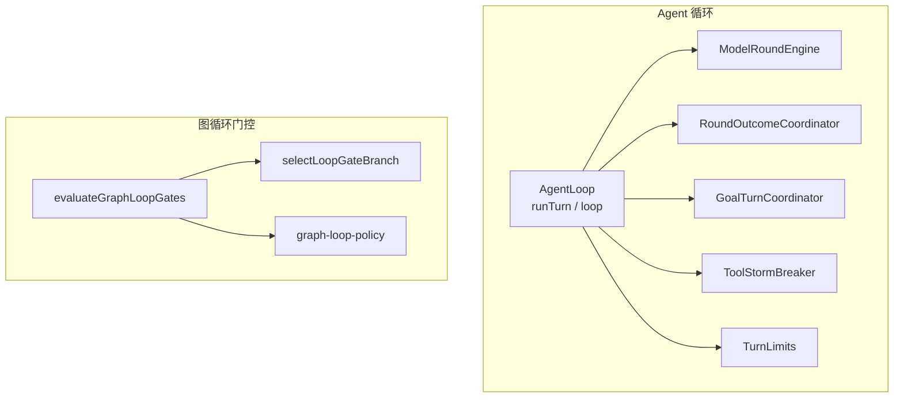
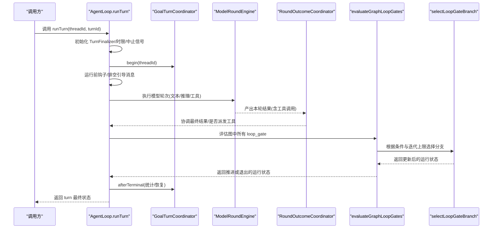
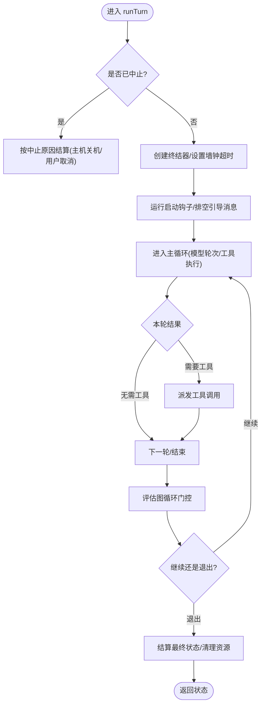
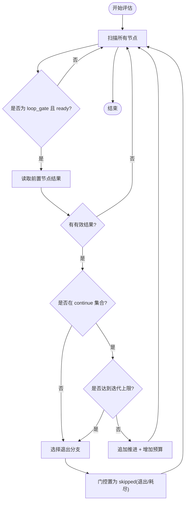
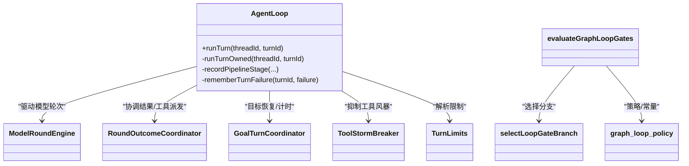

# 循环控制机制

<cite>
**本文引用的文件**
- [agent-loop.ts](file://kun/src/loop/agent-loop.ts)
- [graph-loop-gate-evaluator.ts](file://kun/src/graph/graph-loop-gate-evaluator.ts)
- [graph-loop-policy.ts](file://kun/src/graph/graph-loop-policy.ts)
- [graph-loop-branch-selector.ts](file://kun/src/graph/graph-loop-branch-selector.ts)
- [goal-turn-coordinator.ts](file://kun/src/loop/goal-turn-coordinator.ts)
- [turn-limits.ts](file://kun/src/loop/turn-limits.ts)
- [tool-storm-breaker.ts](file://kun/src/loop/tool-storm-breaker.ts)
- [model-round-engine.ts](file://kun/src/loop/model-round-engine.ts)
- [round-outcome-coordinator.ts](file://kun/src/loop/round-outcome-coordinator.ts)
- [workflow-loop.md](file://docs/workflow-loop.md)
</cite>

## 目录
1. [简介](#简介)
2. [项目结构](#项目结构)
3. [核心组件](#核心组件)
4. [架构总览](#架构总览)
5. [详细组件分析](#详细组件分析)
6. [依赖关系分析](#依赖关系分析)
7. [性能考量](#性能考量)
8. [故障排查指南](#故障排查指南)
9. [结论](#结论)
10. [附录](#附录)

## 简介
本文件聚焦 DeepSeek-GUI 的循环控制机制，围绕 AgentLoop 的核心执行流程、循环门控评估器、循环策略配置与状态管理展开。目标是帮助读者理解：
- runTurn 的完整生命周期管理与迭代控制
- 循环入口点检测、出口条件判断与迭代计数
- 最大迭代次数限制、超时控制与资源使用监控
- 活跃轮次跟踪、并发控制与异常恢复
- 配置选项、最佳实践与调优建议
- 通过代码路径引用展示如何正确使用循环控制能力

## 项目结构
循环控制由“Agent 循环”和“图循环门控”两部分组成：
- Agent 循环（kun/src/loop）：负责单轮 turn 的生命周期、模型调用、工具执行、预算与时限控制、目标自动恢复等。
- 图循环门控（kun/src/graph）：在图工作流中识别 loop_gate 节点，依据条件结果决定继续或退出，并维护迭代计数与重置范围。

图表来源
- [agent-loop.ts:263-441](file://kun/src/loop/agent-loop.ts#L263-L441)
- [graph-loop-gate-evaluator.ts:5-39](file://kun/src/graph/graph-loop-gate-evaluator.ts#L5-L39)
- [graph-loop-branch-selector.ts:10-57](file://kun/src/graph/graph-loop-branch-selector.ts#L10-L57)
- [graph-loop-policy.ts:1-165](file://kun/src/graph/graph-loop-policy.ts#L1-L165)

章节来源
- [agent-loop.ts:263-441](file://kun/src/loop/agent-loop.ts#L263-L441)
- [graph-loop-gate-evaluator.ts:5-39](file://kun/src/graph/graph-loop-gate-evaluator.ts#L5-L39)

## 核心组件
- AgentLoop：单 turn 的编排者，负责启动、调度、时限控制、异常处理、收尾与清理。
- ModelRoundEngine：驱动模型轮次，收集文本、推理与工具调用增量，记录管线阶段与用量。
- RoundOutcomeCoordinator：协调一轮内的最终结果，决定是否派发工具调用、抑制工具调用、记录失败与进度。
- GoalTurnCoordinator：目标级自动恢复与计时，支持中断后的续跑与无进展重试退避。
- ToolStormBreaker：防止工具风暴，限制短时间内重复/爆炸式工具调用。
- TurnLimits：统一解析与归一化每轮/每次响应/工具调用/墙钟时间等限制。
- Graph Loop Gate Evaluator：扫描图中的 loop_gate 节点，基于前置节点结果与迭代上限决定是否推进或退出。
- Graph Loop Branch Selector：选择继续或退出分支，并将未选分支置为跳过。
- Graph Loop Policy：定义循环门控的状态语义、可消费结果、重置节点集合与边判定。

章节来源
- [agent-loop.ts:263-441](file://kun/src/loop/agent-loop.ts#L263-L441)
- [graph-loop-gate-evaluator.ts:5-39](file://kun/src/graph/graph-loop-gate-evaluator.ts#L5-L39)
- [graph-loop-branch-selector.ts:10-57](file://kun/src/graph/graph-loop-branch-selector.ts#L10-L57)
- [graph-loop-policy.ts:1-165](file://kun/src/graph/graph-loop-policy.ts#L1-L165)

## 架构总览
下图展示了 AgentLoop 的一次 runTurn 与图循环门控的协作关系：

图表来源
- [agent-loop.ts:463-774](file://kun/src/loop/agent-loop.ts#L463-L774)
- [graph-loop-gate-evaluator.ts:5-39](file://kun/src/graph/graph-loop-gate-evaluator.ts#L5-L39)
- [graph-loop-branch-selector.ts:10-57](file://kun/src/graph/graph-loop-branch-selector.ts#L10-L57)

## 详细组件分析

### AgentLoop.runTurn 生命周期
- 并发与幂等：同一 threadId+turnId 的多次调用会复用同一个 Promise；若上一轮处于挂起且仍在执行，则链式等待后再次尝试。
- 中止与超时：
  - 检查 AbortSignal，区分主机关机挂起与用户取消。
  - 非委托运行时启用墙钟超时；达到阈值时触发中止并记录“扩展预算耗尽/轮次墙钟超时”。
- 目标自动恢复：begin/afterTerminal 封装目标计时与恢复逻辑，避免死循环与无进展。
- 管线阶段：setup → pre_start → post_start → 后续各阶段由模型轮次与工具执行填充。
- 收尾：清理路由、风暴保护、轮次引擎、结果协调器、目标协调器、技能激活、失败缓存、遥测等。

图表来源
- [agent-loop.ts:463-774](file://kun/src/loop/agent-loop.ts#L463-L774)

章节来源
- [agent-loop.ts:463-774](file://kun/src/loop/agent-loop.ts#L463-L774)

### 循环门控评估器（Graph Loop Gate Evaluator）
- 入口点检测：遍历 run.nodes，筛选 kind=loop_gate 且 status=ready 的门控节点。
- 出口条件判断：读取 gate.condition.sourceNodeId 的前置节点结果，若结果属于 continue 集合且未达到迭代上限，则推进；否则选择退出分支。
- 迭代计数器管理：
  - 推进时追加一次“循环推进”并增加预算（bumpLoopBudget）。
  - 退出或耗尽时标记门控为 skipped，并附带退出原因（评估完成/迭代耗尽）。
- 分支选择：将选中目标置为 pending，未选中目标置为 skipped。

图表来源
- [graph-loop-gate-evaluator.ts:5-39](file://kun/src/graph/graph-loop-gate-evaluator.ts#L5-L39)
- [graph-loop-policy.ts:1-165](file://kun/src/graph/graph-loop-policy.ts#L1-L165)
- [graph-loop-branch-selector.ts:10-57](file://kun/src/graph/graph-loop-branch-selector.ts#L10-L57)

章节来源
- [graph-loop-gate-evaluator.ts:5-39](file://kun/src/graph/graph-loop-gate-evaluator.ts#L5-L39)
- [graph-loop-policy.ts:1-165](file://kun/src/graph/graph-loop-policy.ts#L1-L165)
- [graph-loop-branch-selector.ts:10-57](file://kun/src/graph/graph-loop-branch-selector.ts#L10-L57)

### 循环策略配置
- 最大迭代次数：
  - 图层：gate.maxIterations 与 run.budget.limits.maxLoopIterations 的最小值作为硬上限。
  - 决策：当继续条件满足但已达上限时，强制退出。
- 超时控制：
  - 墙钟超时：由 TurnLimits 提供 maxWallTimeMs；AgentLoop 在非委托模式下设置定时器并在到期时中止 turn。
  - 扩展预算：若线程携带 extensionBudget.maxElapsedMs，则以更严格的值为准。
- 资源使用监控：
  - 模型轮次与工具调用限额：由 ModelRoundEngine 与 RoundOutcomeCoordinator 协同记录与限制。
  - 工具风暴防护：ToolStormBreaker 抑制短时间内的工具风暴。
  - 用量与遥测：通过 UsageService 与事件记录器上报。

章节来源
- [graph-loop-gate-evaluator.ts:5-39](file://kun/src/graph/graph-loop-gate-evaluator.ts#L5-L39)
- [agent-loop.ts:539-590](file://kun/src/loop/agent-loop.ts#L539-L590)
- [turn-limits.ts:1-200](file://kun/src/loop/turn-limits.ts#L1-L200)
- [tool-storm-breaker.ts:1-200](file://kun/src/loop/tool-storm-breaker.ts#L1-L200)
- [model-round-engine.ts:1-200](file://kun/src/loop/model-round-engine.ts#L1-L200)
- [round-outcome-coordinator.ts:1-200](file://kun/src/loop/round-outcome-coordinator.ts#L1-L200)

### 循环状态管理
- 活跃轮次跟踪：
  - activeTurnRuns：以 threadId+turnId 为键缓存当前运行的 Promise，避免重复启动。
  - goalTurns：维护目标级计时与恢复，支持中断后续跑。
- 并发控制：
  - 同一 turn 的多次调用共享同一 Promise；若上一轮挂起且仍在执行，则链式等待后再尝试。
  - 工具风暴保护限制短时工具调用密度。
- 异常恢复：
  - 捕获异常并记录诊断信息（模型、提供商、端点格式、错误堆栈片段）。
  - 支持“可恢复的 Lead 模型失败”场景（如流空闲超时），结合目标恢复策略重试。
  - 主机关机挂起时转为 suspended，不视为失败。

章节来源
- [agent-loop.ts:281-290](file://kun/src/loop/agent-loop.ts#L281-L290)
- [agent-loop.ts:463-497](file://kun/src/loop/agent-loop.ts#L463-L497)
- [agent-loop.ts:701-774](file://kun/src/loop/agent-loop.ts#L701-L774)
- [goal-turn-coordinator.ts:1-200](file://kun/src/loop/goal-turn-coordinator.ts#L1-L200)

### 实际使用示例（代码路径）
- 启动一轮并获取最终状态：
  - 参考路径：[agent-loop.ts:463-497](file://kun/src/loop/agent-loop.ts#L463-L497)
- 配置最大迭代与墙钟超时：
  - 参考路径：[turn-limits.ts:1-200](file://kun/src/loop/turn-limits.ts#L1-L200)、[agent-loop.ts:539-590](file://kun/src/loop/agent-loop.ts#L539-L590)
- 在图工作流中使用循环门控：
  - 参考路径：[graph-loop-gate-evaluator.ts:5-39](file://kun/src/graph/graph-loop-gate-evaluator.ts#L5-L39)、[graph-loop-branch-selector.ts:10-57](file://kun/src/graph/graph-loop-branch-selector.ts#L10-L57)
- 工作流文档中的循环模式说明：
  - 参考路径：[workflow-loop.md](file://docs/workflow-loop.md)

## 依赖关系分析

图表来源
- [agent-loop.ts:263-441](file://kun/src/loop/agent-loop.ts#L263-L441)
- [graph-loop-gate-evaluator.ts:5-39](file://kun/src/graph/graph-loop-gate-evaluator.ts#L5-L39)
- [graph-loop-branch-selector.ts:10-57](file://kun/src/graph/graph-loop-branch-selector.ts#L10-L57)
- [graph-loop-policy.ts:1-165](file://kun/src/graph/graph-loop-policy.ts#L1-L165)

章节来源
- [agent-loop.ts:263-441](file://kun/src/loop/agent-loop.ts#L263-L441)
- [graph-loop-gate-evaluator.ts:5-39](file://kun/src/graph/graph-loop-gate-evaluator.ts#L5-L39)

## 性能考量
- 限制模型步骤与单次运行时长：
  - GRAPH_LEAD_EPISODE_MAX_MODEL_STEPS 与 GRAPH_LEAD_EPISODE_MAX_ELAPSED_MS 限制 Lead 唤醒的本地时段，避免长时间占用。
- 工具风暴防护：
  - ToolStormBreaker 抑制短时密集工具调用，降低系统负载与外部服务压力。
- 上下文压缩与历史压缩：
  - 通过 HistoryCompactionService 与 ContextCompactor 控制上下文大小，减少模型输入成本。
- 预算与用量：
  - 使用 TurnLimits 与 UsageService 限制 token/工具调用/墙钟时间，避免超支。
- 异步与并行：
  - 标题生成、工具执行、事件记录采用异步与 fire-and-forget 模式，减少阻塞。

章节来源
- [agent-loop.ts:120-131](file://kun/src/loop/agent-loop.ts#L120-L131)
- [agent-loop.ts:591-636](file://kun/src/loop/agent-loop.ts#L591-L636)

## 故障排查指南
- 常见终止原因
  - 墙钟超时：turn_wall_time_limit 或 extension_budget_exhausted。
  - 工具调用超限：tool_call_limit_exceeded。
  - 循环门控耗尽：LOOP_GATE_EXHAUSTED_REASON。
- 定位方法
  - 查看 turn 最终状态与错误消息，关注模型、提供商、端点格式与错误堆栈片段。
  - 检查循环门控的 source 节点结果与迭代计数，确认 continue 集合与上限。
  - 观察工具风暴保护是否触发，必要时调整 ToolStormBreaker 参数。
- 恢复策略
  - 利用 GoalTurnCoordinator 的自动恢复与指数退避，避免反复失败。
  - 对可恢复的模型失败（流超时/截断）进行重试。

章节来源
- [agent-loop.ts:567-590](file://kun/src/loop/agent-loop.ts#L567-L590)
- [agent-loop.ts:701-774](file://kun/src/loop/agent-loop.ts#L701-L774)
- [graph-loop-policy.ts:15-16](file://kun/src/graph/graph-loop-policy.ts#L15-L16)

## 结论
DeepSeek-GUI 的循环控制通过 AgentLoop 与图循环门控的协同，实现了稳健的单 turn 生命周期管理、安全的循环推进与退出、以及细粒度的资源与超时控制。借助目标自动恢复、工具风暴防护与上下文压缩，系统在复杂任务与工作流场景中具备高可靠性与可扩展性。合理配置最大迭代、墙钟超时与工具调用限制，并结合异常恢复策略，可获得稳定高效的运行体验。

## 附录
- 配置建议
  - 设置合理的 maxWallTimeMs 与 maxLoopIterations，避免无限循环与资源耗尽。
  - 启用 ToolStormBreaker，并根据业务特性调整阈值。
  - 为长耗时任务开启目标自动恢复，配合指数退避减少抖动。
- 最佳实践
  - 在图工作流中明确 loop_gate 的条件与退出/耗尽目标，确保可观测与可恢复。
  - 使用 TurnLimits 统一管理各类限制，避免分散配置导致不一致。
  - 通过事件与遥测记录关键阶段，便于问题定位与性能优化。