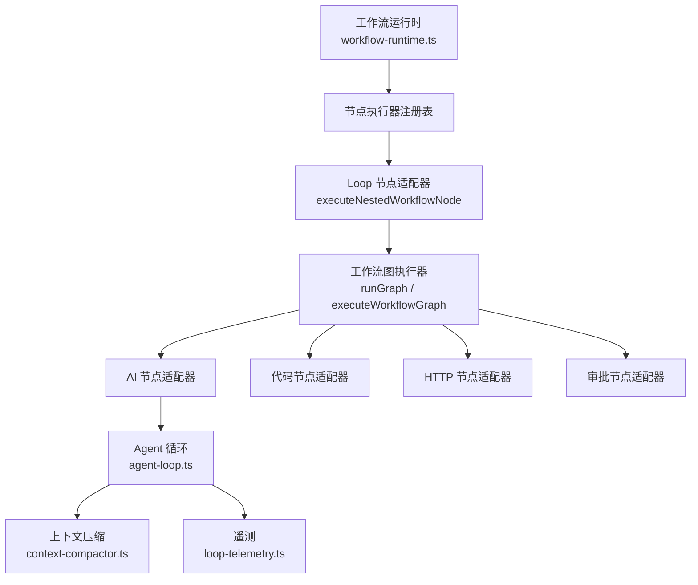
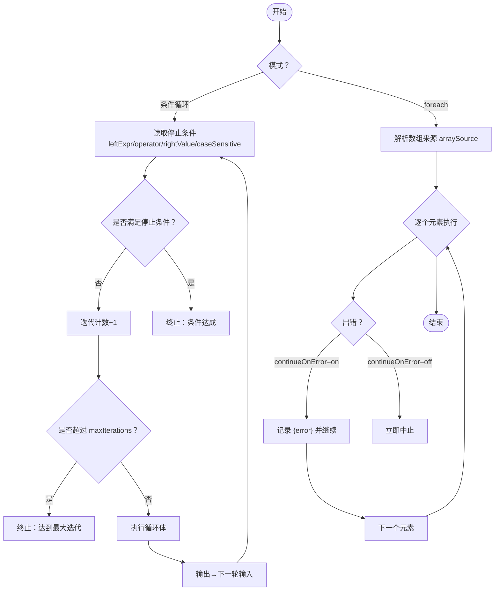
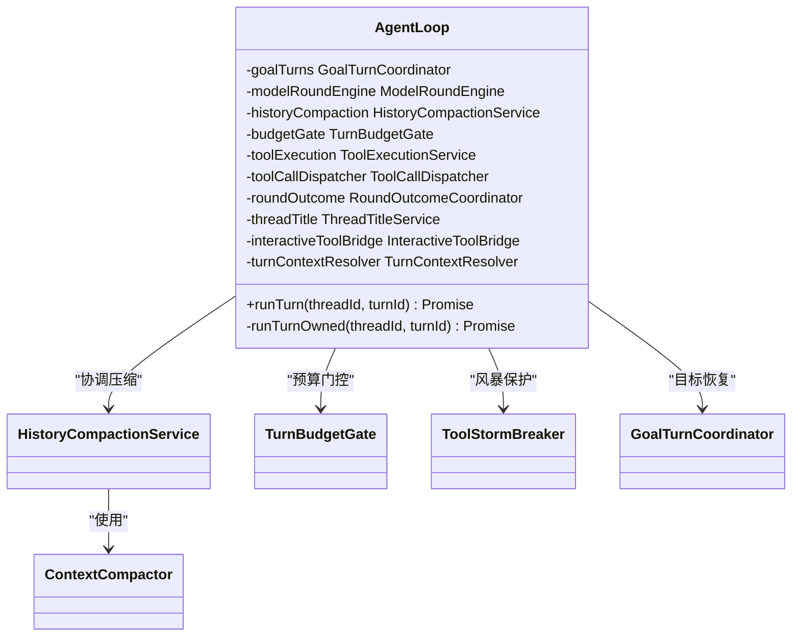
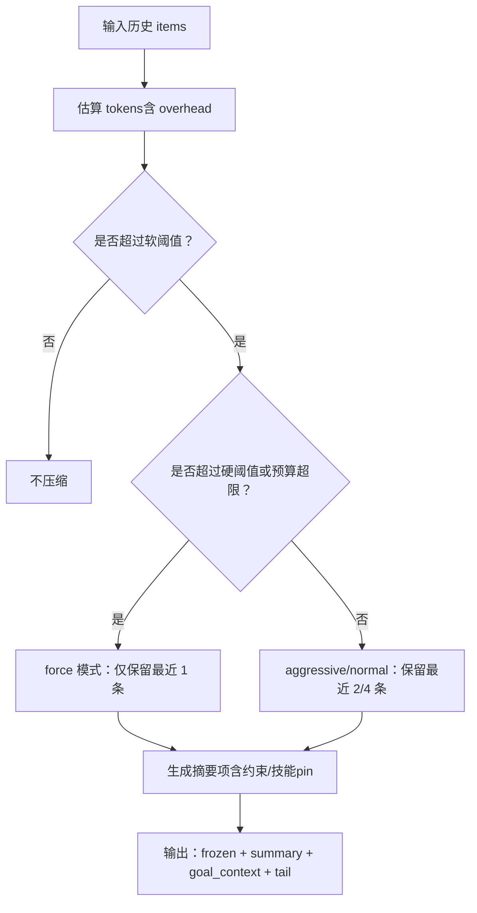
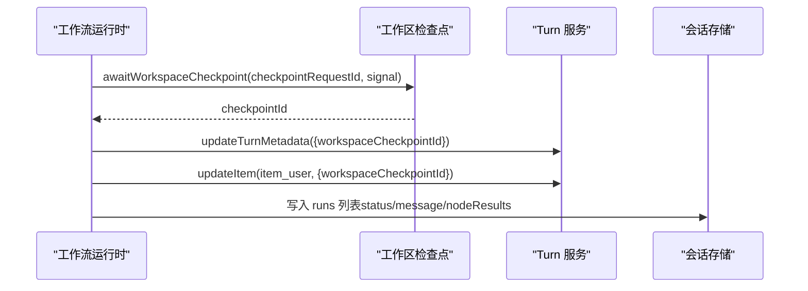
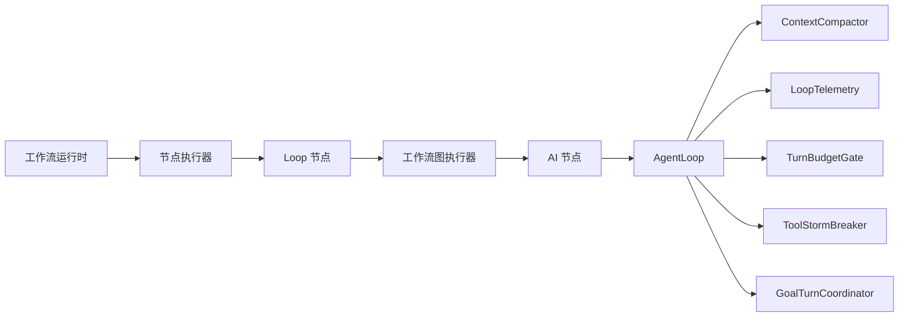

# 循环模式

<cite>
**本文引用的文件**
- [workflow-loop.md](file://docs/workflow-loop.md)
- [workflow-runtime.ts](file://src/main/workflow-runtime.ts)
- [agent-loop.ts](file://kun/src/loop/agent-loop.ts)
- [context-compactor.ts](file://kun/src/loop/context-compactor.ts)
- [loop-telemetry.ts](file://kun/src/loop/loop-telemetry.ts)
</cite>

## 目录
1. [简介](#简介)
2. [项目结构](#项目结构)
3. [核心组件](#核心组件)
4. [架构总览](#架构总览)
5. [详细组件分析](#详细组件分析)
6. [依赖关系分析](#依赖关系分析)
7. [性能考量](#性能考量)
8. [故障排查指南](#故障排查指南)
9. [结论](#结论)
10. [附录](#附录)

## 简介
本文件系统性阐述 DeepSeek-GUI 的“循环模式”，覆盖工作流层面的 Loop 节点与 Agent 运行时的多轮迭代。重点包括：
- 执行原理：迭代控制、条件判断与终止条件
- 门控机制：入口点、出口条件与迭代计数器管理
- 上下文压缩：在长循环中保持内存效率与性能的策略
- 状态持久化：检查点保存与恢复机制
- 监控与调试：迭代统计、性能指标与异常检测
- 设计模式：for/while/递归调用的实现方式
- 应用场景与最佳实践

## 项目结构
围绕循环模式，代码分布在两个层面：
- 工作流层（Workflow）：Loop 节点作为工作流中的一个节点，负责反复执行另一个工作流（或子工作流），支持条件循环与 foreach 遍历。
- Agent 运行时层（Agent Loop）：以 turn 为粒度的多轮对话/工具调用循环，内置上下文压缩、预算门控、遥测与生命周期钩子等。



**图表来源**
- [workflow-runtime.ts:926-999](file://src/main/workflow-runtime.ts#L926-L999)
- [workflow-runtime.ts:1060-1077](file://src/main/workflow-runtime.ts#L1060-L1077)
- [agent-loop.ts:251-441](file://kun/src/loop/agent-loop.ts#L251-L441)
- [context-compactor.ts:75-123](file://kun/src/loop/context-compactor.ts#L75-L123)
- [loop-telemetry.ts:32-97](file://kun/src/loop/loop-telemetry.ts#L32-L97)

**章节来源**
- [workflow-loop.md:1-150](file://docs/workflow-loop.md#L1-L150)
- [workflow-runtime.ts:926-999](file://src/main/workflow-runtime.ts#L926-L999)
- [agent-loop.ts:251-441](file://kun/src/loop/agent-loop.ts#L251-L441)

## 核心组件
- 工作流 Loop 节点：声明式循环体、停止条件、最大迭代次数；支持条件循环与 foreach 两种模式。
- Agent 循环（AgentLoop）：turn 级多轮驱动，集成模型路由、工具风暴保护、预算门控、上下文压缩、线程标题生成、目标自动恢复等。
- 上下文压缩（ContextCompactor）：基于软/硬阈值与请求预算的触发策略，将历史折叠为摘要项，保留关键约束与尾部片段。
- 遥测（LoopTelemetry）：记录提示词压力、工具目录指纹漂移，辅助缓存与压缩决策。

**章节来源**
- [workflow-loop.md:51-136](file://docs/workflow-loop.md#L51-L136)
- [agent-loop.ts:251-441](file://kun/src/loop/agent-loop.ts#L251-L441)
- [context-compactor.ts:75-123](file://kun/src/loop/context-compactor.ts#L75-L123)
- [loop-telemetry.ts:32-97](file://kun/src/loop/loop-telemetry.ts#L32-L97)

## 架构总览
工作流层的 Loop 节点通过嵌套执行器调用 runGraph，内部可包含 AI/代码/HTTP/审批等节点；AI 节点进一步进入 Agent 循环，由 AgentLoop 组织多轮交互，并在必要时触发上下文压缩与遥测上报。

```mermaid
sequenceDiagram
participant Caller as "调用方"
participant WF as "工作流运行时"
participant Loop as "Loop 节点"
participant Graph as "工作流图执行器"
participant AI as "AI 节点"
participant AL as "Agent 循环"
participant CC as "上下文压缩"
participant TL as "遥测"
Caller->>WF : 启动工作流
WF->>Loop : 执行 loop 节点
Loop->>Graph : 执行循环体子工作流
Graph->>AI : 执行 AI 节点
AI->>AL : 发起一轮或多轮 turn
AL->>CC : 评估并执行压缩
AL->>TL : 记录提示词压力/工具目录指纹
AL-->>AI : 返回本轮结果
AI-->>Graph : 产出 JSON/文本
Graph-->>Loop : 汇总本轮输出
Loop-->>WF : 按模式聚合条件/foreach
WF-->>Caller : 返回最终结果
```

**图表来源**
- [workflow-runtime.ts:926-999](file://src/main/workflow-runtime.ts#L926-L999)
- [workflow-runtime.ts:1060-1077](file://src/main/workflow-runtime.ts#L1060-L1077)
- [agent-loop.ts:251-441](file://kun/src/loop/agent-loop.ts#L251-L441)
- [context-compactor.ts:121-186](file://kun/src/loop/context-compactor.ts#L121-L186)
- [loop-telemetry.ts:32-97](file://kun/src/loop/loop-telemetry.ts#L32-L97)

## 详细组件分析

### 工作流 Loop 节点：迭代控制、条件判断与终止条件
- 两种模式
  - 条件循环（loop-agent）：每轮将上一轮输出注入下一轮输入，直到满足停止条件或达到 maxIterations。
  - foreach 遍历：对数组元素逐一执行循环体，支持顺序与并行（并发度 1–8），保证输出顺序一致。
- 变量上下文：$loop.index、$loop.item、$loop.total 供循环体内任意节点插值使用。
- 护栏：maxIterations（默认 10，上限 100）、嵌套深度 ≤ 5、单次运行看门狗与节点数上限（200）。
- 错误策略：foreach 支持 continueOnError（韧性）与 fail-fast（快速失败）。



**图表来源**
- [workflow-loop.md:51-136](file://docs/workflow-loop.md#L51-L136)

**章节来源**
- [workflow-loop.md:51-136](file://docs/workflow-loop.md#L51-L136)

### Agent 循环：turn 级多轮驱动与门控
- 入口与调度：runTurn(threadId, turnId) 统一入口，支持去重与挂起恢复；内部委托给 runTurnOwned 完成生命周期管理。
- 门控与限制
  - 墙钟时间限制：根据 turnLimits 与 extensionBudget 计算最大耗时，超时标记为特定错误码。
  - 工具风暴保护：ToolStormBreaker 防止短时间内过多工具调用。
  - 预算门控：TurnBudgetGate 结合 token 经济策略限制单轮成本。
- 上下文压缩：HistoryCompactionService 协调 ContextCompactor，在历史膨胀时进行摘要折叠。
- 目标自动恢复：GoalTurnCoordinator 支持中断后恢复活跃目标。
- 生命周期钩子：TurnStart/TurnEnd/PreCompact 等钩子在合适时机执行。



**图表来源**
- [agent-loop.ts:251-441](file://kun/src/loop/agent-loop.ts#L251-L441)

**章节来源**
- [agent-loop.ts:448-774](file://kun/src/loop/agent-loop.ts#L448-L774)

### 上下文压缩策略：长时间循环中的内存与性能
- 触发依据
  - 软/硬阈值：基于模型配置与 provider 的上下文阈值。
  - 请求预算：当 input + reserved output 超过硬限时，强制压缩。
  - 提供者 prompt_tokens 可信度：若显著高于本地估计则忽略，避免被累计缓存读误导。
- 压缩过程
  - 冻结消息：保留固定数量的最近消息（如用户指令）。
  - 摘要生成：将头部历史折叠为单个 compaction 项，附带摘要、替换 token 数、已钉约束与技能 pin。
  - 尾部保留：保留最近的若干条原文，确保当前请求的上下文一致性。
- 安全边界
  - 避免截断未完成的 tool_call/tool_result 对。
  - 重复压缩同一头部会被识别并跳过。



**图表来源**
- [context-compactor.ts:121-186](file://kun/src/loop/context-compactor.ts#L121-L186)
- [context-compactor.ts:188-320](file://kun/src/loop/context-compactor.ts#L188-L320)

**章节来源**
- [context-compactor.ts:75-123](file://kun/src/loop/context-compactor.ts#L75-L123)
- [context-compactor.ts:121-186](file://kun/src/loop/context-compactor.ts#L121-L186)
- [context-compactor.ts:188-320](file://kun/src/loop/context-compactor.ts#L188-L320)

### 状态持久化：检查点保存与恢复
- 工作流运行状态：每次运行写入 runs 列表，包含状态、起止时间与节点结果；完成后更新 lastRunAt/lastStatus/nextRunAt。
- 工作区检查点：在委派 SDK 路径下，首次变更工具前等待桌面 Git 快照完成，并将 checkpointId 写入 turn 元数据与用户项，保障快照前后一致性。
- 目标恢复：AgentLoop 在重启后可恢复中断的目标（resumeInterruptedGoals），仅对仍为 active 的目标重新拉起。



**图表来源**
- [workflow-runtime.ts:845-917](file://src/main/workflow-runtime.ts#L845-L917)
- [agent-loop.ts:637-679](file://kun/src/loop/agent-loop.ts#L637-L679)

**章节来源**
- [workflow-runtime.ts:845-917](file://src/main/workflow-runtime.ts#L845-L917)
- [agent-loop.ts:637-679](file://kun/src/loop/agent-loop.ts#L637-L679)
- [agent-loop.ts:448-456](file://kun/src/loop/agent-loop.ts#L448-L456)

### 监控与调试：迭代统计、性能指标与异常检测
- 迭代统计
  - 条件循环：输出包含 _iterations（实际轮数）与 _done（是否因条件达成而停止）。
  - foreach：输出成功/总数统计，并行时标注 (parallel)。
- 性能指标
  - 遥测记录提示词压力（promptTokens）与工具目录指纹漂移，辅助缓存与压缩决策。
  - 管道阶段记录（setup/pre_start/post_start/input_received/response_received 等）用于定位瓶颈。
- 异常检测
  - 墙钟超时、扩展预算耗尽、工具风暴、工具调用限制等均有明确错误码与告警。
  - 错误信息包含 thread/turn/model/provider/baseUrl/endpointFormat 等诊断字段，便于渲染层展示。

**章节来源**
- [workflow-loop.md:55-82](file://docs/workflow-loop.md#L55-L82)
- [loop-telemetry.ts:32-97](file://kun/src/loop/loop-telemetry.ts#L32-L97)
- [agent-loop.ts:106-131](file://kun/src/loop/agent-loop.ts#L106-L131)
- [agent-loop.ts:701-738](file://kun/src/loop/agent-loop.ts#L701-L738)

### 设计模式：for/while/递归调用的实现
- while（条件循环）：Loop 节点的 condition 模式，持续迭代直到停止条件成立或达到 maxIterations。
- for（foreach）：对数组逐项执行循环体，支持顺序与并行，错误处理可选 continueOnError。
- 递归调用：工作流嵌套（subworkflow/loop）深度限制 ≤ 5，防止无限递归；AgentLoop 也具备 episode 步数与时限保护。

**章节来源**
- [workflow-loop.md:51-106](file://docs/workflow-loop.md#L51-L106)
- [workflow-runtime.ts:1060-1077](file://src/main/workflow-runtime.ts#L1060-L1077)
- [agent-loop.ts:120-131](file://kun/src/loop/agent-loop.ts#L120-L131)

## 依赖关系分析
- 工作流运行时依赖节点执行器注册表，将不同节点类型分派到对应适配器；Loop 节点通过嵌套执行器调用 runGraph。
- AgentLoop 依赖多个子系统：模型路由、工具执行、预算门控、上下文压缩、遥测、目标恢复、线程标题服务等。
- 上下文压缩依赖估算器与模型配置，结合提供者用量与本地估计决定压缩策略。
- 遥测提供进程内有限状态的度量，避免持久化副作用。



**图表来源**
- [workflow-runtime.ts:926-999](file://src/main/workflow-runtime.ts#L926-L999)
- [agent-loop.ts:251-441](file://kun/src/loop/agent-loop.ts#L251-L441)
- [context-compactor.ts:75-123](file://kun/src/loop/context-compactor.ts#L75-L123)
- [loop-telemetry.ts:32-97](file://kun/src/loop/loop-telemetry.ts#L32-L97)

**章节来源**
- [workflow-runtime.ts:926-999](file://src/main/workflow-runtime.ts#L926-L999)
- [agent-loop.ts:251-441](file://kun/src/loop/agent-loop.ts#L251-L441)

## 性能考量
- 上下文压缩阈值与预算：合理设置软/硬阈值与 requestHardCapTokens/outputBudgetTokens，避免“死区”导致请求被拒。
- 并行与并发：foreach 并行提升吞吐，但需平衡 concurrency 与资源占用；始终保证输出顺序。
- 工具风暴保护：抑制短时间内的工具风暴，降低模型与外部系统压力。
- 预算门控与墙钟限制：防止长循环烧钱或卡死，确保整体稳定性。
- 遥测与诊断：利用提示词压力与工具目录指纹漂移检测，优化缓存与压缩策略。

[本节为通用指导，无需具体文件引用]

## 故障排查指南
- 常见错误与定位
  - 墙钟超时/扩展预算耗尽：检查 turnLimits 与 extensionBudget.maxElapsedMs，确认业务逻辑是否过慢。
  - 工具调用限制：关注 tool_call_limit_exceeded，调整工具调用频率或拆分任务。
  - 上下文过大：查看压缩日志与 replacedTokens，调整阈值或精简历史。
  - 工具目录漂移：通过 LoopTelemetry 的工具目录指纹变化，排查动态加载工具导致的缓存失效。
- 诊断信息
  - 错误消息包含 thread/turn/model/provider/baseUrl/endpointFormat/error/stack 等字段，便于前端展示与问题定位。
  - 管道阶段标签可用于定位卡顿环节（如 pre_send/response_received）。

**章节来源**
- [agent-loop.ts:701-738](file://kun/src/loop/agent-loop.ts#L701-L738)
- [loop-telemetry.ts:32-97](file://kun/src/loop/loop-telemetry.ts#L32-L97)

## 结论
DeepSeek-GUI 的循环模式在工作流层提供了声明式的迭代能力（条件循环与 foreach），在 Agent 运行时层实现了稳健的多轮驱动与资源治理。通过上下文压缩、预算门控、遥测与检查点机制，系统在长循环场景下兼顾了性能、稳定性与可观测性。建议在实际使用中遵循护栏与最佳实践，合理配置阈值与并发，充分利用监控与诊断能力，确保循环任务高效可靠地运行。

## 附录
- 配置速查（工作流 Loop 节点）
  - workflowId：循环体（要反复跑的工作流）
  - mode：condition（条件循环）或 foreach（遍历数组）
  - maxIterations：轮数上限（1–100，默认 10）
  - leftExpr/operator/rightValue/caseSensitive：停止条件
  - arraySource：数组来源表达式（空则用上游 payload.json）
  - execution：sequential/parallel
  - concurrency：并行并发度（1–8，默认 4）
  - continueOnError：是否容错继续

**章节来源**
- [workflow-loop.md:124-136](file://docs/workflow-loop.md#L124-L136)