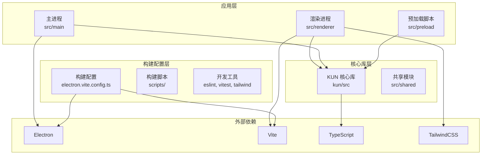
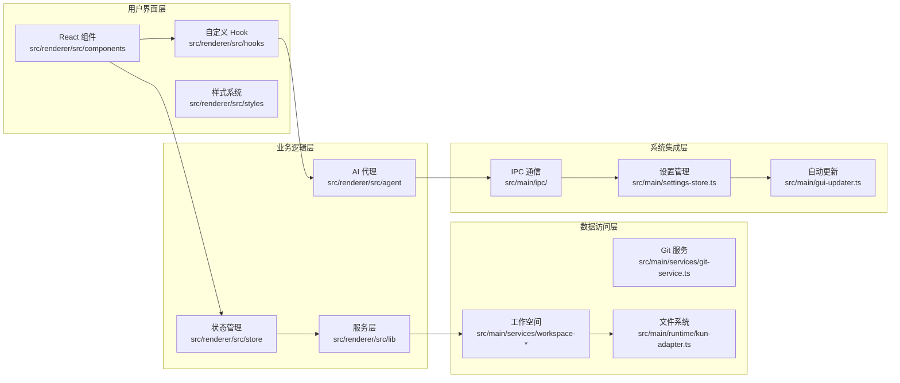
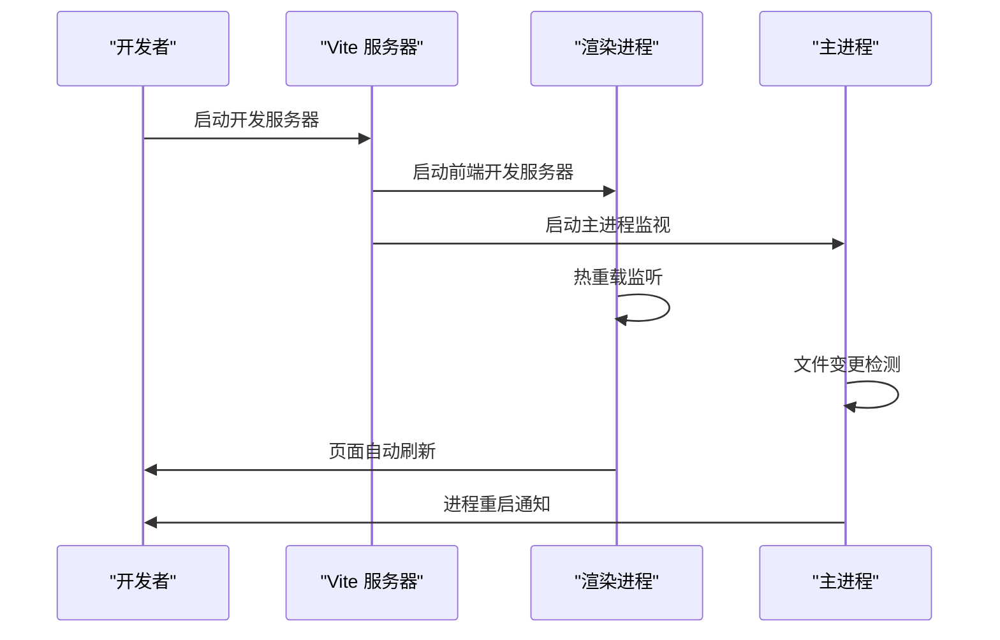
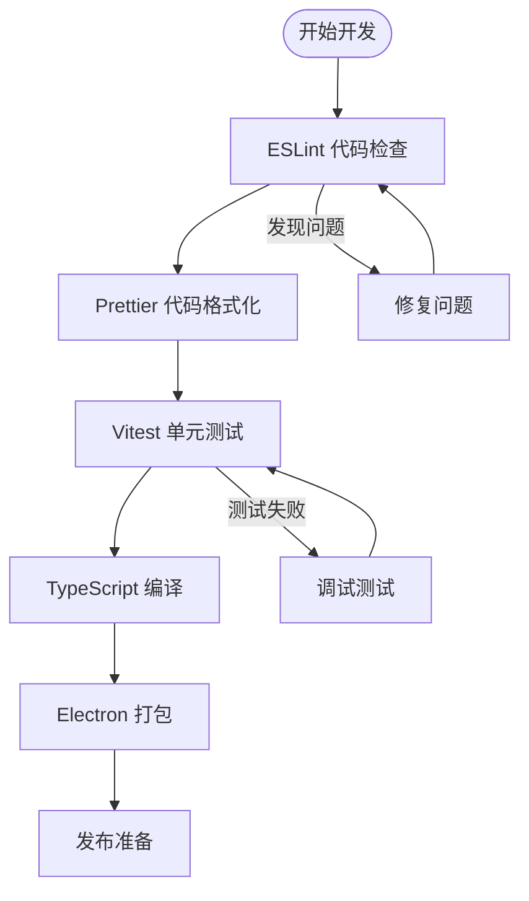
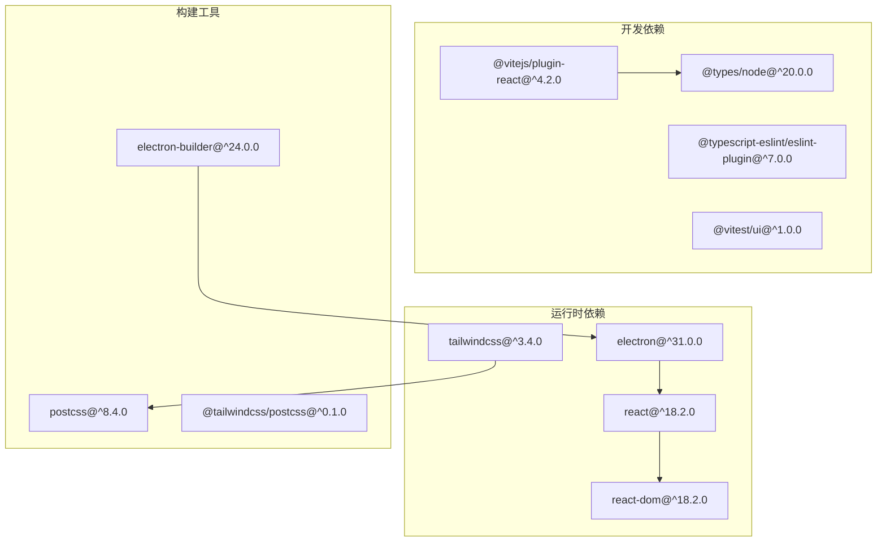

# 开发环境搭建

<cite>
**本文档引用的文件**
- [package.json](file://package.json)
- [electron.vite.config.ts](file://electron.vite.config.ts)
- [tsconfig.json](file://tsconfig.json)
- [tsconfig.node.json](file://tsconfig.node.json)
- [tsconfig.web.json](file://tsconfig.web.json)
- [eslint.config.js](file://eslint.config.js)
- [postcss.config.js](file://postcss.config.js)
- [tailwind.config.js](file://tailwind.config.js)
- [vitest.config.ts](file://vitest.config.ts)
- [kun/package.json](file://kun/package.json)
- [kun/tsconfig.json](file://kun/tsconfig.json)
- [kun/README.md](file://kun/README.md)
- [docs/DEVELOPMENT.md](file://docs/DEVELOPMENT.md)
- [docs/CONTRIBUTING.md](file://docs/CONTRIBUTING.md)
- [src/main/index.ts](file://src/main/index.ts)
- [src/renderer/src/main.tsx](file://src/renderer/src/main.tsx)
- [src/preload/index.ts](file://src/preload/index.ts)
- [electron-builder.config.cjs](file://electron-builder.config.cjs)
</cite>

## 目录
1. [简介](#简介)
2. [系统要求](#系统要求)
3. [项目结构](#项目结构)
4. [核心组件](#核心组件)
5. [架构概览](#架构概览)
6. [详细组件分析](#详细组件分析)
7. [依赖分析](#依赖分析)
8. [性能考虑](#性能考虑)
9. [故障排除指南](#故障排除指南)
10. [结论](#结论)
11. [附录](#附录)

## 简介
DeepSeek GUI 是一个基于 Electron 和 Vite 的桌面应用程序，结合了 AI 能力与本地工作空间管理。该项目采用 TypeScript 构建，支持多语言界面，并集成了多种开发工具链以确保代码质量与开发效率。

## 系统要求
- 操作系统：Windows 10+ / macOS 10.15+ / Linux
- Node.js：18.x 或更高版本（推荐使用 LTS 版本）
- npm：8.x 或更高版本
- Python：3.8+（用于构建过程中的某些原生模块）
- Git：2.x 或更高版本

## 项目结构
该项目采用分层架构设计，主要分为以下层次：

**图表来源**
- [electron.vite.config.ts:1-50](file://electron.vite.config.ts#L1-L50)
- [package.json:1-100](file://package.json#L1-L100)

**章节来源**
- [package.json:1-150](file://package.json#L1-L150)
- [electron.vite.config.ts:1-80](file://electron.vite.config.ts#L1-L80)

## 核心组件
项目的核心组件包括：

### 应用程序入口点
- 主进程入口：`src/main/index.ts`
- 渲染进程入口：`src/renderer/src/main.tsx`
- 预加载脚本：`src/preload/index.ts`

### 构建配置
- 主要构建配置：`electron.vite.config.ts`
- TypeScript 配置：`tsconfig.json`, `tsconfig.node.json`, `tsconfig.web.json`
- 代码质量工具：`eslint.config.js`, `vitest.config.ts`
- 样式工具：`postcss.config.js`, `tailwind.config.js`

### 核心库
- KUN 核心库：`kun/src/`
- 共享模块：`src/shared/`

**章节来源**
- [src/main/index.ts:1-50](file://src/main/index.ts#L1-L50)
- [src/renderer/src/main.tsx:1-50](file://src/renderer/src/main.tsx#L1-L50)
- [src/preload/index.ts:1-50](file://src/preload/index.ts#L1-L50)

## 架构概览
DeepSeek GUI 采用现代桌面应用架构，结合了 Electron 的多进程模型和 Vite 的现代化开发体验：

**图表来源**
- [src/renderer/src/store/chat-store.ts:1-100](file://src/renderer/src/store/chat-store.ts#L1-L100)
- [src/main/services/workspace-service.ts:1-80](file://src/main/services/workspace-service.ts#L1-L80)
- [src/main/ipc/register-app-ipc-handlers.ts:1-60](file://src/main/ipc/register-app-ipc-handlers.ts#L1-L60)

## 详细组件分析

### 开发服务器与热重载配置
项目使用 Vite 作为开发服务器，支持热重载功能：

**图表来源**
- [electron.vite.config.ts:20-60](file://electron.vite.config.ts#L20-L60)
- [package.json:1-80](file://package.json#L1-L80)

### 代码质量工具链
项目集成了多种代码质量工具：

**图表来源**
- [eslint.config.js:1-50](file://eslint.config.js#L1-L50)
- [vitest.config.ts:1-40](file://vitest.config.ts#L1-L40)

### TypeScript 配置分析
项目采用多配置文件策略：

| 配置文件 | 用途 | 关键特性 |
|---------|------|----------|
| `tsconfig.json` | 通用配置 | 基础编译选项、路径映射 |
| `tsconfig.node.json` | Node 环境 | CommonJS 模块解析、Node API |
| `tsconfig.web.json` | Web 环境 | ES2020 目标、DOM 类型 |

**章节来源**
- [tsconfig.json:1-80](file://tsconfig.json#L1-L80)
- [tsconfig.node.json:1-60](file://tsconfig.node.json#L1-L60)
- [tsconfig.web.json:1-60](file://tsconfig.web.json#L1-L60)

## 依赖分析

### 核心依赖关系

**图表来源**
- [package.json:1-120](file://package.json#L1-L120)
- [kun/package.json:1-80](file://kun/package.json#L1-L80)

### 开发工具链配置
项目使用现代化的开发工具链，包括：

- **构建工具**：Vite 提供快速的开发服务器和热重载
- **代码检查**：ESLint 配合 TypeScript ESLint 插件
- **测试框架**：Vitest 提供快速的单元测试环境
- **样式处理**：PostCSS + TailwindCSS 实现现代化样式系统
- **打包工具**：electron-builder 支持多平台应用分发

**章节来源**
- [package.json:1-150](file://package.json#L1-L150)
- [electron.vite.config.ts:1-80](file://electron.vite.config.ts#L1-L80)

## 性能考虑
基于项目结构分析，以下是关键的性能优化建议：

### 内存管理
- 使用 `WeakRef` 和 `FinalizationRegistry` 处理大型对象引用
- 实施懒加载策略，按需加载非关键模块
- 优化 React 组件的 `memo` 和 `useMemo` 使用

### 构建优化
- 启用 Vite 的代码分割和 Tree Shaking
- 使用 `lazy` 动态导入重型组件
- 配置适当的缓存策略

### 开发体验优化
- 启用 Vite 的并行编译
- 使用 `skipLibCheck` 减少类型检查开销
- 配置合适的 `tsconfig` 选项

## 故障排除指南

### 常见安装问题
1. **Node.js 版本不兼容**
   - 确保使用 Node.js 18.x 或更高版本
   - 使用 nvm 切换到推荐版本

2. **依赖安装失败**
   - 清理 `node_modules` 和 `package-lock.json`
   - 使用 `npm ci` 进行干净安装

3. **TypeScript 编译错误**
   - 检查 `tsconfig.json` 配置
   - 确保所有依赖都正确安装

### 开发服务器问题
1. **热重载失效**
   - 检查 Vite 配置文件
   - 确认端口未被占用

2. **IPC 通信异常**
   - 验证 IPC 处理器注册
   - 检查预加载脚本配置

### 构建问题
1. **打包失败**
   - 检查 electron-builder 配置
   - 确认签名证书配置

2. **样式问题**
   - 验证 TailwindCSS 配置
   - 检查 PostCSS 处理链

**章节来源**
- [docs/DEVELOPMENT.md:1-100](file://docs/DEVELOPMENT.md#L1-L100)
- [docs/CONTRIBUTING.md:1-100](file://docs/CONTRIBUTING.md#L1-L100)

## 结论
DeepSeek GUI 提供了一个完整且现代化的开发环境，结合了 Electron 的强大功能和 Vite 的开发体验。通过合理的架构设计和工具链配置，开发者可以高效地进行桌面应用开发。建议新开发者从理解项目结构开始，逐步掌握各个组件的功能和交互方式。

## 附录

### 开发工作流程
1. **环境准备**：安装 Node.js 18+ 和项目依赖
2. **开发启动**：使用 `npm run dev` 启动开发服务器
3. **代码编写**：遵循代码规范和组件设计原则
4. **测试验证**：运行单元测试和集成测试
5. **构建打包**：使用 `npm run build` 生成生产版本

### 代码规范
- TypeScript 类型安全优先
- React 组件使用函数式编程风格
- 使用 TailwindCSS 进行样式开发
- 遵循 ESLint 规则和 Prettier 格式化

### 提交规范
- 使用清晰的 commit 消息描述变更内容
- 遵循 Conventional Commits 规范
- 在 Pull Request 中提供充分的测试覆盖