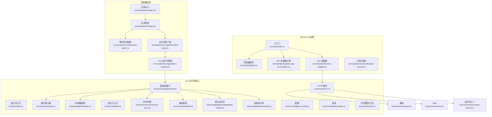
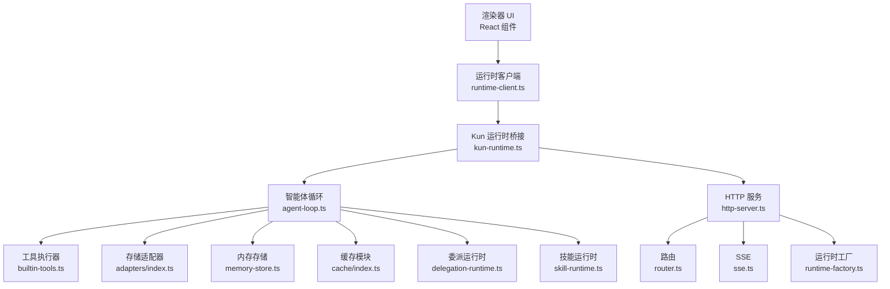
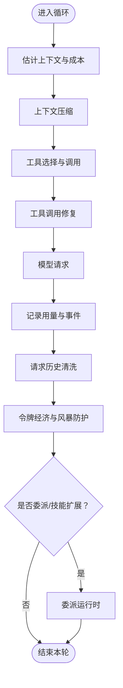
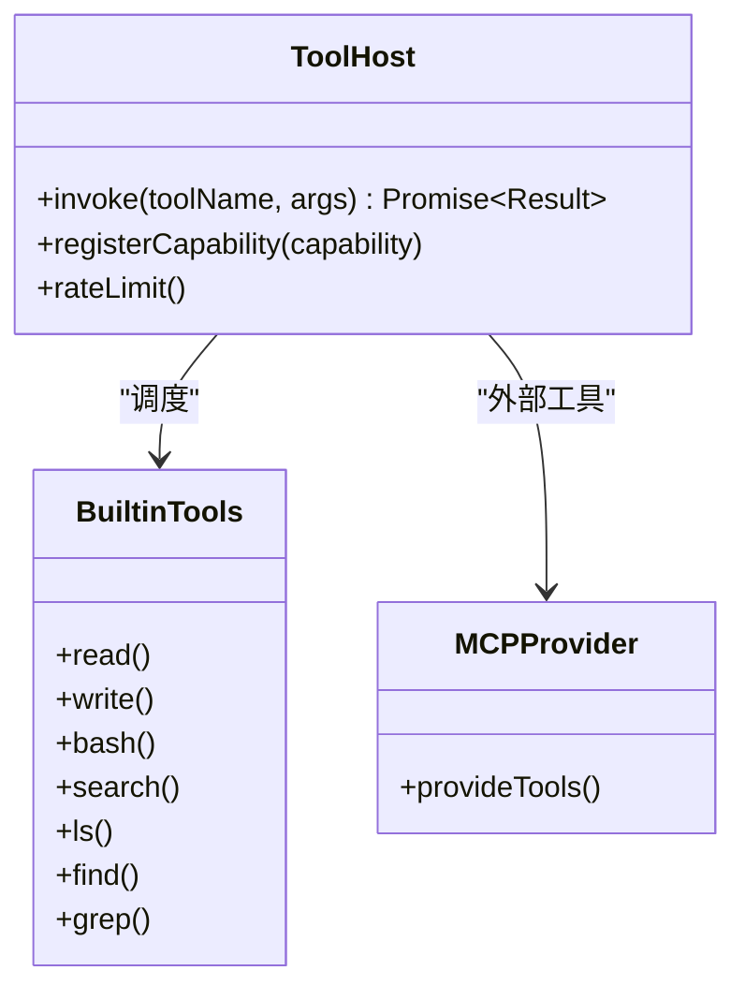
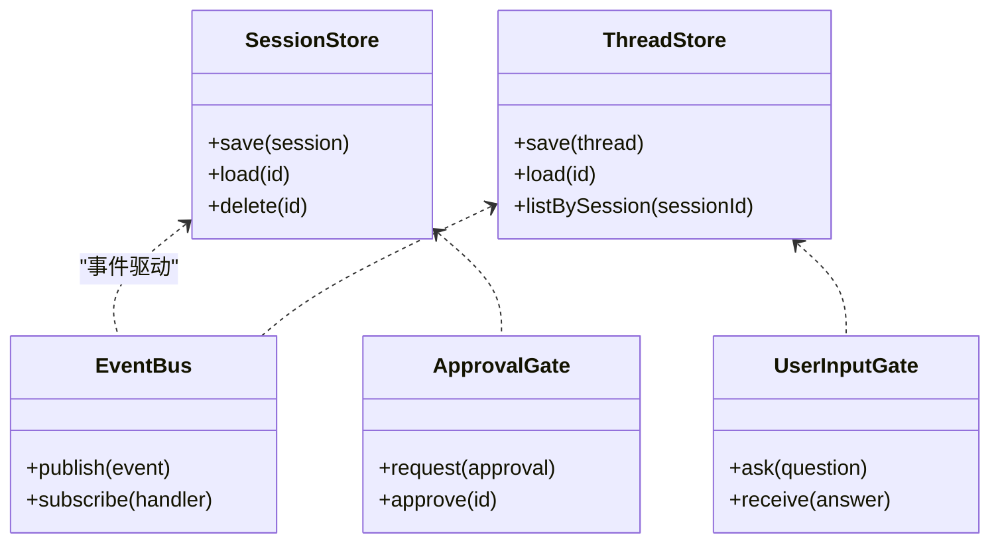
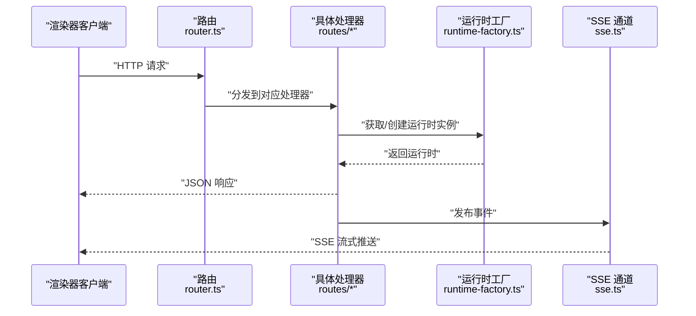
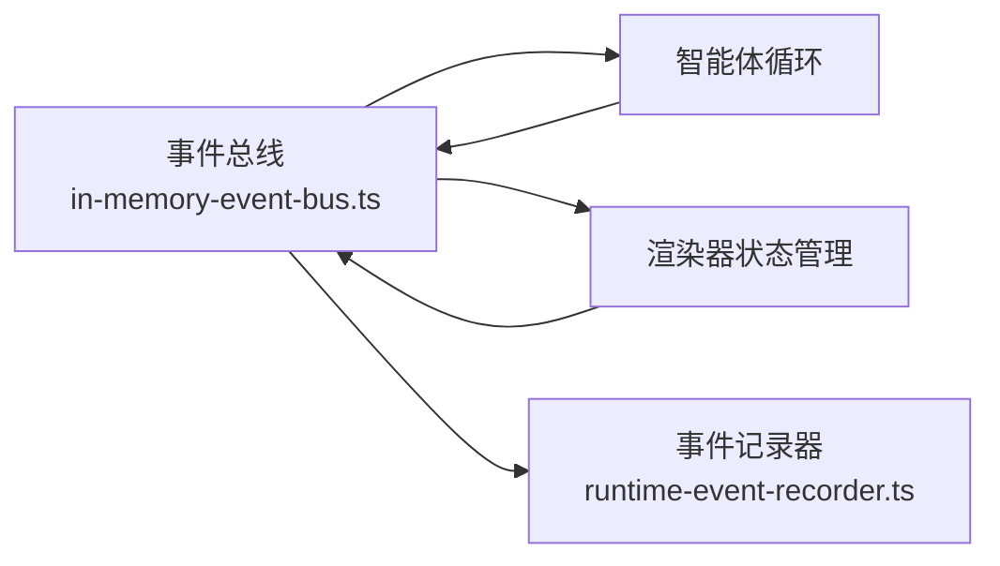
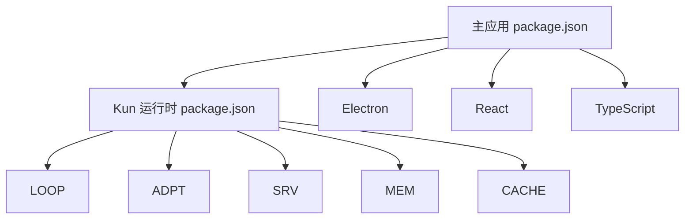

# 开发者指南

<cite>
**本文引用的文件**
- [README.md](file://README.md)
- [DESIGN.md](file://DESIGN.md)
- [kun/README.md](file://kun/README.md)
- [package.json](file://package.json)
- [kun/package.json](file://kun/package.json)
- [src/main/index.ts](file://src/main/index.ts)
- [src/preload/index.ts](file://src/preload/index.ts)
- [src/renderer/src/main.tsx](file://src/renderer/src/main.tsx)
- [src/renderer/src/App.tsx](file://src/renderer/src/App.tsx)
- [src/main/runtime/kun-adapter.ts](file://src/main/runtime/kun-adapter.ts)
- [src/main/services/workspace-service.ts](file://src/main/services/workspace-service.ts)
- [src/main/ipc/register-app-ipc-handlers.ts](file://src/main/ipc/register-app-ipc-schemas.ts)
- [src/main/ipc/register-app-ipc-handlers.ts](file://src/main/ipc/register-app-ipc-handlers.ts)
- [src/renderer/src/store/chat-store.ts](file://src/renderer/src/store/chat-store.ts)
- [src/renderer/src/store/chat-store-runtime.ts](file://src/renderer/src/store/chat-store-runtime.ts)
- [src/renderer/src/agent/kun-runtime.ts](file://src/renderer/src/agent/kun-runtime.ts)
- [src/renderer/src/agent/runtime-client.ts](file://src/renderer/src/agent/runtime-client.ts)
- [kun/src/index.ts](file://kun/src/index.ts)
- [kun/src/loop/agent-loop.ts](file://kun/src/loop/agent-loop.ts)
- [kun/src/ports/index.ts](file://kun/src/ports/index.ts)
- [kun/src/adapters/index.ts](file://kun/src/adapters/index.ts)
- [kun/src/server/index.ts](file://kun/src/server/index.ts)
- [kun/src/cli/index.ts](file://kun/src/cli/index.ts)
- [kun/src/config/kun-config.ts](file://kun/src/config/kun-config.ts)
- [kun/src/memory/memory-store.ts](file://kun/src/memory/memory-store.ts)
- [kun/src/cache/index.ts](file://kun/src/cache/index.ts)
- [kun/src/delegation/delegation-runtime.ts](file://kun/src/delegation/delegation-runtime.ts)
- [kun/src/skills/skill-runtime.ts](file://kun/src/skills/skill-runtime.ts)
- [kun/src/server/routes/index.ts](file://kun/src/server/routes/index.ts)
- [kun/src/server/http-server.ts](file://kun/src/server/http-server.ts)
- [kun/src/server/node-http-server.ts](file://kun/src/server/node-http-server.ts)
- [kun/src/server/router.ts](file://kun/src/server/router.ts)
- [kun/src/server/runtime-factory.ts](file://kun/src/server/runtime-factory.ts)
- [kun/src/server/sse.ts](file://kun/src/server/sse.ts)
- [kun/src/telemetry/index.ts](file://kun/src/telemetry/index.ts)
- [kun/src/shared/gui-plan.ts](file://kun/src/shared/gui-plan.ts)
- [kun/src/shared/todos.ts](file://kun/src/shared/todos.ts)
- [src/shared/app-settings.ts](file://src/shared/app-settings.ts)
- [src/shared/ds-gui-api.ts](file://src/shared/ds-gui-api.ts)
- [src/shared/kun-endpoints.ts](file://src/shared/kun-endpoints.ts)
- [docs/DEVELOPMENT.md](file://docs/DEVELOPMENT.md)
- [docs/kun-architecture.md](file://docs/kun-architecture.md)
- [docs/kun-cache-optimization.md](file://docs/kun-cache-optimization.md)
- [docs/CONTRIBUTING.md](file://docs/CONTRIBUTING.md)
</cite>

## 目录
1. [简介](#简介)
2. [项目结构](#项目结构)
3. [核心组件](#核心组件)
4. [架构总览](#架构总览)
5. [详细组件分析](#详细组件分析)
6. [依赖关系分析](#依赖关系分析)
7. [性能考虑](#性能考虑)
8. [故障排查指南](#故障排查指南)
9. [结论](#结论)
10. [附录](#附录)

## 简介
本指南面向 DeepSeek GUI 的开发者，系统性解析项目的三层架构：Electron 主进程、React 渲染器应用、Kun 运行时核心。文档覆盖智能体循环系统、工具执行器、存储适配器、服务器层架构与数据流、事件驱动与状态管理，并提供开发环境搭建、调试技巧与性能优化建议。

## 项目结构
项目采用多包（monorepo）布局，核心由以下部分组成：
- Electron 主进程与 IPC：负责与 Kun 运行时交互、系统服务集成、窗口生命周期与安全策略。
- React 渲染器：提供用户界面、状态管理与与运行时客户端通信。
- Kun 运行时：提供智能体循环、工具执行、内存与缓存、路由与 SSE 服务端等能力。
- 文档与贡献指南：帮助理解架构设计与开发流程。

图表来源
- [src/main/index.ts:1-200](file://src/main/index.ts#L1-L200)
- [src/preload/index.ts:1-120](file://src/preload/index.ts#L1-L120)
- [src/main/ipc/register-app-ipc-handlers.ts:1-200](file://src/main/ipc/register-app-ipc-handlers.ts#L1-L200)
- [src/main/runtime/kun-adapter.ts:1-200](file://src/main/runtime/kun-adapter.ts#L1-L200)
- [src/renderer/src/main.tsx:1-120](file://src/renderer/src/main.tsx#L1-L120)
- [src/renderer/src/App.tsx:1-120](file://src/renderer/src/App.tsx#L1-L120)
- [src/renderer/src/store/chat-store.ts:1-200](file://src/renderer/src/store/chat-store.ts#L1-L200)
- [src/renderer/src/agent/runtime-client.ts:1-200](file://src/renderer/src/agent/runtime-client.ts#L1-L200)
- [src/renderer/src/agent/kun-runtime.ts:1-200](file://src/renderer/src/agent/kun-runtime.ts#L1-L200)
- [kun/src/index.ts:1-200](file://kun/src/index.ts#L1-L200)
- [kun/src/loop/agent-loop.ts:1-200](file://kun/src/loop/agent-loop.ts#L1-L200)
- [kun/src/server/http-server.ts:1-200](file://kun/src/server/http-server.ts#L1-L200)
- [kun/src/server/router.ts:1-200](file://kun/src/server/router.ts#L1-L200)
- [kun/src/server/sse.ts:1-200](file://kun/src/server/sse.ts#L1-L200)
- [kun/src/server/runtime-factory.ts:1-200](file://kun/src/server/runtime-factory.ts#L1-L200)

章节来源
- [README.md:1-200](file://README.md#L1-L200)
- [DESIGN.md:1-200](file://DESIGN.md#L1-L200)
- [package.json:1-120](file://package.json#L1-L120)
- [kun/README.md:1-200](file://kun/README.md#L1-L200)
- [kun/package.json:1-120](file://kun/package.json#L1-L120)

## 核心组件
- Electron 主进程与预加载：负责窗口生命周期、CSP 安全策略、IPC 注册与 Kun 适配器对接。
- React 渲染器：应用入口、状态管理、运行时客户端与 Kun 桥接。
- Kun 运行时：智能体循环、工具执行、存储适配器、内存与缓存、HTTP 服务与 SSE、委派与技能运行时、遥测与共享模型。

章节来源
- [src/main/index.ts:1-200](file://src/main/index.ts#L1-L200)
- [src/preload/index.ts:1-120](file://src/preload/index.ts#L1-L120)
- [src/renderer/src/main.tsx:1-120](file://src/renderer/src/main.tsx#L1-L120)
- [kun/src/index.ts:1-200](file://kun/src/index.ts#L1-L200)

## 架构总览
DeepSeek GUI 采用“主进程 + 渲染器 + 运行时”的分层架构：
- 主进程通过 IPC 与渲染器通信，同时以适配器形式启动/管理 Kun 运行时。
- 渲染器通过运行时客户端与 Kun 交互，使用状态管理模块维护会话与线程状态。
- Kun 运行时内部包含智能体循环、工具执行器、存储适配器、内存与缓存、HTTP 服务与 SSE、委派与技能运行时等子系统。

图表来源
- [src/renderer/src/agent/runtime-client.ts:1-200](file://src/renderer/src/agent/runtime-client.ts#L1-L200)
- [src/renderer/src/agent/kun-runtime.ts:1-200](file://src/renderer/src/agent/kun-runtime.ts#L1-L200)
- [kun/src/loop/agent-loop.ts:1-200](file://kun/src/loop/agent-loop.ts#L1-L200)
- [kun/src/adapters/index.ts:1-200](file://kun/src/adapters/index.ts#L1-L200)
- [kun/src/memory/memory-store.ts:1-200](file://kun/src/memory/memory-store.ts#L1-L200)
- [kun/src/cache/index.ts:1-200](file://kun/src/cache/index.ts#L1-L200)
- [kun/src/delegation/delegation-runtime.ts:1-200](file://kun/src/delegation/delegation-runtime.ts#L1-L200)
- [kun/src/skills/skill-runtime.ts:1-200](file://kun/src/skills/skill-runtime.ts#L1-L200)
- [kun/src/server/http-server.ts:1-200](file://kun/src/server/http-server.ts#L1-L200)
- [kun/src/server/router.ts:1-200](file://kun/src/server/router.ts#L1-L200)
- [kun/src/server/sse.ts:1-200](file://kun/src/server/sse.ts#L1-L200)
- [kun/src/server/runtime-factory.ts:1-200](file://kun/src/server/runtime-factory.ts#L1-L200)

## 详细组件分析

### 智能体循环系统（Agent Loop）
- 职责：驱动一次完整的对话/任务周期，协调上下文压缩、工具调用修复、请求历史清洗、令牌经济与风暴防护等。
- 关键流程：接收输入 -> 估计上下文与成本 -> 压缩历史 -> 工具选择与调用 -> 生成回复 -> 记录用量与事件 -> 可选委派/技能扩展。
- 优化点：上下文估计与压缩、工具风暴防护、请求历史清洗、令牌经济模型。

图表来源
- [kun/src/loop/agent-loop.ts:1-200](file://kun/src/loop/agent-loop.ts#L1-L200)
- [kun/src/loop/context-compactor.ts:1-200](file://kun/src/loop/context-compactor.ts#L1-L200)
- [kun/src/loop/tool-call-repair.ts:1-200](file://kun/src/loop/tool-call-repair.ts#L1-L200)
- [kun/src/loop/request-history-hygiene.ts:1-200](file://kun/src/loop/request-history-hygiene.ts#L1-L200)
- [kun/src/loop/token-economy.ts:1-200](file://kun/src/loop/token-economy.ts#L1-L200)
- [kun/src/loop/tool-storm-breaker.ts:1-200](file://kun/src/loop/tool-storm-breaker.ts#L1-L200)

章节来源
- [kun/src/loop/agent-loop.ts:1-200](file://kun/src/loop/agent-loop.ts#L1-L200)

### 工具执行器（Tool Host）
- 职责：统一调度内置与外部工具（本地 Bash、文件读写、Web 搜索、MCP 提供者等），支持速率限制、输出累积与能力注册。
- 设计模式：策略模式（不同工具类型）、装饰器（速率限制、输出累积）。
- 扩展点：新增工具需在能力注册表中声明，遵循工具钩子与参数修复机制。

图表来源
- [kun/src/ports/tool-host.ts:1-200](file://kun/src/ports/tool-host.ts#L1-L200)
- [kun/src/adapters/tool/builtin-tools.ts:1-200](file://kun/src/adapters/tool/builtin-tools.ts#L1-L200)
- [kun/src/adapters/tool/mcp-tool-provider.ts:1-200](file://kun/src/adapters/tool/mcp-tool-provider.ts#L1-L200)

章节来源
- [kun/src/ports/tool-host.ts:1-200](file://kun/src/ports/tool-host.ts#L1-L200)
- [kun/src/adapters/tool/index.ts:1-200](file://kun/src/adapters/tool/index.ts#L1-L200)

### 存储适配器（Adapters）
- 职责：抽象会话与线程的持久化/内存存储，支持文件与混合存储方案。
- 关键接口：会话存储、线程存储、事件总线、审批门与用户输入门。
- 设计要点：接口解耦、可插拔实现、原子写入与一致性保障。

图表来源
- [kun/src/ports/session-store.ts:1-200](file://kun/src/ports/session-store.ts#L1-L200)
- [kun/src/ports/thread-store.ts:1-200](file://kun/src/ports/thread-store.ts#L1-L200)
- [kun/src/ports/event-bus.ts:1-200](file://kun/src/ports/event-bus.ts#L1-L200)
- [kun/src/ports/approval-gate.ts:1-200](file://kun/src/ports/approval-gate.ts#L1-L200)
- [kun/src/ports/user-input-gate.ts:1-200](file://kun/src/ports/user-input-gate.ts#L1-L200)
- [kun/src/adapters/file/index.ts:1-200](file://kun/src/adapters/file/index.ts#L1-L200)
- [kun/src/adapters/hybrid/index.ts:1-200](file://kun/src/adapters/hybrid/index.ts#L1-L200)

章节来源
- [kun/src/adapters/index.ts:1-200](file://kun/src/adapters/index.ts#L1-L200)
- [kun/src/ports/index.ts:1-200](file://kun/src/ports/index.ts#L1-L200)

### 服务器层架构（HTTP/SSE/Routes）
- 路由与控制器：按资源划分（会话、线程、事件、内存、附件、评审、工作区等），统一响应格式与错误处理。
- SSE：事件推送，用于实时更新渲染器状态。
- 运行时工厂：根据配置创建运行时实例，支持多实例隔离与资源管理。

图表来源
- [kun/src/server/router.ts:1-200](file://kun/src/server/router.ts#L1-L200)
- [kun/src/server/runtime-factory.ts:1-200](file://kun/src/server/runtime-factory.ts#L1-L200)
- [kun/src/server/sse.ts:1-200](file://kun/src/server/sse.ts#L1-L200)
- [kun/src/server/routes/index.ts:1-200](file://kun/src/server/routes/index.ts#L1-L200)

章节来源
- [kun/src/server/index.ts:1-200](file://kun/src/server/index.ts#L1-L200)
- [kun/src/server/http-server.ts:1-200](file://kun/src/server/http-server.ts#L1-L200)
- [kun/src/server/node-http-server.ts:1-200](file://kun/src/server/node-http-server.ts#L1-L200)

### 数据流与事件驱动模式
- 事件总线：贯穿主进程与运行时，用于跨模块解耦与异步通知。
- 状态管理：渲染器侧使用集中式状态管理，结合运行时客户端订阅 SSE 实时更新。
- 状态模式：会话/线程/转录等实体的状态转换清晰，便于追踪与回放。

图表来源
- [kun/src/in-memory-event-bus.ts:1-200](file://kun/src/in-memory-event-bus.ts#L1-L200)
- [kun/src/services/runtime-event-recorder.ts:1-200](file://kun/src/services/runtime-event-recorder.ts#L1-L200)
- [src/renderer/src/store/chat-store-runtime.ts:1-200](file://src/renderer/src/store/chat-store-runtime.ts#L1-L200)

章节来源
- [kun/src/in-memory-event-bus.ts:1-200](file://kun/src/in-memory-event-bus.ts#L1-L200)
- [kun/src/services/runtime-event-recorder.ts:1-200](file://kun/src/services/runtime-event-recorder.ts#L1-L200)
- [src/renderer/src/store/chat-store-runtime.ts:1-200](file://src/renderer/src/store/chat-store-runtime.ts#L1-L200)

### 状态管理模式
- 集中式状态：会话、线程、转录、使用量等状态统一管理，支持快照与恢复。
- 运行时同步：通过运行时客户端与 SSE 推送保持 UI 与后端一致。
- 本地持久化：结合浏览器存储与文件系统，确保离线可用与数据安全。

章节来源
- [src/renderer/src/store/chat-store.ts:1-200](file://src/renderer/src/store/chat-store.ts#L1-L200)
- [src/renderer/src/store/chat-store-runtime.ts:1-200](file://src/renderer/src/store/chat-store-runtime.ts#L1-L200)

### 扩展开发指导
- 新增工具：在工具目录下实现新工具，注册能力并编写参数修复逻辑；必要时接入 MCP。
- 新增存储适配器：实现会话/线程存储接口，保证原子写入与并发安全。
- 新增路由：在路由表中添加新端点，编写处理器并确保错误与鉴权处理完善。
- 新增技能：在技能运行时中注册新技能，定义输入输出与执行流程。

章节来源
- [kun/src/adapters/tool/index.ts:1-200](file://kun/src/adapters/tool/index.ts#L1-L200)
- [kun/src/adapters/file/index.ts:1-200](file://kun/src/adapters/file/index.ts#L1-L200)
- [kun/src/server/routes/index.ts:1-200](file://kun/src/server/routes/index.ts#L1-L200)
- [kun/src/skills/skill-runtime.ts:1-200](file://kun/src/skills/skill-runtime.ts#L1-L200)

## 依赖关系分析
- 包依赖：主应用与 Kun 运行时分别独立打包，通过 IPC 与适配器连接。
- 内部依赖：渲染器依赖运行时客户端，运行时客户端依赖 Kun 运行时；Kun 运行时内部模块高度内聚、低耦合。
- 外部依赖：Electron、React、TypeScript、Vitest、TailwindCSS 等。

图表来源
- [package.json:1-120](file://package.json#L1-L120)
- [kun/package.json:1-120](file://kun/package.json#L1-L120)

章节来源
- [package.json:1-120](file://package.json#L1-L120)
- [kun/package.json:1-120](file://kun/package.json#L1-L120)

## 性能考虑
- 缓存优化：LRU/TTL 缓存、不可变前缀缓存、工具目录指纹，减少重复计算与 IO。
- 上下文压缩：基于上下文估计与压缩策略，控制模型输入规模。
- 令牌经济：通过令牌预算与限速策略，平衡吞吐与成本。
- SSE 流式推送：降低轮询开销，提升实时性。
- 文件操作：原子写入与批量变更队列，避免频繁 IO。

章节来源
- [docs/kun-cache-optimization.md:1-200](file://docs/kun-cache-optimization.md#L1-L200)
- [kun/src/cache/index.ts:1-200](file://kun/src/cache/index.ts#L1-L200)
- [kun/src/loop/context-estimator.ts:1-200](file://kun/src/loop/context-estimator.ts#L1-L200)
- [kun/src/loop/token-economy.ts:1-200](file://kun/src/loop/token-economy.ts#L1-L200)
- [kun/src/server/sse.ts:1-200](file://kun/src/server/sse.ts#L1-L200)
- [kun/src/adapters/file/atomic-write.ts:1-200](file://kun/src/adapters/file/atomic-write.ts#L1-L200)

## 故障排查指南
- 启动与健康检查：确认主进程已正确加载预加载脚本与 IPC 处理器，Kun 适配器可正常启动运行时。
- IPC 通信：检查 IPC Schema 与处理器注册是否匹配，避免消息丢失或类型不一致。
- SSE 推送：验证路由与 SSE 通道是否正确建立，客户端是否订阅成功。
- 工具执行：核对工具能力注册、参数修复与速率限制配置，确保工具可用且不会触发风暴防护。
- 存储一致性：检查原子写入与并发访问，避免竞态条件导致的数据损坏。

章节来源
- [src/main/index.ts:1-200](file://src/main/index.ts#L1-L200)
- [src/preload/index.ts:1-120](file://src/preload/index.ts#L1-L120)
- [src/main/ipc/register-app-ipc-handlers.ts:1-200](file://src/main/ipc/register-app-ipc-handlers.ts#L1-L200)
- [src/main/runtime/kun-adapter.ts:1-200](file://src/main/runtime/kun-adapter.ts#L1-L200)
- [kun/src/server/sse.ts:1-200](file://kun/src/server/sse.ts#L1-L200)
- [kun/src/adapters/tool/index.ts:1-200](file://kun/src/adapters/tool/index.ts#L1-L200)

## 结论
本指南从架构、组件、数据流与扩展性角度全面解析了 DeepSeek GUI 的实现方式。开发者可据此快速定位问题、扩展功能并优化性能。建议在开发过程中遵循事件驱动与状态管理的最佳实践，充分利用缓存与 SSE 提升用户体验。

## 附录
- 开发环境搭建与调试：参考开发文档与贡献指南，确保本地环境与测试框架配置正确。
- 架构文档与缓存优化：进一步阅读架构与缓存优化文档，掌握深层设计思想与性能优化策略。

章节来源
- [docs/DEVELOPMENT.md:1-200](file://docs/DEVELOPMENT.md#L1-L200)
- [docs/CONTRIBUTING.md:1-200](file://docs/CONTRIBUTING.md#L1-L200)
- [docs/kun-architecture.md:1-200](file://docs/kun-architecture.md#L1-L200)