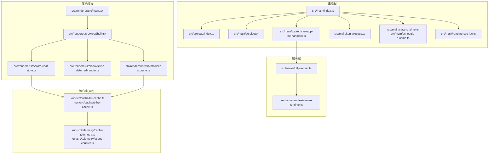
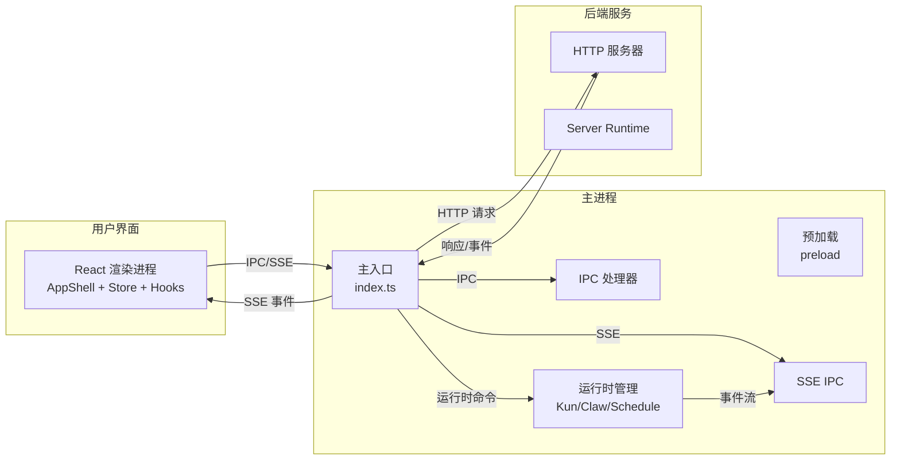
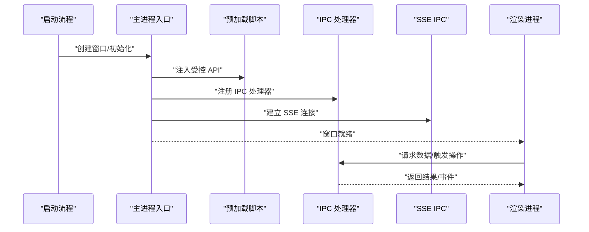
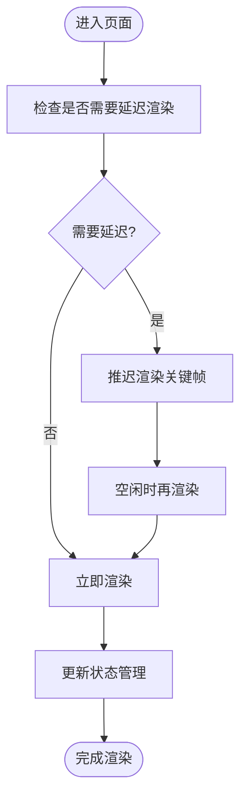
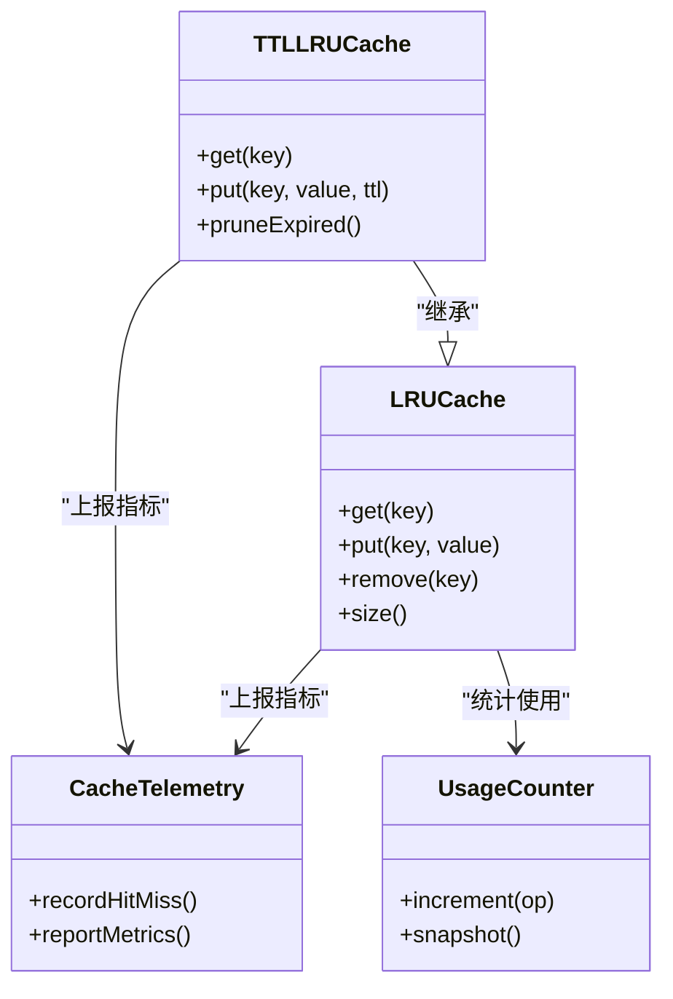
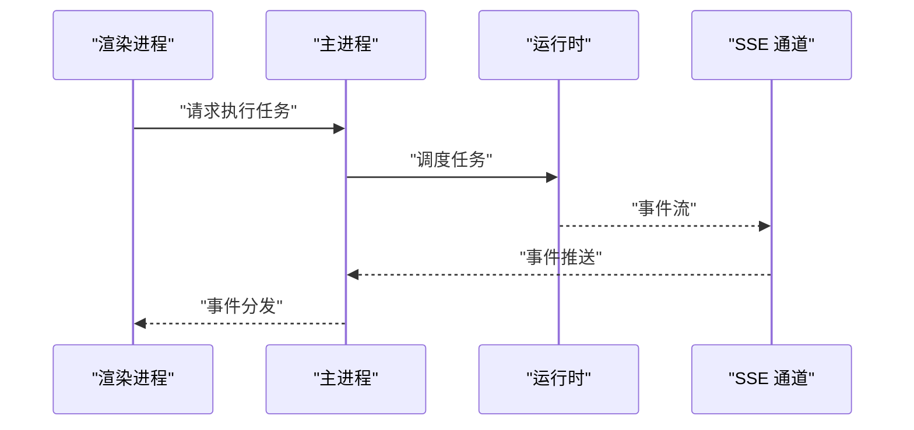
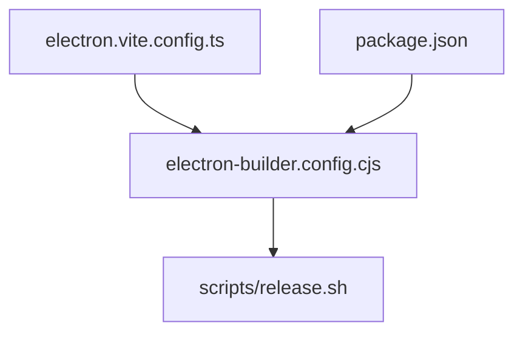

# 性能优化

<cite>
**本文引用的文件**
- [electron.vite.config.ts](file://electron.vite.config.ts)
- [package.json](file://package.json)
- [src/main/index.ts](file://src/main/index.ts)
- [src/preload/index.ts](file://src/preload/index.ts)
- [src/renderer/src/main.tsx](file://src/renderer/src/main.tsx)
- [src/renderer/src/AppShell.tsx](file://src/renderer/src/AppShell.tsx)
- [src/renderer/src/store/chat-store.ts](file://src/renderer/src/store/chat-store.ts)
- [src/renderer/src/hooks/use-deferred-render.ts](file://src/renderer/src/hooks/use-deferred-render.ts)
- [src/renderer/src/lib/browser-storage.ts](file://src/renderer/src/lib/browser-storage.ts)
- [src/shared/app-settings.ts](file://src/shared/app-settings.ts)
- [src/main/services/workspace-service.ts](file://src/main/services/workspace-service.ts)
- [src/main/ipc/register-app-ipc-handlers.ts](file://src/main/ipc/register-app-ipc-handlers.ts)
- [src/main/kun-process.ts](file://src/main/kun-process.ts)
- [src/main/claw-runtime.ts](file://src/main/claw-runtime.ts)
- [src/main/schedule-runtime.ts](file://src/main/schedule-runtime.ts)
- [src/main/runtime-sse-ipc.ts](file://src/main/runtime-sse-ipc.ts)
- [src/server/http-server.ts](file://src/server/http-server.ts)
- [src/server/routes/server-runtime.ts](file://src/server/routes/server-runtime.ts)
- [kun/src/cache/lru-cache.ts](file://kun/src/cache/lru-cache.ts)
- [kun/src/cache/ttl-lru-cache.ts](file://kun/src/cache/ttl-lru-cache.ts)
- [kun/src/telemetry/cache-telemetry.ts](file://kun/src/telemetry/cache-telemetry.ts)
- [kun/src/telemetry/usage-counter.ts](file://kun/src/telemetry/usage-counter.ts)
- [scripts/release.sh](file://scripts/release.sh)
- [scripts/mac-notarize.cjs](file://scripts/mac-notarize.cjs)
- [scripts/generate-release-notes.cjs](file://scripts/generate-release-notes.cjs)
- [electron-builder.config.cjs](file://electron-builder.config.cjs)
</cite>

## 目录
1. [简介](#简介)
2. [项目结构](#项目结构)
3. [核心组件](#核心组件)
4. [架构总览](#架构总览)
5. [详细组件分析](#详细组件分析)
6. [依赖分析](#依赖分析)
7. [性能考虑](#性能考虑)
8. [故障排查指南](#故障排查指南)
9. [结论](#结论)
10. [附录](#附录)

## 简介
本指南面向需要提升 DeepSeek GUI 应用性能的高级开发者，聚焦以下目标：
- 深入分析内存使用、CPU 占用与启动时间瓶颈
- 解释 Electron 应用的性能优化策略（进程间通信、渲染器性能、资源加载）
- 提供代码级优化技巧（懒加载、缓存策略、算法优化）
- 给出性能监控工具使用、性能指标分析与基准测试方法
- 提供生产环境优化建议（资源压缩、打包优化）

## 项目结构
DeepSeek GUI 采用 Electron + React 技术栈，主进程负责系统集成、IPC、服务与运行时管理；渲染进程承载 UI 与业务逻辑；后端服务提供 HTTP 接口与 SSE 流式数据；核心能力库（kun）提供缓存、遥测等通用能力。

图表来源
- [src/main/index.ts](file://src/main/index.ts)
- [src/preload/index.ts](file://src/preload/index.ts)
- [src/main/services/workspace-service.ts](file://src/main/services/workspace-service.ts)
- [src/main/ipc/register-app-ipc-handlers.ts](file://src/main/ipc/register-app-ipc-handlers.ts)
- [src/main/kun-process.ts](file://src/main/kun-process.ts)
- [src/main/claw-runtime.ts](file://src/main/claw-runtime.ts)
- [src/main/schedule-runtime.ts](file://src/main/schedule-runtime.ts)
- [src/main/runtime-sse-ipc.ts](file://src/main/runtime-sse-ipc.ts)
- [src/renderer/src/main.tsx](file://src/renderer/src/main.tsx)
- [src/renderer/src/AppShell.tsx](file://src/renderer/src/AppShell.tsx)
- [src/renderer/src/store/chat-store.ts](file://src/renderer/src/store/chat-store.ts)
- [src/renderer/src/hooks/use-deferred-render.ts](file://src/renderer/src/hooks/use-deferred-render.ts)
- [src/renderer/src/lib/browser-storage.ts](file://src/renderer/src/lib/browser-storage.ts)
- [src/server/http-server.ts](file://src/server/http-server.ts)
- [src/server/routes/server-runtime.ts](file://src/server/routes/server-runtime.ts)
- [kun/src/cache/lru-cache.ts](file://kun/src/cache/lru-cache.ts)
- [kun/src/cache/ttl-lru-cache.ts](file://kun/src/cache/ttl-lru-cache.ts)
- [kun/src/telemetry/cache-telemetry.ts](file://kun/src/telemetry/cache-telemetry.ts)
- [kun/src/telemetry/usage-counter.ts](file://kun/src/telemetry/usage-counter.ts)

章节来源
- [electron.vite.config.ts](file://electron.vite.config.ts)
- [package.json](file://package.json)

## 核心组件
- 主进程入口与生命周期：负责窗口创建、菜单、托盘、协议处理、更新与打包流程。
- 预加载脚本：在受限上下文暴露受控 API，避免直接注入全局对象。
- 渲染器壳层与状态管理：AppShell 负责布局与路由，chat-store 管理会话与消息状态，use-deferred-render 实现延迟渲染以降低首屏压力。
- IPC 与运行时：注册 IPC 处理器，连接后端 HTTP 服务与 SSE 流，协调主/渲染进程通信。
- 服务与运行时：工作区服务、工具链运行时（Claw/Schedule）、Kun 进程管理与 SSE IPC。
- 缓存与遥测：LRU/TTL 缓存、缓存命中率统计与使用计数，辅助性能优化与问题定位。

章节来源
- [src/main/index.ts](file://src/main/index.ts)
- [src/preload/index.ts](file://src/preload/index.ts)
- [src/renderer/src/AppShell.tsx](file://src/renderer/src/AppShell.tsx)
- [src/renderer/src/store/chat-store.ts](file://src/renderer/src/store/chat-store.ts)
- [src/renderer/src/hooks/use-deferred-render.ts](file://src/renderer/src/hooks/use-deferred-render.ts)
- [src/main/ipc/register-app-ipc-handlers.ts](file://src/main/ipc/register-app-ipc-handlers.ts)
- [src/main/runtime-sse-ipc.ts](file://src/main/runtime-sse-ipc.ts)
- [src/main/kun-process.ts](file://src/main/kun-process.ts)
- [src/main/claw-runtime.ts](file://src/main/claw-runtime.ts)
- [src/main/schedule-runtime.ts](file://src/main/schedule-runtime.ts)
- [kun/src/cache/lru-cache.ts](file://kun/src/cache/lru-cache.ts)
- [kun/src/cache/ttl-lru-cache.ts](file://kun/src/cache/ttl-lru-cache.ts)
- [kun/src/telemetry/cache-telemetry.ts](file://kun/src/telemetry/cache-telemetry.ts)
- [kun/src/telemetry/usage-counter.ts](file://kun/src/telemetry/usage-counter.ts)

## 架构总览
Electron 应用采用“主进程 + 渲染进程 + 后端服务”的三层架构。主进程负责系统级能力与 IPC；渲染进程承载 UI 与业务逻辑；后端服务提供 HTTP 接口与 SSE 流式事件，用于实时交互。

图表来源
- [src/renderer/src/main.tsx](file://src/renderer/src/main.tsx)
- [src/renderer/src/AppShell.tsx](file://src/renderer/src/AppShell.tsx)
- [src/main/index.ts](file://src/main/index.ts)
- [src/preload/index.ts](file://src/preload/index.ts)
- [src/main/ipc/register-app-ipc-handlers.ts](file://src/main/ipc/register-app-ipc-handlers.ts)
- [src/main/runtime-sse-ipc.ts](file://src/main/runtime-sse-ipc.ts)
- [src/server/http-server.ts](file://src/server/http-server.ts)
- [src/server/routes/server-runtime.ts](file://src/server/routes/server-runtime.ts)

## 详细组件分析

### 主进程与启动性能
- 启动路径与窗口创建：主入口负责初始化日志、设置 CSP、注册 IPC、启动服务与运行时。
- 预加载脚本：通过隔离上下文暴露受控 API，避免在渲染进程中直接访问 Node/Electron API。
- 进程间通信：IPC 处理器集中注册，减少重复监听与跨进程调用开销。
- 运行时与 SSE：运行时管理器负责与后端服务建立 SSE 连接，实现低延迟事件推送。

图表来源
- [src/main/index.ts](file://src/main/index.ts)
- [src/preload/index.ts](file://src/preload/index.ts)
- [src/main/ipc/register-app-ipc-handlers.ts](file://src/main/ipc/register-app-ipc-handlers.ts)
- [src/main/runtime-sse-ipc.ts](file://src/main/runtime-sse-ipc.ts)

章节来源
- [src/main/index.ts](file://src/main/index.ts)
- [src/preload/index.ts](file://src/preload/index.ts)
- [src/main/ipc/register-app-ipc-handlers.ts](file://src/main/ipc/register-app-ipc-handlers.ts)
- [src/main/runtime-sse-ipc.ts](file://src/main/runtime-sse-ipc.ts)

### 渲染器性能与状态管理
- 延迟渲染 Hook：对非关键区域或大列表进行延迟渲染，降低首屏与滚动卡顿。
- 状态管理：chat-store 聚合会话与消息状态，避免过度拆分导致的频繁重渲染。
- 本地存储：browser-storage 将热点数据持久化到浏览器存储，减少重复计算与网络请求。
- 应用壳层：AppShell 负责布局与导航，保持最小化渲染树，提高可交互性。

图表来源
- [src/renderer/src/hooks/use-deferred-render.ts](file://src/renderer/src/hooks/use-deferred-render.ts)
- [src/renderer/src/store/chat-store.ts](file://src/renderer/src/store/chat-store.ts)
- [src/renderer/src/lib/browser-storage.ts](file://src/renderer/src/lib/browser-storage.ts)
- [src/renderer/src/AppShell.tsx](file://src/renderer/src/AppShell.tsx)

章节来源
- [src/renderer/src/hooks/use-deferred-render.ts](file://src/renderer/src/hooks/use-deferred-render.ts)
- [src/renderer/src/store/chat-store.ts](file://src/renderer/src/store/chat-store.ts)
- [src/renderer/src/lib/browser-storage.ts](file://src/renderer/src/lib/browser-storage.ts)
- [src/renderer/src/AppShell.tsx](file://src/renderer/src/AppShell.tsx)

### 缓存与算法优化
- LRU 缓存：基于键值映射与双向链表实现 O(1) 访问与淘汰，适用于高频查询场景。
- TTL-LRU 缓存：在 LRU 基础上增加过期时间，避免陈旧数据占用内存。
- 缓存遥测：记录命中率与容量使用，辅助评估缓存策略有效性。
- 使用计数：统计关键操作次数，结合缓存命中率分析性能影响。

图表来源
- [kun/src/cache/lru-cache.ts](file://kun/src/cache/lru-cache.ts)
- [kun/src/cache/ttl-lru-cache.ts](file://kun/src/cache/ttl-lru-cache.ts)
- [kun/src/telemetry/cache-telemetry.ts](file://kun/src/telemetry/cache-telemetry.ts)
- [kun/src/telemetry/usage-counter.ts](file://kun/src/telemetry/usage-counter.ts)

章节来源
- [kun/src/cache/lru-cache.ts](file://kun/src/cache/lru-cache.ts)
- [kun/src/cache/ttl-lru-cache.ts](file://kun/src/cache/ttl-lru-cache.ts)
- [kun/src/telemetry/cache-telemetry.ts](file://kun/src/telemetry/cache-telemetry.ts)
- [kun/src/telemetry/usage-counter.ts](file://kun/src/telemetry/usage-counter.ts)

### IPC 与 SSE 通信优化
- IPC 设计：集中注册处理器，避免重复监听；批量合并小消息，减少线程切换。
- SSE 事件：按需订阅，避免一次性推送过多事件；对事件进行去抖与节流。
- 运行时管理：Kun/Claw/Schedule 运行时通过 SSE 与主进程通信，确保事件顺序与一致性。

图表来源
- [src/main/ipc/register-app-ipc-handlers.ts](file://src/main/ipc/register-app-ipc-handlers.ts)
- [src/main/runtime-sse-ipc.ts](file://src/main/runtime-sse-ipc.ts)
- [src/main/claw-runtime.ts](file://src/main/claw-runtime.ts)
- [src/main/schedule-runtime.ts](file://src/main/schedule-runtime.ts)

章节来源
- [src/main/ipc/register-app-ipc-handlers.ts](file://src/main/ipc/register-app-ipc-handlers.ts)
- [src/main/runtime-sse-ipc.ts](file://src/main/runtime-sse-ipc.ts)
- [src/main/claw-runtime.ts](file://src/main/claw-runtime.ts)
- [src/main/schedule-runtime.ts](file://src/main/schedule-runtime.ts)

### 服务端与资源加载优化
- HTTP 服务器：提供健康检查、会话、线程、附件等接口，支持 SSE 事件推送。
- 资源加载：静态资源由构建工具打包，启用压缩与缓存头；动态资源按需加载。
- 运行时路由：Server Runtime 负责聚合运行时信息与事件，减少客户端轮询。

章节来源
- [src/server/http-server.ts](file://src/server/http-server.ts)
- [src/server/routes/server-runtime.ts](file://src/server/routes/server-runtime.ts)

## 依赖分析
- 构建与打包：Vite 配置与 Electron Builder 配置共同决定产物体积与加载速度。
- 依赖版本：package.json 中的依赖版本直接影响兼容性与性能特征。
- 平台脚本：发布脚本与签名脚本影响最终包体大小与验证流程。

图表来源
- [electron.vite.config.ts](file://electron.vite.config.ts)
- [package.json](file://package.json)
- [electron-builder.config.cjs](file://electron-builder.config.cjs)
- [scripts/release.sh](file://scripts/release.sh)

章节来源
- [electron.vite.config.ts](file://electron.vite.config.ts)
- [package.json](file://package.json)
- [electron-builder.config.cjs](file://electron-builder.config.cjs)
- [scripts/release.sh](file://scripts/release.sh)

## 性能考虑
- 内存使用
  - 使用 LRU/TTL 缓存控制热点数据规模，定期清理过期项。
  - 在渲染器中限制大型对象的驻留，优先使用轻量结构。
  - 利用浏览器存储持久化必要数据，减少重复计算与网络请求。
- CPU 占用
  - 对长列表与复杂组件使用延迟渲染与虚拟化。
  - 合并 IPC/SSE 事件，避免高频小消息导致主线程阻塞。
  - 在主进程避免长时间同步操作，使用异步队列与批处理。
- 启动时间
  - 预加载脚本最小化，仅暴露必要 API。
  - 将非关键模块懒加载，缩短首屏依赖链。
  - 构建阶段启用代码分割与 Tree Shaking，移除未使用代码。
- 资源加载
  - 启用 Gzip/Brotli 压缩与合适的缓存头。
  - 图片与字体按需加载，使用 WebP 或 AVIF 替代传统格式。
- 打包优化
  - Electron Builder 配置中开启压缩与多平台产物优化。
  - 发布脚本中加入签名与公证流程，减少安装失败与重试成本。

## 故障排查指南
- 性能监控
  - 使用浏览器开发工具的时间线与内存面板定位卡顿与泄漏。
  - 结合缓存遥测与使用计数，分析缓存命中率与热点操作。
- IPC 与 SSE
  - 检查 IPC 处理器是否重复注册，确认事件订阅是否正确去抖。
  - 观察 SSE 连接状态与事件频率，避免过度推送。
- 日志与诊断
  - 主进程日志输出与错误捕获，辅助定位异常。
  - 运行时与服务端健康检查接口，快速判断服务可用性。

章节来源
- [kun/src/telemetry/cache-telemetry.ts](file://kun/src/telemetry/cache-telemetry.ts)
- [kun/src/telemetry/usage-counter.ts](file://kun/src/telemetry/usage-counter.ts)
- [src/main/ipc/register-app-ipc-handlers.ts](file://src/main/ipc/register-app-ipc-handlers.ts)
- [src/main/runtime-sse-ipc.ts](file://src/main/runtime-sse-ipc.ts)
- [src/server/http-server.ts](file://src/server/http-server.ts)

## 结论
通过合理的缓存策略、IPC/SSE 通信优化、渲染器性能提升与打包配置，DeepSeek GUI 可在保证功能完整性的同时显著提升性能与用户体验。建议持续引入遥测与基准测试，形成闭环优化机制。

## 附录
- 生产环境优化清单
  - 启用压缩与缓存头
  - 代码分割与 Tree Shaking
  - 资源格式优化（WebP/AVIF、矢量图标）
  - Electron Builder 多平台优化
  - 发布脚本中的签名与公证
- 基准测试方法
  - 首屏时间、交互延迟、内存峰值、CPU 占用率
  - 缓存命中率、事件吞吐量、IPC 调用耗时
  - 使用自动化脚本定期回归，建立性能基线