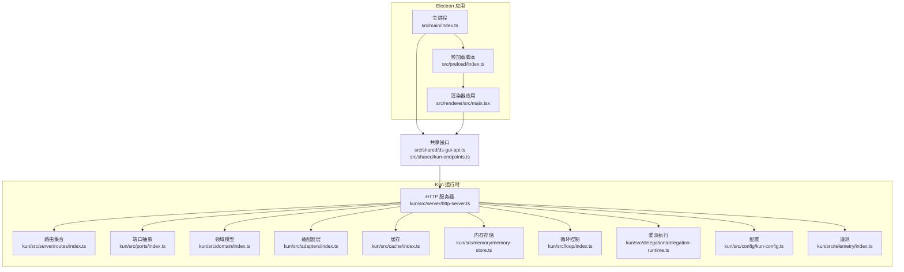
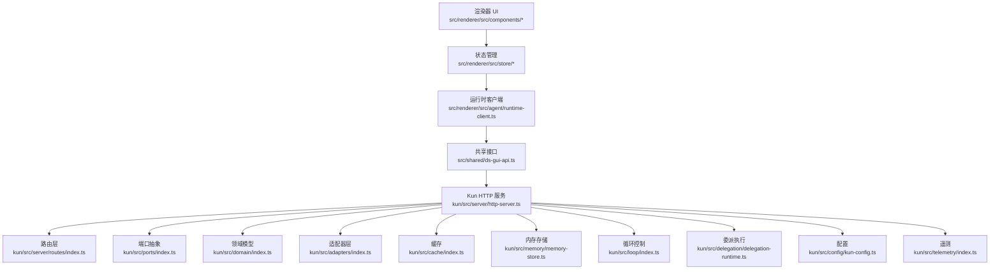
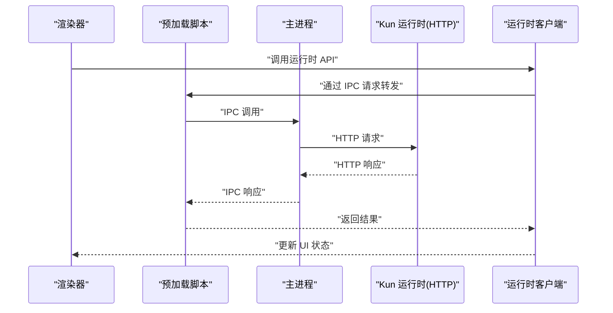
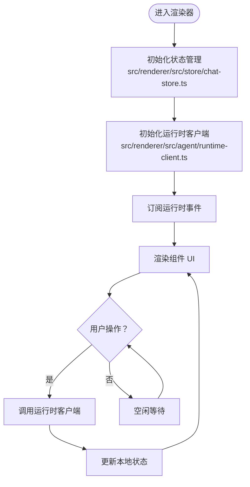
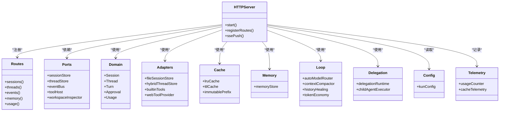
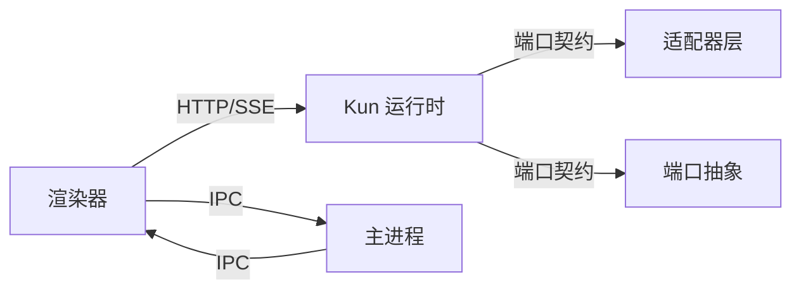

# 架构概览

<cite>
**本文引用的文件**
- [src/main/index.ts](file://src/main/index.ts)
- [src/main/ipc/register-app-ipc-handlers.ts](file://src/main/ipc/register-app-ipc-handlers.ts)
- [src/main/ipc/app-ipc-schemas.ts](file://src/main/ipc/app-ipc-schemas.ts)
- [src/main/runtime/kun-adapter.ts](file://src/main/runtime/kun-adapter.ts)
- [src/main/services/workspace-service.ts](file://src/main/services/workspace-service.ts)
- [src/main/services/skill-service.ts](file://src/main/services/skill-service.ts)
- [src/main/claw-runtime.ts](file://src/main/claw-runtime.ts)
- [src/main/schedule-runtime.ts](file://src/main/schedule-runtime.ts)
- [src/preload/index.ts](file://src/preload/index.ts)
- [src/renderer/src/main.tsx](file://src/renderer/src/main.tsx)
- [src/renderer/src/AppShell.tsx](file://src/renderer/src/AppShell.tsx)
- [src/renderer/src/store/chat-store.ts](file://src/renderer/src/store/chat-store.ts)
- [src/renderer/src/agent/runtime-client.ts](file://src/renderer/src/agent/runtime-client.ts)
- [src/renderer/src/agent/kun-runtime.ts](file://src/renderer/src/agent/kun-runtime.ts)
- [src/shared/ds-gui-api.ts](file://src/shared/ds-gui-api.ts)
- [src/shared/kun-endpoints.ts](file://src/shared/kun-endpoints.ts)
- [kun/src/server/http-server.ts](file://kun/src/server/http-server.ts)
- [kun/src/server/routes/index.ts](file://kun/src/server/routes/index.ts)
- [kun/src/ports/index.ts](file://kun/src/ports/index.ts)
- [kun/src/domain/index.ts](file://kun/src/domain/index.ts)
- [kun/src/adapters/index.ts](file://kun/src/adapters/index.ts)
- [kun/src/cache/index.ts](file://kun/src/cache/index.ts)
- [kun/src/memory/memory-store.ts](file://kun/src/memory/memory-store.ts)
- [kun/src/loop/index.ts](file://kun/src/loop/index.ts)
- [kun/src/delegation/delegation-runtime.ts](file://kun/src/delegation/delegation-runtime.ts)
- [kun/src/config/kun-config.ts](file://kun/src/config/kun-config.ts)
- [kun/src/telemetry/index.ts](file://kun/src/telemetry/index.ts)
- [docs/kun-architecture.md](file://docs/kun-architecture.md)
- [DESIGN.md](file://DESIGN.md)
</cite>

## 目录
1. [引言](#引言)
2. [项目结构](#项目结构)
3. [核心组件](#核心组件)
4. [架构总览](#架构总览)
5. [详细组件分析](#详细组件分析)
6. [依赖分析](#依赖分析)
7. [性能考虑](#性能考虑)
8. [故障排查指南](#故障排查指南)
9. [结论](#结论)
10. [附录](#附录)

## 引言
本文件为 DeepSeek GUI 的架构概览文档，面向希望快速理解系统整体设计与分层职责的读者。DeepSeek GUI 采用三层架构：Electron 主进程负责系统生命周期、进程管理与 IPC；React 渲染器应用承载用户界面与状态管理；Kun 运行时核心作为独立服务提供对话、计划、写作、调度等能力。文档将解释事件驱动模式、IPC 通信机制、状态管理模式，并给出系统边界、组件关系与数据流向图示，帮助初学者建立全局认知。

## 项目结构
项目采用多包组织方式：
- 主进程与渲染器：位于 src/main 与 src/renderer，分别处理 Electron 主进程逻辑与 React 前端应用。
- 预加载脚本：位于 src/preload，为渲染器提供受限能力桥接。
- 共享接口：位于 src/shared，统一前后端通信协议与运行时端点。
- Kun 运行时：位于 kun/src，提供完整的 AI Agent 能力与服务化接口。

图表来源
- [src/main/index.ts:1-200](file://src/main/index.ts#L1-L200)
- [src/preload/index.ts:1-120](file://src/preload/index.ts#L1-L120)
- [src/renderer/src/main.tsx:1-120](file://src/renderer/src/main.tsx#L1-L120)
- [src/shared/ds-gui-api.ts:1-200](file://src/shared/ds-gui-api.ts#L1-L200)
- [src/shared/kun-endpoints.ts:1-200](file://src/shared/kun-endpoints.ts#L1-L200)
- [kun/src/server/http-server.ts:1-200](file://kun/src/server/http-server.ts#L1-L200)
- [kun/src/server/routes/index.ts:1-200](file://kun/src/server/routes/index.ts#L1-L200)
- [kun/src/ports/index.ts:1-200](file://kun/src/ports/index.ts#L1-L200)
- [kun/src/domain/index.ts:1-200](file://kun/src/domain/index.ts#L1-L200)
- [kun/src/adapters/index.ts:1-200](file://kun/src/adapters/index.ts#L1-L200)
- [kun/src/cache/index.ts:1-200](file://kun/src/cache/index.ts#L1-L200)
- [kun/src/memory/memory-store.ts:1-200](file://kun/src/memory/memory-store.ts#L1-L200)
- [kun/src/loop/index.ts:1-200](file://kun/src/loop/index.ts#L1-L200)
- [kun/src/delegation/delegation-runtime.ts:1-200](file://kun/src/delegation/delegation-runtime.ts#L1-L200)
- [kun/src/config/kun-config.ts:1-200](file://kun/src/config/kun-config.ts#L1-L200)
- [kun/src/telemetry/index.ts:1-200](file://kun/src/telemetry/index.ts#L1-L200)

章节来源
- [src/main/index.ts:1-200](file://src/main/index.ts#L1-L200)
- [src/renderer/src/main.tsx:1-120](file://src/renderer/src/main.tsx#L1-L120)
- [kun/src/server/http-server.ts:1-200](file://kun/src/server/http-server.ts#L1-L200)

## 核心组件
- Electron 主进程：负责窗口生命周期、菜单、更新、系统集成、以及与 Kun 运行时的进程与 IPC 管理。
- 预加载脚本：在受控上下文中向渲染器暴露有限 API，确保安全隔离。
- React 渲染器：包含应用壳层、状态管理、组件库与业务视图，通过运行时客户端与 Kun 交互。
- Kun 运行时：以 HTTP 服务形式提供会话、线程、工具、记忆、缓存、遥测等能力，支持事件总线与 SSE 推送。

章节来源
- [src/main/index.ts:1-200](file://src/main/index.ts#L1-L200)
- [src/preload/index.ts:1-120](file://src/preload/index.ts#L1-L120)
- [src/renderer/src/AppShell.tsx:1-200](file://src/renderer/src/AppShell.tsx#L1-L200)
- [kun/src/server/http-server.ts:1-200](file://kun/src/server/http-server.ts#L1-L200)

## 架构总览
DeepSeek GUI 的架构遵循“主进程-渲染器-Kun 运行时”的分层设计，强调职责分离与事件驱动。主进程负责系统级任务与进程间通信；渲染器聚焦 UI 与状态；Kun 以服务化能力支撑 AI Agent 的完整闭环。

图表来源
- [src/renderer/src/agent/runtime-client.ts:1-200](file://src/renderer/src/agent/runtime-client.ts#L1-L200)
- [src/shared/ds-gui-api.ts:1-200](file://src/shared/ds-gui-api.ts#L1-L200)
- [kun/src/server/http-server.ts:1-200](file://kun/src/server/http-server.ts#L1-L200)
- [kun/src/server/routes/index.ts:1-200](file://kun/src/server/routes/index.ts#L1-L200)
- [kun/src/ports/index.ts:1-200](file://kun/src/ports/index.ts#L1-L200)
- [kun/src/domain/index.ts:1-200](file://kun/src/domain/index.ts#L1-L200)
- [kun/src/adapters/index.ts:1-200](file://kun/src/adapters/index.ts#L1-L200)
- [kun/src/cache/index.ts:1-200](file://kun/src/cache/index.ts#L1-L200)
- [kun/src/memory/memory-store.ts:1-200](file://kun/src/memory/memory-store.ts#L1-L200)
- [kun/src/loop/index.ts:1-200](file://kun/src/loop/index.ts#L1-L200)
- [kun/src/delegation/delegation-runtime.ts:1-200](file://kun/src/delegation/delegation-runtime.ts#L1-L200)
- [kun/src/config/kun-config.ts:1-200](file://kun/src/config/kun-config.ts#L1-L200)
- [kun/src/telemetry/index.ts:1-200](file://kun/src/telemetry/index.ts#L1-L200)

## 详细组件分析

### 主进程与 IPC
- 主进程入口负责创建窗口、加载预加载脚本、注册 IPC 处理器与系统服务。
- IPC 注册集中于处理器模块，定义请求/响应契约与类型校验。
- 预加载脚本向渲染器暴露受控方法，避免直接访问 Node/Electron API。

图表来源
- [src/main/ipc/register-app-ipc-handlers.ts:1-200](file://src/main/ipc/register-app-ipc-handlers.ts#L1-L200)
- [src/main/ipc/app-ipc-schemas.ts:1-200](file://src/main/ipc/app-ipc-schemas.ts#L1-L200)
- [src/preload/index.ts:1-120](file://src/preload/index.ts#L1-L120)
- [src/renderer/src/agent/runtime-client.ts:1-200](file://src/renderer/src/agent/runtime-client.ts#L1-L200)
- [kun/src/server/http-server.ts:1-200](file://kun/src/server/http-server.ts#L1-L200)

章节来源
- [src/main/index.ts:1-200](file://src/main/index.ts#L1-L200)
- [src/main/ipc/register-app-ipc-handlers.ts:1-200](file://src/main/ipc/register-app-ipc-handlers.ts#L1-L200)
- [src/main/ipc/app-ipc-schemas.ts:1-200](file://src/main/ipc/app-ipc-schemas.ts#L1-L200)
- [src/preload/index.ts:1-120](file://src/preload/index.ts#L1-L120)

### 渲染器与状态管理
- 渲染器应用通过应用壳层组织页面与布局，组件按功能域拆分（聊天、写作、计划、调度等）。
- 状态管理采用集中式 store，结合运行时客户端进行数据同步与事件订阅。
- 运行时客户端封装与 Kun 的通信细节，提供易用的调用接口。

图表来源
- [src/renderer/src/store/chat-store.ts:1-200](file://src/renderer/src/store/chat-store.ts#L1-L200)
- [src/renderer/src/agent/runtime-client.ts:1-200](file://src/renderer/src/agent/runtime-client.ts#L1-L200)
- [src/renderer/src/AppShell.tsx:1-200](file://src/renderer/src/AppShell.tsx#L1-L200)

章节来源
- [src/renderer/src/store/chat-store.ts:1-200](file://src/renderer/src/store/chat-store.ts#L1-L200)
- [src/renderer/src/agent/runtime-client.ts:1-200](file://src/renderer/src/agent/runtime-client.ts#L1-L200)
- [src/renderer/src/AppShell.tsx:1-200](file://src/renderer/src/AppShell.tsx#L1-L200)

### Kun 运行时核心
- HTTP 服务器：提供 REST/SSE 接口，路由聚合各业务域资源。
- 端口抽象：定义对外能力契约（如会话存储、事件总线、工具宿主等），便于替换实现。
- 领域模型：围绕会话、线程、回合、审批、用量等实体建模。
- 适配器层：文件/混合存储、工具实现、工作区检查器等。
- 缓存与内存：LRU/TTL 缓存、不可变前缀缓存、内存存储。
- 循环控制：自动模型路由、上下文压缩、历史修复、令牌经济等。
- 委派执行：子代理执行与委派运行时。
- 配置与遥测：统一配置加载与用量计数、缓存统计等遥测指标。

图表来源
- [kun/src/server/http-server.ts:1-200](file://kun/src/server/http-server.ts#L1-L200)
- [kun/src/server/routes/index.ts:1-200](file://kun/src/server/routes/index.ts#L1-L200)
- [kun/src/ports/index.ts:1-200](file://kun/src/ports/index.ts#L1-L200)
- [kun/src/domain/index.ts:1-200](file://kun/src/domain/index.ts#L1-L200)
- [kun/src/adapters/index.ts:1-200](file://kun/src/adapters/index.ts#L1-L200)
- [kun/src/cache/index.ts:1-200](file://kun/src/cache/index.ts#L1-L200)
- [kun/src/memory/memory-store.ts:1-200](file://kun/src/memory/memory-store.ts#L1-L200)
- [kun/src/loop/index.ts:1-200](file://kun/src/loop/index.ts#L1-L200)
- [kun/src/delegation/delegation-runtime.ts:1-200](file://kun/src/delegation/delegation-runtime.ts#L1-L200)
- [kun/src/config/kun-config.ts:1-200](file://kun/src/config/kun-config.ts#L1-L200)
- [kun/src/telemetry/index.ts:1-200](file://kun/src/telemetry/index.ts#L1-L200)

章节来源
- [kun/src/server/http-server.ts:1-200](file://kun/src/server/http-server.ts#L1-L200)
- [kun/src/server/routes/index.ts:1-200](file://kun/src/server/routes/index.ts#L1-L200)
- [kun/src/ports/index.ts:1-200](file://kun/src/ports/index.ts#L1-L200)
- [kun/src/domain/index.ts:1-200](file://kun/src/domain/index.ts#L1-L200)
- [kun/src/adapters/index.ts:1-200](file://kun/src/adapters/index.ts#L1-L200)
- [kun/src/cache/index.ts:1-200](file://kun/src/cache/index.ts#L1-L200)
- [kun/src/memory/memory-store.ts:1-200](file://kun/src/memory/memory-store.ts#L1-L200)
- [kun/src/loop/index.ts:1-200](file://kun/src/loop/index.ts#L1-L200)
- [kun/src/delegation/delegation-runtime.ts:1-200](file://kun/src/delegation/delegation-runtime.ts#L1-L200)
- [kun/src/config/kun-config.ts:1-200](file://kun/src/config/kun-config.ts#L1-L200)
- [kun/src/telemetry/index.ts:1-200](file://kun/src/telemetry/index.ts#L1-L200)

### 事件驱动与状态管理
- 事件驱动：Kun 内部通过事件总线发布领域事件，渲染器通过运行时客户端订阅并更新本地状态。
- 状态管理：集中式 store 维护 UI 所需的状态快照，避免跨组件状态漂移。
- IPC 与 SSE：主进程负责 IPC 转发，Kun 通过 SSE 向前端推送增量事件，降低轮询开销。

章节来源
- [src/renderer/src/agent/runtime-client.ts:1-200](file://src/renderer/src/agent/runtime-client.ts#L1-L200)
- [src/renderer/src/store/chat-store.ts:1-200](file://src/renderer/src/store/chat-store.ts#L1-L200)
- [kun/src/ports/event-bus.ts:1-200](file://kun/src/ports/event-bus.ts#L1-L200)

### 技术选型与设计原则
- Electron + React：桌面应用与现代 UI 开发的最佳组合，利于快速迭代与生态复用。
- 事件驱动与端口抽象：通过事件总线与端口契约解耦实现细节，提升可测试性与可扩展性。
- 分层架构与职责分离：主进程、渲染器、Kun 运行时三层边界清晰，便于团队协作与维护。
- 安全与隔离：预加载脚本限制渲染器权限，避免直接访问系统 API。
- 可观测性：遥测与缓存统计贯穿运行时，便于性能优化与问题定位。

章节来源
- [DESIGN.md:1-200](file://DESIGN.md#L1-L200)
- [docs/kun-architecture.md:1-200](file://docs/kun-architecture.md#L1-L200)

## 依赖分析
- 组件内聚：渲染器内部按功能域高内聚，跨域通过运行时客户端解耦。
- 组件耦合：主进程与渲染器通过 IPC 解耦；渲染器与 Kun 通过 HTTP/SSE 解耦。
- 外部依赖：Electron、React、TypeScript、Vitest、TailwindCSS 等。
- 潜在风险：IPC 与网络延迟可能影响用户体验，建议引入本地缓存与乐观更新策略。

图表来源
- [src/renderer/src/agent/runtime-client.ts:1-200](file://src/renderer/src/agent/runtime-client.ts#L1-L200)
- [src/main/ipc/register-app-ipc-handlers.ts:1-200](file://src/main/ipc/register-app-ipc-handlers.ts#L1-L200)
- [kun/src/ports/index.ts:1-200](file://kun/src/ports/index.ts#L1-L200)
- [kun/src/adapters/index.ts:1-200](file://kun/src/adapters/index.ts#L1-L200)

章节来源
- [src/renderer/src/agent/runtime-client.ts:1-200](file://src/renderer/src/agent/runtime-client.ts#L1-L200)
- [src/main/ipc/register-app-ipc-handlers.ts:1-200](file://src/main/ipc/register-app-ipc-handlers.ts#L1-L200)
- [kun/src/ports/index.ts:1-200](file://kun/src/ports/index.ts#L1-L200)

## 性能考虑
- 缓存策略：利用 LRU/TTL 缓存与不可变前缀缓存减少重复计算与 IO。
- 上下文压缩：通过上下文压缩与历史修复降低 Token 使用，提升性价比。
- 事件流优化：SSE 推送替代轮询，减少网络与 CPU 开销。
- 本地状态：集中式 store 结合局部组件状态，避免过度重渲染。
- 工具限流：内置工具速率限制与风暴防护，防止突发流量冲击。

章节来源
- [kun/src/cache/index.ts:1-200](file://kun/src/cache/index.ts#L1-L200)
- [kun/src/loop/context-compactor.ts:1-200](file://kun/src/loop/context-compactor.ts#L1-L200)
- [kun/src/loop/history-healing.ts:1-200](file://kun/src/loop/history-healing.ts#L1-L200)
- [kun/src/loop/token-economy.ts:1-200](file://kun/src/loop/token-economy.ts#L1-L200)
- [kun/src/loop/tool-storm-breaker.ts:1-200](file://kun/src/loop/tool-storm-breaker.ts#L1-L200)

## 故障排查指南
- 运行时健康检查：通过健康检查端点确认 Kun 服务可用性。
- 日志与错误格式化：统一错误格式化与诊断信息输出，便于定位问题。
- 更新与回滚：GUI 自更新机制与回退策略，确保稳定性。
- 工作区与文件：工作区服务与文件操作异常排查流程。

章节来源
- [src/main/kun-health.ts:1-200](file://src/main/kun-health.ts#L1-L200)
- [src/shared/format-runtime-error.ts:1-200](file://src/shared/format-runtime-error.ts#L1-L200)
- [src/main/gui-updater.ts:1-200](file://src/main/gui-updater.ts#L1-L200)
- [src/main/services/workspace-service.ts:1-200](file://src/main/services/workspace-service.ts#L1-L200)

## 结论
DeepSeek GUI 通过清晰的三层架构实现了桌面应用、前端 UI 与 AI Agent 运行时的解耦。主进程负责系统与 IPC，渲染器专注体验与状态，Kun 提供完备的能力服务。事件驱动与端口抽象保证了系统的可扩展性与可维护性。建议在后续开发中持续完善缓存与事件流优化，强化可观测性与自动化测试，以支撑更大规模的功能演进。

## 附录
- 架构演进与规划：参考设计文档与架构文档，明确从单体到微服务化的演进方向，逐步将更多能力服务化与容器化。
- 最佳实践：保持端口契约稳定、事件命名规范、状态结构化、错误统一化。

章节来源
- [DESIGN.md:1-200](file://DESIGN.md#L1-L200)
- [docs/kun-architecture.md:1-200](file://docs/kun-architecture.md#L1-L200)