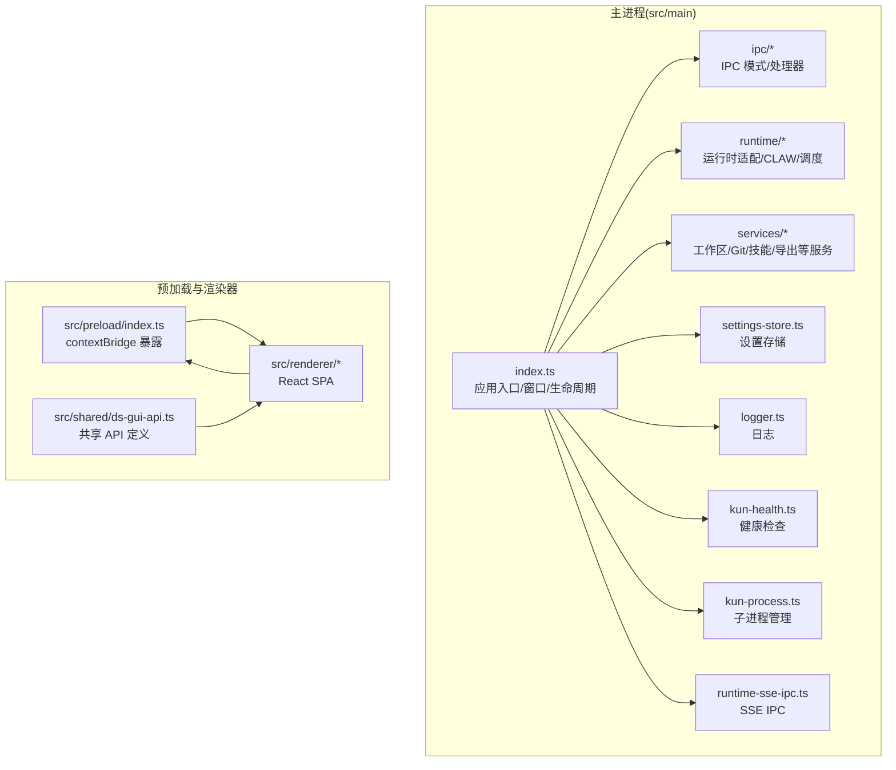
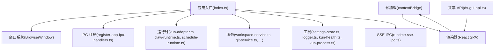
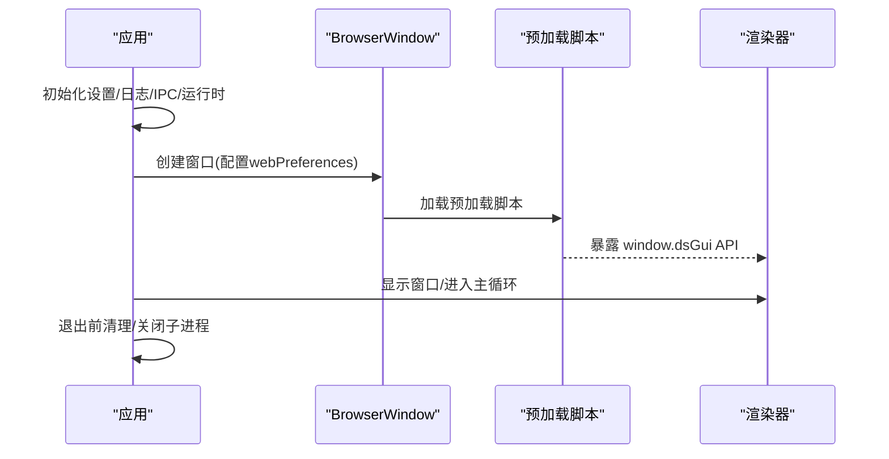
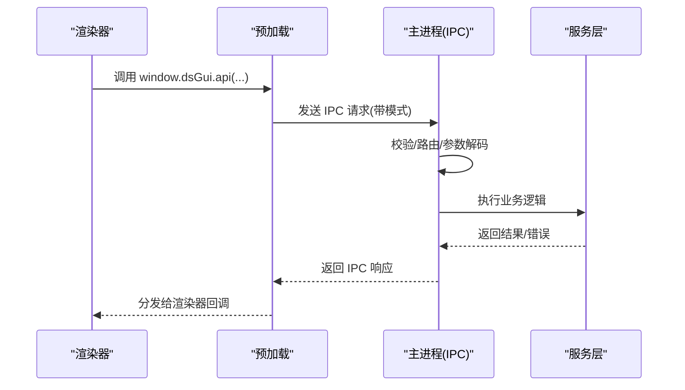
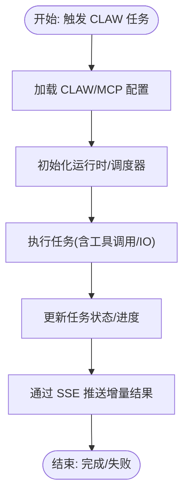
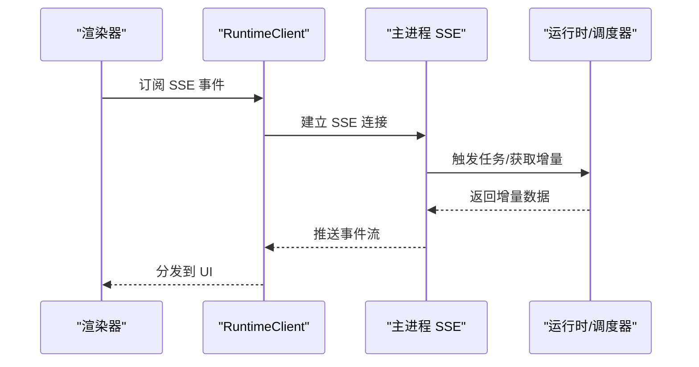
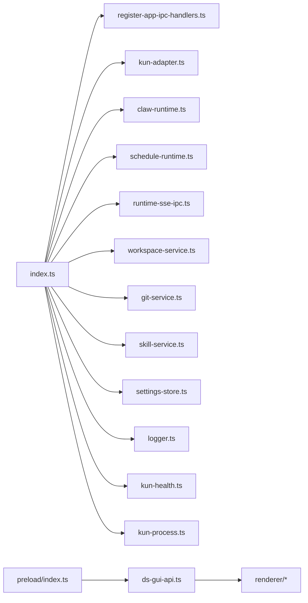

# Electron 主进程

<cite>
**本文引用的文件**
- [electron.vite.config.ts](file://electron.vite.config.ts)
- [DESIGN.md](file://DESIGN.md)
- [DESIGN.zh-CN.md](file://DESIGN.zh-CN.md)
- [src/main/index.ts](file://src/main/index.ts)
- [src/main/ipc/app-ipc-schemas.ts](file://src/main/ipc/app-ipc-schemas.ts)
- [src/main/ipc/register-app-ipc-handlers.ts](file://src/main/ipc/register-app-ipc-handlers.ts)
- [src/main/runtime/kun-adapter.ts](file://src/main/runtime/kun-adapter.ts)
- [src/main/claw-runtime.ts](file://src/main/claw-runtime.ts)
- [src/main/claw-runtime-helpers.ts](file://src/main/claw-runtime-helpers.ts)
- [src/main/claw-schedule-mcp-config.ts](file://src/main/claw-schedule-mcp-config.ts)
- [src/main/claw-schedule-mcp-server.ts](file://src/main/claw-schedule-mcp-server.ts)
- [src/main/claw-schedule-mcp-node-entry.ts](file://src/main/claw-schedule-mcp-node-entry.ts)
- [src/main/schedule-runtime.ts](file://src/main/schedule-runtime.ts)
- [src/main/schedule-runtime-helpers.ts](file://src/main/schedule-runtime-helpers.ts)
- [src/main/runtime-sse-ipc.ts](file://src/main/runtime-sse-ipc.ts)
- [src/main/settings-store.ts](file://src/main/settings-store.ts)
- [src/main/logger.ts](file://src/main/logger.ts)
- [src/main/kun-health.ts](file://src/main/kun-health.ts)
- [src/main/kun-process.ts](file://src/main/kun-process.ts)
- [src/main/gui-updater.ts](file://src/main/gui-updater.ts)
- [src/main/upstream-models.ts](file://src/main/upstream-models.ts)
- [src/main/kun-base-url.ts](file://src/main/kun-base-url.ts)
- [src/main/services/workspace-service.ts](file://src/main/services/workspace-service.ts)
- [src/main/services/write-inline-completion-service.ts](file://src/main/services/write-inline-completion-service.ts)
- [src/main/services/write-retrieval-service.ts](file://src/main/services/write-retrieval-service.ts)
- [src/main/services/write-export-service.ts](file://src/main/services/write-export-service.ts)
- [src/main/services/git-service.ts](file://src/main/services/git-service.ts)
- [src/main/services/skill-service.ts](file://src/main/services/skill-service.ts)
- [src/main/services/workspace-editors.ts](file://src/main/services/workspace-editors.ts)
- [src/main/services/workspace-files.ts](file://src/main/services/workspace-files.ts)
- [src/main/services/workspace-paths.ts](file://src/main/services/workspace-paths.ts)
- [src/preload/index.ts](file://src/preload/index.ts)
- [src/renderer/src/agent/runtime-client.ts](file://src/renderer/src/agent/runtime-client.ts)
- [src/renderer/src/store/chat-store-runtime.ts](file://src/renderer/src/store/chat-store-runtime.ts)
- [src/shared/ds-gui-api.ts](file://src/shared/ds-gui-api.ts)
</cite>

## 目录
1. [简介](#简介)
2. [项目结构](#项目结构)
3. [核心组件](#核心组件)
4. [架构总览](#架构总览)
5. [详细组件分析](#详细组件分析)
6. [依赖关系分析](#依赖关系分析)
7. [性能考量](#性能考量)
8. [故障排查指南](#故障排查指南)
9. [结论](#结论)
10. [附录](#附录)

## 简介
本文件面向需要扩展或维护 Electron 主进程的开发者，系统性梳理主进程的启动流程、应用生命周期管理、窗口系统实现、IPC 通信机制，并深入解析 CLAW 运行时、调度运行时、SSE IPC 的实现原理与使用方式。文档同时覆盖主进程与渲染器之间的通信协议、消息传递机制、错误处理策略、进程间数据传输格式、安全考虑与性能优化建议。

## 项目结构
主进程相关代码集中在 src/main 目录，配合 electron-vite 配置定义了主进程与预加载脚本的构建入口；设计文档明确了三大进程角色及其职责边界。

**图表来源**
- [electron.vite.config.ts:1-37](file://electron.vite.config.ts#L1-L37)
- [DESIGN.md:889-901](file://DESIGN.md#L889-L901)
- [DESIGN.zh-CN.md:889-901](file://DESIGN.zh-CN.md#L889-L901)

**章节来源**
- [electron.vite.config.ts:1-37](file://electron.vite.config.ts#L1-L37)
- [DESIGN.md:889-901](file://DESIGN.md#L889-L901)
- [DESIGN.zh-CN.md:889-901](file://DESIGN.zh-CN.md#L889-L901)

## 核心组件
- 应用入口与窗口系统：负责应用初始化、窗口创建、菜单栏/标题栏样式、上下文隔离与沙箱配置、预加载脚本加载失败的错误上报。
- IPC 通信：定义消息模式与处理器注册，统一消息格式与错误传播。
- 运行时适配：Kun 适配器对接后端运行时能力；CLAW 运行时与调度运行时支撑任务编排与 MCP 交互。
- SSE IPC：基于服务器推送事件的实时通信通道，用于向渲染器推送增量更新。
- 服务层：工作区、Git、技能、导出等业务服务，封装对文件系统与外部工具的访问。
- 设置与日志：集中化设置存储与日志记录，便于诊断与运维。
- 健康检查与子进程：监控后端子进程状态，保障运行稳定性。

**章节来源**
- [src/main/index.ts:535-570](file://src/main/index.ts#L535-L570)
- [src/main/ipc/app-ipc-schemas.ts](file://src/main/ipc/app-ipc-schemas.ts)
- [src/main/ipc/register-app-ipc-handlers.ts](file://src/main/ipc/register-app-ipc-handlers.ts)
- [src/main/runtime/kun-adapter.ts](file://src/main/runtime/kun-adapter.ts)
- [src/main/claw-runtime.ts](file://src/main/claw-runtime.ts)
- [src/main/claw-runtime-helpers.ts](file://src/main/claw-runtime-helpers.ts)
- [src/main/claw-schedule-mcp-server.ts](file://src/main/claw-schedule-mcp-server.ts)
- [src/main/schedule-runtime.ts](file://src/main/schedule-runtime.ts)
- [src/main/runtime-sse-ipc.ts](file://src/main/runtime-sse-ipc.ts)
- [src/main/settings-store.ts](file://src/main/settings-store.ts)
- [src/main/logger.ts](file://src/main/logger.ts)
- [src/main/kun-health.ts](file://src/main/kun-health.ts)
- [src/main/kun-process.ts](file://src/main/kun-process.ts)

## 架构总览
主进程采用“入口-窗口-IPC-运行时-服务-工具”的分层架构。入口负责生命周期与窗口；IPC 层抽象消息协议；运行时层承载 CLAW 与调度逻辑；服务层提供具体业务能力；工具层提供设置、日志、健康检查与子进程管理。

**图表来源**
- [src/main/index.ts:535-570](file://src/main/index.ts#L535-L570)
- [src/main/ipc/register-app-ipc-handlers.ts](file://src/main/ipc/register-app-ipc-handlers.ts)
- [src/main/runtime/kun-adapter.ts](file://src/main/runtime/kun-adapter.ts)
- [src/main/claw-runtime.ts](file://src/main/claw-runtime.ts)
- [src/main/schedule-runtime.ts](file://src/main/schedule-runtime.ts)
- [src/main/services/workspace-service.ts](file://src/main/services/workspace-service.ts)
- [src/main/settings-store.ts](file://src/main/settings-store.ts)
- [src/main/logger.ts](file://src/main/logger.ts)
- [src/main/kun-health.ts](file://src/main/kun-health.ts)
- [src/main/kun-process.ts](file://src/main/kun-process.ts)
- [src/main/runtime-sse-ipc.ts](file://src/main/runtime-sse-ipc.ts)
- [src/preload/index.ts](file://src/preload/index.ts)
- [src/shared/ds-gui-api.ts](file://src/shared/ds-gui-api.ts)

## 详细组件分析

### 启动流程与应用生命周期
- 入口初始化：读取设置、准备日志、注册 IPC 处理器、启动健康检查与子进程监控。
- 窗口创建：根据平台设置标题栏样式、最小尺寸、图标、webPreferences（上下文隔离、沙箱、webviewTag）；监听预加载脚本加载错误并记录。
- 生命周期钩子：在退出前清理资源、保存状态、关闭子进程；处理单实例锁与多实例行为。

**图表来源**
- [src/main/index.ts:535-570](file://src/main/index.ts#L535-L570)
- [src/preload/index.ts](file://src/preload/index.ts)

**章节来源**
- [src/main/index.ts:535-570](file://src/main/index.ts#L535-L570)

### 窗口系统实现
- 平台差异化：macOS 使用隐藏式 inset 标题栏；Windows/Linux 可选择隐藏式标题栏并启用覆盖层；自动隐藏菜单栏。
- 安全配置：启用上下文隔离、沙箱、允许 webviewTag。
- 错误处理：监听预加载脚本加载错误，记录详细信息以便诊断。

**章节来源**
- [src/main/index.ts:540-570](file://src/main/index.ts#L540-L570)

### IPC 通信机制与消息协议
- 消息模式：通过统一的模式定义确保请求/响应结构一致，便于类型推断与校验。
- 处理器注册：集中注册 IPC 处理器，按通道路由到对应业务逻辑，返回标准化结果或错误。
- 渲染器调用：渲染器通过预加载桥接 API 调用主进程能力，主进程以异步回调或 SSE 推送结果。

**图表来源**
- [src/main/ipc/app-ipc-schemas.ts](file://src/main/ipc/app-ipc-schemas.ts)
- [src/main/ipc/register-app-ipc-handlers.ts](file://src/main/ipc/register-app-ipc-handlers.ts)
- [src/preload/index.ts](file://src/preload/index.ts)
- [src/shared/ds-gui-api.ts](file://src/shared/ds-gui-api.ts)

**章节来源**
- [src/main/ipc/app-ipc-schemas.ts](file://src/main/ipc/app-ipc-schemas.ts)
- [src/main/ipc/register-app-ipc-handlers.ts](file://src/main/ipc/register-app-ipc-handlers.ts)
- [src/preload/index.ts](file://src/preload/index.ts)
- [src/shared/ds-gui-api.ts](file://src/shared/ds-gui-api.ts)

### CLAW 运行时与调度运行时
- CLAW 运行时：封装与后端运行时的交互，提供统一的任务执行接口与错误处理。
- 调度运行时：负责任务编排、定时与周期性任务管理，结合 MCP 配置与服务端交互。
- MCP 集成：通过 MCP 配置与服务端建立连接，支持节点入口与服务端通信。

**图表来源**
- [src/main/claw-runtime.ts](file://src/main/claw-runtime.ts)
- [src/main/claw-runtime-helpers.ts](file://src/main/claw-runtime-helpers.ts)
- [src/main/claw-schedule-mcp-config.ts](file://src/main/claw-schedule-mcp-config.ts)
- [src/main/claw-schedule-mcp-server.ts](file://src/main/claw-schedule-mcp-server.ts)
- [src/main/claw-schedule-mcp-node-entry.ts](file://src/main/claw-schedule-mcp-node-entry.ts)
- [src/main/schedule-runtime.ts](file://src/main/schedule-runtime.ts)
- [src/main/schedule-runtime-helpers.ts](file://src/main/schedule-runtime-helpers.ts)
- [src/main/runtime-sse-ipc.ts](file://src/main/runtime-sse-ipc.ts)

**章节来源**
- [src/main/claw-runtime.ts](file://src/main/claw-runtime.ts)
- [src/main/claw-runtime-helpers.ts](file://src/main/claw-runtime-helpers.ts)
- [src/main/claw-schedule-mcp-config.ts](file://src/main/claw-schedule-mcp-config.ts)
- [src/main/claw-schedule-mcp-server.ts](file://src/main/claw-schedule-mcp-server.ts)
- [src/main/claw-schedule-mcp-node-entry.ts](file://src/main/claw-schedule-mcp-node-entry.ts)
- [src/main/schedule-runtime.ts](file://src/main/schedule-runtime.ts)
- [src/main/schedule-runtime-helpers.ts](file://src/main/schedule-runtime-helpers.ts)
- [src/main/runtime-sse-ipc.ts](file://src/main/runtime-sse-ipc.ts)

### SSE IPC 实现原理与使用
- 通道建立：主进程维护 SSE 连接，渲染器通过客户端订阅增量事件。
- 数据格式：以事件流形式推送结构化数据，包含事件类型、负载与元数据。
- 使用场景：适用于长时任务、实时进度、增量输出等场景，避免轮询带来的开销。

**图表来源**
- [src/main/runtime-sse-ipc.ts](file://src/main/runtime-sse-ipc.ts)
- [src/renderer/src/agent/runtime-client.ts](file://src/renderer/src/agent/runtime-client.ts)
- [src/renderer/src/store/chat-store-runtime.ts](file://src/renderer/src/store/chat-store-runtime.ts)

**章节来源**
- [src/main/runtime-sse-ipc.ts](file://src/main/runtime-sse-ipc.ts)
- [src/renderer/src/agent/runtime-client.ts](file://src/renderer/src/agent/runtime-client.ts)
- [src/renderer/src/store/chat-store-runtime.ts](file://src/renderer/src/store/chat-store-runtime.ts)

### 主进程与渲染器通信协议
- 预加载桥接：通过 contextBridge 将受控 API 暴露给渲染器，禁止 Node 能力泄漏。
- API 定义：共享 API 文件统一定义可用方法、参数与返回值，保证类型一致性。
- 调用路径：渲染器 -> 预加载 -> 主进程 IPC/SSE -> 服务层 -> 结果回传。

**章节来源**
- [src/preload/index.ts](file://src/preload/index.ts)
- [src/shared/ds-gui-api.ts](file://src/shared/ds-gui-api.ts)

### 错误处理策略
- 统一错误包装：将后端错误映射为主进程可识别的结构，携带错误码、消息与上下文。
- 日志记录：关键路径打点与异常捕获，结合日志模块输出到文件与控制台。
- 健康检查：定期探测后端子进程状态，异常时触发重启或降级策略。
- IPC 错误：处理器内捕获异常并返回标准化错误对象，避免崩溃传播。

**章节来源**
- [src/main/logger.ts](file://src/main/logger.ts)
- [src/main/kun-health.ts](file://src/main/kun-health.ts)
- [src/main/kun-process.ts](file://src/main/kun-process.ts)

### 进程间数据传输格式
- IPC 请求/响应：以模式驱动的数据结构传输，字段包含命令、参数、时间戳与签名（如适用）。
- SSE 事件：事件类型标识、负载 JSON、错误标记与进度指标。
- 设置存储：键值对持久化，支持默认值与归一化处理。

**章节来源**
- [src/main/ipc/app-ipc-schemas.ts](file://src/main/ipc/app-ipc-schemas.ts)
- [src/main/runtime-sse-ipc.ts](file://src/main/runtime-sse-ipc.ts)
- [src/main/settings-store.ts](file://src/main/settings-store.ts)

### 安全考虑
- 上下文隔离与沙箱：严格限制渲染器访问 Node 能力，仅通过预加载桥接暴露必要 API。
- 预加载错误监控：捕获并记录预加载脚本加载失败，防止未知风险。
- 最小权限原则：服务层访问文件系统与外部工具时遵循最小权限与白名单策略。
- 输入验证：IPC 与 SSE 均进行参数校验与类型约束，拒绝非法输入。

**章节来源**
- [src/main/index.ts:540-570](file://src/main/index.ts#L540-L570)
- [src/preload/index.ts](file://src/preload/index.ts)

### 性能优化
- 构建配置：使用 externalizeDepsPlugin 减少打包体积，主/预加载分别构建以提升开发体验。
- 窗口延迟显示：窗口创建后延迟展示，避免白屏；最小尺寸与固定宽高减少布局抖动。
- SSE 增量推送：长任务采用 SSE 推送，降低轮询成本与内存占用。
- 子进程复用：健康检查与重启策略减少频繁启停带来的开销。

**章节来源**
- [electron.vite.config.ts:1-37](file://electron.vite.config.ts#L1-L37)
- [src/main/index.ts:540-570](file://src/main/index.ts#L540-L570)
- [src/main/runtime-sse-ipc.ts](file://src/main/runtime-sse-ipc.ts)
- [src/main/kun-health.ts](file://src/main/kun-health.ts)

## 依赖关系分析
主进程内部模块耦合清晰，围绕“入口-IPC-运行时-服务-工具”形成稳定依赖链；预加载与渲染器通过共享 API 解耦。

**图表来源**
- [src/main/index.ts:535-570](file://src/main/index.ts#L535-L570)
- [src/main/ipc/register-app-ipc-handlers.ts](file://src/main/ipc/register-app-ipc-handlers.ts)
- [src/main/runtime/kun-adapter.ts](file://src/main/runtime/kun-adapter.ts)
- [src/main/claw-runtime.ts](file://src/main/claw-runtime.ts)
- [src/main/schedule-runtime.ts](file://src/main/schedule-runtime.ts)
- [src/main/runtime-sse-ipc.ts](file://src/main/runtime-sse-ipc.ts)
- [src/main/services/workspace-service.ts](file://src/main/services/workspace-service.ts)
- [src/main/services/git-service.ts](file://src/main/services/git-service.ts)
- [src/main/services/skill-service.ts](file://src/main/services/skill-service.ts)
- [src/main/settings-store.ts](file://src/main/settings-store.ts)
- [src/main/logger.ts](file://src/main/logger.ts)
- [src/main/kun-health.ts](file://src/main/kun-health.ts)
- [src/main/kun-process.ts](file://src/main/kun-process.ts)
- [src/preload/index.ts](file://src/preload/index.ts)
- [src/shared/ds-gui-api.ts](file://src/shared/ds-gui-api.ts)

**章节来源**
- [src/main/index.ts:535-570](file://src/main/index.ts#L535-L570)
- [src/main/ipc/register-app-ipc-handlers.ts](file://src/main/ipc/register-app-ipc-handlers.ts)
- [src/main/runtime/kun-adapter.ts](file://src/main/runtime/kun-adapter.ts)
- [src/main/claw-runtime.ts](file://src/main/claw-runtime.ts)
- [src/main/schedule-runtime.ts](file://src/main/schedule-runtime.ts)
- [src/main/runtime-sse-ipc.ts](file://src/main/runtime-sse-ipc.ts)
- [src/main/services/workspace-service.ts](file://src/main/services/workspace-service.ts)
- [src/main/services/git-service.ts](file://src/main/services/git-service.ts)
- [src/main/services/skill-service.ts](file://src/main/services/skill-service.ts)
- [src/main/settings-store.ts](file://src/main/settings-store.ts)
- [src/main/logger.ts](file://src/main/logger.ts)
- [src/main/kun-health.ts](file://src/main/kun-health.ts)
- [src/main/kun-process.ts](file://src/main/kun-process.ts)
- [src/preload/index.ts](file://src/preload/index.ts)
- [src/shared/ds-gui-api.ts](file://src/shared/ds-gui-api.ts)

## 性能考量
- 构建与打包：使用 externalizeDepsPlugin 与独立构建入口，缩短热重载时间。
- 窗口渲染：延迟显示与最小尺寸限制减少首屏抖动与重排。
- 通信优化：IPC 与 SSE 结合，长任务采用 SSE 增量推送，避免阻塞主线程。
- 资源回收：退出前清理定时器、事件监听与子进程句柄，防止内存泄漏。

[本节为通用指导，无需特定文件引用]

## 故障排查指南
- 预加载脚本加载失败：检查路径与权限，关注控制台与日志中的错误堆栈。
- IPC 调用超时或失败：确认处理器已注册、参数符合模式定义、服务层无异常。
- SSE 无法接收事件：检查主进程 SSE 连接状态、网络代理与防火墙设置。
- 子进程异常：查看健康检查日志，确认重启策略是否生效。
- 设置不生效：核对设置存储键名与归一化逻辑，确保默认值覆盖正确。

**章节来源**
- [src/main/index.ts:566-570](file://src/main/index.ts#L566-L570)
- [src/main/logger.ts](file://src/main/logger.ts)
- [src/main/kun-health.ts](file://src/main/kun-health.ts)
- [src/main/kun-process.ts](file://src/main/kun-process.ts)

## 结论
主进程通过清晰的分层架构与严格的 IPC/SSE 协议，实现了从窗口管理到运行时编排的完整能力闭环。依托预加载桥接与共享 API，既保证了安全性，又提供了良好的扩展性。建议在新增功能时遵循现有模式与处理器注册规范，优先采用 SSE 处理长任务，确保错误处理与日志记录完备。

[本节为总结，无需特定文件引用]

## 附录
- 配置项参考
  - 构建入口：主进程入口与 CLAW MCP 节点入口分别构建。
  - 窗口偏好：上下文隔离、沙箱、webviewTag、标题栏样式与覆盖层。
  - 设置存储：键值对持久化，支持默认值与归一化。
  - 健康检查：周期性探测与重启策略。
- 开发建议
  - 新增 IPC 接口：先定义模式，再注册处理器，最后在预加载与渲染器中暴露。
  - 新增 SSE 通道：明确事件类型与负载结构，确保渲染器侧有对应订阅逻辑。
  - 新增服务：封装业务逻辑与错误处理，避免直接在运行时层暴露底层细节。

**章节来源**
- [electron.vite.config.ts:1-37](file://electron.vite.config.ts#L1-L37)
- [src/main/index.ts:540-570](file://src/main/index.ts#L540-L570)
- [src/main/settings-store.ts](file://src/main/settings-store.ts)
- [src/main/kun-health.ts](file://src/main/kun-health.ts)