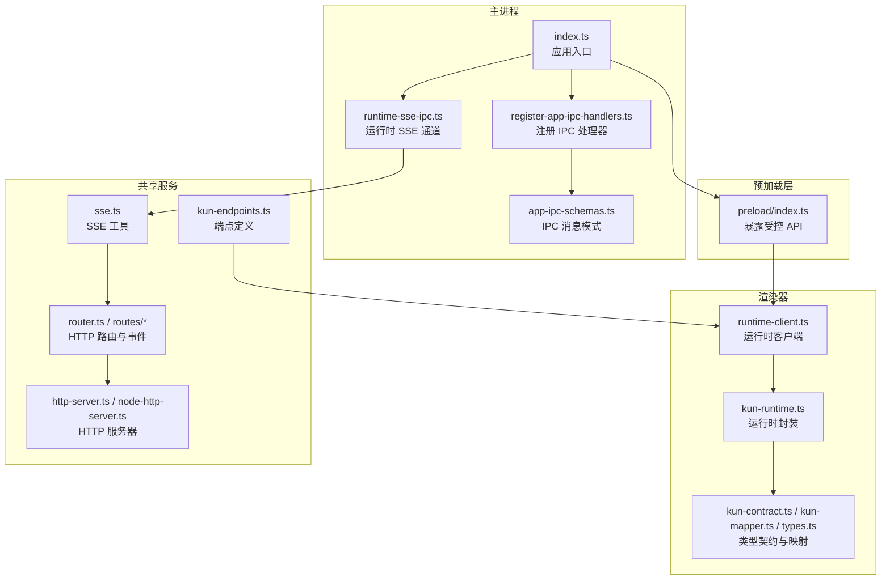
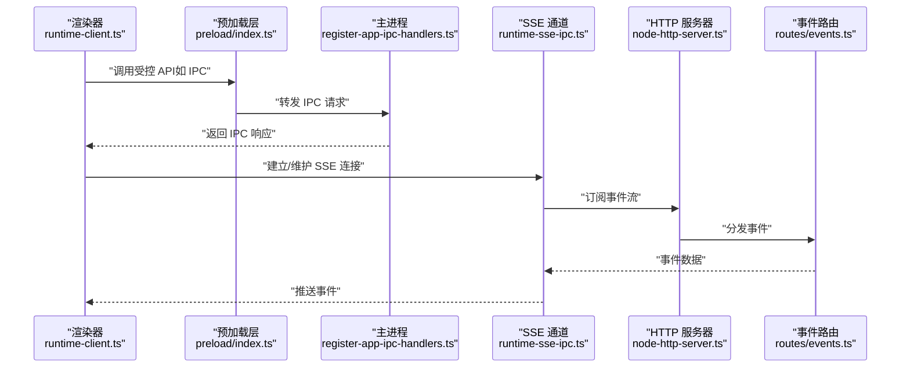
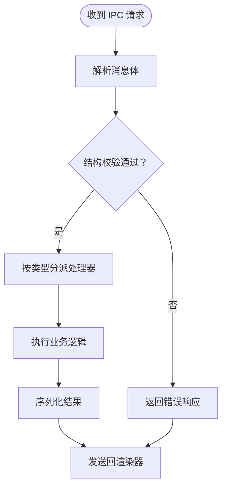
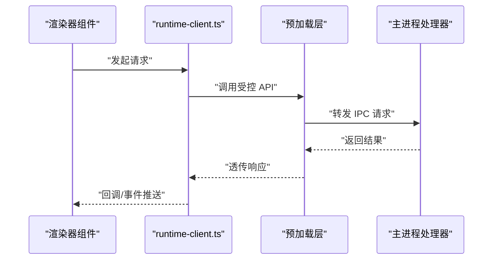
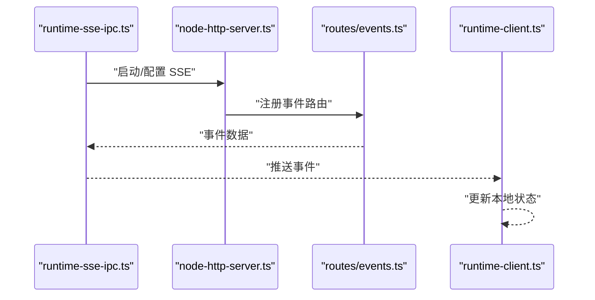
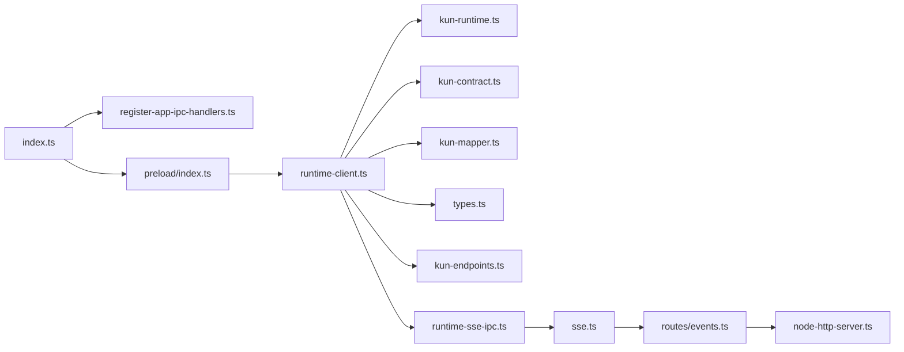

# IPC 通信机制

<cite>
**本文引用的文件**
- [app-ipc-schemas.ts](file://src/main/ipc/app-ipc-schemas.ts)
- [register-app-ipc-handlers.ts](file://src/main/ipc/register-app-ipc-handlers.ts)
- [runtime-client.ts](file://src/renderer/src/agent/runtime-client.ts)
- [runtime-sse-ipc.ts](file://src/main/runtime-sse-ipc.ts)
- [sse.ts](file://kun/src/server/sse.ts)
- [index.ts](file://src/main/index.ts)
- [preload.ts](file://src/preload/index.ts)
- [kun-runtime.ts](file://src/renderer/src/agent/kun-runtime.ts)
- [router.ts](file://kun/src/server/router.ts)
- [events.ts](file://kun/src/server/routes/events.ts)
- [runtime-info.ts](file://kun/src/server/routes/runtime-info.ts)
- [health.ts](file://kun/src/server/routes/health.ts)
- [runtime-error.ts](file://kun/src/server/routes/runtime-error.ts)
- [read-json-body.ts](file://kun/src/server/read-json-body.ts)
- [response.ts](file://kun/src/server/response.ts)
- [http-server.ts](file://kun/src/server/http-server.ts)
- [node-http-server.ts](file://kun/src/server/node-http-server.ts)
- [kun-contract.ts](file://src/renderer/src/agent/kun-contract.ts)
- [kun-mapper.ts](file://src/renderer/src/agent/kun-mapper.ts)
- [types.ts](file://src/renderer/src/agent/types.ts)
- [kun-endpoints.ts](file://src/shared/kun-endpoints.ts)
- [openai-compat-url.ts](file://src/shared/openai-compat-url.ts)
</cite>

## 目录
1. [引言](#引言)
2. [项目结构](#项目结构)
3. [核心组件](#核心组件)
4. [架构总览](#架构总览)
5. [详细组件分析](#详细组件分析)
6. [依赖关系分析](#依赖关系分析)
7. [性能考量](#性能考量)
8. [故障排查指南](#故障排查指南)
9. [结论](#结论)
10. [附录](#附录)

## 引言
本文件系统性解析主进程与渲染器进程之间的 IPC 通信机制，覆盖消息格式、处理器注册、序列化/反序列化、SSE 推送事件、连接管理与错误恢复策略，并补充安全、性能与调试建议。文档同时给出消息协议定义与使用示例，帮助开发者快速理解并正确使用该 IPC 体系。

## 项目结构
本项目的 IPC 通信由三部分组成：
- 主进程侧：IPC 消息定义与处理器注册、运行时 SSE 通道
- 渲染器侧：运行时客户端封装、类型契约与映射
- 共享层：HTTP SSE 路由与响应工具，以及通用端点定义

图表来源
- [index.ts](file://src/main/index.ts)
- [register-app-ipc-handlers.ts](file://src/main/ipc/register-app-ipc-handlers.ts)
- [app-ipc-schemas.ts](file://src/main/ipc/app-ipc-schemas.ts)
- [runtime-sse-ipc.ts](file://src/main/runtime-sse-ipc.ts)
- [preload.ts](file://src/preload/index.ts)
- [runtime-client.ts](file://src/renderer/src/agent/runtime-client.ts)
- [kun-runtime.ts](file://src/renderer/src/agent/kun-runtime.ts)
- [kun-contract.ts](file://src/renderer/src/agent/kun-contract.ts)
- [kun-mapper.ts](file://src/renderer/src/agent/kun-mapper.ts)
- [types.ts](file://src/renderer/src/agent/types.ts)
- [sse.ts](file://kun/src/server/sse.ts)
- [router.ts](file://kun/src/server/router.ts)
- [events.ts](file://kun/src/server/routes/events.ts)
- [http-server.ts](file://kun/src/server/http-server.ts)
- [node-http-server.ts](file://kun/src/server/node-http-server.ts)
- [kun-endpoints.ts](file://src/shared/kun-endpoints.ts)

章节来源
- [index.ts](file://src/main/index.ts)
- [preload.ts](file://src/preload/index.ts)

## 核心组件
- IPC 消息模式与处理器注册：在主进程侧集中定义消息结构与处理逻辑，确保类型安全与可维护性。
- 预加载层：通过受控 API 将主进程能力暴露给渲染器，避免直接访问不安全接口。
- 运行时客户端：封装渲染器侧的 IPC/SSE 访问，提供统一的调用入口与错误处理。
- SSE 通道：基于 HTTP Server-Sent Events 的实时推送，用于事件流与运行时状态更新。
- 共享端点与路由：统一的 HTTP 端点与路由，支撑 SSE 与常规 API。

章节来源
- [app-ipc-schemas.ts](file://src/main/ipc/app-ipc-schemas.ts)
- [register-app-ipc-handlers.ts](file://src/main/ipc/register-app-ipc-handlers.ts)
- [runtime-client.ts](file://src/renderer/src/agent/runtime-client.ts)
- [runtime-sse-ipc.ts](file://src/main/runtime-sse-ipc.ts)
- [sse.ts](file://kun/src/server/sse.ts)
- [router.ts](file://kun/src/server/router.ts)

## 架构总览
下图展示从渲染器到主进程再到服务端的完整链路，包括 IPC 与 SSE 的交互：

图表来源
- [runtime-client.ts](file://src/renderer/src/agent/runtime-client.ts)
- [preload.ts](file://src/preload/index.ts)
- [register-app-ipc-handlers.ts](file://src/main/ipc/register-app-ipc-handlers.ts)
- [runtime-sse-ipc.ts](file://src/main/runtime-sse-ipc.ts)
- [node-http-server.ts](file://kun/src/server/node-http-server.ts)
- [events.ts](file://kun/src/server/routes/events.ts)

## 详细组件分析

### IPC 消息格式与处理器注册
- 消息格式：通过集中定义的消息模式描述请求/响应结构，确保主进程与渲染器之间的一致性与类型安全。
- 处理器注册：在主进程侧注册各类 IPC 处理函数，按消息类型分派处理逻辑，支持异步与错误传播。
- 序列化/反序列化：IPC 层负责将复杂对象进行序列化传输，接收端再反序列化，必要时进行字段校验与转换。

图表来源
- [app-ipc-schemas.ts](file://src/main/ipc/app-ipc-schemas.ts)
- [register-app-ipc-handlers.ts](file://src/main/ipc/register-app-ipc-handlers.ts)

章节来源
- [app-ipc-schemas.ts](file://src/main/ipc/app-ipc-schemas.ts)
- [register-app-ipc-handlers.ts](file://src/main/ipc/register-app-ipc-handlers.ts)

### 预加载层与受控 API
- 预加载脚本在渲染器上下文中注入受控 API，限制渲染器对主进程能力的直接访问，仅暴露必要的 IPC/SSE 接口。
- 通过白名单式的方法名与参数校验，降低安全风险并保持清晰的边界。

章节来源
- [preload.ts](file://src/preload/index.ts)

### 渲染器侧运行时客户端
- 客户端封装了与主进程的 IPC 交互与 SSE 订阅流程，提供统一的调用方法与错误处理。
- 支持重连、退避与事件去抖，提升稳定性与用户体验。

图表来源
- [runtime-client.ts](file://src/renderer/src/agent/runtime-client.ts)
- [preload.ts](file://src/preload/index.ts)
- [register-app-ipc-handlers.ts](file://src/main/ipc/register-app-ipc-handlers.ts)

章节来源
- [runtime-client.ts](file://src/renderer/src/agent/runtime-client.ts)

### SSE 推送事件实现
- SSE 通道由主进程维护，结合 HTTP 服务器与事件路由，向渲染器推送实时事件。
- 事件路由负责将内部事件转换为标准的 SSE 数据帧，渲染器侧通过客户端持续订阅。

图表来源
- [runtime-sse-ipc.ts](file://src/main/runtime-sse-ipc.ts)
- [node-http-server.ts](file://kun/src/server/node-http-server.ts)
- [events.ts](file://kun/src/server/routes/events.ts)
- [runtime-client.ts](file://src/renderer/src/agent/runtime-client.ts)

章节来源
- [runtime-sse-ipc.ts](file://src/main/runtime-sse-ipc.ts)
- [sse.ts](file://kun/src/server/sse.ts)
- [events.ts](file://kun/src/server/routes/events.ts)

### 连接管理与错误恢复
- 连接管理：客户端维持长连接，监听断开事件并触发自动重连；主进程侧对异常连接进行清理与资源回收。
- 错误恢复：采用指数退避与最大重试次数控制，避免雪崩效应；对不可恢复错误进行明确的错误码与提示。

章节来源
- [runtime-client.ts](file://src/renderer/src/agent/runtime-client.ts)
- [runtime-sse-ipc.ts](file://src/main/runtime-sse-ipc.ts)

### 类型契约与映射
- 类型契约：在渲染器侧定义与后端一致的数据模型与事件结构，保证前后端一致性。
- 映射工具：提供数据转换与校验逻辑，减少样板代码并提升健壮性。

章节来源
- [kun-contract.ts](file://src/renderer/src/agent/kun-contract.ts)
- [kun-mapper.ts](file://src/renderer/src/agent/kun-mapper.ts)
- [types.ts](file://src/renderer/src/agent/types.ts)

### HTTP 路由与端点
- 路由：统一的路由层负责请求分发与中间件处理。
- 端点：共享端点定义确保前后端一致的 API 地址与版本管理。

章节来源
- [router.ts](file://kun/src/server/router.ts)
- [kun-endpoints.ts](file://src/shared/kun-endpoints.ts)

## 依赖关系分析
- 主进程入口负责初始化 IPC 与 SSE 通道，并在预加载层注入受控 API。
- 渲染器侧通过运行时客户端与预加载层交互，间接访问主进程能力。
- 服务端通过 SSE 与事件路由提供实时事件推送，渲染器侧进行订阅与消费。

图表来源
- [index.ts](file://src/main/index.ts)
- [register-app-ipc-handlers.ts](file://src/main/ipc/register-app-ipc-handlers.ts)
- [preload.ts](file://src/preload/index.ts)
- [runtime-client.ts](file://src/renderer/src/agent/runtime-client.ts)
- [kun-runtime.ts](file://src/renderer/src/agent/kun-runtime.ts)
- [kun-contract.ts](file://src/renderer/src/agent/kun-contract.ts)
- [kun-mapper.ts](file://src/renderer/src/agent/kun-mapper.ts)
- [types.ts](file://src/renderer/src/agent/types.ts)
- [kun-endpoints.ts](file://src/shared/kun-endpoints.ts)
- [runtime-sse-ipc.ts](file://src/main/runtime-sse-ipc.ts)
- [sse.ts](file://kun/src/server/sse.ts)
- [events.ts](file://kun/src/server/routes/events.ts)
- [node-http-server.ts](file://kun/src/server/node-http-server.ts)

章节来源
- [index.ts](file://src/main/index.ts)
- [preload.ts](file://src/preload/index.ts)
- [runtime-client.ts](file://src/renderer/src/agent/runtime-client.ts)

## 性能考量
- IPC 优化：批量合并小消息、避免频繁序列化大对象、使用流式处理减少内存峰值。
- SSE 优化：合理设置事件间隔与缓冲区大小，启用压缩与心跳保活，避免过多并发连接。
- 渲染器侧：对事件进行去抖与节流，减少 UI 更新频率；缓存热点数据以降低重复请求。
- 主进程侧：限制并发处理数量，使用队列与背压机制防止过载。

## 故障排查指南
- IPC 无响应或超时：检查处理器是否注册成功、消息结构是否匹配、序列化是否失败。
- SSE 连接中断：确认网络状况与防火墙设置，查看主进程日志中的连接清理信息。
- 渲染器事件未到达：验证客户端订阅逻辑与事件过滤条件，检查预加载层 API 注入是否正常。
- 错误码与状态：参考健康检查与运行时错误路由，定位具体错误来源并记录堆栈信息。

章节来源
- [health.ts](file://kun/src/server/routes/health.ts)
- [runtime-error.ts](file://kun/src/server/routes/runtime-error.ts)
- [runtime-client.ts](file://src/renderer/src/agent/runtime-client.ts)

## 结论
本 IPC 体系通过集中化的消息模式、严格的处理器注册与预加载层受控 API，实现了主进程与渲染器之间的安全、稳定通信。配合 SSE 实时事件推送与完善的错误恢复策略，整体具备良好的扩展性与可维护性。建议在实际使用中遵循本文的安全与性能建议，并结合调试技巧快速定位问题。

## 附录

### 消息协议定义（概要）
- 请求/响应结构：统一的消息模式定义请求体与响应体字段，包含必填项与可选项。
- 消息类型：按功能划分不同消息类型，处理器根据类型进行分派。
- 序列化策略：默认使用 JSON 序列化，必要时进行字段校验与类型修复。

章节来源
- [app-ipc-schemas.ts](file://src/main/ipc/app-ipc-schemas.ts)

### 使用示例（步骤说明）
- 在主进程侧注册处理器：参考处理器注册文件，添加新的消息类型与处理函数。
- 在渲染器侧调用：通过运行时客户端发起请求，等待响应或订阅事件。
- 订阅 SSE：在客户端初始化时建立连接，处理断线重连与事件去抖。
- 端点与路由：使用共享端点定义统一地址，确保前后端一致。

章节来源
- [register-app-ipc-handlers.ts](file://src/main/ipc/register-app-ipc-handlers.ts)
- [runtime-client.ts](file://src/renderer/src/agent/runtime-client.ts)
- [kun-endpoints.ts](file://src/shared/kun-endpoints.ts)