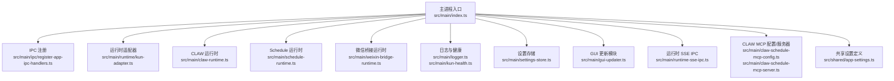
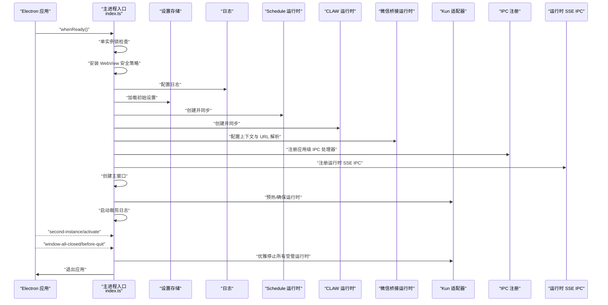
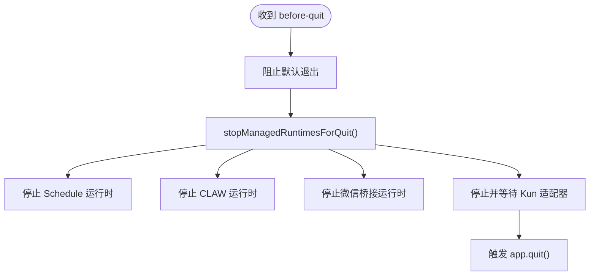
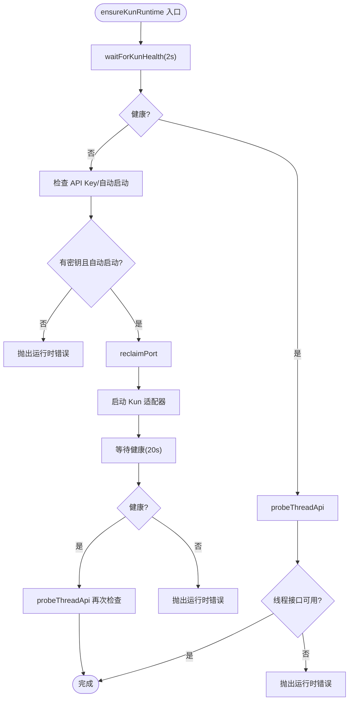
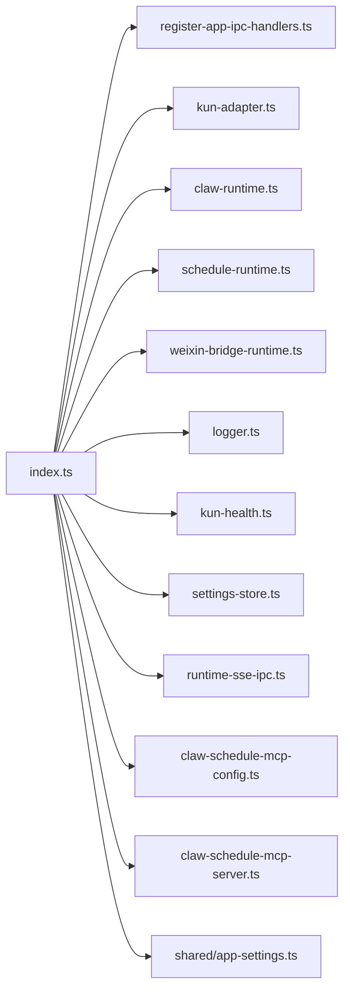

# 主进程生命周期

<cite>
**本文引用的文件**
- [src/main/index.ts](file://src/main/index.ts)
- [src/main/ipc/register-app-ipc-handlers.ts](file://src/main/ipc/register-app-ipc-handlers.ts)
- [src/main/runtime/kun-adapter.ts](file://src/main/runtime/kun-adapter.ts)
- [src/main/claw-runtime.ts](file://src/main/claw-runtime.ts)
- [src/main/schedule-runtime.ts](file://src/main/schedule-runtime.ts)
- [src/main/weixin-bridge-runtime.ts](file://src/main/weixin-bridge-runtime.ts)
- [src/main/claw-schedule-mcp-server.ts](file://src/main/claw-schedule-mcp-server.ts)
- [src/main/claw-schedule-mcp-config.ts](file://src/main/claw-schedule-mcp-config.ts)
- [src/main/logger.ts](file://src/main/logger.ts)
- [src/main/kun-health.ts](file://src/main/kun-health.ts)
- [src/main/settings-store.ts](file://src/main/settings-store.ts)
- [src/main/runtime-sse-ipc.ts](file://src/main/runtime-sse-ipc.ts)
- [src/shared/app-settings.ts](file://src/shared/app-settings.ts)
- [src/main/gui-updater.ts](file://src/main/gui-updater.ts)
</cite>

## 目录
1. [简介](#简介)
2. [项目结构](#项目结构)
3. [核心组件](#核心组件)
4. [架构总览](#架构总览)
5. [详细组件分析](#详细组件分析)
6. [依赖关系分析](#依赖关系分析)
7. [性能考虑](#性能考虑)
8. [故障排查指南](#故障排查指南)
9. [结论](#结论)
10. [附录](#附录)

## 简介
本文件系统性阐述 Electron 主进程的启动、运行与关闭全流程，覆盖应用初始化顺序、进程间通信（IPC）建立、资源清理机制，并深入解析进程健康检查、异常恢复与优雅关闭等实现细节。文档同时提供关键启动序列与生命周期钩子的使用路径，帮助开发者快速定位与扩展主进程行为。

## 项目结构
主进程入口位于 src/main/index.ts，围绕该文件组织了以下关键模块：
- 运行时适配器：负责本地 Kun 运行时的启动、停止与健康检查
- 运行时服务：CLAW 与 Schedule 两个受管运行时
- 微信桥接：微信 IM 通道的运行时上下文与消息桥接
- IPC 注册：应用级 IPC 处理器注册
- 日志与健康：日志配置、启动裁剪与健康探测
- 设置存储：用户设置的持久化与变更同步
- GUI 更新：可选的 GUI 自更新模块初始化与状态查询

图表来源
- [src/main/index.ts:688-839](file://src/main/index.ts#L688-L839)
- [src/main/ipc/register-app-ipc-handlers.ts](file://src/main/ipc/register-app-ipc-handlers.ts)
- [src/main/runtime/kun-adapter.ts](file://src/main/runtime/kun-adapter.ts)
- [src/main/claw-runtime.ts](file://src/main/claw-runtime.ts)
- [src/main/schedule-runtime.ts](file://src/main/schedule-runtime.ts)
- [src/main/weixin-bridge-runtime.ts](file://src/main/weixin-bridge-runtime.ts)
- [src/main/logger.ts](file://src/main/logger.ts)
- [src/main/kun-health.ts](file://src/main/kun-health.ts)
- [src/main/settings-store.ts](file://src/main/settings-store.ts)
- [src/main/gui-updater.ts](file://src/main/gui-updater.ts)
- [src/main/runtime-sse-ipc.ts](file://src/main/runtime-sse-ipc.ts)
- [src/main/claw-schedule-mcp-config.ts](file://src/main/claw-schedule-mcp-config.ts)
- [src/main/claw-schedule-mcp-server.ts](file://src/main/claw-schedule-mcp-server.ts)
- [src/shared/app-settings.ts](file://src/shared/app-settings.ts)

章节来源
- [src/main/index.ts:688-839](file://src/main/index.ts#L688-L839)

## 核心组件
- 运行时适配器（Kun Adapter）
  - 负责本地运行时的可执行文件解析、端口回收、启动与等待健康、停止与等待
  - 提供统一的请求转发接口，封装错误解析与失败响应
- CLAW 运行时
  - 管理聊天与任务相关能力，支持频道活动通知、微信桥接消息发送
- Schedule 运行时
  - 计划任务管理，支持从文本创建计划任务并同步到运行时
- 微信桥接运行时
  - 提供微信 IM 的运行时上下文、RPC 地址解析与消息发送
- IPC 注册
  - 将设置补丁应用、运行时请求、模型拉取、平台安装流程、日志目录等暴露给渲染进程
- 日志与健康
  - 启动裁剪、日志配置、Kun 健康探测与超时重试
- 设置存储
  - 用户设置的加载、补丁写入、变更同步（含 CLAW/MCP 配置）
- GUI 更新
  - 可选的 GUI 自更新模块初始化、通道切换与状态查询

章节来源
- [src/main/runtime/kun-adapter.ts](file://src/main/runtime/kun-adapter.ts)
- [src/main/claw-runtime.ts](file://src/main/claw-runtime.ts)
- [src/main/schedule-runtime.ts](file://src/main/schedule-runtime.ts)
- [src/main/weixin-bridge-runtime.ts](file://src/main/weixin-bridge-runtime.ts)
- [src/main/ipc/register-app-ipc-handlers.ts](file://src/main/ipc/register-app-ipc-handlers.ts)
- [src/main/logger.ts](file://src/main/logger.ts)
- [src/main/kun-health.ts](file://src/main/kun-health.ts)
- [src/main/settings-store.ts](file://src/main/settings-store.ts)
- [src/main/gui-updater.ts](file://src/main/gui-updater.ts)

## 架构总览
下图展示了主进程启动的关键阶段与模块交互：

图表来源
- [src/main/index.ts:688-839](file://src/main/index.ts#L688-L839)
- [src/main/runtime/kun-adapter.ts](file://src/main/runtime/kun-adapter.ts)
- [src/main/claw-runtime.ts](file://src/main/claw-runtime.ts)
- [src/main/schedule-runtime.ts](file://src/main/schedule-runtime.ts)
- [src/main/weixin-bridge-runtime.ts](file://src/main/weixin-bridge-runtime.ts)
- [src/main/ipc/register-app-ipc-handlers.ts](file://src/main/ipc/register-app-ipc-handlers.ts)
- [src/main/runtime-sse-ipc.ts](file://src/main/runtime-sse-ipc.ts)
- [src/main/logger.ts](file://src/main/logger.ts)

## 详细组件分析

### 启动序列与初始化顺序
- 单实例锁与平台特性
  - 在非 MCP 服务器模式下请求单实例锁；macOS 隐藏 Dock 图标；Windows 设置 AppUserModelID
- 安全策略
  - 安装 webContents 创建回调，限制 WebView 的 Node 集成、沙箱与安全策略
- 日志与设置
  - 初始化日志目录与保留策略；加载初始设置；同步 CLAW/MCP 配置
- 受管运行时
  - 创建 Schedule 与 CLAW 运行时，注入设置存储、运行时请求、日志、通知回调、微信桥接消息发送
  - 配置微信桥接上下文与 URL 解析器，按需同步微信桥接运行时
- IPC 与 SSE
  - 注册应用级 IPC 处理器（设置补丁、运行时请求、平台安装、模型获取等）
  - 注册运行时 SSE IPC，用于实时事件推送
- 窗口创建与延迟显示
  - 解析 preload 路径，创建 BrowserWindow，开发环境优先加载开发服务器，否则加载打包后的 HTML
  - ready-to-show 与 did-finish-load 时显示窗口，超时兜底显示
- 后台优化
  - 启动裁剪日志；预热 Kun 可执行文件（若已配置密钥）

章节来源
- [src/main/index.ts:688-839](file://src/main/index.ts#L688-L839)
- [src/main/index.ts:540-597](file://src/main/index.ts#L540-L597)
- [src/main/logger.ts](file://src/main/logger.ts)
- [src/main/settings-store.ts](file://src/main/settings-store.ts)
- [src/main/claw-runtime.ts](file://src/main/claw-runtime.ts)
- [src/main/schedule-runtime.ts](file://src/main/schedule-runtime.ts)
- [src/main/weixin-bridge-runtime.ts](file://src/main/weixin-bridge-runtime.ts)
- [src/main/ipc/register-app-ipc-handlers.ts](file://src/main/ipc/register-app-ipc-handlers.ts)
- [src/main/runtime-sse-ipc.ts](file://src/main/runtime-sse-ipc.ts)

### 进程间通信（IPC）建立
- IPC 注册入口
  - 通过 registerAppIpcHandlers 注册一组处理器，包括：
    - 设置补丁应用与持久化
    - 运行时请求转发（带 ensureRuntime 包裹）
    - 平台安装二维码启动与轮询
    - 获取模型列表、获取主窗口、应用版本、日志目录、错误记录
    - GUI 更新模块加载与状态读取
- 运行时请求封装
  - runtimeRequest 统一封装 ensureRuntime 与 runtimeRequestViaHost，捕获异常并返回标准化错误体
- SSE IPC
  - registerRuntimeSseIpc 将运行时事件通过 IPC 推送至渲染端

章节来源
- [src/main/ipc/register-app-ipc-handlers.ts](file://src/main/ipc/register-app-ipc-handlers.ts)
- [src/main/index.ts:777-799](file://src/main/index.ts#L777-L799)
- [src/main/index.ts:805](file://src/main/index.ts#L805)
- [src/main/runtime/kun-adapter.ts](file://src/main/runtime/kun-adapter.ts)

### 资源清理与优雅关闭
- before-quit 钩子
  - 阻止默认退出，调用 stopManagedRuntimesForQuit，确保 Schedule、CLAW、微信桥接、Kun 适配器有序停止后才退出
- window-all-closed 钩子
  - 非 macOS 平台直接退出；macOS 仅隐藏窗口，不退出进程
- stopManagedRuntimes/ForQuit
  - 并发停止各受管运行时，避免重复停止；使用 Promise 缓存以串行化重复调用

图表来源
- [src/main/index.ts:850-861](file://src/main/index.ts#L850-L861)
- [src/main/index.ts:165-183](file://src/main/index.ts#L165-L183)

章节来源
- [src/main/index.ts:841-861](file://src/main/index.ts#L841-L861)
- [src/main/index.ts:165-183](file://src/main/index.ts#L165-L183)

### 进程健康检查与异常恢复
- 健康探测
  - waitForKunHealth 对 /health 发起带超时的请求，按时间切片重试，直到健康或超时
- 线程 API 探测
  - probeThreadApi 检查线程接口可用性，区分 401 令牌缺失等场景
- 启动与重启
  - ensureRuntimeOnce/ensureKunRuntime：若健康但接口不可用则抛错；若无密钥或未启用自动启动则提示；否则回收端口、启动并等待健康；再次探测线程接口
- 设置变更触发的重启
  - queueRuntimeSettingsApply 与 restartManagedRuntimeForSettingsChange：当运行时启动配置变化时，先停止再按新设置启动

图表来源
- [src/main/index.ts:491-538](file://src/main/index.ts#L491-L538)
- [src/main/kun-health.ts](file://src/main/kun-health.ts)
- [src/main/runtime/kun-adapter.ts](file://src/main/runtime/kun-adapter.ts)

章节来源
- [src/main/index.ts:370-389](file://src/main/index.ts#L370-L389)
- [src/main/index.ts:491-538](file://src/main/index.ts#L491-L538)
- [src/main/index.ts:412-445](file://src/main/index.ts#L412-L445)
- [src/main/index.ts:637-662](file://src/main/index.ts#L637-L662)

### 生命周期钩子与用户交互
- second-instance
  - 当启动第二个实例时，激活已有窗口并聚焦
- activate
  - macOS 上点击 Dock 或无窗口时创建主窗口
- ready-to-show/did-finish-load/fallback-show
  - 控制窗口首次可见时机，避免白屏或过早显示

章节来源
- [src/main/index.ts:823-832](file://src/main/index.ts#L823-L832)
- [src/main/index.ts:585-596](file://src/main/index.ts#L585-L596)

### 设置变更与同步
- 设置补丁应用
  - applySettingsPatch 合并多类设置（代理、模型提供商、通知、写入、CLAW、Schedule、GUI 更新），必要时重新配置日志、同步 MCP 配置、切换 GUI 更新通道、排队运行时设置应用
- 运行时设置指纹与去抖
  - runtimeFingerprint 与 runtimeEnsurePromise 保证在设置变更期间不会并发启动冲突，避免“旧错误”被继承
- CLAW/MCP 配置同步
  - syncClawScheduleMcpConfig 在启动与设置变更时同步配置

章节来源
- [src/main/index.ts:740-769](file://src/main/index.ts#L740-L769)
- [src/main/index.ts:454-484](file://src/main/index.ts#L454-L484)
- [src/main/claw-schedule-mcp-config.ts](file://src/main/claw-schedule-mcp-config.ts)

### GUI 更新模块集成
- 模块懒加载与初始化
  - loadGuiUpdaterModule 按需导入 GUI 更新模块并在首次初始化时传入主窗口获取器、当前更新通道与优雅退出回调
- 状态查询
  - readGuiUpdateState 查询当前更新状态，异常时返回错误态

章节来源
- [src/main/index.ts:185-205](file://src/main/index.ts#L185-L205)
- [src/main/index.ts:207-219](file://src/main/index.ts#L207-L219)
- [src/main/gui-updater.ts](file://src/main/gui-updater.ts)

## 依赖关系分析
- 主入口对各模块的依赖
  - 通过构造函数注入 store、runtimeRequest、logError、notifyChannelActivity、sendWeixinBridgeMessage 等
  - 通过 ensureRuntime 与 runtimeRequest 统一访问运行时
- 运行时之间的耦合
  - Schedule 作为任务中枢，CLAW 通过 createScheduledTaskFromText 委派任务
  - 微信桥接运行时通过上下文提供 webhook 信息，供 CLAW 使用
- 外部依赖
  - Electron API（app、BrowserWindow、ipcMain）、Node 文件系统与路径工具、网络请求（fetch）

图表来源
- [src/main/index.ts:688-839](file://src/main/index.ts#L688-L839)
- [src/main/ipc/register-app-ipc-handlers.ts](file://src/main/ipc/register-app-ipc-handlers.ts)
- [src/main/runtime/kun-adapter.ts](file://src/main/runtime/kun-adapter.ts)
- [src/main/claw-runtime.ts](file://src/main/claw-runtime.ts)
- [src/main/schedule-runtime.ts](file://src/main/schedule-runtime.ts)
- [src/main/weixin-bridge-runtime.ts](file://src/main/weixin-bridge-runtime.ts)
- [src/main/logger.ts](file://src/main/logger.ts)
- [src/main/kun-health.ts](file://src/main/kun-health.ts)
- [src/main/settings-store.ts](file://src/main/settings-store.ts)
- [src/main/runtime-sse-ipc.ts](file://src/main/runtime-sse-ipc.ts)
- [src/main/claw-schedule-mcp-config.ts](file://src/main/claw-schedule-mcp-config.ts)
- [src/main/claw-schedule-mcp-server.ts](file://src/main/claw-schedule-mcp-server.ts)
- [src/shared/app-settings.ts](file://src/shared/app-settings.ts)

章节来源
- [src/main/index.ts:688-839](file://src/main/index.ts#L688-L839)

## 性能考虑
- 启动追踪
  - 通过 traceStartup 输出关键节点耗时，便于定位启动瓶颈
- 预热与去抖
  - ensureRuntime 与 runtimeEnsurePromise 避免并发启动；queueRuntimeSettingsApply 串行化设置应用任务
- 窗口显示策略
  - ready-to-show 与兜底超时显示，减少白屏时间
- 日志裁剪
  - 启动裁剪历史日志，降低磁盘占用

章节来源
- [src/main/index.ts:69-77](file://src/main/index.ts#L69-L77)
- [src/main/index.ts:454-484](file://src/main/index.ts#L454-L484)
- [src/main/index.ts:412-445](file://src/main/index.ts#L412-L445)
- [src/main/index.ts:811-813](file://src/main/index.ts#L811-L813)

## 故障排查指南
- 启动失败
  - whenReady 回调中捕获错误并通过对话框提示并退出
- 预加载失败
  - 监听 preload-error 并记录日志
- 运行时请求失败
  - runtimeRequest 捕获异常并解析为标准化错误体
- 健康探测失败
  - waitForKunHealth 与 ensureKunRuntime 中区分不同错误码（如令牌缺失、端口冲突、未成为健康等）
- 优雅关闭失败
  - before-quit 中捕获停止异常并强制退出，确保资源释放

章节来源
- [src/main/index.ts:833-838](file://src/main/index.ts#L833-L838)
- [src/main/index.ts:566-570](file://src/main/index.ts#L566-L570)
- [src/main/index.ts:664-680](file://src/main/index.ts#L664-L680)
- [src/main/index.ts:370-389](file://src/main/index.ts#L370-L389)
- [src/main/index.ts:491-538](file://src/main/index.ts#L491-L538)
- [src/main/index.ts:850-861](file://src/main/index.ts#L850-L861)

## 结论
本主进程实现以“受管运行时 + IPC + 健康检查 + 优雅关闭”为核心设计，通过严格的初始化顺序、设置变更去抖与并发控制、以及完善的错误处理与日志体系，确保应用在复杂桌面环境下稳定运行。开发者可在现有框架上扩展新的受管运行时或 IPC 接口，同时遵循既定的健康检查与关闭流程，保障用户体验与数据安全。

## 附录
- 关键启动序列参考路径
  - [主进程入口 whenReady 流程:688-839](file://src/main/index.ts#L688-L839)
  - [IPC 注册入口](file://src/main/ipc/register-app-ipc-handlers.ts)
  - [运行时请求封装:664-680](file://src/main/index.ts#L664-L680)
- 生命周期钩子参考路径
  - [second-instance/activate:823-832](file://src/main/index.ts#L823-832)
  - [window-all-closed/before-quit:841-861](file://src/main/index.ts#L841-861)
- 健康检查与重启参考路径
  - [健康探测:370-389](file://src/main/index.ts#L370-389)
  - [Kun 启动与二次探测:491-538](file://src/main/index.ts#L491-538)
  - [设置变更触发重启:637-662](file://src/main/index.ts#L637-662)
- 设置与同步参考路径
  - [设置补丁应用与队列:740-769](file://src/main/index.ts#L740-769)
  - [运行时设置指纹与去抖:454-484](file://src/main/index.ts#L454-484)
- GUI 更新参考路径
  - [模块懒加载与初始化:185-205](file://src/main/index.ts#L185-205)
  - [状态查询:207-219](file://src/main/index.ts#L207-219)
  - [GUI 更新模块](file://src/main/gui-updater.ts)