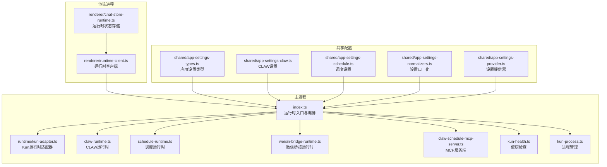
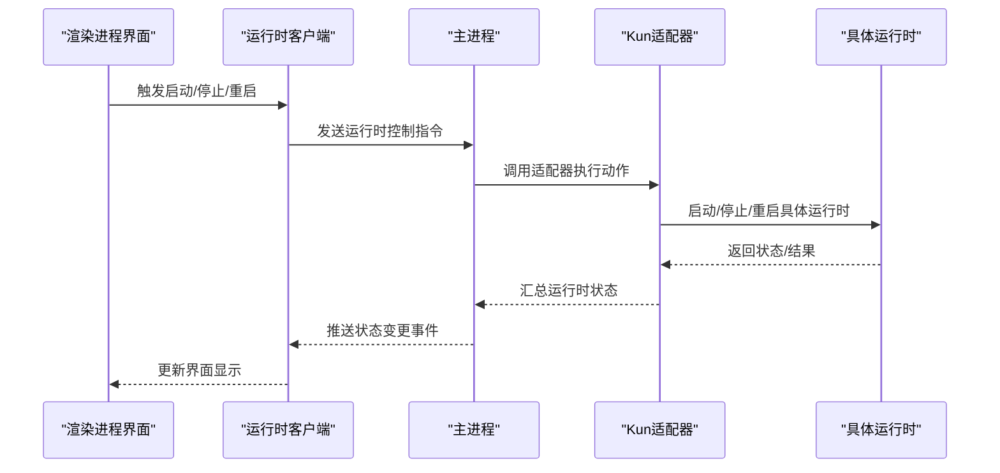
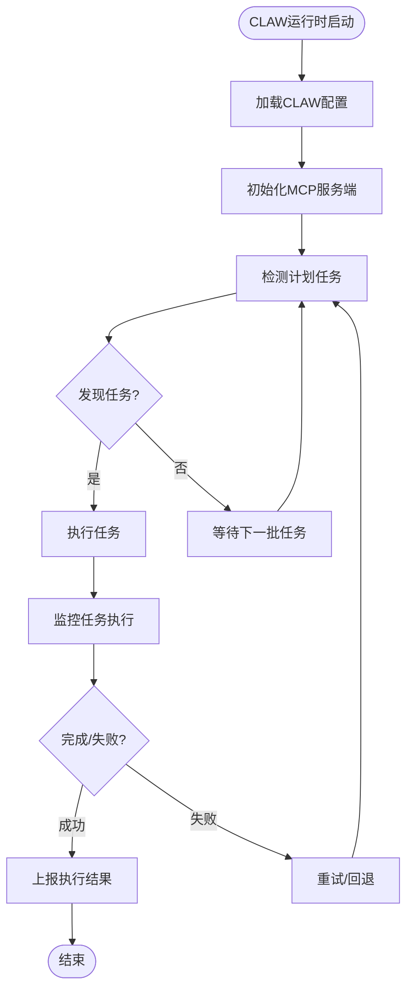
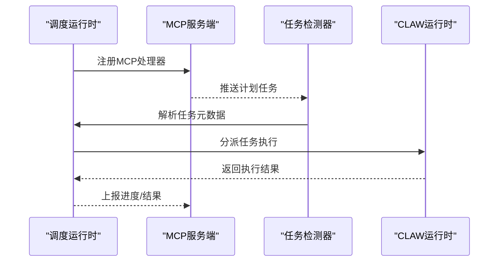
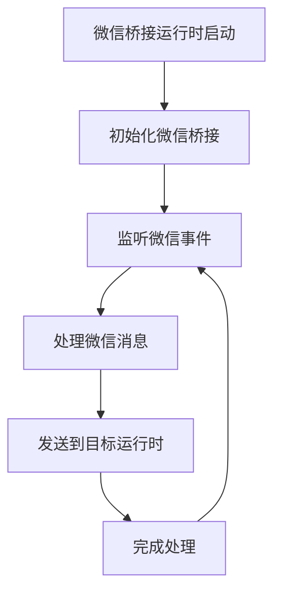
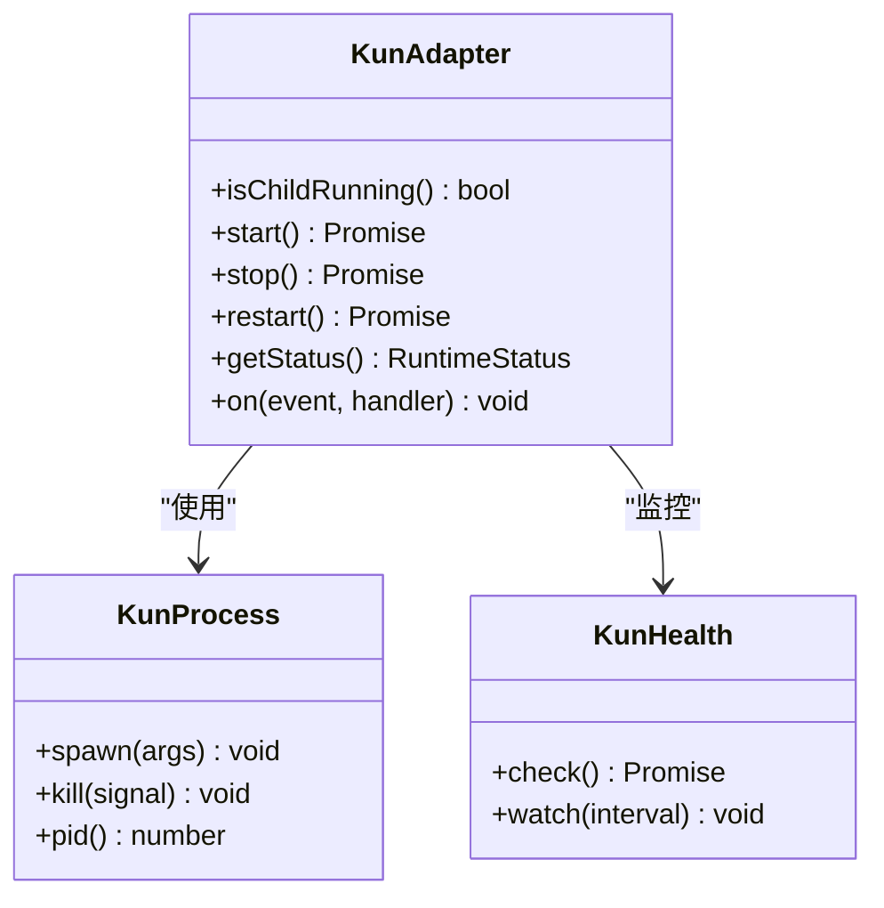
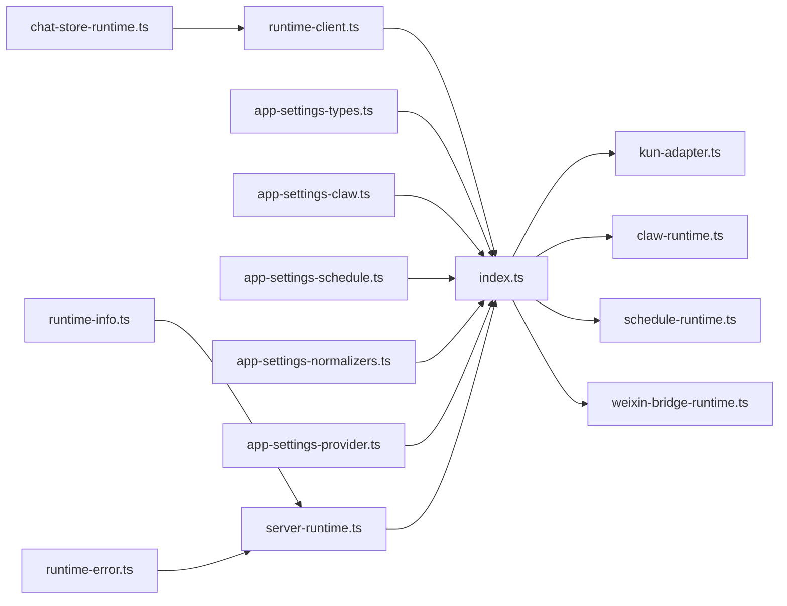

# 运行时管理系统

<cite>
**本文档引用的文件**
- [src/main/claw-runtime.ts](file://src/main/claw-runtime.ts)
- [src/main/schedule-runtime.ts](file://src/main/schedule-runtime.ts)
- [src/main/weixin-bridge-runtime.ts](file://src/main/weixin-bridge-runtime.ts)
- [src/main/runtime/kun-adapter.ts](file://src/main/runtime/kun-adapter.ts)
- [src/main/claw-schedule-mcp-server.ts](file://src/main/claw-schedule-mcp-server.ts)
- [src/main/claw-schedule-mcp-config.ts](file://src/main/claw-schedule-mcp-config.ts)
- [src/main/claw-schedule-mcp-node-entry.ts](file://src/main/claw-schedule-mcp-node-entry.ts)
- [src/main/claw-scheduled-task-detector.ts](file://src/main/claw-scheduled-task-detector.ts)
- [src/main/claw-runtime-helpers.ts](file://src/main/claw-runtime-helpers.ts)
- [src/main/schedule-runtime-helpers.ts](file://src/main/schedule-runtime-helpers.ts)
- [src/main/kun-health.ts](file://src/main/kun-health.ts)
- [src/main/kun-process.ts](file://src/main/kun-process.ts)
- [src/main/index.ts](file://src/main/index.ts)
- [src/renderer/src/agent/runtime-client.ts](file://src/renderer/src/agent/runtime-client.ts)
- [src/renderer/src/store/chat-store-runtime.ts](file://src/renderer/src/store/chat-store-runtime.ts)
- [src/shared/app-settings-types.ts](file://src/shared/app-settings-types.ts)
- [src/shared/app-settings-claw.ts](file://src/shared/app-settings-claw.ts)
- [src/shared/app-settings-schedule.ts](file://src/shared/app-settings-schedule.ts)
- [src/shared/app-settings-normalizers.ts](file://src/shared/app-settings-normalizers.ts)
- [src/shared/app-settings-provider.ts](file://src/shared/app-settings-provider.ts)
- [src/server/runtime-factory.ts](file://src/server/runtime-factory.ts)
- [src/server/routes/server-runtime.ts](file://src/server/routes/server-runtime.ts)
- [src/server/routes/runtime-info.ts](file://src/server/routes/runtime-info.ts)
- [src/server/routes/runtime-error.ts](file://src/server/routes/runtime-error.ts)
- [src/ports/model-client.ts](file://src/ports/model-client.ts)
- [src/contracts/runtime-info.ts](file://src/contracts/runtime-info.ts)
- [src/telemetry/usage-counter.ts](file://src/telemetry/usage-counter.ts)
- [src/telemetry/cache-telemetry.ts](file://src/telemetry/cache-telemetry.ts)
</cite>

## 目录
1. [简介](#简介)
2. [项目结构](#项目结构)
3. [核心组件](#核心组件)
4. [架构总览](#架构总览)
5. [详细组件分析](#详细组件分析)
6. [依赖关系分析](#依赖关系分析)
7. [性能考虑](#性能考虑)
8. [故障排查指南](#故障排查指南)
9. [结论](#结论)

## 简介
本文件系统性阐述 DeepSeek-GUI 中的运行时管理系统，重点覆盖三类运行时：CLAW 运行时、调度运行时（Schedule Runtime）与微信桥接运行时（Weixin Bridge Runtime）。内容包括各运行时的启动、配置、监控与停止流程，运行时状态管理、资源分配策略、故障恢复机制，并提供配置参数清单、监控指标与故障排查方法。为保证可操作性，文档以代码级事实为基础，配合可视化图示帮助读者快速理解。

## 项目结构
运行时管理涉及主进程（Main Process）与渲染进程（Renderer Process）协同工作：
- 主进程负责实际运行时的生命周期管理、进程启动/停止、健康检查与错误上报
- 渲染进程通过运行时客户端与主进程通信，驱动运行时状态展示与用户交互
- 服务器路由层提供运行时信息查询与错误接口，便于前端与外部系统集成

**图表来源**
- [src/main/index.ts:407-445](file://src/main/index.ts#L407-L445)
- [src/main/runtime/kun-adapter.ts](file://src/main/runtime/kun-adapter.ts)
- [src/main/claw-runtime.ts](file://src/main/claw-runtime.ts)
- [src/main/schedule-runtime.ts](file://src/main/schedule-runtime.ts)
- [src/main/weixin-bridge-runtime.ts](file://src/main/weixin-bridge-runtime.ts)
- [src/main/claw-schedule-mcp-server.ts](file://src/main/claw-schedule-mcp-server.ts)
- [src/main/kun-health.ts](file://src/main/kun-health.ts)
- [src/main/kun-process.ts](file://src/main/kun-process.ts)
- [src/renderer/src/agent/runtime-client.ts](file://src/renderer/src/agent/runtime-client.ts)
- [src/renderer/src/store/chat-store-runtime.ts](file://src/renderer/src/store/chat-store-runtime.ts)
- [src/shared/app-settings-types.ts](file://src/shared/app-settings-types.ts)
- [src/shared/app-settings-claw.ts](file://src/shared/app-settings-claw.ts)
- [src/shared/app-settings-schedule.ts](file://src/shared/app-settings-schedule.ts)
- [src/shared/app-settings-normalizers.ts](file://src/shared/app-settings-normalizers.ts)
- [src/shared/app-settings-provider.ts](file://src/shared/app-settings-provider.ts)

**章节来源**
- [src/main/index.ts:407-445](file://src/main/index.ts#L407-L445)
- [src/main/runtime/kun-adapter.ts](file://src/main/runtime/kun-adapter.ts)
- [src/main/claw-runtime.ts](file://src/main/claw-runtime.ts)
- [src/main/schedule-runtime.ts](file://src/main/schedule-runtime.ts)
- [src/main/weixin-bridge-runtime.ts](file://src/main/weixin-bridge-runtime.ts)
- [src/main/claw-schedule-mcp-server.ts](file://src/main/claw-schedule-mcp-server.ts)
- [src/main/kun-health.ts](file://src/main/kun-health.ts)
- [src/main/kun-process.ts](file://src/main/kun-process.ts)
- [src/renderer/src/agent/runtime-client.ts](file://src/renderer/src/agent/runtime-client.ts)
- [src/renderer/src/store/chat-store-runtime.ts](file://src/renderer/src/store/chat-store-runtime.ts)
- [src/shared/app-settings-types.ts](file://src/shared/app-settings-types.ts)
- [src/shared/app-settings-claw.ts](file://src/shared/app-settings-claw.ts)
- [src/shared/app-settings-schedule.ts](file://src/shared/app-settings-schedule.ts)
- [src/shared/app-settings-normalizers.ts](file://src/shared/app-settings-normalizers.ts)
- [src/shared/app-settings-provider.ts](file://src/shared/app-settings-provider.ts)

## 核心组件
- Kun 运行时适配器：封装子进程启动、状态查询、信号控制等通用能力
- CLAW 运行时：负责 CLAW 相关任务的执行与调度
- 调度运行时：基于 MCP 的计划任务执行与监控
- 微信桥接运行时：提供微信生态的桥接能力
- 健康检查模块：周期性探测运行时可用性
- 进程管理模块：统一管理运行时进程生命周期
- 运行时客户端与状态存储：渲染进程侧的状态展示与交互

**章节来源**
- [src/main/runtime/kun-adapter.ts](file://src/main/runtime/kun-adapter.ts)
- [src/main/claw-runtime.ts](file://src/main/claw-runtime.ts)
- [src/main/schedule-runtime.ts](file://src/main/schedule-runtime.ts)
- [src/main/weixin-bridge-runtime.ts](file://src/main/weixin-bridge-runtime.ts)
- [src/main/kun-health.ts](file://src/main/kun-health.ts)
- [src/main/kun-process.ts](file://src/main/kun-process.ts)
- [src/renderer/src/agent/runtime-client.ts](file://src/renderer/src/agent/runtime-client.ts)
- [src/renderer/src/store/chat-store-runtime.ts](file://src/renderer/src/store/chat-store-runtime.ts)

## 架构总览
运行时管理采用“主进程统一编排 + 渲染进程状态展示”的分层架构。主进程通过适配器与具体运行时实现解耦；渲染进程通过客户端与主进程通信，获取运行时状态并触发操作。

**图表来源**
- [src/main/index.ts:407-445](file://src/main/index.ts#L407-L445)
- [src/main/runtime/kun-adapter.ts](file://src/main/runtime/kun-adapter.ts)
- [src/renderer/src/agent/runtime-client.ts](file://src/renderer/src/agent/runtime-client.ts)

## 详细组件分析

### CLAW 运行时
CLAW 运行时负责 CLAW 相关任务的执行与调度，支持与 MCP（Model Context Protocol）服务的集成，具备任务检测与自动重启能力。

**图表来源**
- [src/main/claw-runtime.ts](file://src/main/claw-runtime.ts)
- [src/main/claw-schedule-mcp-server.ts](file://src/main/claw-schedule-mcp-server.ts)
- [src/main/claw-scheduled-task-detector.ts](file://src/main/claw-scheduled-task-detector.ts)

**章节来源**
- [src/main/claw-runtime.ts](file://src/main/claw-runtime.ts)
- [src/main/claw-schedule-mcp-server.ts](file://src/main/claw-schedule-mcp-server.ts)
- [src/main/claw-schedule-mcp-config.ts](file://src/main/claw-schedule-mcp-config.ts)
- [src/main/claw-schedule-mcp-node-entry.ts](file://src/main/claw-schedule-mcp-node-entry.ts)
- [src/main/claw-scheduled-task-detector.ts](file://src/main/claw-scheduled-task-detector.ts)
- [src/main/claw-runtime-helpers.ts](file://src/main/claw-runtime-helpers.ts)

### 调度运行时
调度运行时基于 MCP 协议，负责计划任务的接收、解析与执行，支持与 CLAW 的协作模式。

**图表来源**
- [src/main/schedule-runtime.ts](file://src/main/schedule-runtime.ts)
- [src/main/claw-schedule-mcp-server.ts](file://src/main/claw-schedule-mcp-server.ts)
- [src/main/claw-scheduled-task-detector.ts](file://src/main/claw-scheduled-task-detector.ts)

**章节来源**
- [src/main/schedule-runtime.ts](file://src/main/schedule-runtime.ts)
- [src/main/schedule-runtime-helpers.ts](file://src/main/schedule-runtime-helpers.ts)

### 微信桥接运行时
微信桥接运行时提供与微信生态的桥接能力，支持消息转发、状态同步与错误处理。

**图表来源**
- [src/main/weixin-bridge-runtime.ts](file://src/main/weixin-bridge-runtime.ts)

**章节来源**
- [src/main/weixin-bridge-runtime.ts](file://src/main/weixin-bridge-runtime.ts)

### Kun 运行时适配器
Kun 适配器封装了运行时的通用生命周期管理，包括启动、停止、状态查询与错误处理。

**图表来源**
- [src/main/runtime/kun-adapter.ts](file://src/main/runtime/kun-adapter.ts)
- [src/main/kun-process.ts](file://src/main/kun-process.ts)
- [src/main/kun-health.ts](file://src/main/kun-health.ts)

**章节来源**
- [src/main/runtime/kun-adapter.ts](file://src/main/runtime/kun-adapter.ts)
- [src/main/kun-process.ts](file://src/main/kun-process.ts)
- [src/main/kun-health.ts](file://src/main/kun-health.ts)

## 依赖关系分析
运行时管理的关键依赖链路如下：
- 主入口依赖适配器与各运行时模块
- 渲染进程通过运行时客户端与主进程通信
- 设置模块提供运行时配置的来源与归一化
- 服务器路由层提供运行时信息与错误接口

**图表来源**
- [src/main/index.ts:407-445](file://src/main/index.ts#L407-L445)
- [src/main/runtime/kun-adapter.ts](file://src/main/runtime/kun-adapter.ts)
- [src/main/claw-runtime.ts](file://src/main/claw-runtime.ts)
- [src/main/schedule-runtime.ts](file://src/main/schedule-runtime.ts)
- [src/main/weixin-bridge-runtime.ts](file://src/main/weixin-bridge-runtime.ts)
- [src/renderer/src/agent/runtime-client.ts](file://src/renderer/src/agent/runtime-client.ts)
- [src/renderer/src/store/chat-store-runtime.ts](file://src/renderer/src/store/chat-store-runtime.ts)
- [src/shared/app-settings-types.ts](file://src/shared/app-settings-types.ts)
- [src/shared/app-settings-claw.ts](file://src/shared/app-settings-claw.ts)
- [src/shared/app-settings-schedule.ts](file://src/shared/app-settings-schedule.ts)
- [src/shared/app-settings-normalizers.ts](file://src/shared/app-settings-normalizers.ts)
- [src/shared/app-settings-provider.ts](file://src/shared/app-settings-provider.ts)
- [src/server/routes/server-runtime.ts](file://src/server/routes/server-runtime.ts)
- [src/server/routes/runtime-info.ts](file://src/server/routes/runtime-info.ts)
- [src/server/routes/runtime-error.ts](file://src/server/routes/runtime-error.ts)

**章节来源**
- [src/main/index.ts:407-445](file://src/main/index.ts#L407-L445)
- [src/renderer/src/agent/runtime-client.ts](file://src/renderer/src/agent/runtime-client.ts)
- [src/renderer/src/store/chat-store-runtime.ts](file://src/renderer/src/store/chat-store-runtime.ts)
- [src/shared/app-settings-types.ts](file://src/shared/app-settings-types.ts)
- [src/shared/app-settings-claw.ts](file://src/shared/app-settings-claw.ts)
- [src/shared/app-settings-schedule.ts](file://src/shared/app-settings-schedule.ts)
- [src/shared/app-settings-normalizers.ts](file://src/shared/app-settings-normalizers.ts)
- [src/shared/app-settings-provider.ts](file://src/shared/app-settings-provider.ts)
- [src/server/routes/server-runtime.ts](file://src/server/routes/server-runtime.ts)
- [src/server/routes/runtime-info.ts](file://src/server/routes/runtime-info.ts)
- [src/server/routes/runtime-error.ts](file://src/server/routes/runtime-error.ts)

## 性能考虑
- 启动去抖与指纹校验：通过稳定指纹避免重复启动，降低资源浪费
- 异步队列与串行化：设置变更采用串行队列，确保状态一致性
- 健康检查与超时：健康检查带超时与重试，避免阻塞主线程
- 进程池与资源隔离：不同运行时独立进程，减少相互影响
- 监控指标：结合使用计数器与缓存遥测，评估运行时负载与命中率

[本节为通用指导，无需列出具体文件来源]

## 故障排查指南
- 健康检查失败
  - 现象：运行时不可用或响应缓慢
  - 排查：确认健康检查端点可达，查看日志与错误接口
  - 参考路径：[src/main/kun-health.ts](file://src/main/kun-health.ts)
- 启动/停止异常
  - 现象：运行时无法启动或停止后残留进程
  - 排查：检查进程 PID、信号发送与退出码；必要时强制终止
  - 参考路径：[src/main/kun-process.ts](file://src/main/kun-process.ts)
- 配置变更未生效
  - 现象：修改设置后运行时未重启
  - 排查：确认指纹计算与启动配置变更判断逻辑
  - 参考路径：[src/main/index.ts:407-445](file://src/main/index.ts#L407-L445)
- 渲染进程状态不同步
  - 现象：界面显示与实际状态不一致
  - 排查：检查运行时客户端事件推送与状态存储更新
  - 参考路径：[src/renderer/src/agent/runtime-client.ts](file://src/renderer/src/agent/runtime-client.ts), [src/renderer/src/store/chat-store-runtime.ts](file://src/renderer/src/store/chat-store-runtime.ts)
- 错误上报与诊断
  - 使用服务器错误接口获取详细错误信息
  - 参考路径：[src/server/routes/runtime-error.ts](file://src/server/routes/runtime-error.ts)

**章节来源**
- [src/main/kun-health.ts](file://src/main/kun-health.ts)
- [src/main/kun-process.ts](file://src/main/kun-process.ts)
- [src/main/index.ts:407-445](file://src/main/index.ts#L407-L445)
- [src/renderer/src/agent/runtime-client.ts](file://src/renderer/src/agent/runtime-client.ts)
- [src/renderer/src/store/chat-store-runtime.ts](file://src/renderer/src/store/chat-store-runtime.ts)
- [src/server/routes/runtime-error.ts](file://src/server/routes/runtime-error.ts)

## 结论
运行时管理系统通过适配器模式实现了对多种运行时的统一管理，结合健康检查、进程管理和配置归一化，提供了高可靠、可观测的运行时生命周期控制。建议在生产环境中启用健康检查与错误上报，并定期审查配置指纹与启动条件，以确保运行时的稳定性与一致性。