# Kun 运行时核心

<cite>
**本文引用的文件**
- [agent-loop.ts](file://kun/src/loop/agent-loop.ts)
- [auto-model-router.ts](file://kun/src/loop/auto-model-router.ts)
- [token-economy.ts](file://kun/src/loop/token-economy.ts)
- [context-estimator.ts](file://kun/src/loop/context-estimator.ts)
- [model-request-estimator.ts](file://kun/src/loop/model-request-estimator.ts)
- [history-healing.ts](file://kun/src/loop/history-healing.ts)
- [request-history-hygiene.ts](file://kun/src/loop/request-history-hygiene.ts)
- [context-compactor.ts](file://kun/src/loop/context-compactor.ts)
- [tool-call-repair.ts](file://kun/src/loop/tool-call-repair.ts)
- [tool-storm-breaker.ts](file://kun/src/loop/tool-storm-breaker.ts)
- [append-only-session-log.ts](file://kun/src/loop/append-only-session-log.ts)
- [compaction-marker.ts](file://kun/src/loop/compaction-marker.ts)
- [inflight-tracker.ts](file://kun/src/loop/inflight-tracker.ts)
- [model-context-profile.ts](file://kun/src/loop/model-context-profile.ts)
- [steering-queue.ts](file://kun/src/loop/steering-queue.ts)
- [runtime-event-reducer.ts](file://kun/src/domain/runtime-event-reducer.ts)
- [session.ts](file://kun/src/domain/session.ts)
- [thread.ts](file://kun/src/domain/thread.ts)
- [turn.ts](file://kun/src/domain/turn.ts)
- [item.ts](file://kun/src/domain/item.ts)
- [approval.ts](file://kun/src/domain/approval.ts)
- [usage.ts](file://kun/src/domain/usage.ts)
- [event.ts](file://kun/src/domain/event.ts)
- [in-memory-event-bus.ts](file://kun/src/adapters/in-memory-event-bus.ts)
- [in-memory-session-store.ts](file://kun/src/adapters/in-memory-session-store.ts)
- [in-memory-thread-store.ts](file://kun/src/adapters/in-memory-thread-store.ts)
- [in-memory-approval-gate.ts](file://kun/src/adapters/in-memory-approval-gate.ts)
- [in-memory-user-input-gate.ts](file://kun/src/adapters/in-memory-user-input-gate.ts)
- [model-client.ts](file://kun/src/ports/model-client.ts)
- [session-store.ts](file://kun/src/ports/session-store.ts)
- [thread-store.ts](file://kun/src/ports/thread-store.ts)
- [tool-host.ts](file://kun/src/ports/tool-host.ts)
- [event-bus.ts](file://kun/src/ports/event-bus.ts)
- [approval-gate.ts](file://kun/src/ports/approval-gate.ts)
- [user-input-gate.ts](file://kun/src/ports/user-input-gate.ts)
- [runtime-factory.ts](file://kun/src/server/runtime-factory.ts)
- [http-server.ts](file://kun/src/server/http-server.ts)
- [router.ts](file://kun/src/server/router.ts)
- [routes/sessions.ts](file://kun/src/server/routes/sessions.ts)
- [routes/threads.ts](file://kun/src/server/routes/threads.ts)
- [routes/turns.ts](file://kun/src/server/routes/turns.ts)
- [routes/events.ts](file://kun/src/server/routes/events.ts)
- [routes/usage.ts](file://kun/src/server/routes/usage.ts)
- [routes/approvals.ts](file://kun/src/server/routes/approvals.ts)
- [routes/user-inputs.ts](file://kun/src/server/routes/user-inputs.ts)
- [routes/memory.ts](file://kun/src/server/routes/memory.ts)
- [routes/review.ts](file://kun/src/server/routes/review.ts)
- [routes/workspace.ts](file://kun/src/server/routes/workspace.ts)
- [routes/server-runtime.ts](file://kun/src/server/routes/server-runtime.ts)
- [routes/health.ts](file://kun/src/server/routes/health.ts)
- [routes/runtime-error.ts](file://kun/src/server/routes/runtime-error.ts)
- [routes/runtime-info.ts](file://kun/src/server/routes/runtime-info.ts)
- [review-service.ts](file://kun/src/services/review-service.ts)
- [thread-service.ts](file://kun/src/services/thread-service.ts)
- [turn-service.ts](file://kun/src/services/turn-service.ts)
- [usage-service.ts](file://kun/src/services/usage-service.ts)
- [runtime-event-recorder.ts](file://kun/src/services/runtime-event-recorder.ts)
- [cache-telemetry.ts](file://kun/src/telemetry/cache-telemetry.ts)
- [usage-counter.ts](file://kun/src/telemetry/usage-counter.ts)
- [kun-system-prompt.ts](file://kun/src/prompt/kun-system-prompt.ts)
- [builtin-tools.ts](file://kun/src/adapters/tool/builtin-tools.ts)
- [builtin-tool-operations.ts](file://kun/src/adapters/tool/builtin-tool-operations.ts)
- [builtin-tool-types.ts](file://kun/src/adapters/tool/builtin-tool-types.ts)
- [builtin-tool-utils.ts](file://kun/src/adapters/tool/builtin-tool-utils.ts)
- [capability-registry.ts](file://kun/src/adapters/tool/capability-registry.ts)
- [mcp-tool-provider.ts](file://kun/src/adapters/tool/mcp-tool-provider.ts)
- [web-tool-provider.ts](file://kun/src/adapters/tool/web-tool-provider.ts)
- [memory-store.ts](file://kun/src/memory/memory-store.ts)
- [local-workspace-inspector.ts](file://kun/src/adapters/workspace/local-workspace-inspector.ts)
- [delegation-runtime.ts](file://kun/src/delegation/delegation-runtime.ts)
- [child-agent-executor.ts](file://kun/src/delegation/child-agent-executor.ts)
- [kun-config.ts](file://kun/src/config/kun-config.ts)
- [secret-redaction.ts](file://kun/src/config/secret-redaction.ts)
- [kun-config.test.ts](file://kun/src/tests/kun-config.test.ts)
- [auto-model-router.test.ts](file://kun/src/tests/auto-model-router.test.ts)
- [token-economy.test.ts](file://kun/src/tests/token-economy.test.ts)
- [loop.test.ts](file://kun/src/tests/loop.test.ts)
- [domain.test.ts](file://kun/src/tests/domain.test.ts)
- [builtin-tools.test.ts](file://kun/src/tests/builtin-tools.test.ts)
- [delegation-runtime.test.ts](file://kun/src/tests/delegation-runtime.test.ts)
- [thread-service.test.ts](file://kun/src/tests/thread-service.test.ts)
- [usage-service.test.ts](file://kun/src/tests/usage-service.test.ts)
- [runtime-event-reducer.test.ts](file://kun/src/tests/runtime-event-reducer.test.ts)
- [runtime-factory.test.ts](file://kun/src/tests/runtime-factory.test.ts)
</cite>

## 目录
1. [简介](#简介)
2. [项目结构](#项目结构)
3. [核心组件](#核心组件)
4. [架构总览](#架构总览)
5. [详细组件分析](#详细组件分析)
6. [依赖分析](#依赖分析)
7. [性能考虑](#性能考虑)
8. [故障排查指南](#故障排查指南)
9. [结论](#结论)
10. [附录](#附录)

## 简介
本文件面向 Kun 运行时核心，聚焦以下主题：智能体循环系统（Agent Loop）的实现与控制流、领域模型（Domain Model）的定义与职责、服务层架构（Service Layer）的组织方式、自动模型路由（Auto Model Router）、Token 经济模型（Token Economy）、事件驱动架构（Event-Driven Architecture）以及性能优化、错误处理与监控指标设计。文档以循序渐进的方式呈现，既适合技术读者深入理解实现细节，也便于非技术读者把握整体架构。

## 项目结构
Kun 运行时核心位于 kunsdd 仓库的 kun 子目录中，采用“按功能域分层”的组织方式：
- loop：智能体循环与上下文管理、模型路由与计费、工具调用修复与限流等
- domain：会话、线程、回合、条目、审批、用量、事件等核心领域对象
- ports：对外接口契约（适配器模式中的 Port）
- adapters：具体实现（内存实现、文件实现、混合实现、工具提供者等）
- services：业务服务（线程、回合、用量、评审等）
- server：HTTP 服务器与路由
- telemetry：遥测与计数器
- config：配置与敏感信息脱敏
- tests：单元测试与集成测试

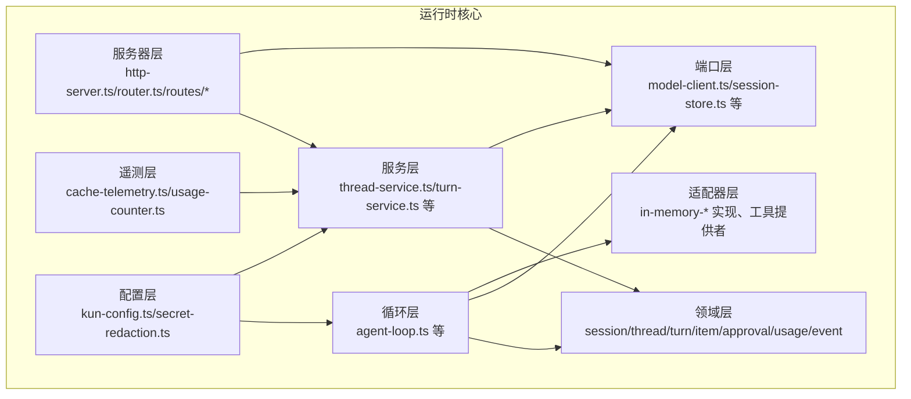

图表来源
- [agent-loop.ts:1-200](file://kun/src/loop/agent-loop.ts#L1-L200)
- [session.ts:1-120](file://kun/src/domain/session.ts#L1-L120)
- [thread.ts:1-120](file://kun/src/domain/thread.ts#L1-L120)
- [turn.ts:1-120](file://kun/src/domain/turn.ts#L1-L120)
- [model-client.ts:1-120](file://kun/src/ports/model-client.ts#L1-L120)
- [http-server.ts:1-120](file://kun/src/server/http-server.ts#L1-L120)
- [router.ts:1-120](file://kun/src/server/router.ts#L1-L120)

章节来源
- [agent-loop.ts:1-200](file://kun/src/loop/agent-loop.ts#L1-L200)
- [session.ts:1-120](file://kun/src/domain/session.ts#L1-L120)
- [thread.ts:1-120](file://kun/src/domain/thread.ts#L1-L120)
- [turn.ts:1-120](file://kun/src/domain/turn.ts#L1-L120)
- [model-client.ts:1-120](file://kun/src/ports/model-client.ts#L1-L120)
- [http-server.ts:1-120](file://kun/src/server/http-server.ts#L1-L120)
- [router.ts:1-120](file://kun/src/server/router.ts#L1-L120)

## 核心组件
本节概述运行时核心的关键模块及其职责：
- 智能体循环（Agent Loop）：负责回合推进、上下文压缩、历史修复、工具调用修复、风暴抑制、请求计费与估算、自动模型路由等
- 领域模型（Domain）：封装会话、线程、回合、条目、审批、用量、事件等核心概念，提供稳定的业务语义
- 服务层（Services）：封装业务流程，如线程管理、回合处理、用量统计、评审生成等
- 事件驱动（Event Bus）：通过内存事件总线实现松耦合通信
- 适配器层（Adapters）：提供内存、文件、混合存储与工具提供者等实现
- 服务器层（Server）：HTTP 路由与控制器，暴露运行时能力

章节来源
- [agent-loop.ts:1-200](file://kun/src/loop/agent-loop.ts#L1-L200)
- [runtime-event-reducer.ts:1-120](file://kun/src/domain/runtime-event-reducer.ts#L1-L120)
- [in-memory-event-bus.ts:1-120](file://kun/src/adapters/in-memory-event-bus.ts#L1-L120)
- [thread-service.ts:1-120](file://kun/src/services/thread-service.ts#L1-L120)
- [turn-service.ts:1-120](file://kun/src/services/turn-service.ts#L1-L120)
- [usage-service.ts:1-120](file://kun/src/services/usage-service.ts#L1-L120)

## 架构总览
下图展示了从客户端到服务层再到循环层与适配器层的整体交互：

```mermaid
sequenceDiagram
participant C as "客户端"
participant R as "HTTP 路由"
participant SRV as "运行时服务"
participant LOOP as "Agent 循环"
participant PORT as "端口(Ports)"
participant ADP as "适配器(Adapters)"
C->>R : "发起请求"
R->>SRV : "路由到对应服务"
SRV->>LOOP : "触发回合推进/状态查询"
LOOP->>PORT : "调用模型/工具/存储"
PORT->>ADP : "执行具体实现"
ADP-->>PORT : "返回结果"
PORT-->>LOOP : "回传数据"
LOOP-->>SRV : "更新领域状态"
SRV-->>R : "构造响应"
R-->>C : "返回结果"
```

图表来源
- [http-server.ts:1-120](file://kun/src/server/http-server.ts#L1-L120)
- [router.ts:1-120](file://kun/src/server/router.ts#L1-L120)
- [agent-loop.ts:1-200](file://kun/src/loop/agent-loop.ts#L1-L200)
- [model-client.ts:1-120](file://kun/src/ports/model-client.ts#L1-L120)
- [session-store.ts:1-120](file://kun/src/ports/session-store.ts#L1-L120)
- [thread-store.ts:1-120](file://kun/src/ports/thread-store.ts#L1-L120)
- [tool-host.ts:1-120](file://kun/src/ports/tool-host.ts#L1-L120)

## 详细组件分析

### 智能体循环系统（Agent Loop）
Agent Loop 是运行时的核心控制流，负责：
- 回合推进与状态机转换
- 上下文估计与压缩
- 历史修复与请求卫生
- 工具调用修复与风暴抑制
- 请求计费与估算
- 自动模型路由

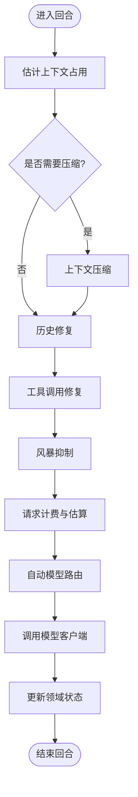

图表来源
- [agent-loop.ts:1-200](file://kun/src/loop/agent-loop.ts#L1-L200)
- [context-estimator.ts:1-120](file://kun/src/loop/context-estimator.ts#L1-L120)
- [context-compactor.ts:1-120](file://kun/src/loop/context-compactor.ts#L1-L120)
- [history-healing.ts:1-120](file://kun/src/loop/history-healing.ts#L1-L120)
- [tool-call-repair.ts:1-120](file://kun/src/loop/tool-call-repair.ts#L1-L120)
- [tool-storm-breaker.ts:1-120](file://kun/src/loop/tool-storm-breaker.ts#L1-L120)
- [model-request-estimator.ts:1-120](file://kun/src/loop/model-request-estimator.ts#L1-L120)
- [auto-model-router.ts:1-120](file://kun/src/loop/auto-model-router.ts#L1-L120)

章节来源
- [agent-loop.ts:1-200](file://kun/src/loop/agent-loop.ts#L1-L200)
- [context-estimator.ts:1-120](file://kun/src/loop/context-estimator.ts#L1-L120)
- [context-compactor.ts:1-120](file://kun/src/loop/context-compactor.ts#L1-L120)
- [history-healing.ts:1-120](file://kun/src/loop/history-healing.ts#L1-L120)
- [tool-call-repair.ts:1-120](file://kun/src/loop/tool-call-repair.ts#L1-L120)
- [tool-storm-breaker.ts:1-120](file://kun/src/loop/tool-storm-breaker.ts#L1-L120)
- [model-request-estimator.ts:1-120](file://kun/src/loop/model-request-estimator.ts#L1-L120)
- [auto-model-router.ts:1-120](file://kun/src/loop/auto-model-router.ts#L1-L120)

### 自动模型路由（Auto Model Router）
自动模型路由根据上下文占用、可用模型能力与历史表现，动态选择最优模型，确保在预算与性能之间取得平衡。

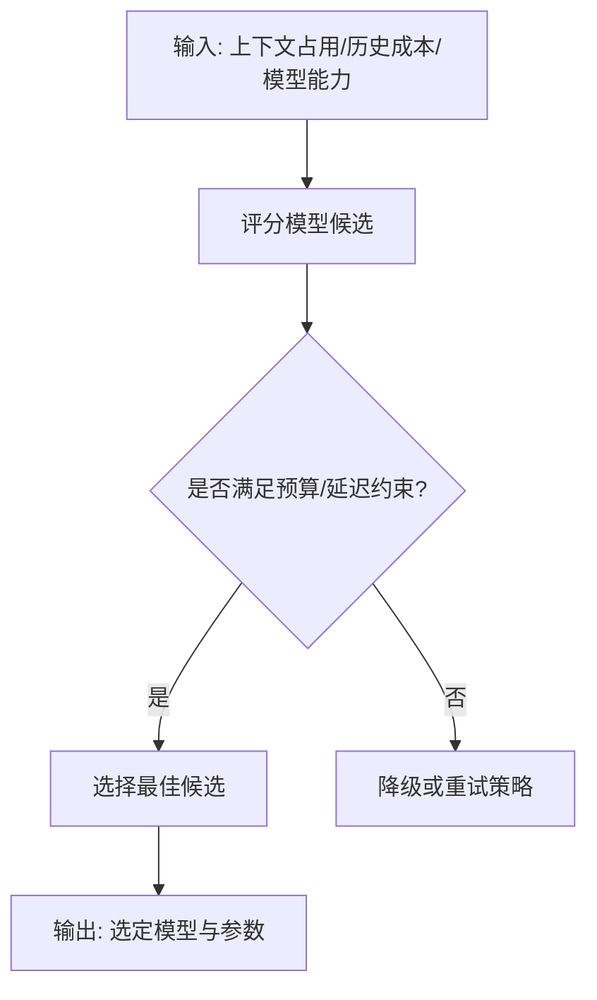

图表来源
- [auto-model-router.ts:1-120](file://kun/src/loop/auto-model-router.ts#L1-L120)
- [model-context-profile.ts:1-120](file://kun/src/loop/model-context-profile.ts#L1-L120)
- [token-economy.ts:1-120](file://kun/src/loop/token-economy.ts#L1-L120)

章节来源
- [auto-model-router.ts:1-120](file://kun/src/loop/auto-model-router.ts#L1-L120)
- [model-context-profile.ts:1-120](file://kun/src/loop/model-context-profile.ts#L1-L120)
- [token-economy.ts:1-120](file://kun/src/loop/token-economy.ts#L1-L120)

### Token 经济模型（Token Economy）
Token 经济模型用于跟踪与控制模型调用的成本，包括输入/输出 Token 计数、累计用量、限额与告警。

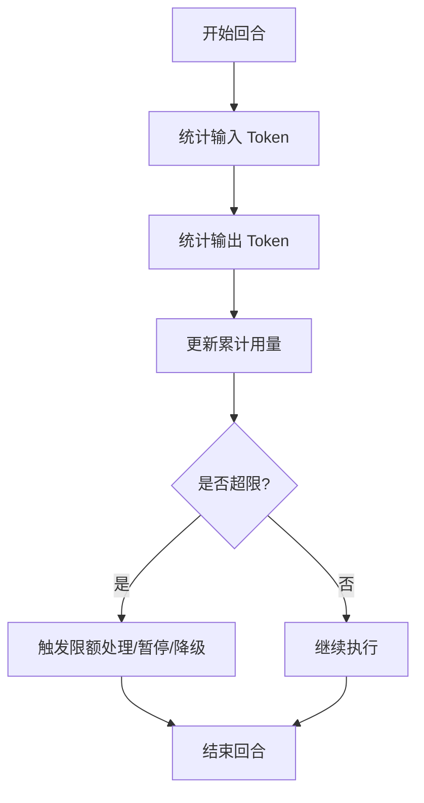

图表来源
- [token-economy.ts:1-120](file://kun/src/loop/token-economy.ts#L1-L120)
- [usage-service.ts:1-120](file://kun/src/services/usage-service.ts#L1-L120)
- [usage.ts:1-120](file://kun/src/domain/usage.ts#L1-L120)

章节来源
- [token-economy.ts:1-120](file://kun/src/loop/token-economy.ts#L1-L120)
- [usage-service.ts:1-120](file://kun/src/services/usage-service.ts#L1-L120)
- [usage.ts:1-120](file://kun/src/domain/usage.ts#L1-L120)

### 领域模型（Domain）
领域模型定义了运行时的核心业务实体与关系，包括会话、线程、回合、条目、审批、用量与事件。

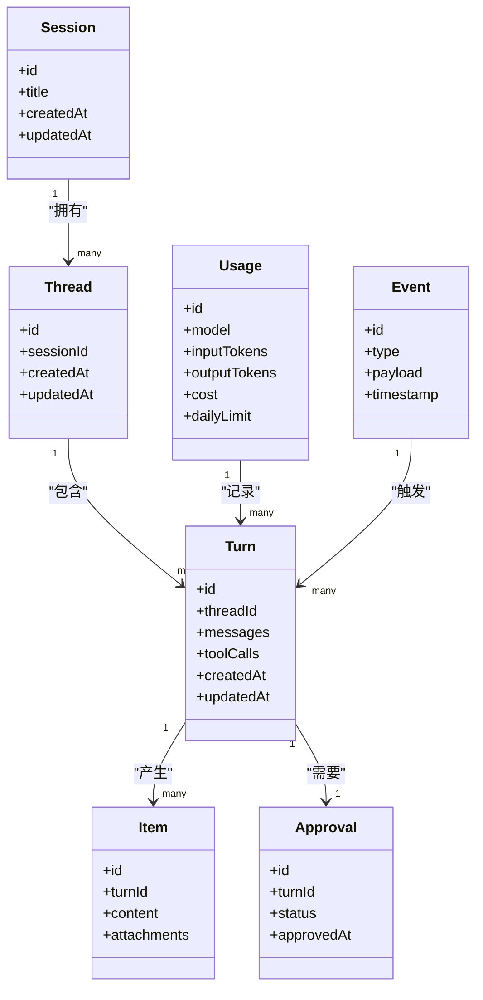

图表来源
- [session.ts:1-120](file://kun/src/domain/session.ts#L1-L120)
- [thread.ts:1-120](file://kun/src/domain/thread.ts#L1-L120)
- [turn.ts:1-120](file://kun/src/domain/turn.ts#L1-L120)
- [item.ts:1-120](file://kun/src/domain/item.ts#L1-L120)
- [approval.ts:1-120](file://kun/src/domain/approval.ts#L1-L120)
- [usage.ts:1-120](file://kun/src/domain/usage.ts#L1-L120)
- [event.ts:1-120](file://kun/src/domain/event.ts#L1-L120)

章节来源
- [session.ts:1-120](file://kun/src/domain/session.ts#L1-L120)
- [thread.ts:1-120](file://kun/src/domain/thread.ts#L1-L120)
- [turn.ts:1-120](file://kun/src/domain/turn.ts#L1-L120)
- [item.ts:1-120](file://kun/src/domain/item.ts#L1-L120)
- [approval.ts:1-120](file://kun/src/domain/approval.ts#L1-L120)
- [usage.ts:1-120](file://kun/src/domain/usage.ts#L1-L120)
- [event.ts:1-120](file://kun/src/domain/event.ts#L1-L120)

### 服务层架构（Service Layer）
服务层封装业务流程，协调领域模型与外部端口，提供稳定的服务接口。

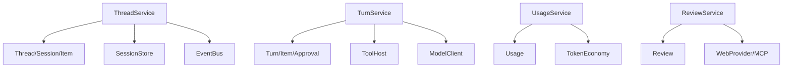

图表来源
- [thread-service.ts:1-120](file://kun/src/services/thread-service.ts#L1-L120)
- [turn-service.ts:1-120](file://kun/src/services/turn-service.ts#L1-L120)
- [usage-service.ts:1-120](file://kun/src/services/usage-service.ts#L1-L120)
- [review-service.ts:1-120](file://kun/src/services/review-service.ts#L1-L120)
- [session-store.ts:1-120](file://kun/src/ports/session-store.ts#L1-L120)
- [thread-store.ts:1-120](file://kun/src/ports/thread-store.ts#L1-L120)
- [event-bus.ts:1-120](file://kun/src/ports/event-bus.ts#L1-L120)
- [tool-host.ts:1-120](file://kun/src/ports/tool-host.ts#L1-L120)
- [model-client.ts:1-120](file://kun/src/ports/model-client.ts#L1-L120)

章节来源
- [thread-service.ts:1-120](file://kun/src/services/thread-service.ts#L1-L120)
- [turn-service.ts:1-120](file://kun/src/services/turn-service.ts#L1-L120)
- [usage-service.ts:1-120](file://kun/src/services/usage-service.ts#L1-L120)
- [review-service.ts:1-120](file://kun/src/services/review-service.ts#L1-L120)

### 事件驱动架构（Event-Driven Architecture）
运行时通过内存事件总线实现松耦合通信，事件由循环或服务层发布，订阅者异步处理。

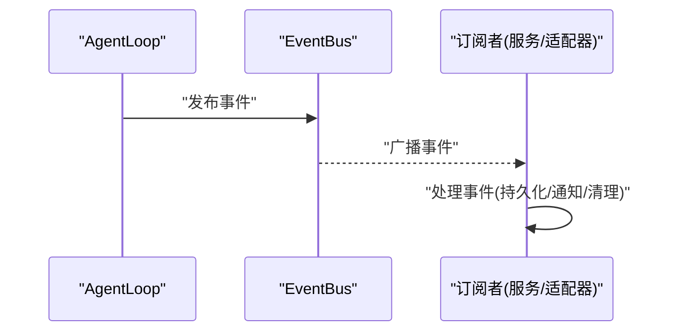

图表来源
- [in-memory-event-bus.ts:1-120](file://kun/src/adapters/in-memory-event-bus.ts#L1-L120)
- [runtime-event-reducer.ts:1-120](file://kun/src/domain/runtime-event-reducer.ts#L1-L120)

章节来源
- [in-memory-event-bus.ts:1-120](file://kun/src/adapters/in-memory-event-bus.ts#L1-L120)
- [runtime-event-reducer.ts:1-120](file://kun/src/domain/runtime-event-reducer.ts#L1-L120)

### 适配器与端口（Adapters & Ports）
- 端口（Ports）：定义对外契约，如模型客户端、会话/线程存储、工具宿主、事件总线、审批门、用户输入门等
- 适配器（Adapters）：提供内存、文件、混合等实现；工具提供者支持内置工具、MCP、Web 等

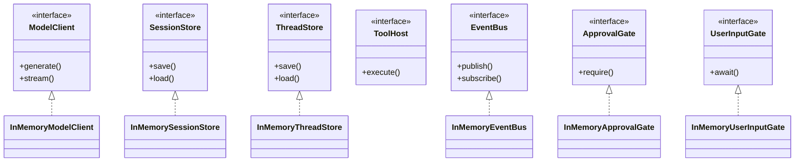

图表来源
- [model-client.ts:1-120](file://kun/src/ports/model-client.ts#L1-L120)
- [session-store.ts:1-120](file://kun/src/ports/session-store.ts#L1-L120)
- [thread-store.ts:1-120](file://kun/src/ports/thread-store.ts#L1-L120)
- [tool-host.ts:1-120](file://kun/src/ports/tool-host.ts#L1-L120)
- [event-bus.ts:1-120](file://kun/src/ports/event-bus.ts#L1-L120)
- [approval-gate.ts:1-120](file://kun/src/ports/approval-gate.ts#L1-L120)
- [user-input-gate.ts:1-120](file://kun/src/ports/user-input-gate.ts#L1-L120)
- [in-memory-session-store.ts:1-120](file://kun/src/adapters/in-memory-session-store.ts#L1-L120)
- [in-memory-thread-store.ts:1-120](file://kun/src/adapters/in-memory-thread-store.ts#L1-L120)
- [in-memory-event-bus.ts:1-120](file://kun/src/adapters/in-memory-event-bus.ts#L1-L120)
- [in-memory-approval-gate.ts:1-120](file://kun/src/adapters/in-memory-approval-gate.ts#L1-L120)
- [in-memory-user-input-gate.ts:1-120](file://kun/src/adapters/in-memory-user-input-gate.ts#L1-L120)

章节来源
- [model-client.ts:1-120](file://kun/src/ports/model-client.ts#L1-L120)
- [session-store.ts:1-120](file://kun/src/ports/session-store.ts#L1-L120)
- [thread-store.ts:1-120](file://kun/src/ports/thread-store.ts#L1-L120)
- [tool-host.ts:1-120](file://kun/src/ports/tool-host.ts#L1-L120)
- [event-bus.ts:1-120](file://kun/src/ports/event-bus.ts#L1-L120)
- [approval-gate.ts:1-120](file://kun/src/ports/approval-gate.ts#L1-L120)
- [user-input-gate.ts:1-120](file://kun/src/ports/user-input-gate.ts#L1-L120)
- [in-memory-session-store.ts:1-120](file://kun/src/adapters/in-memory-session-store.ts#L1-L120)
- [in-memory-thread-store.ts:1-120](file://kun/src/adapters/in-memory-thread-store.ts#L1-L120)
- [in-memory-event-bus.ts:1-120](file://kun/src/adapters/in-memory-event-bus.ts#L1-L120)
- [in-memory-approval-gate.ts:1-120](file://kun/src/adapters/in-memory-approval-gate.ts#L1-L120)
- [in-memory-user-input-gate.ts:1-120](file://kun/src/adapters/in-memory-user-input-gate.ts#L1-L120)

### 服务器层与路由（HTTP Server & Router）
服务器层提供 REST 接口，路由到相应服务，处理会话、线程、回合、事件、用量、审批、用户输入、内存、评审、工作区、运行时健康与信息等资源。

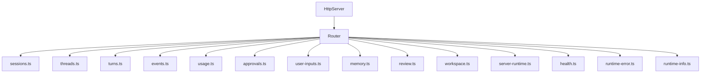

图表来源
- [http-server.ts:1-120](file://kun/src/server/http-server.ts#L1-L120)
- [router.ts:1-120](file://kun/src/server/router.ts#L1-L120)
- [routes/sessions.ts:1-120](file://kun/src/server/routes/sessions.ts#L1-L120)
- [routes/threads.ts:1-120](file://kun/src/server/routes/threads.ts#L1-L120)
- [routes/turns.ts:1-120](file://kun/src/server/routes/turns.ts#L1-L120)
- [routes/events.ts:1-120](file://kun/src/server/routes/events.ts#L1-L120)
- [routes/usage.ts:1-120](file://kun/src/server/routes/usage.ts#L1-L120)
- [routes/approvals.ts:1-120](file://kun/src/server/routes/approvals.ts#L1-L120)
- [routes/user-inputs.ts:1-120](file://kun/src/server/routes/user-inputs.ts#L1-L120)
- [routes/memory.ts:1-120](file://kun/src/server/routes/memory.ts#L1-L120)
- [routes/review.ts:1-120](file://kun/src/server/routes/review.ts#L1-L120)
- [routes/workspace.ts:1-120](file://kun/src/server/routes/workspace.ts#L1-L120)
- [routes/server-runtime.ts:1-120](file://kun/src/server/routes/server-runtime.ts#L1-L120)
- [routes/health.ts:1-120](file://kun/src/server/routes/health.ts#L1-L120)
- [routes/runtime-error.ts:1-120](file://kun/src/server/routes/runtime-error.ts#L1-L120)
- [routes/runtime-info.ts:1-120](file://kun/src/server/routes/runtime-info.ts#L1-L120)

章节来源
- [http-server.ts:1-120](file://kun/src/server/http-server.ts#L1-L120)
- [router.ts:1-120](file://kun/src/server/router.ts#L1-L120)
- [routes/sessions.ts:1-120](file://kun/src/server/routes/sessions.ts#L1-L120)
- [routes/threads.ts:1-120](file://kun/src/server/routes/threads.ts#L1-L120)
- [routes/turns.ts:1-120](file://kun/src/server/routes/turns.ts#L1-L120)
- [routes/events.ts:1-120](file://kun/src/server/routes/events.ts#L1-L120)
- [routes/usage.ts:1-120](file://kun/src/server/routes/usage.ts#L1-L120)
- [routes/approvals.ts:1-120](file://kun/src/server/routes/approvals.ts#L1-L120)
- [routes/user-inputs.ts:1-120](file://kun/src/server/routes/user-inputs.ts#L1-L120)
- [routes/memory.ts:1-120](file://kun/src/server/routes/memory.ts#L1-L120)
- [routes/review.ts:1-120](file://kun/src/server/routes/review.ts#L1-L120)
- [routes/workspace.ts:1-120](file://kun/src/server/routes/workspace.ts#L1-L120)
- [routes/server-runtime.ts:1-120](file://kun/src/server/routes/server-runtime.ts#L1-L120)
- [routes/health.ts:1-120](file://kun/src/server/routes/health.ts#L1-L120)
- [routes/runtime-error.ts:1-120](file://kun/src/server/routes/runtime-error.ts#L1-L120)
- [routes/runtime-info.ts:1-120](file://kun/src/server/routes/runtime-info.ts#L1-L120)

### 工具与能力（Tools & Capabilities）
- 内置工具：文件读写、搜索、编辑、计划生成、待办等
- 能力注册表：统一管理工具能力与参数校验
- MCP/Web 工具提供者：扩展外部工具生态
- 工具钩子与速率限制：保障稳定性与公平性

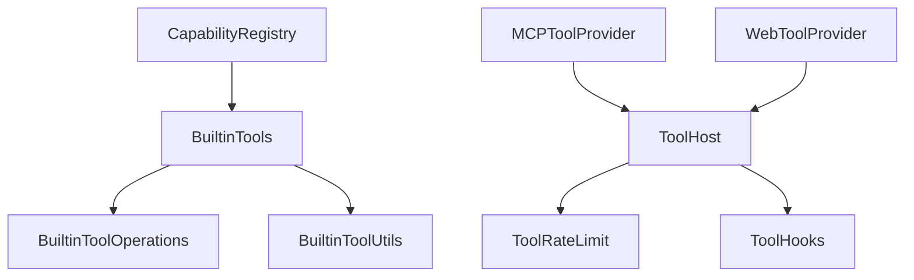

图表来源
- [builtin-tools.ts:1-120](file://kun/src/adapters/tool/builtin-tools.ts#L1-L120)
- [builtin-tool-operations.ts:1-120](file://kun/src/adapters/tool/builtin-tool-operations.ts#L1-L120)
- [builtin-tool-utils.ts:1-120](file://kun/src/adapters/tool/builtin-tool-utils.ts#L1-L120)
- [capability-registry.ts:1-120](file://kun/src/adapters/tool/capability-registry.ts#L1-L120)
- [mcp-tool-provider.ts:1-120](file://kun/src/adapters/tool/mcp-tool-provider.ts#L1-L120)
- [web-tool-provider.ts:1-120](file://kun/src/adapters/tool/web-tool-provider.ts#L1-L120)
- [tool-host.ts:1-120](file://kun/src/ports/tool-host.ts#L1-L120)
- [tool-rate-limit.ts:1-120](file://kun/src/adapters/tool/tool-rate-limit.ts#L1-L120)
- [tool-hooks.ts:1-120](file://kun/src/adapters/tool/tool-hooks.ts#L1-L120)

章节来源
- [builtin-tools.ts:1-120](file://kun/src/adapters/tool/builtin-tools.ts#L1-L120)
- [builtin-tool-operations.ts:1-120](file://kun/src/adapters/tool/builtin-tool-operations.ts#L1-L120)
- [builtin-tool-utils.ts:1-120](file://kun/src/adapters/tool/builtin-tool-utils.ts#L1-L120)
- [capability-registry.ts:1-120](file://kun/src/adapters/tool/capability-registry.ts#L1-L120)
- [mcp-tool-provider.ts:1-120](file://kun/src/adapters/tool/mcp-tool-provider.ts#L1-L120)
- [web-tool-provider.ts:1-120](file://kun/src/adapters/tool/web-tool-provider.ts#L1-L120)
- [tool-host.ts:1-120](file://kun/src/ports/tool-host.ts#L1-L120)
- [tool-rate-limit.ts:1-120](file://kun/src/adapters/tool/tool-rate-limit.ts#L1-L120)
- [tool-hooks.ts:1-120](file://kun/src/adapters/tool/tool-hooks.ts#L1-L120)

### 遥测与监控（Telemetry & Monitoring）
- 缓存遥测：记录缓存命中率、容量与淘汰
- 用量计数器：统计每日/模型维度用量
- 事件记录器：持久化运行时关键事件，便于审计与回放

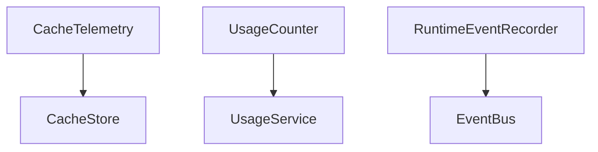

图表来源
- [cache-telemetry.ts:1-120](file://kun/src/telemetry/cache-telemetry.ts#L1-L120)
- [usage-counter.ts:1-120](file://kun/src/telemetry/usage-counter.ts#L1-L120)
- [runtime-event-recorder.ts:1-120](file://kun/src/services/runtime-event-recorder.ts#L1-L120)

章节来源
- [cache-telemetry.ts:1-120](file://kun/src/telemetry/cache-telemetry.ts#L1-L120)
- [usage-counter.ts:1-120](file://kun/src/telemetry/usage-counter.ts#L1-L120)
- [runtime-event-recorder.ts:1-120](file://kun/src/services/runtime-event-recorder.ts#L1-L120)

### 配置与安全（Config & Security）
- 配置加载与默认值
- 敏感信息脱敏（避免日志泄露）

章节来源
- [kun-config.ts:1-120](file://kun/src/config/kun-config.ts#L1-L120)
- [secret-redaction.ts:1-120](file://kun/src/config/secret-redaction.ts#L1-L120)

## 依赖分析
运行时核心各层之间的依赖关系如下：
- 服务器层依赖服务层与端口层
- 服务层依赖领域层与端口层
- 循环层依赖领域层、端口层与适配器层
- 适配器层实现端口层契约
- 遥测层与配置层为横切关注点

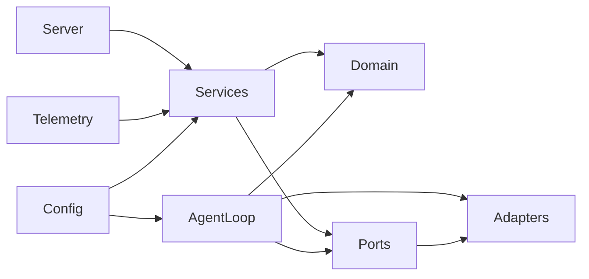

图表来源
- [http-server.ts:1-120](file://kun/src/server/http-server.ts#L1-L120)
- [thread-service.ts:1-120](file://kun/src/services/thread-service.ts#L1-L120)
- [agent-loop.ts:1-200](file://kun/src/loop/agent-loop.ts#L1-L200)
- [model-client.ts:1-120](file://kun/src/ports/model-client.ts#L1-L120)

章节来源
- [http-server.ts:1-120](file://kun/src/server/http-server.ts#L1-L120)
- [thread-service.ts:1-120](file://kun/src/services/thread-service.ts#L1-L120)
- [agent-loop.ts:1-200](file://kun/src/loop/agent-loop.ts#L1-L200)
- [model-client.ts:1-120](file://kun/src/ports/model-client.ts#L1-L120)

## 性能考虑
- 上下文压缩与历史修复：减少无效上下文，提升吞吐与延迟表现
- 自动模型路由：在预算与性能间权衡，避免昂贵模型滥用
- 工具风暴抑制与速率限制：防止突发流量导致系统过载
- 缓存与 TTL：结合 LRU 与前缀挥发策略，降低重复计算与 IO
- 流式输出与 SSE：提升用户体验与响应速度
- 日志与遥测：避免高频采样造成额外开销

## 故障排查指南
- 模型调用失败：检查模型客户端实现、错误探测与重试策略
- 工具调用异常：启用工具调用修复与风暴抑制，查看工具速率限制
- 用量超限：核对 Token 经济模型与用量服务，设置合理限额
- 事件丢失：确认事件总线实现与订阅者处理逻辑
- 存储一致性：验证会话/线程存储的原子写入与并发控制
- 配置问题：检查配置加载与敏感信息脱敏

章节来源
- [model-error-probe.ts:1-120](file://kun/src/adapters/model/model-error-probe.ts#L1-L120)
- [tool-call-repair.ts:1-120](file://kun/src/loop/tool-call-repair.ts#L1-L120)
- [tool-storm-breaker.ts:1-120](file://kun/src/loop/tool-storm-breaker.ts#L1-L120)
- [in-memory-event-bus.ts:1-120](file://kun/src/adapters/in-memory-event-bus.ts#L1-L120)
- [atomic-write.ts:1-120](file://kun/src/adapters/file/atomic-write.ts#L1-L120)
- [secret-redaction.ts:1-120](file://kun/src/config/secret-redaction.ts#L1-L120)

## 结论
Kun 运行时核心通过清晰的分层架构与事件驱动机制，实现了可扩展、可观测且高性能的智能体运行环境。Agent Loop 将上下文管理、模型路由与工具调用整合为闭环，配合服务层的业务编排与适配器层的灵活实现，能够适应多样化的应用场景。建议在生产环境中结合遥测与缓存策略持续优化，并完善容错与限流机制。

## 附录
- 单元测试覆盖：配置、自动模型路由、Token 经济、循环、领域模型、内置工具、委派运行时、线程服务、用量服务、事件还原器、运行时工厂等
- 开发与贡献：参阅仓库内的开发文档与贡献指南

章节来源
- [kun-config.test.ts:1-120](file://kun/src/tests/kun-config.test.ts#L1-L120)
- [auto-model-router.test.ts:1-120](file://kun/src/tests/auto-model-router.test.ts#L1-L120)
- [token-economy.test.ts:1-120](file://kun/src/tests/token-economy.test.ts#L1-L120)
- [loop.test.ts:1-120](file://kun/src/tests/loop.test.ts#L1-L120)
- [domain.test.ts:1-120](file://kun/src/tests/domain.test.ts#L1-L120)
- [builtin-tools.test.ts:1-120](file://kun/src/tests/builtin-tools.test.ts#L1-L120)
- [delegation-runtime.test.ts:1-120](file://kun/src/tests/delegation-runtime.test.ts#L1-L120)
- [thread-service.test.ts:1-120](file://kun/src/tests/thread-service.test.ts#L1-L120)
- [usage-service.test.ts:1-120](file://kun/src/tests/usage-service.test.ts#L1-L120)
- [runtime-event-reducer.test.ts:1-120](file://kun/src/tests/runtime-event-reducer.test.ts#L1-L120)
- [runtime-factory.test.ts:1-120](file://kun/src/tests/runtime-factory.test.ts#L1-L120)