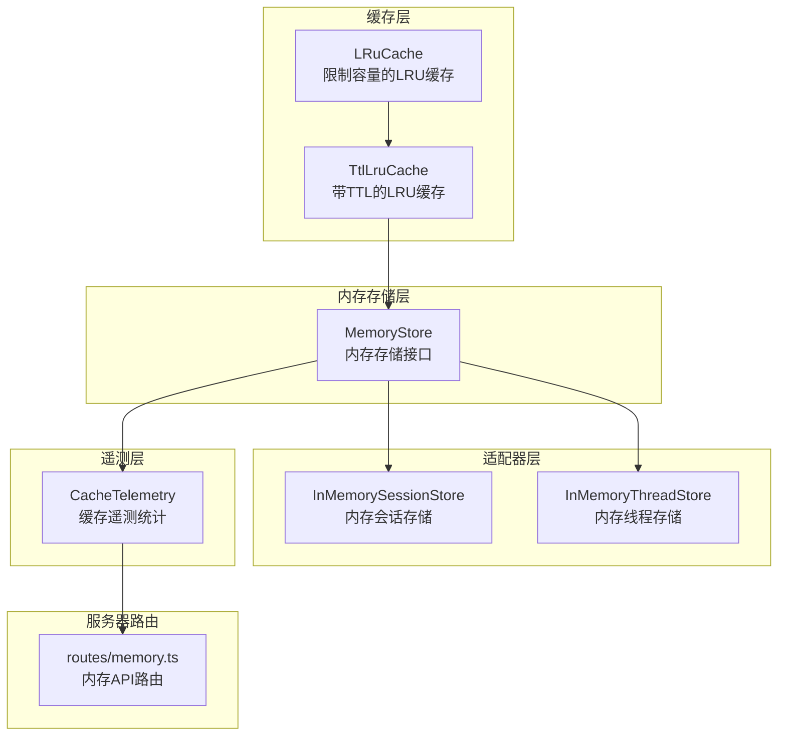
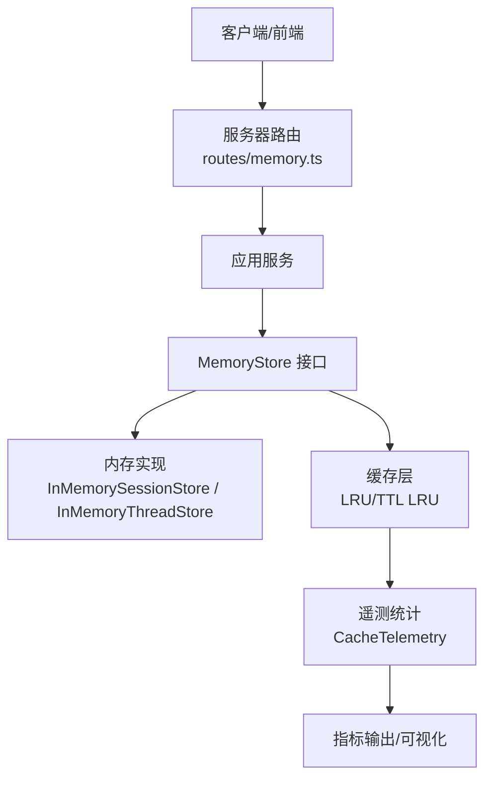
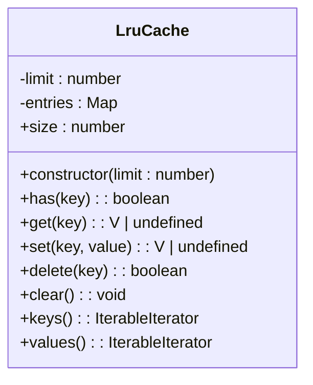
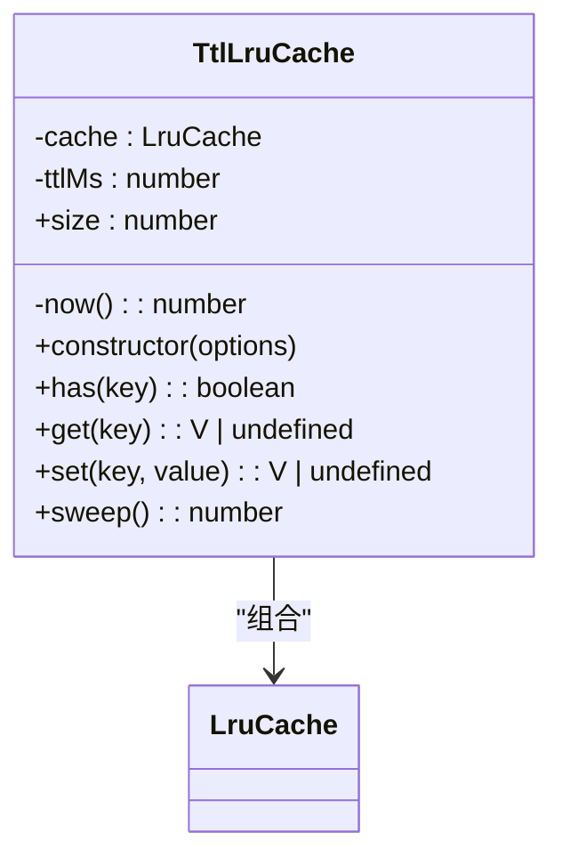
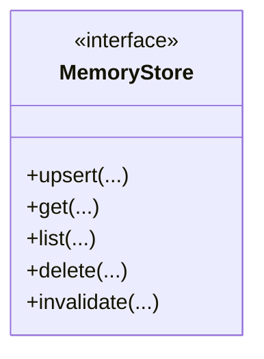
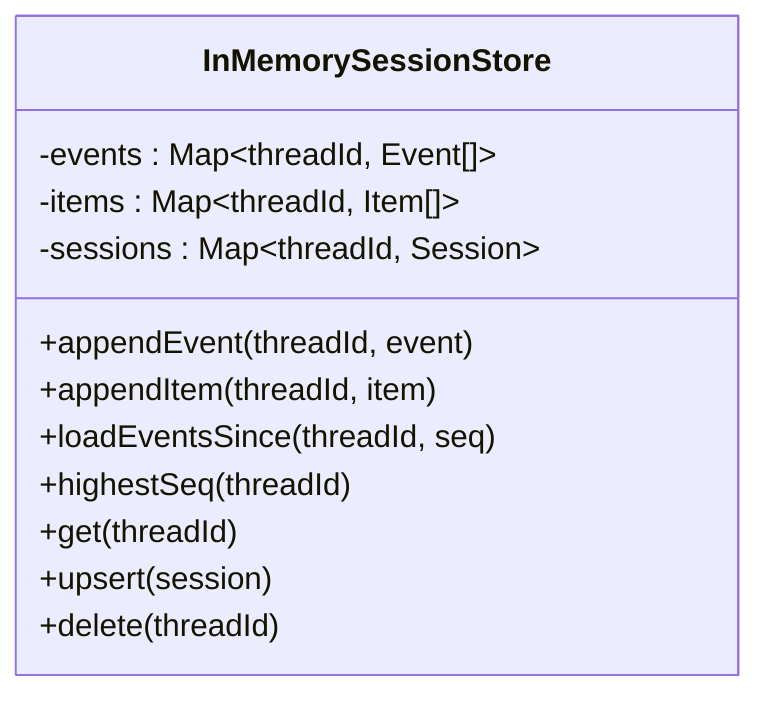
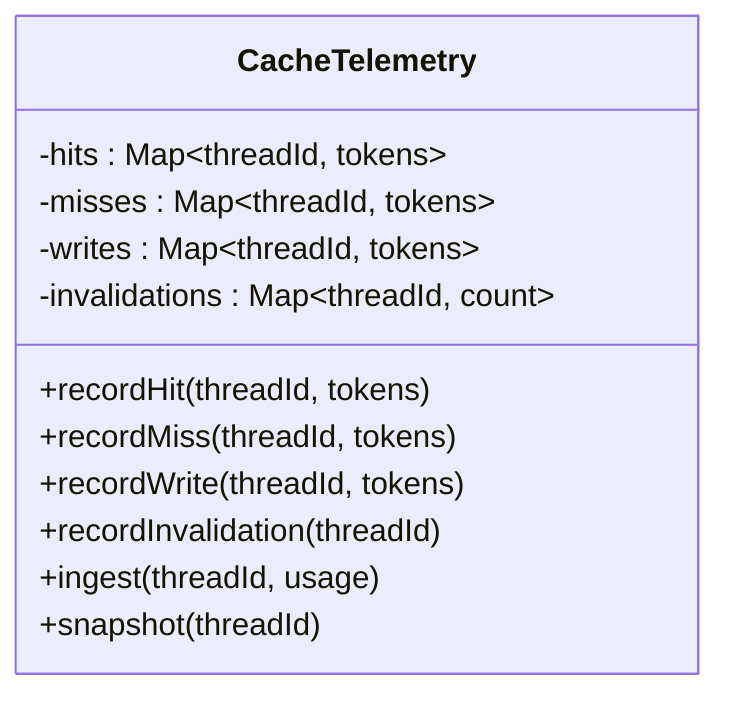
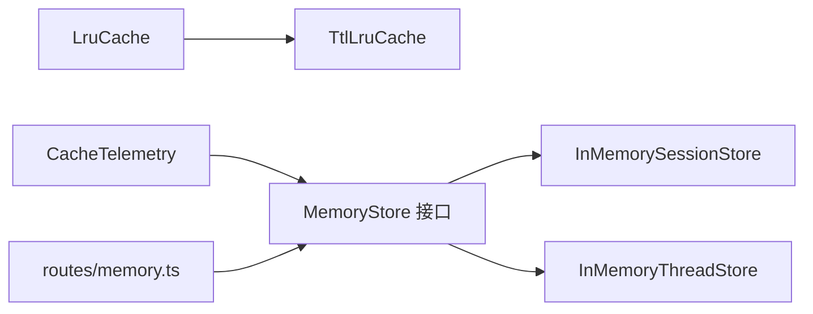

# 内存管理系统

<cite>
**本文档引用的文件**
- [lru-cache.ts](file://kun/src/cache/lru-cache.ts)
- [ttl-lru-cache.ts](file://kun/src/cache/ttl-lru-cache.ts)
- [cache-telemetry.ts](file://kun/src/telemetry/cache-telemetry.ts)
- [memory-store.ts](file://kun/src/memory/memory-store.ts)
- [in-memory-session-store.ts](file://kun/src/adapters/in-memory-session-store.ts)
- [in-memory-thread-store.ts](file://kun/src/adapters/in-memory-thread-store.ts)
- [memory.ts](file://kun/src/contracts/memory.ts)
- [memory.ts（服务器路由）](file://kun/src/server/routes/memory.ts)
- [cache.test.ts](file://kun/tests/cache.test.ts)
- [memory-store.test.ts](file://kun/tests/memory-store.test.ts)
- [ports.test.ts](file://kun/tests/ports.test.ts)
</cite>

## 目录
1. [引言](#引言)
2. [项目结构](#项目结构)
3. [核心组件](#核心组件)
4. [架构总览](#架构总览)
5. [详细组件分析](#详细组件分析)
6. [依赖关系分析](#依赖关系分析)
7. [性能考量](#性能考量)
8. [故障排查指南](#故障排查指南)
9. [结论](#结论)
10. [附录](#附录)

## 引言
本文件系统性阐述 DeepSeek-GUI 项目的内存管理系统架构与实现，重点覆盖：
- 内存存储设计原理与数据结构
- 缓存策略与一致性保障
- LRU 算法在缓存中的应用与实现细节
- TTL 结合 LRU 的过期与清理机制
- 内存优化技术与缓存失效策略
- 性能监控指标、内存使用分析与优化建议
- 并发访问控制与内存泄漏防护

该系统通过“内存缓存 + 会话/线程视图 + 遥测统计”的组合，为运行时提供高效、可追踪且可扩展的内存管理能力。

## 项目结构
内存管理相关模块主要分布在以下目录：
- 缓存层：提供 LRU 与 TTL+LRU 的缓存实现
- 内存存储层：面向领域模型的数据持久化抽象
- 适配器层：内存实现（用于测试与默认运行时）
- 遥测层：缓存命中率等指标统计
- 服务器路由：对外暴露内存相关的 API

**图表来源**
- [lru-cache.ts:1-66](file://kun/src/cache/lru-cache.ts#L1-L66)
- [ttl-lru-cache.ts:1-46](file://kun/src/cache/ttl-lru-cache.ts#L1-L46)
- [memory-store.ts](file://kun/src/memory/memory-store.ts)
- [in-memory-session-store.ts:1-35](file://kun/src/adapters/in-memory-session-store.ts#L1-L35)
- [in-memory-thread-store.ts](file://kun/src/adapters/in-memory-thread-store.ts)
- [cache-telemetry.ts:1-36](file://kun/src/telemetry/cache-telemetry.ts#L1-L36)
- [memory.ts（服务器路由）](file://kun/src/server/routes/memory.ts)

**章节来源**
- [lru-cache.ts:1-66](file://kun/src/cache/lru-cache.ts#L1-L66)
- [ttl-lru-cache.ts:1-46](file://kun/src/cache/ttl-lru-cache.ts#L1-L46)
- [memory-store.ts](file://kun/src/memory/memory-store.ts)
- [in-memory-session-store.ts:1-35](file://kun/src/adapters/in-memory-session-store.ts#L1-L35)
- [in-memory-thread-store.ts](file://kun/src/adapters/in-memory-thread-store.ts)
- [cache-telemetry.ts:1-36](file://kun/src/telemetry/cache-telemetry.ts#L1-L36)
- [memory.ts（服务器路由）](file://kun/src/server/routes/memory.ts)

## 核心组件
- LruCache：基于 Map 的有界 LRU 缓存，支持 get/set/has/delete/clear/keys/values 等操作，内部通过 Map 的插入顺序维护最近使用次序。
- TtlLruCache：在 LruCache 基础上增加 TTL 过期时间，get 时检查过期并自动删除；sweep 可主动清理过期条目。
- MemoryStore：内存存储抽象，定义内存数据的增删改查与失效策略。
- InMemorySessionStore / InMemoryThreadStore：内存实现，分别维护事件日志、项列表与会话投影，用于 SSE 回放与重启重放。
- CacheTelemetry：缓存遥测统计，记录命中、未命中、写入与失效次数，并汇总为命中率等指标。
- 服务器路由：提供内存相关 API，供前端或外部系统查询与管理。

**章节来源**
- [lru-cache.ts:9-66](file://kun/src/cache/lru-cache.ts#L9-L66)
- [ttl-lru-cache.ts:12-46](file://kun/src/cache/ttl-lru-cache.ts#L12-L46)
- [memory-store.ts](file://kun/src/memory/memory-store.ts)
- [in-memory-session-store.ts:14-35](file://kun/src/adapters/in-memory-session-store.ts#L14-L35)
- [in-memory-thread-store.ts](file://kun/src/adapters/in-memory-thread-store.ts)
- [cache-telemetry.ts:9-36](file://kun/src/telemetry/cache-telemetry.ts#L9-L36)
- [memory.ts（服务器路由）](file://kun/src/server/routes/memory.ts)

## 架构总览
内存管理采用分层架构：
- 表现层：服务器路由暴露内存 API
- 应用层：服务与控制器协调缓存与存储
- 领域层：MemoryStore 抽象与具体实现
- 基础设施层：LRU/TTL 缓存、Map 数据结构、遥测统计

**图表来源**
- [memory.ts（服务器路由）](file://kun/src/server/routes/memory.ts)
- [memory-store.ts](file://kun/src/memory/memory-store.ts)
- [in-memory-session-store.ts:14-35](file://kun/src/adapters/in-memory-session-store.ts#L14-L35)
- [in-memory-thread-store.ts](file://kun/src/adapters/in-memory-thread-store.ts)
- [lru-cache.ts:9-66](file://kun/src/cache/lru-cache.ts#L9-L66)
- [ttl-lru-cache.ts:12-46](file://kun/src/cache/ttl-lru-cache.ts#L12-L46)
- [cache-telemetry.ts:9-36](file://kun/src/telemetry/cache-telemetry.ts#L9-L36)

## 详细组件分析

### LruCache 组件分析
- 设计原理：以 Map 存储键值对，利用 Map 的插入顺序作为“最近使用”序列；get/set 操作通过删除再插入实现“提升到最近”。
- 复杂度：get/set/has 均摊 O(1)，删除最旧元素通过迭代器取第一个键实现。
- 关键行为：
  - set：若键存在则更新；若超出容量，删除最早插入的键（Map 第一个元素）。
  - get：不存在返回 undefined；存在则删除并重新插入，同时返回值。
  - has/delete/clear/keys/values 提供基本集合操作。
- 错误处理：构造函数校验容量必须为正数，否则抛出错误。

**图表来源**
- [lru-cache.ts:9-66](file://kun/src/cache/lru-cache.ts#L9-L66)

**章节来源**
- [lru-cache.ts:1-66](file://kun/src/cache/lru-cache.ts#L1-L66)
- [cache.test.ts:215-218](file://kun/tests/cache.test.ts#L215-L218)

### TtlLruCache 组件分析
- 设计原理：在 LruCache 上包装一层，每个条目携带过期时间；get 时检查过期并删除；sweep 主动清理过期条目。
- 复杂度：get/set 均摊 O(1)，sweep 遍历一次 Map 清理过期项。
- 关键行为：
  - get：若条目不存在或已过期，返回 undefined 并从缓存中删除。
  - set：计算过期时间并写入；可能触发 LRU 容量淘汰。
  - sweep：遍历缓存，删除所有已过期条目并返回数量。
- 一致性：过期视为“未命中”，下一次 set 可能驱逐仍有效的条目，确保容量约束。

**图表来源**
- [ttl-lru-cache.ts:12-46](file://kun/src/cache/ttl-lru-cache.ts#L12-L46)
- [lru-cache.ts:9-66](file://kun/src/cache/lru-cache.ts#L9-L66)

**章节来源**
- [ttl-lru-cache.ts:1-46](file://kun/src/cache/ttl-lru-cache.ts#L1-L46)
- [cache.test.ts:220-238](file://kun/tests/cache.test.ts#L220-L238)

### MemoryStore 组件分析
- 职责：定义内存数据的统一抽象，包括增删改查与失效策略，便于替换为其他存储后端。
- 设计要点：通过接口隔离存储实现，使上层逻辑不依赖具体存储类型。
- 与缓存的关系：MemoryStore 可以结合 LRU/TTL LRU 实现热点数据驻留与容量控制。

**图表来源**
- [memory-store.ts](file://kun/src/memory/memory-store.ts)

**章节来源**
- [memory-store.ts](file://kun/src/memory/memory-store.ts)

### InMemorySessionStore 组件分析
- 视图管理：维护三类视图（事件日志、项列表、会话投影），用于 SSE 回放与重启重放。
- 去重与更新：appendEvent/appendItem 时避免重复；更新会话投影并刷新 updatedAt。
- 并发考虑：当前实现为单线程 Map，无显式锁；并发场景需在调用层加锁或使用不可变更新。

**图表来源**
- [in-memory-session-store.ts:14-35](file://kun/src/adapters/in-memory-session-store.ts#L14-L35)

**章节来源**
- [in-memory-session-store.ts:1-35](file://kun/src/adapters/in-memory-session-store.ts#L1-L35)
- [ports.test.ts:86-94](file://kun/tests/ports.test.ts#L86-L94)

### InMemoryThreadStore 组件分析
- 功能：提供线程记录的增删改查与按 updatedAt 排序列出的能力。
- 使用场景：在内存实现中维护线程元数据，配合 MemoryStore 提供完整内存视图。

**章节来源**
- [in-memory-thread-store.ts](file://kun/src/adapters/in-memory-thread-store.ts)
- [ports.test.ts:66-84](file://kun/tests/ports.test.ts#L66-L84)

### CacheTelemetry 组件分析
- 指标聚合：按 threadId 聚合命中、未命中、写入与失效次数，支持从 UsageSnapshot 注入缓存统计。
- 输出用途：GUI “缓存命中率”徽章的数据来源。
- 计算方式：命中率 = 命中令牌数 / (命中令牌数 + 未命中令牌数)；未知线程返回空值。

**图表来源**
- [cache-telemetry.ts:9-36](file://kun/src/telemetry/cache-telemetry.ts#L9-L36)

**章节来源**
- [cache-telemetry.ts:1-36](file://kun/src/telemetry/cache-telemetry.ts#L1-L36)

### 服务器路由与内存 API
- 路由职责：提供内存数据的查询、更新、失效等接口，供前端或外部系统调用。
- 与存储交互：路由层调用 MemoryStore 与适配器实现，完成数据读写与一致性控制。

**章节来源**
- [memory.ts（服务器路由）](file://kun/src/server/routes/memory.ts)

## 依赖关系分析
- LruCache 与 TtlLruCache：TtlLruCache 组合 LruCache，复用其容量与淘汰逻辑。
- MemoryStore 与适配器：MemoryStore 为接口，InMemorySessionStore/InMemoryThreadStore 为其内存实现。
- 遥测与缓存：CacheTelemetry 从 UsageSnapshot 中提取缓存统计，与 MemoryStore 无直接耦合，但通过服务层汇总。
- 服务器路由：依赖 MemoryStore 与适配器，向上提供 HTTP 接口。

**图表来源**
- [lru-cache.ts:9-66](file://kun/src/cache/lru-cache.ts#L9-L66)
- [ttl-lru-cache.ts:12-46](file://kun/src/cache/ttl-lru-cache.ts#L12-L46)
- [memory-store.ts](file://kun/src/memory/memory-store.ts)
- [in-memory-session-store.ts:14-35](file://kun/src/adapters/in-memory-session-store.ts#L14-L35)
- [in-memory-thread-store.ts](file://kun/src/adapters/in-memory-thread-store.ts)
- [cache-telemetry.ts:9-36](file://kun/src/telemetry/cache-telemetry.ts#L9-L36)
- [memory.ts（服务器路由）](file://kun/src/server/routes/memory.ts)

**章节来源**
- [lru-cache.ts:1-66](file://kun/src/cache/lru-cache.ts#L1-L66)
- [ttl-lru-cache.ts:1-46](file://kun/src/cache/ttl-lru-cache.ts#L1-L46)
- [memory-store.ts](file://kun/src/memory/memory-store.ts)
- [in-memory-session-store.ts:1-35](file://kun/src/adapters/in-memory-session-store.ts#L1-L35)
- [in-memory-thread-store.ts](file://kun/src/adapters/in-memory-thread-store.ts)
- [cache-telemetry.ts:1-36](file://kun/src/telemetry/cache-telemetry.ts#L1-L36)
- [memory.ts（服务器路由）](file://kun/src/server/routes/memory.ts)

## 性能考量
- 时间复杂度
  - LruCache：get/set/has 均摊 O(1)，删除最旧元素 O(n)（n 为 Map 元素个数，实际通过迭代器首元素实现）。
  - TtlLruCache：get/set 均摊 O(1)，sweep 遍历 O(n)。
- 空间复杂度：O(n)（n 为缓存条目数）。
- 容量与淘汰
  - 通过 limit 控制容量，避免无限增长导致内存压力。
  - LRU 优先淘汰最久未使用的条目，提高缓存命中率。
- TTL 清理
  - get 时惰性过期检查，减少额外开销；sweep 主动清理可降低后续 get 的无效扫描。
- 遥测指标
  - 命中率、命中令牌数、未命中令牌数、写入令牌数、失效次数等，用于评估缓存效果与优化方向。

**章节来源**
- [lru-cache.ts:1-66](file://kun/src/cache/lru-cache.ts#L1-L66)
- [ttl-lru-cache.ts:1-46](file://kun/src/cache/ttl-lru-cache.ts#L1-L46)
- [cache-telemetry.ts:1-36](file://kun/src/telemetry/cache-telemetry.ts#L1-L36)

## 故障排查指南
- LruCache 容量异常
  - 现象：构造函数抛出错误。
  - 原因：limit 必须为正数。
  - 处理：检查配置参数，确保 limit > 0。
- TTL 条目未命中
  - 现象：get 返回 undefined。
  - 原因：条目已过期或不存在。
  - 处理：确认 TTL 设置是否合理；必要时调用 sweep 清理过期条目。
- 内存泄漏风险
  - 现象：缓存持续增长。
  - 原因：未设置合理 limit 或未定期 sweep。
  - 处理：设定合适的容量上限；定期执行 sweep；监控命中率与失效次数。
- 并发访问问题
  - 现象：数据竞争或状态不一致。
  - 原因：Map 为单线程结构，未加锁。
  - 处理：在调用层加锁；或采用不可变数据结构与原子更新策略。

**章节来源**
- [cache.test.ts:215-218](file://kun/tests/cache.test.ts#L215-L218)
- [cache.test.ts:220-238](file://kun/tests/cache.test.ts#L220-L238)
- [in-memory-session-store.ts:19-32](file://kun/src/adapters/in-memory-session-store.ts#L19-L32)

## 结论
本内存管理系统通过 LRU 与 TTL+LRU 缓存、内存存储抽象与遥测统计，实现了高可用、可观测的内存管理方案。系统具备清晰的分层架构与明确的职责边界，既满足性能需求，又便于扩展与维护。建议在生产环境中结合容量规划、定期 sweep 与并发控制，持续监控命中率与失效情况，以获得最佳的内存使用效率。

## 附录
- 相关契约与类型定义可参考 contracts/memory.ts，用于规范内存数据结构与 API 约束。
- 测试用例覆盖了 LRU 与 TTL LRU 的关键行为，可作为行为参考与回归验证依据。

**章节来源**
- [memory.ts](file://kun/src/contracts/memory.ts)
- [memory-store.test.ts](file://kun/tests/memory-store.test.ts)
- [cache.test.ts:210-238](file://kun/tests/cache.test.ts#L210-L238)
- [ports.test.ts:66-94](file://kun/tests/ports.test.ts#L66-L94)