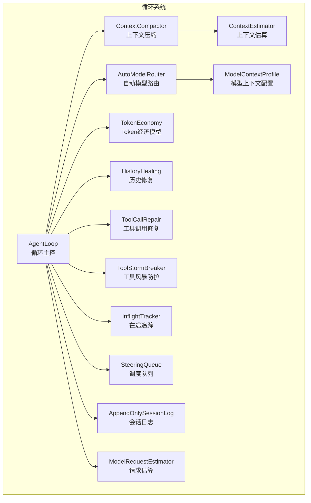
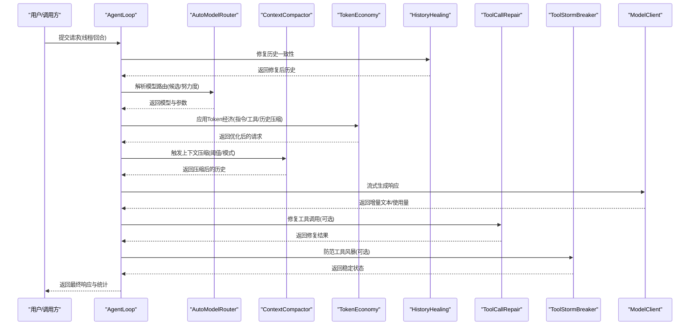
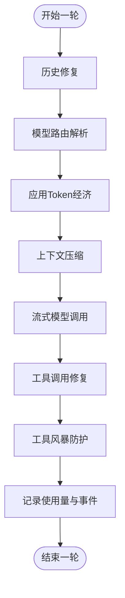
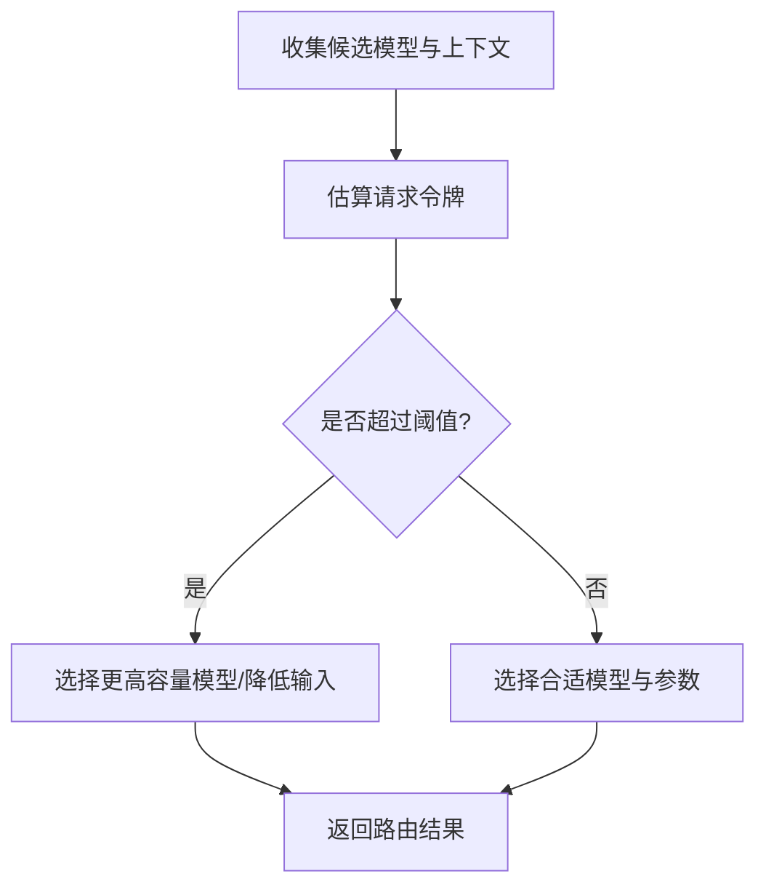
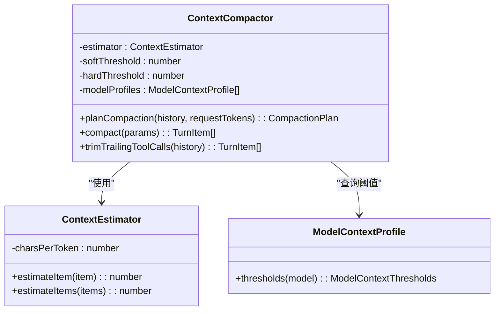
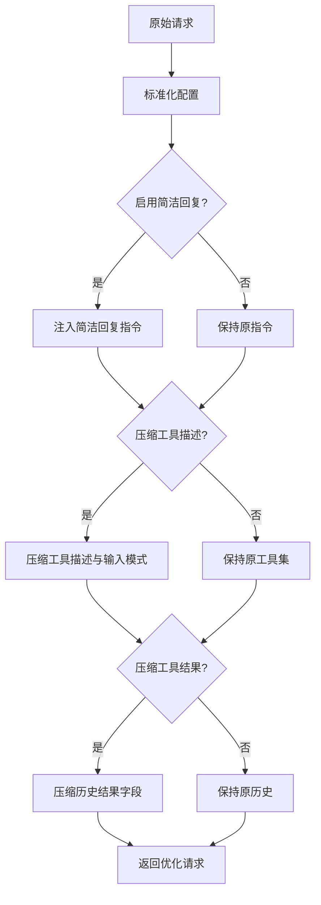
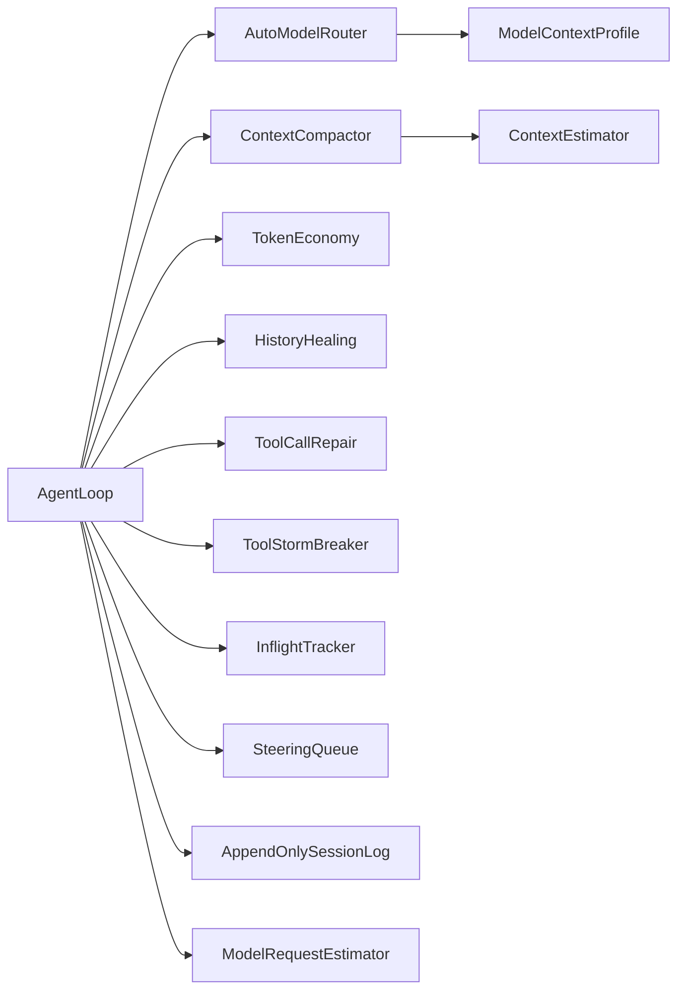

# 智能体循环系统

<cite>
**本文引用的文件**
- [agent-loop.ts](file://kun/src/loop/agent-loop.ts)
- [context-compactor.ts](file://kun/src/loop/context-compactor.ts)
- [context-estimator.ts](file://kun/src/loop/context-estimator.ts)
- [model-request-estimator.ts](file://kun/src/loop/model-request-estimator.ts)
- [auto-model-router.ts](file://kun/src/loop/auto-model-router.ts)
- [token-economy.ts](file://kun/src/loop/token-economy.ts)
- [history-healing.ts](file://kun/src/loop/history-healing.ts)
- [tool-call-repair.ts](file://kun/src/loop/tool-call-repair.ts)
- [tool-storm-breaker.ts](file://kun/src/loop/tool-storm-breaker.ts)
- [model-context-profile.ts](file://kun/src/loop/model-context-profile.ts)
- [inflight-tracker.ts](file://kun/src/loop/inflight-tracker.ts)
- [steering-queue.ts](file://kun/src/loop/steering-queue.ts)
- [append-only-session-log.ts](file://kun/src/loop/append-only-session-log.ts)
- [index.ts](file://kun/src/loop/index.ts)
- [loop.test.ts](file://kun/tests/loop.test.ts)
</cite>

## 目录
1. [简介](#简介)
2. [项目结构](#项目结构)
3. [核心组件](#核心组件)
4. [架构总览](#架构总览)
5. [详细组件分析](#详细组件分析)
6. [依赖关系分析](#依赖关系分析)
7. [性能考量](#性能考量)
8. [故障排查指南](#故障排查指南)
9. [结论](#结论)
10. [附录](#附录)

## 简介
本技术文档围绕智能体循环系统（Agent Loop）进行深入解析，覆盖循环调度、状态管理与决策机制；详解自动模型路由算法、Token 经济模型的设计与实现；解释上下文压缩、历史修复、工具调用修复等关键组件的工作机制，并提供性能优化策略、错误处理方案与调试技巧。文档面向具备一定技术背景的读者，力求在保证准确性的同时保持可读性。

## 项目结构
智能体循环系统位于 kun/src/loop 目录下，包含以下关键模块：
- 循环调度与主控：agent-loop.ts
- 上下文压缩：context-compactor.ts
- 上下文估算：context-estimator.ts、model-request-estimator.ts
- 自动模型路由：auto-model-router.ts
- Token 经济模型：token-economy.ts
- 历史修复：history-healing.ts
- 工具调用修复：tool-call-repair.ts
- 工具风暴防护：tool-storm-breaker.ts
- 模型上下文配置：model-context-profile.ts
- 运行时追踪与队列：inflight-tracker.ts、steering-queue.ts、append-only-session-log.ts
- 导出入口：index.ts

图表来源
- [agent-loop.ts:284-1418](file://kun/src/loop/agent-loop.ts#L284-L1418)
- [context-compactor.ts:1-210](file://kun/src/loop/context-compactor.ts#L1-L210)
- [context-estimator.ts:1-48](file://kun/src/loop/context-estimator.ts#L1-L48)
- [model-request-estimator.ts:1-38](file://kun/src/loop/model-request-estimator.ts#L1-L38)
- [auto-model-router.ts](file://kun/src/loop/auto-model-router.ts)
- [token-economy.ts:67-114](file://kun/src/loop/token-economy.ts#L67-L114)
- [history-healing.ts](file://kun/src/loop/history-healing.ts)
- [tool-call-repair.ts](file://kun/src/loop/tool-call-repair.ts)
- [tool-storm-breaker.ts](file://kun/src/loop/tool-storm-breaker.ts)
- [model-context-profile.ts](file://kun/src/loop/model-context-profile.ts)
- [inflight-tracker.ts](file://kun/src/loop/inflight-tracker.ts)
- [steering-queue.ts](file://kun/src/loop/steering-queue.ts)
- [append-only-session-log.ts](file://kun/src/loop/append-only-session-log.ts)

章节来源
- [index.ts:1-9](file://kun/src/loop/index.ts#L1-L9)

## 核心组件
本节对 Agent Loop 的核心职责与关键子系统进行概览式说明，后续章节将逐个深入。

- AgentLoop：负责单次对话轮次（turn）的完整生命周期，包括输入预处理、模型路由、上下文压缩、工具调用、结果记录与状态推进。
- AutoModelRouter：根据上下文大小、模型能力与配置，动态选择合适的模型与参数。
- ContextCompactor：在达到阈值或显式触发时，将历史折叠为摘要项，减少上下文长度。
- ContextEstimator / ModelRequestEstimator：提供上下文与请求的粗略令牌估算，用于触发压缩与路由决策。
- TokenEconomy：通过指令约束、工具描述压缩、历史结果压缩等方式降低令牌消耗。
- HistoryHealing / ToolCallRepair / ToolStormBreaker：分别负责历史一致性修复、工具调用格式修复与工具调用风暴防护。
- ModelContextProfile：定义不同模型的上下文阈值与配置。
- InflightTracker / SteeringQueue / AppendOnlySessionLog：支撑并发控制、任务调度与会话持久化。

章节来源
- [agent-loop.ts:284-1418](file://kun/src/loop/agent-loop.ts#L284-L1418)
- [context-compactor.ts:1-210](file://kun/src/loop/context-compactor.ts#L1-L210)
- [context-estimator.ts:1-48](file://kun/src/loop/context-estimator.ts#L1-L48)
- [model-request-estimator.ts:1-38](file://kun/src/loop/model-request-estimator.ts#L1-L38)
- [token-economy.ts:67-114](file://kun/src/loop/token-economy.ts#L67-L114)
- [history-healing.ts](file://kun/src/loop/history-healing.ts)
- [tool-call-repair.ts](file://kun/src/loop/tool-call-repair.ts)
- [tool-storm-breaker.ts](file://kun/src/loop/tool-storm-breaker.ts)
- [model-context-profile.ts](file://kun/src/loop/model-context-profile.ts)
- [inflight-tracker.ts](file://kun/src/loop/inflight-tracker.ts)
- [steering-queue.ts](file://kun/src/loop/steering-queue.ts)
- [append-only-session-log.ts](file://kun/src/loop/append-only-session-log.ts)

## 架构总览
Agent Loop 将“输入 → 路由 → 执行 → 记录”的流程模块化，各模块通过接口解耦，形成清晰的数据流与控制流。

图表来源
- [agent-loop.ts:440-1418](file://kun/src/loop/agent-loop.ts#L440-L1418)
- [auto-model-router.ts](file://kun/src/loop/auto-model-router.ts)
- [context-compactor.ts:1-210](file://kun/src/loop/context-compactor.ts#L1-L210)
- [token-economy.ts:67-114](file://kun/src/loop/token-economy.ts#L67-L114)
- [history-healing.ts](file://kun/src/loop/history-healing.ts)
- [tool-call-repair.ts](file://kun/src/loop/tool-call-repair.ts)
- [tool-storm-breaker.ts](file://kun/src/loop/tool-storm-breaker.ts)

## 详细组件分析

### AgentLoop：循环调度与状态管理
- 职责边界
  - 单轮次（turn）生命周期编排：输入预处理、历史修复、模型路由、上下文压缩、工具调用、结果记录与事件上报。
  - 与外部端口交互：会话存储、事件总线、模型客户端、使用量统计。
- 关键流程
  - 输入缓存与前缀波动检测：在进入正式推理前，记录阶段并检测前缀内容波动，避免不必要的重算。
  - 历史修复：对历史中的不一致项进行修复，必要时回写到会话存储。
  - 决策机制：根据线程/回合模式、审批策略、推理努力度等，决定模型与参数。
  - 上下文压缩：在流式生成摘要失败或超时时，采用启发式摘要替代，确保稳定性。
- 并发与可观测性
  - 使用 InflightTracker 与 SteeringQueue 控制并发与优先级。
  - 通过 AppendOnlySessionLog 保障会话日志的顺序性与可追溯性。

图表来源
- [agent-loop.ts:440-1418](file://kun/src/loop/agent-loop.ts#L440-L1418)
- [inflight-tracker.ts](file://kun/src/loop/inflight-tracker.ts)
- [steering-queue.ts](file://kun/src/loop/steering-queue.ts)
- [append-only-session-log.ts](file://kun/src/loop/append-only-session-log.ts)

章节来源
- [agent-loop.ts:284-1418](file://kun/src/loop/agent-loop.ts#L284-L1418)

### 自动模型路由算法（AutoModelRouter）
- 设计目标
  - 在给定上下文与候选模型中，选择最合适的模型与推理参数，兼顾成本、延迟与质量。
- 关键点
  - 候选模型链：回合指定模型 → 线程模型 → 全局默认模型。
  - 推理努力度：根据用户意图调整温度、最大输出等参数。
  - 上下文阈值：结合模型上下文配置与当前估算，动态调整路由策略。
- 与上下文压缩联动
  - 路由决策可能触发压缩，以满足模型上下文限制。

图表来源
- [auto-model-router.ts](file://kun/src/loop/auto-model-router.ts)
- [model-request-estimator.ts:1-38](file://kun/src/loop/model-request-estimator.ts#L1-L38)
- [model-context-profile.ts](file://kun/src/loop/model-context-profile.ts)

章节来源
- [auto-model-router.ts](file://kun/src/loop/auto-model-router.ts)
- [model-request-estimator.ts:1-38](file://kun/src/loop/model-request-estimator.ts#L1-L38)
- [model-context-profile.ts](file://kun/src/loop/model-context-profile.ts)

### 上下文压缩（ContextCompactor）
- 功能概述
  - 当上下文接近或超过模型阈值时，将历史折叠为“压缩项”，保留关键信息（如技能标记、不可变前缀）。
- 压缩模式
  - 正常（normal）、激进（aggressive）、强制（force），依据软/硬阈值与模型配置计算。
- 摘要生成
  - 支持流式摘要生成；若超时则回退到启发式摘要，保证可用性。
- 辅助工具
  - 去除尾部工具调用、计算摘要指纹、保留技能标记等。

图表来源
- [context-compactor.ts:1-210](file://kun/src/loop/context-compactor.ts#L1-L210)
- [context-estimator.ts:1-48](file://kun/src/loop/context-estimator.ts#L1-L48)
- [model-context-profile.ts](file://kun/src/loop/model-context-profile.ts)

章节来源
- [context-compactor.ts:1-210](file://kun/src/loop/context-compactor.ts#L1-L210)
- [context-estimator.ts:1-48](file://kun/src/loop/context-estimator.ts#L1-L48)
- [loop.test.ts:1561-1602](file://kun/tests/loop.test.ts#L1561-L1602)

### Token 经济模型（TokenEconomy）
- 设计原则
  - 通过指令约束、工具描述压缩、历史结果压缩等手段，在不显著影响效果的前提下降低令牌消耗。
- 实现要点
  - 可配置开关与子策略：简洁回复、压缩工具描述、压缩工具结果。
  - 对请求进行轻量压缩与规范化，避免过度影响语义。
- 与上下文压缩协同
  - 在路由与压缩之前应用，进一步降低输入规模。

图表来源
- [token-economy.ts:67-114](file://kun/src/loop/token-economy.ts#L67-L114)

章节来源
- [token-economy.ts:67-114](file://kun/src/loop/token-economy.ts#L67-L114)

### 历史修复（HistoryHealing）
- 目标
  - 修复历史中的不一致项（如缺失/错位的工具调用/结果），确保后续推理的正确性。
- 行为
  - 识别变更并按需回写到会话存储，记录阶段详情以便审计。

章节来源
- [agent-loop.ts:440-448](file://kun/src/loop/agent-loop.ts#L440-L448)
- [history-healing.ts](file://kun/src/loop/history-healing.ts)

### 工具调用修复（ToolCallRepair）
- 目标
  - 修复工具调用格式问题，提升工具执行成功率与稳定性。
- 行为
  - 在模型输出后对工具调用进行校验与修复，必要时回退到安全策略。

章节来源
- [tool-call-repair.ts](file://kun/src/loop/tool-call-repair.ts)
- [agent-loop.ts:1382-1384](file://kun/src/loop/agent-loop.ts#L1382-L1384)

### 工具风暴防护（ToolStormBreaker）
- 目标
  - 防止工具被高频调用导致资源耗尽或系统不稳定。
- 行为
  - 通过速率限制、冷却时间或队列限流等策略，平滑工具调用节奏。

章节来源
- [tool-storm-breaker.ts](file://kun/src/loop/tool-storm-breaker.ts)
- [agent-loop.ts:1382-1384](file://kun/src/loop/agent-loop.ts#L1382-L1384)

### 并发与调度（InflightTracker / SteeringQueue / AppendOnlySessionLog）
- InflightTracker：跟踪在途请求，防止重复或竞态。
- SteeringQueue：基于优先级与策略的调度队列，保障高优任务及时执行。
- AppendOnlySessionLog：顺序写入的会话日志，便于回放与审计。

章节来源
- [inflight-tracker.ts](file://kun/src/loop/inflight-tracker.ts)
- [steering-queue.ts](file://kun/src/loop/steering-queue.ts)
- [append-only-session-log.ts](file://kun/src/loop/append-only-session-log.ts)

## 依赖关系分析
- 模块内聚与耦合
  - AgentLoop 作为协调者，依赖多个子系统但尽量通过接口解耦。
  - ContextCompactor 与 ContextEstimator 强关联，共同完成上下文估算与压缩。
  - AutoModelRouter 依赖模型上下文配置与请求估算结果。
- 外部依赖
  - 模型客户端、会话存储、事件总线、使用量统计等端口接口。
- 潜在循环依赖
  - 通过导出入口统一暴露，避免直接相互导入。

图表来源
- [index.ts:1-9](file://kun/src/loop/index.ts#L1-L9)
- [agent-loop.ts:284-1418](file://kun/src/loop/agent-loop.ts#L284-L1418)
- [context-compactor.ts:1-210](file://kun/src/loop/context-compactor.ts#L1-L210)
- [context-estimator.ts:1-48](file://kun/src/loop/context-estimator.ts#L1-L48)
- [model-request-estimator.ts:1-38](file://kun/src/loop/model-request-estimator.ts#L1-L38)
- [auto-model-router.ts](file://kun/src/loop/auto-model-router.ts)
- [token-economy.ts:67-114](file://kun/src/loop/token-economy.ts#L67-L114)
- [history-healing.ts](file://kun/src/loop/history-healing.ts)
- [tool-call-repair.ts](file://kun/src/loop/tool-call-repair.ts)
- [tool-storm-breaker.ts](file://kun/src/loop/tool-storm-breaker.ts)
- [model-context-profile.ts](file://kun/src/loop/model-context-profile.ts)
- [inflight-tracker.ts](file://kun/src/loop/inflight-tracker.ts)
- [steering-queue.ts](file://kun/src/loop/steering-queue.ts)
- [append-only-session-log.ts](file://kun/src/loop/append-only-session-log.ts)

## 性能考量
- 估算与阈值
  - 使用 ContextEstimator 与 ModelRequestEstimator 进行快速估算，提前触发压缩与路由调整。
- 压缩策略
  - 合理设置软/硬阈值与压缩模式，避免过度压缩导致信息丢失。
- Token 经济
  - 开启简洁回复与工具描述压缩可显著降低输入规模；谨慎开启历史结果压缩以平衡成本与可读性。
- 并发与队列
  - 利用 SteeringQueue 与 InflightTracker 控制并发度，避免热点模型过载。
- 回退策略
  - 上下文摘要流式生成超时回退到启发式摘要，确保服务可用性。

## 故障排查指南
- 常见问题定位
  - 历史修复未生效：检查历史修复模块是否识别到变更并成功回写。
  - 模型路由异常：核对候选模型链、推理努力度与上下文阈值配置。
  - 上下文压缩失败：确认压缩模式与阈值设置，检查摘要生成超时回退逻辑。
  - 工具调用失败：启用工具调用修复与风暴防护，观察速率限制与冷却时间。
- 调试技巧
  - 使用事件总线记录关键阶段（输入缓存、路由、压缩、摘要生成、使用量）。
  - 逐步缩小问题范围：先验证估算与阈值，再检查路由与压缩，最后定位工具层问题。
  - 查看单元测试用例，理解边界条件与期望行为。

章节来源
- [agent-loop.ts:440-1418](file://kun/src/loop/agent-loop.ts#L440-L1418)
- [loop.test.ts:1561-1602](file://kun/tests/loop.test.ts#L1561-L1602)

## 结论
智能体循环系统通过模块化的组件设计，实现了从输入到输出的全链路优化：在保证推理质量的同时，通过自动模型路由、上下文压缩与 Token 经济模型有效控制成本与延迟；借助历史修复、工具调用修复与风暴防护，提升了系统的鲁棒性与稳定性。建议在生产环境中结合业务场景调优阈值与策略，并持续监控关键指标以获得最佳效果。

## 附录
- 关键术语
  - 上下文阈值：模型允许的最大上下文长度阈值，分为软阈值与硬阈值。
  - 压缩模式：normal/aggressive/force，分别对应不同的保留策略与风险等级。
  - Token 经济：通过指令、工具与历史压缩降低令牌消耗的策略集合。
- 参考文件
  - [agent-loop.ts:284-1418](file://kun/src/loop/agent-loop.ts#L284-L1418)
  - [context-compactor.ts:1-210](file://kun/src/loop/context-compactor.ts#L1-L210)
  - [context-estimator.ts:1-48](file://kun/src/loop/context-estimator.ts#L1-L48)
  - [model-request-estimator.ts:1-38](file://kun/src/loop/model-request-estimator.ts#L1-L38)
  - [auto-model-router.ts](file://kun/src/loop/auto-model-router.ts)
  - [token-economy.ts:67-114](file://kun/src/loop/token-economy.ts#L67-L114)
  - [history-healing.ts](file://kun/src/loop/history-healing.ts)
  - [tool-call-repair.ts](file://kun/src/loop/tool-call-repair.ts)
  - [tool-storm-breaker.ts](file://kun/src/loop/tool-storm-breaker.ts)
  - [model-context-profile.ts](file://kun/src/loop/model-context-profile.ts)
  - [inflight-tracker.ts](file://kun/src/loop/inflight-tracker.ts)
  - [steering-queue.ts](file://kun/src/loop/steering-queue.ts)
  - [append-only-session-log.ts](file://kun/src/loop/append-only-session-log.ts)
  - [index.ts:1-9](file://kun/src/loop/index.ts#L1-L9)
  - [loop.test.ts:1561-1602](file://kun/tests/loop.test.ts#L1561-L1602)