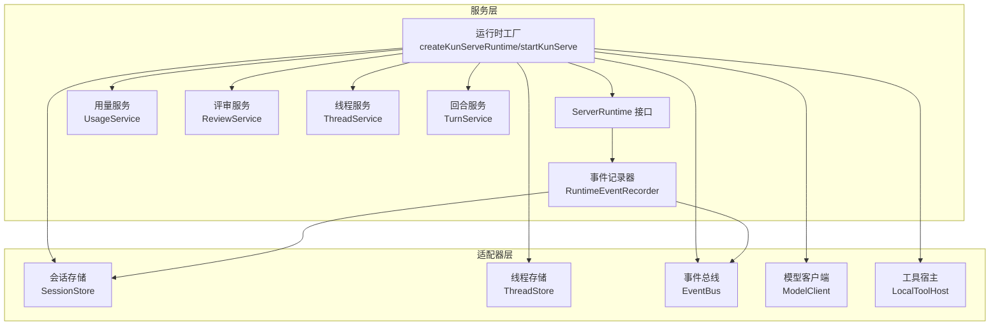
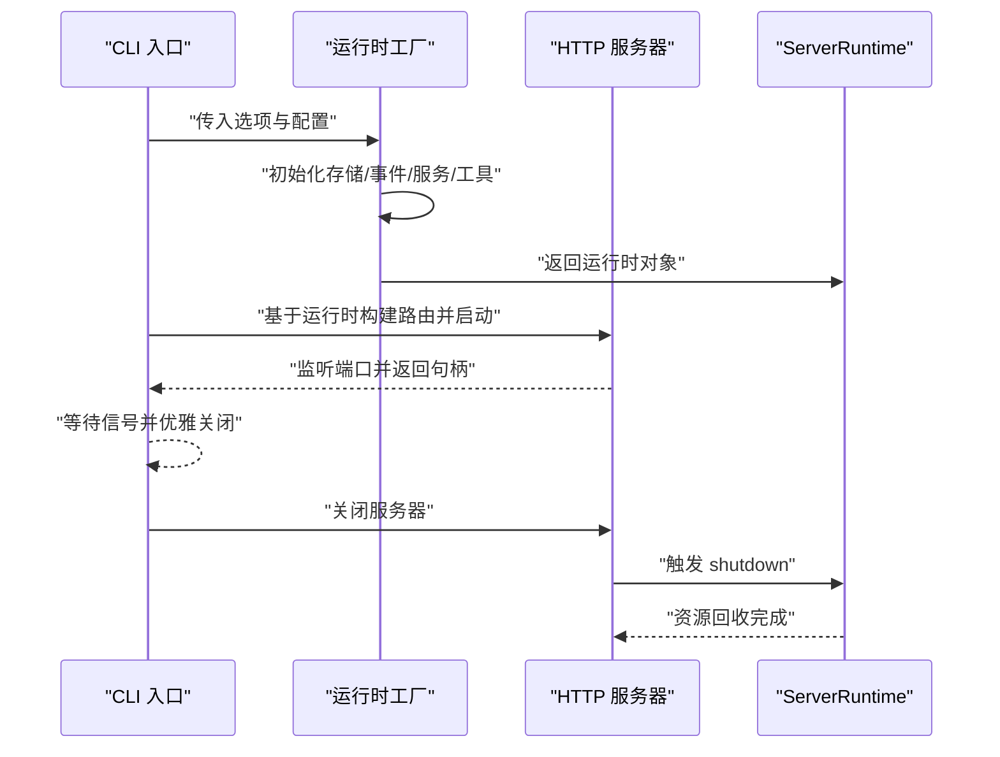
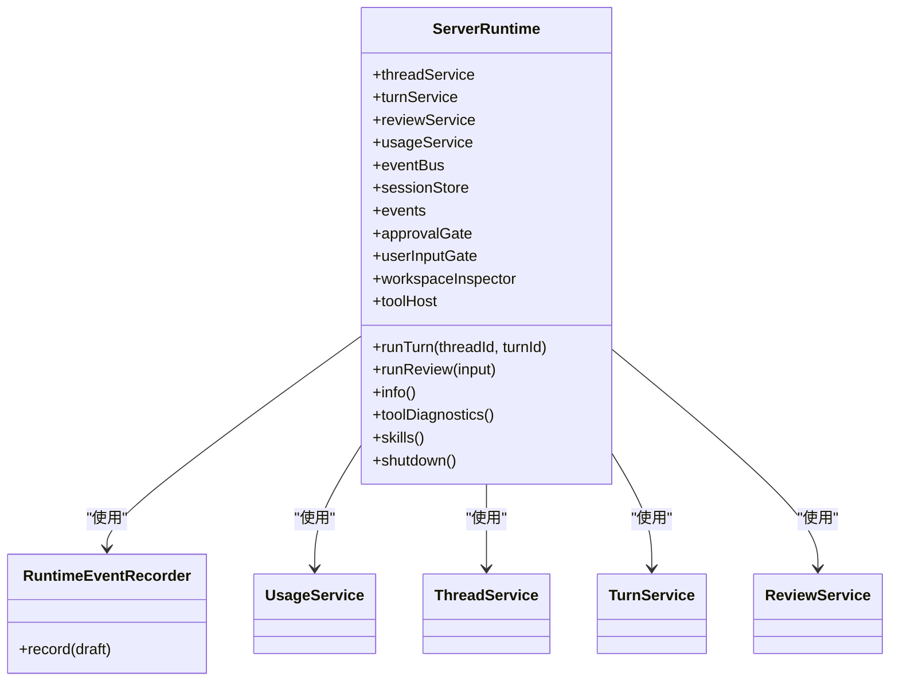
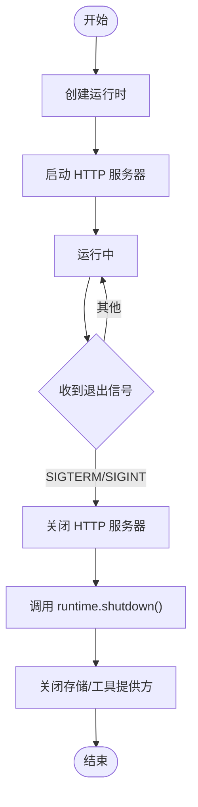
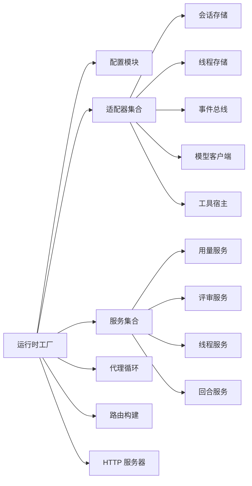

# 运行时工厂

<cite>
**本文引用的文件**
- [runtime-factory.ts](file://kun/src/server/runtime-factory.ts)
- [server-runtime.ts](file://kun/src/server/routes/server-runtime.ts)
- [runtime-event-recorder.ts](file://kun/src/services/runtime-event-recorder.ts)
- [runtime-error.ts](file://src/shared/runtime-error.ts)
- [kun-config.ts](file://kun/src/config/kun-config.ts)
- [kun-process.ts](file://src/main/kun-process.ts)
- [schedule-runtime.ts](file://src/main/schedule-runtime.ts)
- [serve-entry.ts](file://kun/src/cli/serve-entry.ts)
- [runtime-factory.test.ts](file://kun/tests/runtime-factory.test.ts)
</cite>

## 目录
1. [简介](#简介)
2. [项目结构](#项目结构)
3. [核心组件](#核心组件)
4. [架构总览](#架构总览)
5. [详细组件分析](#详细组件分析)
6. [依赖关系分析](#依赖关系分析)
7. [性能考量](#性能考量)
8. [故障排查指南](#故障排查指南)
9. [结论](#结论)
10. [附录](#附录)

## 简介
本文件系统性阐述“运行时工厂”的设计与实现，覆盖运行时实例创建流程、依赖注入机制、配置管理策略；并深入解析运行时生命周期管理、资源清理与错误恢复机制。同时提供运行时配置最佳实践、性能调优参数建议以及常见问题的排查方法，帮助开发者在不同场景下稳定、高效地部署与运维。

## 项目结构
运行时工厂位于后端服务层，负责组装运行时所需的全部组件（适配器、服务、循环、工具宿主等），并通过统一入口对外暴露运行时能力。其关键位置如下：
- 工厂入口：创建运行时并启动 HTTP 服务器
- 运行时接口：对外暴露的服务与能力
- 事件记录器：统一的事件边界与持久化
- 配置模块：运行时配置与能力开关
- 生命周期与错误处理：进程管理、优雅关闭、错误解析

图表来源
- [runtime-factory.ts:91-365](file://kun/src/server/runtime-factory.ts#L91-L365)
- [server-runtime.ts:37-120](file://kun/src/server/routes/server-runtime.ts#L37-L120)
- [runtime-event-recorder.ts:31-50](file://kun/src/services/runtime-event-recorder.ts#L31-L50)

章节来源
- [runtime-factory.ts:91-365](file://kun/src/server/runtime-factory.ts#L91-L365)
- [server-runtime.ts:37-120](file://kun/src/server/routes/server-runtime.ts#L37-L120)

## 核心组件
- 运行时工厂函数：负责装配所有依赖并返回统一的运行时对象
- ServerRuntime 接口：对外暴露服务、工具、能力与生命周期控制
- 事件记录器：统一事件入站校验、排序、广播与持久化
- 配置与能力：运行时配置、存储后端选择、能力开关与诊断
- 生命周期与关闭：HTTP 服务器关闭与运行时资源回收

章节来源
- [runtime-factory.ts:60-84](file://kun/src/server/runtime-factory.ts#L60-L84)
- [runtime-event-recorder.ts:31-50](file://kun/src/services/runtime-event-recorder.ts#L31-L50)
- [kun-config.ts:38-42](file://kun/src/config/kun-config.ts#L38-L42)

## 架构总览
运行时工厂采用“显式依赖注入”与“组合根”模式，避免 IoC 容器与魔法解析，确保可测试性与可维护性。工厂内部完成以下装配：
- 创建事件总线与事件记录器
- 初始化存储层（文件或混合 SQLite）
- 构建服务层（用量、评审、线程、回合）
- 组装工具提供方与工具宿主
- 启动代理循环与能力清单
- 暴露统一运行时接口与健康/诊断路由

图表来源
- [runtime-factory.ts:424-445](file://kun/src/server/runtime-factory.ts#L424-L445)
- [serve-entry.ts:39-57](file://kun/src/cli/serve-entry.ts#L39-L57)

章节来源
- [runtime-factory.ts:91-365](file://kun/src/server/runtime-factory.ts#L91-L365)
- [serve-entry.ts:39-57](file://kun/src/cli/serve-entry.ts#L39-L57)

## 详细组件分析

### 运行时工厂与依赖注入
- 显式构造参数：所有核心组件通过构造函数注入，避免全局状态与魔法解析
- 组合根原则：仅在工厂中进行具体适配器与服务的绑定，其余模块保持纯函数/类设计
- 可测试性：测试可通过传入内存适配器快速构建最小运行时

图表来源
- [server-runtime.ts:37-120](file://kun/src/server/routes/server-runtime.ts#L37-L120)
- [runtime-event-recorder.ts:31-50](file://kun/src/services/runtime-event-recorder.ts#L31-L50)

章节来源
- [runtime-factory.ts:91-365](file://kun/src/server/runtime-factory.ts#L91-L365)
- [server-runtime.ts:37-120](file://kun/src/server/routes/server-runtime.ts#L37-L120)

### 存储层与能力开关
- 存储后端选择：支持文件与混合 SQLite 两种模式，按配置自动切换
- 能力开关：附件、内存、子代理、Web 工具、MCP 工具等能力按配置启用
- 能力清单：运行时启动时汇总各能力状态，供诊断与健康检查使用

章节来源
- [runtime-factory.ts:376-405](file://kun/src/server/runtime-factory.ts#L376-L405)
- [runtime-factory.ts:217-251](file://kun/src/server/runtime-factory.ts#L217-L251)

### 事件记录与持久化
- 事件边界：统一由事件记录器写入序列号与时间戳，并进行结构校验
- 广播与持久化：事件先广播给订阅者，再追加到会话存储，保证 SSE 实时与历史回放一致

章节来源
- [runtime-event-recorder.ts:31-50](file://kun/src/services/runtime-event-recorder.ts#L31-L50)

### 生命周期管理与资源清理
- 启动：CLI 调用工厂创建运行时，构建路由并启动 HTTP 服务器
- 关闭：服务器关闭后，调用运行时 shutdown，依次释放 MCP 提供方与存储资源
- 进程管理：主进程侧提供子进程生命周期管理与日志捕获，支持优雅停止与强制终止

图表来源
- [runtime-factory.ts:424-445](file://kun/src/server/runtime-factory.ts#L424-L445)
- [kun-process.ts:565-600](file://src/main/kun-process.ts#L565-L600)

章节来源
- [runtime-factory.ts:424-445](file://kun/src/server/runtime-factory.ts#L424-L445)
- [kun-process.ts:565-600](file://src/main/kun-process.ts#L565-L600)

### 错误恢复与诊断
- 错误体解析：统一解析运行时错误响应，提取结构化错误码与详情
- 诊断接口：运行时提供工具与能力诊断，便于定位问题
- 功耗控制：调度运行时在特定条件下启动/停止系统电源保护器，避免系统挂起导致任务中断

章节来源
- [runtime-error.ts:102-148](file://src/shared/runtime-error.ts#L102-L148)
- [runtime-factory.ts:343-355](file://kun/src/server/runtime-factory.ts#L343-L355)
- [schedule-runtime.ts:647-679](file://src/main/schedule-runtime.ts#L647-L679)

## 依赖关系分析
运行时工厂对各模块的依赖清晰且集中，遵循“上层服务依赖下层适配器”的单向依赖原则，避免循环依赖与隐式耦合。

图表来源
- [runtime-factory.ts:1-58](file://kun/src/server/runtime-factory.ts#L1-L58)
- [runtime-factory.ts:91-365](file://kun/src/server/runtime-factory.ts#L91-L365)

章节来源
- [runtime-factory.ts:1-58](file://kun/src/server/runtime-factory.ts#L1-L58)
- [runtime-factory.ts:91-365](file://kun/src/server/runtime-factory.ts#L91-L365)

## 性能考量
- 上下文压缩与前缀稳定：通过不可变前缀与上下文压缩减少重复计算，提升缓存命中率
- 令牌经济：按配置启用/禁用令牌经济，限制使用成本与频率
- 存储后端：混合 SQLite 模式适合高并发场景，文件模式适合轻量部署
- 工具风暴防护：可配置工具风暴断路器，避免突发高负载
- 诊断与监控：通过工具与能力诊断接口持续观察运行状态，及时发现性能瓶颈

章节来源
- [runtime-factory.ts:118-125](file://kun/src/server/runtime-factory.ts#L118-L125)
- [runtime-factory.ts:291-294](file://kun/src/server/runtime-factory.ts#L291-L294)
- [kun-config.ts:38-42](file://kun/src/config/kun-config.ts#L38-L42)

## 故障排查指南
- 启动失败
  - 检查数据目录权限与路径有效性
  - 确认存储后端可用（文件/SQLite）
  - 查看 CLI 输出的启动信息与错误日志
- 运行异常
  - 使用运行时诊断接口查看工具与能力状态
  - 检查模型客户端连接与凭据
  - 核对事件序列与时间戳一致性
- 关闭卡顿
  - 确认 MCP 提供方与存储资源是否正确释放
  - 观察 SIGTERM/SIGINT 处理链路
- 错误解析
  - 使用统一错误解析函数获取结构化错误码与详情
- 能耗与挂起
  - 检查电源保护器状态，必要时手动停止以避免系统挂起

章节来源
- [runtime-factory.ts:357-363](file://kun/src/server/runtime-factory.ts#L357-L363)
- [kun-process.ts:565-600](file://src/main/kun-process.ts#L565-L600)
- [runtime-error.ts:102-148](file://src/shared/runtime-error.ts#L102-L148)
- [schedule-runtime.ts:647-679](file://src/main/schedule-runtime.ts#L647-L679)

## 结论
运行时工厂通过显式依赖注入与组合根模式，实现了高内聚、低耦合的运行时装配；配合统一事件边界、能力诊断与生命周期管理，提供了稳定可靠的运行时体验。结合配置与性能调优参数，可在不同部署环境下获得最佳表现。

## 附录

### 运行时配置最佳实践
- 存储后端：生产环境优先使用混合 SQLite；开发环境可选文件模式
- 能力开关：按需启用附件/内存/子代理/工具提供方，避免不必要的资源占用
- 令牌经济：根据业务成本目标开启，设置合理的限额与频率
- 上下文与前缀：保持系统提示与前缀稳定，提升缓存复用率
- 日志与诊断：开启工具与能力诊断，定期巡检运行状态

章节来源
- [kun-config.ts:38-42](file://kun/src/config/kun-config.ts#L38-L42)
- [runtime-factory.ts:118-125](file://kun/src/server/runtime-factory.ts#L118-L125)
- [runtime-factory.ts:217-251](file://kun/src/server/runtime-factory.ts#L217-L251)

### 使用携带量的种子逻辑（测试参考）
- 通过测试用例了解如何从已有的会话事件中提取最新用量并注入到运行时

章节来源
- [runtime-factory.test.ts:28-71](file://kun/tests/runtime-factory.test.ts#L28-L71)