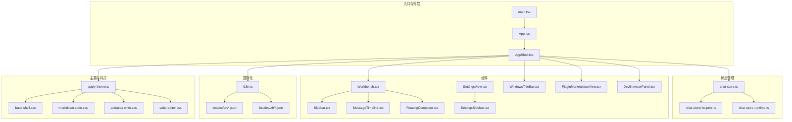
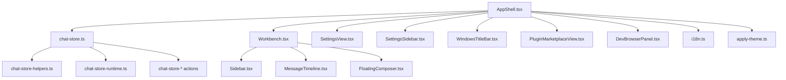
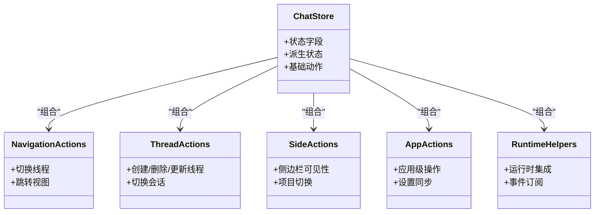
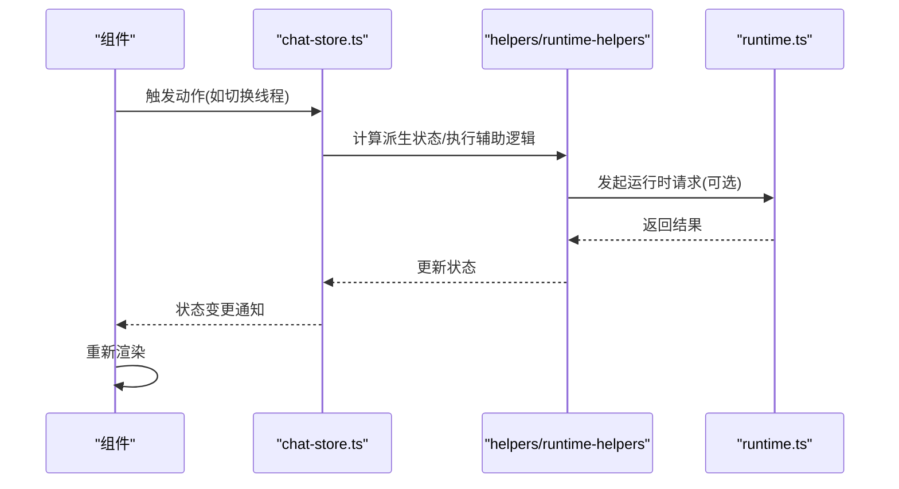
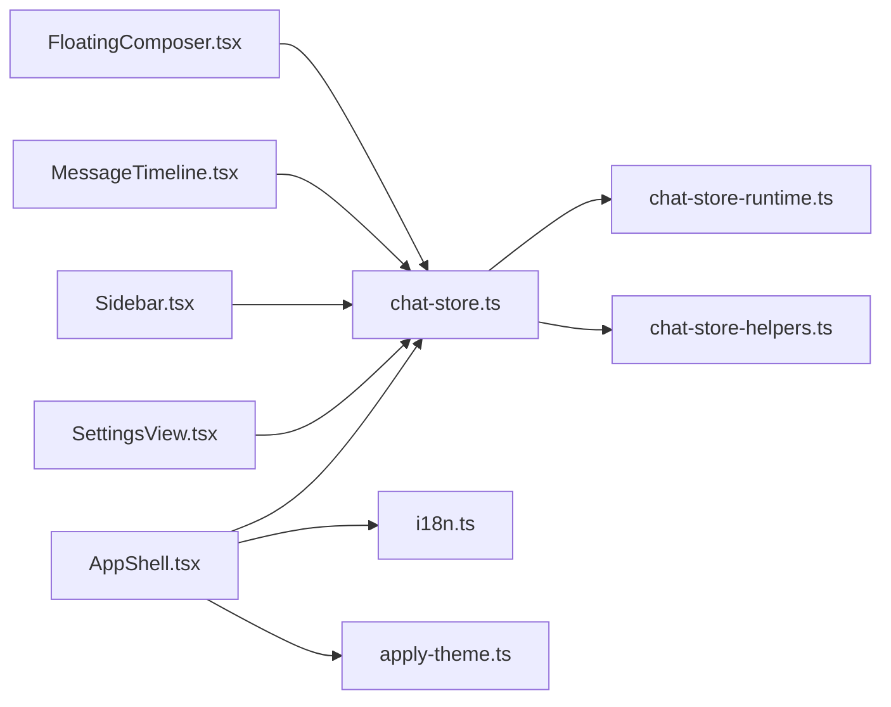

# React 渲染器应用

<cite>
**本文引用的文件**
- [App.tsx](file://src/renderer/src/App.tsx)
- [AppShell.tsx](file://src/renderer/src/AppShell.tsx)
- [main.tsx](file://src/renderer/src/main.tsx)
- [i18n.ts](file://src/renderer/src/i18n.ts)
- [chat-store.ts](file://src/renderer/src/store/chat-store.ts)
- [chat-store-types.ts](file://src/renderer/src/store/chat-store-types.ts)
- [chat-store-helpers.ts](file://src/renderer/src/store/chat-store-helpers.ts)
- [chat-store-runtime.ts](file://src/renderer/src/store/chat-store-runtime.ts)
- [chat-store-navigation-actions.ts](file://src/renderer/src/store/chat-store-navigation-actions.ts)
- [chat-store-thread-actions.ts](file://src/renderer/src/store/chat-store-thread-actions.ts)
- [chat-store-side-actions.ts](file://src/renderer/src/store/chat-store-side-actions.ts)
- [chat-store-app-actions.ts](file://src/renderer/src/store/chat-store-app-actions.ts)
- [chat-store-schedulers.ts](file://src/renderer/src/store/chat-store-schedulers.ts)
- [chat-store-maintenance-actions.ts](file://src/renderer/src/store/chat-store-maintenance-actions.ts)
- [chat-store-claw-actions.ts](file://src/renderer/src/store/chat-store-claw-actions.ts)
- [chat-store-runtime-helpers.ts](file://src/renderer/src/store/chat-store-runtime-helpers.ts)
- [Workbench.tsx](file://src/renderer/src/components/Workbench.tsx)
- [Sidebar.tsx](file://src/renderer/src/components/chat/Sidebar.tsx)
- [MessageTimeline.tsx](file://src/renderer/src/components/chat/MessageTimeline.tsx)
- [FloatingComposer.tsx](file://src/renderer/src/components/chat/FloatingComposer.tsx)
- [SettingsView.tsx](file://src/renderer/src/components/SettingsView.tsx)
- [SettingsSidebar.tsx](file://src/renderer/src/components/SettingsSidebar.tsx)
- [WindowsTitleBar.tsx](file://src/renderer/src/components/WindowsTitleBar.tsx)
- [PluginMarketplaceView.tsx](file://src/renderer/src/components/PluginMarketplaceView.tsx)
- [DiffView.tsx](file://src/renderer/src/components/DiffView.tsx)
- [DevBrowserPanel.tsx](file://src/renderer/src/components/DevBrowserPanel.tsx)
- [apply-theme.ts](file://src/renderer/src/lib/apply-theme.ts)
- [browser-storage.ts](file://src/renderer/src/lib/browser-storage.ts)
- [code-highlighting.ts](file://src/renderer/src/lib/code-highlighting.ts)
- [format-relative-time.ts](file://src/renderer/src/lib/format-relative-time.ts)
- [thread-sidebar-visibility.ts](file://src/renderer/src/lib/thread-sidebar-visibility.ts)
- [workspace-label.ts](file://src/renderer/src/lib/workspace-label.ts)
- [common.json（英语）](file://src/renderer/src/locales/en/common.json)
- [settings.json（英语）](file://src/renderer/src/locales/en/settings.json)
- [common.json（中文）](file://src/renderer/src/locales/zh/common.json)
- [settings.json（中文）](file://src/renderer/src/locales/zh/settings.json)
- [index.css](file://src/renderer/src/index.css)
- [base-shell.css](file://src/renderer/src/styles/base-shell.css)
- [markdown-code.css](file://src/renderer/src/styles/markdown-code.css)
- [surfaces-write.css](file://src/renderer/src/styles/surfaces-write.css)
- [write-editor.css](file://src/renderer/src/styles/write-editor.css)
</cite>

## 目录
1. [简介](#简介)
2. [项目结构](#项目结构)
3. [核心组件](#核心组件)
4. [架构总览](#架构总览)
5. [详细组件分析](#详细组件分析)
6. [依赖关系分析](#依赖关系分析)
7. [性能考虑](#性能考虑)
8. [故障排查指南](#故障排查指南)
9. [结论](#结论)
10. [附录](#附录)

## 简介
本技术文档面向 React 渲染器应用，聚焦于组件架构、状态管理模式、路由系统实现与运行时集成。应用采用 Zustand 作为状态管理核心，围绕聊天会话、写作工作区、计划与 SDD 草稿等场景构建模块化 UI 组件，并通过国际化与主题系统提供多语言与可定制外观体验。文档同时覆盖应用启动流程、组件生命周期、性能优化策略以及响应式设计与无障碍实践。

## 项目结构
渲染器代码位于 src/renderer/src 下，采用按功能域划分的组织方式：
- 入口与壳层：main.tsx、App.tsx、AppShell.tsx
- 组件：components/ 下按领域拆分（chat、write、plan、sdd、schedule 等）
- 状态管理：store/ 下以领域动作与类型拆分
- 国际化：locales/ 下按语言分目录
- 主题与样式：styles/ 与 lib/ 下的主题与工具函数
- 运行时与适配：与后端服务交互的运行时客户端与适配器

图表来源
- [main.tsx](file://src/renderer/src/main.tsx)
- [App.tsx](file://src/renderer/src/App.tsx)
- [AppShell.tsx](file://src/renderer/src/AppShell.tsx)
- [chat-store.ts](file://src/renderer/src/store/chat-store.ts)
- [chat-store-helpers.ts](file://src/renderer/src/store/chat-store-helpers.ts)
- [chat-store-runtime.ts](file://src/renderer/src/store/chat-store-runtime.ts)
- [Workbench.tsx](file://src/renderer/src/components/Workbench.tsx)
- [Sidebar.tsx](file://src/renderer/src/components/chat/Sidebar.tsx)
- [MessageTimeline.tsx](file://src/renderer/src/components/chat/MessageTimeline.tsx)
- [FloatingComposer.tsx](file://src/renderer/src/components/chat/FloatingComposer.tsx)
- [SettingsView.tsx](file://src/renderer/src/components/SettingsView.tsx)
- [SettingsSidebar.tsx](file://src/renderer/src/components/SettingsSidebar.tsx)
- [WindowsTitleBar.tsx](file://src/renderer/src/components/WindowsTitleBar.tsx)
- [PluginMarketplaceView.tsx](file://src/renderer/src/components/PluginMarketplaceView.tsx)
- [DevBrowserPanel.tsx](file://src/renderer/src/components/DevBrowserPanel.tsx)
- [i18n.ts](file://src/renderer/src/i18n.ts)
- [apply-theme.ts](file://src/renderer/src/lib/apply-theme.ts)
- [index.css](file://src/renderer/src/index.css)
- [base-shell.css](file://src/renderer/src/styles/base-shell.css)
- [markdown-code.css](file://src/renderer/src/styles/markdown-code.css)
- [surfaces-write.css](file://src/renderer/src/styles/surfaces-write.css)
- [write-editor.css](file://src/renderer/src/styles/write-editor.css)

章节来源
- [main.tsx](file://src/renderer/src/main.tsx)
- [App.tsx](file://src/renderer/src/App.tsx)
- [AppShell.tsx](file://src/renderer/src/AppShell.tsx)

## 核心组件
- 应用入口与壳层
  - main.tsx：挂载 React 根节点，初始化运行时与全局样式。
  - App.tsx：顶层应用容器，负责 Provider 包裹与全局布局。
  - AppShell.tsx：应用壳层，整合侧边栏、标题栏、设置视图与插件市场等区域，协调状态与导航。
- 工作台与聊天组件
  - Workbench.tsx：主工作区容器，根据当前线程类型与模式切换不同视图。
  - Sidebar.tsx：侧边栏，展示线程列表与项目导航。
  - MessageTimeline.tsx：消息时间线渲染，支持气泡、卡片、工具调用与处理过程等视图。
  - FloatingComposer.tsx：浮动输入组件，支持模型选择、队列消息与草稿恢复。
- 设置与系统组件
  - SettingsView.tsx 与 SettingsSidebar.tsx：设置页面与侧边栏导航。
  - WindowsTitleBar.tsx：窗口标题栏，跨平台窗口控制。
  - PluginMarketplaceView.tsx：插件市场视图。
  - DevBrowserPanel.tsx：开发者浏览器面板。
- 写作与计划组件
  - 写作工作区相关组件位于 write/ 子目录，围绕 Markdown 编辑、预览、文件树与工具链协作展开。
  - 计划与 SDD 草稿组件位于 plan/ 与 sdd/ 子目录，提供计划面板与草稿编辑能力。

章节来源
- [AppShell.tsx](file://src/renderer/src/AppShell.tsx)
- [Workbench.tsx](file://src/renderer/src/components/Workbench.tsx)
- [Sidebar.tsx](file://src/renderer/src/components/chat/Sidebar.tsx)
- [MessageTimeline.tsx](file://src/renderer/src/components/chat/MessageTimeline.tsx)
- [FloatingComposer.tsx](file://src/renderer/src/components/chat/FloatingComposer.tsx)
- [SettingsView.tsx](file://src/renderer/src/components/SettingsView.tsx)
- [SettingsSidebar.tsx](file://src/renderer/src/components/SettingsSidebar.tsx)
- [WindowsTitleBar.tsx](file://src/renderer/src/components/WindowsTitleBar.tsx)
- [PluginMarketplaceView.tsx](file://src/renderer/src/components/PluginMarketplaceView.tsx)
- [DevBrowserPanel.tsx](file://src/renderer/src/components/DevBrowserPanel.tsx)

## 架构总览
应用采用“壳层 + 领域工作区”的架构。AppShell 作为统一壳层，协调状态、路由与视图；Zustand 状态仓库提供聊天、写作、计划与 SDD 草稿等领域的状态与动作；组件按领域拆分，通过 hooks 与 store 进行解耦；国际化与主题系统分别在 i18n.ts 与 apply-theme.ts 中集中管理。

图表来源
- [AppShell.tsx](file://src/renderer/src/AppShell.tsx)
- [chat-store.ts](file://src/renderer/src/store/chat-store.ts)
- [chat-store-helpers.ts](file://src/renderer/src/store/chat-store-helpers.ts)
- [chat-store-runtime.ts](file://src/renderer/src/store/chat-store-runtime.ts)
- [Workbench.tsx](file://src/renderer/src/components/Workbench.tsx)
- [Sidebar.tsx](file://src/renderer/src/components/chat/Sidebar.tsx)
- [MessageTimeline.tsx](file://src/renderer/src/components/chat/MessageTimeline.tsx)
- [FloatingComposer.tsx](file://src/renderer/src/components/chat/FloatingComposer.tsx)
- [SettingsView.tsx](file://src/renderer/src/components/SettingsView.tsx)
- [SettingsSidebar.tsx](file://src/renderer/src/components/SettingsSidebar.tsx)
- [WindowsTitleBar.tsx](file://src/renderer/src/components/WindowsTitleBar.tsx)
- [PluginMarketplaceView.tsx](file://src/renderer/src/components/PluginMarketplaceView.tsx)
- [DevBrowserPanel.tsx](file://src/renderer/src/components/DevBrowserPanel.tsx)
- [i18n.ts](file://src/renderer/src/i18n.ts)
- [apply-theme.ts](file://src/renderer/src/lib/apply-theme.ts)

## 详细组件分析

### Zustand 状态管理：聊天域
- 设计理念
  - 将状态与动作分离，按领域拆分 store 文件与动作文件，提升可维护性与可测试性。
  - 使用 helpers 与 runtime helpers 提供通用逻辑与运行时集成。
- 关键模块
  - chat-store.ts：定义状态结构、派生状态与基础动作。
  - chat-store-types.ts：定义领域数据类型与枚举。
  - chat-store-helpers.ts：提供状态计算与转换工具。
  - chat-store-runtime.ts：与后端运行时交互的适配层。
  - 动作模块：navigation、thread、side、app、schedulers、maintenance、claw、runtime-helpers 等，分别对应导航、线程、侧边栏、应用级、调度、维护、CLAW 与运行时辅助动作。
- 数据流
  - 组件通过 hooks 访问 store，触发动作更新状态；动作内部可调用 runtime 接口或本地计算。
  - 派生状态用于减少重复计算与跨组件共享。

图表来源
- [chat-store.ts](file://src/renderer/src/store/chat-store.ts)
- [chat-store-types.ts](file://src/renderer/src/store/chat-store-types.ts)
- [chat-store-helpers.ts](file://src/renderer/src/store/chat-store-helpers.ts)
- [chat-store-runtime.ts](file://src/renderer/src/store/chat-store-runtime.ts)
- [chat-store-navigation-actions.ts](file://src/renderer/src/store/chat-store-navigation-actions.ts)
- [chat-store-thread-actions.ts](file://src/renderer/src/store/chat-store-thread-actions.ts)
- [chat-store-side-actions.ts](file://src/renderer/src/store/chat-store-side-actions.ts)
- [chat-store-app-actions.ts](file://src/renderer/src/store/chat-store-app-actions.ts)
- [chat-store-schedulers.ts](file://src/renderer/src/store/chat-store-schedulers.ts)
- [chat-store-maintenance-actions.ts](file://src/renderer/src/store/chat-store-maintenance-actions.ts)
- [chat-store-claw-actions.ts](file://src/renderer/src/store/chat-store-claw-actions.ts)
- [chat-store-runtime-helpers.ts](file://src/renderer/src/store/chat-store-runtime-helpers.ts)

章节来源
- [chat-store.ts](file://src/renderer/src/store/chat-store.ts)
- [chat-store-types.ts](file://src/renderer/src/store/chat-store-types.ts)
- [chat-store-helpers.ts](file://src/renderer/src/store/chat-store-helpers.ts)
- [chat-store-runtime.ts](file://src/renderer/src/store/chat-store-runtime.ts)
- [chat-store-navigation-actions.ts](file://src/renderer/src/store/chat-store-navigation-actions.ts)
- [chat-store-thread-actions.ts](file://src/renderer/src/store/chat-store-thread-actions.ts)
- [chat-store-side-actions.ts](file://src/renderer/src/store/chat-store-side-actions.ts)
- [chat-store-app-actions.ts](file://src/renderer/src/store/chat-store-app-actions.ts)
- [chat-store-schedulers.ts](file://src/renderer/src/store/chat-store-schedulers.ts)
- [chat-store-maintenance-actions.ts](file://src/renderer/src/store/chat-store-maintenance-actions.ts)
- [chat-store-claw-actions.ts](file://src/renderer/src/store/chat-store-claw-actions.ts)
- [chat-store-runtime-helpers.ts](file://src/renderer/src/store/chat-store-runtime-helpers.ts)

### 组件层次结构与路由系统
- 层次结构
  - AppShell 作为壳层，承载全局布局与导航；Workbench 作为主工作区，根据当前线程类型与模式切换视图。
  - Sidebar、MessageTimeline、FloatingComposer 等组件在 Workbench 内部协作完成聊天体验。
  - SettingsView 与 SettingsSidebar 提供设置页与导航；WindowsTitleBar 提供窗口控制；PluginMarketplaceView 与 DevBrowserPanel 提供扩展与开发工具。
- 路由系统
  - 路由主要通过状态驱动（如当前线程、侧边栏可见性、设置页段落），而非传统 URL 路由。组件通过 useChatStore 的状态与动作进行导航与切换。

图表来源
- [chat-store.ts](file://src/renderer/src/store/chat-store.ts)
- [chat-store-helpers.ts](file://src/renderer/src/store/chat-store-helpers.ts)
- [chat-store-runtime.ts](file://src/renderer/src/store/chat-store-runtime.ts)

章节来源
- [AppShell.tsx](file://src/renderer/src/AppShell.tsx)
- [Workbench.tsx](file://src/renderer/src/components/Workbench.tsx)
- [Sidebar.tsx](file://src/renderer/src/components/chat/Sidebar.tsx)
- [MessageTimeline.tsx](file://src/renderer/src/components/chat/MessageTimeline.tsx)
- [FloatingComposer.tsx](file://src/renderer/src/components/chat/FloatingComposer.tsx)
- [SettingsView.tsx](file://src/renderer/src/components/SettingsView.tsx)
- [SettingsSidebar.tsx](file://src/renderer/src/components/SettingsSidebar.tsx)
- [WindowsTitleBar.tsx](file://src/renderer/src/components/WindowsTitleBar.tsx)
- [PluginMarketplaceView.tsx](file://src/renderer/src/components/PluginMarketplaceView.tsx)
- [DevBrowserPanel.tsx](file://src/renderer/src/components/DevBrowserPanel.tsx)

### UI 组件库与设计理念
- 设计理念
  - 以领域为中心的组件拆分，确保职责单一、易于复用与测试。
  - 通过 hooks 与 store 解耦，组件仅关注渲染与用户交互。
  - 主题与样式通过 apply-theme.ts 与样式文件集中管理，支持深浅主题与特定场景样式（如写作编辑器）。
- 样式与主题
  - apply-theme.ts：集中主题切换与变量注入。
  - styles/ 下的样式文件按场景划分，如基础壳层、Markdown 代码块、写作表面与编辑器样式。
  - index.css 与 base-shell.css 提供全局基础样式。

章节来源
- [apply-theme.ts](file://src/renderer/src/lib/apply-theme.ts)
- [index.css](file://src/renderer/src/index.css)
- [base-shell.css](file://src/renderer/src/styles/base-shell.css)
- [markdown-code.css](file://src/renderer/src/styles/markdown-code.css)
- [surfaces-write.css](file://src/renderer/src/styles/surfaces-write.css)
- [write-editor.css](file://src/renderer/src/styles/write-editor.css)

### 国际化支持
- 实现方式
  - i18n.ts：集中初始化与配置国际化资源。
  - locales/en 与 locales/zh：按语言分目录存放 common.json 与 settings.json。
  - 组件通过 i18n 实例获取翻译文本，实现多语言界面。
- 使用建议
  - 新增文案统一在对应语言目录下维护 JSON 文件。
  - 保持键名一致性，避免硬编码文本。

章节来源
- [i18n.ts](file://src/renderer/src/i18n.ts)
- [common.json（英语）](file://src/renderer/src/locales/en/common.json)
- [settings.json（英语）](file://src/renderer/src/locales/en/settings.json)
- [common.json（中文）](file://src/renderer/src/locales/zh/common.json)
- [settings.json（中文）](file://src/renderer/src/locales/zh/settings.json)

### 响应式设计与无障碍
- 响应式
  - 通过 Tailwind CSS 与自定义样式实现响应式布局，结合窗口尺寸与侧边栏可见性动态调整视图。
- 无障碍
  - 组件遵循语义化标签与键盘导航，配合标题栏与设置视图提供可访问性支持。
  - 代码高亮与预览组件提供良好的阅读体验。

章节来源
- [WindowsTitleBar.tsx](file://src/renderer/src/components/WindowsTitleBar.tsx)
- [SettingsView.tsx](file://src/renderer/src/components/SettingsView.tsx)
- [code-highlighting.ts](file://src/renderer/src/lib/code-highlighting.ts)

### 性能优化策略
- 状态与渲染
  - 使用 Zustand 的细粒度状态更新，避免不必要的重渲染。
  - 通过派生状态与计算缓存减少重复计算。
- 渲染优化
  - 浮动输入与时间线组件采用虚拟滚动与懒加载策略（如适用）。
  - 图片与预览组件按需加载，减少初始渲染压力。
- 工具与辅助
  - browser-storage.ts：本地持久化关键状态，减少刷新后的重建成本。
  - format-relative-time.ts：相对时间格式化，避免频繁计算。
  - thread-sidebar-visibility.ts：侧边栏可见性控制，优化空间占用。

章节来源
- [chat-store.ts](file://src/renderer/src/store/chat-store.ts)
- [browser-storage.ts](file://src/renderer/src/lib/browser-storage.ts)
- [format-relative-time.ts](file://src/renderer/src/lib/format-relative-time.ts)
- [thread-sidebar-visibility.ts](file://src/renderer/src/lib/thread-sidebar-visibility.ts)

## 依赖关系分析
- 组件到状态
  - 多数组件直接依赖 useChatStore 获取状态与动作，形成清晰的单向数据流。
- 状态到运行时
  - chat-store-runtime.ts 与 runtime helpers 提供运行时接口封装，动作层通过这些接口与后端通信。
- 国际化与主题
  - i18n.ts 与 apply-theme.ts 作为独立模块被壳层与组件导入，降低耦合度。

图表来源
- [FloatingComposer.tsx](file://src/renderer/src/components/chat/FloatingComposer.tsx)
- [MessageTimeline.tsx](file://src/renderer/src/components/chat/MessageTimeline.tsx)
- [Sidebar.tsx](file://src/renderer/src/components/chat/Sidebar.tsx)
- [SettingsView.tsx](file://src/renderer/src/components/SettingsView.tsx)
- [AppShell.tsx](file://src/renderer/src/AppShell.tsx)
- [chat-store.ts](file://src/renderer/src/store/chat-store.ts)
- [chat-store-runtime.ts](file://src/renderer/src/store/chat-store-runtime.ts)
- [chat-store-helpers.ts](file://src/renderer/src/store/chat-store-helpers.ts)
- [i18n.ts](file://src/renderer/src/i18n.ts)
- [apply-theme.ts](file://src/renderer/src/lib/apply-theme.ts)

章节来源
- [chat-store.ts](file://src/renderer/src/store/chat-store.ts)
- [chat-store-runtime.ts](file://src/renderer/src/store/chat-store-runtime.ts)
- [chat-store-helpers.ts](file://src/renderer/src/store/chat-store-helpers.ts)
- [AppShell.tsx](file://src/renderer/src/AppShell.tsx)
- [i18n.ts](file://src/renderer/src/i18n.ts)
- [apply-theme.ts](file://src/renderer/src/lib/apply-theme.ts)

## 性能考虑
- 状态更新
  - 使用 Zustand 的 selector 与 action 分离，避免无关状态导致的重渲染。
- 渲染策略
  - 对长列表采用虚拟化与分页策略，减少 DOM 节点数量。
  - 图片与富文本内容按需加载，优先保证首屏渲染。
- 缓存与持久化
  - 利用 browser-storage.ts 缓存关键 UI 状态与用户偏好，缩短恢复时间。
- 主题与样式
  - 主题切换通过 CSS 变量与集中注入，避免频繁重排与重绘。

## 故障排查指南
- 状态异常
  - 检查 chat-store 的动作是否正确更新状态，确认 runtime 接口返回值与错误处理。
- 国际化问题
  - 确认 i18n 初始化顺序与语言包加载路径，核对 JSON 键是否存在。
- 主题不生效
  - 检查 apply-theme.ts 是否正确注入变量，确认样式文件加载顺序。
- 组件渲染卡顿
  - 使用 React DevTools 分析渲染次数与重渲染原因，必要时拆分组件或引入 memo。

章节来源
- [chat-store.ts](file://src/renderer/src/store/chat-store.ts)
- [i18n.ts](file://src/renderer/src/i18n.ts)
- [apply-theme.ts](file://src/renderer/src/lib/apply-theme.ts)

## 结论
该 React 渲染器应用以 Zustand 为核心，围绕聊天、写作、计划与 SDD 草稿等场景构建模块化组件体系。通过状态与动作分离、运行时集成与国际化、主题系统，实现了高内聚、低耦合且可扩展的前端架构。配合响应式设计与性能优化策略，能够为用户提供流畅、一致的跨平台体验。

## 附录
- 启动流程
  - main.tsx 挂载根节点，App.tsx 包裹 Provider，AppShell.tsx 初始化壳层与状态，随后各组件按需渲染。
- 组件生命周期
  - 组件在首次渲染时读取 store 并订阅变化；卸载时清理订阅与副作用。
- 最佳实践
  - 动作集中在 store 中，组件仅负责渲染与事件回调；新增功能优先在 store 中扩展动作与类型。