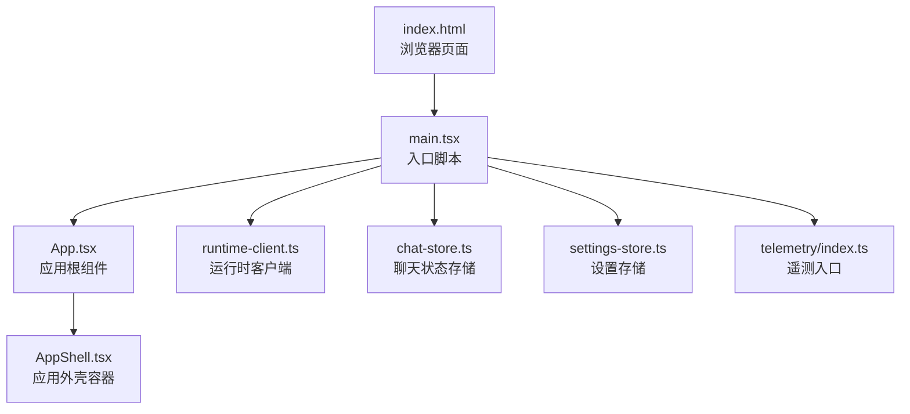
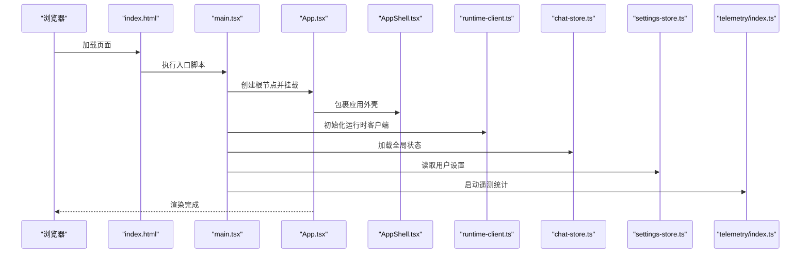
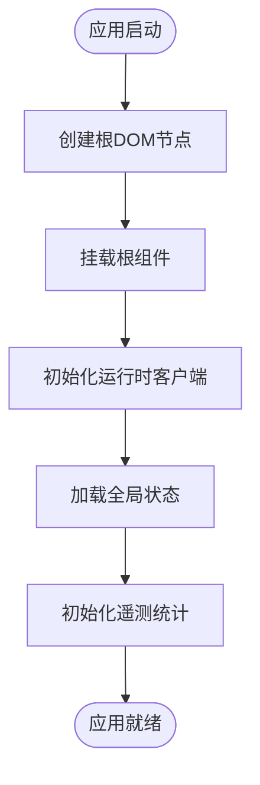
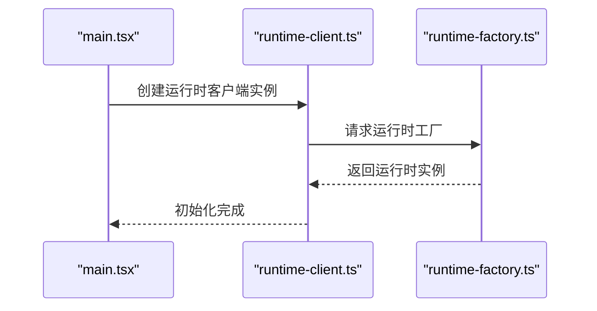
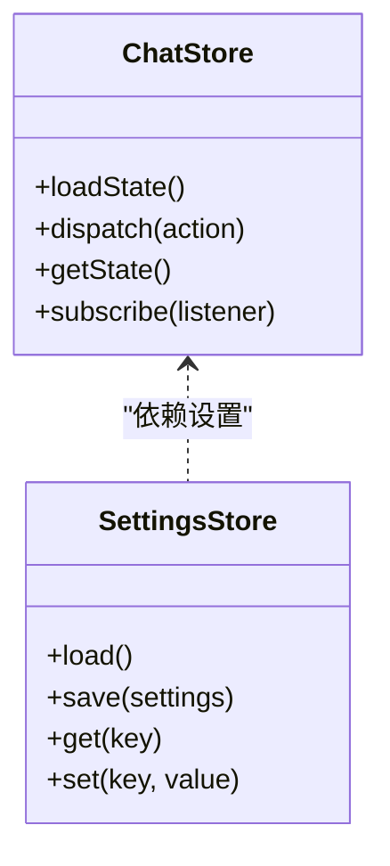
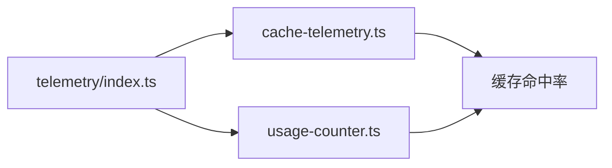
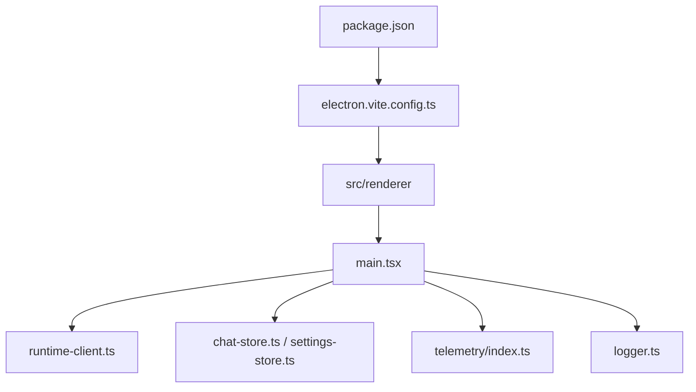

# 应用初始化流程

<cite>
**本文档引用的文件**
- [main.tsx](file://src/renderer/src/main.tsx)
- [App.tsx](file://src/renderer/src/App.tsx)
- [AppShell.tsx](file://src/renderer/src/AppShell.tsx)
- [index.html](file://src/renderer/index.html)
- [package.json](file://package.json)
- [electron.vite.config.ts](file://electron.vite.config.ts)
- [runtime-factory.ts](file://kun/src/server/runtime-factory.ts)
- [runtime-client.ts](file://src/renderer/src/agent/runtime-client.ts)
- [chat-store.ts](file://src/renderer/src/store/chat-store.ts)
- [settings-store.ts](file://src/main/settings-store.ts)
- [logger.ts](file://src/main/logger.ts)
- [telemetry/index.ts](file://kun/src/telemetry/index.ts)
- [cache-telemetry.ts](file://kun/src/telemetry/cache-telemetry.ts)
- [usage-counter.ts](file://kun/src/telemetry/usage-counter.ts)
</cite>

## 目录
1. [简介](#简介)
2. [项目结构](#项目结构)
3. [核心组件](#核心组件)
4. [架构总览](#架构总览)
5. [详细组件分析](#详细组件分析)
6. [依赖关系分析](#依赖关系分析)
7. [性能考虑](#性能考虑)
8. [故障排除指南](#故障排除指南)
9. [结论](#结论)

## 简介
本文件系统性阐述 React 渲染器应用的启动与初始化流程，覆盖应用入口点、根组件挂载、初始化配置、全局状态设置、生命周期管理、错误边界处理以及性能监控初始化。文档同时提供调试方法与常见问题解决方案，帮助开发者快速定位并解决启动阶段的问题。

## 项目结构
React 渲染器位于 `src/renderer` 目录，采用 Vite 配置进行构建与开发。Electron 主进程负责加载渲染器页面，渲染器通过入口脚本挂载根组件，并在启动时完成运行时客户端初始化、全局状态装载与遥测统计初始化等步骤。

图表来源
- [index.html](file://src/renderer/index.html)
- [main.tsx](file://src/renderer/src/main.tsx)
- [App.tsx](file://src/renderer/src/App.tsx)
- [AppShell.tsx](file://src/renderer/src/AppShell.tsx)
- [runtime-client.ts](file://src/renderer/src/agent/runtime-client.ts)
- [chat-store.ts](file://src/renderer/src/store/chat-store.ts)
- [settings-store.ts](file://src/main/settings-store.ts)
- [telemetry/index.ts](file://kun/src/telemetry/index.ts)

章节来源
- [index.html](file://src/renderer/index.html)
- [main.tsx](file://src/renderer/src/main.tsx)
- [package.json](file://package.json)
- [electron.vite.config.ts](file://electron.vite.config.ts)

## 核心组件
- 入口脚本：负责创建根 DOM 节点、挂载 React 根组件、初始化运行时客户端与全局状态。
- 根组件：定义应用顶层布局与路由，承载错误边界与主题等横切关注点。
- 应用外壳：封装导航、侧边栏、工作区等通用 UI 结构。
- 运行时客户端：连接主进程提供的运行时服务，负责会话、线程、工具调用等交互。
- 全局状态存储：集中管理聊天、计划、写作等功能域的状态。
- 设置存储：持久化用户偏好与应用配置。
- 遥测模块：采集缓存命中率、使用计数等指标，支持性能监控与诊断。

章节来源
- [main.tsx](file://src/renderer/src/main.tsx)
- [App.tsx](file://src/renderer/src/App.tsx)
- [AppShell.tsx](file://src/renderer/src/AppShell.tsx)
- [runtime-client.ts](file://src/renderer/src/agent/runtime-client.ts)
- [chat-store.ts](file://src/renderer/src/store/chat-store.ts)
- [settings-store.ts](file://src/main/settings-store.ts)
- [telemetry/index.ts](file://kun/src/telemetry/index.ts)

## 架构总览
渲染器启动链路从浏览器加载 HTML 页面开始，由入口脚本创建根节点并挂载根组件；随后初始化运行时客户端以建立与主进程的通信通道，加载全局状态并启动遥测统计。应用外壳负责组织 UI 层级，错误边界确保异常不中断整体体验。

图表来源
- [index.html](file://src/renderer/index.html)
- [main.tsx](file://src/renderer/src/main.tsx)
- [App.tsx](file://src/renderer/src/App.tsx)
- [AppShell.tsx](file://src/renderer/src/AppShell.tsx)
- [runtime-client.ts](file://src/renderer/src/agent/runtime-client.ts)
- [chat-store.ts](file://src/renderer/src/store/chat-store.ts)
- [settings-store.ts](file://src/main/settings-store.ts)
- [telemetry/index.ts](file://kun/src/telemetry/index.ts)

## 详细组件分析

### 入口脚本与根组件挂载
- 入口脚本负责：
  - 在 HTML 中创建或定位根 DOM 节点。
  - 使用 React DOM 将根组件挂载到该节点。
  - 初始化运行时客户端、全局状态与遥测模块。
- 根组件承担：
  - 定义应用顶层布局与路由。
  - 包装错误边界，捕获子树渲染异常。
  - 提供主题切换、国际化等横切能力。

图表来源
- [main.tsx](file://src/renderer/src/main.tsx)
- [App.tsx](file://src/renderer/src/App.tsx)

章节来源
- [main.tsx](file://src/renderer/src/main.tsx)
- [App.tsx](file://src/renderer/src/App.tsx)

### 运行时客户端初始化
- 运行时客户端负责：
  - 建立与主进程的 IPC 通道。
  - 注册运行时事件监听器。
  - 提供会话、线程、工具调用等 API 的前端封装。
- 初始化顺序建议：
  - 先挂载根组件，再初始化运行时客户端，避免 UI 依赖未就绪。
  - 在运行时客户端就绪后，再加载需要后端支持的全局状态。

图表来源
- [main.tsx](file://src/renderer/src/main.tsx)
- [runtime-client.ts](file://src/renderer/src/agent/runtime-client.ts)
- [runtime-factory.ts](file://kun/src/server/runtime-factory.ts)

章节来源
- [runtime-client.ts](file://src/renderer/src/agent/runtime-client.ts)
- [runtime-factory.ts](file://kun/src/server/runtime-factory.ts)

### 全局状态设置
- 聊天状态存储：
  - 负责会话、线程、消息时间线等状态管理。
  - 提供状态读写、调度与副作用处理。
- 设置存储：
  - 持久化用户偏好（如模型选择、编辑器设置）。
  - 支持热更新与跨会话恢复。

图表来源
- [chat-store.ts](file://src/renderer/src/store/chat-store.ts)
- [settings-store.ts](file://src/main/settings-store.ts)

章节来源
- [chat-store.ts](file://src/renderer/src/store/chat-store.ts)
- [settings-store.ts](file://src/main/settings-store.ts)

### 错误边界处理
- 根组件应包裹错误边界，确保单个组件的渲染异常不会导致整个应用崩溃。
- 建议在错误边界中：
  - 记录错误堆栈与上下文信息。
  - 提供重试按钮或回到安全状态的路径。
  - 触发遥测上报以便后续分析。

章节来源
- [App.tsx](file://src/renderer/src/App.tsx)

### 性能监控初始化
- 遥测入口负责：
  - 初始化缓存命中率统计与使用计数器。
  - 上报关键指标（如请求耗时、缓存命中、错误率）。
- 建议：
  - 在应用启动完成后延迟上报，避免首屏阻塞。
  - 对高频事件进行采样，降低开销。

图表来源
- [telemetry/index.ts](file://kun/src/telemetry/index.ts)
- [cache-telemetry.ts](file://kun/src/telemetry/cache-telemetry.ts)
- [usage-counter.ts](file://kun/src/telemetry/usage-counter.ts)

章节来源
- [telemetry/index.ts](file://kun/src/telemetry/index.ts)
- [cache-telemetry.ts](file://kun/src/telemetry/cache-telemetry.ts)
- [usage-counter.ts](file://kun/src/telemetry/usage-counter.ts)

## 依赖关系分析
- 构建与打包：
  - 使用 Vite 进行开发与生产构建，Electron 配置负责将渲染器资源注入主进程。
- 运行时依赖：
  - 渲染器通过运行时客户端访问主进程提供的运行时工厂与服务。
- 日志与诊断：
  - 主进程提供日志工具，辅助渲染器启动阶段的调试。

图表来源
- [package.json](file://package.json)
- [electron.vite.config.ts](file://electron.vite.config.ts)
- [main.tsx](file://src/renderer/src/main.tsx)
- [runtime-client.ts](file://src/renderer/src/agent/runtime-client.ts)
- [chat-store.ts](file://src/renderer/src/store/chat-store.ts)
- [settings-store.ts](file://src/main/settings-store.ts)
- [telemetry/index.ts](file://kun/src/telemetry/index.ts)
- [logger.ts](file://src/main/logger.ts)

章节来源
- [package.json](file://package.json)
- [electron.vite.config.ts](file://electron.vite.config.ts)

## 性能考虑
- 首屏优化：
  - 将非关键初始化逻辑延迟至首屏之后执行。
  - 使用代码分割与懒加载减少初始包体积。
- 遥测开销控制：
  - 对高频事件进行采样与批量上报。
  - 避免在渲染关键路径中直接进行昂贵操作。
- 状态初始化：
  - 分批加载全局状态，优先保证核心功能可用。
  - 对大体量数据采用分页或增量加载策略。

## 故障排除指南
- 启动白屏或空白页面
  - 检查入口脚本是否正确挂载根组件。
  - 确认 HTML 中根节点是否存在且 ID 正确。
- 运行时客户端初始化失败
  - 查看主进程日志，确认运行时工厂已正确启动。
  - 检查 IPC 通道是否被拦截或网络策略限制。
- 全局状态未生效
  - 确认状态加载顺序在运行时客户端之后。
  - 检查持久化存储是否可读写。
- 遥测不上报
  - 确认遥测入口已初始化且未被错误边界吞没。
  - 检查网络连通性与上报目标地址。
- 开发调试建议
  - 在入口脚本中添加关键步骤的日志输出。
  - 使用浏览器开发者工具的性能面板观察首屏耗时。
  - 利用主进程日志工具记录启动阶段的关键事件。

章节来源
- [main.tsx](file://src/renderer/src/main.tsx)
- [logger.ts](file://src/main/logger.ts)

## 结论
本文档梳理了 React 渲染器应用的启动与初始化流程，明确了入口脚本、根组件挂载、运行时客户端初始化、全局状态装载与遥测统计的关键步骤与依赖关系。通过遵循本文的初始化顺序与最佳实践，可以有效提升应用启动性能与稳定性，并为后续的调试与维护提供清晰的线索。