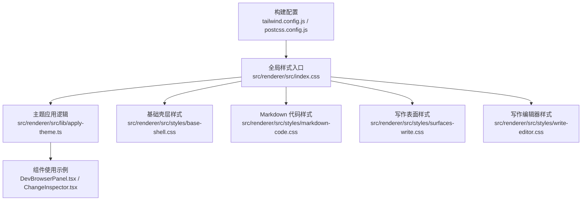
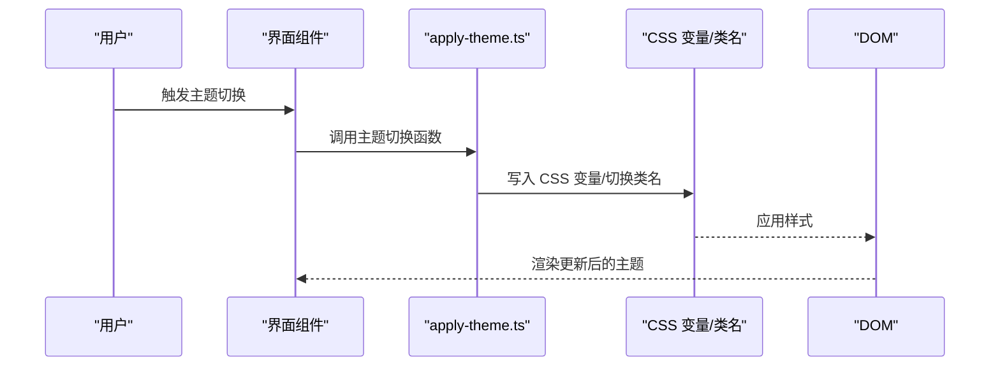
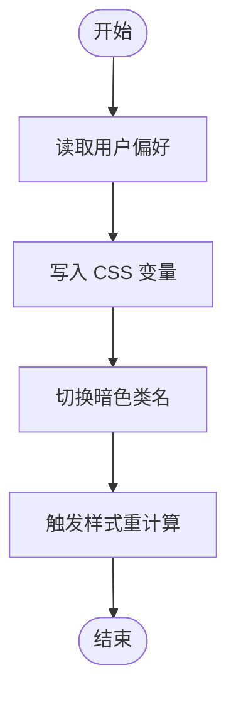
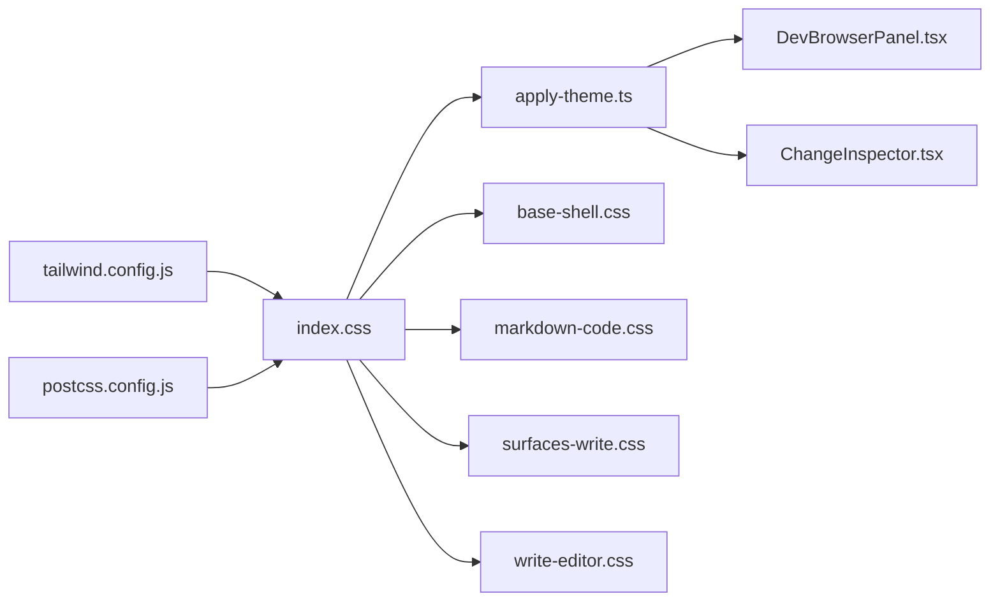

# 样式与主题系统

<cite>
**本文引用的文件**
- [tailwind.config.js](file://tailwind.config.js)
- [postcss.config.js](file://postcss.config.js)
- [src/renderer/src/index.css](file://src/renderer/src/index.css)
- [src/renderer/src/lib/apply-theme.ts](file://src/renderer/src/lib/apply-theme.ts)
- [src/renderer/src/styles/base-shell.css](file://src/renderer/src/styles/base-shell.css)
- [src/renderer/src/styles/markdown-code.css](file://src/renderer/src/styles/markdown-code.css)
- [src/renderer/src/styles/surfaces-write.css](file://src/renderer/src/styles/surfaces-write.css)
- [src/renderer/src/styles/write-editor.css](file://src/renderer/src/styles/write-editor.css)
- [DESIGN.md](file://DESIGN.md)
- [DESIGN.zh-CN.md](file://DESIGN.zh-CN.md)
- [src/renderer/src/components/DevBrowserPanel.tsx](file://src/renderer/src/components/DevBrowserPanel.tsx)
- [src/renderer/src/components/ChangeInspector.tsx](file://src/renderer/src/components/ChangeInspector.tsx)
</cite>

## 目录
1. [简介](#简介)
2. [项目结构](#项目结构)
3. [核心组件](#核心组件)
4. [架构总览](#架构总览)
5. [详细组件分析](#详细组件分析)
6. [依赖关系分析](#依赖关系分析)
7. [性能考量](#性能考量)
8. [故障排查指南](#故障排查指南)
9. [结论](#结论)
10. [附录](#附录)

## 简介
本文件深入解析 DeepSeek-GUI 的样式系统与主题定制实现机制，涵盖 TailwindCSS 配置、CSS 自定义属性（CSS 变量）管理、主题切换逻辑、样式组件化、响应式设计与暗色模式支持，并提供样式性能优化、浏览器兼容性处理以及调试技巧。文档以实际源码为依据，结合可视化图示帮助读者快速理解系统架构与实现细节。

## 项目结构
样式系统主要由以下部分组成：
- 构建与预处理：TailwindCSS 与 PostCSS 配置文件负责生成与优化 CSS。
- 全局样式入口：应用入口 CSS 文件统一引入基础样式与主题变量。
- 主题应用逻辑：运行时主题切换工具函数负责写入 CSS 变量与类名。
- 组件级样式：按功能域拆分的样式文件（如基础壳层、Markdown 代码高亮、写作编辑器等）。
- 设计规范：设计文档中定义了明/暗两套调色板与渐变资源，作为主题变量来源。

图表来源
- [tailwind.config.js](file://tailwind.config.js)
- [postcss.config.js](file://postcss.config.js)
- [src/renderer/src/index.css](file://src/renderer/src/index.css)
- [src/renderer/src/lib/apply-theme.ts](file://src/renderer/src/lib/apply-theme.ts)
- [src/renderer/src/styles/base-shell.css](file://src/renderer/src/styles/base-shell.css)
- [src/renderer/src/styles/markdown-code.css](file://src/renderer/src/styles/markdown-code.css)
- [src/renderer/src/styles/surfaces-write.css](file://src/renderer/src/styles/surfaces-write.css)
- [src/renderer/src/styles/write-editor.css](file://src/renderer/src/styles/write-editor.css)
- [src/renderer/src/components/DevBrowserPanel.tsx](file://src/renderer/src/components/DevBrowserPanel.tsx)
- [src/renderer/src/components/ChangeInspector.tsx](file://src/renderer/src/components/ChangeInspector.tsx)

章节来源
- [tailwind.config.js](file://tailwind.config.js)
- [postcss.config.js](file://postcss.config.js)
- [src/renderer/src/index.css](file://src/renderer/src/index.css)

## 核心组件
- TailwindCSS 配置：定义颜色空间、暗色模式前缀、内容扫描范围、插件与扩展点，确保生成的原子类与设计规范一致。
- PostCSS 配置：集成自动前缀、压缩与优化，保证跨浏览器兼容与体积控制。
- 全局样式入口：集中引入基础样式与主题变量，确保组件在加载时具备一致的视觉基线。
- 主题应用逻辑：通过运行时函数设置 CSS 变量与类名，驱动明/暗主题切换。
- 功能域样式：按模块拆分的样式文件，便于维护与复用。
- 设计规范：提供明/暗两套调色板与渐变资源，作为主题变量的权威来源。

章节来源
- [tailwind.config.js](file://tailwind.config.js)
- [postcss.config.js](file://postcss.config.js)
- [src/renderer/src/index.css](file://src/renderer/src/index.css)
- [src/renderer/src/lib/apply-theme.ts](file://src/renderer/src/lib/apply-theme.ts)
- [DESIGN.md](file://DESIGN.md)
- [DESIGN.zh-CN.md](file://DESIGN.zh-CN.md)

## 架构总览
样式系统采用“配置驱动 + 运行时主题切换”的架构：
- 构建期：Tailwind 生成原子类，PostCSS 优化输出。
- 运行期：主题切换函数写入 CSS 变量与类名，组件通过类名或 CSS 变量渲染不同主题。
- 组件层：各功能域样式文件与组件类名协同，形成可组合的样式体系。

图表来源
- [src/renderer/src/lib/apply-theme.ts](file://src/renderer/src/lib/apply-theme.ts)
- [src/renderer/src/index.css](file://src/renderer/src/index.css)

## 详细组件分析

### TailwindCSS 配置与扩展
- 颜色与暗色模式：配置文件定义了明/暗两套颜色空间，并启用暗色模式前缀，使组件可通过类名切换主题。
- 内容扫描：限定扫描范围，避免无关文件影响构建性能。
- 插件与扩展：通过插件扩展原子类能力，满足特定业务需求。

章节来源
- [tailwind.config.js](file://tailwind.config.js)

### PostCSS 配置与优化
- 自动前缀：确保新特性在旧版浏览器可用。
- 压缩与优化：减小产物体积，提升加载性能。
- 与 Tailwind 协同：在生成阶段完成样式优化，降低运行时负担。

章节来源
- [postcss.config.js](file://postcss.config.js)

### 全局样式入口与主题变量
- 入口文件集中引入基础样式与主题变量，确保组件在加载时具备一致的视觉基线。
- CSS 变量作为主题状态的单一事实来源，组件通过变量读取当前主题值。

章节来源
- [src/renderer/src/index.css](file://src/renderer/src/index.css)

### 主题应用逻辑（运行时）
- 主题切换函数负责：
  - 设置/读取用户偏好（本地存储）。
  - 写入 CSS 变量，驱动组件样式变化。
  - 切换 HTML 类名以启用暗色模式前缀。
- 该函数是主题系统的“控制器”，所有主题变更均通过它进行。

图表来源
- [src/renderer/src/lib/apply-theme.ts](file://src/renderer/src/lib/apply-theme.ts)

章节来源
- [src/renderer/src/lib/apply-theme.ts](file://src/renderer/src/lib/apply-theme.ts)

### 功能域样式文件
- 基础壳层样式：定义页面骨架、容器与基础布局样式。
- Markdown 代码样式：针对代码块与语法高亮的样式规则。
- 写作表面样式：写作场景下的卡片、面板与背景层样式。
- 写作编辑器样式：编辑器专用的输入、光标与交互样式。

章节来源
- [src/renderer/src/styles/base-shell.css](file://src/renderer/src/styles/base-shell.css)
- [src/renderer/src/styles/markdown-code.css](file://src/renderer/src/styles/markdown-code.css)
- [src/renderer/src/styles/surfaces-write.css](file://src/renderer/src/styles/surfaces-write.css)
- [src/renderer/src/styles/write-editor.css](file://src/renderer/src/styles/write-editor.css)

### 设计规范与主题变量来源
- 设计文档定义了明/暗两套调色板与渐变资源，作为主题变量的权威来源。
- 组件与样式文件通过类名或 CSS 变量引用这些规范，确保一致性。

章节来源
- [DESIGN.md](file://DESIGN.md)
- [DESIGN.zh-CN.md](file://DESIGN.zh-CN.md)

### 组件级主题使用示例
- 开发浏览器面板与变更检查器等组件通过类名直接使用明/暗主题样式，体现“类名驱动”的组件化风格。
- 示例组件展示了如何在现有主题体系下编写组件，无需重复定义变量。

章节来源
- [src/renderer/src/components/DevBrowserPanel.tsx](file://src/renderer/src/components/DevBrowserPanel.tsx)
- [src/renderer/src/components/ChangeInspector.tsx](file://src/renderer/src/components/ChangeInspector.tsx)

## 依赖关系分析
样式系统的关键依赖关系如下：
- 构建配置决定生成的原子类与优化策略。
- 全局入口集中引入基础样式与主题变量。
- 主题应用逻辑依赖全局入口中的 CSS 变量与类名约定。
- 组件通过类名与 CSS 变量消费主题状态。

图表来源
- [tailwind.config.js](file://tailwind.config.js)
- [postcss.config.js](file://postcss.config.js)
- [src/renderer/src/index.css](file://src/renderer/src/index.css)
- [src/renderer/src/lib/apply-theme.ts](file://src/renderer/src/lib/apply-theme.ts)
- [src/renderer/src/styles/base-shell.css](file://src/renderer/src/styles/base-shell.css)
- [src/renderer/src/styles/markdown-code.css](file://src/renderer/src/styles/markdown-code.css)
- [src/renderer/src/styles/surfaces-write.css](file://src/renderer/src/styles/surfaces-write.css)
- [src/renderer/src/styles/write-editor.css](file://src/renderer/src/styles/write-editor.css)
- [src/renderer/src/components/DevBrowserPanel.tsx](file://src/renderer/src/components/DevBrowserPanel.tsx)
- [src/renderer/src/components/ChangeInspector.tsx](file://src/renderer/src/components/ChangeInspector.tsx)

## 性能考量
- 构建期优化：通过 Tailwind 与 PostCSS 在构建阶段完成样式生成与压缩，减少运行时开销。
- CSS 变量优先：主题切换通过变量驱动，避免频繁重排与重绘。
- 按需引入：样式入口集中管理，避免重复引入导致的体积膨胀。
- 响应式与暗色模式：利用原子类与前缀，减少自定义样式的冗余。

## 故障排查指南
- 主题不生效
  - 检查主题切换函数是否正确写入 CSS 变量与类名。
  - 确认全局入口文件已引入基础样式与主题变量。
- 样式冲突
  - 使用组件类名隔离作用域，避免全局污染。
  - 检查 Tailwind 内容扫描范围，确保新增文件被纳入构建。
- 暗色模式异常
  - 核对设计规范中的明/暗色值，确认变量命名与引用一致。
  - 检查组件类名是否包含正确的暗色前缀。

章节来源
- [src/renderer/src/lib/apply-theme.ts](file://src/renderer/src/lib/apply-theme.ts)
- [src/renderer/src/index.css](file://src/renderer/src/index.css)
- [DESIGN.md](file://DESIGN.md)
- [DESIGN.zh-CN.md](file://DESIGN.zh-CN.md)

## 结论
本样式系统以 TailwindCSS 与 CSS 变量为核心，结合运行时主题切换函数，实现了清晰、可维护且高性能的主题定制机制。通过功能域样式文件与组件类名的协同，系统在保证一致性的同时提供了良好的扩展性。建议在后续迭代中持续关注构建性能与浏览器兼容性，确保主题系统在多环境下稳定运行。

## 附录
- 浏览器兼容性：通过 PostCSS 自动前缀与最小化策略，覆盖主流现代浏览器；对旧版浏览器建议降级策略。
- 调试技巧：使用浏览器开发者工具查看 CSS 变量与类名变化，定位主题切换问题；利用 Tailwind 的内容扫描日志排查样式未生成问题。