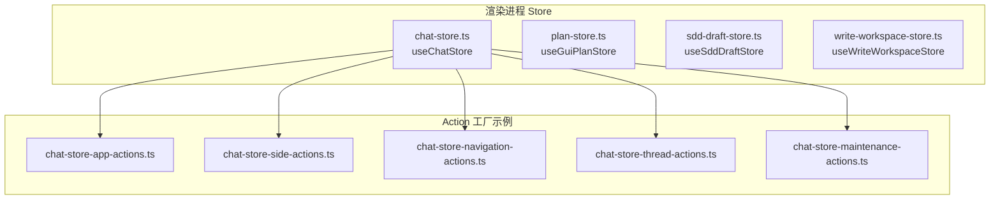
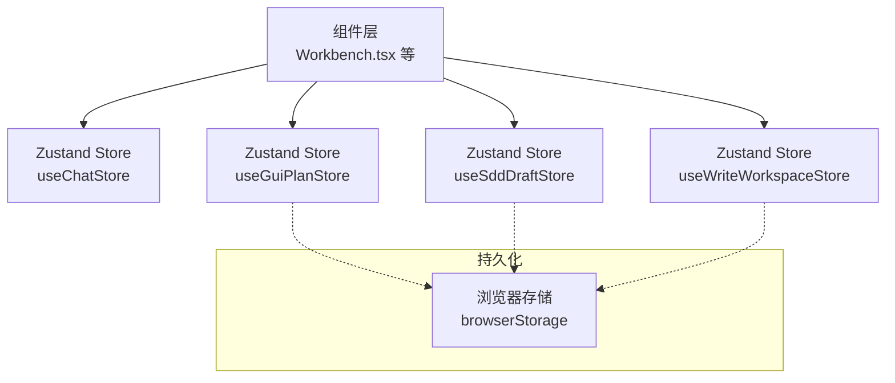
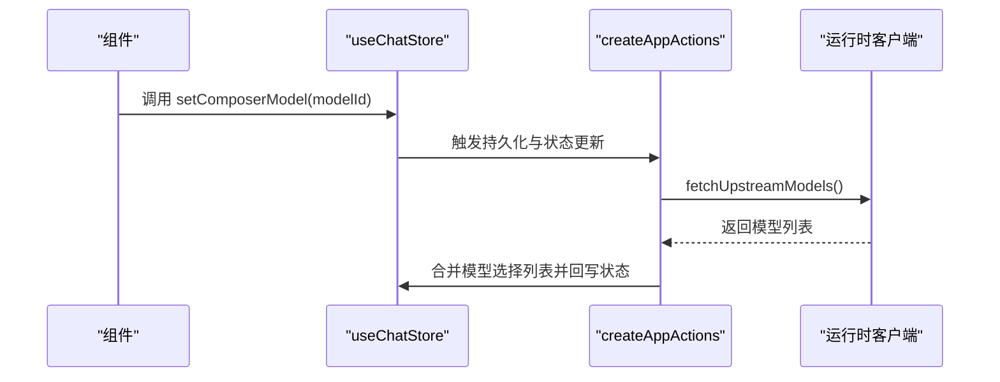
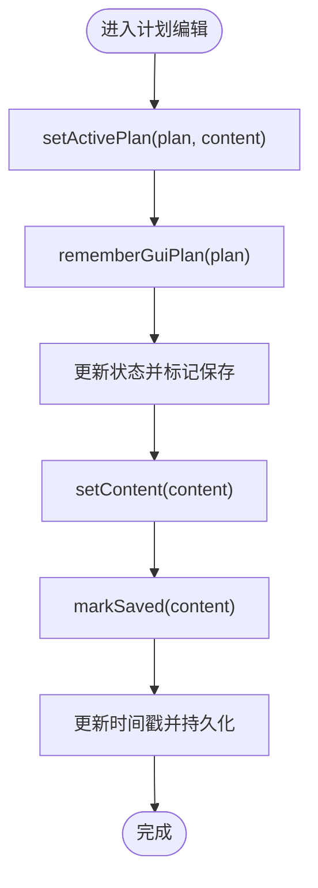
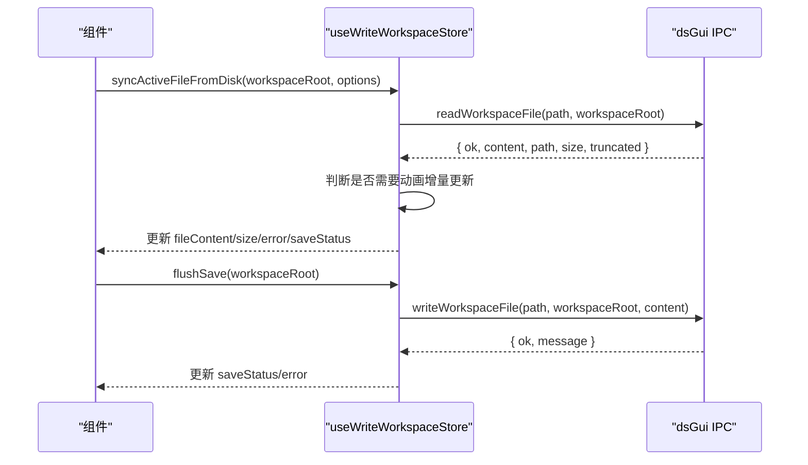
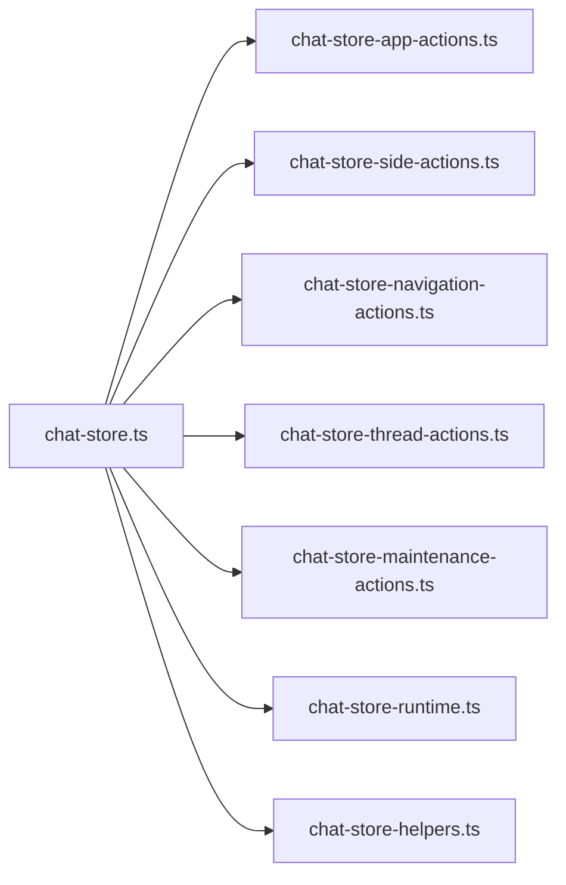

# 状态管理架构

<cite>
**本文引用的文件**
- [chat-store.ts](file://src/renderer/src/store/chat-store.ts)
- [chat-store-app-actions.ts](file://src/renderer/src/store/chat-store-app-actions.ts)
- [chat-store-side-actions.ts](file://src/renderer/src/store/chat-store-side-actions.ts)
- [chat-store-navigation-actions.ts](file://src/renderer/src/store/chat-store-navigation-actions.ts)
- [chat-store-thread-actions.ts](file://src/renderer/src/store/chat-store-thread-actions.ts)
- [chat-store-maintenance-actions.ts](file://src/renderer/src/store/chat-store-maintenance-actions.ts)
- [chat-store-runtime.ts](file://src/renderer/src/store/chat-store-runtime.ts)
- [chat-store-helpers.ts](file://src/renderer/src/store/chat-store-helpers.ts)
- [chat-store-types.ts](file://src/renderer/src/store/chat-store-types.ts)
- [plan-store.ts](file://src/renderer/src/plan/plan-store.ts)
- [sdd-draft-store.ts](file://src/renderer/src/sdd/sdd-draft-store.ts)
- [write-workspace-store.ts](file://src/renderer/src/write/write-workspace-store.ts)
- [use-timeline-stores.ts](file://src/renderer/src/components/chat/use-timeline-stores.ts)
- [Workbench.tsx](file://src/renderer/src/components/Workbench.tsx)
</cite>

## 目录
1. [引言](#引言)
2. [项目结构](#项目结构)
3. [核心组件](#核心组件)
4. [架构总览](#架构总览)
5. [详细组件分析](#详细组件分析)
6. [依赖关系分析](#依赖关系分析)
7. [性能考量](#性能考量)
8. [故障排查指南](#故障排查指南)
9. [结论](#结论)
10. [附录](#附录)

## 引言
本文件系统性梳理本仓库中基于 Zustand 的状态管理实现，覆盖 Store 设计原则、Action 组织方式、Selector 性能优化、状态持久化策略、异步状态处理、订阅机制、调试与迁移方案以及性能监控方法。文档以渐进方式呈现，既适合初学者理解整体架构，也便于资深开发者深入到具体实现细节。

## 项目结构
本项目在渲染进程内采用多 Store 架构，围绕“聊天”“计划”“SDD 草稿”“写入工作区”等业务域划分独立 Store，并通过统一的 useChatStore 汇聚应用级 Action 与运行时能力。Store 均通过 create 函数创建，结合模块化的 Action 工厂函数实现职责分离与可测试性。

图表来源
- [chat-store.ts:120-210](file://src/renderer/src/store/chat-store.ts#L120-L210)
- [plan-store.ts:249-328](file://src/renderer/src/plan/plan-store.ts#L249-L328)
- [sdd-draft-store.ts:156-211](file://src/renderer/src/sdd/sdd-draft-store.ts#L156-L211)
- [write-workspace-store.ts:52-350](file://src/renderer/src/write/write-workspace-store.ts#L52-L350)

章节来源
- [chat-store.ts:1-211](file://src/renderer/src/store/chat-store.ts#L1-L211)
- [plan-store.ts:1-329](file://src/renderer/src/plan/plan-store.ts#L1-L329)
- [sdd-draft-store.ts:1-212](file://src/renderer/src/sdd/sdd-draft-store.ts#L1-L212)
- [write-workspace-store.ts:1-351](file://src/renderer/src/write/write-workspace-store.ts#L1-L351)

## 核心组件
- 应用主 Store：useChatStore，集中定义应用状态、运行时调度器、主题与字体缩放、工作区路径归一化、模型选择列表合并与持久化、侧边对话、CLAW 渠道等。
- 计划 Store：useGuiPlanStore，负责 GUI 计划的激活、内容编辑、保存状态、预览模式与持久化注册表。
- SDD 草稿 Store：useSddDraftStore，负责 SDD 草稿的激活、内容同步、保存状态与持久化注册表。
- 写入工作区 Store：useWriteWorkspaceStore，负责写入工作区的文件内容同步、外部变更动画、保存流程、预览模式与助手开关的持久化。

章节来源
- [chat-store.ts:120-210](file://src/renderer/src/store/chat-store.ts#L120-L210)
- [plan-store.ts:249-328](file://src/renderer/src/plan/plan-store.ts#L249-L328)
- [sdd-draft-store.ts:156-211](file://src/renderer/src/sdd/sdd-draft-store.ts#L156-L211)
- [write-workspace-store.ts:52-350](file://src/renderer/src/write/write-workspace-store.ts#L52-L350)

## 架构总览
Zustand 在本项目中的使用遵循“单一事实源 + 分层 Action 工厂”的设计原则。每个 Store 仅关注自身领域状态；跨域协作通过 Action 工厂注入上下文（如 i18n、格式化错误、运行时客户端、工作区路径归一化等），并利用浏览器存储进行轻量持久化。

图表来源
- [Workbench.tsx:236-278](file://src/renderer/src/components/Workbench.tsx#L236-L278)
- [chat-store.ts:120-210](file://src/renderer/src/store/chat-store.ts#L120-L210)
- [plan-store.ts:249-328](file://src/renderer/src/plan/plan-store.ts#L249-L328)
- [sdd-draft-store.ts:156-211](file://src/renderer/src/sdd/sdd-draft-store.ts#L156-L211)
- [write-workspace-store.ts:52-350](file://src/renderer/src/write/write-workspace-store.ts#L52-L350)

## 详细组件分析

### 应用主 Store：useChatStore
- 设计原则
  - 单一事实源：将路由、设置返回路由、插件宿主路由、工作区根路径、运行时连接状态、线程集合、活动线程、块、实时推理与助手文本、队列消息、侧边对话、CLAW 渠道等聚合在一个 Store。
  - 分层 Action：通过 createAppActions、createSideActions、createNavigationActions、createThreadActions、createMaintenanceActions 注入上下文，避免 Store 内部耦合。
  - 运行时集成：注入运行时客户端、i18n、主题与字体缩放、工作区路径归一化、错误格式化等。
- Action 组织
  - 应用级：设置错误、模型选择、加载上游模型、主题与字体缩放、工作区标签与路径归一化等。
  - 侧边对话：输入、模型、推理强度设置、面板开关、中断、关闭与丢弃会话等。
  - 导航与线程：线程选择、创建、归档、删除、分叉、搜索、侧边会话联动等。
  - 维护：清理、轮询、看门狗等。
- Selector 优化
  - 使用 useShallow 从 useChatStore 中挑选所需字段，减少无关重渲染。
  - 将复杂计算与派生状态下沉至 Action 或工具函数，避免在渲染路径重复计算。
- 异步处理
  - 上游模型加载通过 Promise 缓存避免重复请求。
  - SSE 中断控制器通过 ref 共享，确保并发请求安全。
- 订阅机制
  - 侧边对话订阅在关闭或丢弃时主动解绑，防止内存泄漏。
- 持久化策略
  - Composer 模型选择持久化至本地存储，启动时恢复。
  - 工作区路径归一化与标签生成，保证跨平台一致性。

图表来源
- [chat-store.ts:120-210](file://src/renderer/src/store/chat-store.ts#L120-L210)
- [chat-store-app-actions.ts:34-75](file://src/renderer/src/store/chat-store-app-actions.ts#L34-L75)

章节来源
- [chat-store.ts:120-210](file://src/renderer/src/store/chat-store.ts#L120-L210)
- [chat-store-app-actions.ts:34-75](file://src/renderer/src/store/chat-store-app-actions.ts#L34-L75)
- [chat-store-side-actions.ts:422-500](file://src/renderer/src/store/chat-store-side-actions.ts#L422-L500)
- [Workbench.tsx:236-278](file://src/renderer/src/components/Workbench.tsx#L236-L278)

### 计划 Store：useGuiPlanStore
- 设计原则
  - 领域驱动：围绕 GUI 计划的激活、内容、保存状态、操作状态与预览模式建模。
  - 持久化注册表：通过浏览器存储维护按工作区与线程维度的活动计划映射。
- Action 组织
  - 设置活动计划、内容、保存状态、操作状态、预览模式、更新活动计划、清空活动计划。
- Selector 优化
  - 通过 useShallow 仅订阅必要字段，避免不必要的重渲染。
- 异步处理
  - 无显式异步副作用，主要为状态更新与持久化。
- 持久化策略
  - 使用浏览器存储键值对保存注册表与预览模式。

图表来源
- [plan-store.ts:249-328](file://src/renderer/src/plan/plan-store.ts#L249-L328)

章节来源
- [plan-store.ts:249-328](file://src/renderer/src/plan/plan-store.ts#L249-L328)

### SDD 草稿 Store：useSddDraftStore
- 设计原则
  - 轻量持久化：仅记录活动草稿与工作区映射，避免冗余数据。
- Action 组织
  - 设置活动草稿、内容、保存状态、操作状态、清空活动草稿。
- 异步处理
  - 无异步副作用，主要为状态更新与持久化。
- 持久化策略
  - 使用浏览器存储键值对保存草稿注册表。

章节来源
- [sdd-draft-store.ts:156-211](file://src/renderer/src/sdd/sdd-draft-store.ts#L156-L211)

### 写入工作区 Store：useWriteWorkspaceStore
- 设计原则
  - 外部同步与动画：支持从磁盘同步文件内容，带节流与动画增量更新，提升大文件体验。
  - 持久化设置：预览模式、助手开关、助手模型等通过浏览器存储持久化。
- Action 组织
  - 设置文件内容、从磁盘同步、从磁盘同步图片、保存文件、设置预览模式、设置助手开关与模型、引用选区、记录最近编辑、重置工作区等。
- 异步处理
  - 文件读写、图片读取均通过 IPC 调用，失败时设置错误状态并返回。
- Selector 优化
  - 通过 useShallow 选择性订阅，避免无关重渲染。
- 订阅机制
  - 外部同步动画通过定时器令牌控制，关闭时取消动画。

图表来源
- [write-workspace-store.ts:96-295](file://src/renderer/src/write/write-workspace-store.ts#L96-L295)

章节来源
- [write-workspace-store.ts:52-350](file://src/renderer/src/write/write-workspace-store.ts#L52-L350)

## 依赖关系分析
- Store 间解耦：各 Store 独立存在，通过 Action 工厂共享上下文，避免直接互相依赖。
- 上下文注入：Action 工厂接收 set/get/i18n/运行时客户端/路径归一化/错误格式化等，集中处理跨域逻辑。
- 持久化抽象：浏览器存储封装在各自 Store 的工具函数中，保持接口一致但实现隔离。

图表来源
- [chat-store.ts:120-210](file://src/renderer/src/store/chat-store.ts#L120-L210)
- [chat-store-app-actions.ts:34-75](file://src/renderer/src/store/chat-store-app-actions.ts#L34-L75)
- [chat-store-side-actions.ts:422-500](file://src/renderer/src/store/chat-store-side-actions.ts#L422-L500)
- [chat-store-runtime.ts:1-101](file://src/renderer/src/store/chat-store-runtime.ts#L1-L101)
- [chat-store-helpers.ts:1-53](file://src/renderer/src/store/chat-store-helpers.ts#L1-L53)

章节来源
- [chat-store.ts:120-210](file://src/renderer/src/store/chat-store.ts#L120-L210)

## 性能考量
- 选择器优化
  - 使用 useShallow 仅订阅必要字段，降低重渲染频率。
  - 将复杂派生状态与计算下沉至 Action 或工具函数，避免在渲染路径重复计算。
- 异步与并发
  - 上游模型加载通过 Promise 缓存，避免重复请求。
  - SSE 中断控制器通过 ref 共享，确保并发请求安全。
- 外部同步动画
  - 大文件从磁盘同步时采用动画增量更新，提升用户体验并控制更新频率。
- 存储与序列化
  - 计划与草稿注册表采用 JSON 序列化与校验，异常时回退为空注册表，保证健壮性。
- 主题与字体缩放
  - 通过集中应用函数批量更新，减少多次重排。

章节来源
- [Workbench.tsx:236-278](file://src/renderer/src/components/Workbench.tsx#L236-L278)
- [chat-store-app-actions.ts:61-75](file://src/renderer/src/store/chat-store-app-actions.ts#L61-L75)
- [write-workspace-store.ts:168-206](file://src/renderer/src/write/write-workspace-store.ts#L168-L206)
- [plan-store.ts:138-156](file://src/renderer/src/plan/plan-store.ts#L138-L156)
- [sdd-draft-store.ts:79-117](file://src/renderer/src/sdd/sdd-draft-store.ts#L79-L117)

## 故障排查指南
- 错误格式化与提示
  - 运行时错误通过统一格式化函数生成用户可读信息，并决定是否打开设置页。
- 保存失败处理
  - 写入工作区 Store 在保存失败时设置错误状态与保存状态，便于 UI 反馈。
- 外部同步失败
  - 从磁盘同步文件或图片失败时，设置错误信息并保持当前状态不变。
- 计划/草稿持久化异常
  - 注册表读取失败时回退为空注册表，避免影响其他功能。

章节来源
- [chat-store-runtime.ts:92-101](file://src/renderer/src/store/chat-store-runtime.ts#L92-L101)
- [write-workspace-store.ts:120-134](file://src/renderer/src/write/write-workspace-store.ts#L120-L134)
- [write-workspace-store.ts:250-256](file://src/renderer/src/write/write-workspace-store.ts#L250-L256)
- [plan-store.ts:140-146](file://src/renderer/src/plan/plan-store.ts#L140-L146)
- [sdd-draft-store.ts:82-86](file://src/renderer/src/sdd/sdd-draft-store.ts#L82-L86)

## 结论
本项目采用 Zustand 实现清晰、可维护且高性能的状态管理：通过单一事实源与分层 Action 工厂实现高内聚低耦合；通过浏览器存储与运行时客户端实现跨域协作与持久化；通过 useShallow、动画增量更新与 Promise 缓存等手段优化性能与用户体验。该架构易于扩展与演进，适合复杂前端应用的状态治理。

## 附录
- 状态调试建议
  - 使用 React DevTools 的组件树与 Hooks 面板观察订阅字段变化。
  - 在 Action 中打印关键状态快照，定位异步流程问题。
  - 对持久化 Store 添加最小化日志，记录读写键与异常。
- 状态迁移方案
  - 计划与草稿注册表版本号字段用于向后兼容，迁移时先读取旧结构再转换为新结构。
  - 迁移完成后清理旧键或保留兼容读取逻辑。
- 性能监控方法
  - 通过 useShallow 订阅字段数量与渲染次数评估优化效果。
  - 对外部同步动画与保存流程添加耗时统计，识别瓶颈。