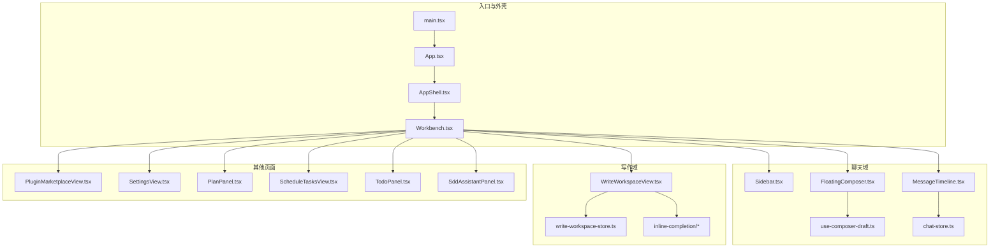
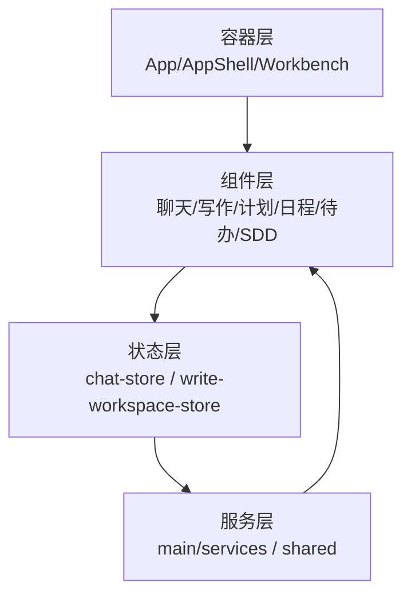
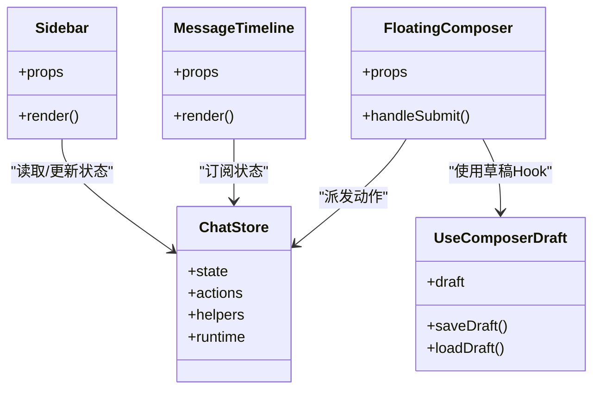
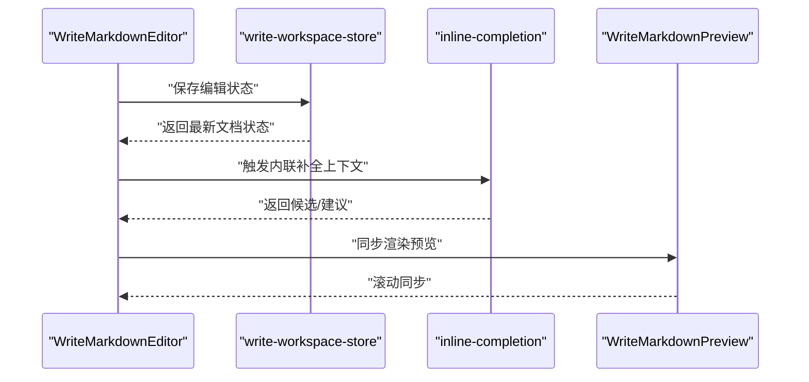
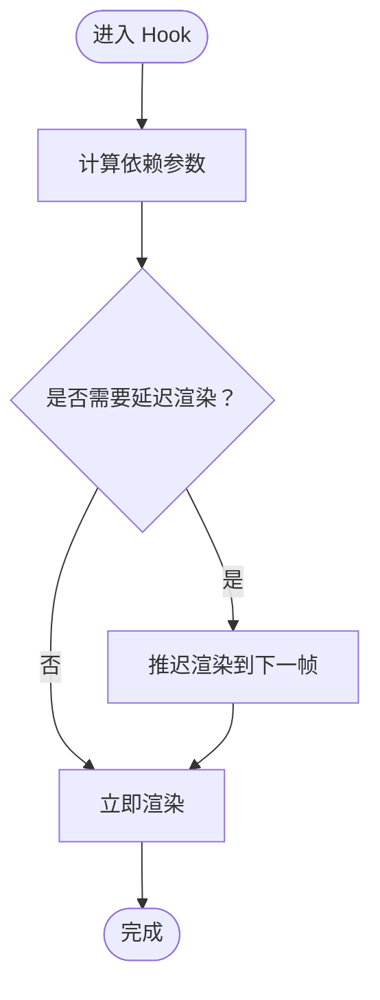
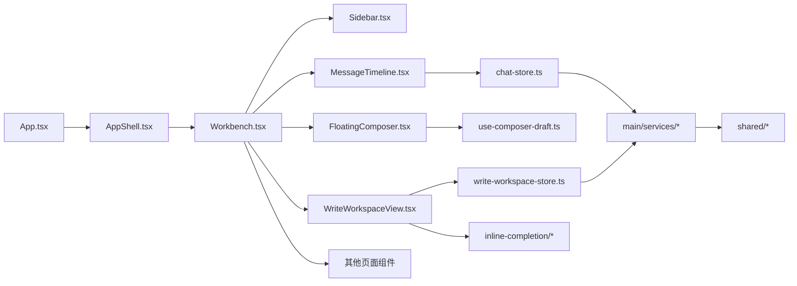

# 组件系统架构

<cite>
**本文档引用的文件**
- [App.tsx](file://src/renderer/src/App.tsx)
- [AppShell.tsx](file://src/renderer/src/AppShell.tsx)
- [main.tsx](file://src/renderer/src/main.tsx)
- [Workbench.tsx](file://src/renderer/src/components/Workbench.tsx)
- [ChatStarterGrid.tsx](file://src/renderer/src/components/chat/ChatStarterGrid.tsx)
- [MessageTimeline.tsx](file://src/renderer/src/components/chat/MessageTimeline.tsx)
- [FloatingComposer.tsx](file://src/renderer/src/components/chat/FloatingComposer.tsx)
- [Sidebar.tsx](file://src/renderer/src/components/chat/Sidebar.tsx)
- [WriteWorkspaceView.tsx](file://src/renderer/src/components/write/WriteWorkspaceView.tsx)
- [write-workspace-view-utils.ts](file://src/renderer/src/components/write/write-workspace-view-utils.ts)
- [use-composer-draft.ts](file://src/renderer/src/components/chat/use-composer-draft.ts)
- [use-timeline-stores.ts](file://src/renderer/src/components/chat/use-timeline-stores.ts)
- [chat-store.ts](file://src/renderer/src/store/chat-store.ts)
- [chat-store-types.ts](file://src/renderer/src/store/chat-store-types.ts)
- [chat-store-app-actions.ts](file://src/renderer/src/store/chat-store-app-actions.ts)
- [chat-store-thread-actions.ts](file://src/renderer/src/store/chat-store-thread-actions.ts)
- [chat-store-side-actions.ts](file://src/renderer/src/store/chat-store-side-actions.ts)
- [chat-store-runtime.test.ts](file://src/renderer/src/store/chat-store-runtime.test.ts)
- [chat-store-runtime.ts](file://src/renderer/src/store/chat-store-runtime.ts)
- [chat-store-runtime-helpers.test.ts](file://src/renderer/src/store/chat-store-runtime-helpers.test.ts)
- [chat-store-runtime-helpers.ts](file://src/renderer/src/store/chat-store-runtime-helpers.ts)
- [chat-store-navigation-actions.ts](file://src/renderer/src/store/chat-store-navigation-actions.ts)
- [chat-store-maintenance-actions.test.ts](file://src/renderer/src/store/chat-store-maintenance-actions.test.ts)
- [chat-store-maintenance-actions.ts](file://src/renderer/src/store/chat-store-maintenance-actions.ts)
- [chat-store-schedulers.ts](file://src/renderer/src/store/chat-store-schedulers.ts)
- [use-deferred-render.ts](file://src/renderer/src/hooks/use-deferred-render.ts)
- [use-daily-usage.ts](file://src/renderer/src/hooks/use-daily-usage.ts)
- [use-model-usage.ts](file://src/renderer/src/hooks/use-model-usage.ts)
- [use-thread-usage.ts](file://src/renderer/src/hooks/use-thread-usage.ts)
- [plugin-marketplace-runtime.ts](file://src/renderer/src/components/plugin-marketplace-runtime.ts)
- [plugin-marketplace-runtime.test.ts](file://src/renderer/src/components/plugin-marketplace-runtime.test.ts)
- [PluginMarketplaceView.tsx](file://src/renderer/src/components/PluginMarketplaceView.tsx)
- [PluginMarketplaceParts.tsx](file://src/renderer/src/components/PluginMarketplaceParts.tsx)
- [RuntimeBanner.tsx](file://src/renderer/src/components/RuntimeBanner.tsx)
- [SettingsView.tsx](file://src/renderer/src/components/SettingsView.tsx)
- [SettingsSidebar.tsx](file://src/renderer/src/components/SettingsSidebar.tsx)
- [DevBrowserPanel.tsx](file://src/renderer/src/components/DevBrowserPanel.tsx)
- [DevPreviewLaunchCard.tsx](file://src/renderer/src/components/DevPreviewLaunchCard.tsx)
- [DiffView.tsx](file://src/renderer/src/components/DiffView.tsx)
- [InitialSetupDialog.tsx](file://src/renderer/src/components/InitialSetupDialog.tsx)
- [WindowsTitleBar.tsx](file://src/renderer/src/components/WindowsTitleBar.tsx)
- [PlanPanel.tsx](file://src/renderer/src/components/plan/PlanPanel.tsx)
- [ScheduleTasksView.tsx](file://src/renderer/src/components/schedule/ScheduleTasksView.tsx)
- [TodoPanel.tsx](file://src/renderer/src/components/todo/TodoPanel.tsx)
- [SddAssistantPanel.tsx](file://src/renderer/src/components/sdd/SddAssistantPanel.tsx)
- [SddDraftEditorView.tsx](file://src/renderer/src/components/sdd/SddDraftEditorView.tsx)
- [WriteMarkdownEditor.tsx](file://src/renderer/src/components/write/WriteMarkdownEditor.tsx)
- [WriteMarkdownPreview.tsx](file://src/renderer/src/components/write/WriteMarkdownPreview.tsx)
- [WriteWorkspaceToolbar.tsx](file://src/renderer/src/components/write/WriteWorkspaceToolbar.tsx)
- [write-workspace-store.ts](file://src/renderer/src/write/write-workspace-store.ts)
- [write-workspace-store.test.ts](file://src/renderer/src/write/write-workspace-store.test.ts)
- [write-workspace-store-helpers.ts](file://src/renderer/src/write/write-workspace-store-helpers.ts)
- [write-workspace-store-types.ts](file://src/renderer/src/write/write-workspace-store-types.ts)
- [write-workspace-file-actions.test.ts](file://src/renderer/src/write/write-workspace-file-actions.test.ts)
- [write-workspace-file-actions.ts](file://src/renderer/src/write/write-workspace-file-actions.ts)
- [write-workspace-settings-actions.ts](file://src/renderer/src/write/write-workspace-settings-actions.ts)
- [write-render-safety.test.ts](file://src/renderer/src/write/write-render-safety.test.ts)
- [write-render-safety.ts](file://src/renderer/src/write/write-render-safety.ts)
- [write-thread-registry.test.ts](file://src/renderer/src/write/write-thread-registry.test.ts)
- [write-thread-registry.ts](file://src/renderer/src/write/write-thread-registry.ts)
- [markdown-live-preview.test.ts](file://src/renderer/src/write/markdown-live-preview.test.ts)
- [markdown-live-preview.ts](file://src/renderer/src/write/markdown-live-preview.ts)
- [inline-completion/index.ts](file://src/renderer/src/write/inline-completion/index.ts)
- [inline-completion/context.ts](file://src/renderer/src/write/inline-completion/context.ts)
- [inline-completion/policy.ts](file://src/renderer/src/write/inline-completion/policy.ts)
- [inline-completion/prompt.ts](file://src/renderer/src/write/inline-completion/prompt.ts)
- [inline-completion/types.ts](file://src/renderer/src/write/inline-completion/types.ts)
- [inline-completion/codemirror.ts](file://src/renderer/src/write/inline-completion/codemirror.ts)
- [inline-completion/feedback.ts](file://src/renderer/src/write/inline-completion/feedback.ts)
- [inline-edit.test.ts](file://src/renderer/src/write/inline-edit.test.ts)
- [inline-edit.ts](file://src/renderer/src/write/inline-edit.ts)
- [quoted-selection.test.ts](file://src/renderer/src/write/quoted-selection.test.ts)
- [quoted-selection.ts](file://src/renderer/src/write/quoted-selection.ts)
- [term-propagation.test.ts](file://src/renderer/src/write/term-propagation.test.ts)
- [term-propagation.ts](file://src/renderer/src/write/term-propagation.ts)
- [write-file-watch.test.ts](file://src/renderer/src/write/write-file-watch.test.ts)
- [write-file-watch.ts](file://src/renderer/src/write/write-file-watch.ts)
- [write-export-service.test.ts](file://src/renderer/src/main/services/write-export-service.test.ts)
- [write-export-service.ts](file://src/renderer/src/main/services/write-export-service.ts)
- [workspace-service.test.ts](file://src/renderer/src/main/services/workspace-service.test.ts)
- [workspace-service.ts](file://src/renderer/src/main/services/workspace-service.ts)
- [workspace-editors.ts](file://src/renderer/src/main/services/workspace-editors.ts)
- [workspace-files.ts](file://src/renderer/src/main/services/workspace-files.ts)
- [workspace-paths.ts](file://src/renderer/src/main/services/workspace-paths.ts)
- [write-inline-completion-service.test.ts](file://src/renderer/src/main/services/write-inline-completion-service.test.ts)
- [write-inline-completion-service.ts](file://src/renderer/src/main/services/write-inline-completion-service.ts)
- [write-inline-edit-service.test.ts](file://src/renderer/src/main/services/write-inline-edit-service.test.ts)
- [write-inline-edit-service.ts](file://src/renderer/src/main/services/write-inline-edit-service.ts)
- [write-retrieval-service.test.ts](file://src/renderer/src/main/services/write-retrieval-service.test.ts)
- [write-retrieval-service.ts](file://src/renderer/src/main/services/write-retrieval-service.ts)
- [write-export.ts](file://src/shared/write-export.ts)
- [write-inline-completion.ts](file://src/shared/write-inline-completion.ts)
- [write-inline-edit.ts](file://src/shared/write-inline-edit.ts)
- [write-markdown-resource.ts](file://src/shared/write-markdown-resource.ts)
- [write-text-file.ts](file://src/shared/write-text-file.ts)
- [ds-gui-api.ts](file://src/shared/ds-gui-api.ts)
- [gui-update.ts](file://src/shared/gui-update.ts)
- [gui-update-schedule.test.ts](file://src/shared/gui-update-schedule.test.ts)
- [gui-update-schedule.ts](file://src/shared/gui-update-schedule.ts)
- [app-settings.ts](file://src/shared/app-settings.ts)
- [app-settings.test.ts](file://src/shared/app-settings.test.ts)
- [app-settings-types.ts](file://src/shared/app-settings-types.ts)
- [app-settings-provider.ts](file://src/shared/app-settings-provider.ts)
- [app-settings-provider.test.ts](file://src/shared/app-settings-provider.test.ts)
- [app-settings-normalize.ts](file://src/shared/app-settings-normalize.ts)
- [app-settings-normalizers.ts](file://src/shared/app-settings-normalizers.ts)
- [app-settings-prompts.ts](file://src/shared/app-settings-prompts.ts)
- [app-settings-schedule.ts](file://src/shared/app-settings-schedule.ts)
- [app-settings-kun.ts](file://src/shared/app-settings-kun.ts)
- [app-settings-claw.ts](file://src/shared/app-settings-claw.ts)
- [app-settings-write.ts](file://src/shared/app-settings-write.ts)
- [claw-commands.ts](file://src/shared/claw-commands.ts)
- [runtime-error.ts](file://src/shared/runtime-error.ts)
- [sdd.ts](file://src/shared/sdd.ts)
- [sdd.test.ts](file://src/shared/sdd.test.ts)
- [workspace-file.ts](file://src/shared/workspace-file.ts)
- [editor.ts](file://src/shared/editor.ts)
- [git-branches.ts](file://src/shared/git-branches.ts)
- [default-composer-models.ts](file://src/shared/default-composer-models.ts)
- [dev-preview-url.ts](file://src/shared/dev-preview-url.ts)
- [openai-compat-url.ts](file://src/shared/openai-compat-url.ts)
- [kun-endpoints.ts](file://src/shared/kun-endpoints.ts)
- [gui-plan.ts](file://src/shared/gui-plan.ts)
- [gui-plan.test.ts](file://src/shared/gui-plan.test.ts)
- [i18n.ts](file://src/renderer/src/i18n.ts)
- [index.css](file://src/renderer/src/index.css)
- [vite-env.d.ts](file://src/renderer/src/vite-env.d.ts)
- [package.json](file://package.json)
- [tsconfig.json](file://tsconfig.json)
- [electron.vite.config.ts](file://electron.vite.config.ts)
- [vitest.config.ts](file://vitest.config.ts)
</cite>

## 目录
1. [引言](#引言)
2. [项目结构](#项目结构)
3. [核心组件](#核心组件)
4. [架构总览](#架构总览)
5. [详细组件分析](#详细组件分析)
6. [依赖关系分析](#依赖关系分析)
7. [性能考虑](#性能考虑)
8. [故障排除指南](#故障排除指南)
9. [结论](#结论)
10. [附录](#附录)

## 引言
本文件深入解析前端渲染器中的 React 组件系统架构与实现细节，涵盖组件分类（基础组件、业务组件、页面组件）、组件通信机制、组件复用策略；解释自定义 Hook 的设计模式、组件库的组织结构与组件 API 规范；并提供组件测试策略、性能优化技巧与可维护性设计原则。该系统以工作台（Workbench）为核心，围绕聊天、写作、计划、日程、待办、SDD 等功能域构建模块化组件体系，并通过集中式状态管理与共享服务层支撑跨域协作。

## 项目结构
渲染器采用“页面级容器 + 功能域组件 + 自定义 Hook + 集中式状态”的分层组织方式：
- 页面容器：App、AppShell、Workbench 等负责布局与路由
- 功能域组件：chat、write、plan、schedule、todo、sdd 等按业务域划分
- 自定义 Hook：use-deferred-render、use-daily-usage 等封装横切关注点
- 集中式状态：chat-store 及其 actions、helpers、runtime 模块
- 共享服务与类型：shared 目录下的 GUI API、设置、导出等工具

图表来源
- [main.tsx:1-50](file://src/renderer/src/main.tsx#L1-L50)
- [App.tsx:1-120](file://src/renderer/src/App.tsx#L1-L120)
- [AppShell.tsx:1-120](file://src/renderer/src/AppShell.tsx#L1-L120)
- [Workbench.tsx:1-120](file://src/renderer/src/components/Workbench.tsx#L1-L120)
- [Sidebar.tsx:1-120](file://src/renderer/src/components/chat/Sidebar.tsx#L1-L120)
- [MessageTimeline.tsx:1-120](file://src/renderer/src/components/chat/MessageTimeline.tsx#L1-L120)
- [FloatingComposer.tsx:1-120](file://src/renderer/src/components/chat/FloatingComposer.tsx#L1-L120)
- [use-composer-draft.ts:1-120](file://src/renderer/src/components/chat/use-composer-draft.ts#L1-L120)
- [chat-store.ts:1-120](file://src/renderer/src/store/chat-store.ts#L1-L120)
- [WriteWorkspaceView.tsx:1-120](file://src/renderer/src/components/write/WriteWorkspaceView.tsx#L1-L120)
- [write-workspace-store.ts:1-120](file://src/renderer/src/write/write-workspace-store.ts#L1-L120)
- [inline-completion/index.ts:1-120](file://src/renderer/src/write/inline-completion/index.ts#L1-L120)
- [PluginMarketplaceView.tsx:1-120](file://src/renderer/src/components/PluginMarketplaceView.tsx#L1-L120)
- [SettingsView.tsx:1-120](file://src/renderer/src/components/SettingsView.tsx#L1-L120)
- [PlanPanel.tsx:1-120](file://src/renderer/src/components/plan/PlanPanel.tsx#L1-L120)
- [ScheduleTasksView.tsx:1-120](file://src/renderer/src/components/schedule/ScheduleTasksView.tsx#L1-L120)
- [TodoPanel.tsx:1-120](file://src/renderer/src/components/todo/TodoPanel.tsx#L1-L120)
- [SddAssistantPanel.tsx:1-120](file://src/renderer/src/components/sdd/SddAssistantPanel.tsx#L1-L120)

章节来源
- [main.tsx:1-50](file://src/renderer/src/main.tsx#L1-L50)
- [App.tsx:1-120](file://src/renderer/src/App.tsx#L1-L120)
- [AppShell.tsx:1-120](file://src/renderer/src/AppShell.tsx#L1-L120)
- [Workbench.tsx:1-120](file://src/renderer/src/components/Workbench.tsx#L1-L120)

## 核心组件
- 页面容器
  - App：应用根组件，承载国际化、主题与全局样式
  - AppShell：应用外壳，负责路由与布局骨架
  - Workbench：工作台主容器，聚合各功能域组件
- 聊天域
  - Sidebar：侧边栏，管理会话与线程导航
  - MessageTimeline：消息时间线，渲染对话内容与工具调用
  - FloatingComposer：浮动输入组件，支持模型选择与草稿管理
- 写作域
  - WriteWorkspaceView：写作工作区视图，集成编辑器、预览、工具栏
  - write-workspace-store：写作域状态管理
  - inline-completion：内联补全上下文、策略、提示词与反馈
- 其他页面
  - PluginMarketplaceView、SettingsView、PlanPanel、ScheduleTasksView、TodoPanel、SddAssistantPanel 等

章节来源
- [App.tsx:1-120](file://src/renderer/src/App.tsx#L1-L120)
- [AppShell.tsx:1-120](file://src/renderer/src/AppShell.tsx#L1-L120)
- [Workbench.tsx:1-120](file://src/renderer/src/components/Workbench.tsx#L1-L120)
- [Sidebar.tsx:1-120](file://src/renderer/src/components/chat/Sidebar.tsx#L1-L120)
- [MessageTimeline.tsx:1-120](file://src/renderer/src/components/chat/MessageTimeline.tsx#L1-L120)
- [FloatingComposer.tsx:1-120](file://src/renderer/src/components/chat/FloatingComposer.tsx#L1-L120)
- [WriteWorkspaceView.tsx:1-120](file://src/renderer/src/components/write/WriteWorkspaceView.tsx#L1-L120)
- [write-workspace-store.ts:1-120](file://src/renderer/src/write/write-workspace-store.ts#L1-L120)
- [inline-completion/index.ts:1-120](file://src/renderer/src/write/inline-completion/index.ts#L1-L120)

## 架构总览
系统采用“容器-组件-状态-服务”四层架构：
- 容器层：App/AppShell/Workbench 提供布局与路由
- 组件层：按功能域拆分的 UI 组件，职责单一、可组合
- 状态层：chat-store 与 write-workspace-store 管理复杂业务状态，提供 actions、helpers、runtime 辅助
- 服务层：main/services 与 shared 提供运行时服务与共享类型

图表来源
- [App.tsx:1-120](file://src/renderer/src/App.tsx#L1-L120)
- [AppShell.tsx:1-120](file://src/renderer/src/AppShell.tsx#L1-L120)
- [Workbench.tsx:1-120](file://src/renderer/src/components/Workbench.tsx#L1-L120)
- [chat-store.ts:1-120](file://src/renderer/src/store/chat-store.ts#L1-L120)
- [write-workspace-store.ts:1-120](file://src/renderer/src/write/write-workspace-store.ts#L1-L120)

## 详细组件分析

### 聊天域组件分析
聊天域由侧边栏、消息时间线与浮动输入组成，通过状态管理与自定义 Hook 实现高效交互与数据一致性。

图表来源
- [Sidebar.tsx:1-120](file://src/renderer/src/components/chat/Sidebar.tsx#L1-L120)
- [MessageTimeline.tsx:1-120](file://src/renderer/src/components/chat/MessageTimeline.tsx#L1-L120)
- [FloatingComposer.tsx:1-120](file://src/renderer/src/components/chat/FloatingComposer.tsx#L1-L120)
- [chat-store.ts:1-120](file://src/renderer/src/store/chat-store.ts#L1-L120)
- [use-composer-draft.ts:1-120](file://src/renderer/src/components/chat/use-composer-draft.ts#L1-L120)

组件通信机制
- 父子通信：Sidebar 通过 props 向 MessageTimeline 传递当前会话/线程上下文
- 状态驱动：FloatingComposer 通过 chat-store actions 更新消息列表与草稿
- 订阅更新：MessageTimeline 基于 chat-store 订阅状态变化进行重渲染

组件复用策略
- 将草稿逻辑抽取为 use-composer-draft，供多个输入场景复用
- 将时间线渲染抽象为通用组件，通过 props 控制显示模式

章节来源
- [Sidebar.tsx:1-120](file://src/renderer/src/components/chat/Sidebar.tsx#L1-L120)
- [MessageTimeline.tsx:1-120](file://src/renderer/src/components/chat/MessageTimeline.tsx#L1-L120)
- [FloatingComposer.tsx:1-120](file://src/renderer/src/components/chat/FloatingComposer.tsx#L1-L120)
- [use-composer-draft.ts:1-120](file://src/renderer/src/components/chat/use-composer-draft.ts#L1-L120)
- [chat-store.ts:1-120](file://src/renderer/src/store/chat-store.ts#L1-L120)

### 写作域组件分析
写作域以 WriteWorkspaceView 为中心，结合 write-workspace-store 与 inline-completion 子系统，提供编辑、预览与内联能力。

图表来源
- [WriteMarkdownEditor.tsx:1-120](file://src/renderer/src/components/write/WriteMarkdownEditor.tsx#L1-L120)
- [write-workspace-store.ts:1-120](file://src/renderer/src/write/write-workspace-store.ts#L1-L120)
- [inline-completion/context.ts:1-120](file://src/renderer/src/write/inline-completion/context.ts#L1-L120)
- [inline-completion/policy.ts:1-120](file://src/renderer/src/write/inline-completion/policy.ts#L1-L120)
- [WriteMarkdownPreview.tsx:1-120](file://src/renderer/src/components/write/WriteMarkdownPreview.tsx#L1-L120)

组件通信机制
- 编辑器与预览通过 store 同步文档状态，保证一致性
- 内联补全通过上下文与策略模块生成建议，编辑器接收反馈并更新 UI

组件复用策略
- 将内联补全的上下文、策略、提示词与反馈解耦为独立模块，便于扩展与测试
- 将编辑器与预览的滚动同步逻辑抽取为独立 Hook 或工具函数

章节来源
- [WriteWorkspaceView.tsx:1-120](file://src/renderer/src/components/write/WriteWorkspaceView.tsx#L1-L120)
- [write-workspace-store.ts:1-120](file://src/renderer/src/write/write-workspace-store.ts#L1-L120)
- [WriteMarkdownEditor.tsx:1-120](file://src/renderer/src/components/write/WriteMarkdownEditor.tsx#L1-L120)
- [WriteMarkdownPreview.tsx:1-120](file://src/renderer/src/components/write/WriteMarkdownPreview.tsx#L1-L120)
- [inline-completion/index.ts:1-120](file://src/renderer/src/write/inline-completion/index.ts#L1-L120)

### 自定义 Hook 设计模式
- use-deferred-render：延迟渲染以提升首屏性能
- use-daily-usage/use-model-usage/use-thread-usage：封装资源使用统计的查询与缓存逻辑

图表来源
- [use-deferred-render.ts:1-120](file://src/renderer/src/hooks/use-deferred-render.ts#L1-L120)
- [use-daily-usage.ts:1-120](file://src/renderer/src/hooks/use-daily-usage.ts#L1-L120)
- [use-model-usage.ts:1-120](file://src/renderer/src/hooks/use-model-usage.ts#L1-L120)
- [use-thread-usage.ts:1-120](file://src/renderer/src/hooks/use-thread-usage.ts#L1-L120)

章节来源
- [use-deferred-render.ts:1-120](file://src/renderer/src/hooks/use-deferred-render.ts#L1-L120)
- [use-daily-usage.ts:1-120](file://src/renderer/src/hooks/use-daily-usage.ts#L1-L120)
- [use-model-usage.ts:1-120](file://src/renderer/src/hooks/use-model-usage.ts#L1-L120)
- [use-thread-usage.ts:1-120](file://src/renderer/src/hooks/use-thread-usage.ts#L1-L120)

### 组件库组织结构与 API 规范
- 组件分类
  - 基础组件：如标题、按钮、输入框等（在各功能域中作为基础元素）
  - 业务组件：按功能域划分的复合组件，如 ChatStarterGrid、PlanPanel、ScheduleTasksView 等
  - 页面组件：Workbench、SettingsView、PluginMarketplaceView 等
- API 规范
  - Props 明确、可选参数使用默认值
  - 事件回调统一以 onXxx 命名，返回值遵循约定
  - 状态变更通过集中式 actions 或 store 方法执行，避免直接修改状态

章节来源
- [ChatStarterGrid.tsx:1-120](file://src/renderer/src/components/chat/ChatStarterGrid.tsx#L1-L120)
- [PlanPanel.tsx:1-120](file://src/renderer/src/components/plan/PlanPanel.tsx#L1-L120)
- [ScheduleTasksView.tsx:1-120](file://src/renderer/src/components/schedule/ScheduleTasksView.tsx#L1-L120)
- [SettingsView.tsx:1-120](file://src/renderer/src/components/SettingsView.tsx#L1-L120)
- [PluginMarketplaceView.tsx:1-120](file://src/renderer/src/components/PluginMarketplaceView.tsx#L1-L120)

## 依赖关系分析
组件间依赖呈现“容器-域组件-状态-服务”的层次化关系，状态与服务通过明确的接口进行解耦。

图表来源
- [App.tsx:1-120](file://src/renderer/src/App.tsx#L1-L120)
- [AppShell.tsx:1-120](file://src/renderer/src/AppShell.tsx#L1-L120)
- [Workbench.tsx:1-120](file://src/renderer/src/components/Workbench.tsx#L1-L120)
- [Sidebar.tsx:1-120](file://src/renderer/src/components/chat/Sidebar.tsx#L1-L120)
- [MessageTimeline.tsx:1-120](file://src/renderer/src/components/chat/MessageTimeline.tsx#L1-L120)
- [FloatingComposer.tsx:1-120](file://src/renderer/src/components/chat/FloatingComposer.tsx#L1-L120)
- [chat-store.ts:1-120](file://src/renderer/src/store/chat-store.ts#L1-L120)
- [use-composer-draft.ts:1-120](file://src/renderer/src/components/chat/use-composer-draft.ts#L1-L120)
- [WriteWorkspaceView.tsx:1-120](file://src/renderer/src/components/write/WriteWorkspaceView.tsx#L1-L120)
- [write-workspace-store.ts:1-120](file://src/renderer/src/write/write-workspace-store.ts#L1-L120)
- [inline-completion/index.ts:1-120](file://src/renderer/src/write/inline-completion/index.ts#L1-L120)

章节来源
- [chat-store.ts:1-120](file://src/renderer/src/store/chat-store.ts#L1-L120)
- [write-workspace-store.ts:1-120](file://src/renderer/src/write/write-workspace-store.ts#L1-L120)
- [write-workspace-store.test.ts:1-120](file://src/renderer/src/write/write-workspace-store.test.ts#L1-L120)

## 性能考虑
- 延迟渲染：使用 use-deferred-render 在非关键路径上推迟渲染，降低主线程压力
- 状态订阅：仅订阅必要字段，避免不必要的重渲染
- 内联补全：通过策略与上下文控制建议数量与触发频率，减少计算开销
- 文件监听与渲染安全：write-file-watch 与 write-render-safety 在大文件场景下保障稳定性
- 测试覆盖：通过单元测试与集成测试验证性能回归与边界条件

章节来源
- [use-deferred-render.ts:1-120](file://src/renderer/src/hooks/use-deferred-render.ts#L1-L120)
- [write-file-watch.ts:1-120](file://src/renderer/src/write/write-file-watch.ts#L1-L120)
- [write-render-safety.ts:1-120](file://src/renderer/src/write/write-render-safety.ts#L1-L120)
- [write-workspace-store.test.ts:1-120](file://src/renderer/src/write/write-workspace-store.test.ts#L1-L120)

## 故障排除指南
- 状态不一致：检查 chat-store/actions 是否正确派发与合并；确认 runtime helpers 的副作用处理
- 写作视图异常：核对 write-workspace-store 的文件操作动作与写入安全策略
- 插件市场不可用：检查 plugin-marketplace-runtime 的初始化与网络请求
- 设置页面无响应：确认 SettingsView 的状态绑定与副作用 Hook 的清理逻辑

章节来源
- [chat-store-runtime.ts:1-120](file://src/renderer/src/store/chat-store-runtime.ts#L1-L120)
- [chat-store-runtime-helpers.ts:1-120](file://src/renderer/src/store/chat-store-runtime-helpers.ts#L1-L120)
- [plugin-marketplace-runtime.ts:1-120](file://src/renderer/src/components/plugin-marketplace-runtime.ts#L1-L120)
- [SettingsView.tsx:1-120](file://src/renderer/src/components/SettingsView.tsx#L1-L120)

## 结论
该组件系统通过清晰的分层与模块化设计，实现了高内聚、低耦合的前端架构。容器-组件-状态-服务的协同模式确保了复杂业务场景下的可维护性与可扩展性。自定义 Hook 与集中式状态管理进一步提升了代码复用与性能表现。建议持续完善测试覆盖与性能监控，以保障长期演进质量。

## 附录
- 组件测试策略
  - 单元测试：针对 Hook 与纯函数进行快照与行为测试
  - 集成测试：验证组件间通信与状态流
  - 端到端测试：覆盖关键用户流程（如聊天发送、写作保存）
- 组件 API 规范
  - Props 类型明确，必填项与可选项清晰标注
  - 事件回调命名规范，返回值保持幂等
  - 状态变更通过 actions 或 store 方法执行，避免直接修改内部状态
- 可维护性设计原则
  - 单一职责：每个组件只负责一个明确的功能
  - 可组合性：通过 props 与 children 实现灵活组合
  - 可测试性：暴露必要的接口与钩子，便于测试注入

章节来源
- [chat-store.ts:1-120](file://src/renderer/src/store/chat-store.ts#L1-L120)
- [chat-store-types.ts:1-120](file://src/renderer/src/store/chat-store-types.ts#L1-L120)
- [chat-store-app-actions.ts:1-120](file://src/renderer/src/store/chat-store-app-actions.ts#L1-L120)
- [chat-store-thread-actions.ts:1-120](file://src/renderer/src/store/chat-store-thread-actions.ts#L1-L120)
- [chat-store-side-actions.ts:1-120](file://src/renderer/src/store/chat-store-side-actions.ts#L1-L120)
- [chat-store-navigation-actions.ts:1-120](file://src/renderer/src/store/chat-store-navigation-actions.ts#L1-L120)
- [chat-store-maintenance-actions.ts:1-120](file://src/renderer/src/store/chat-store-maintenance-actions.ts#L1-L120)
- [chat-store-schedulers.ts:1-120](file://src/renderer/src/store/chat-store-schedulers.ts#L1-L120)