# 共享库和工具

<cite>
**本文引用的文件**
- [app-settings.ts](file://src/shared/app-settings.ts)
- [app-settings-types.ts](file://src/shared/app-settings-types.ts)
- [app-settings-normalize.ts](file://src/shared/app-settings-normalize.ts)
- [app-settings-normalizers.ts](file://src/shared/app-settings-normalizers.ts)
- [app-settings-provider.ts](file://src/shared/app-settings-provider.ts)
- [app-settings-schedule.ts](file://src/shared/app-settings-schedule.ts)
- [app-settings-write.ts](file://src/shared/app-settings-write.ts)
- [gui-plan.ts](file://src/shared/gui-plan.ts)
- [write-export.ts](file://src/shared/write-export.ts)
- [write-inline-completion.ts](file://src/shared/write-inline-completion.ts)
- [write-inline-edit.ts](file://src/shared/write-inline-edit.ts)
- [write-text-file.ts](file://src/shared/write-text-file.ts)
- [gui-update.ts](file://src/shared/gui-update.ts)
- [gui-update-schedule.ts](file://src/shared/gui-update-schedule.ts)
- [ds-gui-api.ts](file://src/shared/ds-gui-api.ts)
- [runtime-error.ts](file://src/shared/runtime-error.ts)
- [workspace-file.ts](file://src/shared/workspace-file.ts)
- [editor.ts](file://src/shared/editor.ts)
- [openai-compat-url.ts](file://src/shared/openai-compat-url.ts)
- [kun-endpoints.ts](file://src/shared/kun-endpoints.ts)
- [default-composer-models.ts](file://src/shared/default-composer-models.ts)
- [claw-commands.ts](file://src/shared/claw-commands.ts)
- [sdd.ts](file://src/shared/sdd.ts)
- [dev-preview-url.ts](file://src/shared/dev-preview-url.ts)
- [write-markdown-resource.ts](file://src/shared/write-markdown-resource.ts)
- [settings-store.ts](file://src/main/settings-store.ts)
- [schedule-runtime.ts](file://src/main/schedule-runtime.ts)
- [write-export-service.ts](file://src/main/services/write-export-service.ts)
- [write-inline-completion-service.ts](file://src/main/services/write-inline-completion-service.ts)
- [write-retrieval-service.ts](file://src/main/services/write-retrieval-service.ts)
- [workspace-service.ts](file://src/main/services/workspace-service.ts)
- [workspace-files.ts](file://src/main/services/workspace-files.ts)
- [workspace-paths.ts](file://src/main/services/workspace-paths.ts)
- [workspace-editors.ts](file://src/main/services/workspace-editors.ts)
- [git-service.ts](file://src/main/services/git-service.ts)
- [plan-command.ts](file://src/renderer/src/plan/plan-command.ts)
- [plan-store.ts](file://src/renderer/src/plan/plan-store.ts)
- [plan-tool.ts](file://src/renderer/src/plan/plan-tool.ts)
- [workbench-plan-controller.ts](file://src/renderer/src/components/workbench-plan-controller.ts)
- [chat-store.ts](file://src/renderer/src/store/chat-store.ts)
- [chat-store-types.ts](file://src/renderer/src/store/chat-store-types.ts)
- [write-workspace-store.ts](file://src/renderer/src/write/write-workspace-store.ts)
- [write-workspace-settings-actions.ts](file://src/renderer/src/write/write-workspace-settings-actions.ts)
- [write-workspace-file-actions.ts](file://src/renderer/src/write/write-workspace-file-actions.ts)
- [write-thread-registry.ts](file://src/renderer/src/write/write-thread-registry.ts)
- [write-file-watch.ts](file://src/renderer/src/write/write-file-watch.ts)
- [write-markdown-editor.ts](file://src/renderer/src/write/WriteMarkdownEditor.tsx)
- [write-markdown-preview.ts](file://src/renderer/src/write/WriteMarkdownPreview.tsx)
- [write-workspace-view.ts](file://src/renderer/src/write/WriteWorkspaceView.tsx)
- [write-workspace-toolbar.ts](file://src/renderer/src/write/WriteWorkspaceToolbar.tsx)
- [write-workspace-document-pane.ts](file://src/renderer/src/write/WriteWorkspaceDocumentPane.tsx)
- [write-workspace-start.ts](file://src/renderer/src/write/WriteWorkspaceStart.tsx)
- [write-workspace-empty-state.ts](file://src/renderer/src/write/WriteWorkspaceEmptyState.tsx)
- [write-assistant-panel.ts](file://src/renderer/src/write/WriteAssistantPanel.tsx)
- [write-sidebar.ts](file://src/renderer/src/write/WriteSidebar.tsx)
- [write-image-preview.ts](file://src/renderer/src/write/WriteImagePreview.tsx)
- [write-inline-agent.ts](file://src/renderer/src/write/WriteInlineAgent.tsx)
- [write-inline-completion-policy.ts](file://src/renderer/src/write/inline-completion/policy.ts)
- [write-inline-completion-context.ts](file://src/renderer/src/write/inline-completion/context.ts)
- [write-inline-completion-feedback.ts](file://src/renderer/src/write/inline-completion/feedback.ts)
- [write-inline-completion-types.ts](file://src/renderer/src/write/inline-completion/types.ts)
- [write-inline-completion-prompt.ts](file://src/renderer/src/write/inline-completion/prompt.ts)
- [write-inline-completion-codemirror.ts](file://src/renderer/src/write/inline-completion/codemirror.ts)
- [write-inline-completion-constants.ts](file://src/renderer/src/write/inline-completion/constants.ts)
- [write-inline-completion-index.ts](file://src/renderer/src/write/inline-completion/index.ts)
- [schedule-tasks-view.ts](file://src/renderer/src/components/schedule/ScheduleTasksView.tsx)
- [schedule-defaults-dialog.ts](file://src/renderer/src/components/schedule/ScheduleDefaultsDialog.tsx)
- [plan-panel.ts](file://src/renderer/src/components/plan/PlanPanel.tsx)
- [todo-panel.ts](file://src/renderer/src/components/todo/TodoPanel.tsx)
- [settings-view.ts](file://src/renderer/src/components/SettingsView.tsx)
- [settings-sidebar.ts](file://src/renderer/src/components/SettingsSidebar.tsx)
- [settings-sections.tsx](file://src/renderer/src/components/settings-sections.tsx)
- [settings-section-general.tsx](file://src/renderer/src/components/settings-section-general.tsx)
- [settings-section-write.tsx](file://src/renderer/src/components/settings-section-write.tsx)
- [settings-section-claw.tsx](file://src/renderer/src/components/settings-section-claw.tsx)
- [settings-section-agents.tsx](file://src/renderer/src/components/settings-section-agents.tsx)
- [settings-utils.ts](file://src/renderer/src/components/settings-utils.ts)
- [use-settings-gui-update.ts](file://src/renderer/src/components/use-settings-gui-update.ts)
- [settings-controls.tsx](file://src/renderer/src/components/settings-controls.tsx)
- [settings-debug-log.tsx](file://src/renderer/src/components/settings-debug-log.tsx)
- [settings-gui-update.tsx](file://src/renderer/src/components/settings-gui-update.tsx)
- [format-workspace-picker-error.ts](file://src/renderer/src/lib/format-workspace-picker-error.ts)
- [load-kun-diagnostics.ts](file://src/renderer/src/lib/load-kun-diagnostics.ts)
- [open-workspace-path.ts](file://src/renderer/src/lib/open-workspace-path.ts)
- [thread-fork-registry.ts](file://src/renderer/src/lib/thread-fork-registry.ts)
- [thread-title.ts](file://src/renderer/src/lib/thread-title.ts)
- [workspace-label.ts](file://src/renderer/src/lib/workspace-label.ts)
- [workspace-path.ts](file://src/renderer/src/lib/workspace-path.ts)
- [workspace-file-preview.ts](file://src/renderer/src/lib/workspace-file-preview.ts)
- [browser-storage.ts](file://src/renderer/src/lib/browser-storage.ts)
- [code-highlighting.ts](file://src/renderer/src/lib/code-highlighting.ts)
- [diff-stats.ts](file://src/renderer/src/lib/diff-stats.ts)
- [editor-preferences.ts](file://src/renderer/src/lib/editor-preferences.ts)
- [file-reference-validation.ts](file://src/renderer/src/lib/file-reference-validation.ts)
- [file-references.ts](file://src/renderer/src/lib/file-references.ts)
- [format-relative-time.ts](file://src/renderer/src/lib/format-relative-time.ts)
- [format-runtime-error.ts](file://src/renderer/src/lib/format-runtime-error.ts)
- [attachment-upload-availability.ts](file://src/renderer/src/lib/attachment-upload-availability.ts)
- [image-attachment-upload.ts](file://src/renderer/src/lib/image-attachment-upload.ts)
- [dev-preview-detection.ts](file://src/renderer/src/lib/dev-preview-detection.ts)
- [apply-theme.ts](file://src/renderer/src/lib/apply-theme.ts)
- [plugin-marketplace-runtime.ts](file://src/renderer/src/lib/plugin-marketplace-runtime.ts)
- [plugin-marketplace-view.ts](file://src/renderer/src/components/PluginMarketplaceView.tsx)
- [plugin-marketplace-parts.ts](file://src/renderer/src/components/PluginMarketplaceParts.tsx)
- [runtime-banner.ts](file://src/renderer/src/components/RuntimeBanner.tsx)
- [session-header.ts](file://src/renderer/src/components/SessionHeader.tsx)
- [windows-title-bar.ts](file://src/renderer/src/components/WindowsTitleBar.tsx)
- [workbench.ts](file://src/renderer/src/components/Workbench.tsx)
- [message-timeline.tsx](file://src/renderer/src/components/chat/MessageTimeline.tsx)
- [derive-turn-sections.ts](file://src/renderer/src/components/chat/derive-turn-sections.ts)
- [floating-composer.ts](file://src/renderer/src/components/chat/FloatingComposer.tsx)
- [floating-composer-model-picker.ts](file://src/renderer/src/components/chat/FloatingComposerModelPicker.tsx)
- [floating-composer-queued-messages.ts](file://src/renderer/src/components/chat/FloatingComposerQueuedMessages.tsx)
- [git-branch-picker.ts](file://src/renderer/src/components/chat/GitBranchPicker.tsx)
- [initial-session-usage-heatmap.ts](file://src/renderer/src/components/chat/InitialSessionUsageHeatmap.tsx)
- [animated-work-logo.ts](file://src/renderer/src/components/chat/AnimatedWorkLogo.tsx)
- [assistant-markdown.ts](file://src/renderer/src/components/chat/AssistantMarkdown.tsx)
- [side-conversation-panel.ts](file://src/renderer/src/components/chat/SideConversationPanel.tsx)
- [sidebar.ts](file://src/renderer/src/components/chat/Sidebar.tsx)
- [sidebar-claw.ts](file://src/renderer/src/components/chat/SidebarClaw.tsx)
- [sidebar-claw-dialog.ts](file://src/renderer/src/components/chat/SidebarClawDialog.tsx)
- [sidebar-claw-dialog-helpers.ts](file://src/renderer/src/components/chat/SidebarClawDialogHelpers.ts)
- [sidebar-claw-dialog-sections.ts](file://src/renderer/src/components/chat/SidebarClawDialogSections.tsx)
- [sidebar-claw-dialog-step-content.ts](file://src/renderer/src/components/chat/SidebarClawDialogStepContent.tsx)
- [sidebar-projects-section.ts](file://src/renderer/src/components/chat/SidebarProjectsSection.tsx)
- [streamdown-assistant.ts](file://src/renderer/src/components/chat/StreamdownAssistant.tsx)
- [streamdown-code.ts](file://src/renderer/src/components/chat/StreamdownCode.tsx)
- [whale-hero-stage.ts](file://src/renderer/src/components/chat/WhaleHeroStage.tsx)
- [workspace-mode-tabs.ts](file://src/renderer/src/components/chat/WorkspaceModeTabs.tsx)
- [use-composer-draft.ts](file://src/renderer/src/components/chat/use-composer-draft.ts)
- [use-timeline-scroll.ts](file://src/renderer/src/components/chat/use-timeline-scroll.ts)
- [use-timeline-stores.ts](file://src/renderer/src/components/chat/use-timeline-stores.ts)
</cite>

## 目录
1. [引言](#引言)
2. [项目结构](#项目结构)
3. [核心组件](#核心组件)
4. [架构总览](#架构总览)
5. [详细组件分析](#详细组件分析)
6. [依赖关系分析](#依赖关系分析)
7. [性能考虑](#性能考虑)
8. [故障排除指南](#故障排除指南)
9. [结论](#结论)
10. [附录](#附录)

## 引言
本文件聚焦于共享库与工具模块，系统化梳理并解析以下方面：
- 共享配置：应用设置的标准化、归一化与提供机制
- 工具函数：跨模块通用性与可复用性的设计
- 类型定义：类型安全与最佳实践
- 功能模块：应用设置管理、GUI 计划、写入导出等
- 跨模块数据共享：状态、配置与运行时服务的协同
- API 设计：统一接口、错误处理与扩展点

目标是帮助开发者快速理解共享层如何支撑主程序与渲染器的功能实现，并在保持类型安全与配置一致性的前提下，最大化工具函数的复用价值。

## 项目结构
共享库主要位于 src/shared 目录，涵盖应用设置、GUI 计划、写入导出、编辑器与资源、更新调度、错误格式化、工作区文件与编辑器偏好等通用能力。同时，主进程与渲染器通过服务层与存储层进行协作，形成“共享层 + 服务层 + 存储层”的分层架构。

```mermaid
graph TB
subgraph "共享层(src/shared)"
AS["应用设置<br/>app-settings.ts 等"]
GP["GUI 计划<br/>gui-plan.ts"]
WE["写入导出<br/>write-export.ts"]
WIC["内联补全<br/>write-inline-completion.ts"]
WIE["内联编辑<br/>write-inline-edit.ts"]
WTF["文本文件操作<br/>write-text-file.ts"]
GUIU["GUI 更新<br/>gui-update.ts"]
GUIS["更新调度<br/>gui-update-schedule.ts"]
DSG["GUI API<br/>ds-gui-api.ts"]
RTE["运行时错误<br/>runtime-error.ts"]
WF["工作区文件<br/>workspace-file.ts"]
ED["编辑器工具<br/>editor.ts"]
OCU["OpenAI 兼容 URL<br/>openai-compat-url.ts"]
KEP["Kun 端点<br/>kun-endpoints.ts"]
DCM["默认合成模型<br/>default-composer-models.ts"]
CLC["Claw 命令<br/>claw-commands.ts"]
SDD["SDD 工具<br/>sdd.ts"]
DPV["开发预览 URL<br/>dev-preview-url.ts"]
WMR["Markdown 资源<br/>write-markdown-resource.ts"]
end
subgraph "主进程(src/main)"
SS["设置存储<br/>settings-store.ts"]
SR["计划运行时<br/>schedule-runtime.ts"]
WES["写入导出服务<br/>write-export-service.ts"]
WICS["内联补全服务<br/>write-inline-completion-service.ts"]
WRS["检索服务<br/>write-retrieval-service.ts"]
WS["工作区服务<br/>workspace-service.ts"]
WFS["文件服务<br/>workspace-files.ts"]
WPS["路径服务<br/>workspace-paths.ts"]
WES2["编辑器服务<br/>workspace-editors.ts"]
GS["Git 服务<br/>git-service.ts"]
end
subgraph "渲染器(src/renderer)"
subgraph "计划"
PC["计划命令<br/>plan-command.ts"]
PS["计划存储<br/>plan-store.ts"]
PT["计划工具<br/>plan-tool.ts"]
WPC["工作台计划控制器<br/>workbench-plan-controller.ts"]
end
subgraph "聊天/会话"
CS["聊天存储<br/>chat-store.ts"]
CST["聊天类型<br/>chat-store-types.ts"]
end
subgraph "写入"
WWS["写入工作区存储<br/>write-workspace-store.ts"]
WWSA["写入设置动作<br/>write-workspace-settings-actions.ts"]
WWSFA["写入文件动作<br/>write-workspace-file-actions.ts"]
WTR["写入线程注册表<br/>write-thread-registry.ts"]
WFW["写入文件监听<br/>write-file-watch.ts"]
WME["编辑器<br/>WriteMarkdownEditor.tsx"]
WMP["预览<br/>WriteMarkdownPreview.tsx"]
WV["视图<br/>WriteWorkspaceView.tsx"]
WVT["工具栏<br/>WriteWorkspaceToolbar.tsx"]
WVP["文档面板<br/>WriteWorkspaceDocumentPane.tsx"]
WVS["开始页<br/>WriteWorkspaceStart.tsx"]
WVE["空状态<br/>WriteWorkspaceEmptyState.tsx"]
WAP["助手面板<br/>WriteAssistantPanel.tsx"]
WSB["侧边栏<br/>WriteSidebar.tsx"]
WIP["图片预览<br/>WriteImagePreview.tsx"]
WIA["内联代理<br/>WriteInlineAgent.tsx"]
subgraph "内联补全子模块"
WICP["策略<br/>policy.ts"]
WICC["上下文<br/>context.ts"]
WICF["反馈<br/>feedback.ts"]
WICT["类型<br/>types.ts"]
WICPR["提示<br/>prompt.ts"]
WICCM["CodeMirror 集成<br/>codemirror.ts"]
WICCNS["常量<br/>constants.ts"]
WICI["入口<br/>index.ts"]
end
end
subgraph "设置与界面"
SV["设置视图<br/>SettingsView.tsx"]
SSID["侧边栏<br/>SettingsSidebar.tsx"]
SSEC["设置章节<br/>settings-sections.tsx"]
SSG["通用设置<br/>settings-section-general.tsx"]
SSW["写入设置<br/>settings-section-write.tsx"]
SSC["Claw 设置<br/>settings-section-claw.tsx"]
SSA["智能体设置<br/>settings-section-agents.tsx"]
SU["设置工具<br/>settings-utils.ts"]
USGU["设置 GUI 更新<br/>use-settings-gui-update.ts"]
SC["设置控件<br/>settings-controls.tsx"]
SDL["调试日志<br/>settings-debug-log.tsx"]
SGU["GUI 更新设置<br/>settings-gui-update.tsx"]
end
subgraph "通用库"
FWE["工作区选择错误格式化<br/>format-workspace-picker-error.ts"]
LKD["加载诊断<br/>load-kun-diagnostics.ts"]
OW["打开工作区路径<br/>open-workspace-path.ts"]
TFR["线程派生注册表<br/>thread-fork-registry.ts"]
TT["线程标题<br/>thread-title.ts"]
WL["工作区标签<br/>workspace-label.ts"]
WP["工作区路径<br/>workspace-path.ts"]
WFP["文件预览<br/>workspace-file-preview.ts"]
BS["浏览器存储<br/>browser-storage.ts"]
CH["代码高亮<br/>code-highlighting.ts"]
DS["差异统计<br/>diff-stats.ts"]
EP["编辑器偏好<br/>editor-preferences.ts"]
FRV["文件引用验证<br/>file-reference-validation.ts"]
FR["文件引用<br/>file-references.ts"]
FRT["相对时间格式化<br/>format-relative-time.ts"]
FRE["运行时错误格式化<br/>format-runtime-error.ts"]
AUA["附件上传可用性<br/>attachment-upload-availability.ts"]
IAU["图片附件上传<br/>image-attachment-upload.ts"]
DPD["开发预览检测<br/>dev-preview-detection.ts"]
AT["主题应用<br/>apply-theme.ts"]
PMR["插件市场运行时<br/>plugin-marketplace-runtime.ts"]
PMV["插件市场视图<br/>PluginMarketplaceView.tsx"]
PMP["插件市场部件<br/>PluginMarketplaceParts.tsx"]
RBU["运行时横幅<br/>RuntimeBanner.tsx"]
SH["会话头部<br/>SessionHeader.tsx"]
WTB["Windows 标题栏<br/>WindowsTitleBar.tsx"]
WB["工作台<br/>Workbench.tsx"]
MT["消息时间线<br/>MessageTimeline.tsx"]
DTS["派生转段<br/>derive-turn-sections.ts"]
FC["浮动 Composer<br/>FloatingComposer.tsx"]
FCM["模型选择器<br/>FloatingComposerModelPicker.tsx"]
FCQ["排队消息<br/>FloatingComposerQueuedMessages.tsx"]
GBP["Git 分支选择器<br/>GitBranchPicker.tsx"]
ISUH["初始会话用量热力图<br/>InitialSessionUsageHeatmap.tsx"]
AWL["动画工牌<br/>AnimatedWorkLogo.tsx"]
AM["助手 Markdown<br/>AssistantMarkdown.tsx"]
SCP["侧边对话面板<br/>SideConversationPanel.tsx"]
SB["侧边栏<br/>Sidebar.tsx"]
SBC["Claw 侧边栏<br/>SidebarClaw.tsx"]
SBD["Claw 对话框<br/>SidebarClawDialog.tsx"]
SBH["Claw 对话框助手<br/>SidebarClawDialogHelpers.ts"]
SBDS["Claw 对话框分区<br/>SidebarClawDialogSections.tsx"]
SBDC["Claw 对话框步骤内容<br/>SidebarClawDialogStepContent.tsx"]
SBPS["项目分区<br/>SidebarProjectsSection.tsx"]
STA["流式助手<br/>StreamdownAssistant.tsx"]
STC["流式代码<br/>StreamdownCode.tsx"]
WHS["鲸鱼舞台<br/>WhaleHeroStage.tsx"]
WMT["工作区模式标签<br/>WorkspaceModeTabs.tsx"]
UCD["Composer 草稿<br/>use-composer-draft.ts"]
UTS["滚动同步<br/>use-timeline-scroll.ts"]
UTS2["时间线存储<br/>use-timeline-stores.ts"]
end
end
AS --> SS
GP --> SR
WE --> WES
WIC --> WICS
WIE --> WRS
WTF --> WS
GUIU --> GUIS
DSG --> WES
RTE --> FRE
WF --> WS
ED --> WME
OCU --> DSG
KEP --> DSG
DCM --> WME
CLC --> SR
SDD --> WES
DPV --> DSG
WMR --> WME
WES --> WS
WICS --> WTR
WRS --> WTR
WS --> WFS
WS --> WPS
WS --> WES2
GS --> WS
WPC --> PS
PS --> PC
PS --> PT
CS --> MT
CS --> DTS
CS --> FC
CS --> FCM
CS --> FCQ
CS --> GBP
CS --> ISUH
CS --> AWL
CS --> AM
CS --> SCP
CS --> SB
CS --> SBC
CS --> SBD
CS --> SBH
CS --> SBDS
CS --> SBDC
CS --> SBPS
CS --> STA
CS --> STC
CS --> WHS
CS --> WMT
CS --> UCD
CS --> UTS
CS --> UTS2
SV --> SSEC
SSEC --> SSG
SSEC --> SSW
SSEC --> SSC
SSEC --> SSA
SU --> WWS
USGU --> GUIS
SC --> WWSA
SC --> WWSFA
SC --> WTR
SC --> WFW
SC --> WME
SC --> WMP
SC --> WV
SC --> WVT
SC --> WVP
SC --> WVS
SC --> WVE
SC --> WAP
SC --> WSB
SC --> WIP
SC --> WIA
```

**图表来源**
- [app-settings.ts:1-200](file://src/shared/app-settings.ts#L1-L200)
- [settings-store.ts:1-200](file://src/main/settings-store.ts#L1-L200)
- [schedule-runtime.ts:1-200](file://src/main/schedule-runtime.ts#L1-L200)
- [write-export-service.ts:1-200](file://src/main/services/write-export-service.ts#L1-L200)
- [write-inline-completion-service.ts:1-200](file://src/main/services/write-inline-completion-service.ts#L1-L200)
- [write-retrieval-service.ts:1-200](file://src/main/services/write-retrieval-service.ts#L1-L200)
- [workspace-service.ts:1-200](file://src/main/services/workspace-service.ts#L1-L200)
- [workspace-files.ts:1-200](file://src/main/services/workspace-files.ts#L1-L200)
- [workspace-paths.ts:1-200](file://src/main/services/workspace-paths.ts#L1-L200)
- [workspace-editors.ts:1-200](file://src/main/services/workspace-editors.ts#L1-L200)
- [git-service.ts:1-200](file://src/main/services/git-service.ts#L1-L200)
- [gui-plan.ts:1-200](file://src/shared/gui-plan.ts#L1-L200)
- [write-export.ts:1-200](file://src/shared/write-export.ts#L1-L200)
- [write-inline-completion.ts:1-200](file://src/shared/write-inline-completion.ts#L1-L200)
- [write-inline-edit.ts:1-200](file://src/shared/write-inline-edit.ts#L1-L200)
- [write-text-file.ts:1-200](file://src/shared/write-text-file.ts#L1-L200)
- [gui-update.ts:1-200](file://src/shared/gui-update.ts#L1-L200)
- [gui-update-schedule.ts:1-200](file://src/shared/gui-update-schedule.ts#L1-L200)
- [ds-gui-api.ts:1-200](file://src/shared/ds-gui-api.ts#L1-L200)
- [runtime-error.ts:1-200](file://src/shared/runtime-error.ts#L1-L200)
- [workspace-file.ts:1-200](file://src/shared/workspace-file.ts#L1-L200)
- [editor.ts:1-200](file://src/shared/editor.ts#L1-L200)
- [openai-compat-url.ts:1-200](file://src/shared/openai-compat-url.ts#L1-L200)
- [kun-endpoints.ts:1-200](file://src/shared/kun-endpoints.ts#L1-L200)
- [default-composer-models.ts:1-200](file://src/shared/default-composer-models.ts#L1-L200)
- [claw-commands.ts:1-200](file://src/shared/claw-commands.ts#L1-L200)
- [sdd.ts:1-200](file://src/shared/sdd.ts#L1-L200)
- [dev-preview-url.ts:1-200](file://src/shared/dev-preview-url.ts#L1-L200)
- [write-markdown-resource.ts:1-200](file://src/shared/write-markdown-resource.ts#L1-L200)
- [plan-command.ts:1-200](file://src/renderer/src/plan/plan-command.ts#L1-L200)
- [plan-store.ts:1-200](file://src/renderer/src/plan/plan-store.ts#L1-L200)
- [plan-tool.ts:1-200](file://src/renderer/src/plan/plan-tool.ts#L1-L200)
- [workbench-plan-controller.ts:1-200](file://src/renderer/src/components/workbench-plan-controller.ts#L1-L200)
- [chat-store.ts:1-200](file://src/renderer/src/store/chat-store.ts#L1-L200)
- [chat-store-types.ts:1-200](file://src/renderer/src/store/chat-store-types.ts#L1-L200)
- [write-workspace-store.ts:1-200](file://src/renderer/src/write/write-workspace-store.ts#L1-L200)
- [write-workspace-settings-actions.ts:1-200](file://src/renderer/src/write/write-workspace-settings-actions.ts#L1-L200)
- [write-workspace-file-actions.ts:1-200](file://src/renderer/src/write/write-workspace-file-actions.ts#L1-L200)
- [write-thread-registry.ts:1-200](file://src/renderer/src/write/write-thread-registry.ts#L1-L200)
- [write-file-watch.ts:1-200](file://src/renderer/src/write/write-file-watch.ts#L1-L200)
- [write-markdown-editor.ts:1-200](file://src/renderer/src/write/WriteMarkdownEditor.tsx#L1-L200)
- [write-markdown-preview.ts:1-200](file://src/renderer/src/write/WriteMarkdownPreview.tsx#L1-L200)
- [write-workspace-view.ts:1-200](file://src/renderer/src/write/WriteWorkspaceView.tsx#L1-L200)
- [write-workspace-toolbar.ts:1-200](file://src/renderer/src/write/WriteWorkspaceToolbar.tsx#L1-L200)
- [write-workspace-document-pane.ts:1-200](file://src/renderer/src/write/WriteWorkspaceDocumentPane.tsx#L1-L200)
- [write-workspace-start.ts:1-200](file://src/renderer/src/write/WriteWorkspaceStart.tsx#L1-L200)
- [write-workspace-empty-state.ts:1-200](file://src/renderer/src/write/WriteWorkspaceEmptyState.tsx#L1-L200)
- [write-assistant-panel.ts:1-200](file://src/renderer/src/write/WriteAssistantPanel.tsx#L1-L200)
- [write-sidebar.ts:1-200](file://src/renderer/src/write/WriteSidebar.tsx#L1-L200)
- [write-image-preview.ts:1-200](file://src/renderer/src/write/WriteImagePreview.tsx#L1-L200)
- [write-inline-agent.ts:1-200](file://src/renderer/src/write/WriteInlineAgent.tsx#L1-L200)
- [write-inline-completion-policy.ts:1-200](file://src/renderer/src/write/inline-completion/policy.ts#L1-L200)
- [write-inline-completion-context.ts:1-200](file://src/renderer/src/write/inline-completion/context.ts#L1-L200)
- [write-inline-completion-feedback.ts:1-200](file://src/renderer/src/write/inline-completion/feedback.ts#L1-L200)
- [write-inline-completion-types.ts:1-200](file://src/renderer/src/write/inline-completion/types.ts#L1-L200)
- [write-inline-completion-prompt.ts:1-200](file://src/renderer/src/write/inline-completion/prompt.ts#L1-L200)
- [write-inline-completion-codemirror.ts:1-200](file://src/renderer/src/write/inline-completion/codemirror.ts#L1-L200)
- [write-inline-completion-constants.ts:1-200](file://src/renderer/src/write/inline-completion/constants.ts#L1-L200)
- [write-inline-completion-index.ts:1-200](file://src/renderer/src/write/inline-completion/index.ts#L1-L200)
- [schedule-tasks-view.ts:1-200](file://src/renderer/src/components/schedule/ScheduleTasksView.tsx#L1-L200)
- [schedule-defaults-dialog.ts:1-200](file://src/renderer/src/components/schedule/ScheduleDefaultsDialog.tsx#L1-L200)
- [plan-panel.ts:1-200](file://src/renderer/src/components/plan/PlanPanel.tsx#L1-L200)
- [todo-panel.ts:1-200](file://src/renderer/src/components/todo/TodoPanel.tsx#L1-L200)
- [settings-view.ts:1-200](file://src/renderer/src/components/SettingsView.tsx#L1-L200)
- [settings-sidebar.ts:1-200](file://src/renderer/src/components/SettingsSidebar.tsx#L1-L200)
- [settings-sections.tsx:1-200](file://src/renderer/src/components/settings-sections.tsx#L1-L200)
- [settings-section-general.tsx:1-200](file://src/renderer/src/components/settings-section-general.tsx#L1-L200)
- [settings-section-write.tsx:1-200](file://src/renderer/src/components/settings-section-write.tsx#L1-L200)
- [settings-section-claw.tsx:1-200](file://src/renderer/src/components/settings-section-claw.tsx#L1-L200)
- [settings-section-agents.tsx:1-200](file://src/renderer/src/components/settings-section-agents.tsx#L1-L200)
- [settings-utils.ts:1-200](file://src/renderer/src/components/settings-utils.ts#L1-L200)
- [use-settings-gui-update.ts:1-200](file://src/renderer/src/components/use-settings-gui-update.ts#L1-L200)
- [settings-controls.tsx:1-200](file://src/renderer/src/components/settings-controls.tsx#L1-L200)
- [settings-debug-log.tsx:1-200](file://src/renderer/src/components/settings-debug-log.tsx#L1-L200)
- [settings-gui-update.tsx:1-200](file://src/renderer/src/components/settings-gui-update.tsx#L1-L200)

**章节来源**
- [app-settings.ts:1-200](file://src/shared/app-settings.ts#L1-L200)
- [settings-store.ts:1-200](file://src/main/settings-store.ts#L1-L200)

## 核心组件
本节聚焦共享库中的关键模块及其职责边界，强调类型安全、配置标准化与工具函数的通用性。

- 应用设置（app-settings）
  - 职责：集中定义与管理应用配置项，提供类型安全的访问接口与默认值。
  - 关键点：通过类型定义确保字段完整性；通过归一化器保证不同来源的配置一致性；通过提供者封装读取逻辑，便于测试与替换。
  - 参考路径：[app-settings.ts:1-200](file://src/shared/app-settings.ts#L1-L200)，[app-settings-types.ts:1-200](file://src/shared/app-settings-types.ts#L1-L200)，[app-settings-normalize.ts:1-200](file://src/shared/app-settings-normalize.ts#L1-L200)，[app-settings-normalizers.ts:1-200](file://src/shared/app-settings-normalizers.ts#L1-L200)，[app-settings-provider.ts:1-200](file://src/shared/app-settings-provider.ts#L1-L200)，[app-settings-schedule.ts:1-200](file://src/shared/app-settings-schedule.ts#L1-L200)，[app-settings-write.ts:1-200](file://src/shared/app-settings-write.ts#L1-L200)

- GUI 计划（gui-plan）
  - 职责：描述 GUI 层的计划任务与执行策略，支持跨模块的任务编排与可视化。
  - 参考路径：[gui-plan.ts:1-200](file://src/shared/gui-plan.ts#L1-L200)

- 写入导出（write-export）
  - 职责：封装写入场景下的导出流程，包括内容序列化、目标定位与输出控制。
  - 参考路径：[write-export.ts:1-200](file://src/shared/write-export.ts#L1-L200)

- 内联补全与内联编辑（write-inline-completion、write-inline-edit）
  - 职责：提供内联补全与内联编辑的通用能力，包括策略、上下文、反馈与集成。
  - 参考路径：[write-inline-completion.ts:1-200](file://src/shared/write-inline-completion.ts#L1-L200)，[write-inline-edit.ts:1-200](file://src/shared/write-inline-edit.ts#L1-L200)

- 文本文件操作（write-text-file）
  - 职责：抽象文件读写、原子写入与变更追踪，保障一致性与可靠性。
  - 参考路径：[write-text-file.ts:1-200](file://src/shared/write-text-file.ts#L1-L200)

- GUI 更新与调度（gui-update、gui-update-schedule）
  - 职责：管理 GUI 的版本更新与调度策略，支持条件触发与回滚。
  - 参考路径：[gui-update.ts:1-200](file://src/shared/gui-update.ts#L1-L200)，[gui-update-schedule.ts:1-200](file://src/shared/gui-update-schedule.ts#L1-L200)

- 运行时错误（runtime-error）
  - 职责：统一运行时错误的格式化与传播，提升可观测性与可诊断性。
  - 参考路径：[runtime-error.ts:1-200](file://src/shared/runtime-error.ts#L1-L200)

- 工作区文件与编辑器（workspace-file、editor）
  - 职责：工作区文件的抽象与编辑器工具集，提供跨平台兼容的文件操作与编辑体验。
  - 参考路径：[workspace-file.ts:1-200](file://src/shared/workspace-file.ts#L1-L200)，[editor.ts:1-200](file://src/shared/editor.ts#L1-L200)

- OpenAI 兼容 URL、Kun 端点与默认合成模型（openai-compat-url、kun-endpoints、default-composer-models）
  - 职责：统一外部服务接入点与默认模型配置，降低耦合度。
  - 参考路径：[openai-compat-url.ts:1-200](file://src/shared/openai-compat-url.ts#L1-L200)，[kun-endpoints.ts:1-200](file://src/shared/kun-endpoints.ts#L1-L200)，[default-composer-models.ts:1-200](file://src/shared/default-composer-models.ts#L1-L200)

- Claw 命令与 SDD 工具（claw-commands、sdd）
  - 职责：Claw 平台命令与 SDD 流程的工具集，支撑自动化与结构化创作。
  - 参考路径：[claw-commands.ts:1-200](file://src/shared/claw-commands.ts#L1-L200)，[sdd.ts:1-200](file://src/shared/sdd.ts#L1-L200)

- 开发预览 URL 与 Markdown 资源（dev-preview-url、write-markdown-resource）
  - 职责：开发预览链接与 Markdown 资源的统一管理。
  - 参考路径：[dev-preview-url.ts:1-200](file://src/shared/dev-preview-url.ts#L1-L200)，[write-markdown-resource.ts:1-200](file://src/shared/write-markdown-resource.ts#L1-L200)

**章节来源**
- [app-settings.ts:1-200](file://src/shared/app-settings.ts#L1-L200)
- [app-settings-types.ts:1-200](file://src/shared/app-settings-types.ts#L1-L200)
- [app-settings-normalize.ts:1-200](file://src/shared/app-settings-normalize.ts#L1-L200)
- [app-settings-normalizers.ts:1-200](file://src/shared/app-settings-normalizers.ts#L1-L200)
- [app-settings-provider.ts:1-200](file://src/shared/app-settings-provider.ts#L1-L200)
- [app-settings-schedule.ts:1-200](file://src/shared/app-settings-schedule.ts#L1-L200)
- [app-settings-write.ts:1-200](file://src/shared/app-settings-write.ts#L1-L200)
- [gui-plan.ts:1-200](file://src/shared/gui-plan.ts#L1-L200)
- [write-export.ts:1-200](file://src/shared/write-export.ts#L1-L200)
- [write-inline-completion.ts:1-200](file://src/shared/write-inline-completion.ts#L1-L200)
- [write-inline-edit.ts:1-200](file://src/shared/write-inline-edit.ts#L1-L200)
- [write-text-file.ts:1-200](file://src/shared/write-text-file.ts#L1-L200)
- [gui-update.ts:1-200](file://src/shared/gui-update.ts#L1-L200)
- [gui-update-schedule.ts:1-200](file://src/shared/gui-update-schedule.ts#L1-L200)
- [runtime-error.ts:1-200](file://src/shared/runtime-error.ts#L1-L200)
- [workspace-file.ts:1-200](file://src/shared/workspace-file.ts#L1-L200)
- [editor.ts:1-200](file://src/shared/editor.ts#L1-L200)
- [openai-compat-url.ts:1-200](file://src/shared/openai-compat-url.ts#L1-L200)
- [kun-endpoints.ts:1-200](file://src/shared/kun-endpoints.ts#L1-L200)
- [default-composer-models.ts:1-200](file://src/shared/default-composer-models.ts#L1-L200)
- [claw-commands.ts:1-200](file://src/shared/claw-commands.ts#L1-L200)
- [sdd.ts:1-200](file://src/shared/sdd.ts#L1-L200)
- [dev-preview-url.ts:1-200](file://src/shared/dev-preview-url.ts#L1-L200)
- [write-markdown-resource.ts:1-200](file://src/shared/write-markdown-resource.ts#L1-L200)

## 架构总览
共享库采用“配置 + 工具 + 类型 + 服务”的分层设计：
- 配置层：标准化与归一化配置，提供类型安全的访问接口
- 工具层：通用函数与类，跨模块复用
- 类型层：强类型定义，贯穿所有模块
- 服务层：主进程与渲染器的服务对接，负责持久化与外部交互

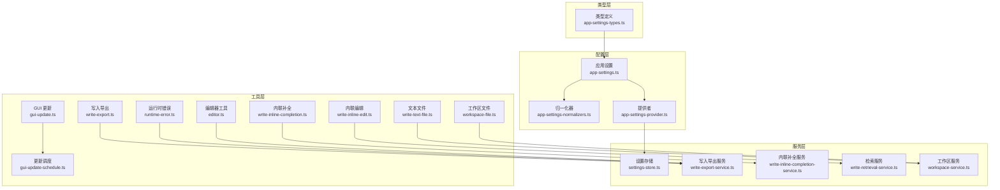

**图表来源**
- [app-settings.ts:1-200](file://src/shared/app-settings.ts#L1-L200)
- [app-settings-types.ts:1-200](file://src/shared/app-settings-types.ts#L1-L200)
- [app-settings-normalizers.ts:1-200](file://src/shared/app-settings-normalizers.ts#L1-L200)
- [app-settings-provider.ts:1-200](file://src/shared/app-settings-provider.ts#L1-L200)
- [write-export.ts:1-200](file://src/shared/write-export.ts#L1-L200)
- [write-inline-completion.ts:1-200](file://src/shared/write-inline-completion.ts#L1-L200)
- [write-inline-edit.ts:1-200](file://src/shared/write-inline-edit.ts#L1-L200)
- [write-text-file.ts:1-200](file://src/shared/write-text-file.ts#L1-L200)
- [gui-update.ts:1-200](file://src/shared/gui-update.ts#L1-L200)
- [gui-update-schedule.ts:1-200](file://src/shared/gui-update-schedule.ts#L1-L200)
- [runtime-error.ts:1-200](file://src/shared/runtime-error.ts#L1-L200)
- [workspace-file.ts:1-200](file://src/shared/workspace-file.ts#L1-L200)
- [editor.ts:1-200](file://src/shared/editor.ts#L1-L200)
- [settings-store.ts:1-200](file://src/main/settings-store.ts#L1-L200)
- [write-export-service.ts:1-200](file://src/main/services/write-export-service.ts#L1-L200)
- [write-inline-completion-service.ts:1-200](file://src/main/services/write-inline-completion-service.ts#L1-L200)
- [write-retrieval-service.ts:1-200](file://src/main/services/write-retrieval-service.ts#L1-L200)
- [workspace-service.ts:1-200](file://src/main/services/workspace-service.ts#L1-L200)

## 详细组件分析

### 应用设置模块（配置标准化与提供）
- 设计要点
  - 类型安全：通过强类型定义约束配置字段，避免运行期错误
  - 归一化：对来自不同来源的配置进行统一转换，保证一致性
  - 提供者：封装读取与合并逻辑，便于替换与测试
  - 扩展性：支持按模块（写入、计划、GUI）的细分配置
- 数据流
  - 输入：环境变量、用户设置、默认值
  - 处理：归一化器 → 合并 → 提供者
  - 输出：类型安全的配置对象
- 最佳实践
  - 将默认值与校验逻辑集中在归一化器中
  - 使用提供者暴露只读配置，避免全局污染
  - 为每个配置域定义独立的归一化器与类型定义

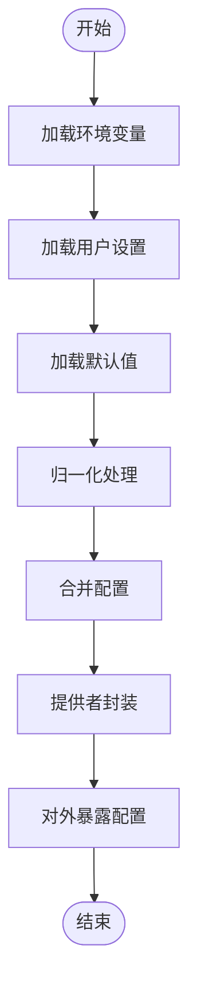

**图表来源**
- [app-settings-normalize.ts:1-200](file://src/shared/app-settings-normalize.ts#L1-L200)
- [app-settings-normalizers.ts:1-200](file://src/shared/app-settings-normalizers.ts#L1-L200)
- [app-settings-provider.ts:1-200](file://src/shared/app-settings-provider.ts#L1-L200)
- [app-settings.ts:1-200](file://src/shared/app-settings.ts#L1-L200)

**章节来源**
- [app-settings.ts:1-200](file://src/shared/app-settings.ts#L1-L200)
- [app-settings-types.ts:1-200](file://src/shared/app-settings-types.ts#L1-L200)
- [app-settings-normalize.ts:1-200](file://src/shared/app-settings-normalize.ts#L1-L200)
- [app-settings-normalizers.ts:1-200](file://src/shared/app-settings-normalizers.ts#L1-L200)
- [app-settings-provider.ts:1-200](file://src/shared/app-settings-provider.ts#L1-L200)
- [app-settings-schedule.ts:1-200](file://src/shared/app-settings-schedule.ts#L1-L200)
- [app-settings-write.ts:1-200](file://src/shared/app-settings-write.ts#L1-L200)

### GUI 计划模块（跨模块任务编排）
- 设计要点
  - 计划描述：以结构化方式描述任务、依赖与执行策略
  - 可视化：支持在 GUI 中展示计划状态与进度
  - 可扩展：支持自定义计划类型与执行器
- 数据流
  - 计划定义 → 解析 → 调度 → 执行 → 结果上报
- 最佳实践
  - 将计划与执行解耦，便于单元测试与模拟
  - 为计划提供统一的状态管理与事件通知

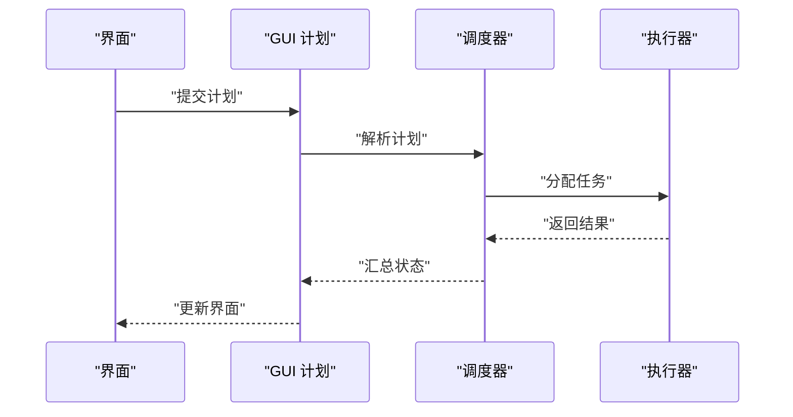

**图表来源**
- [gui-plan.ts:1-200](file://src/shared/gui-plan.ts#L1-L200)
- [schedule-runtime.ts:1-200](file://src/main/schedule-runtime.ts#L1-L200)

**章节来源**
- [gui-plan.ts:1-200](file://src/shared/gui-plan.ts#L1-L200)
- [schedule-runtime.ts:1-200](file://src/main/schedule-runtime.ts#L1-L200)

### 写入导出模块（内容序列化与输出控制）
- 设计要点
  - 抽象导出流程：统一内容序列化、目标定位与输出控制
  - 可扩展：支持多种导出格式与目标
  - 错误处理：提供清晰的错误信息与回退策略
- 数据流
  - 输入内容 → 序列化 → 目标选择 → 输出 → 完成回调
- 最佳实践
  - 将序列化与输出分离，便于测试与替换
  - 提供进度回调与取消机制

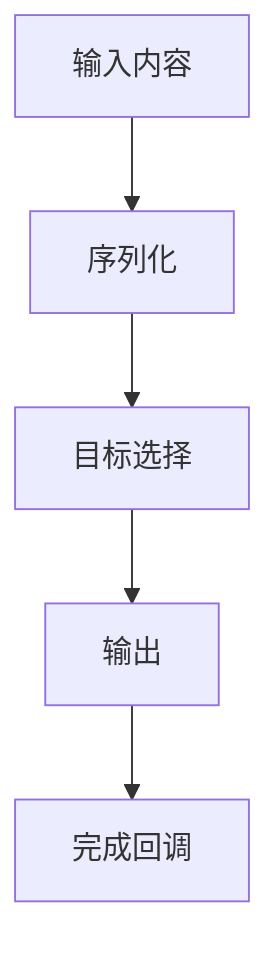

**图表来源**
- [write-export.ts:1-200](file://src/shared/write-export.ts#L1-L200)
- [write-export-service.ts:1-200](file://src/main/services/write-export-service.ts#L1-L200)

**章节来源**
- [write-export.ts:1-200](file://src/shared/write-export.ts#L1-L200)
- [write-export-service.ts:1-200](file://src/main/services/write-export-service.ts#L1-L200)

### 内联补全与内联编辑模块（策略、上下文与反馈）
- 设计要点
  - 策略：定义何时触发、如何触发与如何终止
  - 上下文：提取当前编辑环境的关键信息
  - 反馈：收集用户反馈以优化策略
- 数据流
  - 用户输入 → 触发检测 → 上下文提取 → 模型请求 → 结果渲染 → 反馈收集
- 最佳实践
  - 将策略与实现解耦，便于 A/B 实验与灰度发布
  - 提供可配置的阈值与超时参数

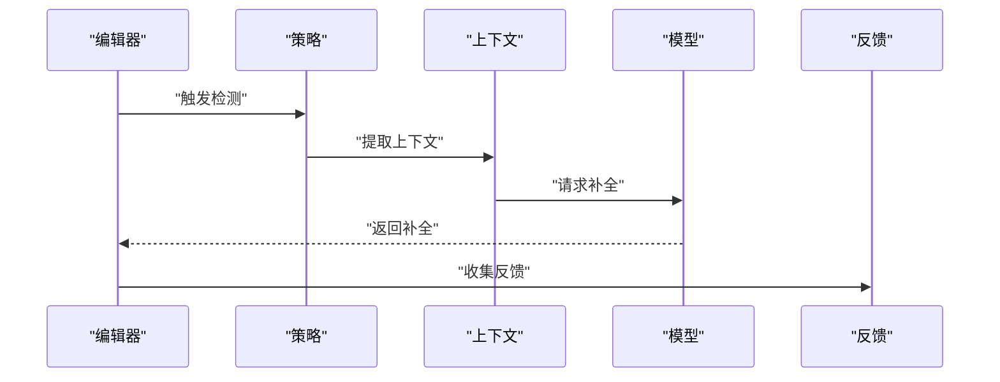

**图表来源**
- [write-inline-completion.ts:1-200](file://src/shared/write-inline-completion.ts#L1-L200)
- [write-inline-completion-policy.ts:1-200](file://src/renderer/src/write/inline-completion/policy.ts#L1-L200)
- [write-inline-completion-context.ts:1-200](file://src/renderer/src/write/inline-completion/context.ts#L1-L200)
- [write-inline-completion-feedback.ts:1-200](file://src/renderer/src/write/inline-completion/feedback.ts#L1-L200)
- [write-inline-completion-types.ts:1-200](file://src/renderer/src/write/inline-completion/types.ts#L1-L200)
- [write-inline-completion-prompt.ts:1-200](file://src/renderer/src/write/inline-completion/prompt.ts#L1-L200)
- [write-inline-completion-codemirror.ts:1-200](file://src/renderer/src/write/inline-completion/codemirror.ts#L1-L200)
- [write-inline-completion-constants.ts:1-200](file://src/renderer/src/write/inline-completion/constants.ts#L1-L200)
- [write-inline-completion-index.ts:1-200](file://src/renderer/src/write/inline-completion/index.ts#L1-L200)

**章节来源**
- [write-inline-completion.ts:1-200](file://src/shared/write-inline-completion.ts#L1-L200)
- [write-inline-completion-policy.ts:1-200](file://src/renderer/src/write/inline-completion/policy.ts#L1-L200)
- [write-inline-completion-context.ts:1-200](file://src/renderer/src/write/inline-completion/context.ts#L1-L200)
- [write-inline-completion-feedback.ts:1-200](file://src/renderer/src/write/inline-completion/feedback.ts#L1-L200)
- [write-inline-completion-types.ts:1-200](file://src/renderer/src/write/inline-completion/types.ts#L1-L200)
- [write-inline-completion-prompt.ts:1-200](file://src/renderer/src/write/inline-completion/prompt.ts#L1-L200)
- [write-inline-completion-codemirror.ts:1-200](file://src/renderer/src/write/inline-completion/codemirror.ts#L1-L200)
- [write-inline-completion-constants.ts:1-200](file://src/renderer/src/write/inline-completion/constants.ts#L1-L200)
- [write-inline-completion-index.ts:1-200](file://src/renderer/src/write/inline-completion/index.ts#L1-L200)

### 文本文件操作模块（原子写入与变更追踪）
- 设计要点
  - 原子写入：避免部分写入导致的数据损坏
  - 变更追踪：记录文件变更历史，支持撤销与回滚
  - 跨平台：适配不同操作系统的行为差异
- 数据流
  - 写入请求 → 原子写入 → 变更记录 → 回调通知
- 最佳实践
  - 在写入前进行权限与容量检查
  - 提供失败重试与降级策略

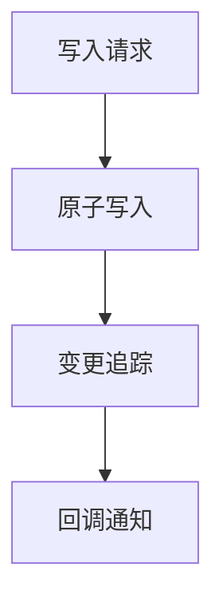

**图表来源**
- [write-text-file.ts:1-200](file://src/shared/write-text-file.ts#L1-L200)
- [write-file-watch.ts:1-200](file://src/renderer/src/write/write-file-watch.ts#L1-L200)

**章节来源**
- [write-text-file.ts:1-200](file://src/shared/write-text-file.ts#L1-L200)
- [write-file-watch.ts:1-200](file://src/renderer/src/write/write-file-watch.ts#L1-L200)

### GUI 更新与调度模块（条件触发与回滚）
- 设计要点
  - 条件触发：基于版本、网络状态或用户行为触发更新
  - 回滚机制：在更新失败时自动回滚到稳定版本
  - 调度策略：支持延迟、批量与优先级控制
- 数据流
  - 触发条件 → 检查版本 → 下载更新 → 安装 → 回滚保护
- 最佳实践
  - 将更新逻辑与 UI 解耦，避免阻塞主线程
  - 提供用户可见的进度与风险提示

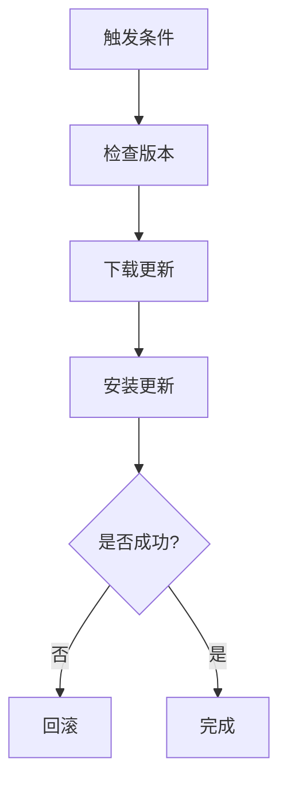

**图表来源**
- [gui-update.ts:1-200](file://src/shared/gui-update.ts#L1-L200)
- [gui-update-schedule.ts:1-200](file://src/shared/gui-update-schedule.ts#L1-L200)

**章节来源**
- [gui-update.ts:1-200](file://src/shared/gui-update.ts#L1-L200)
- [gui-update-schedule.ts:1-200](file://src/shared/gui-update-schedule.ts#L1-L200)

### 运行时错误模块（统一格式化与传播）
- 设计要点
  - 统一错误格式：包含错误码、消息、堆栈与上下文
  - 传播链路：从底层服务到上层 UI 的一致化展示
  - 可诊断性：提供足够的上下文信息辅助排查
- 数据流
  - 异常捕获 → 格式化 → 包装 → 传播 → 展示
- 最佳实践
  - 在服务层捕获异常并格式化，避免 UI 层分散处理
  - 提供错误上报与统计能力

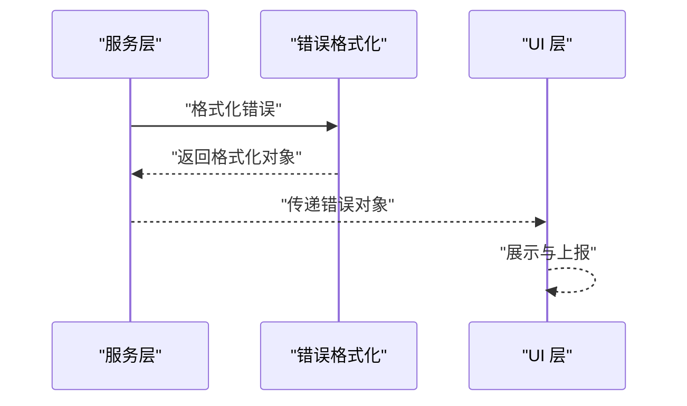

**图表来源**
- [runtime-error.ts:1-200](file://src/shared/runtime-error.ts#L1-L200)
- [format-runtime-error.ts:1-200](file://src/renderer/src/lib/format-runtime-error.ts#L1-L200)

**章节来源**
- [runtime-error.ts:1-200](file://src/shared/runtime-error.ts#L1-L200)
- [format-runtime-error.ts:1-200](file://src/renderer/src/lib/format-runtime-error.ts#L1-L200)

### 工作区文件与编辑器模块（跨平台兼容）
- 设计要点
  - 工作区文件抽象：屏蔽平台差异，提供统一接口
  - 编辑器工具集：包括高亮、偏好、引用与预览
- 数据流
  - 文件请求 → 解析路径 → 读取/写入 → 返回结果
- 最佳实践
  - 将平台特定逻辑封装在适配层，保持上层接口稳定

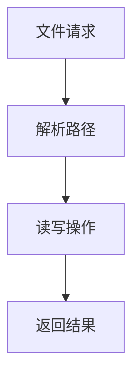

**图表来源**
- [workspace-file.ts:1-200](file://src/shared/workspace-file.ts#L1-L200)
- [editor.ts:1-200](file://src/shared/editor.ts#L1-L200)
- [workspace-files.ts:1-200](file://src/main/services/workspace-files.ts#L1-L200)
- [workspace-paths.ts:1-200](file://src/main/services/workspace-paths.ts#L1-L200)
- [workspace-editors.ts:1-200](file://src/main/services/workspace-editors.ts#L1-L200)

**章节来源**
- [workspace-file.ts:1-200](file://src/shared/workspace-file.ts#L1-L200)
- [editor.ts:1-200](file://src/shared/editor.ts#L1-L200)
- [workspace-files.ts:1-200](file://src/main/services/workspace-files.ts#L1-L200)
- [workspace-paths.ts:1-200](file://src/main/services/workspace-paths.ts#L1-L200)
- [workspace-editors.ts:1-200](file://src/main/services/workspace-editors.ts#L1-L200)

### OpenAI 兼容 URL、Kun 端点与默认合成模型
- 设计要点
  - 统一外部服务接入点，降低耦合度
  - 默认模型配置便于快速启动与一致性
- 数据流
  - 配置读取 → URL 构造 → 请求发送 → 响应处理
- 最佳实践
  - 为每个端点提供健康检查与降级策略

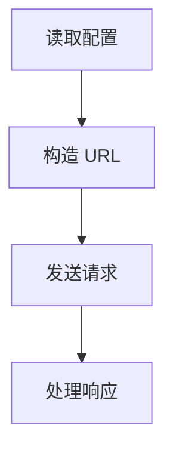

**图表来源**
- [openai-compat-url.ts:1-200](file://src/shared/openai-compat-url.ts#L1-L200)
- [kun-endpoints.ts:1-200](file://src/shared/kun-endpoints.ts#L1-L200)
- [default-composer-models.ts:1-200](file://src/shared/default-composer-models.ts#L1-L200)

**章节来源**
- [openai-compat-url.ts:1-200](file://src/shared/openai-compat-url.ts#L1-L200)
- [kun-endpoints.ts:1-200](file://src/shared/kun-endpoints.ts#L1-L200)
- [default-composer-models.ts:1-200](file://src/shared/default-composer-models.ts#L1-L200)

### Claw 命令与 SDD 工具
- 设计要点
  - Claw 命令：提供平台级自动化能力
  - SDD 工具：结构化创作与草稿管理
- 数据流
  - 命令解析 → 参数校验 → 执行 → 结果上报
- 最佳实践
  - 将命令与参数抽象为类型安全的数据结构

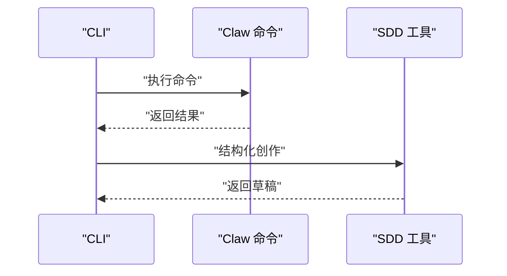

**图表来源**
- [claw-commands.ts:1-200](file://src/shared/claw-commands.ts#L1-L200)
- [sdd.ts:1-200](file://src/shared/sdd.ts#L1-L200)

**章节来源**
- [claw-commands.ts:1-200](file://src/shared/claw-commands.ts#L1-L200)
- [sdd.ts:1-200](file://src/shared/sdd.ts#L1-L200)

### 开发预览 URL 与 Markdown 资源
- 设计要点
  - 开发预览 URL：便于快速验证与分享
  - Markdown 资源：统一资源管理与加载
- 数据流
  - 资源请求 → 解析 → 加载 → 渲染
- 最佳实践
  - 提供缓存与懒加载策略

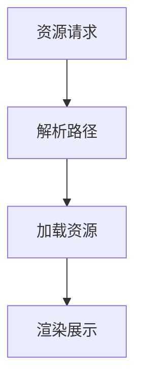

**图表来源**
- [dev-preview-url.ts:1-200](file://src/shared/dev-preview-url.ts#L1-L200)
- [write-markdown-resource.ts:1-200](file://src/shared/write-markdown-resource.ts#L1-L200)

**章节来源**
- [dev-preview-url.ts:1-200](file://src/shared/dev-preview-url.ts#L1-L200)
- [write-markdown-resource.ts:1-200](file://src/shared/write-markdown-resource.ts#L1-L200)

## 依赖关系分析
共享库与主进程、渲染器之间的依赖关系如下：

```mermaid
graph TB
subgraph "共享库"
AS["应用设置"]
GP["GUI 计划"]
WE["写入导出"]
WIC["内联补全"]
WIE["内联编辑"]
WTF["文本文件"]
GUIU["GUI 更新"]
GUIS["更新调度"]
RTE["运行时错误"]
WF["工作区文件"]
ED["编辑器工具"]
end
subgraph "主进程"
SS["设置存储"]
SR["计划运行时"]
WES["写入导出服务"]
WICS["内联补全服务"]
WRS["检索服务"]
WS["工作区服务"]
end
subgraph "渲染器"
CS["聊天存储"]
WWS["写入工作区存储"]
WME["编辑器"]
WMP["预览"]
WV["视图"]
WVT["工具栏"]
WVP["文档面板"]
WVS["开始页"]
WVE["空状态"]
WAP["助手面板"]
WSB["侧边栏"]
WIP["图片预览"]
WIA["内联代理"]
PC["计划命令"]
PS["计划存储"]
PT["计划工具"]
WPC["工作台计划控制器"]
end
AS --> SS
GP --> SR
WE --> WES
WIC --> WICS
WIE --> WRS
WTF --> WS
GUIU --> GUIS
RTE --> WES
WF --> WS
ED --> WME
CS --> WWS
WWS --> WME
WWS --> WMP
WWS --> WV
WWS --> WVT
WWS --> WVP
WWS --> WVS
WWS --> WVE
WWS --> WAP
WWS --> WSB
WWS --> WIP
WWS --> WIA
PS --> PC
PS --> PT
WPC --> PS
```

**图表来源**
- [app-settings.ts:1-200](file://src/shared/app-settings.ts#L1-L200)
- [gui-plan.ts:1-200](file://src/shared/gui-plan.ts#L1-L200)
- [write-export.ts:1-200](file://src/shared/write-export.ts#L1-L200)
- [write-inline-completion.ts:1-200](file://src/shared/write-inline-completion.ts#L1-L200)
- [write-inline-edit.ts:1-200](file://src/shared/write-inline-edit.ts#L1-L200)
- [write-text-file.ts:1-200](file://src/shared/write-text-file.ts#L1-L200)
- [gui-update.ts:1-200](file://src/shared/gui-update.ts#L1-L200)
- [gui-update-schedule.ts:1-200](file://src/shared/gui-update-schedule.ts#L1-L200)
- [runtime-error.ts:1-200](file://src/shared/runtime-error.ts#L1-L200)
- [workspace-file.ts:1-200](file://src/shared/workspace-file.ts#L1-L200)
- [editor.ts:1-200](file://src/shared/editor.ts#L1-L200)
- [settings-store.ts:1-200](file://src/main/settings-store.ts#L1-L200)
- [schedule-runtime.ts:1-200](file://src/main/schedule-runtime.ts#L1-L200)
- [write-export-service.ts:1-200](file://src/main/services/write-export-service.ts#L1-L200)
- [write-inline-completion-service.ts:1-200](file://src/main/services/write-inline-completion-service.ts#L1-L200)
- [write-retrieval-service.ts:1-200](file://src/main/services/write-retrieval-service.ts#L1-L200)
- [workspace-service.ts:1-200](file://src/main/services/workspace-service.ts#L1-L200)
- [chat-store.ts:1-200](file://src/renderer/src/store/chat-store.ts#L1-L200)
- [write-workspace-store.ts:1-200](file://src/renderer/src/write/write-workspace-store.ts#L1-L200)
- [write-markdown-editor.ts:1-200](file://src/renderer/src/write/WriteMarkdownEditor.tsx#L1-L200)
- [write-markdown-preview.ts:1-200](file://src/renderer/src/write/WriteMarkdownPreview.tsx#L1-L200)
- [write-workspace-view.ts:1-200](file://src/renderer/src/write/WriteWorkspaceView.tsx#L1-L200)
- [write-workspace-toolbar.ts:1-200](file://src/renderer/src/write/WriteWorkspaceToolbar.tsx#L1-L200)
- [write-workspace-document-pane.ts:1-200](file://src/renderer/src/write/WriteWorkspaceDocumentPane.tsx#L1-L200)
- [write-workspace-start.ts:1-200](file://src/renderer/src/write/WriteWorkspaceStart.tsx#L1-L200)
- [write-workspace-empty-state.ts:1-200](file://src/renderer/src/write/WriteWorkspaceEmptyState.tsx#L1-L200)
- [write-assistant-panel.ts:1-200](file://src/renderer/src/write/WriteAssistantPanel.tsx#L1-L200)
- [write-sidebar.ts:1-200](file://src/renderer/src/write/WriteSidebar.tsx#L1-L200)
- [write-image-preview.ts:1-200](file://src/renderer/src/write/WriteImagePreview.tsx#L1-L200)
- [write-inline-agent.ts:1-200](file://src/renderer/src/write/WriteInlineAgent.tsx#L1-L200)
- [plan-command.ts:1-200](file://src/renderer/src/plan/plan-command.ts#L1-L200)
- [plan-store.ts:1-200](file://src/renderer/src/plan/plan-store.ts#L1-L200)
- [plan-tool.ts:1-200](file://src/renderer/src/plan/plan-tool.ts#L1-L200)
- [workbench-plan-controller.ts:1-200](file://src/renderer/src/components/workbench-plan-controller.ts#L1-L200)

**章节来源**
- [app-settings.ts:1-200](file://src/shared/app-settings.ts#L1-L200)
- [gui-plan.ts:1-200](file://src/shared/gui-plan.ts#L1-L200)
- [write-export.ts:1-200](file://src/shared/write-export.ts#L1-L200)
- [write-inline-completion.ts:1-200](file://src/shared/write-inline-completion.ts#L1-L200)
- [write-inline-edit.ts:1-200](file://src/shared/write-inline-edit.ts#L1-L200)
- [write-text-file.ts:1-200](file://src/shared/write-text-file.ts#L1-L200)
- [gui-update.ts:1-200](file://src/shared/gui-update.ts#L1-L200)
- [gui-update-schedule.ts:1-200](file://src/shared/gui-update-schedule.ts#L1-L200)
- [runtime-error.ts:1-200](file://src/shared/runtime-error.ts#L1-L200)
- [workspace-file.ts:1-200](file://src/shared/workspace-file.ts#L1-L200)
- [editor.ts:1-200](file://src/shared/editor.ts#L1-L200)
- [settings-store.ts:1-200](file://src/main/settings-store.ts#L1-L200)
- [schedule-runtime.ts:1-200](file://src/main/schedule-runtime.ts#L1-L200)
- [write-export-service.ts:1-200](file://src/main/services/write-export-service.ts#L1-L200)
- [write-inline-completion-service.ts:1-200](file://src/main/services/write-inline-completion-service.ts#L1-L200)
- [write-retrieval-service.ts:1-200](file://src/main/services/write-retrieval-service.ts#L1-L200)
- [workspace-service.ts:1-200](file://src/main/services/workspace-service.ts#L1-L200)
- [chat-store.ts:1-200](file://src/renderer/src/store/chat-store.ts#L1-L200)
- [write-workspace-store.ts:1-200](file://src/renderer/src/write/write-workspace-store.ts#L1-L200)
- [write-markdown-editor.ts:1-200](file://src/renderer/src/write/WriteMarkdownEditor.tsx#L1-L200)
- [write-markdown-preview.ts:1-200](file://src/renderer/src/write/WriteMarkdownPreview.tsx#L1-L200)
- [write-workspace-view.ts:1-200](file://src/renderer/src/write/WriteWorkspaceView.tsx#L1-L200)
- [write-workspace-toolbar.ts:1-200](file://src/renderer/src/write/WriteWorkspaceToolbar.tsx#L1-L200)
- [write-workspace-document-pane.ts:1-200](file://src/renderer/src/write/WriteWorkspaceDocumentPane.tsx#L1-L200)
- [write-workspace-start.ts:1-200](file://src/renderer/src/write/WriteWorkspaceStart.tsx#L1-L200)
- [write-workspace-empty-state.ts:1-200](file://src/renderer/src/write/WriteWorkspaceEmptyState.tsx#L1-L200)
- [write-assistant-panel.ts:1-200](file://src/renderer/src/write/WriteAssistantPanel.tsx#L1-L200)
- [write-sidebar.ts:1-200](file://src/renderer/src/write/WriteSidebar.tsx#L1-L200)
- [write-image-preview.ts:1-200](file://src/renderer/src/write/WriteImagePreview.tsx#L1-L200)
- [write-inline-agent.ts:1-200](file://src/renderer/src/write/WriteInlineAgent.tsx#L1-L200)
- [plan-command.ts:1-200](file://src/renderer/src/plan/plan-command.ts#L1-L200)
- [plan-store.ts:1-200](file://src/renderer/src/plan/plan-store.ts#L1-L200)
- [plan-tool.ts:1-200](file://src/renderer/src/plan/plan-tool.ts#L1-L200)
- [workbench-plan-controller.ts:1-200](file://src/renderer/src/components/workbench-plan-controller.ts#L1-L200)

## 性能考虑
- 配置读取
  - 使用提供者缓存配置，减少重复解析
  - 对高频访问的配置项进行内存缓存
- 文件操作
  - 原子写入避免磁盘碎片与部分写入
  - 批量写入与去抖动策略降低 I/O 压力
- 导出与渲染
  - 分块序列化与增量渲染减少内存峰值
  - 并行处理与进度回调提升用户体验
- 错误处理
  - 异步错误捕获与重试机制避免阻塞主线程
  - 限流与熔断策略防止级联故障

## 故障排除指南
- 配置不生效
  - 检查归一化器是否覆盖了预期值
  - 确认提供者是否正确合并了默认值与用户设置
- 导出失败
  - 查看错误格式化输出，确认目标路径与权限
  - 检查序列化器是否支持目标格式
- 内联补全无响应
  - 检查策略阈值与上下文提取是否正常
  - 确认模型客户端连接与超时设置
- 文件写入异常
  - 检查原子写入是否被其他进程占用
  - 查看变更追踪是否正确记录
- GUI 更新失败
  - 检查网络与签名验证
  - 确认回滚策略是否正确执行

**章节来源**
- [runtime-error.ts:1-200](file://src/shared/runtime-error.ts#L1-L200)
- [format-runtime-error.ts:1-200](file://src/renderer/src/lib/format-runtime-error.ts#L1-L200)
- [write-text-file.ts:1-200](file://src/shared/write-text-file.ts#L1-L200)
- [write-export.ts:1-200](file://src/shared/write-export.ts#L1-L200)
- [write-inline-completion-policy.ts:1-200](file://src/renderer/src/write/inline-completion/policy.ts#L1-L200)
- [gui-update.ts:1-200](file://src/shared/gui-update.ts#L1-L200)

## 结论
共享库通过“配置标准化 + 工具函数通用化 + 类型安全 + 服务层解耦”的设计，实现了跨模块的一致性与可维护性。建议在后续迭代中持续完善：
- 配置的动态热更新与灰度发布
- 工具函数的单元测试覆盖率与基准测试
- 类型定义的演进与向后兼容策略
- 服务层的可观测性与可诊断性增强

## 附录
- API 设计最佳实践
  - 明确输入输出契约，使用强类型定义
  - 提供统一的错误格式与回退策略
  - 将副作用与纯函数分离，便于测试与复用
- 配置标准化最佳实践
  - 将默认值、校验与归一化集中管理
  - 支持多来源合并与优先级控制
  - 提供配置快照与审计日志