# 核心模块详解

<cite>
**本文引用的文件**
- [src/main/index.ts](file://src/main/index.ts)
- [src/main/ipc/register-app-ipc-handlers.ts](file://src/main/ipc/register-app-ipc-handlers.ts)
- [src/main/ipc/app-ipc-schemas.ts](file://src/main/ipc/app-ipc-schemas.ts)
- [src/main/runtime/kun-adapter.ts](file://src/main/runtime/kun-adapter.ts)
- [src/main/services/workspace-service.ts](file://src/main/services/workspace-service.ts)
- [src/main/services/skill-service.ts](file://src/main/services/skill-service.ts)
- [src/main/claw-runtime.ts](file://src/main/claw-runtime.ts)
- [src/main/claw-schedule-mcp-server.ts](file://src/main/claw-schedule-mcp-server.ts)
- [src/main/claw-schedule-mcp-config.ts](file://src/main/claw-schedule-mcp-config.ts)
- [src/main/gui-updater.ts](file://src/main/gui-updater.ts)
- [src/preload/index.ts](file://src/preload/index.ts)
- [src/renderer/src/main.tsx](file://src/renderer/src/main.tsx)
- [src/renderer/src/App.tsx](file://src/renderer/src/App.tsx)
- [src/renderer/src/store/chat-store.ts](file://src/renderer/src/store/chat-store.ts)
- [src/renderer/src/store/chat-store-runtime.ts](file://src/renderer/src/store/chat-store-runtime.ts)
- [src/renderer/src/components/chat/FloatingComposer.tsx](file://src/renderer/src/components/chat/FloatingComposer.tsx)
- [src/renderer/src/components/chat/Sidebar.tsx](file://src/renderer/src/components/chat/Sidebar.tsx)
- [src/renderer/src/components/write/WriteWorkspaceView.tsx](file://src/renderer/src/components/write/WriteWorkspaceView.tsx)
- [src/renderer/src/lib/open-workspace-path.ts](file://src/renderer/src/lib/open-workspace-path.ts)
- [src/shared/ds-gui-api.ts](file://src/shared/ds-gui-api.ts)
- [src/shared/app-settings.ts](file://src/shared/app-settings.ts)
- [src/shared/kun-endpoints.ts](file://src/shared/kun-endpoints.ts)
- [kun/src/index.ts](file://kun/src/index.ts)
- [kun/src/loop/agent-loop.ts](file://kun/src/loop/agent-loop.ts)
- [kun/src/loop/auto-model-router.ts](file://kun/src/loop/auto-model-router.ts)
- [kun/src/loop/tool-call-repair.ts](file://kun/src/loop/tool-call-repair.ts)
- [kun/src/loop/context-estimator.ts](file://kun/src/loop/context-estimator.ts)
- [kun/src/loop/model-request-estimator.ts](file://kun/src/loop/model-request-estimator.ts)
- [kun/src/loop/token-economy.ts](file://kun/src/loop/token-economy.ts)
- [kun/src/ports/model-client.ts](file://kun/src/ports/model-client.ts)
- [kun/src/ports/tool-host.ts](file://kun/src/ports/tool-host.ts)
- [kun/src/ports/session-store.ts](file://kun/src/ports/session-store.ts)
- [kun/src/ports/thread-store.ts](file://kun/src/ports/thread-store.ts)
- [kun/src/ports/event-bus.ts](file://kun/src/ports/event-bus.ts)
- [kun/src/ports/approval-gate.ts](file://kun/src/ports/approval-gate.ts)
- [kun/src/ports/user-input-gate.ts](file://kun/src/ports/user-input-gate.ts)
- [kun/src/adapters/file/file-session-store.ts](file://kun/src/adapters/file/file-session-store.ts)
- [kun/src/adapters/file/file-thread-store.ts](file://kun/src/adapters/file/file-thread-store.ts)
- [kun/src/adapters/hybrid/hybrid-session-store.ts](file://kun/src/adapters/hybrid/hybrid-session-store.ts)
- [kun/src/adapters/hybrid/hybrid-thread-store.ts](file://kun/src/adapters/hybrid/hybrid-thread-store.ts)
- [kun/src/server/http-server.ts](file://kun/src/server/http-server.ts)
- [kun/src/server/node-http-server.ts](file://kun/src/server/node-http-server.ts)
- [kun/src/server/router.ts](file://kun/src/server/router.ts)
- [kun/src/server/routes/sessions.ts](file://kun/src/server/routes/sessions.ts)
- [kun/src/server/routes/threads.ts](file://kun/src/server/routes/threads.ts)
- [kun/src/server/routes/turns.ts](file://kun/src/server/routes/turns.ts)
- [kun/src/server/routes/events.ts](file://kun/src/server/routes/events.ts)
- [kun/src/server/routes/memory.ts](file://kun/src/server/routes/memory.ts)
- [kun/src/server/routes/usage.ts](file://kun/src/server/routes/usage.ts)
- [kun/src/server/routes/workspace.ts](file://kun/src/server/routes/workspace.ts)
- [kun/src/server/routes/review.ts](file://kun/src/server/routes/review.ts)
- [kun/src/server/routes/runtime-info.ts](file://kun/src/server/routes/runtime-info.ts)
- [kun/src/server/routes/runtime-error.ts](file://kun/src/server/routes/runtime-error.ts)
- [kun/src/server/routes/server-runtime.ts](file://kun/src/server/routes/server-runtime.ts)
- [kun/src/server/routes/health.ts](file://kun/src/server/routes/health.ts)
- [kun/src/server/routes/approvals.ts](file://kun/src/server/routes/approvals.ts)
- [kun/src/server/routes/user-inputs.ts](file://kun/src/server/routes/user-inputs.ts)
- [kun/src/server/routes/attachments.ts](file://kun/src/server/routes/attachments.ts)
- [kun/src/server/routes/skills.ts](file://kun/src/server/routes/skills.ts)
- [kun/src/server/routes/server-runtime.ts](file://kun/src/server/routes/server-runtime.ts)
- [kun/src/server/runtime-factory.ts](file://kun/src/server/runtime-factory.ts)
- [kun/src/server/sse.ts](file://kun/src/server/sse.ts)
- [kun/src/config/kun-config.ts](file://kun/src/config/kun-config.ts)
- [kun/src/contracts/index.ts](file://kun/src/contracts/index.ts)
- [kun/src/domain/session.ts](file://kun/src/domain/session.ts)
- [kun/src/domain/thread.ts](file://kun/src/domain/thread.ts)
- [kun/src/domain/turn.ts](file://kun/src/domain/turn.ts)
- [kun/src/domain/event.ts](file://kun/src/domain/event.ts)
- [kun/src/domain/item.ts](file://kun/src/domain/item.ts)
- [kun/src/domain/approval.ts](file://kun/src/domain/approval.ts)
- [kun/src/domain/usage.ts](file://kun/src/domain/usage.ts)
- [kun/src/ports/web-provider.ts](file://kun/src/ports/web-provider.ts)
- [kun/src/ports/workspace-inspector.ts](file://kun/src/ports/workspace-inspector.ts)
- [kun/src/ports/clock.ts](file://kun/src/ports/clock.ts)
- [kun/src/ports/id-generator.ts](file://kun/src/ports/id-generator.ts)
- [kun/src/memory/memory-store.ts](file://kun/src/memory/memory-store.ts)
- [kun/src/delegation/delegation-runtime.ts](file://kun/src/delegation/delegation-runtime.ts)
- [kun/src/delegation/child-agent-executor.ts](file://kun/src/delegation/child-agent-executor.ts)
- [kun/src/skills/skill-runtime.ts](file://kun/src/skills/skill-runtime.ts)
- [kun/src/services/thread-service.ts](file://kun/src/services/thread-service.ts)
- [kun/src/services/turn-service.ts](file://kun/src/services/turn-service.ts)
- [kun/src/services/usage-service.ts](file://kun/src/services/usage-service.ts)
- [kun/src/services/review-service.ts](file://kun/src/services/review-service.ts)
- [kun/src/services/runtime-event-recorder.ts](file://kun/src/services/runtime-event-recorder.ts)
- [kun/src/telemetry/usage-counter.ts](file://kun/src/telemetry/usage-counter.ts)
- [kun/src/telemetry/cache-telemetry.ts](file://kun/src/telemetry/cache-telemetry.ts)
- [kun/src/cli/serve.ts](file://kun/src/cli/serve.ts)
- [kun/src/cli/agent-cli.ts](file://kun/src/cli/agent-cli.ts)
- [kun/src/cli/serve-entry.ts](file://kun/src/cli/serve-entry.ts)
- [kun/src/prompt/kun-system-prompt.ts](file://kun/src/prompt/kun-system-prompt.ts)
- [kun/src/attachments/attachment-store.ts](file://kun/src/attachments/attachment-store.ts)
- [kun/src/cache/lru-cache.ts](file://kun/src/cache/lru-cache.ts)
- [kun/src/cache/ttl-lru-cache.ts](file://kun/src/cache/ttl-lru-cache.ts)
- [kun/src/cache/immutable-prefix.ts](file://kun/src/cache/immutable-prefix.ts)
- [kun/src/cache/prefix-volatility.ts](file://kun/src/cache/prefix-volatility.ts)
- [kun/src/cache/tool-catalog-fingerprint.ts](file://kun/src/cache/tool-catalog-fingerprint.ts)
- [kun/src/adapters/tool/builtin-tools.ts](file://kun/src/adapters/tool/builtin-tools.ts)
- [kun/src/adapters/tool/builtin-tool-operations.ts](file://kun/src/adapters/tool/builtin-tool-operations.ts)
- [kun/src/adapters/tool/builtin-tool-types.ts](file://kun/src/adapters/tool/builtin-tool-types.ts)
- [kun/src/adapters/tool/builtin-tool-utils.ts](file://kun/src/adapters/tool/builtin-tool-utils.ts)
- [kun/src/adapters/tool/mcp-tool-provider.ts](file://kun/src/adapters/tool/mcp-tool-provider.ts)
- [kun/src/adapters/tool/web-tool-provider.ts](file://kun/src/adapters/tool/web-tool-provider.ts)
- [kun/src/adapters/tool/local-tool-host.ts](file://kun/src/adapters/tool/local-tool-host.ts)
- [kun/src/adapters/tool/capability-registry.ts](file://kun/src/adapters/tool/capability-registry.ts)
- [kun/src/adapters/model/deepseek-compat-model-client.ts](file://kun/src/adapters/model/deepseek-compat-model-client.ts)
- [kun/src/adapters/model/deepseek-pricing.ts](file://kun/src/adapters/model/deepseek-pricing.ts)
- [kun/src/adapters/model/model-error-probe.ts](file://kun/src/adapters/model/model-error-probe.ts)
- [kun/src/adapters/model/tool-argument-repair.ts](file://kun/src/adapters/model/tool-argument-repair.ts)
- [kun/src/in-memory-event-bus.ts](file://kun/src/in-memory-event-bus.ts)
- [kun/src/in-memory-session-store.ts](file://kun/src/in-memory-session-store.ts)
- [kun/src/in-memory-thread-store.ts](file://kun/src/in-memory-thread-store.ts)
- [kun/src/in-memory-approval-gate.ts](file://kun/src/in-memory-approval-gate.ts)
- [kun/src/in-memory-user-input-gate.ts](file://kun/src/in-memory-user-input-gate.ts)
- [kun/src/workspace/local-workspace-inspector.ts](file://kun/src/workspace/local-workspace-inspector.ts)
- [kun/src/review/git-review-target.ts](file://kun/src/review/git-review-target.ts)
- [kun/src/review/review-output.ts](file://kun/src/review/review-output.ts)
- [kun/src/review/review-prompt.ts](file://kun/src/review/review-prompt.ts)
- [kun/src/shared/gui-plan.ts](file://kun/src/shared/gui-plan.ts)
- [kun/src/shared/todos.ts](file://kun/src/shared/todos.ts)
</cite>

## 目录
1. [引言](#引言)
2. [项目结构](#项目结构)
3. [核心组件](#核心组件)
4. [架构总览](#架构总览)
5. [详细组件分析](#详细组件分析)
6. [依赖分析](#依赖分析)
7. [性能考虑](#性能考虑)
8. [故障排查指南](#故障排查指南)
9. [结论](#结论)
10. [附录](#附录)

## 引言
本文件面向有经验的开发者，系统性解析 DeepSeek GUI 的核心模块：Electron 主进程（应用生命周期、窗口系统、IPC 通信、系统集成功能）、React 渲染器应用（组件架构、状态管理、路由与 UI 组件库）、Kun 运行时（智能体循环、工具系统、存储适配器、服务器层）。文档提供类图、时序图、流程图与配置示例，帮助读者快速理解模块间依赖关系、接口契约与错误处理策略。

## 项目结构
项目采用多包分层组织：
- 主进程与渲染器：src/main、src/preload、src/renderer
- Kun 运行时：kun/src
- 共享能力：src/shared
- 构建与打包：electron.vite.config.ts、electron-builder.config.cjs
- 文档与设计：docs、DESIGN.md

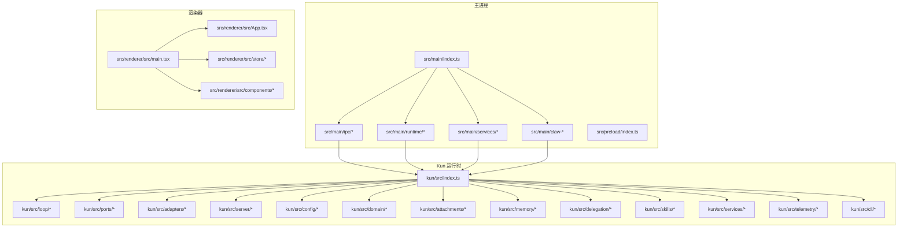

图表来源
- [src/main/index.ts:1-200](file://src/main/index.ts#L1-L200)
- [src/renderer/src/main.tsx:1-120](file://src/renderer/src/main.tsx#L1-L120)
- [kun/src/index.ts:1-200](file://kun/src/index.ts#L1-L200)

章节来源
- [src/main/index.ts:1-200](file://src/main/index.ts#L1-L200)
- [src/renderer/src/main.tsx:1-120](file://src/renderer/src/main.tsx#L1-L120)
- [kun/src/index.ts:1-200](file://kun/src/index.ts#L1-L200)

## 核心组件
本节从系统视角概述三大核心子系统及其职责边界与交互方式。

- Electron 主进程：负责应用生命周期、窗口创建与管理、系统托盘、菜单、热键、文件对话框、更新机制、与 Kun 运行时的桥接与 IPC。
- React 渲染器：承载用户界面、状态管理、路由与视图组件，通过预加载脚本与主进程进行安全 IPC 通信。
- Kun 运行时：提供智能体循环、工具系统、存储适配器、事件总线、内存与缓存、服务层与 HTTP 路由，支持 CLI 与 SSE 推送。

章节来源
- [src/main/index.ts:1-200](file://src/main/index.ts#L1-L200)
- [src/renderer/src/main.tsx:1-120](file://src/renderer/src/main.tsx#L1-L120)
- [kun/src/index.ts:1-200](file://kun/src/index.ts#L1-L200)

## 架构总览
下图展示主进程、渲染器与 Kun 运行时之间的端到端交互：

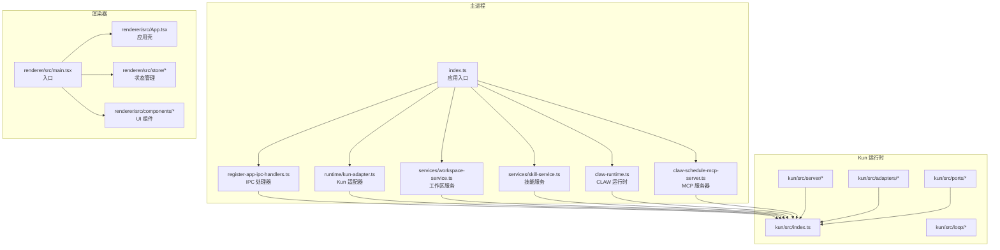

图表来源
- [src/main/index.ts:1-200](file://src/main/index.ts#L1-L200)
- [src/main/ipc/register-app-ipc-handlers.ts:1-200](file://src/main/ipc/register-app-ipc-handlers.ts#L1-L200)
- [src/main/runtime/kun-adapter.ts:1-200](file://src/main/runtime/kun-adapter.ts#L1-L200)
- [src/main/services/workspace-service.ts:1-200](file://src/main/services/workspace-service.ts#L1-L200)
- [src/main/services/skill-service.ts:1-200](file://src/main/services/skill-service.ts#L1-L200)
- [src/main/claw-runtime.ts:1-200](file://src/main/claw-runtime.ts#L1-L200)
- [src/main/claw-schedule-mcp-server.ts:1-200](file://src/main/claw-schedule-mcp-server.ts#L1-L200)
- [src/renderer/src/main.tsx:1-120](file://src/renderer/src/main.tsx#L1-L120)
- [src/renderer/src/App.tsx:1-200](file://src/renderer/src/App.tsx#L1-L200)
- [kun/src/index.ts:1-200](file://kun/src/index.ts#L1-L200)

## 详细组件分析

### Electron 主进程：应用生命周期与窗口系统
- 应用入口负责创建主窗口、设置菜单与快捷键、处理应用激活与退出、系统托盘集成。
- 窗口系统支持多窗口模式、全屏切换、窗口状态持久化与跨平台标题栏。
- 预加载脚本提供受限上下文，暴露受控 API 给渲染器，确保 CSP 安全与最小权限。

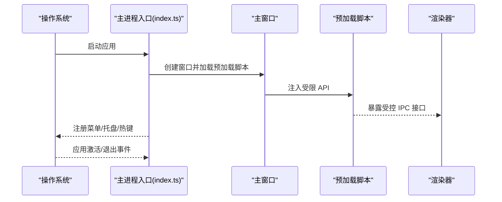

图表来源
- [src/main/index.ts:1-200](file://src/main/index.ts#L1-L200)
- [src/preload/index.ts:1-200](file://src/preload/index.ts#L1-L200)

章节来源
- [src/main/index.ts:1-200](file://src/main/index.ts#L1-L200)
- [src/preload/index.ts:1-200](file://src/preload/index.ts#L1-L200)

### Electron 主进程：IPC 通信与类型安全
- IPC 处理器集中注册，基于统一的请求/响应模式与 Schema 校验，保证消息契约稳定。
- 预加载脚本在渲染器侧提供受限通道，避免直接访问 Node/Electron API。

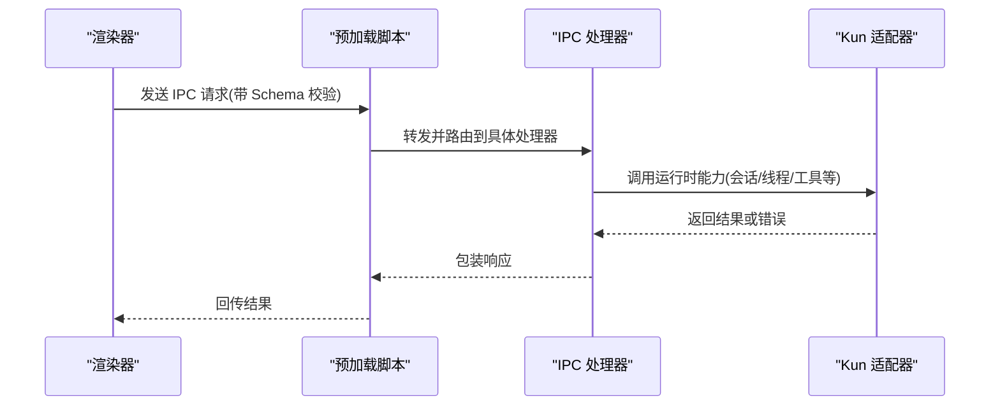

图表来源
- [src/main/ipc/register-app-ipc-handlers.ts:1-200](file://src/main/ipc/register-app-ipc-handlers.ts#L1-L200)
- [src/main/ipc/app-ipc-schemas.ts:1-200](file://src/main/ipc/app-ipc-schemas.ts#L1-L200)
- [src/preload/index.ts:1-200](file://src/preload/index.ts#L1-L200)

章节来源
- [src/main/ipc/register-app-ipc-handlers.ts:1-200](file://src/main/ipc/register-app-ipc-handlers.ts#L1-L200)
- [src/main/ipc/app-ipc-schemas.ts:1-200](file://src/main/ipc/app-ipc-schemas.ts#L1-L200)
- [src/preload/index.ts:1-200](file://src/preload/index.ts#L1-L200)

### Electron 主进程：系统集成功能
- 工作区服务：扫描本地工作区、文件监听、路径解析与打开。
- 技能服务：技能市场与技能执行调度。
- CLAW 运行时：集成 MCP（Model Context Protocol）任务调度与配置。
- 更新器：检查更新、下载与安装，支持多平台签名与验证。

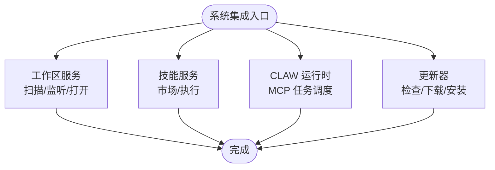

图表来源
- [src/main/services/workspace-service.ts:1-200](file://src/main/services/workspace-service.ts#L1-L200)
- [src/main/services/skill-service.ts:1-200](file://src/main/services/skill-service.ts#L1-L200)
- [src/main/claw-runtime.ts:1-200](file://src/main/claw-runtime.ts#L1-L200)
- [src/main/claw-schedule-mcp-server.ts:1-200](file://src/main/claw-schedule-mcp-server.ts#L1-L200)
- [src/main/gui-updater.ts:1-200](file://src/main/gui-updater.ts#L1-L200)

章节来源
- [src/main/services/workspace-service.ts:1-200](file://src/main/services/workspace-service.ts#L1-L200)
- [src/main/services/skill-service.ts:1-200](file://src/main/services/skill-service.ts#L1-L200)
- [src/main/claw-runtime.ts:1-200](file://src/main/claw-runtime.ts#L1-L200)
- [src/main/claw-schedule-mcp-server.ts:1-200](file://src/main/claw-schedule-mcp-server.ts#L1-L200)
- [src/main/gui-updater.ts:1-200](file://src/main/gui-updater.ts#L1-L200)

### React 渲染器：组件架构与状态管理
- 入口与壳组件：初始化国际化、主题、全局样式与路由。
- 状态管理：基于运行时驱动的状态容器，封装聊天、计划、写作等场景的状态与副作用。
- UI 组件：聊天面板、侧边栏、写作工作区、插件市场、设置页等，遵循可复用与可测试原则。

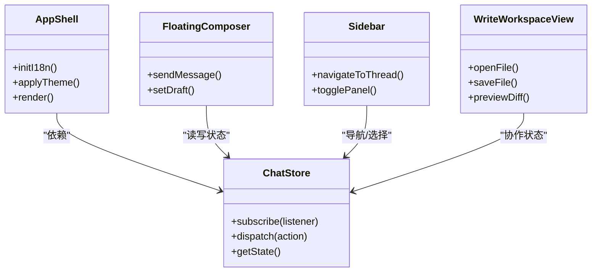

图表来源
- [src/renderer/src/App.tsx:1-200](file://src/renderer/src/App.tsx#L1-L200)
- [src/renderer/src/store/chat-store.ts:1-200](file://src/renderer/src/store/chat-store.ts#L1-L200)
- [src/renderer/src/store/chat-store-runtime.ts:1-200](file://src/renderer/src/store/chat-store-runtime.ts#L1-L200)
- [src/renderer/src/components/chat/FloatingComposer.tsx:1-200](file://src/renderer/src/components/chat/FloatingComposer.tsx#L1-L200)
- [src/renderer/src/components/chat/Sidebar.tsx:1-200](file://src/renderer/src/components/chat/Sidebar.tsx#L1-L200)
- [src/renderer/src/components/write/WriteWorkspaceView.tsx:1-200](file://src/renderer/src/components/write/WriteWorkspaceView.tsx#L1-L200)

章节来源
- [src/renderer/src/App.tsx:1-200](file://src/renderer/src/App.tsx#L1-L200)
- [src/renderer/src/store/chat-store.ts:1-200](file://src/renderer/src/store/chat-store.ts#L1-L200)
- [src/renderer/src/store/chat-store-runtime.ts:1-200](file://src/renderer/src/store/chat-store-runtime.ts#L1-L200)
- [src/renderer/src/components/chat/FloatingComposer.tsx:1-200](file://src/renderer/src/components/chat/FloatingComposer.tsx#L1-L200)
- [src/renderer/src/components/chat/Sidebar.tsx:1-200](file://src/renderer/src/components/chat/Sidebar.tsx#L1-L200)
- [src/renderer/src/components/write/WriteWorkspaceView.tsx:1-200](file://src/renderer/src/components/write/WriteWorkspaceView.tsx#L1-L200)

### React 渲染器：UI 组件库与工作流
- 写作工作区：文件树、编辑器、预览、差异视图、工具栏与滚动同步。
- 聊天面板：消息时间线、工具调用摘要、侧边栏会话列表、浮动输入框。
- 设置与插件：通用设置、CLAW 设置、插件市场、调试日志与 GUI 更新控制。

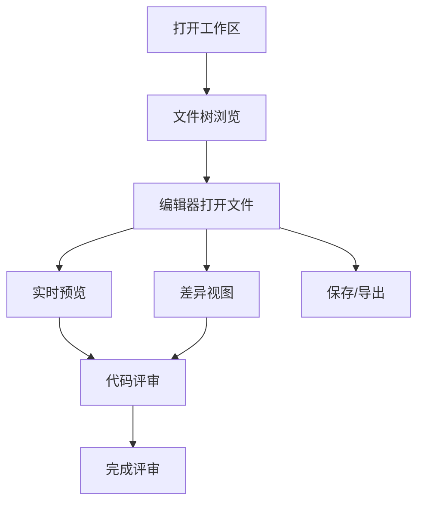

图表来源
- [src/renderer/src/lib/open-workspace-path.ts:1-200](file://src/renderer/src/lib/open-workspace-path.ts#L1-L200)
- [src/renderer/src/components/write/WriteWorkspaceView.tsx:1-200](file://src/renderer/src/components/write/WriteWorkspaceView.tsx#L1-L200)

章节来源
- [src/renderer/src/lib/open-workspace-path.ts:1-200](file://src/renderer/src/lib/open-workspace-path.ts#L1-L200)
- [src/renderer/src/components/write/WriteWorkspaceView.tsx:1-200](file://src/renderer/src/components/write/WriteWorkspaceView.tsx#L1-L200)

### Kun 运行时：智能体循环与工具系统
- Agent Loop：驱动单轮对话与多轮迭代，包含上下文估计、请求估算、令牌经济、工具调用修复与风暴抑制。
- 工具系统：内置 Bash/文件/搜索/读写工具，MCP/Web 工具提供者，能力注册中心与本地工具宿主。
- 存储适配器：文件与混合存储，支持会话与线程的持久化与迁移。
- 事件总线与门控：审批门、用户输入门、事件广播，保障可控的交互与可观测性。

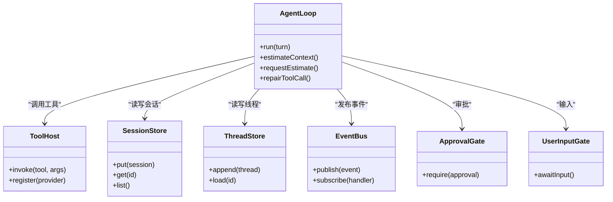

图表来源
- [kun/src/loop/agent-loop.ts:1-200](file://kun/src/loop/agent-loop.ts#L1-L200)
- [kun/src/loop/auto-model-router.ts:1-200](file://kun/src/loop/auto-model-router.ts#L1-L200)
- [kun/src/loop/tool-call-repair.ts:1-200](file://kun/src/loop/tool-call-repair.ts#L1-L200)
- [kun/src/loop/context-estimator.ts:1-200](file://kun/src/loop/context-estimator.ts#L1-L200)
- [kun/src/loop/model-request-estimator.ts:1-200](file://kun/src/loop/model-request-estimator.ts#L1-L200)
- [kun/src/loop/token-economy.ts:1-200](file://kun/src/loop/token-economy.ts#L1-L200)
- [kun/src/ports/tool-host.ts:1-200](file://kun/src/ports/tool-host.ts#L1-L200)
- [kun/src/ports/session-store.ts:1-200](file://kun/src/ports/session-store.ts#L1-L200)
- [kun/src/ports/thread-store.ts:1-200](file://kun/src/ports/thread-store.ts#L1-L200)
- [kun/src/ports/event-bus.ts:1-200](file://kun/src/ports/event-bus.ts#L1-L200)
- [kun/src/ports/approval-gate.ts:1-200](file://kun/src/ports/approval-gate.ts#L1-L200)
- [kun/src/ports/user-input-gate.ts:1-200](file://kun/src/ports/user-input-gate.ts#L1-L200)

章节来源
- [kun/src/loop/agent-loop.ts:1-200](file://kun/src/loop/agent-loop.ts#L1-L200)
- [kun/src/loop/auto-model-router.ts:1-200](file://kun/src/loop/auto-model-router.ts#L1-L200)
- [kun/src/loop/tool-call-repair.ts:1-200](file://kun/src/loop/tool-call-repair.ts#L1-L200)
- [kun/src/loop/context-estimator.ts:1-200](file://kun/src/loop/context-estimator.ts#L1-L200)
- [kun/src/loop/model-request-estimator.ts:1-200](file://kun/src/loop/model-request-estimator.ts#L1-L200)
- [kun/src/loop/token-economy.ts:1-200](file://kun/src/loop/token-economy.ts#L1-L200)
- [kun/src/ports/tool-host.ts:1-200](file://kun/src/ports/tool-host.ts#L1-L200)
- [kun/src/ports/session-store.ts:1-200](file://kun/src/ports/session-store.ts#L1-L200)
- [kun/src/ports/thread-store.ts:1-200](file://kun/src/ports/thread-store.ts#L1-L200)
- [kun/src/ports/event-bus.ts:1-200](file://kun/src/ports/event-bus.ts#L1-L200)
- [kun/src/ports/approval-gate.ts:1-200](file://kun/src/ports/approval-gate.ts#L1-L200)
- [kun/src/ports/user-input-gate.ts:1-200](file://kun/src/ports/user-input-gate.ts#L1-L200)

### Kun 运行时：存储适配器与数据模型
- 文件存储：原子写入、会话/线程文件持久化。
- 混合存储：内存+磁盘组合，兼顾性能与可靠性。
- 数据模型：会话、线程、回合、事件、条目、审批、用量等核心领域对象。

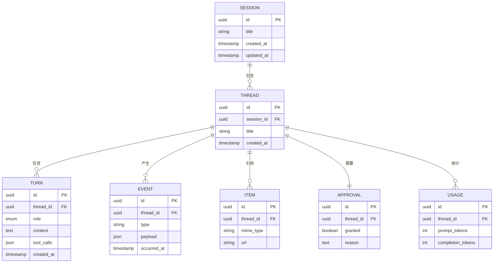

图表来源
- [kun/src/domain/session.ts:1-200](file://kun/src/domain/session.ts#L1-L200)
- [kun/src/domain/thread.ts:1-200](file://kun/src/domain/thread.ts#L1-L200)
- [kun/src/domain/turn.ts:1-200](file://kun/src/domain/turn.ts#L1-L200)
- [kun/src/domain/event.ts:1-200](file://kun/src/domain/event.ts#L1-L200)
- [kun/src/domain/item.ts:1-200](file://kun/src/domain/item.ts#L1-L200)
- [kun/src/domain/approval.ts:1-200](file://kun/src/domain/approval.ts#L1-L200)
- [kun/src/domain/usage.ts:1-200](file://kun/src/domain/usage.ts#L1-L200)

章节来源
- [kun/src/domain/session.ts:1-200](file://kun/src/domain/session.ts#L1-L200)
- [kun/src/domain/thread.ts:1-200](file://kun/src/domain/thread.ts#L1-L200)
- [kun/src/domain/turn.ts:1-200](file://kun/src/domain/turn.ts#L1-L200)
- [kun/src/domain/event.ts:1-200](file://kun/src/domain/event.ts#L1-L200)
- [kun/src/domain/item.ts:1-200](file://kun/src/domain/item.ts#L1-L200)
- [kun/src/domain/approval.ts:1-200](file://kun/src/domain/approval.ts#L1-L200)
- [kun/src/domain/usage.ts:1-200](file://kun/src/domain/usage.ts#L1-L200)

### Kun 运行时：服务器层与 HTTP 路由
- HTTP 服务器：基于 Node HTTP Server 与自定义路由，提供健康检查、会话/线程/回合、事件、内存、用量、工作区、评审、运行时信息、错误、SSE 等端点。
- SSE：向渲染器推送运行时事件，支持断线重连与订阅管理。
- CLI：提供 serve 与 agent 子命令，便于本地开发与集成测试。

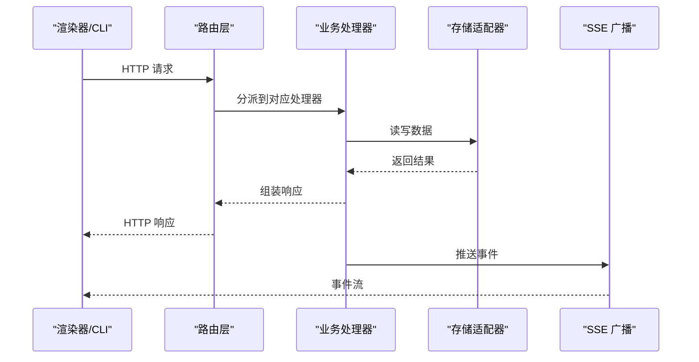

图表来源
- [kun/src/server/http-server.ts:1-200](file://kun/src/server/http-server.ts#L1-L200)
- [kun/src/server/node-http-server.ts:1-200](file://kun/src/server/node-http-server.ts#L1-L200)
- [kun/src/server/router.ts:1-200](file://kun/src/server/router.ts#L1-L200)
- [kun/src/server/sse.ts:1-200](file://kun/src/server/sse.ts#L1-L200)
- [kun/src/server/routes/sessions.ts:1-200](file://kun/src/server/routes/sessions.ts#L1-L200)
- [kun/src/server/routes/threads.ts:1-200](file://kun/src/server/routes/threads.ts#L1-L200)
- [kun/src/server/routes/turns.ts:1-200](file://kun/src/server/routes/turns.ts#L1-L200)
- [kun/src/server/routes/events.ts:1-200](file://kun/src/server/routes/events.ts#L1-L200)
- [kun/src/server/routes/memory.ts:1-200](file://kun/src/server/routes/memory.ts#L1-L200)
- [kun/src/server/routes/usage.ts:1-200](file://kun/src/server/routes/usage.ts#L1-L200)
- [kun/src/server/routes/workspace.ts:1-200](file://kun/src/server/routes/workspace.ts#L1-L200)
- [kun/src/server/routes/review.ts:1-200](file://kun/src/server/routes/review.ts#L1-L200)
- [kun/src/server/routes/runtime-info.ts:1-200](file://kun/src/server/routes/runtime-info.ts#L1-L200)
- [kun/src/server/routes/runtime-error.ts:1-200](file://kun/src/server/routes/runtime-error.ts#L1-L200)
- [kun/src/server/routes/health.ts:1-200](file://kun/src/server/routes/health.ts#L1-L200)
- [kun/src/server/routes/approvals.ts:1-200](file://kun/src/server/routes/approvals.ts#L1-L200)
- [kun/src/server/routes/user-inputs.ts:1-200](file://kun/src/server/routes/user-inputs.ts#L1-L200)
- [kun/src/server/routes/attachments.ts:1-200](file://kun/src/server/routes/attachments.ts#L1-L200)
- [kun/src/server/routes/skills.ts:1-200](file://kun/src/server/routes/skills.ts#L1-L200)
- [kun/src/server/runtime-factory.ts:1-200](file://kun/src/server/runtime-factory.ts#L1-L200)
- [kun/src/cli/serve.ts:1-200](file://kun/src/cli/serve.ts#L1-L200)
- [kun/src/cli/agent-cli.ts:1-200](file://kun/src/cli/agent-cli.ts#L1-L200)
- [kun/src/cli/serve-entry.ts:1-200](file://kun/src/cli/serve-entry.ts#L1-L200)

章节来源
- [kun/src/server/http-server.ts:1-200](file://kun/src/server/http-server.ts#L1-L200)
- [kun/src/server/node-http-server.ts:1-200](file://kun/src/server/node-http-server.ts#L1-L200)
- [kun/src/server/router.ts:1-200](file://kun/src/server/router.ts#L1-L200)
- [kun/src/server/sse.ts:1-200](file://kun/src/server/sse.ts#L1-L200)
- [kun/src/server/routes/sessions.ts:1-200](file://kun/src/server/routes/sessions.ts#L1-L200)
- [kun/src/server/routes/threads.ts:1-200](file://kun/src/server/routes/threads.ts#L1-L200)
- [kun/src/server/routes/turns.ts:1-200](file://kun/src/server/routes/turns.ts#L1-L200)
- [kun/src/server/routes/events.ts:1-200](file://kun/src/server/routes/events.ts#L1-L200)
- [kun/src/server/routes/memory.ts:1-200](file://kun/src/server/routes/memory.ts#L1-L200)
- [kun/src/server/routes/usage.ts:1-200](file://kun/src/server/routes/usage.ts#L1-L200)
- [kun/src/server/routes/workspace.ts:1-200](file://kun/src/server/routes/workspace.ts#L1-L200)
- [kun/src/server/routes/review.ts:1-200](file://kun/src/server/routes/review.ts#L1-L200)
- [kun/src/server/routes/runtime-info.ts:1-200](file://kun/src/server/routes/runtime-info.ts#L1-L200)
- [kun/src/server/routes/runtime-error.ts:1-200](file://kun/src/server/routes/runtime-error.ts#L1-L200)
- [kun/src/server/routes/health.ts:1-200](file://kun/src/server/routes/health.ts#L1-L200)
- [kun/src/server/routes/approvals.ts:1-200](file://kun/src/server/routes/approvals.ts#L1-L200)
- [kun/src/server/routes/user-inputs.ts:1-200](file://kun/src/server/routes/user-inputs.ts#L1-L200)
- [kun/src/server/routes/attachments.ts:1-200](file://kun/src/server/routes/attachments.ts#L1-L200)
- [kun/src/server/routes/skills.ts:1-200](file://kun/src/server/routes/skills.ts#L1-L200)
- [kun/src/server/runtime-factory.ts:1-200](file://kun/src/server/runtime-factory.ts#L1-L200)
- [kun/src/cli/serve.ts:1-200](file://kun/src/cli/serve.ts#L1-L200)
- [kun/src/cli/agent-cli.ts:1-200](file://kun/src/cli/agent-cli.ts#L1-L200)
- [kun/src/cli/serve-entry.ts:1-200](file://kun/src/cli/serve-entry.ts#L1-L200)

### Kun 运行时：配置与系统提示
- 配置：集中式配置加载与密钥脱敏策略，支持环境变量与文件合并。
- 系统提示：统一的系统级提示模板，用于引导模型行为与上下文约束。

章节来源
- [kun/src/config/kun-config.ts:1-200](file://kun/src/config/kun-config.ts#L1-L200)
- [kun/src/prompt/kun-system-prompt.ts:1-200](file://kun/src/prompt/kun-system-prompt.ts#L1-L200)

## 依赖分析
- 主进程对渲染器的依赖通过预加载脚本与 IPC 解耦；对 Kun 的依赖通过适配器与路由层抽象。
- 渲染器对主进程的依赖仅限于受控 IPC；对 Kun 的依赖通过运行时客户端与状态容器。
- Kun 运行时内部以端口/适配器模式解耦存储、模型与工具，路由层作为外部接口。

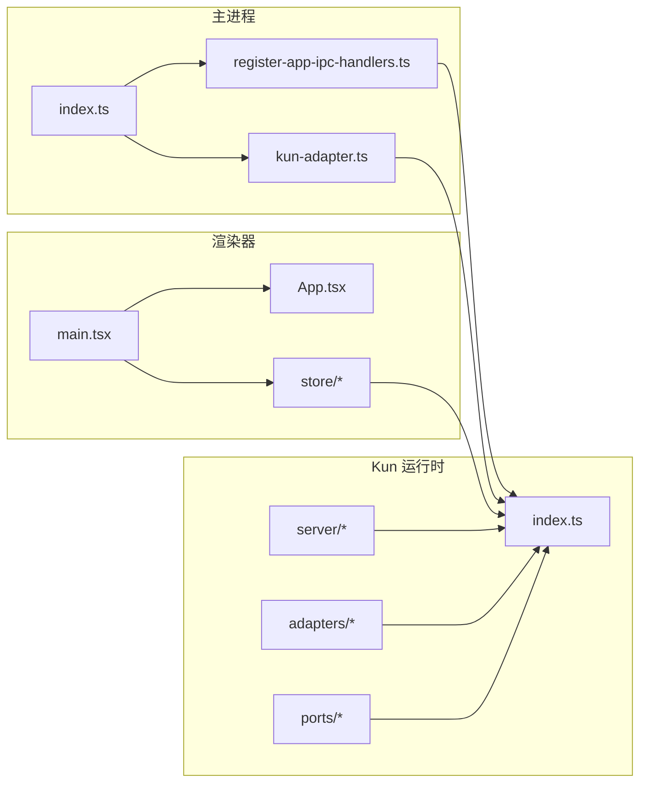

图表来源
- [src/main/index.ts:1-200](file://src/main/index.ts#L1-L200)
- [src/main/ipc/register-app-ipc-handlers.ts:1-200](file://src/main/ipc/register-app-ipc-handlers.ts#L1-L200)
- [src/main/runtime/kun-adapter.ts:1-200](file://src/main/runtime/kun-adapter.ts#L1-L200)
- [src/renderer/src/main.tsx:1-120](file://src/renderer/src/main.tsx#L1-L120)
- [src/renderer/src/App.tsx:1-200](file://src/renderer/src/App.tsx#L1-L200)
- [kun/src/index.ts:1-200](file://kun/src/index.ts#L1-L200)

章节来源
- [src/main/index.ts:1-200](file://src/main/index.ts#L1-L200)
- [src/main/ipc/register-app-ipc-handlers.ts:1-200](file://src/main/ipc/register-app-ipc-handlers.ts#L1-L200)
- [src/main/runtime/kun-adapter.ts:1-200](file://src/main/runtime/kun-adapter.ts#L1-L200)
- [src/renderer/src/main.tsx:1-120](file://src/renderer/src/main.tsx#L1-L120)
- [src/renderer/src/App.tsx:1-200](file://src/renderer/src/App.tsx#L1-L200)
- [kun/src/index.ts:1-200](file://kun/src/index.ts#L1-L200)

## 性能考虑
- 缓存策略：LRU/TTL 缓存、不可变前缀缓存、工具目录指纹，降低重复计算与 IO。
- 上下文压缩：自动模型路由、上下文估计、请求估算与令牌经济，平衡成本与质量。
- 工具风暴抑制：工具风暴 breaker 与调用修复，防止过度工具调用导致的资源浪费。
- SSE 推送：事件流按需推送，减少轮询开销。

章节来源
- [kun/src/cache/lru-cache.ts:1-200](file://kun/src/cache/lru-cache.ts#L1-L200)
- [kun/src/cache/ttl-lru-cache.ts:1-200](file://kun/src/cache/ttl-lru-cache.ts#L1-L200)
- [kun/src/cache/immutable-prefix.ts:1-200](file://kun/src/cache/immutable-prefix.ts#L1-L200)
- [kun/src/cache/prefix-volatility.ts:1-200](file://kun/src/cache/prefix-volatility.ts#L1-L200)
- [kun/src/cache/tool-catalog-fingerprint.ts:1-200](file://kun/src/cache/tool-catalog-fingerprint.ts#L1-L200)
- [kun/src/loop/auto-model-router.ts:1-200](file://kun/src/loop/auto-model-router.ts#L1-L200)
- [kun/src/loop/context-estimator.ts:1-200](file://kun/src/loop/context-estimator.ts#L1-L200)
- [kun/src/loop/model-request-estimator.ts:1-200](file://kun/src/loop/model-request-estimator.ts#L1-L200)
- [kun/src/loop/token-economy.ts:1-200](file://kun/src/loop/token-economy.ts#L1-L200)
- [kun/src/loop/tool-storm-breaker.ts:1-200](file://kun/src/loop/tool-storm-breaker.ts#L1-L200)
- [kun/src/server/sse.ts:1-200](file://kun/src/server/sse.ts#L1-L200)

## 故障排查指南
- IPC 类型校验失败：检查请求/响应 Schema 是否匹配，确认预加载脚本暴露的通道一致。
- 工具调用异常：查看工具调用修复与风暴抑制逻辑，核对工具参数与返回值格式。
- 存储写入失败：检查文件存储的原子写入与混合存储的回退策略。
- SSE 订阅无事件：确认路由层 SSE 广播是否启用，客户端连接状态与重连策略。
- 运行时错误上报：通过运行时错误路由与记录器定位问题来源与堆栈。

章节来源
- [src/main/ipc/app-ipc-schemas.ts:1-200](file://src/main/ipc/app-ipc-schemas.ts#L1-L200)
- [kun/src/loop/tool-call-repair.ts:1-200](file://kun/src/loop/tool-call-repair.ts#L1-L200)
- [kun/src/adapters/file/atomic-write.ts:1-200](file://kun/src/adapters/file/atomic-write.ts#L1-L200)
- [kun/src/server/routes/runtime-error.ts:1-200](file://kun/src/server/routes/runtime-error.ts#L1-L200)
- [kun/src/services/runtime-event-recorder.ts:1-200](file://kun/src/services/runtime-event-recorder.ts#L1-L200)

## 结论
DeepSeek GUI 通过清晰的分层与端口/适配器模式，实现了主进程与渲染器的安全解耦、Kun 运行时的高内聚低耦合。智能体循环与工具系统提供了强大的自动化能力，服务器层与 SSE 支持了可观测与扩展。建议在生产环境中重点关注 IPC 类型安全、工具调用稳定性与缓存命中率，并结合错误上报与遥测完善可观测体系。

## 附录
- 配置示例：参考共享配置与运行时配置加载，确保密钥脱敏与环境变量覆盖顺序正确。
- 接口定义：IPC Schema、HTTP 路由与 SSE 事件类型，均在对应模块中集中定义，便于版本演进与契约管理。
- 错误处理：统一的错误路由、事件记录器与门控机制，确保异常可追踪、可恢复。

章节来源
- [src/shared/app-settings.ts:1-200](file://src/shared/app-settings.ts#L1-L200)
- [src/shared/kun-endpoints.ts:1-200](file://src/shared/kun-endpoints.ts#L1-L200)
- [kun/src/config/kun-config.ts:1-200](file://kun/src/config/kun-config.ts#L1-L200)
- [kun/src/server/routes/runtime-error.ts:1-200](file://kun/src/server/routes/runtime-error.ts#L1-L200)
- [kun/src/services/runtime-event-recorder.ts:1-200](file://kun/src/services/runtime-event-recorder.ts#L1-L200)