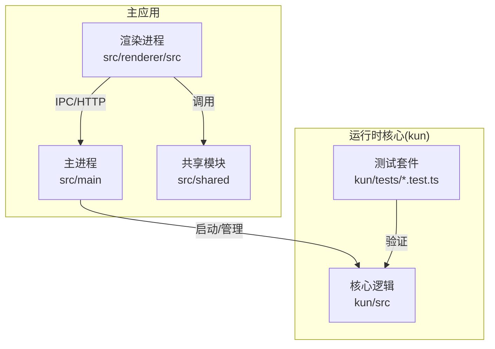
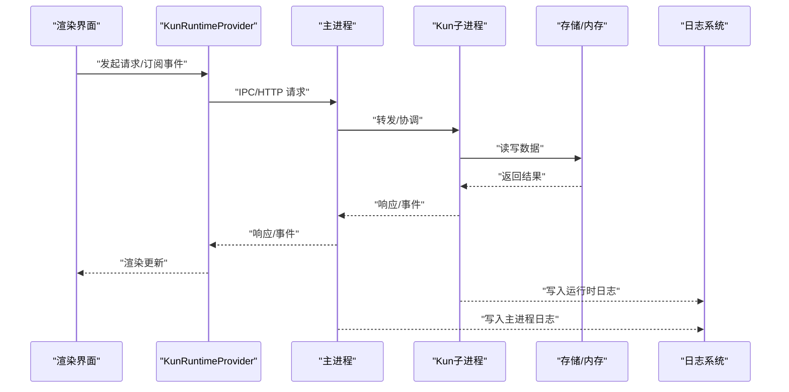
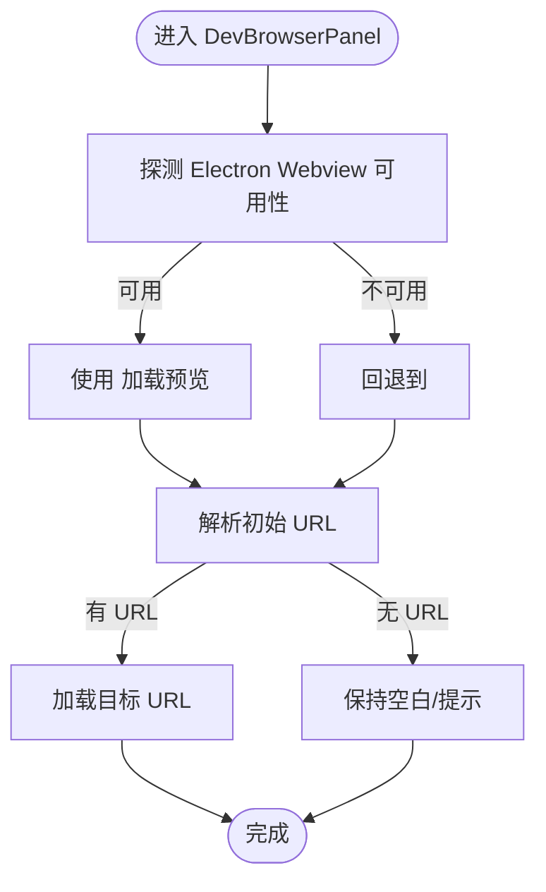
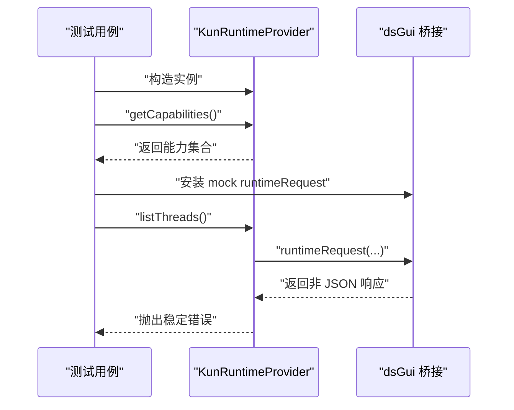
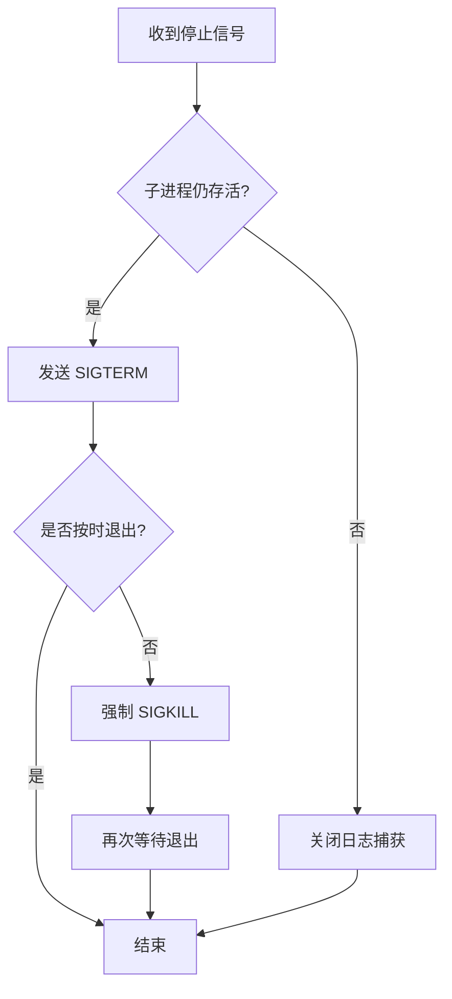
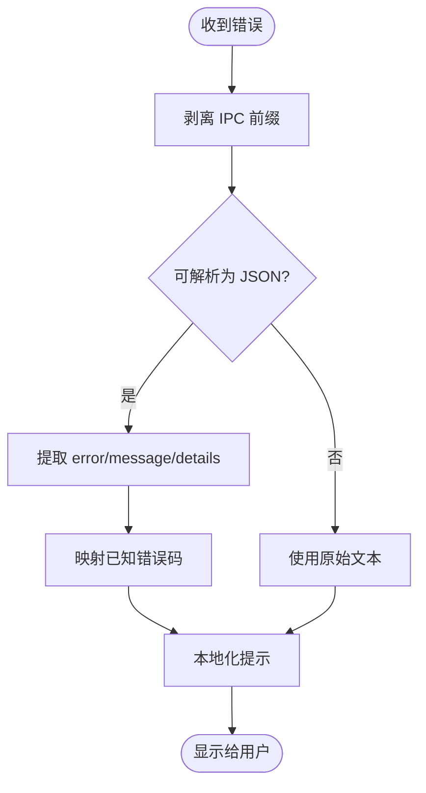
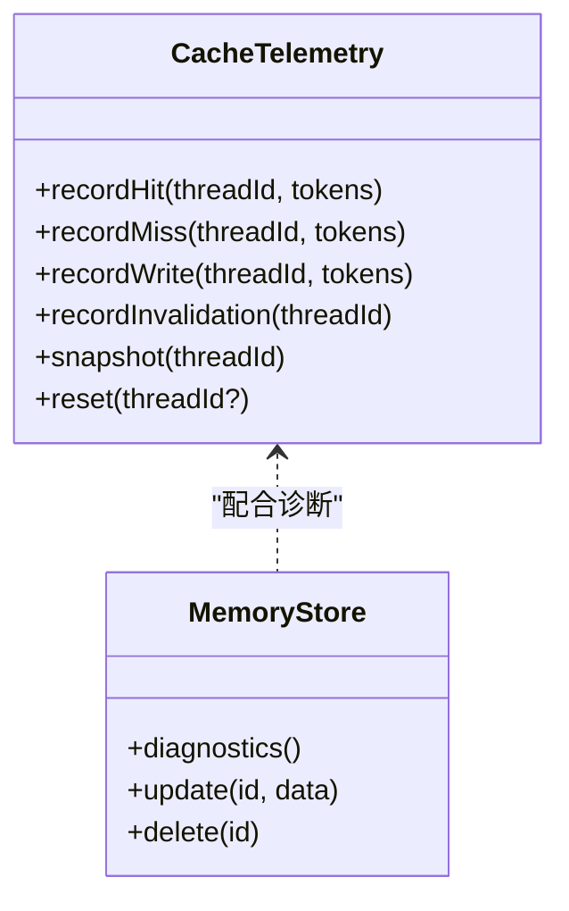
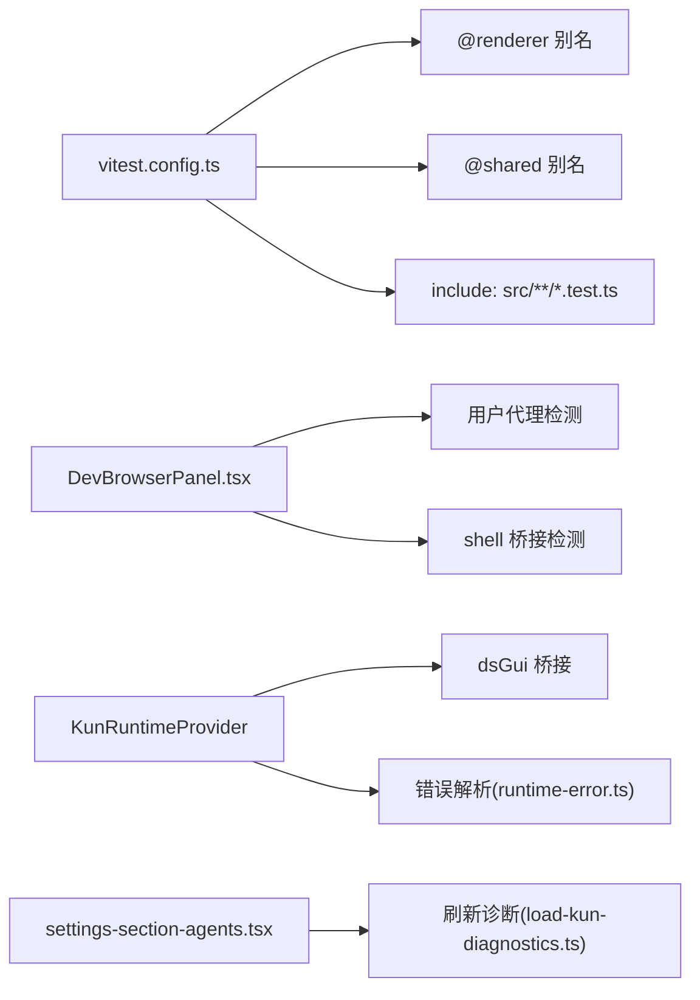

# 调试与测试

<cite>
**本文引用的文件**
- [vitest.config.ts](file://vitest.config.ts)
- [DevBrowserPanel.tsx](file://src/renderer/src/components/DevBrowserPanel.tsx)
- [DevBrowserPanel.test.ts](file://src/renderer/src/components/DevBrowserPanel.test.ts)
- [kun-runtime.test.ts](file://src/renderer/src/agent/kun-runtime.test.ts)
- [registry.ts](file://src/renderer/src/agent/registry.ts)
- [settings-section-agents.tsx](file://src/renderer/src/components/settings-section-agents.tsx)
- [load-kun-diagnostics.ts](file://src/renderer/src/lib/load-kun-diagnostics.ts)
- [kun-process.ts](file://src/main/kun-process.ts)
- [kun-health.test.ts](file://src/main/kun-health.test.ts)
- [runtime-error.ts](file://src/shared/runtime-error.ts)
- [format-runtime-error.ts](file://src/renderer/src/lib/format-runtime-error.ts)
- [logger.ts](file://src/main/logger.ts)
- [cache-telemetry.ts](file://kun/src/telemetry/cache-telemetry.ts)
- [file-session-store.ts](file://kun/src/adapters/file/file-session-store.ts)
- [memory-store.ts](file://kun/src/memory/memory-store.ts)
- [memory.ts](file://kun/src/server/routes/memory.ts)
- [builtin-tool-utils.test.ts](file://kun/src/adapters/tool/builtin-tool-utils.test.ts)
- [kun-config.test.ts](file://kun/src/config/kun-config.test.ts)
- [atomic-write.test.ts](file://kun/tests/atomic-write.test.ts)
- [attachment-store.test.ts](file://kun/tests/attachment-store.test.ts)
- [auto-model-router.test.ts](file://kun/tests/auto-model-router.test.ts)
- [builtin-tools.test.ts](file://kun/tests/builtin-tools.test.ts)
- [cache.test.ts](file://kun/tests/cache.test.ts)
- [capability-registry.test.ts](file://kun/tests/capability-registry.test.ts)
- [child-agent-executor.test.ts](file://kun/tests/child-agent-executor.test.ts)
- [cli-agent.test.ts](file://kun/tests/cli-agent.test.ts)
- [contracts.test.ts](file://kun/tests/contracts.test.ts)
- [create-plan-tool.test.ts](file://kun/tests/create-plan-tool.test.ts)
- [delegation-runtime.test.ts](file://kun/tests/delegation-runtime.test.ts)
- [domain.test.ts](file://kun/tests/domain.test.ts)
- [file-session-store.test.ts](file://kun/tests/file-session-store.test.ts)
- [goal-tools.test.ts](file://kun/tests/goal-tools.test.ts)
- [http-server.test.ts](file://kun/tests/http-server.test.ts)
- [hybrid-store.test.ts](file://kun/tests/hybrid-store.test.ts)
- [loop.test.ts](file://kun/tests/loop.test.ts)
- [mcp-config.test.ts](file://kun/tests/mcp-config.test.ts)
- [mcp-tool-provider.test.ts](file://kun/tests/mcp-tool-provider.test.ts)
- [memory-store.test.ts](file://kun/tests/memory-store.test.ts)
- [model-client.test.ts](file://kun/tests/model-client.test.ts)
- [model-history-repair.test.ts](file://kun/tests/model-history-repair.test.ts)
- [output-accumulator.test.ts](file://kun/tests/output-accumulator.test.ts)
- [ports.test.ts](file://kun/tests/ports.test.ts)
- [read-json-body.test.ts](file://kun/tests/read-json-body.test.ts)
- [request-history-hygiene.test.ts](file://kun/tests/request-history-hygiene.test.ts)
- [review.test.ts](file://kun/tests/review.test.ts)
- [runtime-event-reducer.test.ts](file://kun/tests/runtime-event-reducer.test.ts)
- [runtime-factory.test.ts](file://kun/tests/runtime-factory.test.ts)
- [skill-runtime.test.ts](file://kun/tests/skill-runtime.test.ts)
- [thread-service.test.ts](file://kun/tests/thread-service.test.ts)
- [todo-tools.test.ts](file://kun/tests/todo-tools.test.ts)
- [token-economy.test.ts](file://kun/tests/token-economy.test.ts)
- [tool-call-repair.test.ts](file://kun/tests/tool-call-repair.test.ts)
- [tool-storm-breaker.test.ts](file://kun/tests/tool-storm-breaker.test.ts)
- [usage-service.test.ts](file://kun/tests/usage-service.test.ts)
- [web-tool-provider.test.ts](file://kun/tests/web-tool-provider.test.ts)
</cite>

## 目录
1. [简介](#简介)
2. [项目结构](#项目结构)
3. [核心组件](#核心组件)
4. [架构总览](#架构总览)
5. [详细组件分析](#详细组件分析)
6. [依赖关系分析](#依赖关系分析)
7. [性能考量](#性能考量)
8. [故障排查指南](#故障排查指南)
9. [结论](#结论)
10. [附录](#附录)

## 简介
本指南面向 DeepSeek GUI 的开发者，系统化地介绍调试与测试方法，覆盖以下方面：
- 调试工具：Electron 开发者工具、React 开发者工具、Kun 运行时调试
- 测试体系：单元测试、集成测试、端到端测试（含 Vitest 配置）
- 覆盖率与性能：覆盖率分析、性能测试、内存泄漏检测建议
- 常见问题：诊断流程、日志分析、错误排查策略
- 规范与实践：测试用例编写规范、Mock 使用、异步测试处理

## 项目结构
DeepSeek GUI 采用多包结构，前端 Electron 应用位于根目录，运行时核心逻辑在子包 kun 中。测试主要集中在 src 与 kun/tests 下，使用 Vitest 作为测试运行器。

图示来源
- [vitest.config.ts:1-15](file://vitest.config.ts#L1-L15)

章节来源
- [vitest.config.ts:1-15](file://vitest.config.ts#L1-L15)

## 核心组件
- 渲染进程调试与预览：DevBrowserPanel 提供 Electron Webview/iframe 预览能力，并支持环境探测与初始 URL 解析。
- 运行时代理与健康检查：KunRuntimeProvider 通过本地 HTTP/SSE 能力与后端交互；主进程对 Kun 子进程进行生命周期管理与日志捕获。
- 错误格式化与诊断：统一解析运行时错误体，提取结构化错误码与消息；设置页提供“刷新诊断”入口。
- 日志系统：主进程集中写入与轮转日志，便于问题定位。
- Telemetry 与存储：缓存命中统计、会话与内存存储的诊断接口，辅助性能与稳定性分析。

章节来源
- [DevBrowserPanel.tsx:119-136](file://src/renderer/src/components/DevBrowserPanel.tsx#L119-L136)
- [kun-runtime.test.ts:57-85](file://src/renderer/src/agent/kun-runtime.test.ts#L57-L85)
- [kun-process.ts:565-600](file://src/main/kun-process.ts#L565-L600)
- [runtime-error.ts:102-148](file://src/shared/runtime-error.ts#L102-L148)
- [settings-section-agents.tsx:1128-1150](file://src/renderer/src/components/settings-section-agents.tsx#L1128-L1150)
- [logger.ts:78-115](file://src/main/logger.ts#L78-L115)
- [cache-telemetry.ts:1-74](file://kun/src/telemetry/cache-telemetry.ts#L1-L74)
- [memory.ts:25-56](file://kun/src/server/routes/memory.ts#L25-L56)

## 架构总览
下图展示从渲染进程发起请求到运行时后端、再到存储与 Telemetry 的关键路径，以及错误与日志的回流。

图示来源
- [kun-runtime.test.ts:57-85](file://src/renderer/src/agent/kun-runtime.test.ts#L57-L85)
- [kun-process.ts:565-600](file://src/main/kun-process.ts#L565-L600)
- [memory.ts:25-56](file://kun/src/server/routes/memory.ts#L25-L56)
- [logger.ts:78-115](file://src/main/logger.ts#L78-L115)

## 详细组件分析

### 渲染进程调试与预览（DevBrowserPanel）
- 功能要点
  - 环境探测：判断是否可使用 Electron Webview（需要 shell 桥接与 Electron 用户代理）。
  - 初始 URL 解析：优先级为“首选 URL > 已存储 URL > 最新检测 URL”。
  - 容错与回退：当无法满足条件时回退到 iframe 或保持空白。
- 测试关注点
  - 环境探测函数的边界条件（存在/缺失 shell 桥接、用户代理是否包含 Electron）。
  - URL 解析函数在空输入、无效 URL、相对路径等场景的行为。
- 调试建议
  - 在开发模式下打开 Electron 开发者工具，切换到“Elements/Console/Network”标签。
  - 使用 DevTools 的“设备模式”与“网络拦截”观察预览页面加载与资源请求。
  - 结合设置页“刷新诊断”触发运行时诊断，辅助定位预览失败原因。

图示来源
- [DevBrowserPanel.tsx:119-136](file://src/renderer/src/components/DevBrowserPanel.tsx#L119-L136)
- [DevBrowserPanel.test.ts:1-41](file://src/renderer/src/components/DevBrowserPanel.test.ts#L1-L41)

章节来源
- [DevBrowserPanel.tsx:119-136](file://src/renderer/src/components/DevBrowserPanel.tsx#L119-L136)
- [DevBrowserPanel.test.ts:1-41](file://src/renderer/src/components/DevBrowserPanel.test.ts#L1-L41)

### 运行时代理与健康检查（KunRuntimeProvider）
- 能力暴露：支持流式响应、中断、审批等能力。
- 健康检查：区分 Kun serve 响应与其他服务响应，避免误判。
- 错误处理：对非 JSON 响应给出稳定错误信息，便于上层统一处理。
- 测试要点
  - 能力标志位断言。
  - 非法 JSON 响应的异常抛出与错误消息稳定性。
  - 健康响应体识别正确性。

图示来源
- [kun-runtime.test.ts:57-85](file://src/renderer/src/agent/kun-runtime.test.ts#L57-L85)

章节来源
- [kun-runtime.test.ts:57-85](file://src/renderer/src/agent/kun-runtime.test.ts#L57-L85)
- [kun-health.test.ts:1-21](file://src/main/kun-health.test.ts#L1-L21)

### 主进程与运行时生命周期（Kun 子进程）
- 关键行为
  - 平滑停止：先发送 SIGTERM，超时后强制 SIGKILL，并等待退出。
  - 日志捕获：停止时关闭日志捕获句柄，避免资源泄露。
  - 设置变更：指纹化 settings，去抖动重启，保证幂等与一致性。
- 调试建议
  - 在设置变更频繁时观察“正在应用设置”的状态，确认去抖动生效。
  - 若出现“Kun 未退出”或“日志丢失”，检查停止流程与捕获句柄释放。

图示来源
- [kun-process.ts:565-600](file://src/main/kun-process.ts#L565-L600)

章节来源
- [kun-process.ts:565-600](file://src/main/kun-process.ts#L565-L600)
- [index.ts:417-456](file://src/main/index.ts#L417-L456)

### 错误格式化与诊断（运行时错误）
- 统一解析：从 IPC 包装后的字符串中提取 JSON 错误体，兼容多种嵌套形式。
- 错误码映射：识别 fetch_failed、missing_api_key 等常见错误码，提供本地化提示。
- 诊断入口：设置页提供“刷新诊断”按钮，触发运行时诊断刷新。

图示来源
- [runtime-error.ts:102-148](file://src/shared/runtime-error.ts#L102-L148)
- [format-runtime-error.ts:1-44](file://src/renderer/src/lib/format-runtime-error.ts#L1-L44)
- [settings-section-agents.tsx:1128-1150](file://src/renderer/src/components/settings-section-agents.tsx#L1128-L1150)

章节来源
- [runtime-error.ts:102-148](file://src/shared/runtime-error.ts#L102-L148)
- [format-runtime-error.ts:1-44](file://src/renderer/src/lib/format-runtime-error.ts#L1-L44)
- [settings-section-agents.tsx:1128-1150](file://src/renderer/src/components/settings-section-agents.tsx#L1128-L1150)

### Telemetry 与存储诊断
- 缓存命中统计：按线程聚合命中/未命中/写入/失效计数，计算命中率。
- 会话与内存存储：提供诊断快照（启用状态、根目录、活跃/墓碑数量、最后注入 ID 列表）。
- 服务器路由：提供内存更新、删除与诊断接口，便于集成测试与端到端验证。

图示来源
- [cache-telemetry.ts:1-74](file://kun/src/telemetry/cache-telemetry.ts#L1-L74)
- [memory-store.ts:102-136](file://kun/src/memory/memory-store.ts#L102-L136)
- [memory.ts:25-56](file://kun/src/server/routes/memory.ts#L25-L56)

章节来源
- [cache-telemetry.ts:1-74](file://kun/src/telemetry/cache-telemetry.ts#L1-L74)
- [memory-store.ts:102-136](file://kun/src/memory/memory-store.ts#L102-L136)
- [memory.ts:25-56](file://kun/src/server/routes/memory.ts#L25-L56)

## 依赖关系分析
- 测试运行器：Vitest 配置别名 @renderer 与 @shared，测试范围限定在 src/**/*.test.ts。
- 组件耦合：DevBrowserPanel 依赖用户代理与 shell 桥接；KunRuntimeProvider 依赖 dsGui 桥接；设置页依赖诊断刷新逻辑。
- 外部依赖：Electron 开发者工具、React 开发者工具（浏览器扩展）、日志系统。

图示来源
- [vitest.config.ts:1-15](file://vitest.config.ts#L1-L15)
- [DevBrowserPanel.tsx:119-136](file://src/renderer/src/components/DevBrowserPanel.tsx#L119-L136)
- [kun-runtime.test.ts:57-85](file://src/renderer/src/agent/kun-runtime.test.ts#L57-L85)
- [runtime-error.ts:102-148](file://src/shared/runtime-error.ts#L102-L148)
- [settings-section-agents.tsx:1128-1150](file://src/renderer/src/components/settings-section-agents.tsx#L1128-L1150)

章节来源
- [vitest.config.ts:1-15](file://vitest.config.ts#L1-L15)
- [DevBrowserPanel.tsx:119-136](file://src/renderer/src/components/DevBrowserPanel.tsx#L119-L136)
- [kun-runtime.test.ts:57-85](file://src/renderer/src/agent/kun-runtime.test.ts#L57-L85)
- [runtime-error.ts:102-148](file://src/shared/runtime-error.ts#L102-L148)
- [settings-section-agents.tsx:1128-1150](file://src/renderer/src/components/settings-section-agents.tsx#L1128-L1150)

## 性能考量
- 缓存命中率：通过 CacheTelemetry 的 snapshot 计算命中率，结合会话历史评估上下文压缩效果。
- 存储与 IO：file-session-store 的使用与 coalescing 策略影响磁盘 IO；注意保留策略与事件合并。
- Telemetry 采集：避免在高频事件中重复计算，必要时进行批量汇总。
- 日志开销：主进程日志写入与轮转需控制频率与大小，防止阻塞主线程。

章节来源
- [cache-telemetry.ts:42-59](file://kun/src/telemetry/cache-telemetry.ts#L42-L59)
- [file-session-store.ts:178-214](file://kun/src/adapters/file/file-session-store.ts#L178-L214)
- [logger.ts:78-115](file://src/main/logger.ts#L78-L115)

## 故障排查指南
- Electron 开发者工具
  - 打开菜单 View → Toggle Developer Tools，切换 Console/Elements/Network/Performance 标签。
  - 观察预览页面加载、资源请求与 SSE 事件流。
- React 开发者工具
  - 安装 React DevTools 扩展，查看组件树、Props/State 与渲染次数。
- Kun 运行时调试
  - 使用设置页“刷新诊断”触发运行时诊断，核对诊断输出。
  - 若出现“无效线程列表响应”，检查后端返回 JSON 格式与字段完整性。
- 日志分析
  - 主进程日志：定位错误类别与详细信息；注意 detail 字段的序列化长度限制。
  - 运行时日志：停止流程中确保日志捕获句柄被正确关闭，避免残留。
- 常见错误
  - fetch_failed：检查网络连通性、代理与证书。
  - missing_api_key：确认密钥配置与环境变量。
  - tool not found：检查工具注册与权限。

章节来源
- [settings-section-agents.tsx:1128-1150](file://src/renderer/src/components/settings-section-agents.tsx#L1128-L1150)
- [kun-runtime.test.ts:72-85](file://src/renderer/src/agent/kun-runtime.test.ts#L72-L85)
- [runtime-error.ts:102-148](file://src/shared/runtime-error.ts#L102-L148)
- [format-runtime-error.ts:32-44](file://src/renderer/src/lib/format-runtime-error.ts#L32-L44)
- [logger.ts:78-115](file://src/main/logger.ts#L78-L115)
- [kun-process.ts:565-600](file://src/main/kun-process.ts#L565-L600)

## 结论
通过 Electron/React 开发者工具、统一的错误解析与诊断入口、完善的日志系统，以及覆盖单元/集成/端到端的测试体系，DeepSeek GUI 能够高效定位问题并持续提升质量。建议在日常开发中：
- 将 Mock 与断言分离，明确边界与副作用。
- 对异步流程使用稳定的延迟与重试策略。
- 利用 Telemetry 与诊断接口持续监控性能与稳定性。

## 附录

### 测试编写规范与实践
- 单元测试
  - 使用 Vitest 断言与 expect，优先覆盖边界与异常分支。
  - 对纯函数与工具类（如 URL 解析、错误解析）进行独立测试。
- 集成测试
  - 通过 http-server-test-harness 启动最小化 HTTP 服务，验证路由与中间件行为。
  - 使用 loop-test-harness 验证循环与事件流。
- 端到端测试
  - 使用 DevBrowserPanel 的环境探测与 URL 解析逻辑，模拟真实预览场景。
  - 结合设置页诊断刷新，验证运行时健康状态。
- Mock 对象
  - 使用 vi.fn/mock 替换外部依赖（如 dsGui 桥接），确保测试隔离。
  - 在 afterEach 中清理全局桩与缓存，避免跨用例污染。
- 异步测试
  - 使用 async/await 与 expect().resolves/rejects。
  - 对长时间运行的任务设置合理超时与重试。

章节来源
- [DevBrowserPanel.test.ts:1-41](file://src/renderer/src/components/DevBrowserPanel.test.ts#L1-L41)
- [kun-runtime.test.ts:57-85](file://src/renderer/src/agent/kun-runtime.test.ts#L57-L85)
- [registry.ts:12-14](file://src/renderer/src/agent/registry.ts#L12-L14)
- [http-server.test.ts](file://kun/tests/http-server.test.ts)
- [loop.test.ts](file://kun/tests/loop.test.ts)

### 测试用例清单（按模块）
- 渲染组件与工具
  - DevBrowserPanel：环境探测、URL 解析
  - browser-storage：存储适配与安全读写
  - format-runtime-error：错误码识别与本地化
- 运行时与代理
  - KunRuntimeProvider：能力暴露、错误处理
  - registry：提供者缓存与重置
- 主进程与健康
  - kun-health：健康响应体识别
  - kun-process：子进程停止与日志捕获
- 存储与 Telemetry
  - cache-telemetry：命中率统计
  - memory-store：诊断与 CRUD
  - file-session-store：使用事件压缩与保留策略
- 其他核心模块
  - builtin-tool-utils、builtin-tools、mcp-tool-provider、web-tool-provider 等工具链测试
  - config、contracts、ports、usage-service、thread-service 等契约与服务测试

章节来源
- [DevBrowserPanel.test.ts:1-41](file://src/renderer/src/components/DevBrowserPanel.test.ts#L1-L41)
- [kun-runtime.test.ts:57-85](file://src/renderer/src/agent/kun-runtime.test.ts#L57-L85)
- [kun-health.test.ts:1-21](file://src/main/kun-health.test.ts#L1-L21)
- [kun-process.ts:565-600](file://src/main/kun-process.ts#L565-L600)
- [cache-telemetry.ts:1-74](file://kun/src/telemetry/cache-telemetry.ts#L1-L74)
- [memory-store.ts:102-136](file://kun/src/memory/memory-store.ts#L102-L136)
- [file-session-store.ts:178-214](file://kun/src/adapters/file/file-session-store.ts#L178-L214)
- [builtin-tool-utils.test.ts](file://kun/src/adapters/tool/builtin-tool-utils.test.ts)
- [builtin-tools.test.ts](file://kun/tests/builtin-tools.test.ts)
- [mcp-tool-provider.test.ts](file://kun/tests/mcp-tool-provider.test.ts)
- [web-tool-provider.test.ts](file://kun/tests/web-tool-provider.test.ts)
- [kun-config.test.ts](file://kun/src/config/kun-config.test.ts)
- [atomic-write.test.ts](file://kun/tests/atomic-write.test.ts)
- [attachment-store.test.ts](file://kun/tests/attachment-store.test.ts)
- [auto-model-router.test.ts](file://kun/tests/auto-model-router.test.ts)
- [cache.test.ts](file://kun/tests/cache.test.ts)
- [capability-registry.test.ts](file://kun/tests/capability-registry.test.ts)
- [child-agent-executor.test.ts](file://kun/tests/child-agent-executor.test.ts)
- [cli-agent.test.ts](file://kun/tests/cli-agent.test.ts)
- [contracts.test.ts](file://kun/tests/contracts.test.ts)
- [create-plan-tool.test.ts](file://kun/tests/create-plan-tool.test.ts)
- [delegation-runtime.test.ts](file://kun/tests/delegation-runtime.test.ts)
- [domain.test.ts](file://kun/tests/domain.test.ts)
- [file-session-store.test.ts](file://kun/tests/file-session-store.test.ts)
- [goal-tools.test.ts](file://kun/tests/goal-tools.test.ts)
- [hybrid-store.test.ts](file://kun/tests/hybrid-store.test.ts)
- [loop.test.ts](file://kun/tests/loop.test.ts)
- [mcp-config.test.ts](file://kun/tests/mcp-config.test.ts)
- [memory-store.test.ts](file://kun/tests/memory-store.test.ts)
- [model-client.test.ts](file://kun/tests/model-client.test.ts)
- [model-history-repair.test.ts](file://kun/tests/model-history-repair.test.ts)
- [output-accumulator.test.ts](file://kun/tests/output-accumulator.test.ts)
- [ports.test.ts](file://kun/tests/ports.test.ts)
- [read-json-body.test.ts](file://kun/tests/read-json-body.test.ts)
- [request-history-hygiene.test.ts](file://kun/tests/request-history-hygiene.test.ts)
- [review.test.ts](file://kun/tests/review.test.ts)
- [runtime-event-reducer.test.ts](file://kun/tests/runtime-event-reducer.test.ts)
- [runtime-factory.test.ts](file://kun/tests/runtime-factory.test.ts)
- [skill-runtime.test.ts](file://kun/tests/skill-runtime.test.ts)
- [thread-service.test.ts](file://kun/tests/thread-service.test.ts)
- [todo-tools.test.ts](file://kun/tests/todo-tools.test.ts)
- [token-economy.test.ts](file://kun/tests/token-economy.test.ts)
- [tool-call-repair.test.ts](file://kun/tests/tool-call-repair.test.ts)
- [tool-storm-breaker.test.ts](file://kun/tests/tool-storm-breaker.test.ts)
- [usage-service.test.ts](file://kun/tests/usage-service.test.ts)