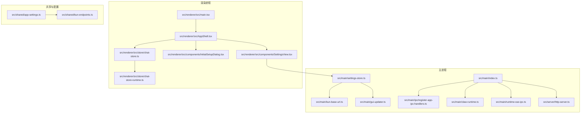
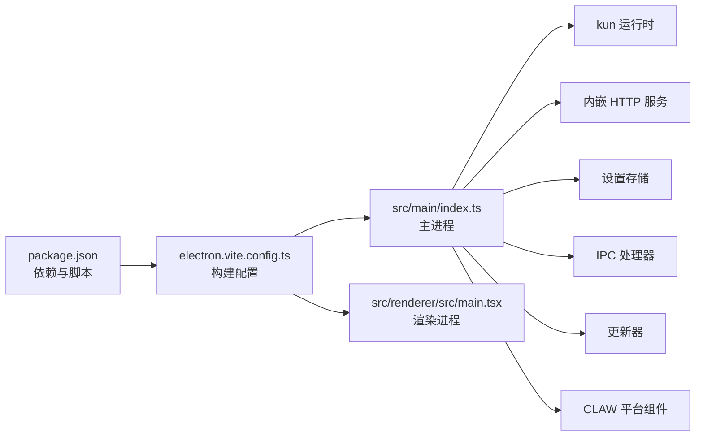

# 快速开始

<cite>
**本文引用的文件**
- [package.json](file://package.json)
- [README.en.md](file://README.en.md)
- [electron.vite.config.ts](file://electron.vite.config.ts)
- [src/main/index.ts](file://src/main/index.ts)
- [src/renderer/src/main.tsx](file://src/renderer/src/main.tsx)
- [src/shared/app-settings.ts](file://src/shared/app-settings.ts)
- [src/shared/kun-endpoints.ts](file://src/shared/kun-endpoints.ts)
- [src/main/settings-store.ts](file://src/main/settings-store.ts)
- [src/main/kun-base-url.ts](file://src/main/kun-base-url.ts)
- [src/main/claw-platform-install.ts](file://src/main/claw-platform-install.ts)
- [src/main/claw-runtime.ts](file://src/main/claw-runtime.ts)
- [src/main/runtime-sse-ipc.ts](file://src/main/runtime-sse-ipc.ts)
- [src/main/gui-updater.ts](file://src/main/gui-updater.ts)
- [src/main/ipc/register-app-ipc-handlers.ts](file://src/main/ipc/register-app-ipc-handlers.ts)
- [src/renderer/src/AppShell.tsx](file://src/renderer/src/AppShell.tsx)
- [src/renderer/src/components/InitialSetupDialog.tsx](file://src/renderer/src/components/InitialSetupDialog.tsx)
- [src/renderer/src/components/SettingsView.tsx](file://src/renderer/src/components/SettingsView.tsx)
- [src/renderer/src/lib/workspace-path.ts](file://src/renderer/src/lib/workspace-path.ts)
- [src/renderer/src/lib/open-workspace-path.ts](file://src/renderer/src/lib/open-workspace-path.ts)
- [src/renderer/src/store/chat-store.ts](file://src/renderer/src/store/chat-store.ts)
- [src/renderer/src/store/chat-store-runtime.ts](file://src/renderer/src/store/chat-store-runtime.ts)
- [src/renderer/src/hooks/use-daily-usage.ts](file://src/renderer/src/hooks/use-daily-usage.ts)
- [src/renderer/src/hooks/use-model-usage.ts](file://src/renderer/src/hooks/use-model-usage.ts)
- [src/renderer/src/hooks/use-thread-usage.ts](file://src/renderer/src/hooks/use-thread-usage.ts)
- [src/server/index.ts](file://src/server/index.ts)
- [src/server/http-server.ts](file://src/server/http-server.ts)
- [src/server/routes/server-runtime.ts](file://src/server/routes/server-runtime.ts)
- [src/server/runtime-factory.ts](file://src/server/runtime-factory.ts)
- [kun/package.json](file://kun/package.json)
- [kun/README.md](file://kun/README.md)
- [scripts/release-win.ps1](file://scripts/release-win.ps1)
- [scripts/release-win.sh](file://scripts/release-win.sh)
- [scripts/release-mac.sh](file://scripts/release-mac.sh)
- [scripts/zip-mac-app.cjs](file://scripts/zip-mac-app.cjs)
- [electron-builder.config.cjs](file://electron-builder.config.cjs)
</cite>

## 目录
1. [简介](#简介)
2. [系统要求](#系统要求)
3. [安装方式](#安装方式)
4. [首次启动与初始配置](#首次启动与初始配置)
5. [核心组件与架构概览](#核心组件与架构概览)
6. [详细组件解析](#详细组件解析)
7. [依赖关系分析](#依赖关系分析)
8. [性能与资源使用](#性能与资源使用)
9. [故障排除](#故障排除)
10. [结语](#结语)

## 简介
DeepSeek GUI 是一个基于 Electron + React 的桌面应用，提供对话、写作、计划、调度等多模态工作流能力，并通过内置的 KUN 运行时实现本地化推理与工具调用。本指南面向首次使用者，帮助你在最短时间内完成安装、配置与首次运行。

## 系统要求
- 操作系统：Windows 10/11、macOS（最新两个版本）、Linux（部分发行版）
- 内存：建议至少 8GB RAM，推荐 16GB+
- 存储：至少 5GB 可用空间（含缓存与模型数据）
- 网络：稳定的互联网连接（用于获取更新、模型与工具）
- 权限：应用需要访问本地文件系统以打开/保存工作区；在 macOS 上可能需要额外的沙箱与权限授权

## 安装方式
支持两种安装路径：预构建版本与从源码构建。

### 预构建版本（推荐新手）
- 下载地址：仓库发布页或官方渠道（见发行脚本与打包配置）
- Windows/macOS/Linux 平台均有对应包，包含自解压与签名验证流程
- 安装后直接运行，无需额外编译

参考文件：
- [scripts/release-win.ps1](file://scripts/release-win.ps1)
- [scripts/release-win.sh](file://scripts/release-win.sh)
- [scripts/release-mac.sh](file://scripts/release-mac.sh)
- [scripts/zip-mac-app.cjs](file://scripts/zip-mac-app.cjs)
- [electron-builder.config.cjs](file://electron-builder.config.cjs)

### 从源码构建（开发者）
- 前置条件：Node.js（建议 LTS 版本）、Git
- 步骤概览：
  1) 克隆仓库并进入根目录
  2) 安装依赖：npm install
  3) 构建主进程与渲染进程：npm run build
  4) 启动应用：npm run start 或使用打包命令生成可执行文件
- 开发模式下可使用 Vite/Electron 调试流程

参考文件：
- [package.json](file://package.json)
- [electron.vite.config.ts](file://electron.vite.config.ts)

## 首次启动与初始配置
首次启动会弹出“初始设置”对话框，引导你完成以下关键配置：

1. API Key 获取与配置
   - 在模型服务提供商处申请 API Key（如 DeepSeek、OpenAI 兼容接口等）
   - 在设置界面粘贴到相应字段中
   - 应用会校验可用性并在后续请求中自动携带

2. 基础 URL 配置
   - 若使用自托管或第三方兼容服务，需在此填写基础 URL
   - 应用会将该 URL 作为上游模型客户端的基础端点

3. 工作目录设置
   - 选择本地工作区目录，用于存放会话、草稿、插件与导出内容
   - 支持在设置中随时切换工作区

4. 更新与平台组件
   - 应用内置更新器会在启动时检查更新
   - 平台组件（如 CLAW）会在首次运行时按需安装/初始化

5. 初始体验
   - 打开侧边栏“写作”或“聊天”，选择合适的模型与模板开始对话
   - 使用“计划”、“调度”等功能探索多模态工作流

参考文件：
- [src/renderer/src/components/InitialSetupDialog.tsx](file://src/renderer/src/components/InitialSetupDialog.tsx)
- [src/renderer/src/components/SettingsView.tsx](file://src/renderer/src/components/SettingsView.tsx)
- [src/shared/app-settings.ts](file://src/shared/app-settings.ts)
- [src/main/settings-store.ts](file://src/main/settings-store.ts)
- [src/main/kun-base-url.ts](file://src/main/kun-base-url.ts)
- [src/main/claw-platform-install.ts](file://src/main/claw-platform-install.ts)
- [src/main/gui-updater.ts](file://src/main/gui-updater.ts)

## 核心组件与架构概览
应用采用主进程（Electron）+ 渲染进程（React）+ 内嵌 KUN 运行时的三层架构。主进程负责系统级功能（设置存储、更新、IPC、平台组件管理），渲染进程负责 UI 与用户交互，KUN 运行时负责推理与工具调用。

图表来源
- [src/main/index.ts](file://src/main/index.ts)
- [src/main/settings-store.ts](file://src/main/settings-store.ts)
- [src/main/kun-base-url.ts](file://src/main/kun-base-url.ts)
- [src/main/gui-updater.ts](file://src/main/gui-updater.ts)
- [src/main/ipc/register-app-ipc-handlers.ts](file://src/main/ipc/register-app-ipc-handlers.ts)
- [src/main/claw-runtime.ts](file://src/main/claw-runtime.ts)
- [src/main/runtime-sse-ipc.ts](file://src/main/runtime-sse-ipc.ts)
- [src/server/http-server.ts](file://src/server/http-server.ts)
- [src/renderer/src/main.tsx](file://src/renderer/src/main.tsx)
- [src/renderer/src/AppShell.tsx](file://src/renderer/src/AppShell.tsx)
- [src/renderer/src/components/SettingsView.tsx](file://src/renderer/src/components/SettingsView.tsx)
- [src/renderer/src/components/InitialSetupDialog.tsx](file://src/renderer/src/components/InitialSetupDialog.tsx)
- [src/renderer/src/store/chat-store.ts](file://src/renderer/src/store/chat-store.ts)
- [src/renderer/src/store/chat-store-runtime.ts](file://src/renderer/src/store/chat-store-runtime.ts)
- [src/shared/app-settings.ts](file://src/shared/app-settings.ts)
- [src/shared/kun-endpoints.ts](file://src/shared/kun-endpoints.ts)

章节来源
- [src/main/index.ts](file://src/main/index.ts)
- [src/renderer/src/main.tsx](file://src/renderer/src/main.tsx)
- [src/shared/app-settings.ts](file://src/shared/app-settings.ts)
- [src/shared/kun-endpoints.ts](file://src/shared/kun-endpoints.ts)

## 详细组件解析

### 主进程入口与生命周期
- 主进程负责应用启动、窗口管理、系统托盘、菜单、热键、更新与平台组件初始化
- 通过 IPC 将系统状态暴露给渲染进程，处理设置变更、工作区切换、运行时事件等

参考文件：
- [src/main/index.ts](file://src/main/index.ts)
- [src/main/ipc/register-app-ipc-handlers.ts](file://src/main/ipc/register-app-ipc-handlers.ts)
- [src/main/gui-updater.ts](file://src/main/gui-updater.ts)
- [src/main/claw-runtime.ts](file://src/main/claw-runtime.ts)
- [src/main/runtime-sse-ipc.ts](file://src/main/runtime-sse-ipc.ts)

### 设置与配置
- 设置存储：持久化用户偏好（API Key、基础 URL、工作区路径、主题等）
- 初始化流程：首次启动弹出“初始设置”对话框，引导完成关键配置
- 配置规范化：对输入进行标准化与校验，避免无效配置导致运行异常

参考文件：
- [src/main/settings-store.ts](file://src/main/settings-store.ts)
- [src/renderer/src/components/InitialSetupDialog.tsx](file://src/renderer/src/components/InitialSetupDialog.tsx)
- [src/renderer/src/components/SettingsView.tsx](file://src/renderer/src/components/SettingsView.tsx)
- [src/shared/app-settings.ts](file://src/shared/app-settings.ts)

### 运行时与服务端
- 内嵌 HTTP 服务器：提供健康检查、会话、线程、内存、附件、技能等路由
- 运行时工厂：根据配置创建推理与工具调用所需的运行时实例
- SSE 通道：与渲染进程建立实时事件推送，用于日志、进度与结果通知

参考文件：
- [src/server/http-server.ts](file://src/server/http-server.ts)
- [src/server/routes/server-runtime.ts](file://src/server/routes/server-runtime.ts)
- [src/server/runtime-factory.ts](file://src/server/runtime-factory.ts)
- [src/main/runtime-sse-ipc.ts](file://src/main/runtime-sse-ipc.ts)

### 渲染进程与用户界面
- 入口：渲染进程入口负责挂载 React 应用与主题
- 应用外壳：统一布局、侧边栏、顶部栏、对话与写作面板
- 设置视图：集中展示与编辑各类配置项
- 初始设置对话框：引导完成 API Key、基础 URL、工作区等关键配置
- 会话与写作：聊天时间线、写作编辑器、文件树、预览与导出

参考文件：
- [src/renderer/src/main.tsx](file://src/renderer/src/main.tsx)
- [src/renderer/src/AppShell.tsx](file://src/renderer/src/AppShell.tsx)
- [src/renderer/src/components/SettingsView.tsx](file://src/renderer/src/components/SettingsView.tsx)
- [src/renderer/src/components/InitialSetupDialog.tsx](file://src/renderer/src/components/InitialSetupDialog.tsx)
- [src/renderer/src/store/chat-store.ts](file://src/renderer/src/store/chat-store.ts)
- [src/renderer/src/store/chat-store-runtime.ts](file://src/renderer/src/store/chat-store-runtime.ts)

### 工作区与文件操作
- 工作区路径：在设置中选择或切换工作区目录
- 文件打开与预览：支持 Markdown、图片等常见格式
- 路径工具：封装工作区路径解析与错误提示

参考文件：
- [src/renderer/src/lib/workspace-path.ts](file://src/renderer/src/lib/workspace-path.ts)
- [src/renderer/src/lib/open-workspace-path.ts](file://src/renderer/src/lib/open-workspace-path.ts)

### 使用统计与配额
- 日常用量、模型用量、线程用量：通过 hooks 获取并展示当前消耗情况
- 用于监控与提示，避免超出配额或触发速率限制

参考文件：
- [src/renderer/src/hooks/use-daily-usage.ts](file://src/renderer/src/hooks/use-daily-usage.ts)
- [src/renderer/src/hooks/use-model-usage.ts](file://src/renderer/src/hooks/use-model-usage.ts)
- [src/renderer/src/hooks/use-thread-usage.ts](file://src/renderer/src/hooks/use-thread-usage.ts)

## 依赖关系分析
- 构建与打包：Vite + Electron Builder，支持多平台打包与签名
- 运行时：KUN 运行时作为推理与工具调用的核心
- 平台组件：CLAW 平台组件在首次运行时安装与初始化
- 服务器：内嵌 HTTP 服务承载会话、线程、内存、附件等 API

图表来源
- [package.json](file://package.json)
- [electron.vite.config.ts](file://electron.vite.config.ts)
- [src/main/index.ts](file://src/main/index.ts)
- [src/renderer/src/main.tsx](file://src/renderer/src/main.tsx)
- [src/main/gui-updater.ts](file://src/main/gui-updater.ts)
- [src/main/claw-runtime.ts](file://src/main/claw-runtime.ts)

章节来源
- [package.json](file://package.json)
- [electron.vite.config.ts](file://electron.vite.config.ts)
- [src/main/index.ts](file://src/main/index.ts)
- [src/renderer/src/main.tsx](file://src/renderer/src/main.tsx)

## 性能与资源使用
- 内存占用：建议 16GB+ 以获得更流畅的写作与对话体验
- 缓存策略：应用内置 LRU/TTL 缓存与前缀缓存，减少重复计算与网络请求
- SSE 实时性：通过服务器推送降低轮询开销，提升交互响应速度
- 工具调用：对工具调用进行速率限制与风暴防护，避免资源耗尽

## 故障排除
- 无法启动或白屏
  - 检查 Node.js 版本是否满足要求
  - 清理缓存与重新安装依赖后重试
  - 查看日志输出定位具体错误
- API Key 无效或请求失败
  - 确认基础 URL 与 API Key 正确无误
  - 检查网络连通性与代理设置
  - 在设置中重新保存并重启应用
- 工作区无法打开或权限不足
  - 更换为非系统目录的工作区
  - 在 macOS 上检查“访达”权限与沙箱设置
- 更新失败或卡住
  - 关闭防火墙/杀软临时放行
  - 手动下载最新版本并覆盖安装
- 平台组件初始化失败
  - 删除旧的平台组件目录后重启应用
  - 确保磁盘空间充足且网络稳定

## 结语
通过以上步骤，你应能在最短时间内完成 DeepSeek GUI 的安装与初始配置，并开始使用聊天、写作、计划与调度等核心功能。若遇到复杂问题，可结合日志与设置页面进一步排查，或参考仓库中的开发文档与贡献指南。