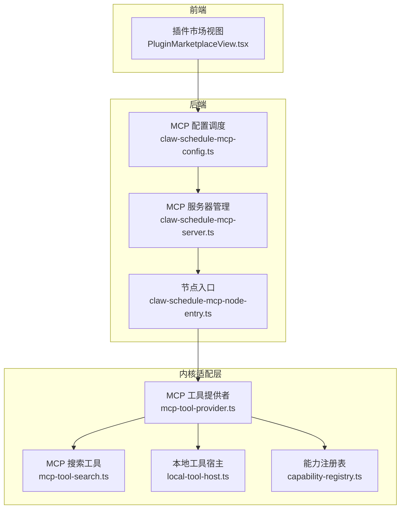
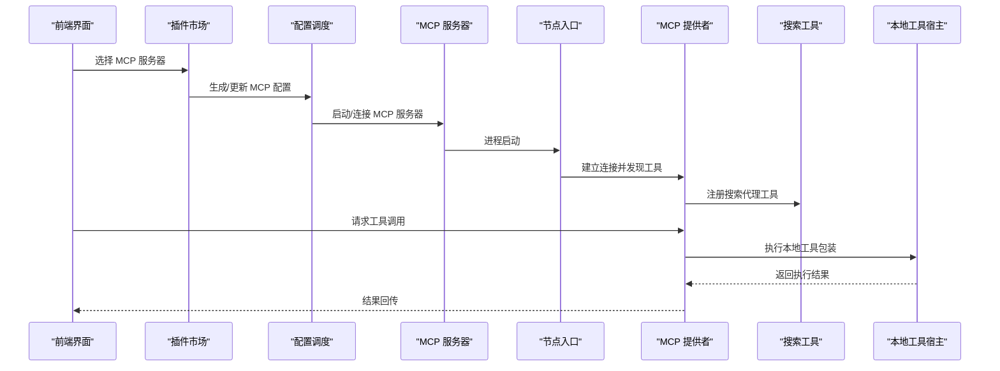
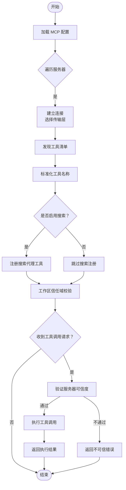
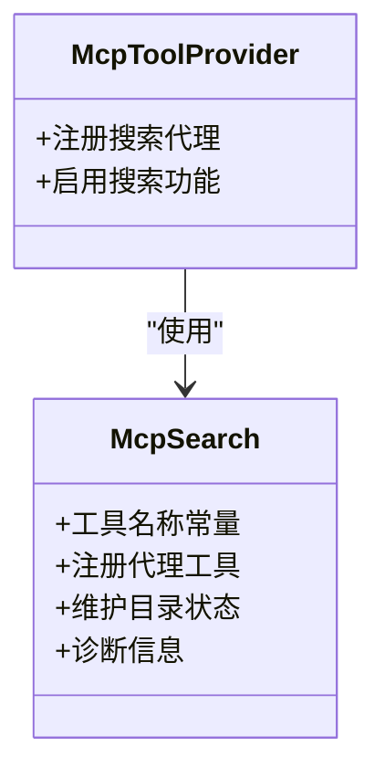
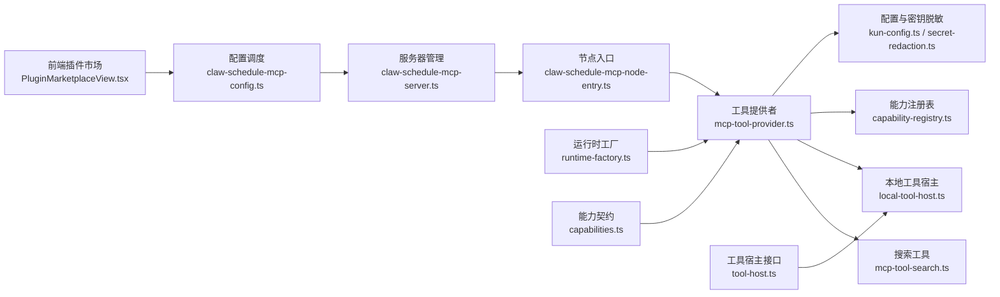

# MCP 工具集成

<cite>
**本文引用的文件**
- [mcp-tool-provider.ts](file://kun/src/adapters/tool/mcp-tool-provider.ts)
- [mcp-tool-search.ts](file://kun/src/adapters/tool/mcp-tool-search.ts)
- [local-tool-host.ts](file://kun/src/adapters/tool/local-tool-host.ts)
- [capability-registry.ts](file://kun/src/adapters/tool/capability-registry.ts)
- [mcp-config.test.ts](file://kun/tests/mcp-config.test.ts)
- [mcp-tool-provider.test.ts](file://kun/tests/mcp-tool-provider.test.ts)
- [PluginMarketplaceView.tsx](file://src/renderer/src/components/PluginMarketplaceView.tsx)
- [claw-schedule-mcp-config.ts](file://src/main/claw-schedule-mcp-config.ts)
- [claw-schedule-mcp-server.ts](file://src/main/claw-schedule-mcp-server.ts)
- [claw-schedule-mcp-node-entry.ts](file://src/main/claw-schedule-mcp-node-entry.ts)
- [kun-config.ts](file://kun/src/config/kun-config.ts)
- [secret-redaction.ts](file://kun/src/config/secret-redaction.ts)
- [runtime-factory.ts](file://kun/src/server/runtime-factory.ts)
- [tool-host.ts](file://kun/src/ports/tool-host.ts)
- [capabilities.ts](file://kun/src/contracts/capabilities.ts)
- [index.ts](file://kun/src/adapters/tool/index.ts)
</cite>

## 目录
1. [简介](#简介)
2. [项目结构](#项目结构)
3. [核心组件](#核心组件)
4. [架构总览](#架构总览)
5. [详细组件分析](#详细组件分析)
6. [依赖关系分析](#依赖关系分析)
7. [性能考虑](#性能考虑)
8. [故障排除指南](#故障排除指南)
9. [结论](#结论)
10. [附录](#附录)

## 简介
本指南面向 DeepSeek GUI 的 MCP（Model Context Protocol）工具集成，系统阐述 MCP 协议在 GUI 中的应用方式，涵盖工具提供者实现、连接建立、工具发现与调用流程、搜索机制、元数据管理、结果处理、配置与认证、错误处理、调试与性能监控、故障排除及最佳实践。文档以仓库中的实际实现为依据，避免臆测，确保可操作性与准确性。

## 项目结构
DeepSeek GUI 将 MCP 集成分为三层：
- 前端插件市场与配置入口：提供预置 MCP 服务器配置与可视化开关
- 后端运行时与调度：负责 MCP 服务器生命周期管理、进程启动与通信
- 内核适配层：将 MCP 工具注册为统一的工具接口，支持搜索、元数据与执行

图表来源
- [PluginMarketplaceView.tsx:361-415](file://src/renderer/src/components/PluginMarketplaceView.tsx#L361-L415)
- [claw-schedule-mcp-config.ts](file://src/main/claw-schedule-mcp-config.ts)
- [claw-schedule-mcp-server.ts](file://src/main/claw-schedule-mcp-server.ts)
- [claw-schedule-mcp-node-entry.ts](file://src/main/claw-schedule-mcp-node-entry.ts)
- [mcp-tool-provider.ts:100-220](file://kun/src/adapters/tool/mcp-tool-provider.ts#L100-L220)
- [mcp-tool-search.ts:150-170](file://kun/src/adapters/tool/mcp-tool-search.ts#L150-L170)
- [local-tool-host.ts](file://kun/src/adapters/tool/local-tool-host.ts)
- [capability-registry.ts](file://kun/src/adapters/tool/capability-registry.ts)

章节来源
- [PluginMarketplaceView.tsx:361-415](file://src/renderer/src/components/PluginMarketplaceView.tsx#L361-L415)
- [claw-schedule-mcp-config.ts](file://src/main/claw-schedule-mcp-config.ts)
- [claw-schedule-mcp-server.ts](file://src/main/claw-schedule-mcp-server.ts)
- [claw-schedule-mcp-node-entry.ts](file://src/main/claw-schedule-mcp-node-entry.ts)
- [mcp-tool-provider.ts:100-220](file://kun/src/adapters/tool/mcp-tool-provider.ts#L100-L220)
- [mcp-tool-search.ts:150-170](file://kun/src/adapters/tool/mcp-tool-search.ts#L150-L170)
- [local-tool-host.ts](file://kun/src/adapters/tool/local-tool-host.ts)
- [capability-registry.ts](file://kun/src/adapters/tool/capability-registry.ts)

## 核心组件
- MCP 工具提供者：负责根据配置连接 MCP 服务器、发现工具、生成工具描述、执行工具调用，并进行信任域校验与错误处理。
- MCP 搜索工具：提供统一的搜索、描述、调用与目录刷新工具，作为“代理工具”驱动工具发现与执行。
- 本地工具宿主：将 MCP 工具桥接为本地工具接口，便于统一调度与缓存。
- 能力注册表：将 MCP 工具注册为统一的工具能力，供上层逻辑使用。
- 前端插件市场：内置常见 MCP 服务器配置，简化用户接入。
- 后端调度：负责 MCP 服务器的启动、停止与生命周期管理。

章节来源
- [mcp-tool-provider.ts:1-120](file://kun/src/adapters/tool/mcp-tool-provider.ts#L1-L120)
- [mcp-tool-search.ts:1-120](file://kun/src/adapters/tool/mcp-tool-search.ts#L1-L120)
- [local-tool-host.ts](file://kun/src/adapters/tool/local-tool-host.ts)
- [capability-registry.ts](file://kun/src/adapters/tool/capability-registry.ts)
- [PluginMarketplaceView.tsx:361-415](file://src/renderer/src/components/PluginMarketplaceView.tsx#L361-L415)

## 架构总览
下图展示从前端到内核的完整 MCP 集成链路：

图表来源
- [PluginMarketplaceView.tsx:361-415](file://src/renderer/src/components/PluginMarketplaceView.tsx#L361-L415)
- [claw-schedule-mcp-config.ts](file://src/main/claw-schedule-mcp-config.ts)
- [claw-schedule-mcp-server.ts](file://src/main/claw-schedule-mcp-server.ts)
- [claw-schedule-mcp-node-entry.ts](file://src/main/claw-schedule-mcp-node-entry.ts)
- [mcp-tool-provider.ts:100-220](file://kun/src/adapters/tool/mcp-tool-provider.ts#L100-L220)
- [mcp-tool-search.ts:150-170](file://kun/src/adapters/tool/mcp-tool-search.ts#L150-L170)
- [local-tool-host.ts](file://kun/src/adapters/tool/local-tool-host.ts)

## 详细组件分析

### MCP 工具提供者（mcp-tool-provider）
职责与流程
- 读取全局 MCP 配置，按服务器逐个建立连接
- 使用不同传输层（STDIO、HTTP、SSE）与服务器交互
- 发现工具清单，生成稳定工具 ID 并标准化名称
- 注册搜索代理工具，启用搜索功能
- 执行工具调用前进行信任域校验，防止越权访问
- 对敏感信息进行脱敏输出，保障安全

关键实现要点
- 连接建立：根据配置选择传输层并初始化客户端
- 工具发现：遍历已连接服务器，收集工具描述
- 名称标准化：将“服务器名+工具名”映射为稳定 ID
- 搜索集成：当满足条件时注册搜索代理工具
- 信任域：基于工作区路径判断服务器是否可信
- 错误处理：捕获连接失败、超时、权限不足等异常

图表来源
- [mcp-tool-provider.ts:100-220](file://kun/src/adapters/tool/mcp-tool-provider.ts#L100-L220)
- [mcp-tool-provider.ts:200-320](file://kun/src/adapters/tool/mcp-tool-provider.ts#L200-L320)

章节来源
- [mcp-tool-provider.ts:1-120](file://kun/src/adapters/tool/mcp-tool-provider.ts#L1-L120)
- [mcp-tool-provider.ts:100-220](file://kun/src/adapters/tool/mcp-tool-provider.ts#L100-L220)
- [mcp-tool-provider.ts:200-320](file://kun/src/adapters/tool/mcp-tool-provider.ts#L200-L320)

### MCP 搜索工具（mcp-tool-search）
职责与流程
- 定义统一的搜索、描述、调用与目录刷新工具名称
- 在工具提供者中注册为代理工具，用于驱动工具发现与执行
- 维护搜索目录状态与诊断信息，便于调试与监控

图表来源
- [mcp-tool-search.ts:1-120](file://kun/src/adapters/tool/mcp-tool-search.ts#L1-L120)
- [mcp-tool-provider.ts:150-220](file://kun/src/adapters/tool/mcp-tool-provider.ts#L150-L220)

章节来源
- [mcp-tool-search.ts:1-120](file://kun/src/adapters/tool/mcp-tool-search.ts#L1-L120)
- [mcp-tool-provider.ts:150-220](file://kun/src/adapters/tool/mcp-tool-provider.ts#L150-L220)

### 本地工具宿主（local-tool-host）
职责与流程
- 将 MCP 工具包装为本地工具接口，便于统一调度
- 处理工具执行上下文与结果格式化

章节来源
- [local-tool-host.ts](file://kun/src/adapters/tool/local-tool-host.ts)

### 能力注册表（capability-registry）
职责与流程
- 将 MCP 工具注册为统一的能力，供上层逻辑检索与调用
- 维护工具元数据与可用性状态

章节来源
- [capability-registry.ts](file://kun/src/adapters/tool/capability-registry.ts)

### 前端插件市场（PluginMarketplaceView）
职责与流程
- 提供预置 MCP 服务器配置（如 filesystem、playwright、github、context7）
- 通过构建函数生成可直接使用的 MCP 配置对象
- 支持工作区信任范围设置与根目录限制

章节来源
- [PluginMarketplaceView.tsx:361-415](file://src/renderer/src/components/PluginMarketplaceView.tsx#L361-L415)

### 后端调度（claw-schedule-mcp-*）
职责与流程
- 配置调度：解析与生成 MCP 服务器配置
- 服务器管理：启动/停止 MCP 服务器进程
- 节点入口：作为 MCP 服务器的进程入口

章节来源
- [claw-schedule-mcp-config.ts](file://src/main/claw-schedule-mcp-config.ts)
- [claw-schedule-mcp-server.ts](file://src/main/claw-schedule-mcp-server.ts)
- [claw-schedule-mcp-node-entry.ts](file://src/main/claw-schedule-mcp-node-entry.ts)

## 依赖关系分析
MCP 工具集成的关键依赖关系如下：

图表来源
- [PluginMarketplaceView.tsx:361-415](file://src/renderer/src/components/PluginMarketplaceView.tsx#L361-L415)
- [claw-schedule-mcp-config.ts](file://src/main/claw-schedule-mcp-config.ts)
- [claw-schedule-mcp-server.ts](file://src/main/claw-schedule-mcp-server.ts)
- [claw-schedule-mcp-node-entry.ts](file://src/main/claw-schedule-mcp-node-entry.ts)
- [mcp-tool-provider.ts:1-120](file://kun/src/adapters/tool/mcp-tool-provider.ts#L1-L120)
- [mcp-tool-search.ts:1-120](file://kun/src/adapters/tool/mcp-tool-search.ts#L1-L120)
- [local-tool-host.ts](file://kun/src/adapters/tool/local-tool-host.ts)
- [capability-registry.ts](file://kun/src/adapters/tool/capability-registry.ts)
- [kun-config.ts](file://kun/src/config/kun-config.ts)
- [secret-redaction.ts](file://kun/src/config/secret-redaction.ts)
- [runtime-factory.ts](file://kun/src/server/runtime-factory.ts)
- [tool-host.ts](file://kun/src/ports/tool-host.ts)
- [capabilities.ts](file://kun/src/contracts/capabilities.ts)

章节来源
- [index.ts:13-14](file://kun/src/adapters/tool/index.ts#L13-L14)
- [mcp-tool-provider.ts:1-120](file://kun/src/adapters/tool/mcp-tool-provider.ts#L1-L120)
- [mcp-tool-search.ts:1-120](file://kun/src/adapters/tool/mcp-tool-search.ts#L1-L120)
- [local-tool-host.ts](file://kun/src/adapters/tool/local-tool-host.ts)
- [capability-registry.ts](file://kun/src/adapters/tool/capability-registry.ts)
- [kun-config.ts](file://kun/src/config/kun-config.ts)
- [secret-redaction.ts](file://kun/src/config/secret-redaction.ts)
- [runtime-factory.ts](file://kun/src/server/runtime-factory.ts)
- [tool-host.ts](file://kun/src/ports/tool-host.ts)
- [capabilities.ts](file://kun/src/contracts/capabilities.ts)

## 性能考虑
- 连接复用：尽量重用已连接的 MCP 客户端，减少重复握手开销
- 搜索优化：仅在工具数量较多或需要动态发现时启用搜索代理工具，避免不必要的目录扫描
- 缓存策略：利用工具目录指纹与缓存机制降低重复查询成本
- 传输层选择：优先使用低延迟传输（如 STDIO），在网络受限场景下考虑 HTTP/SSE
- 超时与重试：合理设置超时时间与退避策略，避免阻塞主线程
- 资源隔离：为不同 MCP 服务器分配独立进程，避免相互影响

## 故障排除指南
常见问题与排查步骤
- 无法连接 MCP 服务器
  - 检查命令与参数是否正确，确认可执行文件存在且可执行
  - 校验传输层配置（STDIO/HTTP/SSE）与端口占用情况
  - 查看日志输出，定位网络或权限问题
- 工具不可见或不可用
  - 确认工具提供者已成功发现工具清单
  - 检查工具名称标准化与 ID 映射是否正确
  - 验证搜索代理工具是否已注册
- 工作区不可信导致拒绝执行
  - 核对信任域配置与工作区根路径
  - 确保受信任的工作区根目录包含当前文件
- 执行结果异常
  - 检查工具输入参数与输出格式
  - 关注错误处理分支与异常类型
- 调试与诊断
  - 使用搜索诊断工具获取目录状态与诊断信息
  - 开启详细日志，记录连接、发现与调用过程
  - 对敏感信息进行脱敏输出，避免泄露

章节来源
- [mcp-tool-provider.ts:100-220](file://kun/src/adapters/tool/mcp-tool-provider.ts#L100-L220)
- [mcp-tool-search.ts:150-170](file://kun/src/adapters/tool/mcp-tool-search.ts#L150-L170)
- [secret-redaction.ts](file://kun/src/config/secret-redaction.ts)

## 结论
DeepSeek GUI 的 MCP 集成通过清晰的分层设计实现了从前端配置到后端调度再到内核适配的完整闭环。工具提供者负责连接与发现，搜索工具提供统一的代理能力，本地工具宿主与能力注册表保证了执行与调度的一致性。结合信任域校验与错误处理机制，系统在安全性与可用性之间取得平衡。建议在生产环境中遵循性能与安全最佳实践，并持续完善调试与监控能力。

## 附录

### MCP 工具集成示例（步骤说明）
- 前端配置
  - 在插件市场中选择预置 MCP 服务器（如 filesystem、playwright、github、context7）
  - 根据工作区设置信任范围与根目录
- 后端启动
  - 配置调度生成 MCP 服务器配置
  - 服务器管理模块启动对应进程
- 内核适配
  - 工具提供者建立连接并发现工具
  - 注册搜索代理工具，启用目录搜索
  - 执行工具调用前进行信任域校验
- 结果处理
  - 本地工具宿主统一格式化结果
  - 能力注册表对外暴露工具能力

章节来源
- [PluginMarketplaceView.tsx:361-415](file://src/renderer/src/components/PluginMarketplaceView.tsx#L361-L415)
- [claw-schedule-mcp-config.ts](file://src/main/claw-schedule-mcp-config.ts)
- [claw-schedule-mcp-server.ts](file://src/main/claw-schedule-mcp-server.ts)
- [mcp-tool-provider.ts:100-220](file://kun/src/adapters/tool/mcp-tool-provider.ts#L100-L220)
- [mcp-tool-search.ts:150-170](file://kun/src/adapters/tool/mcp-tool-search.ts#L150-L170)
- [local-tool-host.ts](file://kun/src/adapters/tool/local-tool-host.ts)
- [capability-registry.ts](file://kun/src/adapters/tool/capability-registry.ts)

### 测试参考
- 配置与信任域测试：验证 MCP 服务器配置与工作区信任范围判定
- 工具提供者测试：验证工具名称标准化、搜索启用条件与工具执行流程

章节来源
- [mcp-config.test.ts](file://kun/tests/mcp-config.test.ts)
- [mcp-tool-provider.test.ts](file://kun/tests/mcp-tool-provider.test.ts)