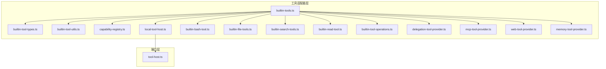
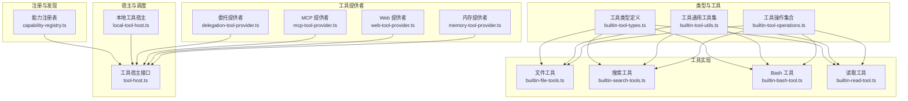
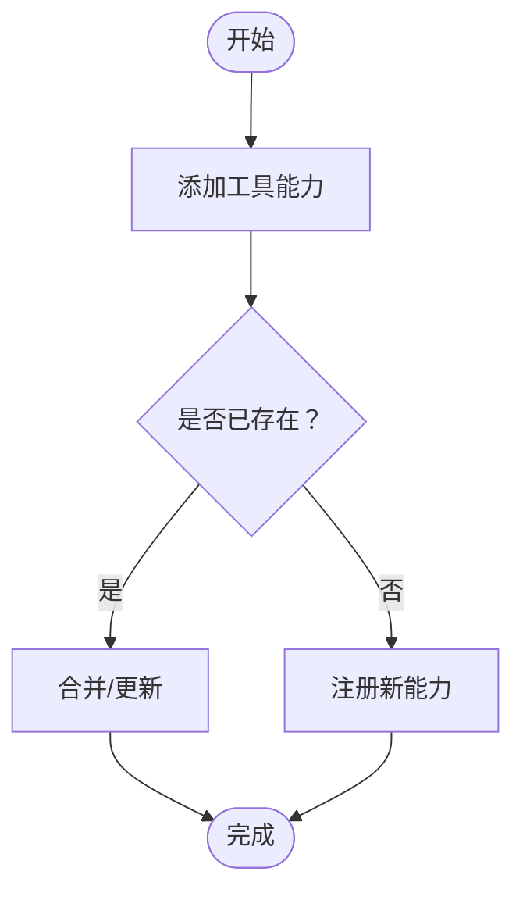
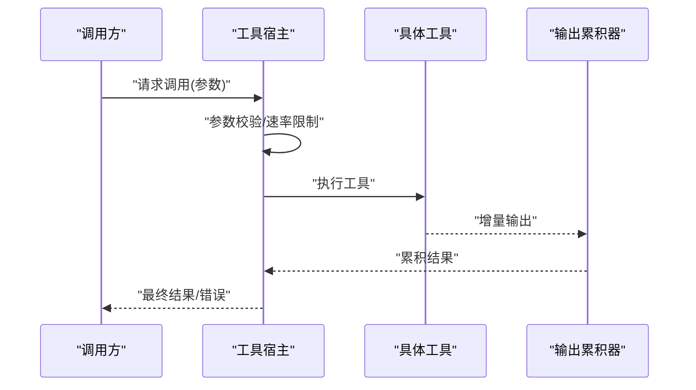
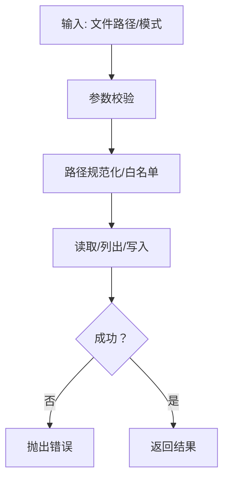
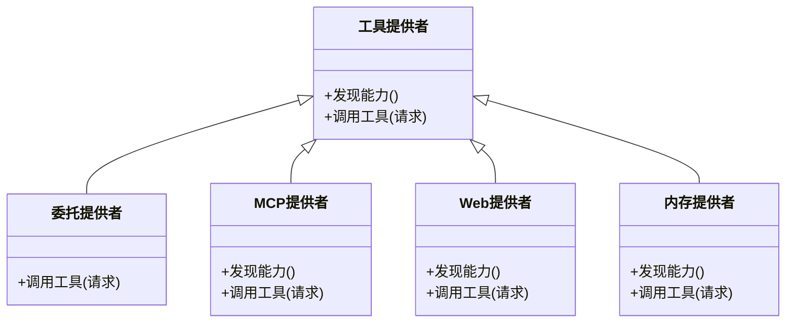
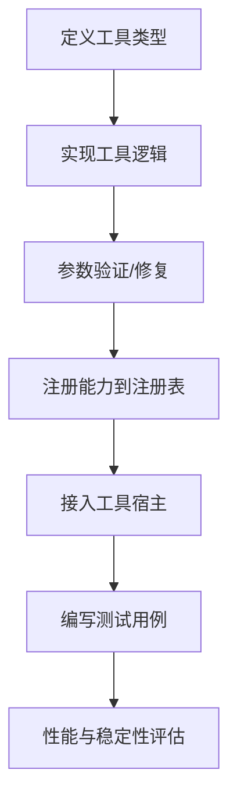
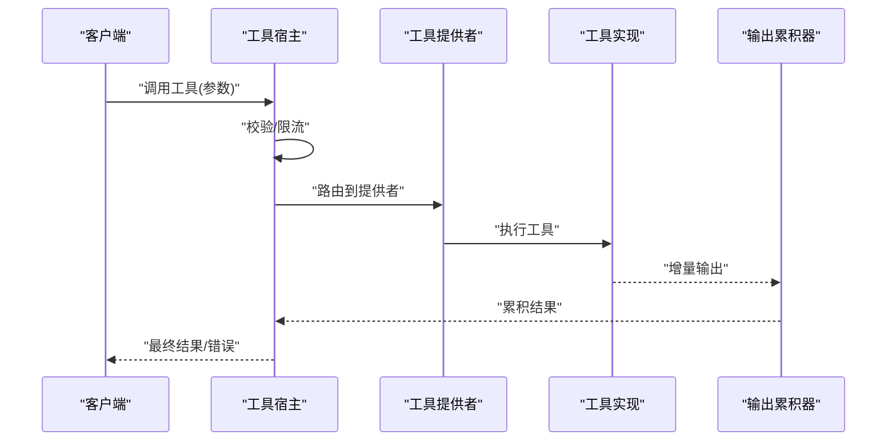
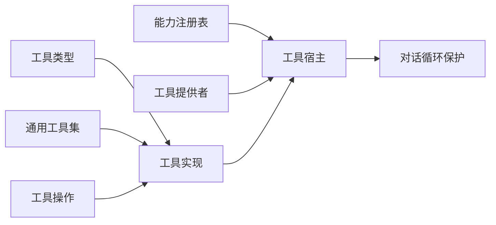

# 工具开发

<cite>
**本文引用的文件**
- [builtin-tools.ts](file://kun/src/adapters/tool/builtin-tools.ts)
- [builtin-tool-types.ts](file://kun/src/adapters/tool/builtin-tool-types.ts)
- [builtin-tool-utils.ts](file://kun/src/adapters/tool/builtin-tool-utils.ts)
- [capability-registry.ts](file://kun/src/adapters/tool/capability-registry.ts)
- [local-tool-host.ts](file://kun/src/adapters/tool/local-tool-host.ts)
- [builtin-bash-tool.ts](file://kun/src/adapters/tool/builtin-bash-tool.ts)
- [builtin-file-tools.ts](file://kun/src/adapters/tool/builtin-file-tools.ts)
- [builtin-search-tools.ts](file://kun/src/adapters/tool/builtin-search-tools.ts)
- [builtin-read-tool.ts](file://kun/src/adapters/tool/builtin-read-tool.ts)
- [builtin-tool-operations.ts](file://kun/src/adapters/tool/builtin-tool-operations.ts)
- [tool-host.ts](file://kun/src/ports/tool-host.ts)
- [delegation-tool-provider.ts](file://kun/src/adapters/tool/delegation-tool-provider.ts)
- [mcp-tool-provider.ts](file://kun/src/adapters/tool/mcp-tool-provider.ts)
- [web-tool-provider.ts](file://kun/src/adapters/tool/web-tool-provider.ts)
- [memory-tool-provider.ts](file://kun/src/adapters/tool/memory-tool-provider.ts)
- [builtin-tool-utils.test.ts](file://kun/src/adapters/tool/builtin-tool-utils.test.ts)
- [builtin-tools.test.ts](file://kun/src/tests/builtin-tools.test.ts)
- [capability-registry.test.ts](file://kun/src/tests/capability-registry.test.ts)
- [mcp-tool-provider.test.ts](file://kun/src/tests/mcp-tool-provider.test.ts)
- [web-tool-provider.test.ts](file://kun/src/tests/web-tool-provider.test.ts)
- [memory-tool-provider.test.ts](file://kun/src/tests/memory-tool-provider.test.ts)
- [tool-rate-limit.ts](file://kun/src/adapters/tool/tool-rate-limit.ts)
- [tool-hooks.ts](file://kun/src/adapters/tool/tool-hooks.ts)
- [output-accumulator.ts](file://kun/src/adapters/tool/output-accumulator.ts)
- [read-tracker.ts](file://kun/src/adapters/tool/read-tracker.ts)
- [file-mutation-queue.ts](file://kun/src/adapters/tool/file-mutation-queue.ts)
- [tool-call-repair.ts](file://kun/src/loop/tool-call-repair.ts)
- [tool-storm-breaker.ts](file://kun/src/loop/tool-storm-breaker.ts)
- [kun-config.ts](file://kun/src/config/kun-config.ts)
- [runtime-factory.ts](file://kun/src/server/runtime-factory.ts)
- [index.ts](file://kun/src/index.ts)
</cite>

## 目录
1. [简介](#简介)
2. [项目结构](#项目结构)
3. [核心组件](#核心组件)
4. [架构总览](#架构总览)
5. [详细组件分析](#详细组件分析)
6. [依赖关系分析](#依赖关系分析)
7. [性能考虑](#性能考虑)
8. [故障排查指南](#故障排查指南)
9. [结论](#结论)
10. [附录](#附录)

## 简介
本指南面向 DeepSeek GUI 的工具开发者，系统性阐述工具系统的架构与实现，覆盖工具接口定义、工具注册机制、能力注册表、内置工具（文件、搜索、Bash 等）实现、工具宿主管理、调用流程与结果处理，并提供开发流程、测试方法、性能优化与调试技巧。目标是帮助你在不深入源码细节的前提下，快速理解并高效扩展工具能力。

## 项目结构
工具体系位于后端运行时模块中，核心文件集中在适配器层的 tool 子目录，同时通过端口层对外暴露统一的工具宿主接口。整体采用“类型定义 + 工具实现 + 注册表 + 宿主调度”的分层设计。

图表来源
- [builtin-tools.ts](file://kun/src/adapters/tool/builtin-tools.ts)
- [builtin-tool-types.ts](file://kun/src/adapters/tool/builtin-tool-types.ts)
- [builtin-tool-utils.ts](file://kun/src/adapters/tool/builtin-tool-utils.ts)
- [capability-registry.ts](file://kun/src/adapters/tool/capability-registry.ts)
- [local-tool-host.ts](file://kun/src/adapters/tool/local-tool-host.ts)
- [builtin-bash-tool.ts](file://kun/src/adapters/tool/builtin-bash-tool.ts)
- [builtin-file-tools.ts](file://kun/src/adapters/tool/builtin-file-tools.ts)
- [builtin-search-tools.ts](file://kun/src/adapters/tool/builtin-search-tools.ts)
- [builtin-read-tool.ts](file://kun/src/adapters/tool/builtin-read-tool.ts)
- [builtin-tool-operations.ts](file://kun/src/adapters/tool/builtin-tool-operations.ts)
- [delegation-tool-provider.ts](file://kun/src/adapters/tool/delegation-tool-provider.ts)
- [mcp-tool-provider.ts](file://kun/src/adapters/tool/mcp-tool-provider.ts)
- [web-tool-provider.ts](file://kun/src/adapters/tool/web-tool-provider.ts)
- [memory-tool-provider.ts](file://kun/src/adapters/tool/memory-tool-provider.ts)
- [tool-host.ts](file://kun/src/ports/tool-host.ts)

章节来源
- [builtin-tools.ts](file://kun/src/adapters/tool/builtin-tools.ts)
- [builtin-tool-types.ts](file://kun/src/adapters/tool/builtin-tool-types.ts)
- [builtin-tool-utils.ts](file://kun/src/adapters/tool/builtin-tool-utils.ts)
- [capability-registry.ts](file://kun/src/adapters/tool/capability-registry.ts)
- [local-tool-host.ts](file://kun/src/adapters/tool/local-tool-host.ts)
- [builtin-bash-tool.ts](file://kun/src/adapters/tool/builtin-bash-tool.ts)
- [builtin-file-tools.ts](file://kun/src/adapters/tool/builtin-file-tools.ts)
- [builtin-search-tools.ts](file://kun/src/adapters/tool/builtin-search-tools.ts)
- [builtin-read-tool.ts](file://kun/src/adapters/tool/builtin-read-tool.ts)
- [builtin-tool-operations.ts](file://kun/src/adapters/tool/builtin-tool-operations.ts)
- [delegation-tool-provider.ts](file://kun/src/adapters/tool/delegation-tool-provider.ts)
- [mcp-tool-provider.ts](file://kun/src/adapters/tool/mcp-tool-provider.ts)
- [web-tool-provider.ts](file://kun/src/adapters/tool/web-tool-provider.ts)
- [memory-tool-provider.ts](file://kun/src/adapters/tool/memory-tool-provider.ts)
- [tool-host.ts](file://kun/src/ports/tool-host.ts)

## 核心组件
- 工具接口与类型：定义工具签名、参数结构、返回值与错误模型，确保所有工具实现遵循统一契约。
- 能力注册表：集中登记可用工具的能力清单，支持查询、过滤与动态发现。
- 工具宿主：封装工具调用、并发控制、速率限制、输出累积与结果归并。
- 内置工具族：文件读写、搜索、Bash 执行、内存检索、Web 检索、代理委托等。
- 工具提供者：抽象外部工具来源（本地、MCP、Web、内存），统一为工具宿主提供能力。
- 运行时集成：通过运行时工厂与入口导出，将工具能力注入到对话循环与工作流中。

章节来源
- [builtin-tool-types.ts](file://kun/src/adapters/tool/builtin-tool-types.ts)
- [capability-registry.ts](file://kun/src/adapters/tool/capability-registry.ts)
- [local-tool-host.ts](file://kun/src/adapters/tool/local-tool-host.ts)
- [builtin-tools.ts](file://kun/src/adapters/tool/builtin-tools.ts)
- [tool-host.ts](file://kun/src/ports/tool-host.ts)

## 架构总览
工具系统以“类型 + 实现 + 注册 + 宿主”为核心，形成可插拔、可扩展、可治理的工具生态。

图表来源
- [builtin-tool-types.ts](file://kun/src/adapters/tool/builtin-tool-types.ts)
- [builtin-tool-utils.ts](file://kun/src/adapters/tool/builtin-tool-utils.ts)
- [builtin-tool-operations.ts](file://kun/src/adapters/tool/builtin-tool-operations.ts)
- [capability-registry.ts](file://kun/src/adapters/tool/capability-registry.ts)
- [tool-host.ts](file://kun/src/ports/tool-host.ts)
- [local-tool-host.ts](file://kun/src/adapters/tool/local-tool-host.ts)
- [builtin-file-tools.ts](file://kun/src/adapters/tool/builtin-file-tools.ts)
- [builtin-search-tools.ts](file://kun/src/adapters/tool/builtin-search-tools.ts)
- [builtin-bash-tool.ts](file://kun/src/adapters/tool/builtin-bash-tool.ts)
- [builtin-read-tool.ts](file://kun/src/adapters/tool/builtin-read-tool.ts)
- [delegation-tool-provider.ts](file://kun/src/adapters/tool/delegation-tool-provider.ts)
- [mcp-tool-provider.ts](file://kun/src/adapters/tool/mcp-tool-provider.ts)
- [web-tool-provider.ts](file://kun/src/adapters/tool/web-tool-provider.ts)
- [memory-tool-provider.ts](file://kun/src/adapters/tool/memory-tool-provider.ts)

## 详细组件分析

### 工具接口与类型定义
- 工具签名与参数：定义工具输入参数结构、可选字段、默认值与校验规则；统一返回值结构与错误模型。
- 工具元信息：名称、描述、版本、能力标签、使用示例等，用于注册表与 UI 展示。
- 工具能力枚举：如文件读写、搜索、执行、检索等，便于按能力维度聚合与过滤。

章节来源
- [builtin-tool-types.ts](file://kun/src/adapters/tool/builtin-tool-types.ts)

### 能力注册表
- 职责：集中登记工具能力，提供查询、过滤、去重与版本管理。
- 数据结构：键为能力标识，值为工具清单或元信息快照。
- 使用场景：工具发现、权限控制、UI 能力面板、策略匹配。

图表来源
- [capability-registry.ts](file://kun/src/adapters/tool/capability-registry.ts)

章节来源
- [capability-registry.ts](file://kun/src/adapters/tool/capability-registry.ts)
- [capability-registry.test.ts](file://kun/src/tests/capability-registry.test.ts)

### 工具宿主与本地工具宿主
- 工具宿主接口：定义工具调用、并发控制、速率限制、错误传播与结果归并的统一契约。
- 本地工具宿主：在本地运行时内核中实现工具宿主，负责参数解析、执行调度、输出累积与异常捕获。
- 关键机制：输出累积器、读取追踪、文件变更队列、速率限制钩子、调用修复与风暴防护。

图表来源
- [tool-host.ts](file://kun/src/ports/tool-host.ts)
- [local-tool-host.ts](file://kun/src/adapters/tool/local-tool-host.ts)
- [output-accumulator.ts](file://kun/src/adapters/tool/output-accumulator.ts)
- [tool-rate-limit.ts](file://kun/src/adapters/tool/tool-rate-limit.ts)
- [read-tracker.ts](file://kun/src/adapters/tool/read-tracker.ts)
- [file-mutation-queue.ts](file://kun/src/adapters/tool/file-mutation-queue.ts)

章节来源
- [tool-host.ts](file://kun/src/ports/tool-host.ts)
- [local-tool-host.ts](file://kun/src/adapters/tool/local-tool-host.ts)
- [output-accumulator.ts](file://kun/src/adapters/tool/output-accumulator.ts)
- [tool-rate-limit.ts](file://kun/src/adapters/tool/tool-rate-limit.ts)
- [read-tracker.ts](file://kun/src/adapters/tool/read-tracker.ts)
- [file-mutation-queue.ts](file://kun/src/adapters/tool/file-mutation-queue.ts)

### 内置工具族

#### 文件工具
- 功能：读取文件、列出目录、文件变更队列与原子写入。
- 关键点：路径安全校验、大小限制、编码处理、变更幂等与回滚。
- 典型实现：读取、列出、写入、删除、移动、复制等。

图表来源
- [builtin-file-tools.ts](file://kun/src/adapters/tool/builtin-file-tools.ts)
- [file-mutation-queue.ts](file://kun/src/adapters/tool/file-mutation-queue.ts)

章节来源
- [builtin-file-tools.ts](file://kun/src/adapters/tool/builtin-file-tools.ts)
- [builtin-tool-utils.ts](file://kun/src/adapters/tool/builtin-tool-utils.ts)
- [file-mutation-queue.ts](file://kun/src/adapters/tool/file-mutation-queue.ts)

#### 搜索工具
- 功能：在工作区范围内进行全文搜索、正则匹配、忽略模式与大小写控制。
- 关键点：I/O 限流、超时控制、结果截断与去重、路径过滤。

章节来源
- [builtin-search-tools.ts](file://kun/src/adapters/tool/builtin-search-tools.ts)

#### Bash 工具
- 功能：在受限环境中执行命令，支持工作目录、环境变量、超时与输出截断。
- 关键点：沙箱策略、命令白名单、危险字符过滤、进程生命周期管理。

章节来源
- [builtin-bash-tool.ts](file://kun/src/adapters/tool/builtin-bash-tool.ts)

#### 读取工具
- 功能：从任意来源读取文本或二进制数据，支持缓存与进度追踪。
- 关键点：读取追踪器、缓存命中、超时与重试策略。

章节来源
- [builtin-read-tool.ts](file://kun/src/adapters/tool/builtin-read-tool.ts)
- [read-tracker.ts](file://kun/src/adapters/tool/read-tracker.ts)

#### 工具操作与通用工具集
- 工具操作：参数修复、结果截断、输出累积、错误归一化。
- 通用工具集：路径处理、编码转换、大小写折叠、正则预编译。

章节来源
- [builtin-tool-operations.ts](file://kun/src/adapters/tool/builtin-tool-operations.ts)
- [builtin-tool-utils.ts](file://kun/src/adapters/tool/builtin-tool-utils.ts)

### 工具提供者
- 委托提供者：将工具调用委托给其他运行时或服务，适合跨进程/跨域场景。
- MCP 提供者：基于 MCP 协议发现与调用远程工具。
- Web 提供者：通过 HTTP 接口访问外部工具。
- 内存提供者：从内存存储中检索工具能力，适合快速原型与测试。

图表来源
- [delegation-tool-provider.ts](file://kun/src/adapters/tool/delegation-tool-provider.ts)
- [mcp-tool-provider.ts](file://kun/src/adapters/tool/mcp-tool-provider.ts)
- [web-tool-provider.ts](file://kun/src/adapters/tool/web-tool-provider.ts)
- [memory-tool-provider.ts](file://kun/src/adapters/tool/memory-tool-provider.ts)

章节来源
- [delegation-tool-provider.ts](file://kun/src/adapters/tool/delegation-tool-provider.ts)
- [mcp-tool-provider.ts](file://kun/src/adapters/tool/mcp-tool-provider.ts)
- [web-tool-provider.ts](file://kun/src/adapters/tool/web-tool-provider.ts)
- [memory-tool-provider.ts](file://kun/src/adapters/tool/memory-tool-provider.ts)

### 工具开发流程
- 定义工具类型：明确输入参数、输出结构与错误模型。
- 编写工具实现：遵循工具接口，实现执行逻辑与错误处理。
- 参数验证：利用通用工具集与操作集合进行参数修复与校验。
- 注册能力：将工具能力注册到能力注册表，设置能力标签与元信息。
- 集成宿主：通过本地工具宿主或提供者接入工具调用链路。
- 测试与回归：编写单元测试与集成测试，覆盖正常路径与边界条件。

图表来源
- [builtin-tool-types.ts](file://kun/src/adapters/tool/builtin-tool-types.ts)
- [builtin-tool-utils.ts](file://kun/src/adapters/tool/builtin-tool-utils.ts)
- [builtin-tool-operations.ts](file://kun/src/adapters/tool/builtin-tool-operations.ts)
- [capability-registry.ts](file://kun/src/adapters/tool/capability-registry.ts)
- [local-tool-host.ts](file://kun/src/adapters/tool/local-tool-host.ts)

章节来源
- [builtin-tool-types.ts](file://kun/src/adapters/tool/builtin-tool-types.ts)
- [builtin-tool-utils.ts](file://kun/src/adapters/tool/builtin-tool-utils.ts)
- [builtin-tool-operations.ts](file://kun/src/adapters/tool/builtin-tool-operations.ts)
- [capability-registry.ts](file://kun/src/adapters/tool/capability-registry.ts)
- [local-tool-host.ts](file://kun/src/adapters/tool/local-tool-host.ts)

### 工具调用流程与结果处理
- 请求进入工具宿主，先进行参数校验与速率限制。
- 根据工具名路由到具体工具或提供者。
- 工具执行期间，输出通过累积器逐步返回，支持流式结果。
- 结果统一归并，错误标准化后返回调用方。

图表来源
- [tool-host.ts](file://kun/src/ports/tool-host.ts)
- [local-tool-host.ts](file://kun/src/adapters/tool/local-tool-host.ts)
- [output-accumulator.ts](file://kun/src/adapters/tool/output-accumulator.ts)
- [delegation-tool-provider.ts](file://kun/src/adapters/tool/delegation-tool-provider.ts)
- [mcp-tool-provider.ts](file://kun/src/adapters/tool/mcp-tool-provider.ts)
- [web-tool-provider.ts](file://kun/src/adapters/tool/web-tool-provider.ts)
- [memory-tool-provider.ts](file://kun/src/adapters/tool/memory-tool-provider.ts)

章节来源
- [tool-host.ts](file://kun/src/ports/tool-host.ts)
- [local-tool-host.ts](file://kun/src/adapters/tool/local-tool-host.ts)
- [output-accumulator.ts](file://kun/src/adapters/tool/output-accumulator.ts)
- [delegation-tool-provider.ts](file://kun/src/adapters/tool/delegation-tool-provider.ts)
- [mcp-tool-provider.ts](file://kun/src/adapters/tool/mcp-tool-provider.ts)
- [web-tool-provider.ts](file://kun/src/adapters/tool/web-tool-provider.ts)
- [memory-tool-provider.ts](file://kun/src/adapters/tool/memory-tool-provider.ts)

## 依赖关系分析
- 类型与工具：工具实现依赖类型定义与通用工具集，保证一致性与可维护性。
- 注册表：工具实现通过注册表暴露能力，宿主通过注册表发现与调度。
- 宿主与提供者：宿主作为统一入口，提供者作为能力来源，二者松耦合。
- 循环保护：通过风暴防护与调用修复，避免工具风暴与无限递归。

图表来源
- [builtin-tool-types.ts](file://kun/src/adapters/tool/builtin-tool-types.ts)
- [builtin-tool-utils.ts](file://kun/src/adapters/tool/builtin-tool-utils.ts)
- [builtin-tool-operations.ts](file://kun/src/adapters/tool/builtin-tool-operations.ts)
- [capability-registry.ts](file://kun/src/adapters/tool/capability-registry.ts)
- [local-tool-host.ts](file://kun/src/adapters/tool/local-tool-host.ts)
- [tool-storm-breaker.ts](file://kun/src/loop/tool-storm-breaker.ts)
- [tool-call-repair.ts](file://kun/src/loop/tool-call-repair.ts)

章节来源
- [builtin-tool-types.ts](file://kun/src/adapters/tool/builtin-tool-types.ts)
- [builtin-tool-utils.ts](file://kun/src/adapters/tool/builtin-tool-utils.ts)
- [builtin-tool-operations.ts](file://kun/src/adapters/tool/builtin-tool-operations.ts)
- [capability-registry.ts](file://kun/src/adapters/tool/capability-registry.ts)
- [local-tool-host.ts](file://kun/src/adapters/tool/local-tool-host.ts)
- [tool-storm-breaker.ts](file://kun/src/loop/tool-storm-breaker.ts)
- [tool-call-repair.ts](file://kun/src/loop/tool-call-repair.ts)

## 性能考虑
- 输出累积与流式处理：通过输出累积器减少大结果传输开销，支持增量返回。
- 读取追踪与缓存：对重复读取进行缓存与去重，降低 I/O 压力。
- 文件变更队列：批量/幂等写入，避免频繁磁盘操作。
- 速率限制与并发控制：防止资源争用与过载，保障系统稳定。
- 调用修复与风暴防护：在循环中自动修复失败调用，避免工具风暴。
- 配置化阈值：通过配置文件调整大小限制、超时与缓冲区大小。

章节来源
- [output-accumulator.ts](file://kun/src/adapters/tool/output-accumulator.ts)
- [read-tracker.ts](file://kun/src/adapters/tool/read-tracker.ts)
- [file-mutation-queue.ts](file://kun/src/adapters/tool/file-mutation-queue.ts)
- [tool-rate-limit.ts](file://kun/src/adapters/tool/tool-rate-limit.ts)
- [tool-call-repair.ts](file://kun/src/loop/tool-call-repair.ts)
- [tool-storm-breaker.ts](file://kun/src/loop/tool-storm-breaker.ts)
- [kun-config.ts](file://kun/src/config/kun-config.ts)

## 故障排查指南
- 工具未注册：检查能力注册表是否正确登记，确认工具名与能力标签一致。
- 调用失败：查看工具宿主日志与错误归一化输出，定位参数问题或执行异常。
- 输出异常：检查输出累积器状态与截断策略，确认是否被提前截断。
- 并发冲突：启用速率限制与队列机制，避免竞态与资源耗尽。
- 外部提供者：MCP/Web/内存提供者需检查网络连通性、鉴权与超时设置。
- 回归测试：运行对应测试套件，确保新增工具不影响既有功能。

章节来源
- [capability-registry.test.ts](file://kun/src/tests/capability-registry.test.ts)
- [builtin-tools.test.ts](file://kun/src/tests/builtin-tools.test.ts)
- [mcp-tool-provider.test.ts](file://kun/src/tests/mcp-tool-provider.test.ts)
- [web-tool-provider.test.ts](file://kun/src/tests/web-tool-provider.test.ts)
- [memory-tool-provider.test.ts](file://kun/src/tests/memory-tool-provider.test.ts)
- [builtin-tool-utils.test.ts](file://kun/src/adapters/tool/builtin-tool-utils.test.ts)

## 结论
DeepSeek GUI 的工具系统以类型驱动、注册表治理、宿主统一路由为核心，结合多种工具提供者与运行时保护机制，形成了高内聚、低耦合、可扩展的工具生态。遵循本文档的开发流程与最佳实践，你可以在保证安全性与稳定性的前提下，快速实现并集成新的工具能力。

## 附录
- 运行时集成：通过运行时工厂与入口导出，将工具能力注入到对话循环与工作流中。
- 配置项参考：在配置文件中调整工具相关阈值与行为，如大小限制、超时、缓冲区等。

章节来源
- [runtime-factory.ts](file://kun/src/server/runtime-factory.ts)
- [index.ts](file://kun/src/index.ts)
- [kun-config.ts](file://kun/src/config/kun-config.ts)