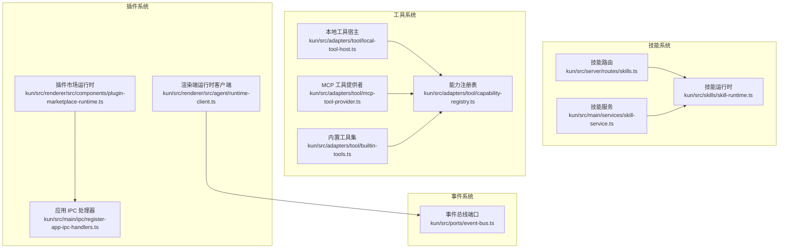
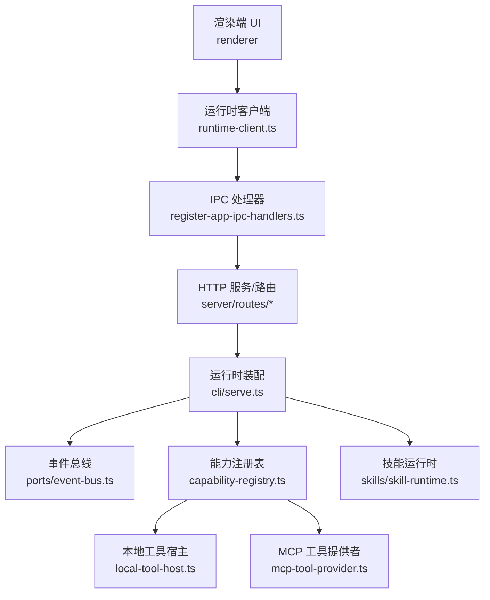
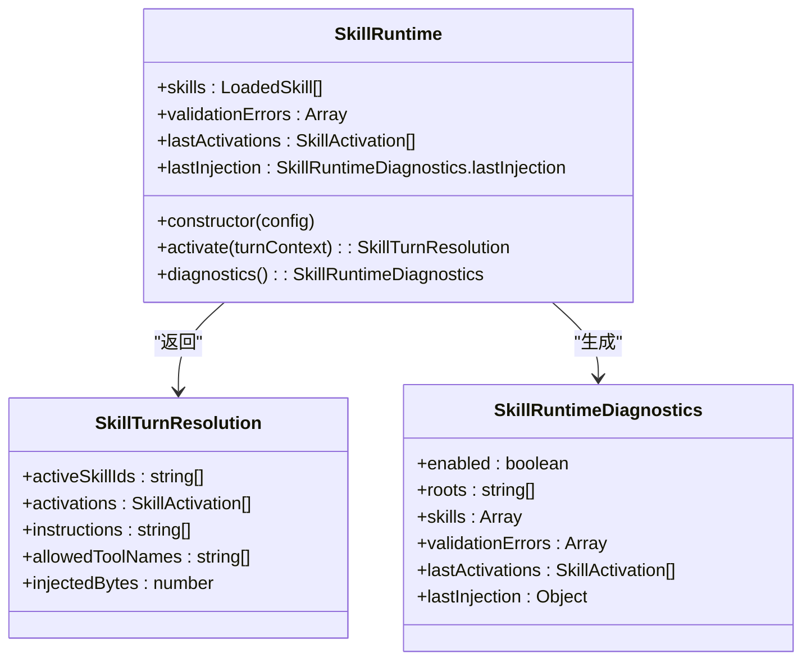
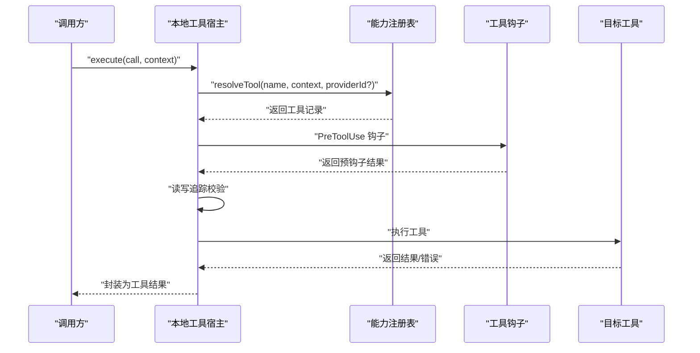
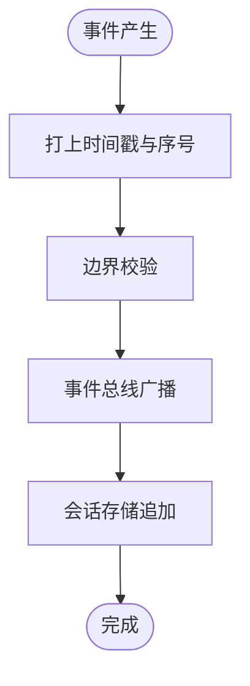
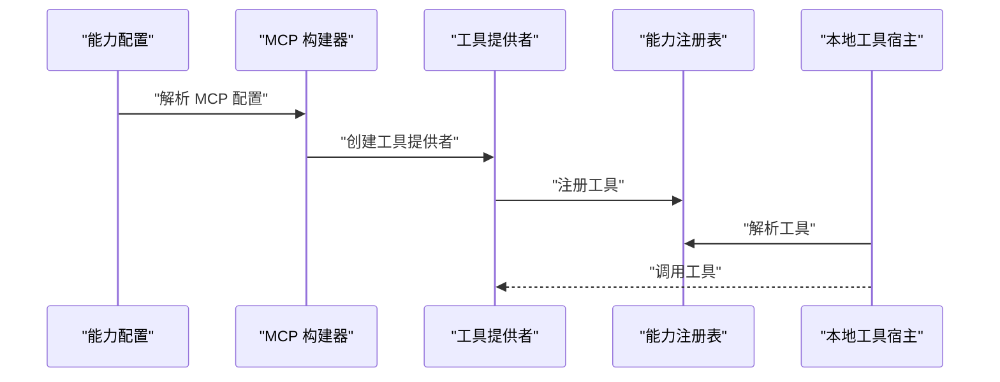
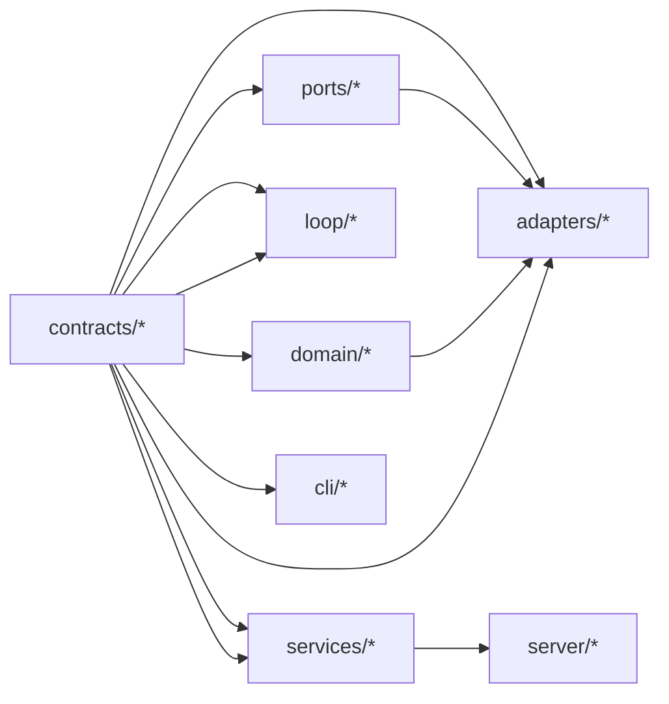
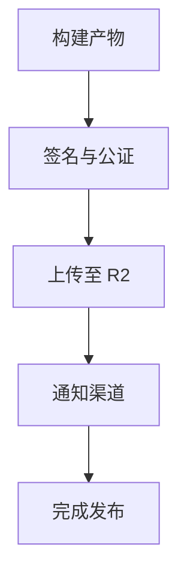

# 扩展开发

<cite>
**本文引用的文件**
- [kun/src/skills/skill-runtime.ts](file://kun/src/skills/skill-runtime.ts)
- [kun/src/server/routes/skills.ts](file://kun/src/server/routes/skills.ts)
- [kun/src/adapters/tool/capability-registry.ts](file://kun/src/adapters/tool/capability-registry.ts)
- [kun/src/adapters/tool/local-tool-host.ts](file://kun/src/adapters/tool/local-tool-host.ts)
- [kun/src/adapters/tool/mcp-tool-provider.ts](file://kun/src/adapters/tool/mcp-tool-provider.ts)
- [kun/src/adapters/tool/builtin-tools.ts](file://kun/src/adapters/tool/builtin-tools.ts)
- [kun/tests/mcp-tool-provider.test.ts](file://kun/tests/mcp-tool-provider.test.ts)
- [kun/src/ports/event-bus.ts](file://kun/src/ports/event-bus.ts)
- [docs/kun-contributing.md](file://docs/kun-contributing.md)
- [docs/kun-contributing.en.md](file://docs/kun-contributing.en.md)
- [kun/src/cli/serve.ts](file://kun/src/cli/serve.ts)
- [kun/src/cli/agent-cli.ts](file://kun/src/cli/agent-cli.ts)
- [kun/src/config/kun-config.ts](file://kun/src/config/kun-config.ts)
- [kun/src/shared/gui-plan.ts](file://kun/src/shared/gui-plan.ts)
- [kun/src/main/claw-runtime.ts](file://kun/src/main/claw-runtime.ts)
- [kun/src/main/claw-schedule-mcp-config.ts](file://kun/src/main/claw-schedule-mcp-config.ts)
- [kun/src/main/claw-schedule-mcp-server.ts](file://kun/src/main/claw-schedule-mcp-server.ts)
- [kun/src/main/ipc/register-app-ipc-handlers.ts](file://kun/src/main/ipc/register-app-ipc-handlers.ts)
- [kun/src/main/services/skill-service.ts](file://kun/src/main/services/skill-service.ts)
- [kun/src/renderer/src/agent/runtime-client.ts](file://kun/src/renderer/src/agent/runtime-client.ts)
- [kun/src/renderer/src/components/plugin-marketplace-runtime.ts](file://kun/src/renderer/src/components/plugin-marketplace-runtime.ts)
- [kun/src/renderer/src/lib/load-kun-diagnostics.ts](file://kun/src/renderer/src/lib/load-kun-diagnostics.ts)
- [scripts/release.sh](file://scripts/release.sh)
- [scripts/release-all-mac.sh](file://scripts/release-all-mac.sh)
- [scripts/mac-notarize.cjs](file://scripts/mac-notarize.cjs)
- [scripts/publish-r2.mjs](file://scripts/publish-r2.mjs)
</cite>

## 目录
1. [简介](#简介)
2. [项目结构](#项目结构)
3. [核心组件](#核心组件)
4. [架构总览](#架构总览)
5. [详细组件分析](#详细组件分析)
6. [依赖分析](#依赖分析)
7. [性能考量](#性能考量)
8. [故障排查指南](#故障排查指南)
9. [结论](#结论)
10. [附录](#附录)

## 简介
本指南面向希望为 DeepSeek GUI 扩展开发的工程师，聚焦三大扩展领域：技能系统（Skills）、工具系统（Tools）与插件系统（Plugins）。内容涵盖技能创建与配置、工具接口与注册机制、MCP 工具提供者集成、内置工具扩展、事件系统与生命周期、调试与测试方法，以及发布流程的最佳实践。

## 项目结构
从扩展开发视角，以下模块最为关键：
- 技能系统：技能运行时、技能路由、技能服务
- 工具系统：能力注册表、本地工具宿主、MCP 工具提供者、内置工具
- 插件系统：IPC 注册、渲染端运行时客户端、插件市场运行时
- 事件系统：事件总线端口、贡献文档中的事件模型
- 配置与 CLI：能力配置、服务入口、命令行工具
- 发布脚本：跨平台打包与分发

**图表来源**
- [kun/src/skills/skill-runtime.ts:85-120](file://kun/src/skills/skill-runtime.ts#L85-L120)
- [kun/src/server/routes/skills.ts:1-20](file://kun/src/server/routes/skills.ts#L1-L20)
- [kun/src/adapters/tool/capability-registry.ts:49-126](file://kun/src/adapters/tool/capability-registry.ts#L49-L126)
- [kun/src/adapters/tool/local-tool-host.ts:106-143](file://kun/src/adapters/tool/local-tool-host.ts#L106-L143)
- [kun/src/adapters/tool/mcp-tool-provider.ts:94-333](file://kun/src/adapters/tool/mcp-tool-provider.ts#L94-L333)
- [kun/src/adapters/tool/builtin-tools.ts:1-200](file://kun/src/adapters/tool/builtin-tools.ts#L1-L200)
- [kun/src/ports/event-bus.ts:1-15](file://kun/src/ports/event-bus.ts#L1-L15)
- [kun/src/main/ipc/register-app-ipc-handlers.ts:1-200](file://kun/src/main/ipc/register-app-ipc-handlers.ts#L1-L200)
- [kun/src/renderer/src/agent/runtime-client.ts:1-200](file://kun/src/renderer/src/agent/runtime-client.ts#L1-L200)
- [kun/src/renderer/src/components/plugin-marketplace-runtime.ts:1-200](file://kun/src/renderer/src/components/plugin-marketplace-runtime.ts#L1-L200)

**章节来源**
- [docs/kun-contributing.md:80-114](file://docs/kun-contributing.md#L80-L114)

## 核心组件
- 技能运行时：负责加载技能、触发匹配、指令注入、预算控制与诊断输出
- 能力注册表：统一管理工具提供者与工具，支持策略过滤与广告控制
- 本地工具宿主：执行工具调用、钩子链路、读写追踪与错误包装
- MCP 工具提供者：连接外部 MCP 服务器，动态构建工具提供者并支持搜索目录
- 内置工具集：预置常用工具（如文件、搜索、编辑等）
- 事件总线：事件驱动架构的核心端口，支持订阅、快照与持久化
- 插件市场运行时：渲染端插件生态的运行时支撑
- 应用 IPC 处理器：主进程与渲染进程间的消息桥接

**章节来源**
- [kun/src/skills/skill-runtime.ts:85-120](file://kun/src/skills/skill-runtime.ts#L85-L120)
- [kun/src/adapters/tool/capability-registry.ts:49-126](file://kun/src/adapters/tool/capability-registry.ts#L49-L126)
- [kun/src/adapters/tool/local-tool-host.ts:106-143](file://kun/src/adapters/tool/local-tool-host.ts#L106-L143)
- [kun/src/adapters/tool/mcp-tool-provider.ts:94-333](file://kun/src/adapters/tool/mcp-tool-provider.ts#L94-L333)
- [kun/src/adapters/tool/builtin-tools.ts:1-200](file://kun/src/adapters/tool/builtin-tools.ts#L1-L200)
- [kun/src/ports/event-bus.ts:1-15](file://kun/src/ports/event-bus.ts#L1-L15)
- [kun/src/renderer/src/components/plugin-marketplace-runtime.ts:1-200](file://kun/src/renderer/src/components/plugin-marketplace-runtime.ts#L1-L200)
- [kun/src/main/ipc/register-app-ipc-handlers.ts:1-200](file://kun/src/main/ipc/register-app-ipc-handlers.ts#L1-L200)

## 架构总览
DeepSeek GUI 采用“事件驱动 + 六边形架构”的组合模式：
- 上层 UI 通过运行时客户端与主进程交互
- 主进程通过服务与适配器协调域逻辑与外部系统
- 事件总线作为跨组件通信中枢，确保解耦与可观测性
- 工具系统以能力注册表为中心，统一接入本地与 MCP 工具
- 技能系统在对话回合中进行动态指令注入与工具限制

**图表来源**
- [kun/src/renderer/src/agent/runtime-client.ts:1-200](file://kun/src/renderer/src/agent/runtime-client.ts#L1-L200)
- [kun/src/main/ipc/register-app-ipc-handlers.ts:1-200](file://kun/src/main/ipc/register-app-ipc-handlers.ts#L1-L200)
- [kun/src/server/routes/skills.ts:1-20](file://kun/src/server/routes/skills.ts#L1-L20)
- [kun/src/cli/serve.ts:1-200](file://kun/src/cli/serve.ts#L1-L200)
- [kun/src/ports/event-bus.ts:1-15](file://kun/src/ports/event-bus.ts#L1-L15)
- [kun/src/adapters/tool/capability-registry.ts:49-126](file://kun/src/adapters/tool/capability-registry.ts#L49-L126)
- [kun/src/adapters/tool/local-tool-host.ts:106-143](file://kun/src/adapters/tool/local-tool-host.ts#L106-L143)
- [kun/src/adapters/tool/mcp-tool-provider.ts:94-333](file://kun/src/adapters/tool/mcp-tool-provider.ts#L94-L333)
- [kun/src/skills/skill-runtime.ts:85-120](file://kun/src/skills/skill-runtime.ts#L85-L120)

## 详细组件分析

### 技能系统：创建、配置与接口
- 技能运行时职责
  - 加载技能根目录，解析技能清单与触发条件
  - 基于回合上下文计算激活集合与指令注入
  - 控制指令预算与工具白名单，记录最近激活与注入统计
  - 暴露诊断信息（启用状态、根路径、技能列表、校验错误、最近激活）
- 关键数据结构
  - 技能运行时诊断对象包含启用状态、根路径、技能元数据、校验错误与最近注入统计
  - 技能回合解析结果包含活跃技能 ID、激活列表、指令数组、允许工具名与注入字节数
- 接口与路由
  - 列出技能的 HTTP 路由返回诊断信息，便于前端与 CLI 使用
- 开发要点
  - 在技能根目录放置符合规范的技能描述文件
  - 通过配置启用技能根路径，确保运行时可扫描到
  - 使用诊断接口定位加载与校验问题

**图表来源**
- [kun/src/skills/skill-runtime.ts:85-120](file://kun/src/skills/skill-runtime.ts#L85-L120)
- [kun/src/skills/skill-runtime.ts:57-78](file://kun/src/skills/skill-runtime.ts#L57-L78)
- [kun/src/skills/skill-runtime.ts:49-55](file://kun/src/skills/skill-runtime.ts#L49-L55)

**章节来源**
- [kun/src/skills/skill-runtime.ts:85-120](file://kun/src/skills/skill-runtime.ts#L85-L120)
- [kun/src/skills/skill-runtime.ts:57-78](file://kun/src/skills/skill-runtime.ts#L57-L78)
- [kun/src/server/routes/skills.ts:1-20](file://kun/src/server/routes/skills.ts#L1-L20)

### 工具系统：接口定义、注册与执行
- 能力注册表
  - 维护工具提供者与工具映射，支持重复检测、策略过滤与广告控制
  - 提供工具解析与诊断导出，用于权限与可用性检查
- 本地工具宿主
  - 执行前钩子链路、读写追踪、策略拒绝与错误包装
  - 支持中止信号、预钩子决策与最终调用
- MCP 工具提供者
  - 连接外部 MCP 服务器，动态构建工具提供者
  - 支持目录指纹、目录漂移检测与信任范围校验
  - 提供刷新目录工具以响应动态变更
- 内置工具集
  - 提供文件、搜索、编辑等常用工具的实现与类型定义

**图表来源**
- [kun/src/adapters/tool/local-tool-host.ts:106-143](file://kun/src/adapters/tool/local-tool-host.ts#L106-L143)
- [kun/src/adapters/tool/capability-registry.ts:81-99](file://kun/src/adapters/tool/capability-registry.ts#L81-L99)

**章节来源**
- [kun/src/adapters/tool/capability-registry.ts:49-126](file://kun/src/adapters/tool/capability-registry.ts#L49-L126)
- [kun/src/adapters/tool/local-tool-host.ts:106-143](file://kun/src/adapters/tool/local-tool-host.ts#L106-L143)
- [kun/src/adapters/tool/mcp-tool-provider.ts:94-333](file://kun/src/adapters/tool/mcp-tool-provider.ts#L94-L333)
- [kun/src/adapters/tool/builtin-tools.ts:1-200](file://kun/src/adapters/tool/builtin-tools.ts#L1-L200)

### 插件系统：生命周期与事件
- 生命周期与事件
  - 事件总线端口定义了发布、订阅、快照与重置能力
  - 贡献文档强调“事件驱动”与“单点发布”，确保一致性与可测试性
- 渲染端运行时客户端
  - 通过 IPC 与主进程交互，订阅事件流并更新 UI
- 插件市场运行时
  - 支撑插件生态的发现、安装与运行时行为
- 最佳实践
  - 将事件发布集中到单一入口，避免分散更新
  - 订阅时使用线程维度隔离与序列号快照恢复

**图表来源**
- [docs/kun-contributing.en.md:313-324](file://docs/kun-contributing.en.md#L313-L324)
- [kun/src/ports/event-bus.ts:1-15](file://kun/src/ports/event-bus.ts#L1-L15)

**章节来源**
- [kun/src/ports/event-bus.ts:1-15](file://kun/src/ports/event-bus.ts#L1-L15)
- [docs/kun-contributing.md:80-114](file://docs/kun-contributing.md#L80-L114)
- [docs/kun-contributing.en.md:299-332](file://docs/kun-contributing.en.md#L299-L332)
- [kun/src/renderer/src/agent/runtime-client.ts:1-200](file://kun/src/renderer/src/agent/runtime-client.ts#L1-L200)
- [kun/src/renderer/src/components/plugin-marketplace-runtime.ts:1-200](file://kun/src/renderer/src/components/plugin-marketplace-runtime.ts#L1-L200)

### MCP 工具提供者集成与内置工具扩展
- MCP 集成要点
  - 通过配置启用 MCP 并声明服务器，支持工作区信任范围与超时设置
  - 动态构建工具提供者，支持目录指纹与目录漂移检测
  - 提供刷新目录工具以响应外部工具变化
- 内置工具扩展
  - 在内置工具集中新增工具定义，遵循输入模式与策略约定
  - 通过能力注册表暴露给工具宿主
- 测试建议
  - 使用测试用例覆盖名称规范化、信任范围校验、目录刷新与诊断脱敏

**图表来源**
- [kun/src/adapters/tool/mcp-tool-provider.ts:94-333](file://kun/src/adapters/tool/mcp-tool-provider.ts#L94-L333)
- [kun/src/adapters/tool/capability-registry.ts:49-126](file://kun/src/adapters/tool/capability-registry.ts#L49-L126)
- [kun/tests/mcp-tool-provider.test.ts:56-512](file://kun/tests/mcp-tool-provider.test.ts#L56-L512)

**章节来源**
- [kun/src/adapters/tool/mcp-tool-provider.ts:94-333](file://kun/src/adapters/tool/mcp-tool-provider.ts#L94-L333)
- [kun/tests/mcp-tool-provider.test.ts:56-512](file://kun/tests/mcp-tool-provider.test.ts#L56-L512)
- [kun/src/adapters/tool/builtin-tools.ts:1-200](file://kun/src/adapters/tool/builtin-tools.ts#L1-L200)

## 依赖分析
- 层次依赖方向（自顶向下）：contracts → domain/ports → adapters/loop/services → server/cli
- 工具系统依赖关系：capability-registry 为核心枢纽，local-tool-host 与 mcp-tool-provider 通过它访问工具
- 技能系统依赖关系：server/routes/skills 依赖 runtime 的诊断能力
- 事件系统：各层仅通过事件总线端口交互，降低耦合

**图表来源**
- [docs/kun-contributing.md:80-89](file://docs/kun-contributing.md#L80-L89)

**章节来源**
- [docs/kun-contributing.md:80-89](file://docs/kun-contributing.md#L80-L89)

## 性能考量
- 工具调用与钩子链路应尽量短路与幂等，避免重复校验
- MCP 工具提供者应缓存目录指纹与客户端实例，减少频繁重建
- 技能指令注入需控制预算，防止上下文膨胀影响推理成本
- 事件总线采用内存广播与磁盘持久化分离，订阅端使用快照恢复以降低重连成本

[本节为通用指导，无需特定文件来源]

## 故障排查指南
- 技能相关
  - 通过技能路由查看诊断信息，确认启用状态、根路径与校验错误
  - 检查技能根目录结构与触发条件是否符合预期
- 工具相关
  - 使用能力注册表诊断导出来核对提供者与工具可用性
  - 在本地工具宿主执行失败时，优先检查钩子链路与读写追踪结果
  - 对于 MCP 工具，确认信任范围与目录指纹状态
- 事件相关
  - 使用事件总线快照与序列号恢复定位断点
  - 确保事件边界校验通过后再广播与持久化
- 插件相关
  - 检查 IPC 处理器与渲染端运行时客户端的连接状态
  - 插件市场运行时异常可通过诊断加载工具定位

**章节来源**
- [kun/src/server/routes/skills.ts:1-20](file://kun/src/server/routes/skills.ts#L1-L20)
- [kun/src/adapters/tool/capability-registry.ts:101-103](file://kun/src/adapters/tool/capability-registry.ts#L101-L103)
- [kun/src/adapters/tool/local-tool-host.ts:106-143](file://kun/src/adapters/tool/local-tool-host.ts#L106-L143)
- [kun/src/adapters/tool/mcp-tool-provider.ts:94-333](file://kun/src/adapters/tool/mcp-tool-provider.ts#L94-L333)
- [kun/src/renderer/src/lib/load-kun-diagnostics.ts:1-200](file://kun/src/renderer/src/lib/load-kun-diagnostics.ts#L1-L200)

## 结论
通过统一的能力注册表、事件驱动架构与清晰的工具/技能/插件扩展点，DeepSeek GUI 提供了高内聚、低耦合的扩展框架。开发者应优先利用诊断接口与测试用例快速定位问题，并遵循贡献文档的层次依赖与事件模型，确保扩展的稳定性与可维护性。

[本节为总结，无需特定文件来源]

## 附录

### 开发示例与最佳实践
- 技能开发
  - 在技能根目录创建符合规范的技能描述文件
  - 通过配置启用技能根路径，使用技能路由验证诊断
- 工具开发
  - 在内置工具集中定义新工具，确保输入模式与策略正确
  - 通过能力注册表暴露工具，使用本地工具宿主进行端到端测试
- MCP 集成
  - 在配置中启用 MCP 并声明服务器，设置信任范围
  - 使用测试用例覆盖名称规范化、信任范围与目录刷新
- 插件开发
  - 通过 IPC 处理器与渲染端运行时客户端建立通信
  - 使用插件市场运行时进行生态管理与运行时行为控制

**章节来源**
- [kun/src/skills/skill-runtime.ts:85-120](file://kun/src/skills/skill-runtime.ts#L85-L120)
- [kun/src/adapters/tool/builtin-tools.ts:1-200](file://kun/src/adapters/tool/builtin-tools.ts#L1-L200)
- [kun/src/adapters/tool/capability-registry.ts:49-126](file://kun/src/adapters/tool/capability-registry.ts#L49-L126)
- [kun/src/adapters/tool/mcp-tool-provider.ts:94-333](file://kun/src/adapters/tool/mcp-tool-provider.ts#L94-L333)
- [kun/src/main/ipc/register-app-ipc-handlers.ts:1-200](file://kun/src/main/ipc/register-app-ipc-handlers.ts#L1-L200)
- [kun/src/renderer/src/components/plugin-marketplace-runtime.ts:1-200](file://kun/src/renderer/src/components/plugin-marketplace-runtime.ts#L1-L200)

### 测试指导
- 单元测试
  - 使用现有测试用例风格，覆盖工具解析、策略过滤与 MCP 行为
- 集成测试
  - 通过 CLI 与 HTTP 路由验证技能与工具的端到端行为
- 回归测试
  - 事件模型变更时，确保事件边界校验与持久化一致性

**章节来源**
- [kun/tests/mcp-tool-provider.test.ts:56-512](file://kun/tests/mcp-tool-provider.test.ts#L56-L512)
- [kun/src/cli/agent-cli.ts:1-200](file://kun/src/cli/agent-cli.ts#L1-L200)
- [docs/kun-contributing.en.md:313-324](file://docs/kun-contributing.en.md#L313-L324)

### 发布流程
- 跨平台打包与签名
  - 使用发布脚本进行打包、签名与分发
  - macOS 平台包含公证与去 Quarantine 步骤
- 分发渠道
  - R2 对象存储用于发布资源分发

**图表来源**
- [scripts/release.sh:1-200](file://scripts/release.sh#L1-L200)
- [scripts/release-all-mac.sh:1-200](file://scripts/release-all-mac.sh#L1-L200)
- [scripts/mac-notarize.cjs:1-200](file://scripts/mac-notarize.cjs#L1-L200)
- [scripts/publish-r2.mjs:1-200](file://scripts/publish-r2.mjs#L1-L200)

**章节来源**
- [scripts/release.sh:1-200](file://scripts/release.sh#L1-L200)
- [scripts/release-all-mac.sh:1-200](file://scripts/release-all-mac.sh#L1-L200)
- [scripts/mac-notarize.cjs:1-200](file://scripts/mac-notarize.cjs#L1-L200)
- [scripts/publish-r2.mjs:1-200](file://scripts/publish-r2.mjs#L1-L200)