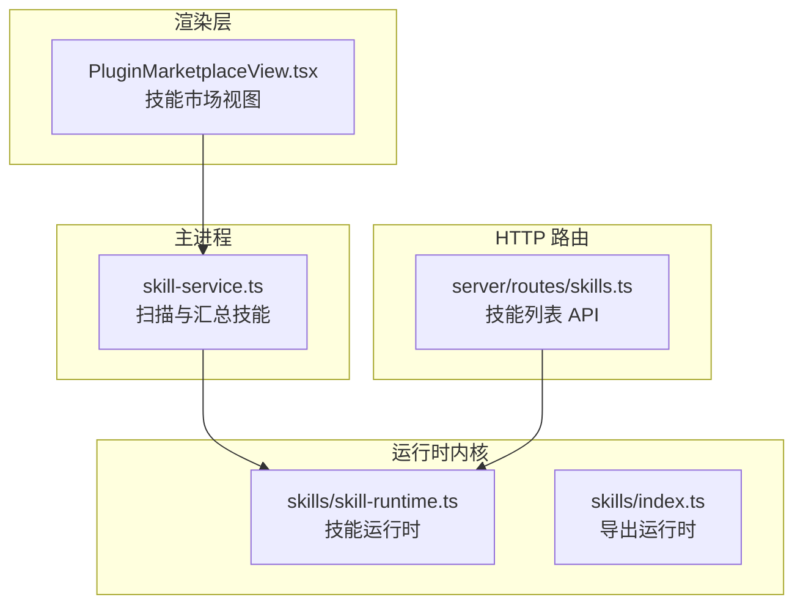
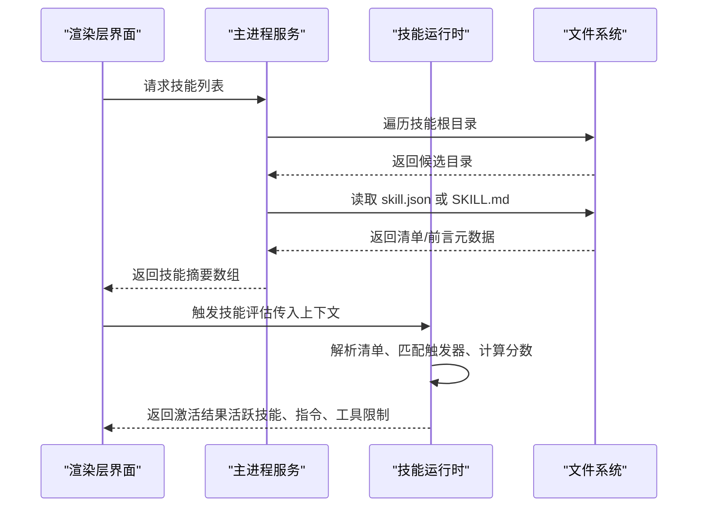
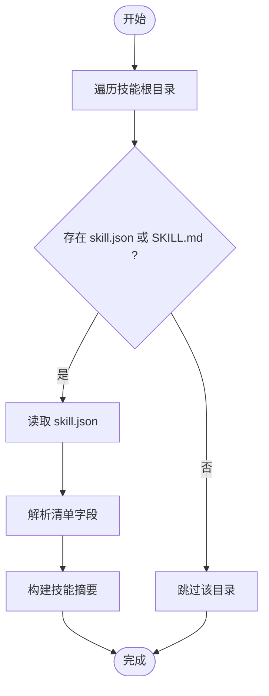
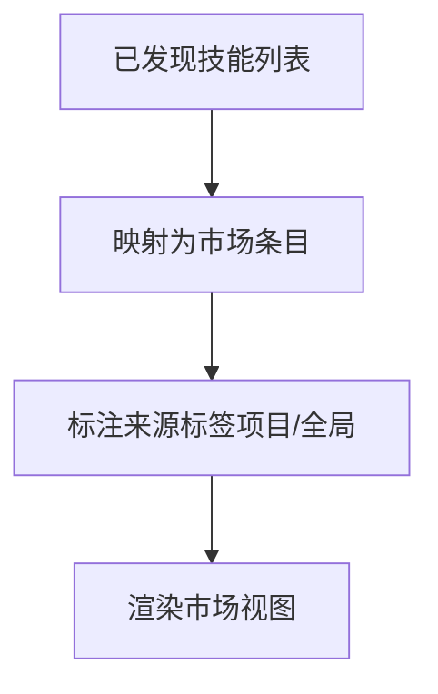
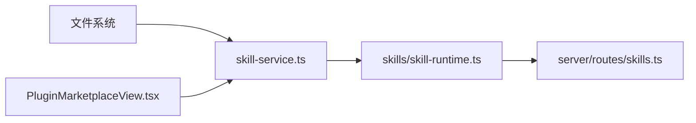
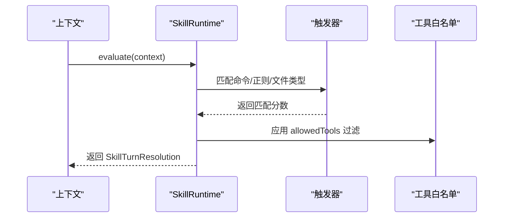

# 技能开发

<cite>
**本文引用的文件**
- [kun/src/skills/index.ts](file://kun/src/skills/index.ts)
- [kun/src/skills/skill-runtime.ts](file://kun/src/skills/skill-runtime.ts)
- [src/main/services/skill-service.ts](file://src/main/services/skill-service.ts)
- [src/renderer/src/components/PluginMarketplaceView.tsx](file://src/renderer/src/components/PluginMarketplaceView.tsx)
- [kun/src/server/routes/skills.ts](file://kun/src/server/routes/skills.ts)
- [.codex/skills/openspec-apply-change/SKILL.md](file://.codex/skills/openspec-apply-change/SKILL.md)
- [.codex/skills/openspec-archive-change/SKILL.md](file://.codex/skills/openspec-archive-change/SKILL.md)
- [.codex/skills/openspec-explore/SKILL.md](file://.codex/skills/openspec-explore/SKILL.md)
- [.codex/skills/openspec-propose/SKILL.md](file://.codex/skills/openspec-propose/SKILL.md)
</cite>

## 目录
1. [简介](#简介)
2. [项目结构](#项目结构)
3. [核心组件](#核心组件)
4. [架构总览](#架构总览)
5. [详细组件分析](#详细组件分析)
6. [依赖关系分析](#依赖关系分析)
7. [性能考虑](#性能考虑)
8. [故障排查指南](#故障排查指南)
9. [结论](#结论)
10. [附录](#附录)

## 简介
本指南面向 DeepSeek GUI 的技能开发者，系统讲解技能系统的架构与工作机制，覆盖技能创建流程、配置文件格式、接口规范、生命周期管理；详解技能运行时的加载、初始化与执行流程；提供完整开发示例（模板、参数与返回值）、调试技巧、性能优化与错误处理策略，并给出测试方法、发布流程与最佳实践。

## 项目结构
技能系统由三部分协同构成：
- 运行时内核：在后端运行时中实现技能发现、解析、调度与注入。
- 主进程服务：负责扫描技能根目录、解析技能清单与入口文档，向渲染层暴露技能元数据。
- 渲染层界面：展示技能市场、技能卡片与来源标签，支持从已发现技能生成市场条目。



**图表来源**
- [src/main/services/skill-service.ts:141-176](file://src/main/services/skill-service.ts#L141-L176)
- [kun/src/skills/skill-runtime.ts:85-92](file://kun/src/skills/skill-runtime.ts#L85-L92)
- [kun/src/skills/index.ts:1-1](file://kun/src/skills/index.ts#L1-L1)
- [src/renderer/src/components/PluginMarketplaceView.tsx:271-283](file://src/renderer/src/components/PluginMarketplaceView.tsx#L271-L283)
- [kun/src/server/routes/skills.ts:1-20](file://kun/src/server/routes/skills.ts#L1-L20)

**章节来源**
- [src/main/services/skill-service.ts:141-176](file://src/main/services/skill-service.ts#L141-L176)
- [kun/src/skills/skill-runtime.ts:85-92](file://kun/src/skills/skill-runtime.ts#L85-L92)
- [kun/src/skills/index.ts:1-1](file://kun/src/skills/index.ts#L1-L1)
- [src/renderer/src/components/PluginMarketplaceView.tsx:271-283](file://src/renderer/src/components/PluginMarketplaceView.tsx#L271-L283)
- [kun/src/server/routes/skills.ts:1-20](file://kun/src/server/routes/skills.ts#L1-L20)

## 核心组件
- 技能运行时（SkillRuntime）
  - 负责技能清单解析、触发器匹配、指令预算控制、工具白名单过滤、激活记录与诊断输出。
  - 提供激活结果（包含活跃技能 ID、触发原因、分数、注入指令等）。
- 技能服务（主进程）
  - 扫描技能根目录，识别 skill.json 或 SKILL.md，构建技能摘要（含 id、name、description、root、entryPath、scope、legacy）。
- 渲染层技能市场
  - 将已发现技能转换为市场条目，标注来源（项目或全局），用于 UI 展示。
- HTTP 路由
  - 暴露技能列表与诊断信息，便于前端或外部工具查询。

**章节来源**
- [kun/src/skills/skill-runtime.ts:15-55](file://kun/src/skills/skill-runtime.ts#L15-L55)
- [src/main/services/skill-service.ts:141-176](file://src/main/services/skill-service.ts#L141-L176)
- [src/renderer/src/components/PluginMarketplaceView.tsx:271-283](file://src/renderer/src/components/PluginMarketplaceView.tsx#L271-L283)
- [kun/src/server/routes/skills.ts:1-20](file://kun/src/server/routes/skills.ts#L1-L20)

## 架构总览
技能系统采用“主进程扫描 + 运行时内核 + 渲染层展示”的分层设计。主进程负责发现与汇总技能元数据；运行时内核负责技能生命周期内的决策与注入；渲染层负责用户交互与市场展示；HTTP 路由提供诊断能力。



**图表来源**
- [src/main/services/skill-service.ts:141-176](file://src/main/services/skill-service.ts#L141-L176)
- [kun/src/skills/skill-runtime.ts:85-92](file://kun/src/skills/skill-runtime.ts#L85-L92)
- [kun/src/server/routes/skills.ts:1-20](file://kun/src/server/routes/skills.ts#L1-L20)

## 详细组件分析

### 技能运行时（SkillRuntime）
- 数据模型
  - 技能清单（SkillManifest）：包含 id、name、description、version、entry、triggers、allowedTools、assets、priority 等字段。
  - 已加载技能（LoadedSkill）：在运行时扩展了 root、entryPath、legacy 等路径与兼容性信息。
  - 激活结果（SkillActivation）：包含 skillId、reason、score。
  - 指令注入结果（SkillTurnResolution）：包含 activeSkillIds、activations、instructions、allowedToolNames、injectedBytes。
  - 诊断（SkillRuntimeDiagnostics）：包含启用状态、根目录、技能清单、校验错误、最近激活与注入统计。
- 关键行为
  - 加载与校验：基于 Zod Schema 对清单进行严格校验，记录校验错误。
  - 触发匹配：根据命令、提示词模式、文件类型进行匹配，计算分数并排序。
  - 指令预算：限制注入指令的字节数，避免过度膨胀。
  - 工具白名单：仅允许在 allowedTools 中声明的工具被调用。
  - 诊断输出：记录最近激活、注入统计与校验错误，便于排障。

```mermaid
classDiagram
class SkillManifest {
+string id
+string name
+string description
+string version
+string entry
+SkillTriggerManifest triggers
+string[] allowedTools
+string[] assets
+number priority
}
class LoadedSkill {
+string id
+string name
+string description
+string version
+string root
+string entryPath
+string entry
+SkillTriggerManifest triggers
+string[] allowedTools
+string[] assets
+number priority
+boolean legacy
}
class SkillActivation {
+string skillId
+string reason
+number score
}
class SkillTurnResolution {
+string[] activeSkillIds
+SkillActivation[] activations
+string[] instructions
+string[] allowedToolNames
+number injectedBytes
}
class SkillRuntime {
-LoadedSkill[] skills
-{root,message}[] validationErrors
-SkillActivation[] lastActivations
-SkillRuntimeDiagnostics.lastInjection lastInjection
+constructor(config)
+load(root)
+evaluate(context)
+diagnostics()
}
SkillRuntime --> LoadedSkill : "管理"
SkillRuntime --> SkillTurnResolution : "产出"
SkillManifest --> LoadedSkill : "实例化"
```

**图表来源**
- [kun/src/skills/skill-runtime.ts:15-55](file://kun/src/skills/skill-runtime.ts#L15-L55)
- [kun/src/skills/skill-runtime.ts:85-92](file://kun/src/skills/skill-runtime.ts#L85-L92)

**章节来源**
- [kun/src/skills/skill-runtime.ts:15-55](file://kun/src/skills/skill-runtime.ts#L15-L55)
- [kun/src/skills/skill-runtime.ts:85-92](file://kun/src/skills/skill-runtime.ts#L85-L92)

### 技能服务（主进程）
- 功能
  - 扫描技能根目录，识别包含 skill.json 或 SKILL.md 的目录作为候选。
  - 优先读取 skill.json 作为清单；若不存在则回退到 SKILL.md 并解析前言元数据。
  - 生成技能摘要（id、name、description、root、entryPath、scope、legacy）。
- 错误处理
  - 缺少必要字段时使用默认值或派生值（如 id 基于 name/slug/filename）。
  - 记录缺失入口或非法清单的情况，便于后续诊断。



**图表来源**
- [src/main/services/skill-service.ts:141-176](file://src/main/services/skill-service.ts#L141-L176)

**章节来源**
- [src/main/services/skill-service.ts:141-176](file://src/main/services/skill-service.ts#L141-L176)

### 渲染层技能市场
- 功能
  - 将已发现技能映射为市场条目，标注来源（项目/全局）。
  - 支持从技能清单生成市场内容（标题、描述、说明文本）。
- 用途
  - 在插件/技能市场页面展示技能卡片与来源标签，辅助用户选择与安装。



**图表来源**
- [src/renderer/src/components/PluginMarketplaceView.tsx:271-283](file://src/renderer/src/components/PluginMarketplaceView.tsx#L271-L283)

**章节来源**
- [src/renderer/src/components/PluginMarketplaceView.tsx:271-283](file://src/renderer/src/components/PluginMarketplaceView.tsx#L271-L283)

### HTTP 路由（技能列表）
- 功能
  - 暴露技能启用状态、根目录、技能清单与校验错误，便于前端或外部工具查询。
- 使用场景
  - 开发者面板、健康检查、自动化集成。

**章节来源**
- [kun/src/server/routes/skills.ts:1-20](file://kun/src/server/routes/skills.ts#L1-L20)

## 依赖关系分析
- 组件耦合
  - 主进程服务与文件系统耦合，负责发现与解析。
  - 技能运行时与主进程服务解耦，通过配置与诊断接口交互。
  - 渲染层仅依赖主进程提供的摘要数据，不直接访问文件系统。
- 外部依赖
  - Zod 用于清单字段的强类型校验。
  - Node 文件系统 API 用于读取清单与文档。
- 可能的循环依赖
  - 当前模块职责清晰，未见循环依赖迹象。



**图表来源**
- [src/main/services/skill-service.ts:141-176](file://src/main/services/skill-service.ts#L141-L176)
- [kun/src/skills/skill-runtime.ts:85-92](file://kun/src/skills/skill-runtime.ts#L85-L92)
- [kun/src/server/routes/skills.ts:1-20](file://kun/src/server/routes/skills.ts#L1-L20)
- [src/renderer/src/components/PluginMarketplaceView.tsx:271-283](file://src/renderer/src/components/PluginMarketplaceView.tsx#L271-L283)

**章节来源**
- [src/main/services/skill-service.ts:141-176](file://src/main/services/skill-service.ts#L141-L176)
- [kun/src/skills/skill-runtime.ts:85-92](file://kun/src/skills/skill-runtime.ts#L85-L92)
- [kun/src/server/routes/skills.ts:1-20](file://kun/src/server/routes/skills.ts#L1-L20)
- [src/renderer/src/components/PluginMarketplaceView.tsx:271-283](file://src/renderer/src/components/PluginMarketplaceView.tsx#L271-L283)

## 性能考虑
- 指令预算控制
  - 通过 instructionBudgetBytes 控制注入指令的字节上限，避免上下文膨胀导致性能下降。
- 激活数量限制
  - activeLimit 限制同时激活的技能数量，降低并发开销。
- 触发器匹配优化
  - 命令与正则模式应尽量精确，减少不必要的匹配成本。
- 工具白名单
  - 仅允许必要工具，减少运行时调用链与副作用。
- I/O 优化
  - 合理缓存已解析的清单与入口文档，避免重复读取。

[本节为通用建议，无需特定文件引用]

## 故障排查指南
- 清单校验失败
  - 检查 skill.json 字段是否符合 Schema；关注诊断输出中的 validationErrors。
- 入口文件缺失
  - 确保 entryPath 指向的文件存在；若使用 SKILL.md，确认前言元数据完整。
- 激活结果异常
  - 查看 lastActivations 与 lastInjection，确认激活分数、注入字节数与工具限制。
- 调试接口
  - 通过 HTTP 路由获取技能诊断信息，定位问题根因。

**章节来源**
- [kun/src/skills/skill-runtime.ts:57-78](file://kun/src/skills/skill-runtime.ts#L57-L78)
- [kun/src/server/routes/skills.ts:1-20](file://kun/src/server/routes/skills.ts#L1-L20)

## 结论
技能系统以“清单驱动 + 触发匹配 + 预算控制”为核心，结合主进程扫描与运行时内核，形成可扩展、可观测、易维护的技能生态。遵循本文的开发流程、配置规范与最佳实践，可高效构建高质量技能并稳定交付。

[本节为总结，无需特定文件引用]

## 附录

### 技能创建流程与配置规范
- 创建步骤
  - 在技能根目录放置 skill.json 或 SKILL.md。
  - 若使用 skill.json，确保包含 name、entry 等关键字段；若使用 SKILL.md，需在前言中提供 name 等元数据。
  - 在 entryPath 指定的入口文档中编写技能说明与指令。
- 清单字段（skill.json）
  - id、name、description、version、entry、triggers、allowedTools、assets、priority。
- 入口文档（SKILL.md）
  - 前言包含 name、description 等；正文为技能说明与指令。
- 触发器（triggers）
  - commands：命令前缀或关键词。
  - promptPatterns：正则表达式模式，用于匹配用户输入。
  - fileTypes：文件类型过滤，限定适用文件范围。

**章节来源**
- [kun/src/skills/skill-runtime.ts:15-25](file://kun/src/skills/skill-runtime.ts#L15-L25)
- [src/main/services/skill-service.ts:154-176](file://src/main/services/skill-service.ts#L154-L176)

### 接口规范与生命周期
- 生命周期阶段
  - 发现：主进程扫描根目录，识别候选技能。
  - 解析：读取清单或前言元数据，构建 LoadedSkill。
  - 注册：运行时加载技能，建立触发器与工具白名单。
  - 评估：接收上下文，匹配触发器，计算分数并排序。
  - 注入：按预算与工具限制生成指令，返回激活结果。
  - 诊断：记录校验错误、最近激活与注入统计。
- HTTP 接口
  - GET /skills：返回 enabled、roots、skills、validationErrors。

**章节来源**
- [src/main/services/skill-service.ts:141-176](file://src/main/services/skill-service.ts#L141-L176)
- [kun/src/skills/skill-runtime.ts:57-78](file://kun/src/skills/skill-runtime.ts#L57-L78)
- [kun/src/server/routes/skills.ts:1-20](file://kun/src/server/routes/skills.ts#L1-L20)

### 运行时工作原理（加载与执行）
- 加载
  - 读取 skill.json 或 SKILL.md，解析为 LoadedSkill。
  - 校验 triggers、allowedTools、assets 等字段。
- 初始化
  - 建立触发器索引与工具白名单。
  - 设置 activeLimit 与 instructionBudgetBytes。
- 执行
  - evaluate(context)：匹配触发器、计算分数、排序。
  - 生成 SkillTurnResolution：包含活跃技能、指令集合、工具限制与注入字节数。
- 诊断
  - diagnostics()：返回启用状态、根目录、技能清单、校验错误与最近注入统计。



**图表来源**
- [kun/src/skills/skill-runtime.ts:85-92](file://kun/src/skills/skill-runtime.ts#L85-L92)
- [kun/src/skills/skill-runtime.ts:49-55](file://kun/src/skills/skill-runtime.ts#L49-L55)

**章节来源**
- [kun/src/skills/skill-runtime.ts:85-92](file://kun/src/skills/skill-runtime.ts#L85-L92)
- [kun/src/skills/skill-runtime.ts:49-55](file://kun/src/skills/skill-runtime.ts#L49-L55)

### 完整开发示例（模板、参数与返回值）
- 示例技能目录
  - openspec-apply-change：包含 SKILL.md，展示“对变更的操作”模型说明。
  - openspec-archive-change、openspec-explore、openspec-propose：同上，分别对应归档、探索、提议场景。
- 参数定义
  - 清单字段：id、name、description、version、entry、triggers、allowedTools、assets、priority。
  - 入口文档前言：name、description 等。
- 返回值处理
  - SkillTurnResolution：activeSkillIds、activations、instructions、allowedToolNames、injectedBytes。
  - 渲染层：将技能摘要映射为市场条目，标注来源（项目/全局）。

**章节来源**
- [.codex/skills/openspec-apply-change/SKILL.md:153-157](file://.codex/skills/openspec-apply-change/SKILL.md#L153-L157)
- [.codex/skills/openspec-archive-change/SKILL.md](file://.codex/skills/openspec-archive-change/SKILL.md)
- [.codex/skills/openspec-explore/SKILL.md](file://.codex/skills/openspec-explore/SKILL.md)
- [.codex/skills/openspec-propose/SKILL.md](file://.codex/skills/openspec-propose/SKILL.md)
- [src/renderer/src/components/PluginMarketplaceView.tsx:271-283](file://src/renderer/src/components/PluginMarketplaceView.tsx#L271-L283)

### 调试技巧、性能优化与错误处理
- 调试
  - 使用 HTTP /skills 接口查看诊断信息。
  - 检查 validationErrors 与 lastActivations。
- 性能
  - 合理设置 activeLimit 与 instructionBudgetBytes。
  - 精简触发器与工具白名单。
- 错误处理
  - 缺失清单时回退到 SKILL.md 前言。
  - 对非法字段使用默认值或派生值，保证系统可用性。

**章节来源**
- [kun/src/server/routes/skills.ts:1-20](file://kun/src/server/routes/skills.ts#L1-L20)
- [kun/src/skills/skill-runtime.ts:57-78](file://kun/src/skills/skill-runtime.ts#L57-L78)
- [src/main/services/skill-service.ts:154-176](file://src/main/services/skill-service.ts#L154-L176)

### 测试方法、发布流程与最佳实践
- 测试
  - 单元测试：针对技能运行时的触发匹配、预算控制、工具白名单进行断言。
  - 集成测试：模拟主进程扫描与运行时评估，验证端到端流程。
- 发布
  - 将技能目录放入项目或全局技能根目录，确保 skill.json 或 SKILL.md 存在且有效。
  - 通过 /skills 接口验证诊断信息，确认无校验错误。
- 最佳实践
  - 明确 triggers 与 allowedTools，保持最小权限原则。
  - 控制指令长度与复杂度，避免超出预算。
  - 为每个技能提供清晰的 name、description 与使用说明。

[本节为通用建议，无需特定文件引用]