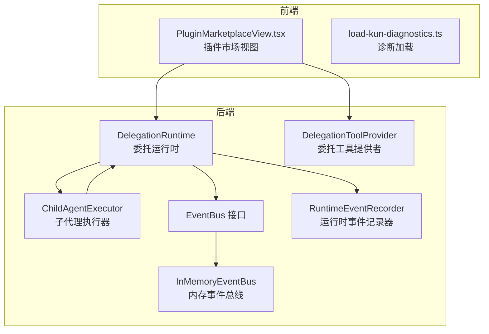
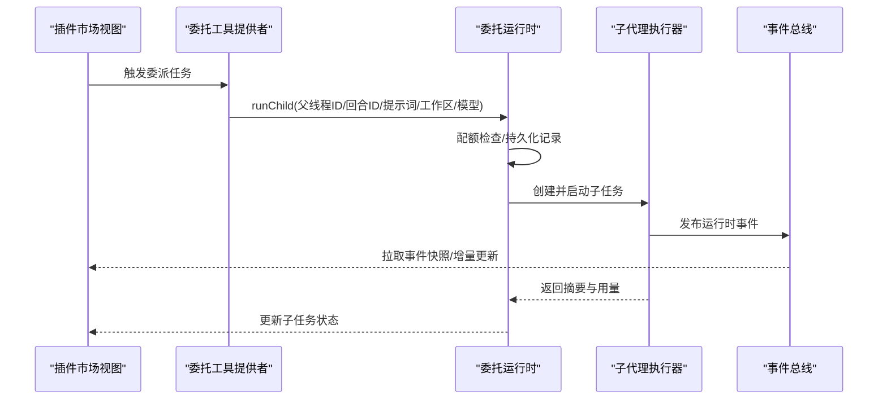
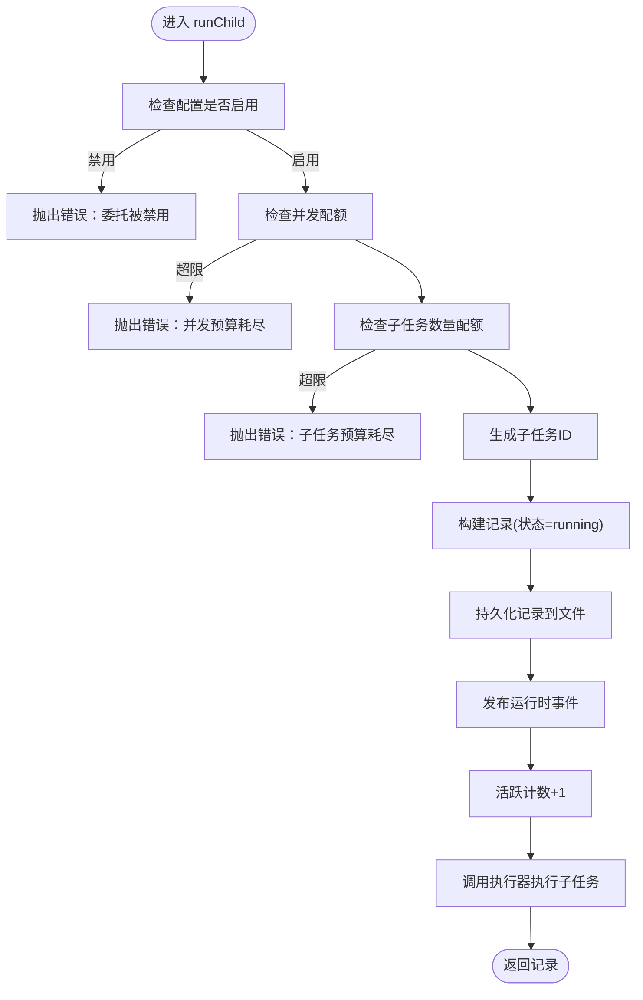
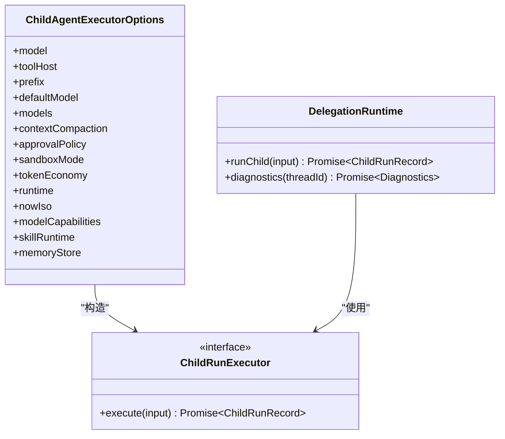
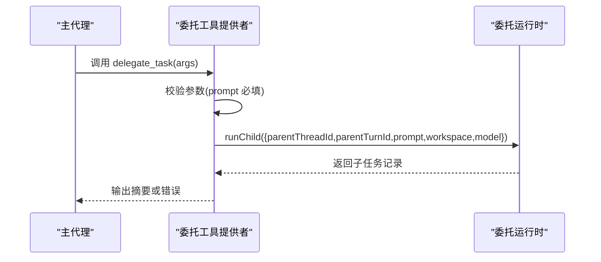
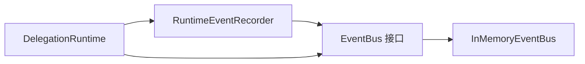
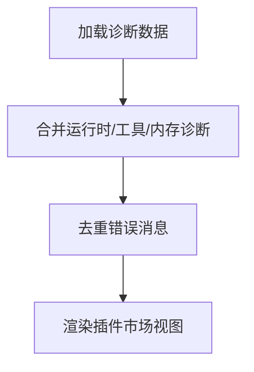
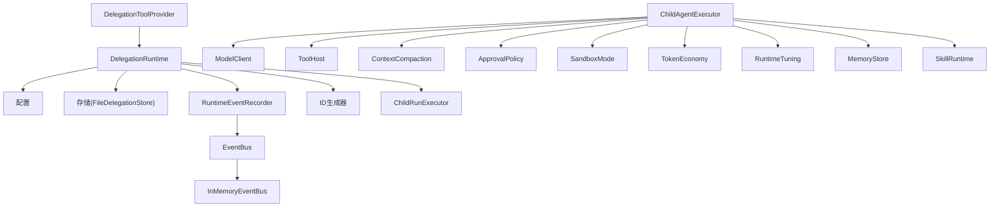

# 插件系统

<cite>
**本文引用的文件**
- [delegation-runtime.ts](file://kun/src/delegation/delegation-runtime.ts)
- [child-agent-executor.ts](file://kun/src/delegation/child-agent-executor.ts)
- [delegation-tool-provider.ts](file://kun/src/adapters/tool/delegation-tool-provider.ts)
- [event-bus.ts](file://kun/src/ports/event-bus.ts)
- [in-memory-event-bus.ts](file://kun/src/in-memory-event-bus.ts)
- [runtime-event-recorder.ts](file://kun/src/services/runtime-event-recorder.ts)
- [delegation-runtime.test.ts](file://kun/tests/delegation-runtime.test.ts)
- [PluginMarketplaceView.tsx](file://src/renderer/src/components/PluginMarketplaceView.tsx)
- [load-kun-diagnostics.ts](file://src/renderer/src/lib/load-kun-diagnostics.ts)
</cite>

## 目录
1. [引言](#引言)
2. [项目结构](#项目结构)
3. [核心组件](#核心组件)
4. [架构总览](#架构总览)
5. [详细组件分析](#详细组件分析)
6. [依赖关系分析](#依赖关系分析)
7. [性能考量](#性能考量)
8. [故障排查指南](#故障排查指南)
9. [结论](#结论)
10. [附录](#附录)

## 引言
本指南面向 DeepSeek GUI 的插件系统，聚焦“委托运行时”与“子代理执行器”的协作机制，系统阐述插件生命周期（加载、初始化、执行、卸载）、插件间通信与事件系统、状态管理、开发流程、测试方法、性能与安全注意事项，以及发布与版本兼容策略。文档以仓库中实际代码为依据，辅以可视化图示帮助理解。

## 项目结构
插件系统在后端由“委托运行时”与“子代理执行器”构成，在前端通过“插件市场视图”进行展示与交互；同时通过“事件总线”实现运行时事件的广播与订阅。

图表来源
- [delegation-runtime.ts:95-138](file://kun/src/delegation/delegation-runtime.ts#L95-L138)
- [child-agent-executor.ts:45-53](file://kun/src/delegation/child-agent-executor.ts#L45-L53)
- [delegation-tool-provider.ts:1-33](file://kun/src/adapters/tool/delegation-tool-provider.ts#L1-L33)
- [event-bus.ts:1-15](file://kun/src/ports/event-bus.ts#L1-L15)
- [in-memory-event-bus.ts](file://kun/src/in-memory-event-bus.ts)
- [runtime-event-recorder.ts](file://kun/src/services/runtime-event-recorder.ts)

章节来源
- [delegation-runtime.ts:95-138](file://kun/src/delegation/delegation-runtime.ts#L95-L138)
- [child-agent-executor.ts:45-53](file://kun/src/delegation/child-agent-executor.ts#L45-L53)
- [delegation-tool-provider.ts:1-33](file://kun/src/adapters/tool/delegation-tool-provider.ts#L1-L33)
- [event-bus.ts:1-15](file://kun/src/ports/event-bus.ts#L1-L15)
- [in-memory-event-bus.ts](file://kun/src/in-memory-event-bus.ts)
- [runtime-event-recorder.ts](file://kun/src/services/runtime-event-recorder.ts)

## 核心组件
- 委托运行时：负责子代理任务的调度、配额控制、持久化记录与事件上报。
- 子代理执行器：为每个子任务构建独立的运行环境（会话、线程、用量统计等），并执行具体任务。
- 委托工具提供者：将“委派任务”能力暴露为工具，供主代理调用。
- 事件总线与运行时事件记录器：统一记录与分发运行时事件，支持断线重连恢复。
- 插件市场视图（前端）：展示插件状态、刷新 MCP 运行时、安装/卸载插件等。

章节来源
- [delegation-runtime.ts:95-138](file://kun/src/delegation/delegation-runtime.ts#L95-L138)
- [child-agent-executor.ts:45-53](file://kun/src/delegation/child-agent-executor.ts#L45-L53)
- [delegation-tool-provider.ts:1-33](file://kun/src/adapters/tool/delegation-tool-provider.ts#L1-L33)
- [event-bus.ts:1-15](file://kun/src/ports/event-bus.ts#L1-L15)
- [in-memory-event-bus.ts](file://kun/src/in-memory-event-bus.ts)
- [runtime-event-recorder.ts](file://kun/src/services/runtime-event-recorder.ts)
- [PluginMarketplaceView.tsx:966-1146](file://src/renderer/src/components/PluginMarketplaceView.tsx#L966-L1146)

## 架构总览
委托运行时作为中枢，接收来自工具提供者的委派请求，校验配额与配置后创建子任务记录，并交由子代理执行器在隔离环境中执行。执行期间通过事件记录器与事件总线广播运行时事件，前端插件市场视图可据此刷新状态与提示。

图表来源
- [delegation-tool-provider.ts:28-33](file://kun/src/adapters/tool/delegation-tool-provider.ts#L28-L33)
- [delegation-runtime.ts:109-138](file://kun/src/delegation/delegation-runtime.ts#L109-L138)
- [child-agent-executor.ts:45-53](file://kun/src/delegation/child-agent-executor.ts#L45-L53)
- [event-bus.ts:1-15](file://kun/src/ports/event-bus.ts#L1-L15)

## 详细组件分析

### 委托运行时（DelegationRuntime）
职责与行为
- 配额控制：限制并发子任务数与单次对话最大子任务数。
- 生命周期管理：创建、更新、查询子任务记录；支持中止信号。
- 事件与诊断：记录子任务事件序列，提供诊断信息（如当前子任务数量）。
- 状态持久化：基于文件存储子任务记录，按创建时间排序。

关键流程
- runChild：参数校验、配额检查、生成唯一ID、写入记录、发布事件、计数+1。
- diagnostics：返回指定父线程下的子任务列表与统计信息。

图表来源
- [delegation-runtime.ts:95-138](file://kun/src/delegation/delegation-runtime.ts#L95-L138)

章节来源
- [delegation-runtime.ts:95-138](file://kun/src/delegation/delegation-runtime.ts#L95-L138)
- [delegation-runtime.test.ts:175-220](file://kun/tests/delegation-runtime.test.ts#L175-L220)

### 子代理执行器（ChildAgentExecutor）
职责与行为
- 环境隔离：为子任务创建独立的会话/线程存储、事件总线、ID生成器、飞行中跟踪器等。
- 执行编排：根据输入提示词与上下文，驱动模型客户端与工具宿主完成任务。
- 资源度量：统计提示/补全/总令牌用量，用于外部用量记录回调。

图表来源
- [child-agent-executor.ts:28-43](file://kun/src/delegation/child-agent-executor.ts#L28-L43)
- [child-agent-executor.ts:45-53](file://kun/src/delegation/child-agent-executor.ts#L45-L53)
- [delegation-runtime.ts:95-107](file://kun/src/delegation/delegation-runtime.ts#L95-L107)

章节来源
- [child-agent-executor.ts:45-53](file://kun/src/delegation/child-agent-executor.ts#L45-L53)

### 委托工具提供者（DelegationToolProvider）
职责与行为
- 将“委派任务”封装为本地工具，输入包含标签、提示词、工作区、模型等。
- 在执行时调用委托运行时创建子任务，并返回结果摘要与错误信息。

图表来源
- [delegation-tool-provider.ts:28-33](file://kun/src/adapters/tool/delegation-tool-provider.ts#L28-L33)
- [delegation-runtime.ts:109-138](file://kun/src/delegation/delegation-runtime.ts#L109-L138)

章节来源
- [delegation-tool-provider.ts:1-33](file://kun/src/adapters/tool/delegation-tool-provider.ts#L1-L33)

### 事件系统与状态管理
- 事件总线接口：定义发布、订阅、快照与重置能力。
- 内存事件总线：同步、内存中的事件分发，HTTP 层通过 seq 恢复。
- 运行时事件记录器：将运行时事件写入总线并分配序列号，供前端拉取。

图表来源
- [event-bus.ts:1-15](file://kun/src/ports/event-bus.ts#L1-L15)
- [in-memory-event-bus.ts](file://kun/src/in-memory-event-bus.ts)
- [runtime-event-recorder.ts](file://kun/src/services/runtime-event-recorder.ts)

章节来源
- [event-bus.ts:1-15](file://kun/src/ports/event-bus.ts#L1-L15)
- [in-memory-event-bus.ts](file://kun/src/in-memory-event-bus.ts)
- [runtime-event-recorder.ts](file://kun/src/services/runtime-event-recorder.ts)

### 前端插件市场与诊断
- 插件市场视图：展示推荐、个人、MCP 等分类，支持刷新 MCP 运行时状态。
- 诊断加载：聚合运行时、工具、内存等诊断信息，统一错误提示。

图表来源
- [PluginMarketplaceView.tsx:966-1146](file://src/renderer/src/components/PluginMarketplaceView.tsx#L966-L1146)
- [load-kun-diagnostics.ts:33-55](file://src/renderer/src/lib/load-kun-diagnostics.ts#L33-L55)

章节来源
- [PluginMarketplaceView.tsx:966-1146](file://src/renderer/src/components/PluginMarketplaceView.tsx#L966-L1146)
- [load-kun-diagnostics.ts:33-55](file://src/renderer/src/lib/load-kun-diagnostics.ts#L33-L55)

## 依赖关系分析
- 委托运行时依赖：配置、存储、事件记录器、ID 生成器、执行器、用量回调。
- 子代理执行器依赖：模型客户端、工具宿主、上下文压缩、审批策略、沙箱模式、令牌经济、运行时调优、技能运行时、内存存储。
- 工具提供者依赖：委托运行时实例，将其封装为可用工具。
- 事件系统：运行时事件记录器依赖事件总线与会话存储，用于分配序号与快照恢复。

图表来源
- [delegation-runtime.ts:95-107](file://kun/src/delegation/delegation-runtime.ts#L95-L107)
- [child-agent-executor.ts:28-43](file://kun/src/delegation/child-agent-executor.ts#L28-L43)
- [delegation-tool-provider.ts:1-33](file://kun/src/adapters/tool/delegation-tool-provider.ts#L1-L33)
- [event-bus.ts:1-15](file://kun/src/ports/event-bus.ts#L1-L15)
- [in-memory-event-bus.ts](file://kun/src/in-memory-event-bus.ts)
- [runtime-event-recorder.ts](file://kun/src/services/runtime-event-recorder.ts)

章节来源
- [delegation-runtime.ts:95-107](file://kun/src/delegation/delegation-runtime.ts#L95-L107)
- [child-agent-executor.ts:28-43](file://kun/src/delegation/child-agent-executor.ts#L28-L43)
- [delegation-tool-provider.ts:1-33](file://kun/src/adapters/tool/delegation-tool-provider.ts#L1-L33)
- [event-bus.ts:1-15](file://kun/src/ports/event-bus.ts#L1-L15)
- [in-memory-event-bus.ts](file://kun/src/in-memory-event-bus.ts)
- [runtime-event-recorder.ts](file://kun/src/services/runtime-event-recorder.ts)

## 性能考量
- 并发与配额：通过并发预算与子任务数量预算限制资源占用，避免雪崩效应。
- 上下文压缩与令牌经济：减少上下文长度与令牌消耗，提升吞吐。
- 事件快照：前端通过 since_seq 拉取增量事件，降低网络与渲染压力。
- 文件存储：子任务记录采用文件持久化，注意磁盘 IO 与目录清理策略。

章节来源
- [delegation-runtime.ts:95-138](file://kun/src/delegation/delegation-runtime.ts#L95-L138)
- [child-agent-executor.ts:28-43](file://kun/src/delegation/child-agent-executor.ts#L28-L43)
- [event-bus.ts:1-15](file://kun/src/ports/event-bus.ts#L1-L15)

## 故障排查指南
- 委托被禁用：当配置关闭时，runChild 将直接抛错。检查配置项与运行时状态。
- 并发预算耗尽：超过最大并发数时拒绝新任务。适当调整配置或等待释放。
- 子任务数量配额耗尽：超过单次对话最大子任务数。优化任务粒度或提升限额。
- 中止信号：传入的 AbortSignal 可导致子任务提前终止，需确保调用方正确处理。
- 事件丢失：内存事件总线为同步分发，断线后可通过 seq 恢复；若出现异常，检查事件记录器与前端拉取逻辑。
- 插件市场状态异常：MCP 运行时离线/漂移/错误时，前端会显示对应状态与提示，可尝试刷新或重新配置。

章节来源
- [delegation-runtime.test.ts:175-220](file://kun/tests/delegation-runtime.test.ts#L175-L220)
- [PluginMarketplaceView.tsx:999-1125](file://src/renderer/src/components/PluginMarketplaceView.tsx#L999-L1125)

## 结论
DeepSeek GUI 的插件系统以委托运行时为核心，结合子代理执行器与事件系统，实现了可控、可观测、可扩展的任务委派能力。前端通过插件市场视图提供直观的状态展示与操作入口。遵循配额与上下文优化策略，可在保证稳定性的同时提升整体性能。

## 附录

### 插件开发流程（基于现有能力）
- 定义工具：参考委托工具提供者，将业务封装为工具输入（标签、提示词、工作区、模型等）。
- 注册能力：通过工具注册机制将工具暴露给代理。
- 编排执行：在主代理中调用工具，委托运行时负责创建子任务并交由子代理执行器执行。
- 订阅事件：通过事件总线订阅运行时事件，实现状态更新与日志记录。
- 前端集成：在插件市场视图中展示 MCP 运行时状态与操作按钮，支持刷新与错误提示。

章节来源
- [delegation-tool-provider.ts:1-33](file://kun/src/adapters/tool/delegation-tool-provider.ts#L1-L33)
- [delegation-runtime.ts:95-138](file://kun/src/delegation/delegation-runtime.ts#L95-L138)
- [event-bus.ts:1-15](file://kun/src/ports/event-bus.ts#L1-L15)
- [PluginMarketplaceView.tsx:966-1146](file://src/renderer/src/components/PluginMarketplaceView.tsx#L966-L1146)

### 测试方法
- 单元测试：针对委托运行时的配额控制、中止逻辑、诊断输出进行断言。
- 集成测试：验证工具提供者到运行时再到执行器的完整链路。
- 前端诊断：通过诊断加载函数聚合后端状态，确保错误信息可读且不重复。

章节来源
- [delegation-runtime.test.ts:175-220](file://kun/tests/delegation-runtime.test.ts#L175-L220)
- [load-kun-diagnostics.ts:33-55](file://src/renderer/src/lib/load-kun-diagnostics.ts#L33-L55)

### 安全注意事项
- 沙箱模式：子代理执行器支持沙箱模式配置，建议在高风险场景启用。
- 审批策略：对敏感工具调用设置审批策略，防止未授权执行。
- 输入校验：工具输入严格校验必填字段与类型，避免空提示词等无效输入。
- 事件与日志：仅在必要范围内记录敏感信息，避免泄露。

章节来源
- [child-agent-executor.ts:28-43](file://kun/src/delegation/child-agent-executor.ts#L28-L43)
- [delegation-tool-provider.ts:28-33](file://kun/src/adapters/tool/delegation-tool-provider.ts#L28-L33)

### 发布与版本管理
- 版本兼容：前端插件市场视图对 MCP 运行时状态进行状态标签化与错误消息归一化，便于跨版本兼容。
- 错误提示：对特定错误模式（如运行时请求失败）提供友好提示，避免泄露内部细节。
- 配置迁移：变更配置项时，确保运行时与前端诊断加载逻辑具备向后兼容能力。

章节来源
- [PluginMarketplaceView.tsx:1072-1125](file://src/renderer/src/components/PluginMarketplaceView.tsx#L1072-L1125)
- [load-kun-diagnostics.ts:53-55](file://src/renderer/src/lib/load-kun-diagnostics.ts#L53-L55)